# Example: Diabetes

``` r
library(multinma)
options(mc.cores = parallel::detectCores())
```

    #> For execution on a local, multicore CPU with excess RAM we recommend calling
    #> options(mc.cores = parallel::detectCores())
    #> 
    #> Attaching package: 'multinma'
    #> The following objects are masked from 'package:stats':
    #> 
    #>     dgamma, pgamma, qgamma

This vignette describes the analysis of data on the number of new cases
of diabetes in 22 trials of 6 antihypertensive drugs ([Elliott and Meyer
2007](#ref-Elliott2007); [Dias et al. 2011](#ref-TSD2)). The data are
available in this package as `diabetes`:

``` r
head(diabetes)
#>   studyn studyc trtn         trtc   r    n time
#> 1      1  MRC-E    1     Diuretic  43 1081  5.8
#> 2      1  MRC-E    2      Placebo  34 2213  5.8
#> 3      1  MRC-E    3 Beta Blocker  37 1102  5.8
#> 4      2   EWPH    1     Diuretic  29  416  4.7
#> 5      2   EWPH    2      Placebo  20  424  4.7
#> 6      3   SHEP    1     Diuretic 140 1631  3.0
```

## Setting up the network

We begin by setting up the network. We have arm-level count data giving
the number of new cases of diabetes (`r`) out of the total (`n`) in each
arm, so we use the function
[`set_agd_arm()`](https://dmphillippo.github.io/multinma/reference/set_agd_arm.md).
For computational efficiency, we let “Beta Blocker” be set as the
network reference treatment by default. Elliott and Meyer
([2007](#ref-Elliott2007)) and Dias et al. ([2011](#ref-TSD2)) use
“Diuretic” as the reference, but it is a simple matter to transform the
results after fitting the NMA model.[¹](#fn1)

``` r
db_net <- set_agd_arm(diabetes, 
                      study = studyc,
                      trt = trtc,
                      r = r, 
                      n = n)
db_net
#> A network with 22 AgD studies (arm-based).
#> 
#> ------------------------------------------------------- AgD studies (arm-based) ---- 
#>  Study  Treatment arms                       
#>  AASK   3: Beta Blocker | ACE Inhibitor | CCB
#>  ALLHAT 3: ACE Inhibitor | CCB | Diuretic    
#>  ALPINE 2: ARB | Diuretic                    
#>  ANBP-2 2: ACE Inhibitor | Diuretic          
#>  ASCOT  2: Beta Blocker | CCB                
#>  CAPPP  2: Beta Blocker | ACE Inhibitor      
#>  CHARM  2: ARB | Placebo                     
#>  DREAM  2: ACE Inhibitor | Placebo           
#>  EWPH   2: Diuretic | Placebo                
#>  FEVER  2: CCB | Placebo                     
#>  ... plus 12 more studies
#> 
#>  Outcome type: count
#> ------------------------------------------------------------------------------------
#> Total number of treatments: 6
#> Total number of studies: 22
#> Reference treatment is: Beta Blocker
#> Network is connected
```

We also have details of length of follow-up in years in each trial
(`time`), which we will use as an offset with a cloglog link function to
model the data as rates. We do not have to specify this in the function
[`set_agd_arm()`](https://dmphillippo.github.io/multinma/reference/set_agd_arm.md):
any additional columns in the data (e.g. offsets or covariates, here the
column `time`) will automatically be made available in the network.

Plot the network structure.

``` r
plot(db_net, weight_edges = TRUE, weight_nodes = TRUE)
```

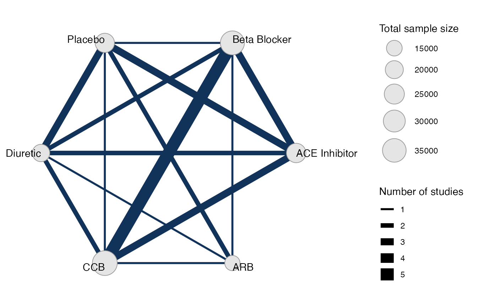

## Meta-analysis models

We fit both fixed effect (FE) and random effects (RE) models.

### Fixed effect meta-analysis

First, we fit a fixed effect model using the
[`nma()`](https://dmphillippo.github.io/multinma/reference/nma.md)
function with `trt_effects = "fixed"`. We use \mathrm{N}(0, 100^2) prior
distributions for the treatment effects d_k and study-specific
intercepts \mu_j. We can examine the range of parameter values implied
by these prior distributions with the
[`summary()`](https://rdrr.io/r/base/summary.html) method:

``` r
summary(normal(scale = 100))
#> A Normal prior distribution: location = 0, scale = 100.
#> 50% of the prior density lies between -67.45 and 67.45.
#> 95% of the prior density lies between -196 and 196.
```

The model is fitted using the
[`nma()`](https://dmphillippo.github.io/multinma/reference/nma.md)
function. We specify that a cloglog link will be used with
`link = "cloglog"` (the Binomial likelihood is the default for these
data), and specify the log follow-up time offset using the regression
formula `regression = ~offset(log(time))`.

``` r
db_fit_FE <- nma(db_net, 
                 trt_effects = "fixed",
                 link = "cloglog",
                 regression = ~offset(log(time)),
                 prior_intercept = normal(scale = 100),
                 prior_trt = normal(scale = 100))
#> Note: No treatment classes specified in network, any interactions in `regression` formula will be separate (independent) for each treatment.
#> Use set_*() argument `trt_class` and nma() argument `class_interactions` to change this.
#> Note: Setting "Beta Blocker" as the network reference treatment.
```

Basic parameter summaries are given by the
[`print()`](https://rdrr.io/r/base/print.html) method:

``` r
db_fit_FE
#> A fixed effects NMA with a binomial likelihood (cloglog link).
#> Regression model: ~offset(log(time)).
#> Inference for Stan model: binomial_1par.
#> 4 chains, each with iter=2000; warmup=1000; thin=1; 
#> post-warmup draws per chain=1000, total post-warmup draws=4000.
#> 
#>                       mean se_mean   sd      2.5%       25%       50%       75%     97.5%
#> d[ACE Inhibitor]     -0.30    0.00 0.05     -0.39     -0.34     -0.30     -0.27     -0.21
#> d[ARB]               -0.40    0.00 0.05     -0.49     -0.43     -0.40     -0.37     -0.31
#> d[CCB]               -0.20    0.00 0.03     -0.26     -0.22     -0.20     -0.18     -0.14
#> d[Diuretic]           0.05    0.00 0.06     -0.05      0.02      0.06      0.09      0.16
#> d[Placebo]           -0.19    0.00 0.05     -0.29     -0.23     -0.19     -0.16     -0.09
#> lp__             -37970.30    0.09 3.64 -37978.50 -37972.56 -37970.06 -37967.69 -37963.89
#>                  n_eff Rhat
#> d[ACE Inhibitor]  1657    1
#> d[ARB]            2483    1
#> d[CCB]            1915    1
#> d[Diuretic]       1868    1
#> d[Placebo]        1482    1
#> lp__              1824    1
#> 
#> Samples were drawn using NUTS(diag_e) at Fri Apr 17 08:34:23 2026.
#> For each parameter, n_eff is a crude measure of effective sample size,
#> and Rhat is the potential scale reduction factor on split chains (at 
#> convergence, Rhat=1).
```

By default, summaries of the study-specific intercepts \mu_j are hidden,
but could be examined by changing the `pars` argument:

``` r
# Not run
print(db_fit_FE, pars = c("d", "mu"))
```

The prior and posterior distributions can be compared visually using the
[`plot_prior_posterior()`](https://dmphillippo.github.io/multinma/reference/plot_prior_posterior.md)
function:

``` r
plot_prior_posterior(db_fit_FE)
```

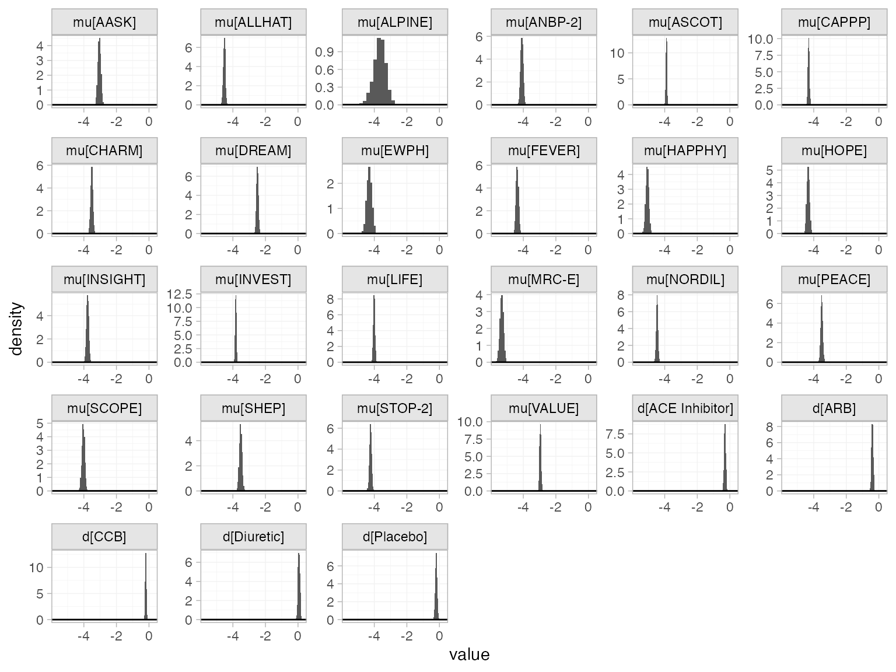

### Random effects meta-analysis

We now fit a random effects model using the
[`nma()`](https://dmphillippo.github.io/multinma/reference/nma.md)
function with `trt_effects = "random"`. Again, we use \mathrm{N}(0,
100^2) prior distributions for the treatment effects d_k and
study-specific intercepts \mu_j, and we additionally use a
\textrm{half-N}(5^2) prior for the heterogeneity standard deviation
\tau. We can examine the range of parameter values implied by these
prior distributions with the
[`summary()`](https://rdrr.io/r/base/summary.html) method:

``` r
summary(normal(scale = 100))
#> A Normal prior distribution: location = 0, scale = 100.
#> 50% of the prior density lies between -67.45 and 67.45.
#> 95% of the prior density lies between -196 and 196.
summary(half_normal(scale = 5))
#> A half-Normal prior distribution: scale = 5.
#> 50% of the prior density lies between 0 and 3.37.
#> 95% of the prior density lies between 0 and 9.8.
```

Fitting the RE model

``` r
db_fit_RE <- nma(db_net, 
                 trt_effects = "random",
                 link = "cloglog",
                 regression = ~offset(log(time)),
                 prior_intercept = normal(scale = 10),
                 prior_trt = normal(scale = 10),
                 prior_het = half_normal(scale = 5),
                 init_r = 0.5)
#> Note: No treatment classes specified in network, any interactions in `regression` formula will be separate (independent) for each treatment.
#> Use set_*() argument `trt_class` and nma() argument `class_interactions` to change this.
#> Note: Setting "Beta Blocker" as the network reference treatment.
```

Basic parameter summaries are given by the
[`print()`](https://rdrr.io/r/base/print.html) method:

``` r
db_fit_RE
#> A random effects NMA with a binomial likelihood (cloglog link).
#> Regression model: ~offset(log(time)).
#> Inference for Stan model: binomial_1par.
#> 4 chains, each with iter=2000; warmup=1000; thin=1; 
#> post-warmup draws per chain=1000, total post-warmup draws=4000.
#> 
#>                       mean se_mean   sd      2.5%       25%       50%       75%     97.5%
#> d[ACE Inhibitor]     -0.33    0.00 0.08     -0.49     -0.38     -0.33     -0.28     -0.18
#> d[ARB]               -0.40    0.00 0.09     -0.60     -0.46     -0.40     -0.34     -0.22
#> d[CCB]               -0.17    0.00 0.06     -0.29     -0.21     -0.17     -0.13     -0.04
#> d[Diuretic]           0.07    0.00 0.09     -0.10      0.01      0.07      0.13      0.25
#> d[Placebo]           -0.22    0.00 0.09     -0.39     -0.27     -0.22     -0.16     -0.05
#> lp__             -37980.88    0.21 6.79 -37995.13 -37985.14 -37980.45 -37976.16 -37968.39
#> tau                   0.13    0.00 0.04      0.06      0.10      0.12      0.15      0.23
#>                  n_eff Rhat
#> d[ACE Inhibitor]  2057    1
#> d[ARB]            2483    1
#> d[CCB]            2448    1
#> d[Diuretic]       2279    1
#> d[Placebo]        1870    1
#> lp__              1032    1
#> tau               1053    1
#> 
#> Samples were drawn using NUTS(diag_e) at Fri Apr 17 08:34:38 2026.
#> For each parameter, n_eff is a crude measure of effective sample size,
#> and Rhat is the potential scale reduction factor on split chains (at 
#> convergence, Rhat=1).
```

By default, summaries of the study-specific intercepts \mu_j and
study-specific relative effects \delta\_{jk} are hidden, but could be
examined by changing the `pars` argument:

``` r
# Not run
print(db_fit_RE, pars = c("d", "mu", "delta"))
```

The prior and posterior distributions can be compared visually using the
[`plot_prior_posterior()`](https://dmphillippo.github.io/multinma/reference/plot_prior_posterior.md)
function:

``` r
plot_prior_posterior(db_fit_RE, prior = c("trt", "het"))
```

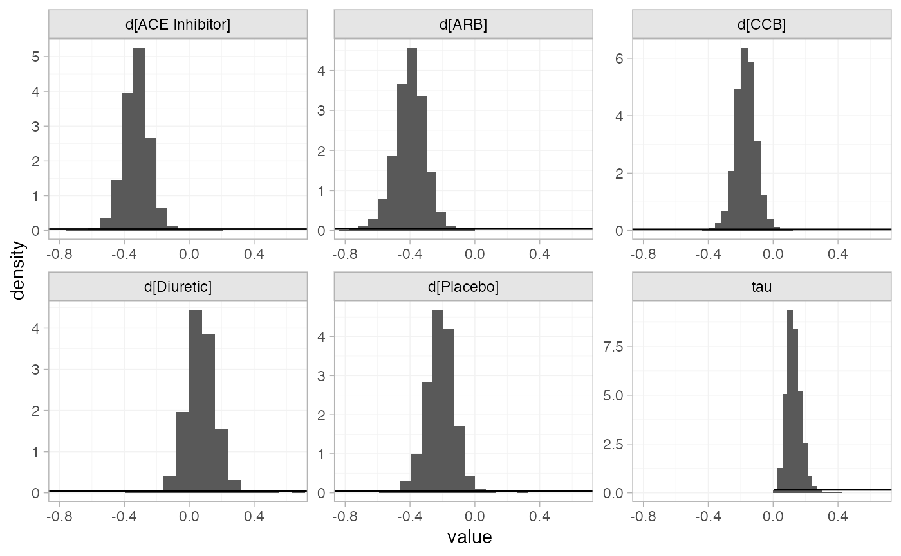

### Model comparison

Model fit can be checked using the
[`dic()`](https://dmphillippo.github.io/multinma/reference/dic.md)
function:

``` r
(dic_FE <- dic(db_fit_FE))
#> Residual deviance: 78.2 (on 48 data points)
#>                pD: 27
#>               DIC: 105.2
```

``` r
(dic_RE <- dic(db_fit_RE))
#> Residual deviance: 53.5 (on 48 data points)
#>                pD: 38.2
#>               DIC: 91.7
```

The FE model is a very poor fit to the data, with a residual deviance
much higher than the number of data points. The RE model fits the data
better, and has a much lower DIC; we prefer the RE model.

We can also examine the residual deviance contributions with the
corresponding [`plot()`](https://rdrr.io/r/graphics/plot.default.html)
method.

``` r
plot(dic_FE)
```

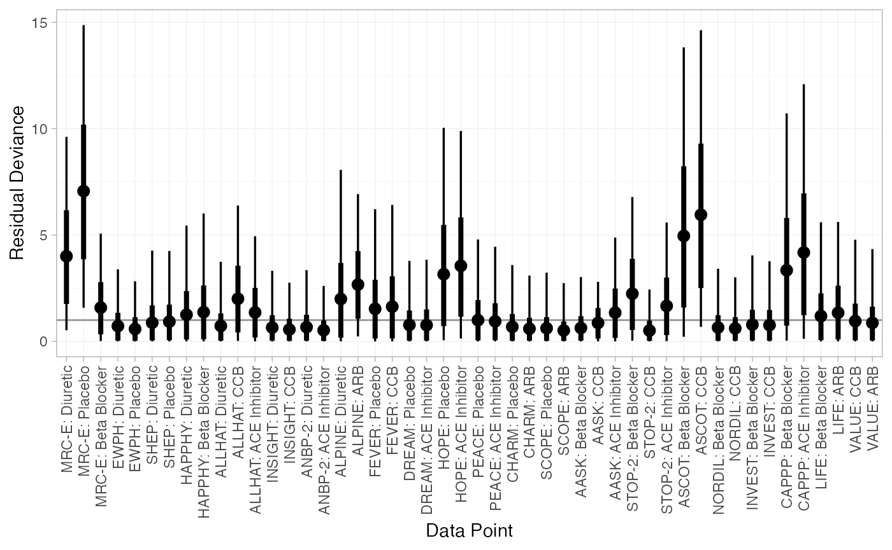

``` r
plot(dic_RE)
```

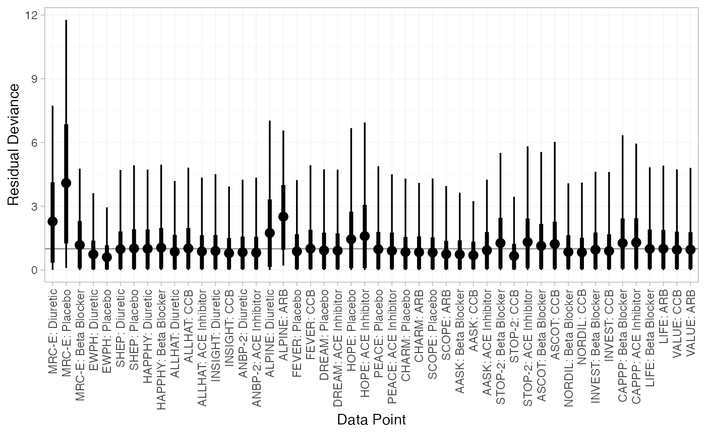

## Further results

For comparison with Elliott and Meyer ([2007](#ref-Elliott2007)) and
Dias et al. ([2011](#ref-TSD2)), we can produce relative effects against
“Diuretic” using the
[`relative_effects()`](https://dmphillippo.github.io/multinma/reference/relative_effects.md)
function with `trt_ref = "Diuretic"`:

``` r
(db_releff_FE <- relative_effects(db_fit_FE, trt_ref = "Diuretic"))
#>                   mean   sd  2.5%   25%   50%   75% 97.5% Bulk_ESS Tail_ESS Rhat
#> d[Beta Blocker]  -0.05 0.06 -0.16 -0.09 -0.06 -0.02  0.05     1895     2372    1
#> d[ACE Inhibitor] -0.36 0.05 -0.46 -0.39 -0.36 -0.32 -0.26     5041     3299    1
#> d[ARB]           -0.45 0.06 -0.58 -0.50 -0.45 -0.41 -0.33     4056     3578    1
#> d[CCB]           -0.25 0.05 -0.35 -0.29 -0.25 -0.22 -0.15     3358     3133    1
#> d[Placebo]       -0.25 0.06 -0.36 -0.28 -0.25 -0.21 -0.14     4578     3624    1
plot(db_releff_FE, ref_line = 0)
```

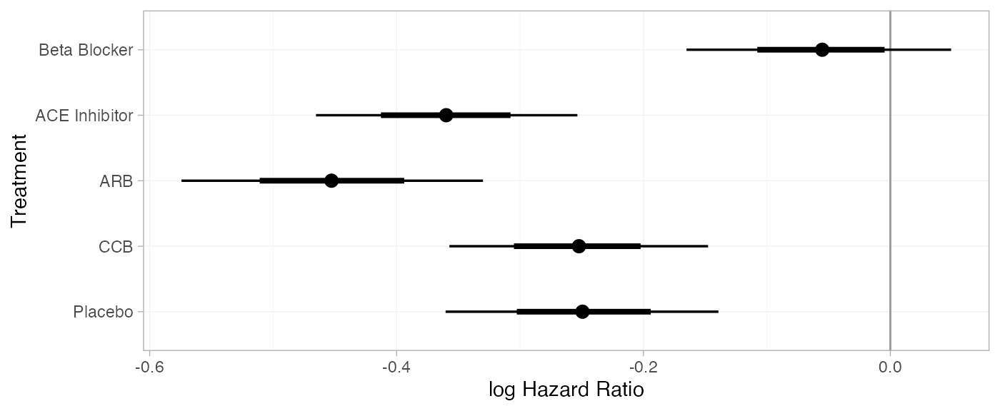

``` r
(db_releff_RE <- relative_effects(db_fit_RE, trt_ref = "Diuretic"))
#>                   mean   sd  2.5%   25%   50%   75% 97.5% Bulk_ESS Tail_ESS Rhat
#> d[Beta Blocker]  -0.07 0.09 -0.25 -0.13 -0.07 -0.01  0.10     2296     2559    1
#> d[ACE Inhibitor] -0.40 0.09 -0.58 -0.46 -0.40 -0.35 -0.24     4614     2802    1
#> d[ARB]           -0.47 0.11 -0.70 -0.54 -0.47 -0.40 -0.27     4229     2794    1
#> d[CCB]           -0.24 0.08 -0.41 -0.30 -0.24 -0.19 -0.08     4094     3073    1
#> d[Placebo]       -0.29 0.09 -0.48 -0.35 -0.29 -0.23 -0.12     4296     3191    1
plot(db_releff_RE, ref_line = 0)
```

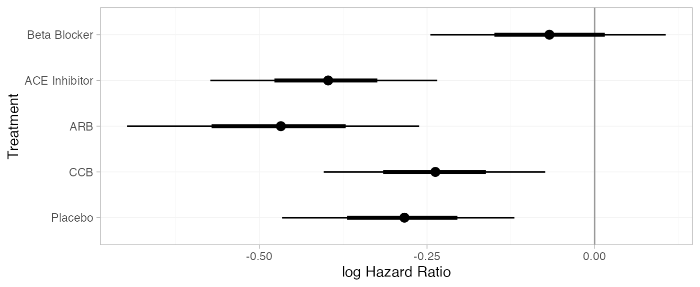

Dias et al. ([2011](#ref-TSD2)) produce absolute predictions of the
probability of developing diabetes after three years, assuming a Normal
distribution on the baseline cloglog probability of developing diabetes
on diuretic treatment with mean -4.2 and precision 1.11. We can
replicate these results using the
[`predict()`](https://rdrr.io/r/stats/predict.html) method. We specify a
data frame of `newdata`, containing the `time` offset(s) at which to
produce predictions (here only 3 years). The `baseline` argument takes a
[`distr()`](https://dmphillippo.github.io/multinma/reference/distr.md)
distribution object with which we specify the corresponding Normal
distribution on the baseline cloglog probability, and we set
`baseline_trt = "Diuretic"` to indicate that the baseline distribution
corresponds to “Diuretic” rather than the network reference “Beta
Blocker”. We set `type = "response"` to produce predicted event
probabilities (`type = "link"` would produce predicted cloglog
probabilities).

``` r
db_pred_FE <- predict(db_fit_FE, 
                      newdata = data.frame(time = 3),
                      baseline = distr(qnorm, mean = -4.2, sd = 1.11^-0.5), 
                      baseline_trt = "Diuretic",
                      type = "response")
db_pred_FE
#> ------------------------------------------------------------------ Study: New 1 ---- 
#> 
#>                            mean   sd 2.5%  25%  50%  75% 97.5% Bulk_ESS Tail_ESS Rhat
#> pred[New 1: Beta Blocker]  0.06 0.06 0.01 0.02 0.04 0.08  0.22     4072     3918    1
#> pred[New 1: ACE Inhibitor] 0.05 0.05 0.01 0.02 0.03 0.06  0.17     4089     3919    1
#> pred[New 1: ARB]           0.04 0.04 0.00 0.02 0.03 0.05  0.16     4034     3878    1
#> pred[New 1: CCB]           0.05 0.05 0.01 0.02 0.03 0.06  0.19     4072     3919    1
#> pred[New 1: Diuretic]      0.06 0.06 0.01 0.02 0.04 0.08  0.23     4064     3878    1
#> pred[New 1: Placebo]       0.05 0.05 0.01 0.02 0.03 0.06  0.19     4065     3879    1
plot(db_pred_FE)
```

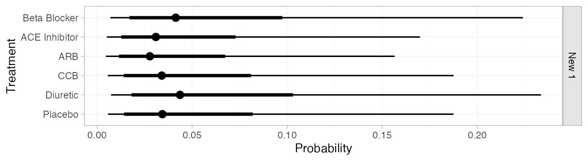

``` r
db_pred_RE <- predict(db_fit_RE, 
                      newdata = data.frame(time = 3),
                      baseline = distr(qnorm, mean = -4.2, sd = 1.11^-0.5), 
                      baseline_trt = "Diuretic",
                      type = "response")
db_pred_RE
#> ------------------------------------------------------------------ Study: New 1 ---- 
#> 
#>                            mean   sd 2.5%  25%  50%  75% 97.5% Bulk_ESS Tail_ESS Rhat
#> pred[New 1: Beta Blocker]  0.06 0.07 0.01 0.02 0.04 0.08  0.25     4344     4017    1
#> pred[New 1: ACE Inhibitor] 0.05 0.05 0.00 0.02 0.03 0.06  0.19     4355     3868    1
#> pred[New 1: ARB]           0.04 0.05 0.00 0.01 0.03 0.05  0.17     4349     3770    1
#> pred[New 1: CCB]           0.05 0.06 0.01 0.02 0.04 0.07  0.21     4358     3918    1
#> pred[New 1: Diuretic]      0.07 0.07 0.01 0.02 0.04 0.08  0.26     4365     3649    1
#> pred[New 1: Placebo]       0.05 0.06 0.01 0.02 0.03 0.06  0.20     4351     3892    1
plot(db_pred_RE)
```

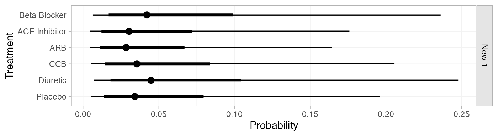

If the `baseline` and `newdata` arguments are omitted, predicted
probabilities will be produced for every study in the network based on
their follow-up times and estimated baseline cloglog probabilities
\mu_j:

``` r
db_pred_RE_studies <- predict(db_fit_RE, type = "response")
db_pred_RE_studies
#> ------------------------------------------------------------------- Study: AASK ---- 
#> 
#>                           mean   sd 2.5%  25%  50%  75% 97.5% Bulk_ESS Tail_ESS Rhat
#> pred[AASK: Beta Blocker]  0.17 0.02 0.14 0.16 0.17 0.18  0.20     5856     3012    1
#> pred[AASK: ACE Inhibitor] 0.12 0.01 0.10 0.12 0.12 0.13  0.15     4212     3415    1
#> pred[AASK: ARB]           0.12 0.01 0.09 0.11 0.12 0.13  0.15     4173     3318    1
#> pred[AASK: CCB]           0.15 0.01 0.12 0.14 0.14 0.15  0.18     5456     3418    1
#> pred[AASK: Diuretic]      0.18 0.02 0.14 0.17 0.18 0.19  0.22     3857     2770    1
#> pred[AASK: Placebo]       0.14 0.02 0.11 0.13 0.14 0.15  0.17     3806     3221    1
#> 
#> ----------------------------------------------------------------- Study: ALLHAT ---- 
#> 
#>                             mean   sd 2.5%  25%  50%  75% 97.5% Bulk_ESS Tail_ESS Rhat
#> pred[ALLHAT: Beta Blocker]  0.04 0.01 0.03 0.04 0.04 0.05  0.05     2788     2474    1
#> pred[ALLHAT: ACE Inhibitor] 0.03 0.00 0.02 0.03 0.03 0.03  0.04     3825     2905    1
#> pred[ALLHAT: ARB]           0.03 0.00 0.02 0.03 0.03 0.03  0.04     3956     2890    1
#> pred[ALLHAT: CCB]           0.04 0.00 0.03 0.03 0.04 0.04  0.05     3700     2577    1
#> pred[ALLHAT: Diuretic]      0.05 0.01 0.04 0.04 0.05 0.05  0.06     4129     2922    1
#> pred[ALLHAT: Placebo]       0.03 0.00 0.03 0.03 0.03 0.04  0.04     4004     2975    1
#> 
#> ----------------------------------------------------------------- Study: ALPINE ---- 
#> 
#>                             mean   sd 2.5%  25%  50%  75% 97.5% Bulk_ESS Tail_ESS Rhat
#> pred[ALPINE: Beta Blocker]  0.03 0.01 0.01 0.02 0.03 0.03  0.05     6620     2912    1
#> pred[ALPINE: ACE Inhibitor] 0.02 0.01 0.01 0.01 0.02 0.02  0.03     6889     3386    1
#> pred[ALPINE: ARB]           0.02 0.01 0.01 0.01 0.02 0.02  0.03     7425     3148    1
#> pred[ALPINE: CCB]           0.02 0.01 0.01 0.02 0.02 0.03  0.04     6995     3191    1
#> pred[ALPINE: Diuretic]      0.03 0.01 0.01 0.02 0.03 0.03  0.05     7301     2646    1
#> pred[ALPINE: Placebo]       0.02 0.01 0.01 0.02 0.02 0.03  0.04     7178     3340    1
#> 
#> ----------------------------------------------------------------- Study: ANBP-2 ---- 
#> 
#>                             mean   sd 2.5%  25%  50%  75% 97.5% Bulk_ESS Tail_ESS Rhat
#> pred[ANBP-2: Beta Blocker]  0.07 0.01 0.05 0.06 0.07 0.07  0.09     3256     3085    1
#> pred[ANBP-2: ACE Inhibitor] 0.05 0.01 0.04 0.04 0.05 0.05  0.06     4712     2832    1
#> pred[ANBP-2: ARB]           0.05 0.01 0.03 0.04 0.05 0.05  0.06     4132     2487    1
#> pred[ANBP-2: CCB]           0.06 0.01 0.04 0.05 0.06 0.06  0.08     4179     2957    1
#> pred[ANBP-2: Diuretic]      0.07 0.01 0.06 0.07 0.07 0.08  0.09     4963     3098    1
#> pred[ANBP-2: Placebo]       0.05 0.01 0.04 0.05 0.05 0.06  0.07     4525     2928    1
#> 
#> ------------------------------------------------------------------ Study: ASCOT ---- 
#> 
#>                            mean   sd 2.5%  25%  50%  75% 97.5% Bulk_ESS Tail_ESS Rhat
#> pred[ASCOT: Beta Blocker]  0.11 0.00 0.10 0.11 0.11 0.11  0.12     5333     2649    1
#> pred[ASCOT: ACE Inhibitor] 0.08 0.01 0.07 0.08 0.08 0.09  0.10     2443     2771    1
#> pred[ASCOT: ARB]           0.08 0.01 0.06 0.07 0.08 0.08  0.09     2712     2415    1
#> pred[ASCOT: CCB]           0.10 0.01 0.08 0.09 0.10 0.10  0.11     2756     3189    1
#> pred[ASCOT: Diuretic]      0.12 0.01 0.10 0.11 0.12 0.13  0.14     2466     2684    1
#> pred[ASCOT: Placebo]       0.09 0.01 0.08 0.09 0.09 0.10  0.11     2163     2352    1
#> 
#> ------------------------------------------------------------------ Study: CAPPP ---- 
#> 
#>                            mean   sd 2.5%  25%  50%  75% 97.5% Bulk_ESS Tail_ESS Rhat
#> pred[CAPPP: Beta Blocker]  0.07 0.00 0.07 0.07 0.07 0.08  0.08     4746     2697    1
#> pred[CAPPP: ACE Inhibitor] 0.05 0.00 0.05 0.05 0.05 0.06  0.06     2342     2517    1
#> pred[CAPPP: ARB]           0.05 0.01 0.04 0.05 0.05 0.05  0.06     2797     2515    1
#> pred[CAPPP: CCB]           0.06 0.00 0.05 0.06 0.06 0.07  0.07     3082     2980    1
#> pred[CAPPP: Diuretic]      0.08 0.01 0.07 0.08 0.08 0.08  0.10     2727     2647    1
#> pred[CAPPP: Placebo]       0.06 0.01 0.05 0.06 0.06 0.06  0.07     2199     2583    1
#> 
#> ------------------------------------------------------------------ Study: CHARM ---- 
#> 
#>                            mean   sd 2.5%  25%  50%  75% 97.5% Bulk_ESS Tail_ESS Rhat
#> pred[CHARM: Beta Blocker]  0.09 0.01 0.07 0.08 0.09 0.10  0.12     2847     2184    1
#> pred[CHARM: ACE Inhibitor] 0.07 0.01 0.05 0.06 0.07 0.07  0.09     4152     2493    1
#> pred[CHARM: ARB]           0.06 0.01 0.05 0.06 0.06 0.07  0.08     4657     2744    1
#> pred[CHARM: CCB]           0.08 0.01 0.06 0.07 0.08 0.08  0.10     3660     2636    1
#> pred[CHARM: Diuretic]      0.10 0.01 0.07 0.09 0.10 0.11  0.13     4246     2150    1
#> pred[CHARM: Placebo]       0.07 0.01 0.06 0.07 0.07 0.08  0.09     4524     2869    1
#> 
#> ------------------------------------------------------------------ Study: DREAM ---- 
#> 
#>                            mean   sd 2.5%  25%  50%  75% 97.5% Bulk_ESS Tail_ESS Rhat
#> pred[DREAM: Beta Blocker]  0.23 0.03 0.18 0.21 0.23 0.25  0.29     2903     2425    1
#> pred[DREAM: ACE Inhibitor] 0.17 0.02 0.13 0.16 0.17 0.18  0.21     4455     2468    1
#> pred[DREAM: ARB]           0.16 0.02 0.12 0.15 0.16 0.17  0.21     4566     1902    1
#> pred[DREAM: CCB]           0.20 0.03 0.15 0.18 0.19 0.21  0.26     4181     2786    1
#> pred[DREAM: Diuretic]      0.24 0.03 0.19 0.22 0.24 0.26  0.31     4122     2720    1
#> pred[DREAM: Placebo]       0.19 0.02 0.15 0.17 0.19 0.20  0.24     4520     2496    1
#> 
#> ------------------------------------------------------------------- Study: EWPH ---- 
#> 
#>                           mean   sd 2.5%  25%  50%  75% 97.5% Bulk_ESS Tail_ESS Rhat
#> pred[EWPH: Beta Blocker]  0.06 0.01 0.04 0.05 0.06 0.07  0.09     4138     2774    1
#> pred[EWPH: ACE Inhibitor] 0.05 0.01 0.03 0.04 0.04 0.05  0.06     5362     2974    1
#> pred[EWPH: ARB]           0.04 0.01 0.03 0.04 0.04 0.05  0.06     5205     3233    1
#> pred[EWPH: CCB]           0.05 0.01 0.04 0.05 0.05 0.06  0.07     5099     3149    1
#> pred[EWPH: Diuretic]      0.07 0.01 0.04 0.06 0.07 0.07  0.09     5204     2824    1
#> pred[EWPH: Placebo]       0.05 0.01 0.03 0.04 0.05 0.06  0.07     5542     3284    1
#> 
#> ------------------------------------------------------------------ Study: FEVER ---- 
#> 
#>                            mean   sd 2.5%  25%  50%  75% 97.5% Bulk_ESS Tail_ESS Rhat
#> pred[FEVER: Beta Blocker]  0.04 0.01 0.03 0.04 0.04 0.04  0.05     3362     2938    1
#> pred[FEVER: ACE Inhibitor] 0.03 0.00 0.02 0.03 0.03 0.03  0.04     5056     2710    1
#> pred[FEVER: ARB]           0.03 0.00 0.02 0.03 0.03 0.03  0.04     4880     2731    1
#> pred[FEVER: CCB]           0.04 0.00 0.03 0.03 0.03 0.04  0.05     4887     2850    1
#> pred[FEVER: Diuretic]      0.04 0.01 0.03 0.04 0.04 0.05  0.06     4819     2987    1
#> pred[FEVER: Placebo]       0.03 0.00 0.02 0.03 0.03 0.04  0.04     5062     2595    1
#> 
#> ----------------------------------------------------------------- Study: HAPPHY ---- 
#> 
#>                             mean sd 2.5%  25%  50%  75% 97.5% Bulk_ESS Tail_ESS Rhat
#> pred[HAPPHY: Beta Blocker]  0.02  0 0.02 0.02 0.02 0.03  0.03     5325     3139    1
#> pred[HAPPHY: ACE Inhibitor] 0.02  0 0.01 0.02 0.02 0.02  0.02     4392     3108    1
#> pred[HAPPHY: ARB]           0.02  0 0.01 0.02 0.02 0.02  0.02     4056     3239    1
#> pred[HAPPHY: CCB]           0.02  0 0.02 0.02 0.02 0.02  0.03     5196     3012    1
#> pred[HAPPHY: Diuretic]      0.03  0 0.02 0.02 0.03 0.03  0.03     3741     2871    1
#> pred[HAPPHY: Placebo]       0.02  0 0.02 0.02 0.02 0.02  0.02     3786     3426    1
#> 
#> ------------------------------------------------------------------- Study: HOPE ---- 
#> 
#>                           mean   sd 2.5%  25%  50%  75% 97.5% Bulk_ESS Tail_ESS Rhat
#> pred[HOPE: Beta Blocker]  0.06 0.01 0.04 0.05 0.06 0.06  0.08     2953     2322    1
#> pred[HOPE: ACE Inhibitor] 0.04 0.01 0.03 0.04 0.04 0.05  0.05     4718     2868    1
#> pred[HOPE: ARB]           0.04 0.01 0.03 0.04 0.04 0.04  0.05     4014     2932    1
#> pred[HOPE: CCB]           0.05 0.01 0.04 0.04 0.05 0.05  0.07     3985     2961    1
#> pred[HOPE: Diuretic]      0.06 0.01 0.05 0.06 0.06 0.07  0.08     4310     2846    1
#> pred[HOPE: Placebo]       0.05 0.01 0.04 0.04 0.05 0.05  0.06     5317     2758    1
#> 
#> ---------------------------------------------------------------- Study: INSIGHT ---- 
#> 
#>                              mean   sd 2.5%  25%  50%  75% 97.5% Bulk_ESS Tail_ESS Rhat
#> pred[INSIGHT: Beta Blocker]  0.07 0.01 0.05 0.06 0.06 0.07  0.09     3484     2451    1
#> pred[INSIGHT: ACE Inhibitor] 0.05 0.01 0.03 0.04 0.05 0.05  0.06     4837     2841    1
#> pred[INSIGHT: ARB]           0.04 0.01 0.03 0.04 0.04 0.05  0.06     4916     2970    1
#> pred[INSIGHT: CCB]           0.06 0.01 0.04 0.05 0.05 0.06  0.07     4759     2671    1
#> pred[INSIGHT: Diuretic]      0.07 0.01 0.05 0.06 0.07 0.08  0.09     5373     2697    1
#> pred[INSIGHT: Placebo]       0.05 0.01 0.04 0.05 0.05 0.06  0.07     4770     2832    1
#> 
#> ----------------------------------------------------------------- Study: INVEST ---- 
#> 
#>                             mean   sd 2.5%  25%  50%  75% 97.5% Bulk_ESS Tail_ESS Rhat
#> pred[INVEST: Beta Blocker]  0.08 0.00 0.08 0.08 0.08 0.08  0.09     7397     3036    1
#> pred[INVEST: ACE Inhibitor] 0.06 0.00 0.05 0.06 0.06 0.06  0.07     2489     2730    1
#> pred[INVEST: ARB]           0.06 0.01 0.05 0.05 0.06 0.06  0.07     2806     2645    1
#> pred[INVEST: CCB]           0.07 0.00 0.06 0.07 0.07 0.07  0.08     3012     2530    1
#> pred[INVEST: Diuretic]      0.09 0.01 0.07 0.08 0.09 0.09  0.11     2722     2775    1
#> pred[INVEST: Placebo]       0.07 0.01 0.06 0.06 0.07 0.07  0.08     2177     2229    1
#> 
#> ------------------------------------------------------------------- Study: LIFE ---- 
#> 
#>                           mean   sd 2.5%  25%  50%  75% 97.5% Bulk_ESS Tail_ESS Rhat
#> pred[LIFE: Beta Blocker]  0.08 0.00 0.07 0.08 0.08 0.08  0.09     6892     2730    1
#> pred[LIFE: ACE Inhibitor] 0.06 0.01 0.05 0.06 0.06 0.06  0.07     2738     2732    1
#> pred[LIFE: ARB]           0.06 0.01 0.05 0.05 0.06 0.06  0.07     2755     2209    1
#> pred[LIFE: CCB]           0.07 0.01 0.06 0.07 0.07 0.07  0.08     3356     2668    1
#> pred[LIFE: Diuretic]      0.09 0.01 0.07 0.08 0.09 0.09  0.11     2815     2952    1
#> pred[LIFE: Placebo]       0.07 0.01 0.05 0.06 0.07 0.07  0.08     2434     2256    1
#> 
#> ------------------------------------------------------------------ Study: MRC-E ---- 
#> 
#>                            mean sd 2.5%  25%  50%  75% 97.5% Bulk_ESS Tail_ESS Rhat
#> pred[MRC-E: Beta Blocker]  0.03  0 0.02 0.03 0.03 0.03  0.04     3892     2891    1
#> pred[MRC-E: ACE Inhibitor] 0.02  0 0.02 0.02 0.02 0.02  0.03     5151     3090    1
#> pred[MRC-E: ARB]           0.02  0 0.02 0.02 0.02 0.02  0.03     4746     3323    1
#> pred[MRC-E: CCB]           0.03  0 0.02 0.02 0.02 0.03  0.03     4712     2926    1
#> pred[MRC-E: Diuretic]      0.03  0 0.02 0.03 0.03 0.03  0.04     4156     3186    1
#> pred[MRC-E: Placebo]       0.02  0 0.02 0.02 0.02 0.03  0.03     4694     2919    1
#> 
#> ----------------------------------------------------------------- Study: NORDIL ---- 
#> 
#>                             mean   sd 2.5%  25%  50%  75% 97.5% Bulk_ESS Tail_ESS Rhat
#> pred[NORDIL: Beta Blocker]  0.05 0.00 0.04 0.05 0.05 0.05  0.06     6409     3060    1
#> pred[NORDIL: ACE Inhibitor] 0.04 0.00 0.03 0.03 0.04 0.04  0.04     3032     2857    1
#> pred[NORDIL: ARB]           0.03 0.00 0.03 0.03 0.03 0.04  0.04     3344     2688    1
#> pred[NORDIL: CCB]           0.04 0.00 0.04 0.04 0.04 0.04  0.05     3646     2922    1
#> pred[NORDIL: Diuretic]      0.05 0.01 0.04 0.05 0.05 0.06  0.06     2999     2891    1
#> pred[NORDIL: Placebo]       0.04 0.00 0.03 0.04 0.04 0.04  0.05     2516     2892    1
#> 
#> ------------------------------------------------------------------ Study: PEACE ---- 
#> 
#>                            mean   sd 2.5%  25%  50%  75% 97.5% Bulk_ESS Tail_ESS Rhat
#> pred[PEACE: Beta Blocker]  0.14 0.02 0.10 0.13 0.14 0.15  0.18     3180     2612    1
#> pred[PEACE: ACE Inhibitor] 0.10 0.01 0.08 0.09 0.10 0.11  0.13     4810     2940    1
#> pred[PEACE: ARB]           0.09 0.01 0.07 0.09 0.09 0.10  0.13     4642     2739    1
#> pred[PEACE: CCB]           0.12 0.02 0.09 0.11 0.12 0.13  0.15     4228     2993    1
#> pred[PEACE: Diuretic]      0.15 0.02 0.11 0.13 0.15 0.16  0.19     4225     2777    1
#> pred[PEACE: Placebo]       0.11 0.01 0.09 0.10 0.11 0.12  0.14     5101     2912    1
#> 
#> ------------------------------------------------------------------ Study: SCOPE ---- 
#> 
#>                            mean   sd 2.5%  25%  50%  75% 97.5% Bulk_ESS Tail_ESS Rhat
#> pred[SCOPE: Beta Blocker]  0.06 0.01 0.05 0.06 0.06 0.07  0.09     3469     2867    1
#> pred[SCOPE: ACE Inhibitor] 0.05 0.01 0.03 0.04 0.05 0.05  0.06     4796     3170    1
#> pred[SCOPE: ARB]           0.04 0.01 0.03 0.04 0.04 0.05  0.06     5110     2735    1
#> pred[SCOPE: CCB]           0.06 0.01 0.04 0.05 0.05 0.06  0.08     4690     2561    1
#> pred[SCOPE: Diuretic]      0.07 0.01 0.05 0.06 0.07 0.08  0.09     4700     2806    1
#> pred[SCOPE: Placebo]       0.05 0.01 0.04 0.05 0.05 0.06  0.07     5227     2991    1
#> 
#> ------------------------------------------------------------------- Study: SHEP ---- 
#> 
#>                           mean   sd 2.5%  25%  50%  75% 97.5% Bulk_ESS Tail_ESS Rhat
#> pred[SHEP: Beta Blocker]  0.09 0.01 0.06 0.08 0.09 0.09  0.11     3100     2510    1
#> pred[SHEP: ACE Inhibitor] 0.06 0.01 0.05 0.06 0.06 0.07  0.08     5233     2717    1
#> pred[SHEP: ARB]           0.06 0.01 0.04 0.05 0.06 0.06  0.08     4727     2877    1
#> pred[SHEP: CCB]           0.07 0.01 0.05 0.07 0.07 0.08  0.10     4437     3048    1
#> pred[SHEP: Diuretic]      0.09 0.01 0.07 0.08 0.09 0.10  0.12     4830     2836    1
#> pred[SHEP: Placebo]       0.07 0.01 0.05 0.06 0.07 0.08  0.09     5354     3210    1
#> 
#> ----------------------------------------------------------------- Study: STOP-2 ---- 
#> 
#>                             mean   sd 2.5%  25%  50%  75% 97.5% Bulk_ESS Tail_ESS Rhat
#> pred[STOP-2: Beta Blocker]  0.05 0.00 0.05 0.05 0.05 0.06  0.06     5026     2962    1
#> pred[STOP-2: ACE Inhibitor] 0.04 0.00 0.03 0.04 0.04 0.04  0.05     3322     3121    1
#> pred[STOP-2: ARB]           0.04 0.00 0.03 0.03 0.04 0.04  0.04     3328     3196    1
#> pred[STOP-2: CCB]           0.05 0.00 0.04 0.04 0.05 0.05  0.05     4536     3268    1
#> pred[STOP-2: Diuretic]      0.06 0.01 0.05 0.05 0.06 0.06  0.07     4019     3019    1
#> pred[STOP-2: Placebo]       0.04 0.00 0.03 0.04 0.04 0.05  0.05     3010     2734    1
#> 
#> ------------------------------------------------------------------ Study: VALUE ---- 
#> 
#>                            mean   sd 2.5%  25%  50%  75% 97.5% Bulk_ESS Tail_ESS Rhat
#> pred[VALUE: Beta Blocker]  0.20 0.02 0.15 0.18 0.19 0.21  0.25     3245     2085    1
#> pred[VALUE: ACE Inhibitor] 0.15 0.02 0.11 0.13 0.14 0.16  0.19     4617     2685    1
#> pred[VALUE: ARB]           0.14 0.02 0.10 0.13 0.13 0.15  0.17     4516     2850    1
#> pred[VALUE: CCB]           0.17 0.02 0.13 0.16 0.17 0.18  0.21     4583     2311    1
#> pred[VALUE: Diuretic]      0.21 0.03 0.16 0.19 0.21 0.22  0.27     4294     2406    1
#> pred[VALUE: Placebo]       0.16 0.02 0.12 0.15 0.16 0.17  0.21     4569     2700    1
plot(db_pred_RE_studies)
```

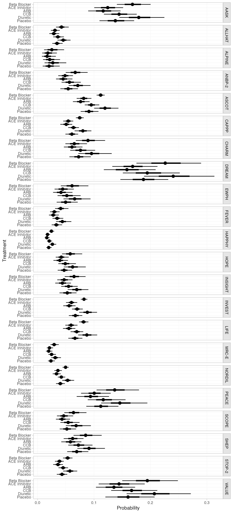

We can also produce treatment rankings, rank probabilities, and
cumulative rank probabilities.

``` r
(db_ranks <- posterior_ranks(db_fit_RE))
#>                     mean   sd 2.5% 25% 50% 75% 97.5% Bulk_ESS Tail_ESS Rhat
#> rank[Beta Blocker]  5.19 0.42    5   5   5   5     6     2951       NA    1
#> rank[ACE Inhibitor] 1.84 0.55    1   2   2   2     3     4176     3265    1
#> rank[ARB]           1.27 0.51    1   1   1   1     2     3740     3305    1
#> rank[CCB]           3.70 0.51    3   3   4   4     4     3664     3461    1
#> rank[Diuretic]      5.80 0.41    5   6   6   6     6     2907       NA    1
#> rank[Placebo]       3.20 0.59    2   3   3   4     4     3404     2810    1
plot(db_ranks)
```

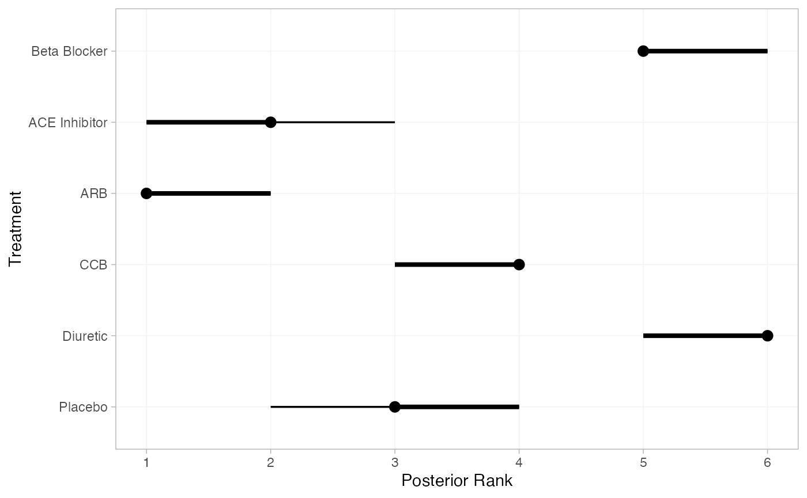

``` r
(db_rankprobs <- posterior_rank_probs(db_fit_RE))
#>                  p_rank[1] p_rank[2] p_rank[3] p_rank[4] p_rank[5] p_rank[6]
#> d[Beta Blocker]       0.00      0.00      0.00      0.01      0.79       0.2
#> d[ACE Inhibitor]      0.23      0.70      0.06      0.01      0.00       0.0
#> d[ARB]                0.76      0.22      0.02      0.00      0.00       0.0
#> d[CCB]                0.00      0.02      0.27      0.70      0.01       0.0
#> d[Diuretic]           0.00      0.00      0.00      0.00      0.19       0.8
#> d[Placebo]            0.00      0.07      0.65      0.27      0.00       0.0
plot(db_rankprobs)
```

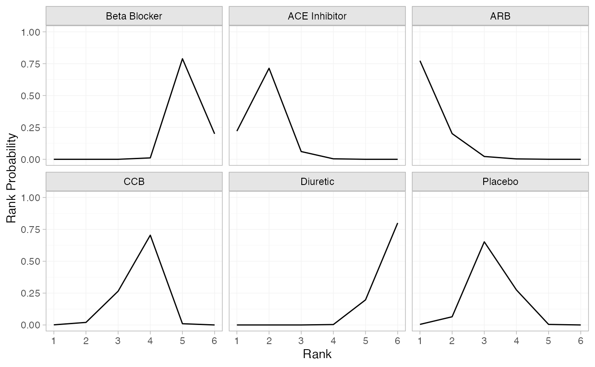

``` r
(db_cumrankprobs <- posterior_rank_probs(db_fit_RE, cumulative = TRUE))
#>                  p_rank[1] p_rank[2] p_rank[3] p_rank[4] p_rank[5] p_rank[6]
#> d[Beta Blocker]       0.00      0.00      0.00      0.01       0.8         1
#> d[ACE Inhibitor]      0.23      0.93      0.99      1.00       1.0         1
#> d[ARB]                0.76      0.98      1.00      1.00       1.0         1
#> d[CCB]                0.00      0.02      0.29      0.99       1.0         1
#> d[Diuretic]           0.00      0.00      0.00      0.00       0.2         1
#> d[Placebo]            0.00      0.08      0.72      1.00       1.0         1
plot(db_cumrankprobs)
```

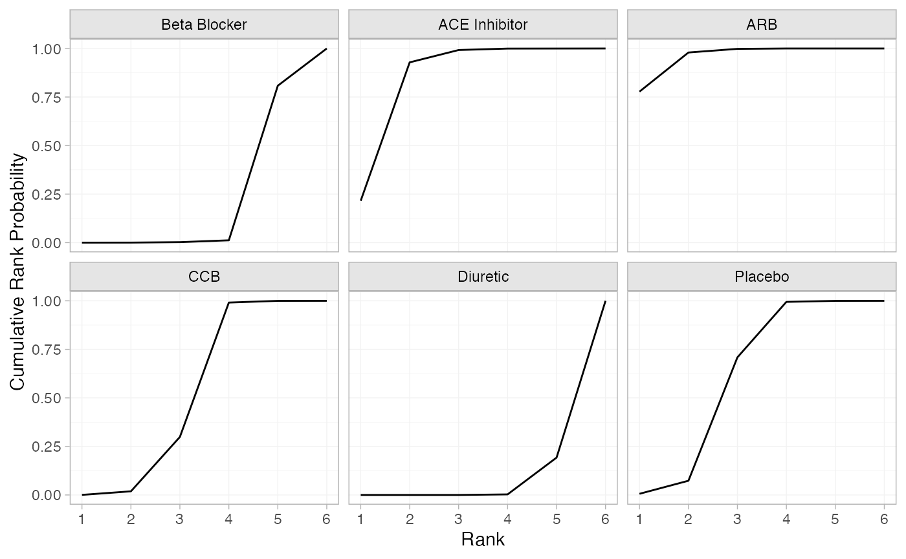

## References

Dias, S., N. J. Welton, A. J. Sutton, and A. E. Ades. 2011. “NICE DSU
Technical Support Document 2: A Generalised Linear Modelling Framework
for Pair-Wise and Network Meta-Analysis of Randomised Controlled
Trials.” National Institute for Health and Care Excellence.
<https://sheffield.ac.uk/nice-dsu>.

Elliott, W. J., and P. M. Meyer. 2007. “Incident Diabetes in Clinical
Trials of Antihypertensive Drugs: A Network Meta-Analysis.” *The Lancet*
369 (9557): 201–7. <https://doi.org/10.1016/s0140-6736(07)60108-1>.

------------------------------------------------------------------------

1.  The gain in efficiency here from using “Beta Blocker” as the network
    reference treatment instead of “Diuretic” is considerable - around
    4-8 times, in terms of effective samples per second. The functions
    in this package will always attempt to choose a default network
    reference treatment that maximises computational efficiency and
    stability. If you have chosen an alternative network reference
    treatment and the model runs very slowly or has low effective sample
    size, this is a likely cause.
