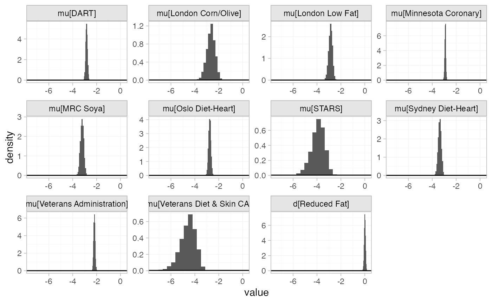
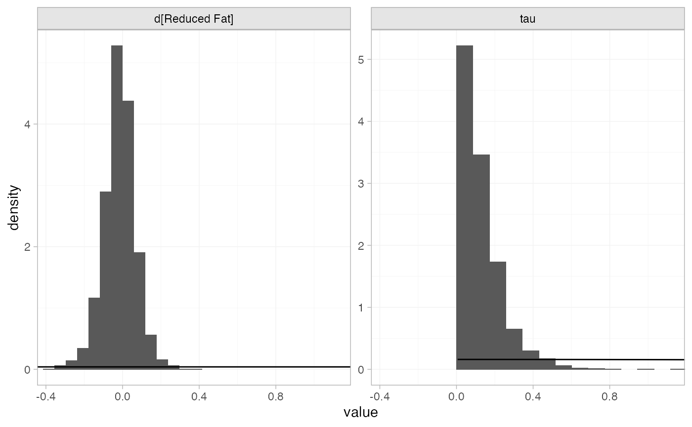
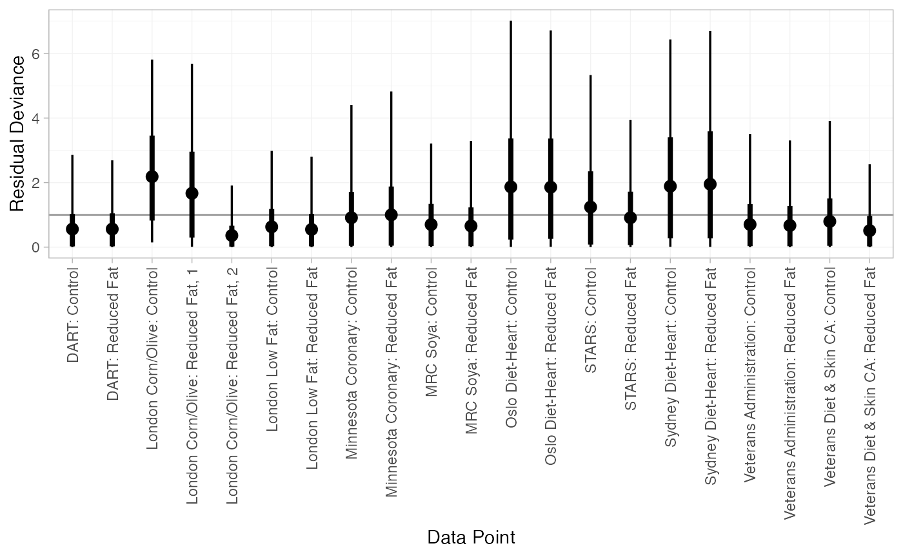
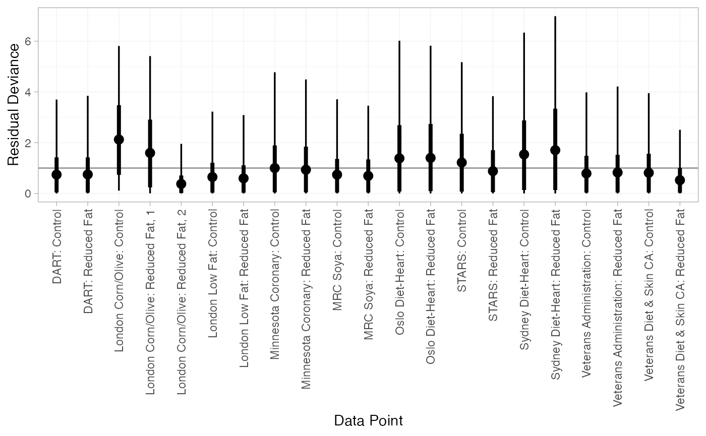
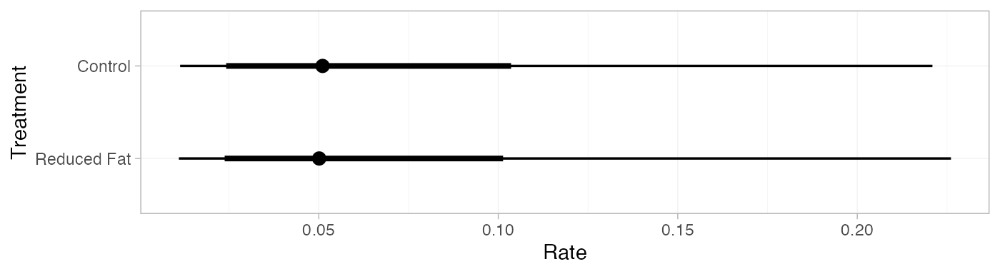
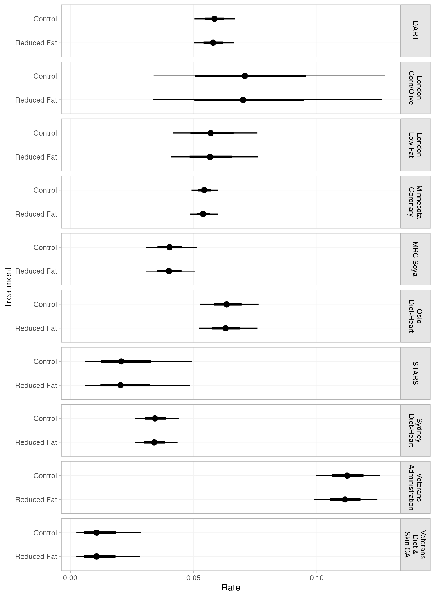

# Example: Dietary fat

``` r
library(multinma)
options(mc.cores = parallel::detectCores())
```

    #> For execution on a local, multicore CPU with excess RAM we recommend calling
    #> options(mc.cores = parallel::detectCores())
    #> 
    #> Attaching package: 'multinma'
    #> The following objects are masked from 'package:stats':
    #> 
    #>     dgamma, pgamma, qgamma

This vignette describes the analysis of 10 trials comparing reduced fat
diets to control (non-reduced fat diets) for preventing mortality
([Hooper et al. 2000](#ref-Hooper2000); [Dias et al. 2011](#ref-TSD2)).
The data are available in this package as `dietary_fat`:

``` r
head(dietary_fat)
#>   studyn            studyc trtn        trtc   r    n      E
#> 1      1              DART    1     Control 113 1015 1917.0
#> 2      1              DART    2 Reduced Fat 111 1018 1925.0
#> 3      2 London Corn/Olive    1     Control   1   26   43.6
#> 4      2 London Corn/Olive    2 Reduced Fat   5   28   41.3
#> 5      2 London Corn/Olive    2 Reduced Fat   3   26   38.0
#> 6      3    London Low Fat    1     Control  24  129  393.5
```

## Setting up the network

We begin by setting up the network - here just a pairwise meta-analysis.
We have arm-level rate data giving the number of deaths (`r`) and the
person-years at risk (`E`) in each arm, so we use the function
[`set_agd_arm()`](https://dmphillippo.github.io/multinma/reference/set_agd_arm.md).
We set “Control” as the reference treatment.

``` r
diet_net <- set_agd_arm(dietary_fat, 
                        study = studyc,
                        trt = trtc,
                        r = r, 
                        E = E,
                        trt_ref = "Control",
                        sample_size = n)
diet_net
#> A network with 10 AgD studies (arm-based).
#> 
#> ------------------------------------------------------- AgD studies (arm-based) ---- 
#>  Study                   Treatment arms                        
#>  DART                    2: Control | Reduced Fat              
#>  London Corn/Olive       3: Control | Reduced Fat | Reduced Fat
#>  London Low Fat          2: Control | Reduced Fat              
#>  Minnesota Coronary      2: Control | Reduced Fat              
#>  MRC Soya                2: Control | Reduced Fat              
#>  Oslo Diet-Heart         2: Control | Reduced Fat              
#>  STARS                   2: Control | Reduced Fat              
#>  Sydney Diet-Heart       2: Control | Reduced Fat              
#>  Veterans Administration 2: Control | Reduced Fat              
#>  Veterans Diet & Skin CA 2: Control | Reduced Fat              
#> 
#>  Outcome type: rate
#> ------------------------------------------------------------------------------------
#> Total number of treatments: 2
#> Total number of studies: 10
#> Reference treatment is: Control
#> Network is connected
```

We also specify the optional `sample_size` argument, although it is not
strictly necessary here. In this case `sample_size` would only be
required to produce a network plot with nodes weighted by sample size,
and a network plot is not particularly informative for a meta-analysis
of only two treatments. (The `sample_size` argument is more important
when a regression model is specified, since it also enables automatic
centering of predictors and production of predictions for studies in the
network, see
[`?set_agd_arm`](https://dmphillippo.github.io/multinma/reference/set_agd_arm.md).)

## Meta-analysis models

We fit both fixed effect (FE) and random effects (RE) models.

### Fixed effect meta-analysis

First, we fit a fixed effect model using the
[`nma()`](https://dmphillippo.github.io/multinma/reference/nma.md)
function with `trt_effects = "fixed"`. We use \mathrm{N}(0, 100^2) prior
distributions for the treatment effects d_k and study-specific
intercepts \mu_j. We can examine the range of parameter values implied
by these prior distributions with the
[`summary()`](https://rdrr.io/r/base/summary.html) method:

``` r
summary(normal(scale = 100))
#> A Normal prior distribution: location = 0, scale = 100.
#> 50% of the prior density lies between -67.45 and 67.45.
#> 95% of the prior density lies between -196 and 196.
```

The model is fitted using the
[`nma()`](https://dmphillippo.github.io/multinma/reference/nma.md)
function. By default, this will use a Poisson likelihood with a log link
function, auto-detected from the data.

``` r
diet_fit_FE <- nma(diet_net, 
                   trt_effects = "fixed",
                   prior_intercept = normal(scale = 100),
                   prior_trt = normal(scale = 100))
```

Basic parameter summaries are given by the
[`print()`](https://rdrr.io/r/base/print.html) method:

``` r
diet_fit_FE
#> A fixed effects NMA with a poisson likelihood (log link).
#> Inference for Stan model: poisson.
#> 4 chains, each with iter=2000; warmup=1000; thin=1; 
#> post-warmup draws per chain=1000, total post-warmup draws=4000.
#> 
#>                   mean se_mean   sd    2.5%     25%     50%     75%   97.5% n_eff Rhat
#> d[Reduced Fat]   -0.01    0.00 0.05   -0.11   -0.04   -0.01    0.03    0.10  3568    1
#> lp__           5386.16    0.06 2.49 5380.38 5384.77 5386.50 5387.97 5389.91  1586    1
#> 
#> Samples were drawn using NUTS(diag_e) at Tue Apr 14 08:26:42 2026.
#> For each parameter, n_eff is a crude measure of effective sample size,
#> and Rhat is the potential scale reduction factor on split chains (at 
#> convergence, Rhat=1).
```

By default, summaries of the study-specific intercepts \mu_j are hidden,
but could be examined by changing the `pars` argument:

``` r
# Not run
print(diet_fit_FE, pars = c("d", "mu"))
```

The prior and posterior distributions can be compared visually using the
[`plot_prior_posterior()`](https://dmphillippo.github.io/multinma/reference/plot_prior_posterior.md)
function:

``` r
plot_prior_posterior(diet_fit_FE)
```



### Random effects meta-analysis

We now fit a random effects model using the
[`nma()`](https://dmphillippo.github.io/multinma/reference/nma.md)
function with `trt_effects = "random"`. Again, we use \mathrm{N}(0,
100^2) prior distributions for the treatment effects d_k and
study-specific intercepts \mu_j, and we additionally use a
\textrm{half-N}(5^2) prior for the heterogeneity standard deviation
\tau. We can examine the range of parameter values implied by these
prior distributions with the
[`summary()`](https://rdrr.io/r/base/summary.html) method:

``` r
summary(normal(scale = 100))
#> A Normal prior distribution: location = 0, scale = 100.
#> 50% of the prior density lies between -67.45 and 67.45.
#> 95% of the prior density lies between -196 and 196.
summary(half_normal(scale = 5))
#> A half-Normal prior distribution: scale = 5.
#> 50% of the prior density lies between 0 and 3.37.
#> 95% of the prior density lies between 0 and 9.8.
```

Fitting the RE model

``` r
diet_fit_RE <- nma(diet_net, 
                   trt_effects = "random",
                   prior_intercept = normal(scale = 100),
                   prior_trt = normal(scale = 100),
                   prior_het = half_normal(scale = 5))
```

Basic parameter summaries are given by the
[`print()`](https://rdrr.io/r/base/print.html) method:

``` r
diet_fit_RE
#> A random effects NMA with a poisson likelihood (log link).
#> Inference for Stan model: poisson.
#> 4 chains, each with iter=2000; warmup=1000; thin=1; 
#> post-warmup draws per chain=1000, total post-warmup draws=4000.
#> 
#>                   mean se_mean   sd    2.5%     25%     50%     75%   97.5% n_eff Rhat
#> d[Reduced Fat]   -0.02    0.00 0.09   -0.19   -0.06   -0.02    0.03    0.15  1581    1
#> lp__           5379.23    0.11 3.74 5371.41 5376.76 5379.38 5381.88 5385.92  1217    1
#> tau               0.13    0.00 0.12    0.01    0.05    0.10    0.18    0.45   819    1
#> 
#> Samples were drawn using NUTS(diag_e) at Tue Apr 14 08:26:48 2026.
#> For each parameter, n_eff is a crude measure of effective sample size,
#> and Rhat is the potential scale reduction factor on split chains (at 
#> convergence, Rhat=1).
```

By default, summaries of the study-specific intercepts \mu_j and
study-specific relative effects \delta\_{jk} are hidden, but could be
examined by changing the `pars` argument:

``` r
# Not run
print(diet_fit_RE, pars = c("d", "mu", "delta"))
```

The prior and posterior distributions can be compared visually using the
[`plot_prior_posterior()`](https://dmphillippo.github.io/multinma/reference/plot_prior_posterior.md)
function:

``` r
plot_prior_posterior(diet_fit_RE, prior = c("trt", "het"))
```



### Model comparison

Model fit can be checked using the
[`dic()`](https://dmphillippo.github.io/multinma/reference/dic.md)
function:

``` r
(dic_FE <- dic(diet_fit_FE))
#> Residual deviance: 22.5 (on 21 data points)
#>                pD: 11.3
#>               DIC: 33.8
```

``` r
(dic_RE <- dic(diet_fit_RE))
#> Residual deviance: 21.4 (on 21 data points)
#>                pD: 13.5
#>               DIC: 34.9
```

Both models appear to fit the data well, as the residual deviance is
close to the number of data points. The DIC is very similar between
models, so the FE model may be preferred for parsimony.

We can also examine the residual deviance contributions with the
corresponding [`plot()`](https://rdrr.io/r/graphics/plot.default.html)
method.

``` r
plot(dic_FE)
```



``` r
plot(dic_RE)
```



## Further results

Dias et al. ([2011](#ref-TSD2)) produce absolute predictions of the
mortality rates on reduced fat and control diets, assuming a Normal
distribution on the baseline log rate of mortality with mean -3 and
precision 1.77. We can replicate these results using the
[`predict()`](https://rdrr.io/r/stats/predict.html) method. The
`baseline` argument takes a
[`distr()`](https://dmphillippo.github.io/multinma/reference/distr.md)
distribution object, with which we specify the corresponding Normal
distribution. We set `type = "response"` to produce predicted rates
(`type = "link"` would produce predicted log rates).

``` r
pred_FE <- predict(diet_fit_FE, 
                   baseline = distr(qnorm, mean = -3, sd = 1.77^-0.5), 
                   type = "response")
pred_FE
#>                   mean   sd 2.5%  25%  50%  75% 97.5% Bulk_ESS Tail_ESS Rhat
#> pred[Control]     0.06 0.05 0.01 0.03 0.05 0.08  0.21     4142     3904    1
#> pred[Reduced Fat] 0.06 0.05 0.01 0.03 0.05 0.08  0.21     4118     3909    1
plot(pred_FE)
```


``` r
pred_RE <- predict(diet_fit_RE, 
                   baseline = distr(qnorm, mean = -3, sd = 1.77^-0.5), 
                   type = "response")
pred_RE
#>                   mean   sd 2.5%  25%  50%  75% 97.5% Bulk_ESS Tail_ESS Rhat
#> pred[Control]     0.07 0.06 0.01 0.03 0.05 0.08  0.22     4379     3576    1
#> pred[Reduced Fat] 0.07 0.06 0.01 0.03 0.05 0.08  0.21     4394     3531    1
plot(pred_RE)
```



If the `baseline` argument is omitted, predicted rates will be produced
for every study in the network based on their estimated baseline log
rate \mu_j:

``` r
pred_FE_studies <- predict(diet_fit_FE, type = "response")
pred_FE_studies
#> ------------------------------------------------------------------- Study: DART ---- 
#> 
#>                         mean sd 2.5%  25%  50%  75% 97.5% Bulk_ESS Tail_ESS Rhat
#> pred[DART: Control]     0.06  0 0.05 0.06 0.06 0.06  0.07     6187     3190    1
#> pred[DART: Reduced Fat] 0.06  0 0.05 0.06 0.06 0.06  0.07     7818     3376    1
#> 
#> ------------------------------------------------------ Study: London Corn/Olive ---- 
#> 
#>                                      mean   sd 2.5%  25%  50%  75% 97.5% Bulk_ESS Tail_ESS
#> pred[London Corn/Olive: Control]     0.07 0.03 0.03 0.06 0.07 0.09  0.13     8422     3035
#> pred[London Corn/Olive: Reduced Fat] 0.07 0.02 0.03 0.06 0.07 0.09  0.13     8512     3110
#>                                      Rhat
#> pred[London Corn/Olive: Control]        1
#> pred[London Corn/Olive: Reduced Fat]    1
#> 
#> --------------------------------------------------------- Study: London Low Fat ---- 
#> 
#>                                   mean   sd 2.5%  25%  50%  75% 97.5% Bulk_ESS Tail_ESS Rhat
#> pred[London Low Fat: Control]     0.06 0.01 0.04 0.05 0.06 0.06  0.08     7697     2749    1
#> pred[London Low Fat: Reduced Fat] 0.06 0.01 0.04 0.05 0.06 0.06  0.08     8588     2715    1
#> 
#> ----------------------------------------------------- Study: Minnesota Coronary ---- 
#> 
#>                                       mean sd 2.5%  25%  50%  75% 97.5% Bulk_ESS Tail_ESS Rhat
#> pred[Minnesota Coronary: Control]     0.05  0 0.05 0.05 0.05 0.06  0.06     5035     3586    1
#> pred[Minnesota Coronary: Reduced Fat] 0.05  0 0.05 0.05 0.05 0.06  0.06     6263     3698    1
#> 
#> --------------------------------------------------------------- Study: MRC Soya ---- 
#> 
#>                             mean   sd 2.5%  25%  50%  75% 97.5% Bulk_ESS Tail_ESS Rhat
#> pred[MRC Soya: Control]     0.04 0.01 0.03 0.04 0.04 0.04  0.05     7530     2448    1
#> pred[MRC Soya: Reduced Fat] 0.04 0.01 0.03 0.04 0.04 0.04  0.05     8515     2983    1
#> 
#> -------------------------------------------------------- Study: Oslo Diet-Heart ---- 
#> 
#>                                    mean   sd 2.5%  25%  50%  75% 97.5% Bulk_ESS Tail_ESS Rhat
#> pred[Oslo Diet-Heart: Control]     0.06 0.01 0.05 0.06 0.06 0.07  0.08     6664     3113    1
#> pred[Oslo Diet-Heart: Reduced Fat] 0.06 0.01 0.05 0.06 0.06 0.07  0.08     8209     3279    1
#> 
#> ------------------------------------------------------------------ Study: STARS ---- 
#> 
#>                          mean   sd 2.5%  25%  50%  75% 97.5% Bulk_ESS Tail_ESS Rhat
#> pred[STARS: Control]     0.02 0.01 0.01 0.01 0.02 0.03  0.05     6720     2887    1
#> pred[STARS: Reduced Fat] 0.02 0.01 0.01 0.01 0.02 0.03  0.05     6802     2867    1
#> 
#> ------------------------------------------------------ Study: Sydney Diet-Heart ---- 
#> 
#>                                      mean sd 2.5%  25%  50%  75% 97.5% Bulk_ESS Tail_ESS Rhat
#> pred[Sydney Diet-Heart: Control]     0.03  0 0.03 0.03 0.03 0.04  0.04     7106     2707    1
#> pred[Sydney Diet-Heart: Reduced Fat] 0.03  0 0.03 0.03 0.03 0.04  0.04     7635     2816    1
#> 
#> ------------------------------------------------ Study: Veterans Administration ---- 
#> 
#>                                            mean   sd 2.5%  25%  50%  75% 97.5% Bulk_ESS
#> pred[Veterans Administration: Control]     0.11 0.01  0.1 0.11 0.11 0.12  0.13     5091
#> pred[Veterans Administration: Reduced Fat] 0.11 0.01  0.1 0.11 0.11 0.12  0.12     6910
#>                                            Tail_ESS Rhat
#> pred[Veterans Administration: Control]         3139    1
#> pred[Veterans Administration: Reduced Fat]     3250    1
#> 
#> ------------------------------------------------ Study: Veterans Diet & Skin CA ---- 
#> 
#>                                            mean   sd 2.5%  25%  50%  75% 97.5% Bulk_ESS
#> pred[Veterans Diet & Skin CA: Control]     0.01 0.01    0 0.01 0.01 0.02  0.03     5371
#> pred[Veterans Diet & Skin CA: Reduced Fat] 0.01 0.01    0 0.01 0.01 0.02  0.03     5342
#>                                            Tail_ESS Rhat
#> pred[Veterans Diet & Skin CA: Control]         2466    1
#> pred[Veterans Diet & Skin CA: Reduced Fat]     2556    1
plot(pred_FE_studies) + ggplot2::facet_grid(Study~., labeller = ggplot2::label_wrap_gen(width = 10))
```



## References

Dias, S., N. J. Welton, A. J. Sutton, and A. E. Ades. 2011. “NICE DSU
Technical Support Document 2: A Generalised Linear Modelling Framework
for Pair-Wise and Network Meta-Analysis of Randomised Controlled
Trials.” National Institute for Health and Care Excellence.
<https://sheffield.ac.uk/nice-dsu>.

Hooper, L., C. D. Summerbell, J. P. T. Higgins, R. L. Thompson, G.
Clements, N. Capps, G. Davey Smith, R. Riemersma, and S. Ebrahim. 2000.
“Reduced or Modified Dietary Fat for Preventing Cardiovascular Disease.”
*Cochrane Database of Systematic Reviews*, no. 2.
<https://doi.org/10.1002/14651858.CD002137>.
