# Example: Atrial fibrillation

``` r
library(multinma)
options(mc.cores = parallel::detectCores())
```

    #> For execution on a local, multicore CPU with excess RAM we recommend calling
    #> options(mc.cores = parallel::detectCores())
    #> 
    #> Attaching package: 'multinma'
    #> The following objects are masked from 'package:stats':
    #> 
    #>     dgamma, pgamma, qgamma

This vignette describes the analysis of 26 trials comparing 17
treatments in 4 classes for the prevention of stroke in patients with
atrial fibrillation ([Cooper et al. 2009](#ref-Cooper2009)). The data
are available in this package as `atrial_fibrillation`:

``` r
head(atrial_fibrillation)
#>     studyc studyn                                  trtc trtn      trt_class   r    n    E
#> 1 ACTIVE-W      1 Standard adjusted dose anti-coagulant    3 Anti-coagulant  65 3371 4200
#> 2 ACTIVE-W      1         Low dose aspirin + copidogrel   16  Anti-platelet 106 3335 4180
#> 3 AFASAK 1      2                 Placebo/Standard care    1        Control  19  336  398
#> 4 AFASAK 1      2 Standard adjusted dose anti-coagulant    3 Anti-coagulant   9  335  413
#> 5 AFASAK 1      2                      Low dose aspirin    5  Anti-platelet  16  336  409
#> 6 AFASAK 2      3 Standard adjusted dose anti-coagulant    3 Anti-coagulant  11  170  355
#>   stroke year followup
#> 1   0.15 2006      1.3
#> 2   0.15 2006      1.3
#> 3   0.06 1989      1.2
#> 4   0.06 1989      1.2
#> 5   0.06 1989      1.2
#> 6   0.10 1998      2.2
```

Cooper et al. ([2009](#ref-Cooper2009)) used this data to demonstrate
meta-regression models, which we recreate here.

## Setting up the network

Whilst we have data on the patient-years at risk in each study (`E`), we
ignore this here to follow the analysis of Cooper et al.
([2009](#ref-Cooper2009)), instead analysing the number of patients with
stroke (`r`) out of the total (`n`) in each arm. We use the function
[`set_agd_arm()`](https://dmphillippo.github.io/multinma/dev/reference/set_agd_arm.md)
to set up the network, making sure to specify the treatment classes
`trt_class`. We remove the WASPO study from the network as both arms had
zero events, and this study therefore contributes no information.

``` r
af_net <- set_agd_arm(atrial_fibrillation[atrial_fibrillation$studyc != "WASPO", ], 
                      study = studyc,
                      trt = trtc,
                      r = r, 
                      n = n,
                      trt_class = trt_class)
af_net
#> A network with 25 AgD studies (arm-based).
#> 
#> ------------------------------------------------------- AgD studies (arm-based) ---- 
#>  Study         Treatment arms                                                                 
#>  ACTIVE-W      2: Standard adjusted dose anti-coagulant | Low dose aspirin + copidogrel       
#>  AFASAK 1      3: Standard adjusted dose anti-coagulant | Low dose aspirin | Placebo/Standa...
#>  AFASAK 2      4: Standard adjusted dose anti-coagulant | Fixed dose warfarin | Fixed dose ...
#>  BAATAF        2: Low adjusted dose anti-coagulant | Placebo/Standard care                    
#>  BAFTA         2: Standard adjusted dose anti-coagulant | Low dose aspirin                    
#>  CAFA          2: Standard adjusted dose anti-coagulant | Placebo/Standard care               
#>  Chinese ATAFS 2: Standard adjusted dose anti-coagulant | Low dose aspirin                    
#>  EAFT          3: Standard adjusted dose anti-coagulant | Medium dose aspirin | Placebo/Sta...
#>  ESPS 2        4: Dipyridamole | Low dose aspirin | Low dose aspirin + dipyridamole | Place...
#>  JAST          2: Low dose aspirin | Placebo/Standard care                                    
#>  ... plus 15 more studies
#> 
#>  Outcome type: count
#> ------------------------------------------------------------------------------------
#> Total number of treatments: 17, in 4 classes
#> Total number of studies: 25
#> Reference treatment is: Standard adjusted dose anti-coagulant
#> Network is connected
```

(A better analysis, accounting for differences in the patient-years at
risk between studies, can be performed by specifying a rate outcome with
`r` and `E` in
[`set_agd_arm()`](https://dmphillippo.github.io/multinma/dev/reference/set_agd_arm.md)
above. The following code remains identical.)

Plot the network with the
[`plot()`](https://rdrr.io/r/graphics/plot.default.html) method:

``` r
plot(af_net, weight_nodes = TRUE, weight_edges = TRUE, show_trt_class = TRUE) + 
  ggplot2::theme(legend.position = "bottom", legend.box = "vertical")
```

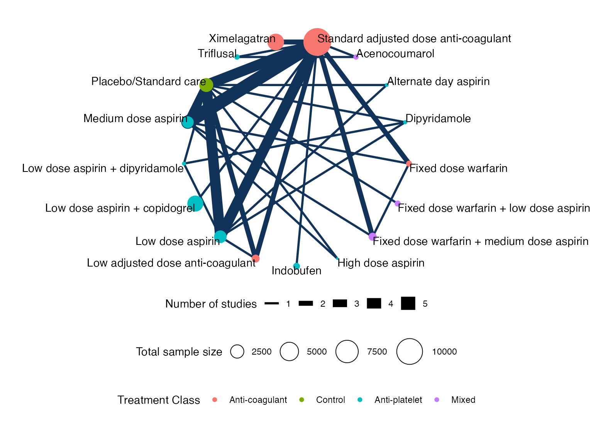

## Meta-analysis models

We fit two (random effects) models:

1.  A standard NMA model without any covariates (model 1 of Cooper et
    al. ([2009](#ref-Cooper2009)));
2.  A meta-regression model adjusting for the proportion of individuals
    in each study with prior stroke, with shared interaction
    coefficients by treatment class (model 4b of Cooper et al.
    ([2009](#ref-Cooper2009))).

### NMA with no covariates

We fit a random effects model using the
[`nma()`](https://dmphillippo.github.io/multinma/dev/reference/nma.md)
function with `trt_effects = "random"`. We use \mathrm{N}(0, 100^2)
prior distributions for the treatment effects d_k and study-specific
intercepts \mu_j, and a \textrm{half-N}(5^2) prior for the heterogeneity
standard deviation \tau. We can examine the range of parameter values
implied by these prior distributions with the
[`summary()`](https://rdrr.io/r/base/summary.html) method:

``` r
summary(normal(scale = 100))
#> A Normal prior distribution: location = 0, scale = 100.
#> 50% of the prior density lies between -67.45 and 67.45.
#> 95% of the prior density lies between -196 and 196.
summary(half_normal(scale = 5))
#> A half-Normal prior distribution: scale = 5.
#> 50% of the prior density lies between 0 and 3.37.
#> 95% of the prior density lies between 0 and 9.8.
```

Fitting the model with the
[`nma()`](https://dmphillippo.github.io/multinma/dev/reference/nma.md)
function. We increase the target acceptance rate `adapt_delta = 0.99` to
minimise divergent transition warnings.

``` r
af_fit_1 <- nma(af_net, 
                trt_effects = "random",
                prior_intercept = normal(scale = 100),
                prior_trt = normal(scale = 100),
                prior_het = half_normal(scale = 5),
                adapt_delta = 0.99)
```

    #> Note: Setting "Standard adjusted dose anti-coagulant" as the network reference treatment.

Basic parameter summaries are given by the
[`print()`](https://rdrr.io/r/base/print.html) method:

``` r
af_fit_1
#> A random effects NMA with a binomial likelihood (logit link).
#> Inference for Stan model: binomial_1par.
#> 4 chains, each with iter=5000; warmup=2500; thin=1; 
#> post-warmup draws per chain=2500, total post-warmup draws=10000.
#> 
#>                                                  mean se_mean   sd     2.5%      25%      50%
#> d[Acenocoumarol]                                -0.80    0.01 0.83    -2.51    -1.33    -0.78
#> d[Alternate day aspirin]                        -1.01    0.01 1.37    -4.16    -1.80    -0.84
#> d[Dipyridamole]                                  0.60    0.01 0.45    -0.29     0.31     0.60
#> d[Fixed dose warfarin]                           0.92    0.00 0.41     0.12     0.65     0.92
#> d[Fixed dose warfarin + low dose aspirin]        0.47    0.01 0.44    -0.38     0.19     0.47
#> d[Fixed dose warfarin + medium dose aspirin]     0.89    0.00 0.32     0.24     0.69     0.89
#> d[High dose aspirin]                             0.51    0.01 0.77    -1.03     0.00     0.51
#> d[Indobufen]                                     0.25    0.00 0.45    -0.64    -0.04     0.24
#> d[Low adjusted dose anti-coagulant]             -0.29    0.00 0.39    -1.07    -0.55    -0.29
#> d[Low dose aspirin]                              0.62    0.00 0.22     0.18     0.48     0.62
#> d[Low dose aspirin + copidogrel]                 0.52    0.00 0.34    -0.18     0.32     0.52
#> d[Low dose aspirin + dipyridamole]               0.27    0.01 0.47    -0.67    -0.03     0.28
#> d[Medium dose aspirin]                           0.39    0.00 0.20    -0.01     0.26     0.39
#> d[Placebo/Standard care]                         0.76    0.00 0.20     0.36     0.63     0.76
#> d[Triflusal]                                     0.65    0.01 0.62    -0.55     0.23     0.63
#> d[Ximelagatran]                                 -0.08    0.00 0.26    -0.61    -0.24    -0.09
#> lp__                                         -4771.87    0.15 7.36 -4787.37 -4776.57 -4771.51
#> tau                                              0.28    0.00 0.14     0.03     0.18     0.27
#>                                                   75%    97.5% n_eff Rhat
#> d[Acenocoumarol]                                -0.24     0.76  9712    1
#> d[Alternate day aspirin]                        -0.06     1.23  9231    1
#> d[Dipyridamole]                                  0.90     1.48  7697    1
#> d[Fixed dose warfarin]                           1.19     1.73  9935    1
#> d[Fixed dose warfarin + low dose aspirin]        0.75     1.36  6755    1
#> d[Fixed dose warfarin + medium dose aspirin]     1.09     1.50  8929    1
#> d[High dose aspirin]                             1.03     2.00 10861    1
#> d[Indobufen]                                     0.53     1.17 10530    1
#> d[Low adjusted dose anti-coagulant]             -0.03     0.45  6829    1
#> d[Low dose aspirin]                              0.76     1.05  4785    1
#> d[Low dose aspirin + copidogrel]                 0.72     1.22  9360    1
#> d[Low dose aspirin + dipyridamole]               0.58     1.18  7572    1
#> d[Medium dose aspirin]                           0.51     0.76  6297    1
#> d[Placebo/Standard care]                         0.89     1.16  3686    1
#> d[Triflusal]                                     1.03     1.93  9732    1
#> d[Ximelagatran]                                  0.08     0.44  8345    1
#> lp__                                         -4766.76 -4758.57  2386    1
#> tau                                              0.36     0.57  1635    1
#> 
#> Samples were drawn using NUTS(diag_e) at Sat Dec 13 11:49:44 2025.
#> For each parameter, n_eff is a crude measure of effective sample size,
#> and Rhat is the potential scale reduction factor on split chains (at 
#> convergence, Rhat=1).
```

By default, summaries of the study-specific intercepts \mu_j and
study-specific relative effects \delta\_{jk} are hidden, but could be
examined by changing the `pars` argument:

``` r
# Not run
print(af_fit_1, pars = c("d", "mu", "delta"))
```

The prior and posterior distributions can be compared visually using the
[`plot_prior_posterior()`](https://dmphillippo.github.io/multinma/dev/reference/plot_prior_posterior.md)
function:

``` r
plot_prior_posterior(af_fit_1, prior = c("trt", "het"))
```

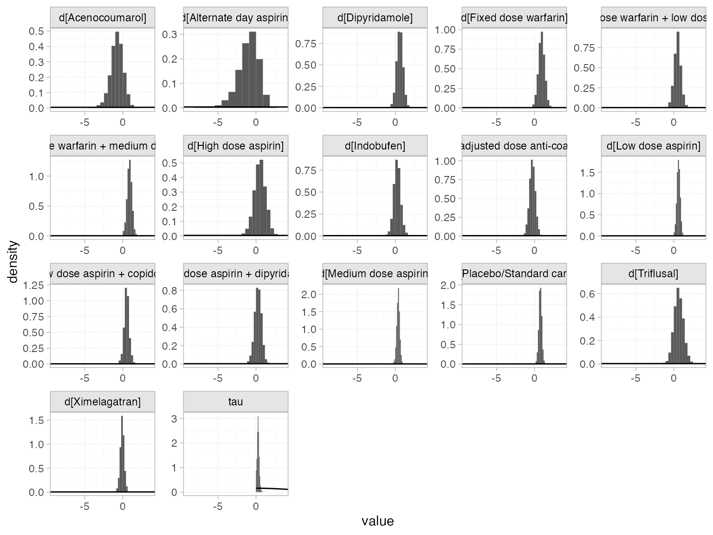

We can compute relative effects against placebo/standard care with the
[`relative_effects()`](https://dmphillippo.github.io/multinma/dev/reference/relative_effects.md)
function with the `trt_ref` argument:

``` r
(af_1_releff <- relative_effects(af_fit_1, trt_ref = "Placebo/Standard care"))
#>                                               mean   sd  2.5%   25%   50%   75% 97.5% Bulk_ESS
#> d[Standard adjusted dose anti-coagulant]     -0.76 0.20 -1.16 -0.89 -0.76 -0.63 -0.36     3734
#> d[Acenocoumarol]                             -1.56 0.85 -3.34 -2.11 -1.52 -0.98  0.05     8970
#> d[Alternate day aspirin]                     -1.77 1.36 -4.87 -2.55 -1.59 -0.83  0.43    12129
#> d[Dipyridamole]                              -0.16 0.42 -0.98 -0.43 -0.16  0.11  0.66    12931
#> d[Fixed dose warfarin]                        0.16 0.44 -0.72 -0.13  0.16  0.46  1.01     9337
#> d[Fixed dose warfarin + low dose aspirin]    -0.28 0.39 -1.04 -0.53 -0.29 -0.05  0.52    10845
#> d[Fixed dose warfarin + medium dose aspirin]  0.13 0.37 -0.61 -0.10  0.13  0.37  0.84     8027
#> d[High dose aspirin]                         -0.25 0.76 -1.77 -0.75 -0.23  0.26  1.21    13112
#> d[Indobufen]                                 -0.51 0.50 -1.49 -0.83 -0.51 -0.20  0.50     8713
#> d[Low adjusted dose anti-coagulant]          -1.05 0.36 -1.75 -1.29 -1.05 -0.81 -0.36    12008
#> d[Low dose aspirin]                          -0.14 0.21 -0.56 -0.28 -0.14  0.00  0.27    11427
#> d[Low dose aspirin + copidogrel]             -0.24 0.40 -1.02 -0.48 -0.24  0.01  0.56     7779
#> d[Low dose aspirin + dipyridamole]           -0.49 0.44 -1.37 -0.78 -0.48 -0.20  0.38    12769
#> d[Medium dose aspirin]                       -0.37 0.22 -0.83 -0.51 -0.37 -0.22  0.06     7332
#> d[Triflusal]                                 -0.11 0.65 -1.36 -0.53 -0.13  0.30  1.23     8877
#> d[Ximelagatran]                              -0.84 0.33 -1.51 -1.05 -0.84 -0.63 -0.17     5984
#>                                              Tail_ESS Rhat
#> d[Standard adjusted dose anti-coagulant]         5157    1
#> d[Acenocoumarol]                                 7713    1
#> d[Alternate day aspirin]                         5983    1
#> d[Dipyridamole]                                  8392    1
#> d[Fixed dose warfarin]                           7488    1
#> d[Fixed dose warfarin + low dose aspirin]        6624    1
#> d[Fixed dose warfarin + medium dose aspirin]     7303    1
#> d[High dose aspirin]                             7638    1
#> d[Indobufen]                                     6308    1
#> d[Low adjusted dose anti-coagulant]              7892    1
#> d[Low dose aspirin]                              7842    1
#> d[Low dose aspirin + copidogrel]                 6117    1
#> d[Low dose aspirin + dipyridamole]               7664    1
#> d[Medium dose aspirin]                           6125    1
#> d[Triflusal]                                     7347    1
#> d[Ximelagatran]                                  6402    1
```

These estimates can easily be plotted with the
[`plot()`](https://rdrr.io/r/graphics/plot.default.html) method:

``` r
plot(af_1_releff, ref_line = 0)
```

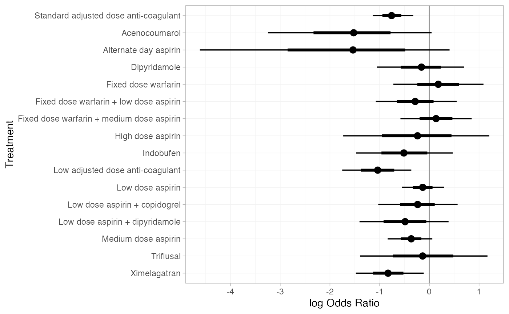

We can also produce treatment rankings, rank probabilities, and
cumulative rank probabilities.

``` r
(af_1_ranks <- posterior_ranks(af_fit_1))
#>                                                  mean   sd 2.5% 25% 50% 75% 97.5% Bulk_ESS
#> rank[Standard adjusted dose anti-coagulant]      5.30 1.42    3   4   5   6     8     6202
#> rank[Acenocoumarol]                              3.00 3.07    1   1   2   3    13     8574
#> rank[Alternate day aspirin]                      3.68 4.23    1   1   2   4    16    13825
#> rank[Dipyridamole]                              11.35 3.78    4   9  12  15    17    10602
#> rank[Fixed dose warfarin]                       14.04 3.06    6  12  15  16    17     9949
#> rank[Fixed dose warfarin + low dose aspirin]    10.07 3.81    3   7  10  13    17     9910
#> rank[Fixed dose warfarin + medium dose aspirin] 14.08 2.66    8  13  15  16    17     7039
#> rank[High dose aspirin]                         10.26 5.29    2   5  11  16    17    12576
#> rank[Indobufen]                                  8.05 3.97    2   5   8  11    16     9911
#> rank[Low adjusted dose anti-coagulant]           3.78 2.23    1   2   3   5    10     8209
#> rank[Low dose aspirin]                          11.75 2.25    7  10  12  13    16    10118
#> rank[Low dose aspirin + copidogrel]             10.61 3.41    4   8  11  13    17     8718
#> rank[Low dose aspirin + dipyridamole]            8.21 3.89    2   5   8  11    16    11047
#> rank[Medium dose aspirin]                        9.14 2.13    5   8   9  11    13     9845
#> rank[Placebo/Standard care]                     13.43 1.82   10  12  14  15    17     8570
#> rank[Triflusal]                                 11.38 4.57    3   8  12  16    17     9654
#> rank[Ximelagatran]                               4.88 2.30    2   3   4   6    10     7255
#>                                                 Tail_ESS Rhat
#> rank[Standard adjusted dose anti-coagulant]         6592    1
#> rank[Acenocoumarol]                                 7538    1
#> rank[Alternate day aspirin]                         9660    1
#> rank[Dipyridamole]                                    NA    1
#> rank[Fixed dose warfarin]                             NA    1
#> rank[Fixed dose warfarin + low dose aspirin]        7061    1
#> rank[Fixed dose warfarin + medium dose aspirin]       NA    1
#> rank[High dose aspirin]                               NA    1
#> rank[Indobufen]                                     6530    1
#> rank[Low adjusted dose anti-coagulant]              8350    1
#> rank[Low dose aspirin]                              8330    1
#> rank[Low dose aspirin + copidogrel]                 6730    1
#> rank[Low dose aspirin + dipyridamole]               8156    1
#> rank[Medium dose aspirin]                           9091    1
#> rank[Placebo/Standard care]                         7856    1
#> rank[Triflusal]                                       NA    1
#> rank[Ximelagatran]                                  6411    1
plot(af_1_ranks)
```

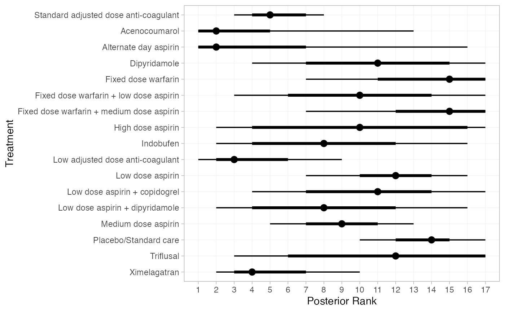

``` r
(af_1_rankprobs <- posterior_rank_probs(af_fit_1))
#>                                              p_rank[1] p_rank[2] p_rank[3] p_rank[4] p_rank[5]
#> d[Standard adjusted dose anti-coagulant]          0.00      0.01      0.08      0.20      0.28
#> d[Acenocoumarol]                                  0.38      0.29      0.10      0.05      0.03
#> d[Alternate day aspirin]                          0.47      0.17      0.07      0.04      0.03
#> d[Dipyridamole]                                   0.00      0.01      0.02      0.02      0.03
#> d[Fixed dose warfarin]                            0.00      0.00      0.00      0.00      0.01
#> d[Fixed dose warfarin + low dose aspirin]         0.00      0.01      0.03      0.04      0.05
#> d[Fixed dose warfarin + medium dose aspirin]      0.00      0.00      0.00      0.00      0.00
#> d[High dose aspirin]                              0.02      0.06      0.06      0.06      0.04
#> d[Indobufen]                                      0.01      0.04      0.07      0.08      0.09
#> d[Low adjusted dose anti-coagulant]               0.08      0.23      0.26      0.15      0.09
#> d[Low dose aspirin]                               0.00      0.00      0.00      0.00      0.00
#> d[Low dose aspirin + copidogrel]                  0.00      0.01      0.01      0.02      0.03
#> d[Low dose aspirin + dipyridamole]                0.01      0.04      0.07      0.08      0.08
#> d[Medium dose aspirin]                            0.00      0.00      0.00      0.01      0.02
#> d[Placebo/Standard care]                          0.00      0.00      0.00      0.00      0.00
#> d[Triflusal]                                      0.00      0.02      0.04      0.04      0.04
#> d[Ximelagatran]                                   0.02      0.10      0.18      0.21      0.17
#>                                              p_rank[6] p_rank[7] p_rank[8] p_rank[9]
#> d[Standard adjusted dose anti-coagulant]          0.23      0.12      0.05      0.01
#> d[Acenocoumarol]                                  0.03      0.02      0.02      0.02
#> d[Alternate day aspirin]                          0.03      0.03      0.02      0.02
#> d[Dipyridamole]                                   0.04      0.06      0.07      0.08
#> d[Fixed dose warfarin]                            0.01      0.02      0.03      0.04
#> d[Fixed dose warfarin + low dose aspirin]         0.06      0.08      0.10      0.09
#> d[Fixed dose warfarin + medium dose aspirin]      0.01      0.01      0.02      0.03
#> d[High dose aspirin]                              0.05      0.05      0.05      0.05
#> d[Indobufen]                                      0.10      0.10      0.10      0.08
#> d[Low adjusted dose anti-coagulant]               0.07      0.04      0.03      0.02
#> d[Low dose aspirin]                               0.01      0.02      0.04      0.09
#> d[Low dose aspirin + copidogrel]                  0.05      0.08      0.10      0.10
#> d[Low dose aspirin + dipyridamole]                0.09      0.10      0.09      0.08
#> d[Medium dose aspirin]                            0.06      0.12      0.17      0.19
#> d[Placebo/Standard care]                          0.00      0.00      0.01      0.01
#> d[Triflusal]                                      0.05      0.06      0.06      0.06
#> d[Ximelagatran]                                   0.12      0.09      0.05      0.03
#>                                              p_rank[10] p_rank[11] p_rank[12] p_rank[13]
#> d[Standard adjusted dose anti-coagulant]           0.00       0.00       0.00       0.00
#> d[Acenocoumarol]                                   0.01       0.01       0.01       0.01
#> d[Alternate day aspirin]                           0.02       0.01       0.01       0.01
#> d[Dipyridamole]                                    0.08       0.08       0.08       0.08
#> d[Fixed dose warfarin]                             0.04       0.05       0.06       0.07
#> d[Fixed dose warfarin + low dose aspirin]          0.09       0.08       0.08       0.07
#> d[Fixed dose warfarin + medium dose aspirin]       0.04       0.06       0.07       0.09
#> d[High dose aspirin]                               0.05       0.04       0.05       0.04
#> d[Indobufen]                                       0.07       0.05       0.05       0.04
#> d[Low adjusted dose anti-coagulant]                0.01       0.01       0.00       0.00
#> d[Low dose aspirin]                                0.13       0.16       0.17       0.15
#> d[Low dose aspirin + copidogrel]                   0.10       0.10       0.09       0.08
#> d[Low dose aspirin + dipyridamole]                 0.08       0.07       0.05       0.04
#> d[Medium dose aspirin]                             0.16       0.12       0.07       0.04
#> d[Placebo/Standard care]                           0.04       0.08       0.14       0.20
#> d[Triflusal]                                       0.06       0.06       0.06       0.05
#> d[Ximelagatran]                                    0.02       0.01       0.01       0.00
#>                                              p_rank[14] p_rank[15] p_rank[16] p_rank[17]
#> d[Standard adjusted dose anti-coagulant]           0.00       0.00       0.00       0.00
#> d[Acenocoumarol]                                   0.01       0.01       0.01       0.00
#> d[Alternate day aspirin]                           0.01       0.01       0.02       0.02
#> d[Dipyridamole]                                    0.09       0.09       0.09       0.08
#> d[Fixed dose warfarin]                             0.09       0.14       0.20       0.24
#> d[Fixed dose warfarin + low dose aspirin]          0.07       0.06       0.05       0.04
#> d[Fixed dose warfarin + medium dose aspirin]       0.12       0.17       0.22       0.17
#> d[High dose aspirin]                               0.05       0.07       0.08       0.17
#> d[Indobufen]                                       0.04       0.03       0.03       0.02
#> d[Low adjusted dose anti-coagulant]                0.00       0.00       0.00       0.00
#> d[Low dose aspirin]                                0.12       0.07       0.03       0.01
#> d[Low dose aspirin + copidogrel]                   0.08       0.07       0.05       0.03
#> d[Low dose aspirin + dipyridamole]                 0.04       0.03       0.03       0.02
#> d[Medium dose aspirin]                             0.02       0.01       0.00       0.00
#> d[Placebo/Standard care]                           0.22       0.17       0.10       0.03
#> d[Triflusal]                                       0.06       0.08       0.10       0.17
#> d[Ximelagatran]                                    0.00       0.00       0.00       0.00
plot(af_1_rankprobs)
```

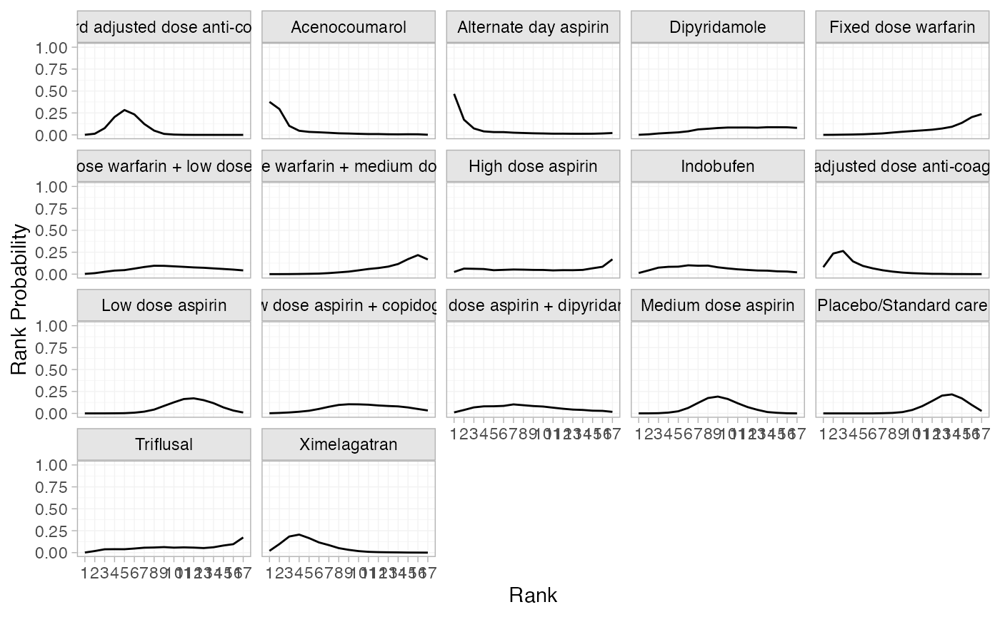

``` r
(af_1_cumrankprobs <- posterior_rank_probs(af_fit_1, cumulative = TRUE))
#>                                              p_rank[1] p_rank[2] p_rank[3] p_rank[4] p_rank[5]
#> d[Standard adjusted dose anti-coagulant]          0.00      0.01      0.09      0.29      0.58
#> d[Acenocoumarol]                                  0.38      0.67      0.77      0.82      0.85
#> d[Alternate day aspirin]                          0.47      0.64      0.71      0.75      0.79
#> d[Dipyridamole]                                   0.00      0.01      0.02      0.05      0.07
#> d[Fixed dose warfarin]                            0.00      0.00      0.00      0.01      0.01
#> d[Fixed dose warfarin + low dose aspirin]         0.00      0.01      0.04      0.08      0.13
#> d[Fixed dose warfarin + medium dose aspirin]      0.00      0.00      0.00      0.00      0.01
#> d[High dose aspirin]                              0.02      0.09      0.15      0.21      0.25
#> d[Indobufen]                                      0.01      0.06      0.13      0.21      0.30
#> d[Low adjusted dose anti-coagulant]               0.08      0.31      0.58      0.72      0.82
#> d[Low dose aspirin]                               0.00      0.00      0.00      0.00      0.00
#> d[Low dose aspirin + copidogrel]                  0.00      0.01      0.02      0.04      0.07
#> d[Low dose aspirin + dipyridamole]                0.01      0.05      0.12      0.20      0.28
#> d[Medium dose aspirin]                            0.00      0.00      0.00      0.01      0.04
#> d[Placebo/Standard care]                          0.00      0.00      0.00      0.00      0.00
#> d[Triflusal]                                      0.00      0.02      0.06      0.10      0.14
#> d[Ximelagatran]                                   0.02      0.12      0.30      0.51      0.67
#>                                              p_rank[6] p_rank[7] p_rank[8] p_rank[9]
#> d[Standard adjusted dose anti-coagulant]          0.81      0.94      0.98      1.00
#> d[Acenocoumarol]                                  0.88      0.91      0.93      0.94
#> d[Alternate day aspirin]                          0.82      0.84      0.86      0.88
#> d[Dipyridamole]                                   0.12      0.18      0.25      0.33
#> d[Fixed dose warfarin]                            0.03      0.04      0.07      0.11
#> d[Fixed dose warfarin + low dose aspirin]         0.19      0.27      0.37      0.46
#> d[Fixed dose warfarin + medium dose aspirin]      0.01      0.02      0.04      0.07
#> d[High dose aspirin]                              0.30      0.35      0.40      0.45
#> d[Indobufen]                                      0.40      0.49      0.59      0.67
#> d[Low adjusted dose anti-coagulant]               0.88      0.93      0.96      0.97
#> d[Low dose aspirin]                               0.01      0.03      0.07      0.16
#> d[Low dose aspirin + copidogrel]                  0.12      0.19      0.29      0.39
#> d[Low dose aspirin + dipyridamole]                0.37      0.47      0.56      0.64
#> d[Medium dose aspirin]                            0.10      0.22      0.39      0.58
#> d[Placebo/Standard care]                          0.00      0.00      0.01      0.02
#> d[Triflusal]                                      0.18      0.24      0.30      0.36
#> d[Ximelagatran]                                   0.79      0.88      0.93      0.96
#>                                              p_rank[10] p_rank[11] p_rank[12] p_rank[13]
#> d[Standard adjusted dose anti-coagulant]           1.00       1.00       1.00       1.00
#> d[Acenocoumarol]                                   0.95       0.96       0.97       0.98
#> d[Alternate day aspirin]                           0.90       0.91       0.92       0.94
#> d[Dipyridamole]                                    0.41       0.49       0.58       0.66
#> d[Fixed dose warfarin]                             0.15       0.20       0.26       0.33
#> d[Fixed dose warfarin + low dose aspirin]          0.55       0.63       0.71       0.78
#> d[Fixed dose warfarin + medium dose aspirin]       0.12       0.17       0.24       0.33
#> d[High dose aspirin]                               0.50       0.54       0.59       0.63
#> d[Indobufen]                                       0.73       0.79       0.84       0.88
#> d[Low adjusted dose anti-coagulant]                0.98       0.99       0.99       1.00
#> d[Low dose aspirin]                                0.29       0.45       0.62       0.77
#> d[Low dose aspirin + copidogrel]                   0.50       0.59       0.68       0.77
#> d[Low dose aspirin + dipyridamole]                 0.72       0.79       0.84       0.88
#> d[Medium dose aspirin]                             0.75       0.86       0.94       0.98
#> d[Placebo/Standard care]                           0.06       0.14       0.29       0.49
#> d[Triflusal]                                       0.42       0.48       0.54       0.59
#> d[Ximelagatran]                                    0.98       0.99       0.99       1.00
#>                                              p_rank[14] p_rank[15] p_rank[16] p_rank[17]
#> d[Standard adjusted dose anti-coagulant]           1.00       1.00       1.00          1
#> d[Acenocoumarol]                                   0.98       0.99       1.00          1
#> d[Alternate day aspirin]                           0.95       0.96       0.98          1
#> d[Dipyridamole]                                    0.75       0.83       0.92          1
#> d[Fixed dose warfarin]                             0.42       0.56       0.76          1
#> d[Fixed dose warfarin + low dose aspirin]          0.85       0.91       0.96          1
#> d[Fixed dose warfarin + medium dose aspirin]       0.44       0.62       0.83          1
#> d[High dose aspirin]                               0.68       0.75       0.83          1
#> d[Indobufen]                                       0.92       0.95       0.98          1
#> d[Low adjusted dose anti-coagulant]                1.00       1.00       1.00          1
#> d[Low dose aspirin]                                0.89       0.96       0.99          1
#> d[Low dose aspirin + copidogrel]                   0.85       0.92       0.97          1
#> d[Low dose aspirin + dipyridamole]                 0.92       0.95       0.98          1
#> d[Medium dose aspirin]                             0.99       1.00       1.00          1
#> d[Placebo/Standard care]                           0.71       0.88       0.97          1
#> d[Triflusal]                                       0.65       0.73       0.83          1
#> d[Ximelagatran]                                    1.00       1.00       1.00          1
plot(af_1_cumrankprobs)
```

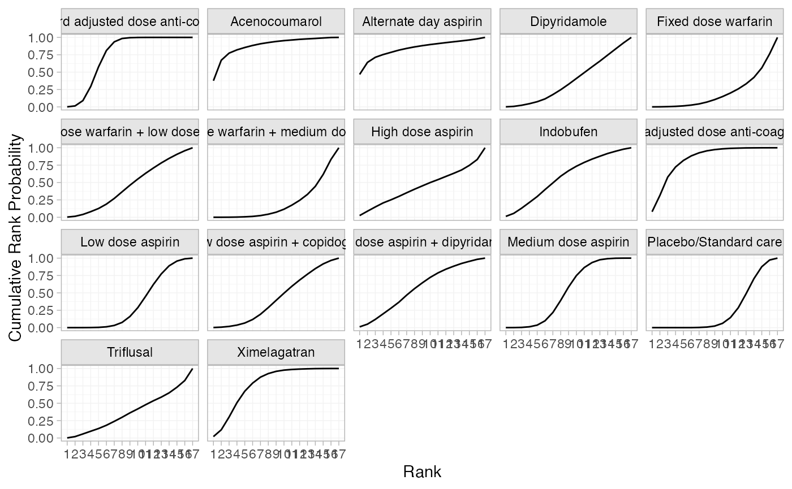

### Network meta-regression adjusting for proportion of prior stroke

We now consider a meta-regression model adjusting for the proportion of
individuals in each study with prior stroke, with shared interaction
coefficients by treatment class. The regression model is specified in
the
[`nma()`](https://dmphillippo.github.io/multinma/dev/reference/nma.md)
function using a formula in the `regression` argument. The formula
`~ .trt:stroke` means that interactions of prior stroke with treatment
will be included; the `.trt` special variable indicates treatment, and
`stroke` is in the original data set. We specify
`class_interactions = "common"` to denote that the interaction
parameters are to be common (i.e. shared) between treatments within each
class. (Setting `class_interactions = "independent"` would fit model 2
of Cooper et al. ([2009](#ref-Cooper2009)) with separate interactions
for each treatment, data permitting.) We use the same prior
distributions as above, but additionally require a prior distribution
for the regression coefficients `prior_reg`; we use a \mathrm{N}(0,
100^2) prior distribution. The [QR
decomposition](https://mc-stan.org/users/documentation/case-studies/qr_regression.html)
can greatly improve the efficiency of sampling for regression models by
decorrelating the sampling space; we specify that this should be used
with `QR = TRUE`, and increase the target acceptance rate
`adapt_delta = 0.99` to minimise divergent transition warnings.

``` r
af_fit_4b <- nma(af_net, 
                 trt_effects = "random",
                 regression = ~ .trt:stroke,
                 class_interactions = "common",
                 QR = TRUE,
                 prior_intercept = normal(scale = 100),
                 prior_trt = normal(scale = 100),
                 prior_reg = normal(scale = 100),
                 prior_het = half_normal(scale = 5),
                 adapt_delta = 0.99)
```

    #> Note: Setting "Standard adjusted dose anti-coagulant" as the network reference treatment.

Basic parameter summaries are given by the
[`print()`](https://rdrr.io/r/base/print.html) method:

``` r
af_fit_4b
#> A random effects NMA with a binomial likelihood (logit link).
#> Regression model: ~.trt:stroke.
#> Centred covariates at the following overall mean values:
#>    stroke 
#> 0.2957377 
#> Inference for Stan model: binomial_1par.
#> 4 chains, each with iter=2000; warmup=1000; thin=1; 
#> post-warmup draws per chain=1000, total post-warmup draws=4000.
#> 
#>                                                  mean se_mean   sd     2.5%      25%      50%
#> beta[.trtclassControl:stroke]                    0.70    0.01 0.44    -0.13     0.42     0.70
#> beta[.trtclassAnti-platelet:stroke]              0.93    0.01 0.39     0.16     0.67     0.92
#> beta[.trtclassMixed:stroke]                      3.89    0.03 2.15    -0.26     2.50     3.90
#> d[Acenocoumarol]                                 0.36    0.01 1.02    -1.74    -0.29     0.37
#> d[Alternate day aspirin]                        -0.88    0.03 1.34    -4.02    -1.57    -0.69
#> d[Dipyridamole]                                  0.57    0.01 0.40    -0.23     0.31     0.57
#> d[Fixed dose warfarin]                           0.64    0.01 0.37    -0.07     0.40     0.63
#> d[Fixed dose warfarin + low dose aspirin]        1.45    0.01 0.73     0.04     0.97     1.45
#> d[Fixed dose warfarin + medium dose aspirin]     1.00    0.00 0.30     0.42     0.81     0.99
#> d[High dose aspirin]                             0.41    0.01 0.74    -1.07    -0.09     0.42
#> d[Indobufen]                                    -0.40    0.01 0.47    -1.32    -0.70    -0.40
#> d[Low adjusted dose anti-coagulant]             -0.43    0.00 0.38    -1.18    -0.69    -0.43
#> d[Low dose aspirin]                              0.72    0.00 0.20     0.33     0.59     0.72
#> d[Low dose aspirin + copidogrel]                 0.64    0.01 0.28     0.05     0.49     0.65
#> d[Low dose aspirin + dipyridamole]               0.25    0.01 0.42    -0.58    -0.03     0.26
#> d[Medium dose aspirin]                           0.35    0.00 0.17     0.01     0.23     0.35
#> d[Placebo/Standard care]                         0.79    0.00 0.19     0.41     0.66     0.79
#> d[Triflusal]                                     0.91    0.01 0.60    -0.21     0.50     0.91
#> d[Ximelagatran]                                 -0.08    0.00 0.21    -0.50    -0.21    -0.08
#> lp__                                         -4771.20    0.22 6.96 -4785.98 -4775.60 -4770.71
#> tau                                              0.18    0.01 0.12     0.01     0.09     0.16
#>                                                   75%    97.5% n_eff Rhat
#> beta[.trtclassControl:stroke]                    0.99     1.60  4609    1
#> beta[.trtclassAnti-platelet:stroke]              1.19     1.69  5210    1
#> beta[.trtclassMixed:stroke]                      5.28     8.13  5083    1
#> d[Acenocoumarol]                                 1.05     2.30  4775    1
#> d[Alternate day aspirin]                         0.03     1.23  2760    1
#> d[Dipyridamole]                                  0.82     1.36  5756    1
#> d[Fixed dose warfarin]                           0.90     1.39  4784    1
#> d[Fixed dose warfarin + low dose aspirin]        1.93     2.94  4824    1
#> d[Fixed dose warfarin + medium dose aspirin]     1.19     1.61  5412    1
#> d[High dose aspirin]                             0.92     1.85  6605    1
#> d[Indobufen]                                    -0.10     0.53  4566    1
#> d[Low adjusted dose anti-coagulant]             -0.17     0.29  5994    1
#> d[Low dose aspirin]                              0.85     1.10  4998    1
#> d[Low dose aspirin + copidogrel]                 0.81     1.18  2413    1
#> d[Low dose aspirin + dipyridamole]               0.52     1.07  5974    1
#> d[Medium dose aspirin]                           0.46     0.69  3984    1
#> d[Placebo/Standard care]                         0.91     1.15  5057    1
#> d[Triflusal]                                     1.30     2.12  6062    1
#> d[Ximelagatran]                                  0.05     0.33  3322    1
#> lp__                                         -4766.46 -4758.73  1011    1
#> tau                                              0.25     0.46   477    1
#> 
#> Samples were drawn using NUTS(diag_e) at Sat Dec 13 11:49:58 2025.
#> For each parameter, n_eff is a crude measure of effective sample size,
#> and Rhat is the potential scale reduction factor on split chains (at 
#> convergence, Rhat=1).
```

The estimated treatment effects `d[]` shown here correspond to relative
effects at the reference level of the covariate, here proportion of
prior stroke centered at the network mean value 0.296.

By default, summaries of the study-specific intercepts \mu_j and
study-specific relative effects \delta\_{jk} are hidden, but could be
examined by changing the `pars` argument:

``` r
# Not run
print(af_fit_4b, pars = c("d", "mu", "delta"))
```

The prior and posterior distributions can be compared visually using the
[`plot_prior_posterior()`](https://dmphillippo.github.io/multinma/dev/reference/plot_prior_posterior.md)
function:

``` r
plot_prior_posterior(af_fit_4b, prior = c("reg", "het"))
```

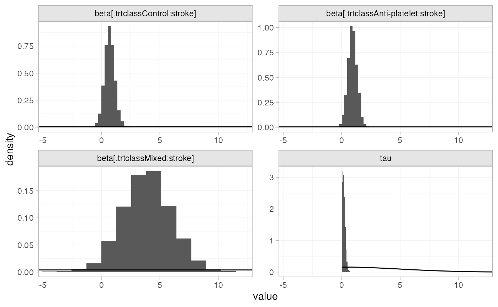

We can compute relative effects against placebo/standard care with the
[`relative_effects()`](https://dmphillippo.github.io/multinma/dev/reference/relative_effects.md)
function with the `trt_ref` argument, which by default produces relative
effects for the observed proportions of prior stroke in each study:

``` r
# Not run
(af_4b_releff <- relative_effects(af_fit_4b, trt_ref = "Placebo/Standard care"))
plot(af_4b_releff, ref_line = 0)
```

We can produce estimated treatment effects for particular covariate
values using the `newdata` argument. For example, treatment effects when
no individuals or all individuals have prior stroke are produced by

``` r
(af_4b_releff_01 <- relative_effects(af_fit_4b, 
                                     trt_ref = "Placebo/Standard care",
                                     newdata = data.frame(stroke = c(0, 1), 
                                                          label = c("stroke = 0", "stroke = 1")),
                                     study = label))
#> ------------------------------------------------------------- Study: stroke = 0 ---- 
#> 
#> Covariate values:
#>  stroke
#>       0
#> 
#>                                                           mean   sd  2.5%   25%   50%   75%
#> d[stroke = 0: Standard adjusted dose anti-coagulant]     -0.58 0.24 -1.04 -0.73 -0.58 -0.43
#> d[stroke = 0: Acenocoumarol]                             -1.37 0.83 -3.07 -1.92 -1.35 -0.80
#> d[stroke = 0: Alternate day aspirin]                     -1.73 1.33 -4.90 -2.45 -1.55 -0.82
#> d[stroke = 0: Dipyridamole]                              -0.29 0.43 -1.14 -0.56 -0.29 -0.01
#> d[stroke = 0: Fixed dose warfarin]                        0.07 0.44 -0.78 -0.22  0.04  0.35
#> d[stroke = 0: Fixed dose warfarin + low dose aspirin]    -0.28 0.33 -0.93 -0.48 -0.27 -0.07
#> d[stroke = 0: Fixed dose warfarin + medium dose aspirin] -0.73 0.66 -2.07 -1.15 -0.72 -0.31
#> d[stroke = 0: High dose aspirin]                         -0.44 0.77 -1.96 -0.95 -0.44  0.09
#> d[stroke = 0: Indobufen]                                 -1.26 0.56 -2.36 -1.60 -1.26 -0.92
#> d[stroke = 0: Low adjusted dose anti-coagulant]          -1.01 0.34 -1.69 -1.23 -1.01 -0.78
#> d[stroke = 0: Low dose aspirin]                          -0.14 0.22 -0.56 -0.28 -0.14  0.01
#> d[stroke = 0: Low dose aspirin + copidogrel]             -0.21 0.35 -0.94 -0.43 -0.21  0.00
#> d[stroke = 0: Low dose aspirin + dipyridamole]           -0.61 0.45 -1.51 -0.90 -0.61 -0.32
#> d[stroke = 0: Medium dose aspirin]                       -0.51 0.26 -1.04 -0.67 -0.50 -0.34
#> d[stroke = 0: Triflusal]                                  0.06 0.63 -1.16 -0.38  0.04  0.47
#> d[stroke = 0: Ximelagatran]                              -0.66 0.32 -1.29 -0.87 -0.66 -0.45
#>                                                          97.5% Bulk_ESS Tail_ESS Rhat
#> d[stroke = 0: Standard adjusted dose anti-coagulant]     -0.10     4710     3186    1
#> d[stroke = 0: Acenocoumarol]                              0.21     4657     2810    1
#> d[stroke = 0: Alternate day aspirin]                      0.37     3473     2080    1
#> d[stroke = 0: Dipyridamole]                               0.54     5591     2679    1
#> d[stroke = 0: Fixed dose warfarin]                        0.94     4827     2981    1
#> d[stroke = 0: Fixed dose warfarin + low dose aspirin]     0.37     4650     2908    1
#> d[stroke = 0: Fixed dose warfarin + medium dose aspirin]  0.57     4828     2707    1
#> d[stroke = 0: High dose aspirin]                          1.05     5883     2722    1
#> d[stroke = 0: Indobufen]                                 -0.15     4900     2575    1
#> d[stroke = 0: Low adjusted dose anti-coagulant]          -0.37     6413     3351    1
#> d[stroke = 0: Low dose aspirin]                           0.32     5000     3049    1
#> d[stroke = 0: Low dose aspirin + copidogrel]              0.47     3231     2037    1
#> d[stroke = 0: Low dose aspirin + dipyridamole]            0.32     5904     2682    1
#> d[stroke = 0: Medium dose aspirin]                        0.00     4473     2890    1
#> d[stroke = 0: Triflusal]                                  1.35     5523     3090    1
#> d[stroke = 0: Ximelagatran]                              -0.03     3923     2558    1
#> 
#> ------------------------------------------------------------- Study: stroke = 1 ---- 
#> 
#> Covariate values:
#>  stroke
#>       1
#> 
#>                                                           mean   sd  2.5%   25%   50%   75%
#> d[stroke = 1: Standard adjusted dose anti-coagulant]     -1.28 0.35 -1.98 -1.50 -1.27 -1.05
#> d[stroke = 1: Acenocoumarol]                              1.82 2.33 -2.77  0.36  1.81  3.34
#> d[stroke = 1: Alternate day aspirin]                     -1.51 1.37 -4.70 -2.23 -1.33 -0.59
#> d[stroke = 1: Dipyridamole]                              -0.06 0.38 -0.84 -0.31 -0.06  0.19
#> d[stroke = 1: Fixed dose warfarin]                       -0.64 0.50 -1.59 -0.98 -0.64 -0.30
#> d[stroke = 1: Fixed dose warfarin + low dose aspirin]     2.91 2.21 -1.47  1.50  2.92  4.33
#> d[stroke = 1: Fixed dose warfarin + medium dose aspirin]  2.46 1.66 -0.84  1.39  2.45  3.50
#> d[stroke = 1: High dose aspirin]                         -0.21 0.73 -1.69 -0.69 -0.21  0.26
#> d[stroke = 1: Indobufen]                                 -1.03 0.52 -2.08 -1.35 -1.03 -0.71
#> d[stroke = 1: Low adjusted dose anti-coagulant]          -1.71 0.51 -2.75 -2.05 -1.70 -1.36
#> d[stroke = 1: Low dose aspirin]                           0.09 0.28 -0.47 -0.09  0.10  0.27
#> d[stroke = 1: Low dose aspirin + copidogrel]              0.01 0.38 -0.74 -0.21  0.02  0.26
#> d[stroke = 1: Low dose aspirin + dipyridamole]           -0.38 0.41 -1.22 -0.64 -0.37 -0.12
#> d[stroke = 1: Medium dose aspirin]                       -0.28 0.24 -0.77 -0.42 -0.28 -0.13
#> d[stroke = 1: Triflusal]                                  0.28 0.66 -1.01 -0.16  0.28  0.71
#> d[stroke = 1: Ximelagatran]                              -1.37 0.41 -2.19 -1.62 -1.36 -1.10
#>                                                          97.5% Bulk_ESS Tail_ESS Rhat
#> d[stroke = 1: Standard adjusted dose anti-coagulant]     -0.63     5063     2613    1
#> d[stroke = 1: Acenocoumarol]                              6.36     5239     2790    1
#> d[stroke = 1: Alternate day aspirin]                      0.67     3525     2081    1
#> d[stroke = 1: Dipyridamole]                               0.68     6252     2762    1
#> d[stroke = 1: Fixed dose warfarin]                        0.35     5061     2675    1
#> d[stroke = 1: Fixed dose warfarin + low dose aspirin]     7.34     5133     2768    1
#> d[stroke = 1: Fixed dose warfarin + medium dose aspirin]  5.63     5362     2525    1
#> d[stroke = 1: High dose aspirin]                          1.19     6957     2954    1
#> d[stroke = 1: Indobufen]                                 -0.01     4567     2699    1
#> d[stroke = 1: Low adjusted dose anti-coagulant]          -0.71     5321     3100    1
#> d[stroke = 1: Low dose aspirin]                           0.61     4453     2368    1
#> d[stroke = 1: Low dose aspirin + copidogrel]              0.73     3256     2207    1
#> d[stroke = 1: Low dose aspirin + dipyridamole]            0.40     6182     3255    1
#> d[stroke = 1: Medium dose aspirin]                        0.18     5110     2515    1
#> d[stroke = 1: Triflusal]                                  1.58     5784     3328    1
#> d[stroke = 1: Ximelagatran]                              -0.60     4321     2711    1
plot(af_4b_releff_01, ref_line = 0)
```

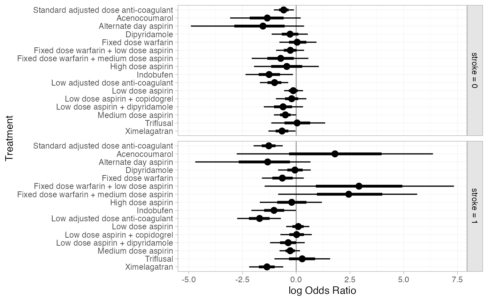

The estimated class interactions (against the reference “Mixed” class)
are very uncertain.

``` r
plot(af_fit_4b, pars = "beta", stat = "halfeye", ref_line = 0)
```

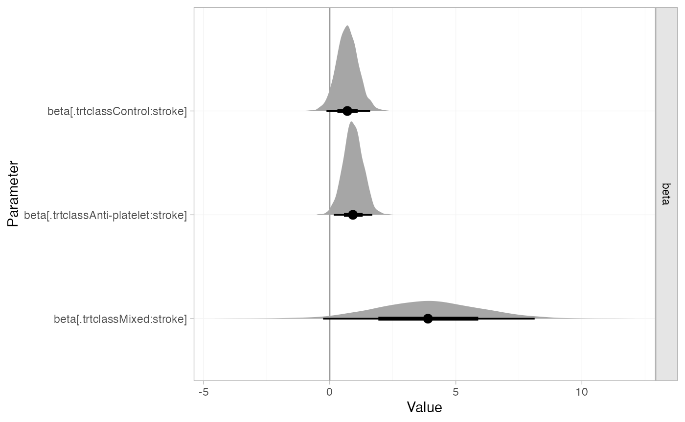

The interactions are more straightforward to interpret if we transform
the interaction coefficients (using the consistency equations) so that
they are against the control class:

``` r
af_4b_beta <- as.array(af_fit_4b, pars = "beta")

# Subtract beta[Control:stroke] from the other class interactions
af_4b_beta[ , , 2:3] <- sweep(af_4b_beta[ , , 2:3], 1:2, 
                              af_4b_beta[ , , "beta[.trtclassControl:stroke]"], FUN = "-")

# Set beta[Anti-coagulant:stroke] = -beta[Control:stroke]
af_4b_beta[ , , "beta[.trtclassControl:stroke]"] <- -af_4b_beta[ , , "beta[.trtclassControl:stroke]"]
names(af_4b_beta)[1] <- "beta[.trtclassAnti-coagulant:stroke]"

# Summarise
summary(af_4b_beta)
#>                                       mean   sd  2.5%   25%   50%   75% 97.5% Bulk_ESS
#> beta[.trtclassAnti-coagulant:stroke] -0.70 0.44 -1.60 -0.99 -0.70 -0.42  0.13     4657
#> beta[.trtclassAnti-platelet:stroke]   0.23 0.33 -0.43  0.01  0.23  0.44  0.86     4534
#> beta[.trtclassMixed:stroke]           3.19 2.19 -1.11  1.79  3.20  4.61  7.44     5094
#>                                      Tail_ESS Rhat
#> beta[.trtclassAnti-coagulant:stroke]     2695    1
#> beta[.trtclassAnti-platelet:stroke]      2910    1
#> beta[.trtclassMixed:stroke]              2608    1
plot(summary(af_4b_beta), stat = "halfeye", ref_line = 0)
```

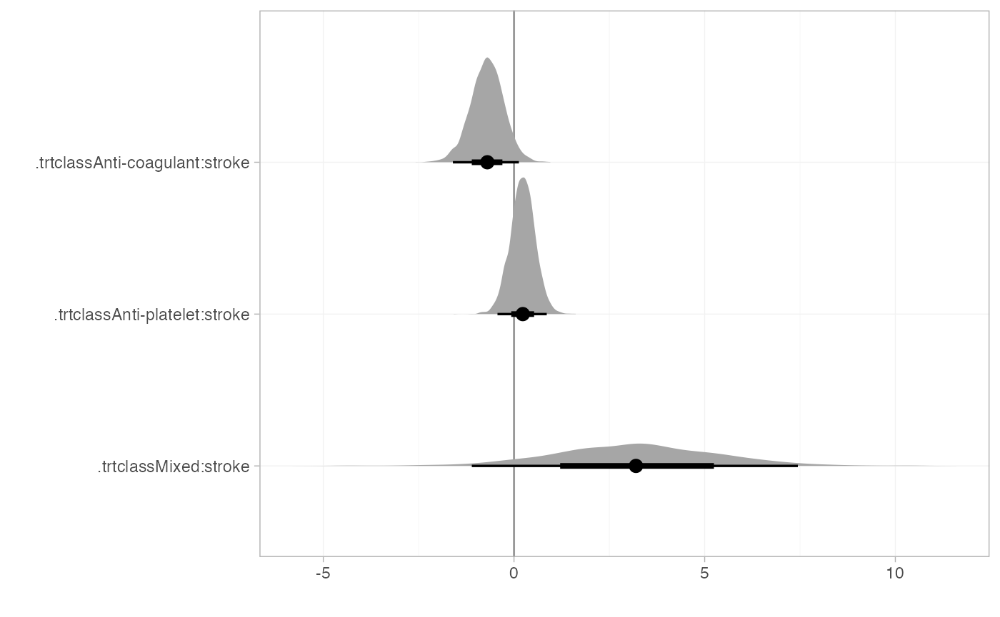

There is some evidence that the effect of anti-coagulants increases
(compared to control) with prior stroke. There is little evidence the
effect of anti-platelets reduces with prior stroke, although the point
estimate represents a substantial reduction in effectiveness, and the
95% Credible Interval includes values that correspond to substantial
increases in treatment effect. The interaction effect of stroke on mixed
treatments is very uncertain, but potentially indicates a substantial
reduction in treatment effects with prior stroke.

We can also produce treatment rankings, rank probabilities, and
cumulative rank probabilities. By default (without the `newdata`
argument specified), these are produced at the value of `stroke` for
each study in the network in turn. To instead produce rankings for when
no individuals or all individuals have prior stroke, we specify the
`newdata` argument.

``` r
(af_4b_ranks <- posterior_ranks(af_fit_4b,
                                newdata = data.frame(stroke = c(0, 1), 
                                                     label = c("stroke = 0", "stroke = 1")), 
                                study = label))
#> ------------------------------------------------------------- Study: stroke = 0 ---- 
#> 
#> Covariate values:
#>  stroke
#>       0
#> 
#>                                                              mean   sd 2.5% 25% 50% 75% 97.5%
#> rank[stroke = 0: Standard adjusted dose anti-coagulant]      7.74 1.85    4   6   8   9    11
#> rank[stroke = 0: Acenocoumarol]                              4.00 3.74    1   1   2   5    15
#> rank[stroke = 0: Alternate day aspirin]                      4.01 4.40    1   1   2   5    16
#> rank[stroke = 0: Dipyridamole]                              11.07 3.70    4   8  11  14    17
#> rank[stroke = 0: Fixed dose warfarin]                       14.19 2.78    7  13  15  16    17
#> rank[stroke = 0: Fixed dose warfarin + low dose aspirin]    11.05 3.64    4   8  11  14    17
#> rank[stroke = 0: Fixed dose warfarin + medium dose aspirin]  7.20 4.57    1   3   6  11    17
#> rank[stroke = 0: High dose aspirin]                          9.61 5.30    1   5  10  15    17
#> rank[stroke = 0: Indobufen]                                  3.62 2.73    1   2   3   4    12
#> rank[stroke = 0: Low adjusted dose anti-coagulant]           4.52 2.43    1   3   4   6    11
#> rank[stroke = 0: Low dose aspirin]                          12.95 1.92    9  12  13  14    16
#> rank[stroke = 0: Low dose aspirin + copidogrel]             11.99 2.92    5  10  12  14    17
#> rank[stroke = 0: Low dose aspirin + dipyridamole]            7.83 3.75    2   5   7  10    16
#> rank[stroke = 0: Medium dose aspirin]                        8.64 2.17    5   7   9  10    13
#> rank[stroke = 0: Placebo/Standard care]                     14.30 1.92   10  13  15  16    17
#> rank[stroke = 0: Triflusal]                                 13.30 4.10    4  11  15  17    17
#> rank[stroke = 0: Ximelagatran]                               6.97 2.59    3   5   7   9    13
#>                                                             Bulk_ESS Tail_ESS Rhat
#> rank[stroke = 0: Standard adjusted dose anti-coagulant]         4552     3343    1
#> rank[stroke = 0: Acenocoumarol]                                 4880     3263    1
#> rank[stroke = 0: Alternate day aspirin]                         4690     3459    1
#> rank[stroke = 0: Dipyridamole]                                  5996       NA    1
#> rank[stroke = 0: Fixed dose warfarin]                           4985       NA    1
#> rank[stroke = 0: Fixed dose warfarin + low dose aspirin]        4923     3107    1
#> rank[stroke = 0: Fixed dose warfarin + medium dose aspirin]     5312     3211    1
#> rank[stroke = 0: High dose aspirin]                             6087       NA    1
#> rank[stroke = 0: Indobufen]                                     3545     2704    1
#> rank[stroke = 0: Low adjusted dose anti-coagulant]              4872     3279    1
#> rank[stroke = 0: Low dose aspirin]                              3622     3054    1
#> rank[stroke = 0: Low dose aspirin + copidogrel]                 2959     1970    1
#> rank[stroke = 0: Low dose aspirin + dipyridamole]               5513     3376    1
#> rank[stroke = 0: Medium dose aspirin]                           4751     3139    1
#> rank[stroke = 0: Placebo/Standard care]                         3616       NA    1
#> rank[stroke = 0: Triflusal]                                     4998       NA    1
#> rank[stroke = 0: Ximelagatran]                                  3857     2861    1
#> 
#> ------------------------------------------------------------- Study: stroke = 1 ---- 
#> 
#> Covariate values:
#>  stroke
#>       1
#> 
#>                                                              mean   sd 2.5% 25% 50% 75% 97.5%
#> rank[stroke = 1: Standard adjusted dose anti-coagulant]      3.62 1.12    2   3   4   4     6
#> rank[stroke = 1: Acenocoumarol]                             13.20 4.43    1  14  15  16    17
#> rank[stroke = 1: Alternate day aspirin]                      4.52 3.96    1   1   3   6    14
#> rank[stroke = 1: Dipyridamole]                              10.56 2.71    6   9  11  13    16
#> rank[stroke = 1: Fixed dose warfarin]                        7.11 2.70    3   5   6   8    14
#> rank[stroke = 1: Fixed dose warfarin + low dose aspirin]    15.76 3.02    5  16  17  17    17
#> rank[stroke = 1: Fixed dose warfarin + medium dose aspirin] 15.37 2.09    8  15  16  16    17
#> rank[stroke = 1: High dose aspirin]                          9.42 3.96    2   6   9  13    16
#> rank[stroke = 1: Indobufen]                                  4.99 2.19    1   4   5   6    11
#> rank[stroke = 1: Low adjusted dose anti-coagulant]           2.02 1.30    1   1   2   2     6
#> rank[stroke = 1: Low dose aspirin]                          11.95 1.80    8  11  12  13    15
#> rank[stroke = 1: Low dose aspirin + copidogrel]             11.15 2.36    6  10  11  13    15
#> rank[stroke = 1: Low dose aspirin + dipyridamole]            8.22 2.70    3   6   8  10    14
#> rank[stroke = 1: Medium dose aspirin]                        8.68 1.67    6   8   9  10    12
#> rank[stroke = 1: Placebo/Standard care]                     11.21 1.95    8  10  11  13    15
#> rank[stroke = 1: Triflusal]                                 12.09 3.13    5  10  13  14    17
#> rank[stroke = 1: Ximelagatran]                               3.14 1.38    1   2   3   4     6
#>                                                             Bulk_ESS Tail_ESS Rhat
#> rank[stroke = 1: Standard adjusted dose anti-coagulant]         3205     2853    1
#> rank[stroke = 1: Acenocoumarol]                                 4087       NA    1
#> rank[stroke = 1: Alternate day aspirin]                         4631     3414    1
#> rank[stroke = 1: Dipyridamole]                                  5497     3096    1
#> rank[stroke = 1: Fixed dose warfarin]                           4125     2804    1
#> rank[stroke = 1: Fixed dose warfarin + low dose aspirin]        3382       NA    1
#> rank[stroke = 1: Fixed dose warfarin + medium dose aspirin]     3384       NA    1
#> rank[stroke = 1: High dose aspirin]                             5620     2986    1
#> rank[stroke = 1: Indobufen]                                     3955     2724    1
#> rank[stroke = 1: Low adjusted dose anti-coagulant]              3345     3118    1
#> rank[stroke = 1: Low dose aspirin]                              4588     3361    1
#> rank[stroke = 1: Low dose aspirin + copidogrel]                 3336     2725    1
#> rank[stroke = 1: Low dose aspirin + dipyridamole]               5622     2882    1
#> rank[stroke = 1: Medium dose aspirin]                           4163     2772    1
#> rank[stroke = 1: Placebo/Standard care]                         4317     3229    1
#> rank[stroke = 1: Triflusal]                                     4893       NA    1
#> rank[stroke = 1: Ximelagatran]                                  3013     2903    1
plot(af_4b_ranks)
```

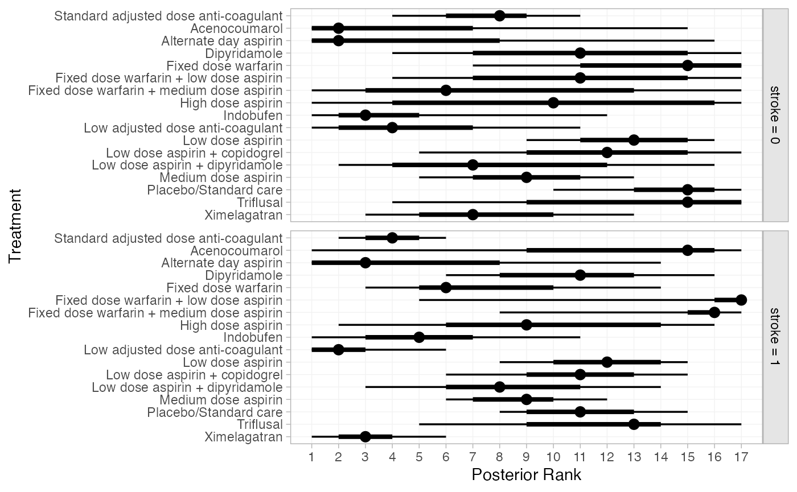

``` r
(af_4b_rankprobs <- posterior_rank_probs(af_fit_4b,
                                         newdata = data.frame(stroke = c(0, 1), 
                                                              label = c("stroke = 0", "stroke = 1")), 
                                         study = label))
#> ------------------------------------------------------------- Study: stroke = 0 ---- 
#> 
#> Covariate values:
#>  stroke
#>       0
#> 
#>                                                          p_rank[1] p_rank[2] p_rank[3]
#> d[stroke = 0: Standard adjusted dose anti-coagulant]          0.00      0.00      0.01
#> d[stroke = 0: Acenocoumarol]                                  0.27      0.23      0.13
#> d[stroke = 0: Alternate day aspirin]                          0.42      0.15      0.09
#> d[stroke = 0: Dipyridamole]                                   0.00      0.01      0.01
#> d[stroke = 0: Fixed dose warfarin]                            0.00      0.00      0.00
#> d[stroke = 0: Fixed dose warfarin + low dose aspirin]         0.00      0.00      0.01
#> d[stroke = 0: Fixed dose warfarin + medium dose aspirin]      0.05      0.10      0.11
#> d[stroke = 0: High dose aspirin]                              0.04      0.06      0.07
#> d[stroke = 0: Indobufen]                                      0.16      0.26      0.22
#> d[stroke = 0: Low adjusted dose anti-coagulant]               0.05      0.13      0.21
#> d[stroke = 0: Low dose aspirin]                               0.00      0.00      0.00
#> d[stroke = 0: Low dose aspirin + copidogrel]                  0.00      0.00      0.00
#> d[stroke = 0: Low dose aspirin + dipyridamole]                0.01      0.04      0.07
#> d[stroke = 0: Medium dose aspirin]                            0.00      0.00      0.01
#> d[stroke = 0: Placebo/Standard care]                          0.00      0.00      0.00
#> d[stroke = 0: Triflusal]                                      0.00      0.01      0.01
#> d[stroke = 0: Ximelagatran]                                   0.00      0.01      0.05
#>                                                          p_rank[4] p_rank[5] p_rank[6]
#> d[stroke = 0: Standard adjusted dose anti-coagulant]          0.03      0.08      0.15
#> d[stroke = 0: Acenocoumarol]                                  0.09      0.06      0.04
#> d[stroke = 0: Alternate day aspirin]                          0.06      0.04      0.03
#> d[stroke = 0: Dipyridamole]                                   0.02      0.04      0.06
#> d[stroke = 0: Fixed dose warfarin]                            0.00      0.01      0.01
#> d[stroke = 0: Fixed dose warfarin + low dose aspirin]         0.03      0.04      0.05
#> d[stroke = 0: Fixed dose warfarin + medium dose aspirin]      0.11      0.10      0.08
#> d[stroke = 0: High dose aspirin]                              0.07      0.07      0.05
#> d[stroke = 0: Indobufen]                                      0.13      0.07      0.04
#> d[stroke = 0: Low adjusted dose anti-coagulant]               0.21      0.14      0.08
#> d[stroke = 0: Low dose aspirin]                               0.00      0.00      0.00
#> d[stroke = 0: Low dose aspirin + copidogrel]                  0.01      0.01      0.02
#> d[stroke = 0: Low dose aspirin + dipyridamole]                0.10      0.11      0.11
#> d[stroke = 0: Medium dose aspirin]                            0.02      0.05      0.09
#> d[stroke = 0: Placebo/Standard care]                          0.00      0.00      0.00
#> d[stroke = 0: Triflusal]                                      0.02      0.03      0.03
#> d[stroke = 0: Ximelagatran]                                   0.10      0.16      0.16
#>                                                          p_rank[7] p_rank[8] p_rank[9]
#> d[stroke = 0: Standard adjusted dose anti-coagulant]          0.19      0.22      0.16
#> d[stroke = 0: Acenocoumarol]                                  0.03      0.02      0.02
#> d[stroke = 0: Alternate day aspirin]                          0.02      0.02      0.02
#> d[stroke = 0: Dipyridamole]                                   0.06      0.06      0.07
#> d[stroke = 0: Fixed dose warfarin]                            0.01      0.02      0.03
#> d[stroke = 0: Fixed dose warfarin + low dose aspirin]         0.05      0.06      0.08
#> d[stroke = 0: Fixed dose warfarin + medium dose aspirin]      0.07      0.05      0.05
#> d[stroke = 0: High dose aspirin]                              0.04      0.04      0.05
#> d[stroke = 0: Indobufen]                                      0.03      0.02      0.02
#> d[stroke = 0: Low adjusted dose anti-coagulant]               0.06      0.04      0.03
#> d[stroke = 0: Low dose aspirin]                               0.00      0.01      0.03
#> d[stroke = 0: Low dose aspirin + copidogrel]                  0.03      0.04      0.06
#> d[stroke = 0: Low dose aspirin + dipyridamole]                0.09      0.08      0.08
#> d[stroke = 0: Medium dose aspirin]                            0.14      0.17      0.18
#> d[stroke = 0: Placebo/Standard care]                          0.00      0.00      0.01
#> d[stroke = 0: Triflusal]                                      0.03      0.04      0.04
#> d[stroke = 0: Ximelagatran]                                   0.15      0.12      0.09
#>                                                          p_rank[10] p_rank[11] p_rank[12]
#> d[stroke = 0: Standard adjusted dose anti-coagulant]           0.10       0.05       0.02
#> d[stroke = 0: Acenocoumarol]                                   0.02       0.02       0.02
#> d[stroke = 0: Alternate day aspirin]                           0.02       0.02       0.02
#> d[stroke = 0: Dipyridamole]                                    0.09       0.09       0.10
#> d[stroke = 0: Fixed dose warfarin]                             0.04       0.06       0.07
#> d[stroke = 0: Fixed dose warfarin + low dose aspirin]          0.08       0.10       0.10
#> d[stroke = 0: Fixed dose warfarin + medium dose aspirin]       0.04       0.04       0.04
#> d[stroke = 0: High dose aspirin]                               0.05       0.05       0.04
#> d[stroke = 0: Indobufen]                                       0.01       0.01       0.01
#> d[stroke = 0: Low adjusted dose anti-coagulant]                0.02       0.01       0.01
#> d[stroke = 0: Low dose aspirin]                                0.06       0.11       0.18
#> d[stroke = 0: Low dose aspirin + copidogrel]                   0.10       0.12       0.14
#> d[stroke = 0: Low dose aspirin + dipyridamole]                 0.08       0.06       0.05
#> d[stroke = 0: Medium dose aspirin]                             0.15       0.10       0.06
#> d[stroke = 0: Placebo/Standard care]                           0.02       0.05       0.07
#> d[stroke = 0: Triflusal]                                       0.05       0.04       0.06
#> d[stroke = 0: Ximelagatran]                                    0.07       0.05       0.03
#>                                                          p_rank[13] p_rank[14] p_rank[15]
#> d[stroke = 0: Standard adjusted dose anti-coagulant]           0.01       0.00       0.00
#> d[stroke = 0: Acenocoumarol]                                   0.01       0.01       0.01
#> d[stroke = 0: Alternate day aspirin]                           0.01       0.01       0.02
#> d[stroke = 0: Dipyridamole]                                    0.10       0.08       0.09
#> d[stroke = 0: Fixed dose warfarin]                             0.09       0.10       0.13
#> d[stroke = 0: Fixed dose warfarin + low dose aspirin]          0.09       0.10       0.09
#> d[stroke = 0: Fixed dose warfarin + medium dose aspirin]       0.03       0.04       0.04
#> d[stroke = 0: High dose aspirin]                               0.04       0.05       0.06
#> d[stroke = 0: Indobufen]                                       0.01       0.00       0.01
#> d[stroke = 0: Low adjusted dose anti-coagulant]                0.00       0.00       0.00
#> d[stroke = 0: Low dose aspirin]                                0.20       0.18       0.14
#> d[stroke = 0: Low dose aspirin + copidogrel]                   0.14       0.11       0.10
#> d[stroke = 0: Low dose aspirin + dipyridamole]                 0.03       0.03       0.03
#> d[stroke = 0: Medium dose aspirin]                             0.02       0.01       0.00
#> d[stroke = 0: Placebo/Standard care]                           0.13       0.20       0.21
#> d[stroke = 0: Triflusal]                                       0.06       0.06       0.07
#> d[stroke = 0: Ximelagatran]                                    0.02       0.01       0.00
#>                                                          p_rank[16] p_rank[17]
#> d[stroke = 0: Standard adjusted dose anti-coagulant]           0.00       0.00
#> d[stroke = 0: Acenocoumarol]                                   0.02       0.00
#> d[stroke = 0: Alternate day aspirin]                           0.02       0.02
#> d[stroke = 0: Dipyridamole]                                    0.07       0.05
#> d[stroke = 0: Fixed dose warfarin]                             0.20       0.23
#> d[stroke = 0: Fixed dose warfarin + low dose aspirin]          0.07       0.04
#> d[stroke = 0: Fixed dose warfarin + medium dose aspirin]       0.04       0.03
#> d[stroke = 0: High dose aspirin]                               0.08       0.13
#> d[stroke = 0: Indobufen]                                       0.00       0.00
#> d[stroke = 0: Low adjusted dose anti-coagulant]                0.00       0.00
#> d[stroke = 0: Low dose aspirin]                                0.07       0.02
#> d[stroke = 0: Low dose aspirin + copidogrel]                   0.08       0.03
#> d[stroke = 0: Low dose aspirin + dipyridamole]                 0.02       0.01
#> d[stroke = 0: Medium dose aspirin]                             0.00       0.00
#> d[stroke = 0: Placebo/Standard care]                           0.20       0.10
#> d[stroke = 0: Triflusal]                                       0.13       0.33
#> d[stroke = 0: Ximelagatran]                                    0.00       0.00
#> 
#> ------------------------------------------------------------- Study: stroke = 1 ---- 
#> 
#> Covariate values:
#>  stroke
#>       1
#> 
#>                                                          p_rank[1] p_rank[2] p_rank[3]
#> d[stroke = 1: Standard adjusted dose anti-coagulant]          0.01      0.13      0.34
#> d[stroke = 1: Acenocoumarol]                                  0.04      0.02      0.01
#> d[stroke = 1: Alternate day aspirin]                          0.35      0.10      0.05
#> d[stroke = 1: Dipyridamole]                                   0.00      0.00      0.00
#> d[stroke = 1: Fixed dose warfarin]                            0.00      0.01      0.02
#> d[stroke = 1: Fixed dose warfarin + low dose aspirin]         0.00      0.01      0.01
#> d[stroke = 1: Fixed dose warfarin + medium dose aspirin]      0.00      0.00      0.01
#> d[stroke = 1: High dose aspirin]                              0.02      0.03      0.03
#> d[stroke = 1: Indobufen]                                      0.03      0.09      0.10
#> d[stroke = 1: Low adjusted dose anti-coagulant]               0.44      0.33      0.11
#> d[stroke = 1: Low dose aspirin]                               0.00      0.00      0.00
#> d[stroke = 1: Low dose aspirin + copidogrel]                  0.00      0.00      0.00
#> d[stroke = 1: Low dose aspirin + dipyridamole]                0.01      0.01      0.01
#> d[stroke = 1: Medium dose aspirin]                            0.00      0.00      0.00
#> d[stroke = 1: Placebo/Standard care]                          0.00      0.00      0.00
#> d[stroke = 1: Triflusal]                                      0.00      0.00      0.00
#> d[stroke = 1: Ximelagatran]                                   0.09      0.27      0.30
#>                                                          p_rank[4] p_rank[5] p_rank[6]
#> d[stroke = 1: Standard adjusted dose anti-coagulant]          0.33      0.14      0.03
#> d[stroke = 1: Acenocoumarol]                                  0.01      0.02      0.02
#> d[stroke = 1: Alternate day aspirin]                          0.07      0.09      0.09
#> d[stroke = 1: Dipyridamole]                                   0.01      0.01      0.04
#> d[stroke = 1: Fixed dose warfarin]                            0.06      0.18      0.26
#> d[stroke = 1: Fixed dose warfarin + low dose aspirin]         0.00      0.00      0.01
#> d[stroke = 1: Fixed dose warfarin + medium dose aspirin]      0.00      0.00      0.00
#> d[stroke = 1: High dose aspirin]                              0.04      0.05      0.09
#> d[stroke = 1: Indobufen]                                      0.18      0.26      0.16
#> d[stroke = 1: Low adjusted dose anti-coagulant]               0.07      0.03      0.02
#> d[stroke = 1: Low dose aspirin]                               0.00      0.00      0.00
#> d[stroke = 1: Low dose aspirin + copidogrel]                  0.00      0.01      0.02
#> d[stroke = 1: Low dose aspirin + dipyridamole]                0.02      0.08      0.13
#> d[stroke = 1: Medium dose aspirin]                            0.00      0.01      0.05
#> d[stroke = 1: Placebo/Standard care]                          0.00      0.00      0.00
#> d[stroke = 1: Triflusal]                                      0.00      0.02      0.03
#> d[stroke = 1: Ximelagatran]                                   0.19      0.10      0.04
#>                                                          p_rank[7] p_rank[8] p_rank[9]
#> d[stroke = 1: Standard adjusted dose anti-coagulant]          0.01      0.00      0.00
#> d[stroke = 1: Acenocoumarol]                                  0.02      0.02      0.02
#> d[stroke = 1: Alternate day aspirin]                          0.06      0.04      0.02
#> d[stroke = 1: Dipyridamole]                                   0.08      0.10      0.11
#> d[stroke = 1: Fixed dose warfarin]                            0.15      0.09      0.06
#> d[stroke = 1: Fixed dose warfarin + low dose aspirin]         0.01      0.01      0.01
#> d[stroke = 1: Fixed dose warfarin + medium dose aspirin]      0.00      0.01      0.01
#> d[stroke = 1: High dose aspirin]                              0.11      0.08      0.07
#> d[stroke = 1: Indobufen]                                      0.08      0.04      0.02
#> d[stroke = 1: Low adjusted dose anti-coagulant]               0.01      0.00      0.00
#> d[stroke = 1: Low dose aspirin]                               0.01      0.02      0.06
#> d[stroke = 1: Low dose aspirin + copidogrel]                  0.04      0.07      0.10
#> d[stroke = 1: Low dose aspirin + dipyridamole]                0.18      0.16      0.12
#> d[stroke = 1: Medium dose aspirin]                            0.16      0.25      0.23
#> d[stroke = 1: Placebo/Standard care]                          0.02      0.05      0.11
#> d[stroke = 1: Triflusal]                                      0.05      0.05      0.05
#> d[stroke = 1: Ximelagatran]                                   0.01      0.00      0.00
#>                                                          p_rank[10] p_rank[11] p_rank[12]
#> d[stroke = 1: Standard adjusted dose anti-coagulant]           0.00       0.00       0.00
#> d[stroke = 1: Acenocoumarol]                                   0.01       0.01       0.01
#> d[stroke = 1: Alternate day aspirin]                           0.02       0.02       0.02
#> d[stroke = 1: Dipyridamole]                                    0.12       0.13       0.14
#> d[stroke = 1: Fixed dose warfarin]                             0.05       0.04       0.03
#> d[stroke = 1: Fixed dose warfarin + low dose aspirin]          0.01       0.01       0.01
#> d[stroke = 1: Fixed dose warfarin + medium dose aspirin]       0.01       0.01       0.01
#> d[stroke = 1: High dose aspirin]                               0.06       0.06       0.06
#> d[stroke = 1: Indobufen]                                       0.01       0.01       0.01
#> d[stroke = 1: Low adjusted dose anti-coagulant]                0.00       0.00       0.00
#> d[stroke = 1: Low dose aspirin]                                0.11       0.17       0.24
#> d[stroke = 1: Low dose aspirin + copidogrel]                   0.12       0.15       0.16
#> d[stroke = 1: Low dose aspirin + dipyridamole]                 0.09       0.06       0.05
#> d[stroke = 1: Medium dose aspirin]                             0.15       0.08       0.04
#> d[stroke = 1: Placebo/Standard care]                           0.18       0.20       0.17
#> d[stroke = 1: Triflusal]                                       0.05       0.07       0.07
#> d[stroke = 1: Ximelagatran]                                    0.00       0.00       0.00
#>                                                          p_rank[13] p_rank[14] p_rank[15]
#> d[stroke = 1: Standard adjusted dose anti-coagulant]           0.00       0.00       0.00
#> d[stroke = 1: Acenocoumarol]                                   0.02       0.05       0.45
#> d[stroke = 1: Alternate day aspirin]                           0.03       0.03       0.01
#> d[stroke = 1: Dipyridamole]                                    0.12       0.09       0.03
#> d[stroke = 1: Fixed dose warfarin]                             0.03       0.02       0.01
#> d[stroke = 1: Fixed dose warfarin + low dose aspirin]          0.01       0.02       0.04
#> d[stroke = 1: Fixed dose warfarin + medium dose aspirin]       0.01       0.02       0.26
#> d[stroke = 1: High dose aspirin]                               0.10       0.14       0.04
#> d[stroke = 1: Indobufen]                                       0.01       0.00       0.00
#> d[stroke = 1: Low adjusted dose anti-coagulant]                0.00       0.00       0.00
#> d[stroke = 1: Low dose aspirin]                                0.20       0.12       0.04
#> d[stroke = 1: Low dose aspirin + copidogrel]                   0.16       0.10       0.03
#> d[stroke = 1: Low dose aspirin + dipyridamole]                 0.04       0.03       0.01
#> d[stroke = 1: Medium dose aspirin]                             0.01       0.01       0.00
#> d[stroke = 1: Placebo/Standard care]                           0.15       0.07       0.02
#> d[stroke = 1: Triflusal]                                       0.13       0.32       0.05
#> d[stroke = 1: Ximelagatran]                                    0.00       0.00       0.00
#>                                                          p_rank[16] p_rank[17]
#> d[stroke = 1: Standard adjusted dose anti-coagulant]           0.00       0.00
#> d[stroke = 1: Acenocoumarol]                                   0.19       0.08
#> d[stroke = 1: Alternate day aspirin]                           0.00       0.01
#> d[stroke = 1: Dipyridamole]                                    0.02       0.01
#> d[stroke = 1: Fixed dose warfarin]                             0.00       0.00
#> d[stroke = 1: Fixed dose warfarin + low dose aspirin]          0.19       0.66
#> d[stroke = 1: Fixed dose warfarin + medium dose aspirin]       0.50       0.15
#> d[stroke = 1: High dose aspirin]                               0.02       0.02
#> d[stroke = 1: Indobufen]                                       0.00       0.00
#> d[stroke = 1: Low adjusted dose anti-coagulant]                0.00       0.00
#> d[stroke = 1: Low dose aspirin]                                0.02       0.01
#> d[stroke = 1: Low dose aspirin + copidogrel]                   0.01       0.01
#> d[stroke = 1: Low dose aspirin + dipyridamole]                 0.00       0.00
#> d[stroke = 1: Medium dose aspirin]                             0.00       0.00
#> d[stroke = 1: Placebo/Standard care]                           0.01       0.01
#> d[stroke = 1: Triflusal]                                       0.04       0.05
#> d[stroke = 1: Ximelagatran]                                    0.00       0.00

# Modify the default output with ggplot2 functionality
library(ggplot2)
plot(af_4b_rankprobs) + 
  facet_grid(Treatment~Study, labeller = label_wrap_gen(20)) + 
  theme(strip.text.y = element_text(angle = 0))
```

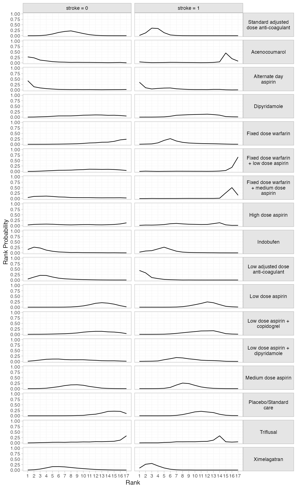

``` r
(af_4b_cumrankprobs <- posterior_rank_probs(af_fit_4b, cumulative = TRUE,
                                            newdata = data.frame(stroke = c(0, 1), 
                                                                 label = c("stroke = 0", "stroke = 1")), 
                                            study = label))
#> ------------------------------------------------------------- Study: stroke = 0 ---- 
#> 
#> Covariate values:
#>  stroke
#>       0
#> 
#>                                                          p_rank[1] p_rank[2] p_rank[3]
#> d[stroke = 0: Standard adjusted dose anti-coagulant]          0.00      0.00      0.01
#> d[stroke = 0: Acenocoumarol]                                  0.27      0.50      0.63
#> d[stroke = 0: Alternate day aspirin]                          0.42      0.57      0.67
#> d[stroke = 0: Dipyridamole]                                   0.00      0.01      0.02
#> d[stroke = 0: Fixed dose warfarin]                            0.00      0.00      0.00
#> d[stroke = 0: Fixed dose warfarin + low dose aspirin]         0.00      0.01      0.02
#> d[stroke = 0: Fixed dose warfarin + medium dose aspirin]      0.05      0.15      0.25
#> d[stroke = 0: High dose aspirin]                              0.04      0.10      0.17
#> d[stroke = 0: Indobufen]                                      0.16      0.42      0.64
#> d[stroke = 0: Low adjusted dose anti-coagulant]               0.05      0.18      0.39
#> d[stroke = 0: Low dose aspirin]                               0.00      0.00      0.00
#> d[stroke = 0: Low dose aspirin + copidogrel]                  0.00      0.00      0.01
#> d[stroke = 0: Low dose aspirin + dipyridamole]                0.01      0.05      0.11
#> d[stroke = 0: Medium dose aspirin]                            0.00      0.00      0.01
#> d[stroke = 0: Placebo/Standard care]                          0.00      0.00      0.00
#> d[stroke = 0: Triflusal]                                      0.00      0.01      0.02
#> d[stroke = 0: Ximelagatran]                                   0.00      0.02      0.06
#>                                                          p_rank[4] p_rank[5] p_rank[6]
#> d[stroke = 0: Standard adjusted dose anti-coagulant]          0.03      0.11      0.26
#> d[stroke = 0: Acenocoumarol]                                  0.72      0.77      0.81
#> d[stroke = 0: Alternate day aspirin]                          0.73      0.77      0.80
#> d[stroke = 0: Dipyridamole]                                   0.05      0.08      0.14
#> d[stroke = 0: Fixed dose warfarin]                            0.00      0.01      0.02
#> d[stroke = 0: Fixed dose warfarin + low dose aspirin]         0.05      0.08      0.14
#> d[stroke = 0: Fixed dose warfarin + medium dose aspirin]      0.37      0.46      0.54
#> d[stroke = 0: High dose aspirin]                              0.24      0.31      0.36
#> d[stroke = 0: Indobufen]                                      0.77      0.84      0.88
#> d[stroke = 0: Low adjusted dose anti-coagulant]               0.60      0.74      0.82
#> d[stroke = 0: Low dose aspirin]                               0.00      0.00      0.00
#> d[stroke = 0: Low dose aspirin + copidogrel]                  0.01      0.03      0.05
#> d[stroke = 0: Low dose aspirin + dipyridamole]                0.21      0.32      0.43
#> d[stroke = 0: Medium dose aspirin]                            0.02      0.08      0.16
#> d[stroke = 0: Placebo/Standard care]                          0.00      0.00      0.00
#> d[stroke = 0: Triflusal]                                      0.04      0.07      0.10
#> d[stroke = 0: Ximelagatran]                                   0.16      0.32      0.48
#>                                                          p_rank[7] p_rank[8] p_rank[9]
#> d[stroke = 0: Standard adjusted dose anti-coagulant]          0.45      0.67      0.83
#> d[stroke = 0: Acenocoumarol]                                  0.84      0.87      0.89
#> d[stroke = 0: Alternate day aspirin]                          0.82      0.84      0.86
#> d[stroke = 0: Dipyridamole]                                   0.20      0.26      0.33
#> d[stroke = 0: Fixed dose warfarin]                            0.03      0.05      0.07
#> d[stroke = 0: Fixed dose warfarin + low dose aspirin]         0.19      0.25      0.33
#> d[stroke = 0: Fixed dose warfarin + medium dose aspirin]      0.61      0.65      0.70
#> d[stroke = 0: High dose aspirin]                              0.41      0.44      0.49
#> d[stroke = 0: Indobufen]                                      0.91      0.93      0.95
#> d[stroke = 0: Low adjusted dose anti-coagulant]               0.88      0.92      0.95
#> d[stroke = 0: Low dose aspirin]                               0.00      0.01      0.04
#> d[stroke = 0: Low dose aspirin + copidogrel]                  0.08      0.12      0.18
#> d[stroke = 0: Low dose aspirin + dipyridamole]                0.52      0.60      0.68
#> d[stroke = 0: Medium dose aspirin]                            0.30      0.48      0.65
#> d[stroke = 0: Placebo/Standard care]                          0.00      0.01      0.02
#> d[stroke = 0: Triflusal]                                      0.12      0.16      0.20
#> d[stroke = 0: Ximelagatran]                                   0.62      0.74      0.83
#>                                                          p_rank[10] p_rank[11] p_rank[12]
#> d[stroke = 0: Standard adjusted dose anti-coagulant]           0.93       0.98       0.99
#> d[stroke = 0: Acenocoumarol]                                   0.91       0.93       0.95
#> d[stroke = 0: Alternate day aspirin]                           0.88       0.90       0.91
#> d[stroke = 0: Dipyridamole]                                    0.41       0.51       0.61
#> d[stroke = 0: Fixed dose warfarin]                             0.11       0.17       0.24
#> d[stroke = 0: Fixed dose warfarin + low dose aspirin]          0.41       0.51       0.61
#> d[stroke = 0: Fixed dose warfarin + medium dose aspirin]       0.74       0.79       0.83
#> d[stroke = 0: High dose aspirin]                               0.54       0.60       0.64
#> d[stroke = 0: Indobufen]                                       0.96       0.97       0.98
#> d[stroke = 0: Low adjusted dose anti-coagulant]                0.97       0.99       0.99
#> d[stroke = 0: Low dose aspirin]                                0.10       0.21       0.39
#> d[stroke = 0: Low dose aspirin + copidogrel]                   0.28       0.40       0.54
#> d[stroke = 0: Low dose aspirin + dipyridamole]                 0.76       0.82       0.87
#> d[stroke = 0: Medium dose aspirin]                             0.81       0.90       0.97
#> d[stroke = 0: Placebo/Standard care]                           0.04       0.09       0.16
#> d[stroke = 0: Triflusal]                                       0.25       0.29       0.35
#> d[stroke = 0: Ximelagatran]                                    0.90       0.94       0.97
#>                                                          p_rank[13] p_rank[14] p_rank[15]
#> d[stroke = 0: Standard adjusted dose anti-coagulant]           1.00       1.00       1.00
#> d[stroke = 0: Acenocoumarol]                                   0.96       0.97       0.98
#> d[stroke = 0: Alternate day aspirin]                           0.93       0.94       0.96
#> d[stroke = 0: Dipyridamole]                                    0.71       0.79       0.88
#> d[stroke = 0: Fixed dose warfarin]                             0.34       0.43       0.57
#> d[stroke = 0: Fixed dose warfarin + low dose aspirin]          0.70       0.80       0.89
#> d[stroke = 0: Fixed dose warfarin + medium dose aspirin]       0.86       0.90       0.93
#> d[stroke = 0: High dose aspirin]                               0.68       0.73       0.79
#> d[stroke = 0: Indobufen]                                       0.99       0.99       1.00
#> d[stroke = 0: Low adjusted dose anti-coagulant]                1.00       1.00       1.00
#> d[stroke = 0: Low dose aspirin]                                0.59       0.78       0.92
#> d[stroke = 0: Low dose aspirin + copidogrel]                   0.67       0.79       0.89
#> d[stroke = 0: Low dose aspirin + dipyridamole]                 0.91       0.94       0.97
#> d[stroke = 0: Medium dose aspirin]                             0.99       1.00       1.00
#> d[stroke = 0: Placebo/Standard care]                           0.29       0.49       0.70
#> d[stroke = 0: Triflusal]                                       0.41       0.47       0.55
#> d[stroke = 0: Ximelagatran]                                    0.99       1.00       1.00
#>                                                          p_rank[16] p_rank[17]
#> d[stroke = 0: Standard adjusted dose anti-coagulant]           1.00          1
#> d[stroke = 0: Acenocoumarol]                                   1.00          1
#> d[stroke = 0: Alternate day aspirin]                           0.98          1
#> d[stroke = 0: Dipyridamole]                                    0.95          1
#> d[stroke = 0: Fixed dose warfarin]                             0.77          1
#> d[stroke = 0: Fixed dose warfarin + low dose aspirin]          0.96          1
#> d[stroke = 0: Fixed dose warfarin + medium dose aspirin]       0.97          1
#> d[stroke = 0: High dose aspirin]                               0.87          1
#> d[stroke = 0: Indobufen]                                       1.00          1
#> d[stroke = 0: Low adjusted dose anti-coagulant]                1.00          1
#> d[stroke = 0: Low dose aspirin]                                0.98          1
#> d[stroke = 0: Low dose aspirin + copidogrel]                   0.97          1
#> d[stroke = 0: Low dose aspirin + dipyridamole]                 0.99          1
#> d[stroke = 0: Medium dose aspirin]                             1.00          1
#> d[stroke = 0: Placebo/Standard care]                           0.90          1
#> d[stroke = 0: Triflusal]                                       0.67          1
#> d[stroke = 0: Ximelagatran]                                    1.00          1
#> 
#> ------------------------------------------------------------- Study: stroke = 1 ---- 
#> 
#> Covariate values:
#>  stroke
#>       1
#> 
#>                                                          p_rank[1] p_rank[2] p_rank[3]
#> d[stroke = 1: Standard adjusted dose anti-coagulant]          0.01      0.14      0.48
#> d[stroke = 1: Acenocoumarol]                                  0.04      0.07      0.08
#> d[stroke = 1: Alternate day aspirin]                          0.35      0.45      0.50
#> d[stroke = 1: Dipyridamole]                                   0.00      0.00      0.00
#> d[stroke = 1: Fixed dose warfarin]                            0.00      0.01      0.03
#> d[stroke = 1: Fixed dose warfarin + low dose aspirin]         0.00      0.02      0.02
#> d[stroke = 1: Fixed dose warfarin + medium dose aspirin]      0.00      0.00      0.01
#> d[stroke = 1: High dose aspirin]                              0.02      0.05      0.08
#> d[stroke = 1: Indobufen]                                      0.03      0.12      0.22
#> d[stroke = 1: Low adjusted dose anti-coagulant]               0.44      0.76      0.88
#> d[stroke = 1: Low dose aspirin]                               0.00      0.00      0.00
#> d[stroke = 1: Low dose aspirin + copidogrel]                  0.00      0.00      0.00
#> d[stroke = 1: Low dose aspirin + dipyridamole]                0.01      0.02      0.03
#> d[stroke = 1: Medium dose aspirin]                            0.00      0.00      0.00
#> d[stroke = 1: Placebo/Standard care]                          0.00      0.00      0.00
#> d[stroke = 1: Triflusal]                                      0.00      0.01      0.01
#> d[stroke = 1: Ximelagatran]                                   0.09      0.35      0.66
#>                                                          p_rank[4] p_rank[5] p_rank[6]
#> d[stroke = 1: Standard adjusted dose anti-coagulant]          0.81      0.95      0.99
#> d[stroke = 1: Acenocoumarol]                                  0.09      0.10      0.13
#> d[stroke = 1: Alternate day aspirin]                          0.57      0.66      0.75
#> d[stroke = 1: Dipyridamole]                                   0.01      0.02      0.06
#> d[stroke = 1: Fixed dose warfarin]                            0.10      0.27      0.53
#> d[stroke = 1: Fixed dose warfarin + low dose aspirin]         0.02      0.03      0.04
#> d[stroke = 1: Fixed dose warfarin + medium dose aspirin]      0.01      0.01      0.02
#> d[stroke = 1: High dose aspirin]                              0.11      0.17      0.26
#> d[stroke = 1: Indobufen]                                      0.40      0.66      0.83
#> d[stroke = 1: Low adjusted dose anti-coagulant]               0.94      0.97      0.99
#> d[stroke = 1: Low dose aspirin]                               0.00      0.00      0.00
#> d[stroke = 1: Low dose aspirin + copidogrel]                  0.00      0.01      0.03
#> d[stroke = 1: Low dose aspirin + dipyridamole]                0.05      0.13      0.26
#> d[stroke = 1: Medium dose aspirin]                            0.00      0.02      0.07
#> d[stroke = 1: Placebo/Standard care]                          0.00      0.00      0.00
#> d[stroke = 1: Triflusal]                                      0.01      0.03      0.06
#> d[stroke = 1: Ximelagatran]                                   0.85      0.94      0.98
#>                                                          p_rank[7] p_rank[8] p_rank[9]
#> d[stroke = 1: Standard adjusted dose anti-coagulant]          1.00      1.00      1.00
#> d[stroke = 1: Acenocoumarol]                                  0.15      0.17      0.18
#> d[stroke = 1: Alternate day aspirin]                          0.81      0.85      0.87
#> d[stroke = 1: Dipyridamole]                                   0.15      0.25      0.36
#> d[stroke = 1: Fixed dose warfarin]                            0.68      0.77      0.83
#> d[stroke = 1: Fixed dose warfarin + low dose aspirin]         0.05      0.06      0.07
#> d[stroke = 1: Fixed dose warfarin + medium dose aspirin]      0.02      0.03      0.04
#> d[stroke = 1: High dose aspirin]                              0.36      0.45      0.52
#> d[stroke = 1: Indobufen]                                      0.90      0.94      0.96
#> d[stroke = 1: Low adjusted dose anti-coagulant]               1.00      1.00      1.00
#> d[stroke = 1: Low dose aspirin]                               0.01      0.03      0.09
#> d[stroke = 1: Low dose aspirin + copidogrel]                  0.07      0.14      0.24
#> d[stroke = 1: Low dose aspirin + dipyridamole]                0.44      0.60      0.72
#> d[stroke = 1: Medium dose aspirin]                            0.24      0.49      0.72
#> d[stroke = 1: Placebo/Standard care]                          0.02      0.08      0.19
#> d[stroke = 1: Triflusal]                                      0.11      0.17      0.22
#> d[stroke = 1: Ximelagatran]                                   0.99      1.00      1.00
#>                                                          p_rank[10] p_rank[11] p_rank[12]
#> d[stroke = 1: Standard adjusted dose anti-coagulant]           1.00       1.00       1.00
#> d[stroke = 1: Acenocoumarol]                                   0.20       0.20       0.22
#> d[stroke = 1: Alternate day aspirin]                           0.89       0.91       0.93
#> d[stroke = 1: Dipyridamole]                                    0.48       0.60       0.74
#> d[stroke = 1: Fixed dose warfarin]                             0.87       0.91       0.94
#> d[stroke = 1: Fixed dose warfarin + low dose aspirin]          0.07       0.08       0.08
#> d[stroke = 1: Fixed dose warfarin + medium dose aspirin]       0.04       0.05       0.06
#> d[stroke = 1: High dose aspirin]                               0.58       0.63       0.69
#> d[stroke = 1: Indobufen]                                       0.97       0.98       0.99
#> d[stroke = 1: Low adjusted dose anti-coagulant]                1.00       1.00       1.00
#> d[stroke = 1: Low dose aspirin]                                0.20       0.38       0.62
#> d[stroke = 1: Low dose aspirin + copidogrel]                   0.37       0.52       0.68
#> d[stroke = 1: Low dose aspirin + dipyridamole]                 0.81       0.87       0.92
#> d[stroke = 1: Medium dose aspirin]                             0.87       0.94       0.98
#> d[stroke = 1: Placebo/Standard care]                           0.37       0.57       0.74
#> d[stroke = 1: Triflusal]                                       0.27       0.34       0.41
#> d[stroke = 1: Ximelagatran]                                    1.00       1.00       1.00
#>                                                          p_rank[13] p_rank[14] p_rank[15]
#> d[stroke = 1: Standard adjusted dose anti-coagulant]           1.00       1.00       1.00
#> d[stroke = 1: Acenocoumarol]                                   0.24       0.28       0.73
#> d[stroke = 1: Alternate day aspirin]                           0.96       0.98       0.99
#> d[stroke = 1: Dipyridamole]                                    0.86       0.95       0.97
#> d[stroke = 1: Fixed dose warfarin]                             0.97       0.98       0.99
#> d[stroke = 1: Fixed dose warfarin + low dose aspirin]          0.09       0.11       0.15
#> d[stroke = 1: Fixed dose warfarin + medium dose aspirin]       0.07       0.08       0.35
#> d[stroke = 1: High dose aspirin]                               0.79       0.93       0.97
#> d[stroke = 1: Indobufen]                                       1.00       1.00       1.00
#> d[stroke = 1: Low adjusted dose anti-coagulant]                1.00       1.00       1.00
#> d[stroke = 1: Low dose aspirin]                                0.82       0.94       0.98
#> d[stroke = 1: Low dose aspirin + copidogrel]                   0.85       0.95       0.98
#> d[stroke = 1: Low dose aspirin + dipyridamole]                 0.96       0.99       0.99
#> d[stroke = 1: Medium dose aspirin]                             0.99       1.00       1.00
#> d[stroke = 1: Placebo/Standard care]                           0.89       0.96       0.98
#> d[stroke = 1: Triflusal]                                       0.54       0.86       0.91
#> d[stroke = 1: Ximelagatran]                                    1.00       1.00       1.00
#>                                                          p_rank[16] p_rank[17]
#> d[stroke = 1: Standard adjusted dose anti-coagulant]           1.00          1
#> d[stroke = 1: Acenocoumarol]                                   0.92          1
#> d[stroke = 1: Alternate day aspirin]                           0.99          1
#> d[stroke = 1: Dipyridamole]                                    0.99          1
#> d[stroke = 1: Fixed dose warfarin]                             1.00          1
#> d[stroke = 1: Fixed dose warfarin + low dose aspirin]          0.34          1
#> d[stroke = 1: Fixed dose warfarin + medium dose aspirin]       0.85          1
#> d[stroke = 1: High dose aspirin]                               0.98          1
#> d[stroke = 1: Indobufen]                                       1.00          1
#> d[stroke = 1: Low adjusted dose anti-coagulant]                1.00          1
#> d[stroke = 1: Low dose aspirin]                                0.99          1
#> d[stroke = 1: Low dose aspirin + copidogrel]                   0.99          1
#> d[stroke = 1: Low dose aspirin + dipyridamole]                 1.00          1
#> d[stroke = 1: Medium dose aspirin]                             1.00          1
#> d[stroke = 1: Placebo/Standard care]                           0.99          1
#> d[stroke = 1: Triflusal]                                       0.95          1
#> d[stroke = 1: Ximelagatran]                                    1.00          1

plot(af_4b_cumrankprobs) + 
  facet_grid(Treatment~Study, labeller = label_wrap_gen(20)) + 
  theme(strip.text.y = element_text(angle = 0))
```

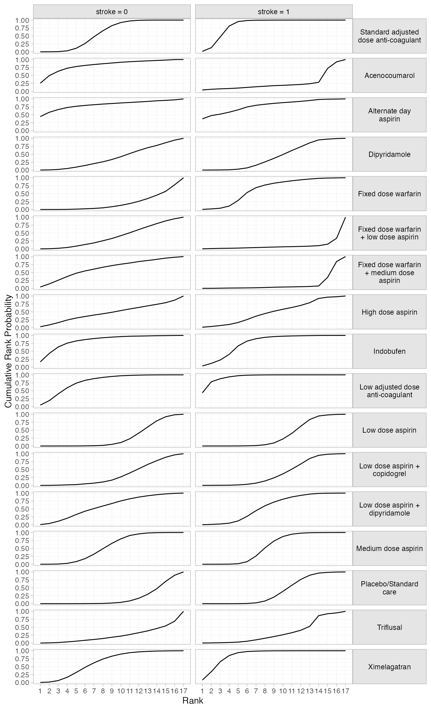

## Model fit and comparison

Model fit can be checked using the
[`dic()`](https://dmphillippo.github.io/multinma/dev/reference/dic.md)
function:

``` r
(af_dic_1 <- dic(af_fit_1))
#> Residual deviance: 60.5 (on 61 data points)
#>                pD: 48.7
#>               DIC: 109.2
```

``` r
(af_dic_4b <- dic(af_fit_4b))
#> Residual deviance: 57.9 (on 61 data points)
#>                pD: 47.7
#>               DIC: 105.6
```

Both models fit the data well, having posterior mean residual deviance
close to the number of data points. The DIC is slightly lower for the
meta-regression model, although only by a couple of points (substantial
differences are usually considered 3-5 points). The estimated
heterogeneity standard deviation is much lower for the meta-regression
model, suggesting that adjusting for the proportion of patients with
prior stroke is explaining some of the heterogeneity in the data.

We can also examine the residual deviance contributions with the
corresponding [`plot()`](https://rdrr.io/r/graphics/plot.default.html)
method.

``` r
plot(af_dic_1)
```

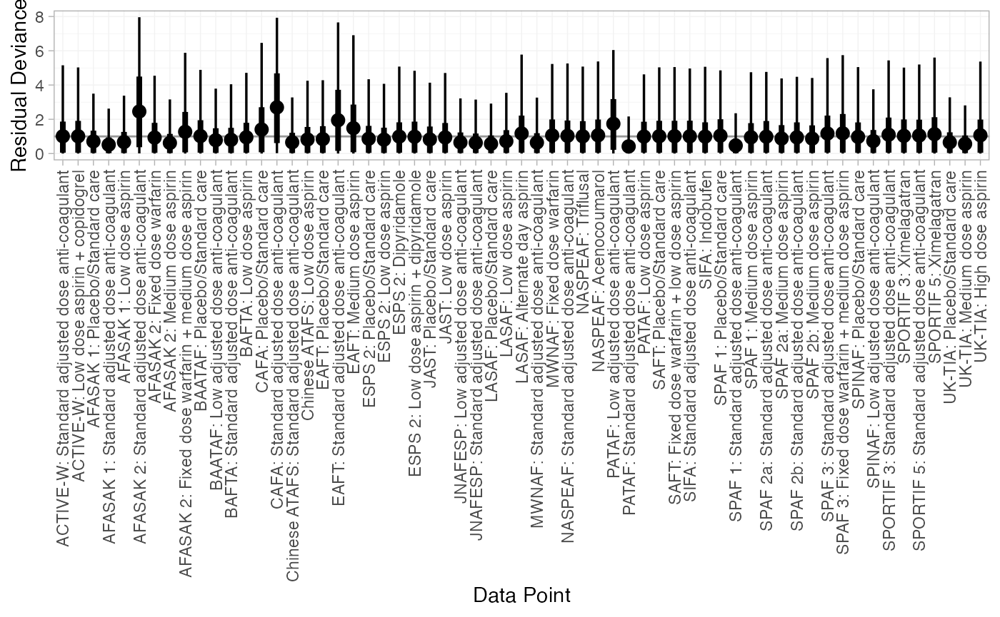

``` r
plot(af_dic_4b)
```

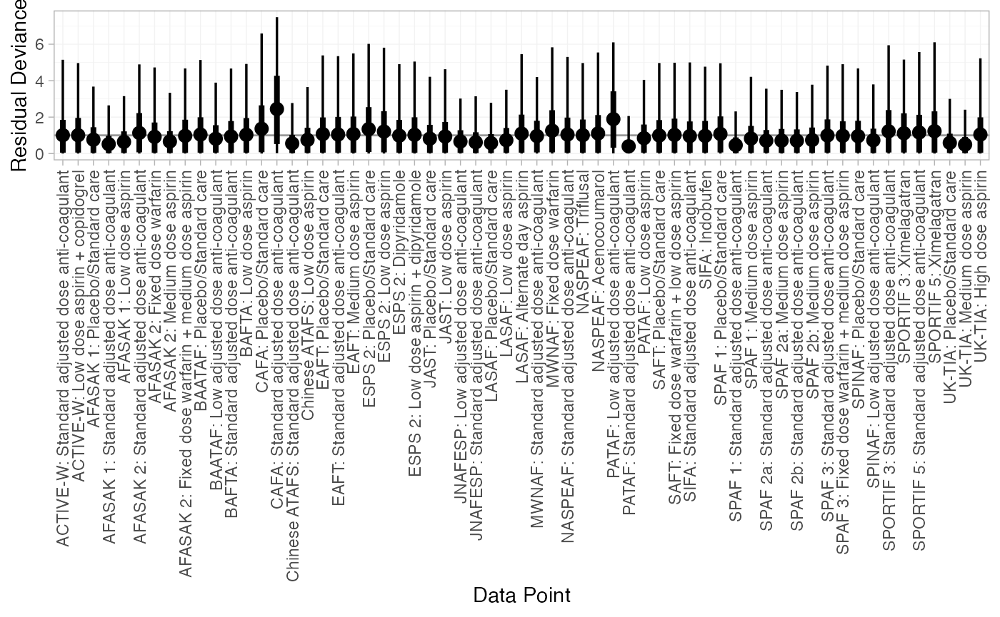

## References

Cooper, N. J., A. J. Sutton, D. Morris, A. E. Ades, and N. J. Welton.
2009. “Addressing Between-Study Heterogeneity and Inconsistency in Mixed
Treatment Comparisons: Application to Stroke Prevention Treatments in
Individuals with Non-Rheumatic Atrial Fibrillation.” *Statistics in
Medicine* 28 (14): 1861–81. <https://doi.org/10.1002/sim.3594>.
