# Example: Atrial fibrillation

``` r

library(multinma)
options(mc.cores = parallel::detectCores())
```

    #> For execution on a local, multicore CPU with excess RAM we recommend calling
    #> options(mc.cores = parallel::detectCores())
    #> 
    #> Attaching package: 'multinma'
    #> The following objects are masked from 'package:stats':
    #> 
    #>     dgamma, pgamma, qgamma

This vignette describes the analysis of 26 trials comparing 17
treatments in 4 classes for the prevention of stroke in patients with
atrial fibrillation ([Cooper et al. 2009](#ref-Cooper2009)). The data
are available in this package as `atrial_fibrillation`:

``` r

head(atrial_fibrillation)
#>     studyc studyn                                  trtc trtn      trt_class   r    n    E
#> 1 ACTIVE-W      1 Standard adjusted dose anti-coagulant    3 Anti-coagulant  65 3371 4200
#> 2 ACTIVE-W      1         Low dose aspirin + copidogrel   16  Anti-platelet 106 3335 4180
#> 3 AFASAK 1      2                 Placebo/Standard care    1        Control  19  336  398
#> 4 AFASAK 1      2 Standard adjusted dose anti-coagulant    3 Anti-coagulant   9  335  413
#> 5 AFASAK 1      2                      Low dose aspirin    5  Anti-platelet  16  336  409
#> 6 AFASAK 2      3 Standard adjusted dose anti-coagulant    3 Anti-coagulant  11  170  355
#>   stroke year followup
#> 1   0.15 2006      1.3
#> 2   0.15 2006      1.3
#> 3   0.06 1989      1.2
#> 4   0.06 1989      1.2
#> 5   0.06 1989      1.2
#> 6   0.10 1998      2.2
```

Cooper et al. ([2009](#ref-Cooper2009)) used this data to demonstrate
meta-regression models, which we recreate here.

## Setting up the network

Whilst we have data on the patient-years at risk in each study (`E`), we
ignore this here to follow the analysis of Cooper et al.
([2009](#ref-Cooper2009)), instead analysing the number of patients with
stroke (`r`) out of the total (`n`) in each arm. We use the function
[`set_agd_arm()`](https://dmphillippo.github.io/multinma/dev/reference/set_agd_arm.md)
to set up the network, making sure to specify the treatment classes
`trt_class`. We remove the WASPO study from the network as both arms had
zero events, and this study therefore contributes no information.

``` r

af_net <- set_agd_arm(atrial_fibrillation[atrial_fibrillation$studyc != "WASPO", ], 
                      study = studyc,
                      trt = trtc,
                      r = r, 
                      n = n,
                      trt_class = trt_class)
af_net
#> A network with 25 AgD studies (arm-based).
#> 
#> ------------------------------------------------------- AgD studies (arm-based) ---- 
#>  Study         Treatment arms                                                                 
#>  ACTIVE-W      2: Standard adjusted dose anti-coagulant | Low dose aspirin + copidogrel       
#>  AFASAK 1      3: Standard adjusted dose anti-coagulant | Low dose aspirin | Placebo/Standa...
#>  AFASAK 2      4: Standard adjusted dose anti-coagulant | Fixed dose warfarin | Fixed dose ...
#>  BAATAF        2: Low adjusted dose anti-coagulant | Placebo/Standard care                    
#>  BAFTA         2: Standard adjusted dose anti-coagulant | Low dose aspirin                    
#>  CAFA          2: Standard adjusted dose anti-coagulant | Placebo/Standard care               
#>  Chinese ATAFS 2: Standard adjusted dose anti-coagulant | Low dose aspirin                    
#>  EAFT          3: Standard adjusted dose anti-coagulant | Medium dose aspirin | Placebo/Sta...
#>  ESPS 2        4: Dipyridamole | Low dose aspirin | Low dose aspirin + dipyridamole | Place...
#>  JAST          2: Low dose aspirin | Placebo/Standard care                                    
#>  ... plus 15 more studies
#> 
#>  Outcome type: count
#> ------------------------------------------------------------------------------------
#> Total number of treatments: 17, in 4 classes
#> Total number of studies: 25
#> Reference treatment is: Standard adjusted dose anti-coagulant
#> Network is connected
```

(A better analysis, accounting for differences in the patient-years at
risk between studies, can be performed by specifying a rate outcome with
`r` and `E` in
[`set_agd_arm()`](https://dmphillippo.github.io/multinma/dev/reference/set_agd_arm.md)
above. The following code remains identical.)

Plot the network with the
[`plot()`](https://rdrr.io/r/graphics/plot.default.html) method:

``` r

plot(af_net, weight_nodes = TRUE, weight_edges = TRUE, show_trt_class = TRUE) + 
  ggplot2::theme(legend.position = "bottom", legend.box = "vertical")
```

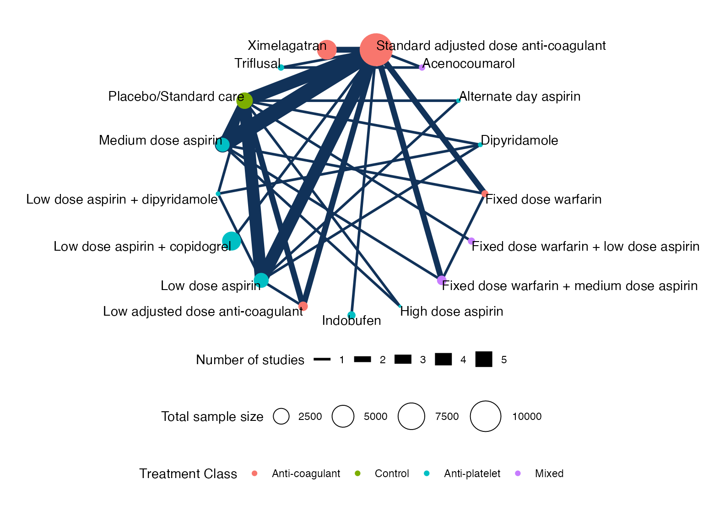

## Meta-analysis models

We fit two (random effects) models:

1.  A standard NMA model without any covariates (model 1 of Cooper et
    al. ([2009](#ref-Cooper2009)));
2.  A meta-regression model adjusting for the proportion of individuals
    in each study with prior stroke, with shared interaction
    coefficients by treatment class (model 4b of Cooper et al.
    ([2009](#ref-Cooper2009))).

### NMA with no covariates

We fit a random effects model using the
[`nma()`](https://dmphillippo.github.io/multinma/dev/reference/nma.md)
function with `trt_effects = "random"`. We use \mathrm{N}(0, 100^2)
prior distributions for the treatment effects d_k and study-specific
intercepts \mu_j, and a \textrm{half-N}(5^2) prior for the heterogeneity
standard deviation \tau. We can examine the range of parameter values
implied by these prior distributions with the
[`summary()`](https://rdrr.io/r/base/summary.html) method:

``` r

summary(normal(scale = 100))
#> A Normal prior distribution: location = 0, scale = 100.
#> 50% of the prior density lies between -67.45 and 67.45.
#> 95% of the prior density lies between -196 and 196.
summary(half_normal(scale = 5))
#> A half-Normal prior distribution: scale = 5.
#> 50% of the prior density lies between 0 and 3.37.
#> 95% of the prior density lies between 0 and 9.8.
```

Fitting the model with the
[`nma()`](https://dmphillippo.github.io/multinma/dev/reference/nma.md)
function. We increase the target acceptance rate `adapt_delta = 0.99` to
minimise divergent transition warnings.

``` r

af_fit_1 <- nma(af_net, 
                trt_effects = "random",
                prior_intercept = normal(scale = 100),
                prior_trt = normal(scale = 100),
                prior_het = half_normal(scale = 5),
                adapt_delta = 0.99)
```

    #> Note: Setting "Standard adjusted dose anti-coagulant" as the network reference treatment.

Basic parameter summaries are given by the
[`print()`](https://rdrr.io/r/base/print.html) method:

``` r

af_fit_1
#> A random effects NMA with a binomial likelihood (logit link).
#> Inference for Stan model: binomial_1par.
#> 4 chains, each with iter=5000; warmup=2500; thin=1; 
#> post-warmup draws per chain=2500, total post-warmup draws=10000.
#> 
#>                                                  mean se_mean   sd     2.5%      25%      50%
#> d[Acenocoumarol]                                -0.78    0.01 0.83    -2.48    -1.30    -0.74
#> d[Alternate day aspirin]                        -1.02    0.02 1.41    -4.30    -1.80    -0.84
#> d[Dipyridamole]                                  0.59    0.01 0.45    -0.28     0.30     0.59
#> d[Fixed dose warfarin]                           0.93    0.00 0.41     0.13     0.66     0.93
#> d[Fixed dose warfarin + low dose aspirin]        0.47    0.01 0.44    -0.41     0.20     0.47
#> d[Fixed dose warfarin + medium dose aspirin]     0.88    0.00 0.31     0.25     0.69     0.89
#> d[High dose aspirin]                             0.51    0.01 0.76    -1.00     0.00     0.53
#> d[Indobufen]                                     0.24    0.01 0.45    -0.68    -0.05     0.24
#> d[Low adjusted dose anti-coagulant]             -0.30    0.00 0.39    -1.07    -0.56    -0.29
#> d[Low dose aspirin]                              0.61    0.00 0.22     0.16     0.47     0.62
#> d[Low dose aspirin + copidogrel]                 0.51    0.00 0.35    -0.21     0.31     0.51
#> d[Low dose aspirin + dipyridamole]               0.26    0.01 0.47    -0.68    -0.04     0.27
#> d[Medium dose aspirin]                           0.38    0.00 0.20    -0.02     0.26     0.39
#> d[Placebo/Standard care]                         0.75    0.00 0.20     0.34     0.62     0.76
#> d[Triflusal]                                     0.65    0.01 0.62    -0.56     0.24     0.64
#> d[Ximelagatran]                                 -0.09    0.00 0.26    -0.61    -0.25    -0.09
#> lp__                                         -4771.83    0.15 7.28 -4786.99 -4776.51 -4771.51
#> tau                                              0.28    0.00 0.13     0.04     0.19     0.27
#>                                                   75%    97.5% n_eff Rhat
#> d[Acenocoumarol]                                -0.22     0.79  8481    1
#> d[Alternate day aspirin]                        -0.03     1.21  7900    1
#> d[Dipyridamole]                                  0.88     1.47  5297    1
#> d[Fixed dose warfarin]                           1.19     1.73  8431    1
#> d[Fixed dose warfarin + low dose aspirin]        0.75     1.33  5731    1
#> d[Fixed dose warfarin + medium dose aspirin]     1.09     1.50  6640    1
#> d[High dose aspirin]                             1.02     2.00  9273    1
#> d[Indobufen]                                     0.52     1.13  7506    1
#> d[Low adjusted dose anti-coagulant]             -0.04     0.44  6588    1
#> d[Low dose aspirin]                              0.76     1.05  4325    1
#> d[Low dose aspirin + copidogrel]                 0.72     1.24  7131    1
#> d[Low dose aspirin + dipyridamole]               0.58     1.17  6501    1
#> d[Medium dose aspirin]                           0.52     0.76  5445    1
#> d[Placebo/Standard care]                         0.89     1.15  3325    1
#> d[Triflusal]                                     1.06     1.88  7559    1
#> d[Ximelagatran]                                  0.08     0.44  6929    1
#> lp__                                         -4766.72 -4758.51  2500    1
#> tau                                              0.36     0.57  1662    1
#> 
#> Samples were drawn using NUTS(diag_e) at Thu Oct  8 11:09:25 2026.
#> For each parameter, n_eff is a crude measure of effective sample size,
#> and Rhat is the potential scale reduction factor on split chains (at 
#> convergence, Rhat=1).
```

By default, summaries of the study-specific intercepts \mu_j and
study-specific relative effects \delta\_{jk} are hidden, but could be
examined by changing the `pars` argument:

``` r

# Not run
print(af_fit_1, pars = c("d", "mu", "delta"))
```

The prior and posterior distributions can be compared visually using the
[`plot_prior_posterior()`](https://dmphillippo.github.io/multinma/dev/reference/plot_prior_posterior.md)
function:

``` r

plot_prior_posterior(af_fit_1, prior = c("trt", "het"))
```

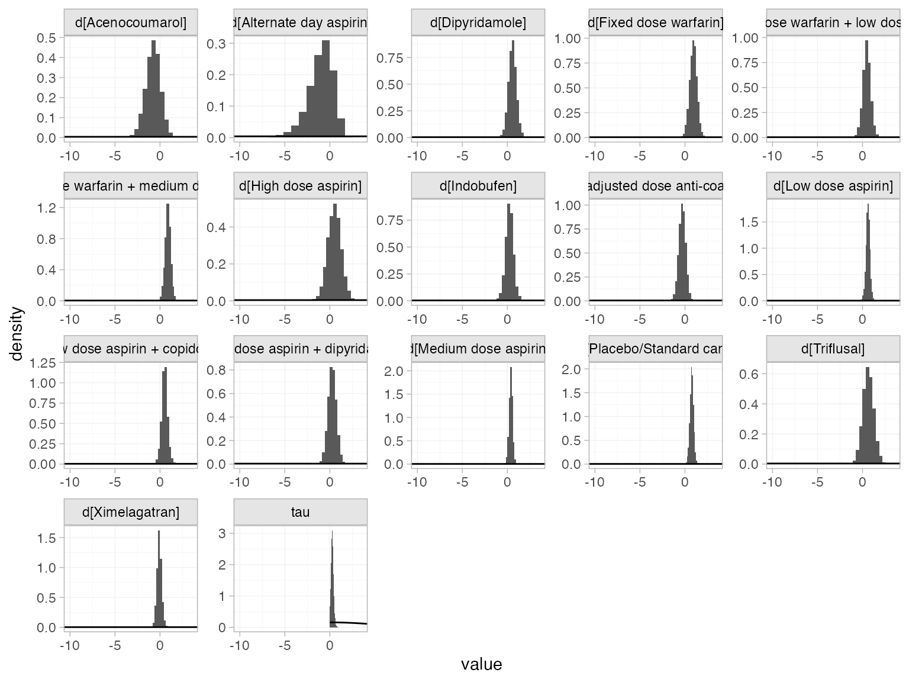

We can compute relative effects against placebo/standard care with the
[`relative_effects()`](https://dmphillippo.github.io/multinma/dev/reference/relative_effects.md)
function with the `trt_ref` argument:

``` r

(af_1_releff <- relative_effects(af_fit_1, trt_ref = "Placebo/Standard care"))
#>                                               mean   sd  2.5%   25%   50%   75% 97.5% Bulk_ESS
#> d[Standard adjusted dose anti-coagulant]     -0.75 0.20 -1.15 -0.89 -0.76 -0.62 -0.34     3344
#> d[Acenocoumarol]                             -1.53 0.86 -3.31 -2.08 -1.51 -0.96  0.11     7969
#> d[Alternate day aspirin]                     -1.77 1.40 -5.04 -2.55 -1.59 -0.79  0.43    10989
#> d[Dipyridamole]                              -0.16 0.42 -0.97 -0.44 -0.17  0.10  0.66     8754
#> d[Fixed dose warfarin]                        0.17 0.45 -0.69 -0.13  0.18  0.47  1.06     7164
#> d[Fixed dose warfarin + low dose aspirin]    -0.28 0.39 -1.07 -0.53 -0.28 -0.03  0.50     8365
#> d[Fixed dose warfarin + medium dose aspirin]  0.13 0.37 -0.61 -0.11  0.13  0.37  0.86     5782
#> d[High dose aspirin]                         -0.24 0.75 -1.73 -0.74 -0.24  0.27  1.21    11756
#> d[Indobufen]                                 -0.52 0.49 -1.49 -0.83 -0.52 -0.20  0.47     5962
#> d[Low adjusted dose anti-coagulant]          -1.05 0.36 -1.77 -1.28 -1.05 -0.82 -0.37    11405
#> d[Low dose aspirin]                          -0.14 0.21 -0.56 -0.28 -0.14  0.00  0.27     9964
#> d[Low dose aspirin + copidogrel]             -0.24 0.40 -1.05 -0.49 -0.24  0.00  0.58     6057
#> d[Low dose aspirin + dipyridamole]           -0.49 0.44 -1.38 -0.78 -0.49 -0.20  0.37    10245
#> d[Medium dose aspirin]                       -0.37 0.23 -0.82 -0.51 -0.37 -0.22  0.08     6432
#> d[Triflusal]                                 -0.10 0.65 -1.38 -0.53 -0.12  0.33  1.20     6968
#> d[Ximelagatran]                              -0.84 0.33 -1.49 -1.05 -0.84 -0.63 -0.17     4894
#>                                              Tail_ESS Rhat
#> d[Standard adjusted dose anti-coagulant]         5183    1
#> d[Acenocoumarol]                                 7153    1
#> d[Alternate day aspirin]                         5162    1
#> d[Dipyridamole]                                  7105    1
#> d[Fixed dose warfarin]                           7664    1
#> d[Fixed dose warfarin + low dose aspirin]        6352    1
#> d[Fixed dose warfarin + medium dose aspirin]     6279    1
#> d[High dose aspirin]                             8691    1
#> d[Indobufen]                                     5791    1
#> d[Low adjusted dose anti-coagulant]              8346    1
#> d[Low dose aspirin]                              7899    1
#> d[Low dose aspirin + copidogrel]                 5930    1
#> d[Low dose aspirin + dipyridamole]               7735    1
#> d[Medium dose aspirin]                           6033    1
#> d[Triflusal]                                     6415    1
#> d[Ximelagatran]                                  5433    1
```

These estimates can easily be plotted with the
[`plot()`](https://rdrr.io/r/graphics/plot.default.html) method:

``` r

plot(af_1_releff, ref_line = 0)
```

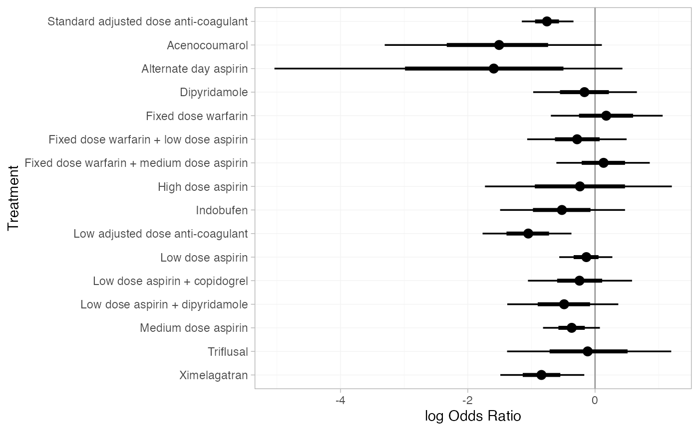

We can also produce treatment rankings, rank probabilities, and
cumulative rank probabilities.

``` r

(af_1_ranks <- posterior_ranks(af_fit_1))
#>                                                  mean   sd 2.5% 25% 50% 75% 97.5% Bulk_ESS
#> rank[Standard adjusted dose anti-coagulant]      5.31 1.48    3   4   5   6  8.00     5480
#> rank[Acenocoumarol]                              3.05 3.13    1   1   2   3 13.00     7499
#> rank[Alternate day aspirin]                      3.78 4.31    1   1   2   5 16.00    11845
#> rank[Dipyridamole]                              11.26 3.78    4   8  11  14 17.00     7625
#> rank[Fixed dose warfarin]                       14.10 3.06    6  12  15  16 17.00     8313
#> rank[Fixed dose warfarin + low dose aspirin]    10.11 3.80    3   7  10  13 17.00     7836
#> rank[Fixed dose warfarin + medium dose aspirin] 14.07 2.63    8  13  15  16 17.00     6162
#> rank[High dose aspirin]                         10.32 5.28    1   6  11  16 17.00    11222
#> rank[Indobufen]                                  7.98 3.94    2   5   7  11 16.00     6910
#> rank[Low adjusted dose anti-coagulant]           3.74 2.19    1   2   3   5  9.00     7956
#> rank[Low dose aspirin]                          11.74 2.28    7  10  12  13 16.00     8792
#> rank[Low dose aspirin + copidogrel]             10.53 3.43    4   8  10  13 17.00     7013
#> rank[Low dose aspirin + dipyridamole]            8.16 3.88    2   5   8  11 16.00     8823
#> rank[Medium dose aspirin]                        9.13 2.16    5   8   9  11 14.00     8699
#> rank[Placebo/Standard care]                     13.40 1.84   10  12  14  15 17.00     7070
#> rank[Triflusal]                                 11.46 4.60    3   8  12  16 17.00     7650
#> rank[Ximelagatran]                               4.86 2.30    2   3   4   6 10.02     5736
#>                                                 Tail_ESS Rhat
#> rank[Standard adjusted dose anti-coagulant]         6623    1
#> rank[Acenocoumarol]                                 7241    1
#> rank[Alternate day aspirin]                         8736    1
#> rank[Dipyridamole]                                    NA    1
#> rank[Fixed dose warfarin]                             NA    1
#> rank[Fixed dose warfarin + low dose aspirin]        6401    1
#> rank[Fixed dose warfarin + medium dose aspirin]       NA    1
#> rank[High dose aspirin]                               NA    1
#> rank[Indobufen]                                     7325    1
#> rank[Low adjusted dose anti-coagulant]              7551    1
#> rank[Low dose aspirin]                              7550    1
#> rank[Low dose aspirin + copidogrel]                 6665    1
#> rank[Low dose aspirin + dipyridamole]               8928    1
#> rank[Medium dose aspirin]                           6856    1
#> rank[Placebo/Standard care]                         7871    1
#> rank[Triflusal]                                       NA    1
#> rank[Ximelagatran]                                  6351    1
plot(af_1_ranks)
```

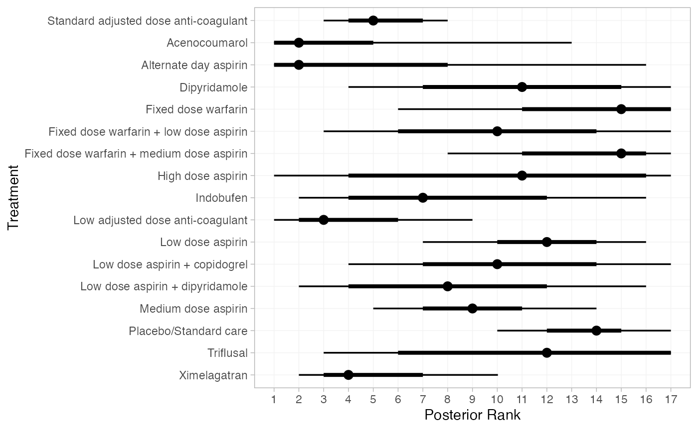

``` r

(af_1_rankprobs <- posterior_rank_probs(af_fit_1))
#>                                              p_rank[1] p_rank[2] p_rank[3] p_rank[4] p_rank[5]
#> d[Standard adjusted dose anti-coagulant]          0.00      0.02      0.08      0.20      0.27
#> d[Acenocoumarol]                                  0.37      0.29      0.10      0.05      0.04
#> d[Alternate day aspirin]                          0.46      0.17      0.07      0.04      0.03
#> d[Dipyridamole]                                   0.00      0.01      0.01      0.02      0.03
#> d[Fixed dose warfarin]                            0.00      0.00      0.00      0.00      0.01
#> d[Fixed dose warfarin + low dose aspirin]         0.00      0.01      0.03      0.04      0.04
#> d[Fixed dose warfarin + medium dose aspirin]      0.00      0.00      0.00      0.00      0.00
#> d[High dose aspirin]                              0.03      0.05      0.07      0.05      0.05
#> d[Indobufen]                                      0.01      0.04      0.08      0.08      0.09
#> d[Low adjusted dose anti-coagulant]               0.08      0.24      0.26      0.15      0.09
#> d[Low dose aspirin]                               0.00      0.00      0.00      0.00      0.00
#> d[Low dose aspirin + copidogrel]                  0.00      0.01      0.01      0.02      0.03
#> d[Low dose aspirin + dipyridamole]                0.01      0.04      0.07      0.08      0.08
#> d[Medium dose aspirin]                            0.00      0.00      0.00      0.01      0.02
#> d[Placebo/Standard care]                          0.00      0.00      0.00      0.00      0.00
#> d[Triflusal]                                      0.00      0.02      0.04      0.04      0.04
#> d[Ximelagatran]                                   0.02      0.10      0.18      0.21      0.17
#>                                              p_rank[6] p_rank[7] p_rank[8] p_rank[9]
#> d[Standard adjusted dose anti-coagulant]          0.23      0.12      0.05      0.02
#> d[Acenocoumarol]                                  0.03      0.02      0.02      0.01
#> d[Alternate day aspirin]                          0.03      0.03      0.02      0.02
#> d[Dipyridamole]                                   0.04      0.06      0.07      0.08
#> d[Fixed dose warfarin]                            0.01      0.02      0.02      0.04
#> d[Fixed dose warfarin + low dose aspirin]         0.06      0.08      0.09      0.10
#> d[Fixed dose warfarin + medium dose aspirin]      0.01      0.01      0.02      0.03
#> d[High dose aspirin]                              0.05      0.05      0.05      0.05
#> d[Indobufen]                                      0.10      0.11      0.09      0.07
#> d[Low adjusted dose anti-coagulant]               0.06      0.05      0.03      0.02
#> d[Low dose aspirin]                               0.01      0.02      0.05      0.09
#> d[Low dose aspirin + copidogrel]                  0.06      0.08      0.09      0.10
#> d[Low dose aspirin + dipyridamole]                0.09      0.10      0.09      0.08
#> d[Medium dose aspirin]                            0.07      0.12      0.18      0.18
#> d[Placebo/Standard care]                          0.00      0.00      0.01      0.02
#> d[Triflusal]                                      0.04      0.06      0.06      0.06
#> d[Ximelagatran]                                   0.12      0.08      0.05      0.03
#>                                              p_rank[10] p_rank[11] p_rank[12] p_rank[13]
#> d[Standard adjusted dose anti-coagulant]           0.00       0.00       0.00       0.00
#> d[Acenocoumarol]                                   0.01       0.01       0.01       0.01
#> d[Alternate day aspirin]                           0.02       0.02       0.01       0.01
#> d[Dipyridamole]                                    0.08       0.08       0.08       0.08
#> d[Fixed dose warfarin]                             0.04       0.05       0.06       0.07
#> d[Fixed dose warfarin + low dose aspirin]          0.09       0.08       0.09       0.07
#> d[Fixed dose warfarin + medium dose aspirin]       0.04       0.05       0.07       0.09
#> d[High dose aspirin]                               0.05       0.04       0.05       0.05
#> d[Indobufen]                                       0.07       0.06       0.05       0.04
#> d[Low adjusted dose anti-coagulant]                0.01       0.01       0.00       0.00
#> d[Low dose aspirin]                                0.12       0.15       0.17       0.15
#> d[Low dose aspirin + copidogrel]                   0.11       0.10       0.09       0.08
#> d[Low dose aspirin + dipyridamole]                 0.07       0.07       0.05       0.04
#> d[Medium dose aspirin]                             0.16       0.12       0.07       0.04
#> d[Placebo/Standard care]                           0.04       0.08       0.14       0.20
#> d[Triflusal]                                       0.06       0.06       0.05       0.06
#> d[Ximelagatran]                                    0.02       0.01       0.01       0.00
#>                                              p_rank[14] p_rank[15] p_rank[16] p_rank[17]
#> d[Standard adjusted dose anti-coagulant]           0.00       0.00       0.00       0.00
#> d[Acenocoumarol]                                   0.01       0.01       0.01       0.00
#> d[Alternate day aspirin]                           0.01       0.01       0.02       0.02
#> d[Dipyridamole]                                    0.08       0.09       0.09       0.07
#> d[Fixed dose warfarin]                             0.09       0.13       0.20       0.25
#> d[Fixed dose warfarin + low dose aspirin]          0.06       0.06       0.05       0.04
#> d[Fixed dose warfarin + medium dose aspirin]       0.12       0.18       0.21       0.16
#> d[High dose aspirin]                               0.05       0.07       0.09       0.17
#> d[Indobufen]                                       0.04       0.04       0.03       0.02
#> d[Low adjusted dose anti-coagulant]                0.00       0.00       0.00       0.00
#> d[Low dose aspirin]                                0.12       0.07       0.03       0.01
#> d[Low dose aspirin + copidogrel]                   0.07       0.06       0.05       0.03
#> d[Low dose aspirin + dipyridamole]                 0.04       0.03       0.03       0.02
#> d[Medium dose aspirin]                             0.02       0.01       0.00       0.00
#> d[Placebo/Standard care]                           0.22       0.17       0.09       0.03
#> d[Triflusal]                                       0.06       0.08       0.10       0.18
#> d[Ximelagatran]                                    0.00       0.00       0.00       0.00
plot(af_1_rankprobs)
```

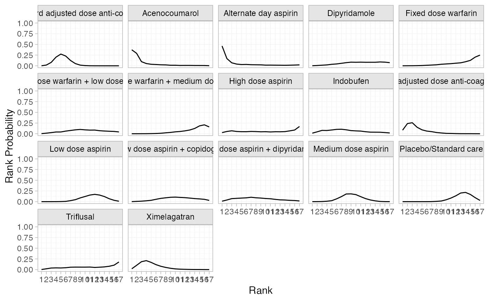

``` r

(af_1_cumrankprobs <- posterior_rank_probs(af_fit_1, cumulative = TRUE))
#>                                              p_rank[1] p_rank[2] p_rank[3] p_rank[4] p_rank[5]
#> d[Standard adjusted dose anti-coagulant]          0.00      0.02      0.10      0.30      0.57
#> d[Acenocoumarol]                                  0.37      0.67      0.76      0.82      0.85
#> d[Alternate day aspirin]                          0.46      0.63      0.70      0.74      0.77
#> d[Dipyridamole]                                   0.00      0.01      0.02      0.04      0.08
#> d[Fixed dose warfarin]                            0.00      0.00      0.00      0.01      0.01
#> d[Fixed dose warfarin + low dose aspirin]         0.00      0.02      0.04      0.08      0.12
#> d[Fixed dose warfarin + medium dose aspirin]      0.00      0.00      0.00      0.00      0.01
#> d[High dose aspirin]                              0.03      0.08      0.15      0.20      0.25
#> d[Indobufen]                                      0.01      0.06      0.14      0.21      0.30
#> d[Low adjusted dose anti-coagulant]               0.08      0.32      0.58      0.73      0.82
#> d[Low dose aspirin]                               0.00      0.00      0.00      0.00      0.00
#> d[Low dose aspirin + copidogrel]                  0.00      0.01      0.02      0.04      0.07
#> d[Low dose aspirin + dipyridamole]                0.01      0.05      0.12      0.20      0.28
#> d[Medium dose aspirin]                            0.00      0.00      0.00      0.01      0.04
#> d[Placebo/Standard care]                          0.00      0.00      0.00      0.00      0.00
#> d[Triflusal]                                      0.00      0.02      0.06      0.10      0.14
#> d[Ximelagatran]                                   0.02      0.12      0.30      0.51      0.68
#>                                              p_rank[6] p_rank[7] p_rank[8] p_rank[9]
#> d[Standard adjusted dose anti-coagulant]          0.80      0.93      0.98      0.99
#> d[Acenocoumarol]                                  0.88      0.90      0.93      0.94
#> d[Alternate day aspirin]                          0.80      0.83      0.85      0.88
#> d[Dipyridamole]                                   0.12      0.18      0.25      0.34
#> d[Fixed dose warfarin]                            0.03      0.04      0.07      0.10
#> d[Fixed dose warfarin + low dose aspirin]         0.18      0.26      0.35      0.45
#> d[Fixed dose warfarin + medium dose aspirin]      0.01      0.02      0.04      0.07
#> d[High dose aspirin]                              0.30      0.35      0.40      0.45
#> d[Indobufen]                                      0.40      0.51      0.60      0.67
#> d[Low adjusted dose anti-coagulant]               0.88      0.93      0.96      0.98
#> d[Low dose aspirin]                               0.01      0.03      0.08      0.17
#> d[Low dose aspirin + copidogrel]                  0.13      0.20      0.29      0.40
#> d[Low dose aspirin + dipyridamole]                0.37      0.48      0.57      0.65
#> d[Medium dose aspirin]                            0.10      0.22      0.40      0.58
#> d[Placebo/Standard care]                          0.00      0.00      0.01      0.02
#> d[Triflusal]                                      0.18      0.24      0.29      0.35
#> d[Ximelagatran]                                   0.80      0.88      0.93      0.96
#>                                              p_rank[10] p_rank[11] p_rank[12] p_rank[13]
#> d[Standard adjusted dose anti-coagulant]           1.00       1.00       1.00       1.00
#> d[Acenocoumarol]                                   0.95       0.96       0.97       0.98
#> d[Alternate day aspirin]                           0.89       0.91       0.92       0.94
#> d[Dipyridamole]                                    0.42       0.50       0.59       0.67
#> d[Fixed dose warfarin]                             0.15       0.20       0.26       0.33
#> d[Fixed dose warfarin + low dose aspirin]          0.54       0.63       0.71       0.78
#> d[Fixed dose warfarin + medium dose aspirin]       0.12       0.17       0.24       0.33
#> d[High dose aspirin]                               0.49       0.53       0.58       0.63
#> d[Indobufen]                                       0.74       0.80       0.85       0.88
#> d[Low adjusted dose anti-coagulant]                0.99       0.99       1.00       1.00
#> d[Low dose aspirin]                                0.29       0.44       0.62       0.77
#> d[Low dose aspirin + copidogrel]                   0.50       0.60       0.70       0.78
#> d[Low dose aspirin + dipyridamole]                 0.72       0.79       0.85       0.89
#> d[Medium dose aspirin]                             0.75       0.86       0.93       0.97
#> d[Placebo/Standard care]                           0.07       0.15       0.29       0.49
#> d[Triflusal]                                       0.41       0.47       0.52       0.58
#> d[Ximelagatran]                                    0.98       0.99       0.99       1.00
#>                                              p_rank[14] p_rank[15] p_rank[16] p_rank[17]
#> d[Standard adjusted dose anti-coagulant]           1.00       1.00       1.00          1
#> d[Acenocoumarol]                                   0.98       0.99       1.00          1
#> d[Alternate day aspirin]                           0.95       0.96       0.98          1
#> d[Dipyridamole]                                    0.75       0.84       0.93          1
#> d[Fixed dose warfarin]                             0.42       0.55       0.75          1
#> d[Fixed dose warfarin + low dose aspirin]          0.85       0.90       0.96          1
#> d[Fixed dose warfarin + medium dose aspirin]       0.45       0.63       0.84          1
#> d[High dose aspirin]                               0.68       0.74       0.83          1
#> d[Indobufen]                                       0.92       0.95       0.98          1
#> d[Low adjusted dose anti-coagulant]                1.00       1.00       1.00          1
#> d[Low dose aspirin]                                0.89       0.96       0.99          1
#> d[Low dose aspirin + copidogrel]                   0.85       0.92       0.97          1
#> d[Low dose aspirin + dipyridamole]                 0.93       0.96       0.98          1
#> d[Medium dose aspirin]                             0.99       1.00       1.00          1
#> d[Placebo/Standard care]                           0.71       0.88       0.97          1
#> d[Triflusal]                                       0.64       0.72       0.82          1
#> d[Ximelagatran]                                    1.00       1.00       1.00          1
plot(af_1_cumrankprobs)
```

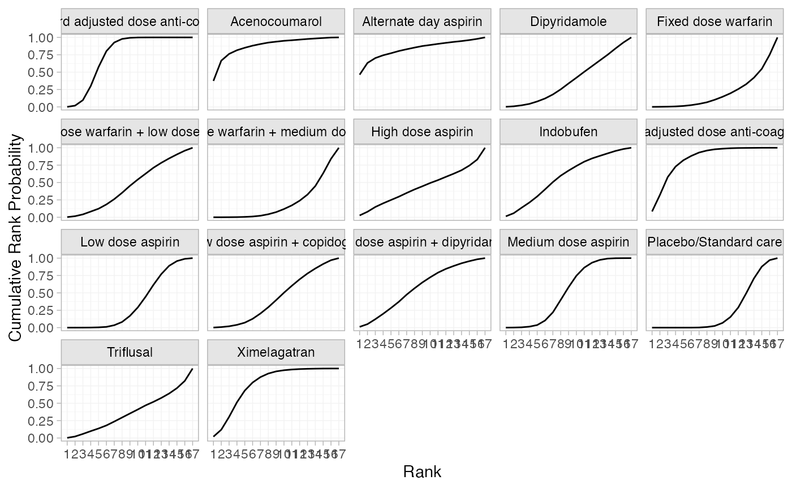

### Network meta-regression adjusting for proportion of prior stroke

We now consider a meta-regression model adjusting for the proportion of
individuals in each study with prior stroke, with shared interaction
coefficients by treatment class. The regression model is specified in
the
[`nma()`](https://dmphillippo.github.io/multinma/dev/reference/nma.md)
function using a formula in the `regression` argument. The formula
`~ .trt:stroke` means that interactions of prior stroke with treatment
will be included; the `.trt` special variable indicates treatment, and
`stroke` is in the original data set. We specify
`class_interactions = "common"` to denote that the interaction
parameters are to be common (i.e. shared) between treatments within each
class. (Setting `class_interactions = "independent"` would fit model 2
of Cooper et al. ([2009](#ref-Cooper2009)) with separate interactions
for each treatment, data permitting.) We use the same prior
distributions as above, but additionally require a prior distribution
for the regression coefficients `prior_reg`; we use a \mathrm{N}(0,
100^2) prior distribution. The [QR
decomposition](https://mc-stan.org/users/documentation/case-studies/qr_regression.html)
can greatly improve the efficiency of sampling for regression models by
decorrelating the sampling space; we specify that this should be used
with `QR = TRUE`, and increase the target acceptance rate
`adapt_delta = 0.99` to minimise divergent transition warnings.

``` r

af_fit_4b <- nma(af_net, 
                 trt_effects = "random",
                 regression = ~ .trt:stroke,
                 class_interactions = "common",
                 QR = TRUE,
                 prior_intercept = normal(scale = 100),
                 prior_trt = normal(scale = 100),
                 prior_reg = normal(scale = 100),
                 prior_het = half_normal(scale = 5),
                 adapt_delta = 0.99)
```

    #> Note: Setting "Standard adjusted dose anti-coagulant" as the network reference treatment.
    #> Warning: There were 2 divergent transitions after warmup. See
    #> https://mc-stan.org/misc/warnings.html#divergent-transitions-after-warmup
    #> to find out why this is a problem and how to eliminate them.
    #> Warning: Examine the pairs() plot to diagnose sampling problems

Basic parameter summaries are given by the
[`print()`](https://rdrr.io/r/base/print.html) method:

``` r

af_fit_4b
#> A random effects NMA with a binomial likelihood (logit link).
#> Regression model: ~.trt:stroke.
#> Centred covariates at the following overall mean values:
#>    stroke 
#> 0.2957377 
#> Inference for Stan model: binomial_1par.
#> 4 chains, each with iter=2000; warmup=1000; thin=1; 
#> post-warmup draws per chain=1000, total post-warmup draws=4000.
#> 
#>                                                  mean se_mean   sd     2.5%      25%      50%
#> beta[.trtclassControl:stroke]                    0.71    0.01 0.45    -0.16     0.41     0.71
#> beta[.trtclassAnti-platelet:stroke]              0.94    0.01 0.42     0.13     0.67     0.94
#> beta[.trtclassMixed:stroke]                      3.91    0.03 2.05    -0.11     2.55     3.86
#> d[Acenocoumarol]                                 0.36    0.01 1.01    -1.67    -0.29     0.38
#> d[Alternate day aspirin]                        -0.93    0.03 1.41    -4.18    -1.68    -0.75
#> d[Dipyridamole]                                  0.58    0.01 0.40    -0.19     0.31     0.58
#> d[Fixed dose warfarin]                           0.64    0.01 0.38    -0.10     0.39     0.64
#> d[Fixed dose warfarin + low dose aspirin]        1.45    0.01 0.73     0.03     0.99     1.45
#> d[Fixed dose warfarin + medium dose aspirin]     1.00    0.00 0.30     0.42     0.81     1.00
#> d[High dose aspirin]                             0.43    0.01 0.76    -1.05    -0.09     0.43
#> d[Indobufen]                                    -0.40    0.01 0.51    -1.41    -0.73    -0.41
#> d[Low adjusted dose anti-coagulant]             -0.41    0.01 0.37    -1.16    -0.66    -0.41
#> d[Low dose aspirin]                              0.72    0.00 0.21     0.32     0.59     0.72
#> d[Low dose aspirin + copidogrel]                 0.66    0.01 0.29     0.09     0.49     0.65
#> d[Low dose aspirin + dipyridamole]               0.26    0.01 0.43    -0.59    -0.02     0.26
#> d[Medium dose aspirin]                           0.35    0.00 0.17     0.01     0.24     0.35
#> d[Placebo/Standard care]                         0.79    0.00 0.19     0.42     0.67     0.79
#> d[Triflusal]                                     0.91    0.01 0.60    -0.22     0.50     0.91
#> d[Ximelagatran]                                 -0.08    0.00 0.22    -0.53    -0.21    -0.09
#> lp__                                         -4770.94    0.20 7.06 -4785.88 -4775.47 -4770.62
#> tau                                              0.19    0.01 0.13     0.01     0.09     0.18
#>                                                   75%    97.5% n_eff Rhat
#> beta[.trtclassControl:stroke]                    1.00     1.62  4461 1.00
#> beta[.trtclassAnti-platelet:stroke]              1.21     1.78  5010 1.00
#> beta[.trtclassMixed:stroke]                      5.23     8.08  5074 1.00
#> d[Acenocoumarol]                                 1.07     2.33  5261 1.00
#> d[Alternate day aspirin]                         0.03     1.26  1813 1.00
#> d[Dipyridamole]                                  0.84     1.35  5758 1.00
#> d[Fixed dose warfarin]                           0.89     1.40  4196 1.00
#> d[Fixed dose warfarin + low dose aspirin]        1.92     2.87  5223 1.00
#> d[Fixed dose warfarin + medium dose aspirin]     1.19     1.61  5112 1.00
#> d[High dose aspirin]                             0.94     1.90  6361 1.00
#> d[Indobufen]                                    -0.07     0.57  4524 1.00
#> d[Low adjusted dose anti-coagulant]             -0.16     0.30  5401 1.00
#> d[Low dose aspirin]                              0.86     1.13  5191 1.00
#> d[Low dose aspirin + copidogrel]                 0.82     1.26  2455 1.00
#> d[Low dose aspirin + dipyridamole]               0.54     1.10  5788 1.00
#> d[Medium dose aspirin]                           0.46     0.69  4528 1.00
#> d[Placebo/Standard care]                         0.92     1.18  5404 1.00
#> d[Triflusal]                                     1.32     2.10  5790 1.00
#> d[Ximelagatran]                                  0.05     0.36  2840 1.00
#> lp__                                         -4766.02 -4758.13  1200 1.00
#> tau                                              0.26     0.49   387 1.01
#> 
#> Samples were drawn using NUTS(diag_e) at Thu Oct  8 11:09:41 2026.
#> For each parameter, n_eff is a crude measure of effective sample size,
#> and Rhat is the potential scale reduction factor on split chains (at 
#> convergence, Rhat=1).
```

The estimated treatment effects `d[]` shown here correspond to relative
effects at the reference level of the covariate, here proportion of
prior stroke centered at the network mean value 0.296.

By default, summaries of the study-specific intercepts \mu_j and
study-specific relative effects \delta\_{jk} are hidden, but could be
examined by changing the `pars` argument:

``` r

# Not run
print(af_fit_4b, pars = c("d", "mu", "delta"))
```

The prior and posterior distributions can be compared visually using the
[`plot_prior_posterior()`](https://dmphillippo.github.io/multinma/dev/reference/plot_prior_posterior.md)
function:

``` r

plot_prior_posterior(af_fit_4b, prior = c("reg", "het"))
```

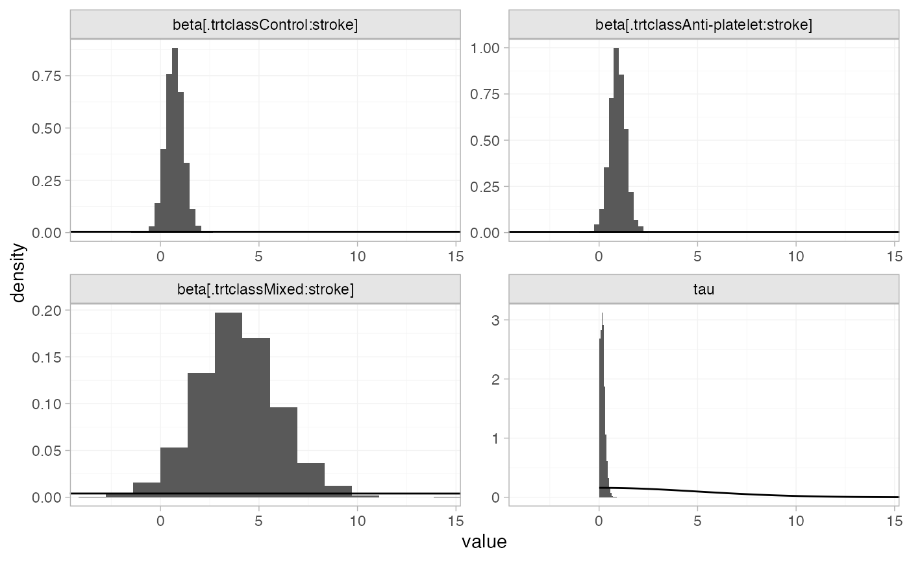

We can compute relative effects against placebo/standard care with the
[`relative_effects()`](https://dmphillippo.github.io/multinma/dev/reference/relative_effects.md)
function with the `trt_ref` argument, which by default produces relative
effects for the observed proportions of prior stroke in each study:

``` r

# Not run
(af_4b_releff <- relative_effects(af_fit_4b, trt_ref = "Placebo/Standard care"))
plot(af_4b_releff, ref_line = 0)
```

We can produce estimated treatment effects for particular covariate
values using the `newdata` argument. For example, treatment effects when
no individuals or all individuals have prior stroke are produced by

``` r

(af_4b_releff_01 <- relative_effects(af_fit_4b, 
                                     trt_ref = "Placebo/Standard care",
                                     newdata = data.frame(stroke = c(0, 1), 
                                                          label = c("stroke = 0", "stroke = 1")),
                                     study = label))
#> ------------------------------------------------------------- Study: stroke = 0 ---- 
#> 
#> Covariate values:
#>  stroke
#>       0
#> 
#>                                                           mean   sd  2.5%   25%   50%   75%
#> d[stroke = 0: Standard adjusted dose anti-coagulant]     -0.58 0.24 -1.06 -0.75 -0.59 -0.43
#> d[stroke = 0: Acenocoumarol]                             -1.38 0.82 -3.08 -1.90 -1.35 -0.81
#> d[stroke = 0: Alternate day aspirin]                     -1.80 1.41 -5.16 -2.55 -1.61 -0.83
#> d[stroke = 0: Dipyridamole]                              -0.28 0.43 -1.11 -0.57 -0.28  0.00
#> d[stroke = 0: Fixed dose warfarin]                        0.06 0.43 -0.78 -0.22  0.06  0.34
#> d[stroke = 0: Fixed dose warfarin + low dose aspirin]    -0.29 0.34 -0.99 -0.50 -0.29 -0.08
#> d[stroke = 0: Fixed dose warfarin + medium dose aspirin] -0.74 0.64 -2.03 -1.15 -0.74 -0.31
#> d[stroke = 0: High dose aspirin]                         -0.43 0.78 -2.01 -0.95 -0.44  0.09
#> d[stroke = 0: Indobufen]                                 -1.27 0.58 -2.40 -1.64 -1.27 -0.88
#> d[stroke = 0: Low adjusted dose anti-coagulant]          -1.00 0.33 -1.64 -1.22 -1.00 -0.77
#> d[stroke = 0: Low dose aspirin]                          -0.14 0.23 -0.58 -0.29 -0.14  0.01
#> d[stroke = 0: Low dose aspirin + copidogrel]             -0.20 0.36 -0.89 -0.43 -0.21  0.02
#> d[stroke = 0: Low dose aspirin + dipyridamole]           -0.60 0.46 -1.50 -0.90 -0.60 -0.30
#> d[stroke = 0: Medium dose aspirin]                       -0.51 0.27 -1.05 -0.69 -0.51 -0.33
#> d[stroke = 0: Triflusal]                                  0.05 0.62 -1.16 -0.38  0.05  0.46
#> d[stroke = 0: Ximelagatran]                              -0.67 0.33 -1.31 -0.88 -0.67 -0.45
#>                                                          97.5% Bulk_ESS Tail_ESS Rhat
#> d[stroke = 0: Standard adjusted dose anti-coagulant]     -0.10     4883     2917    1
#> d[stroke = 0: Acenocoumarol]                              0.15     4467     3038    1
#> d[stroke = 0: Alternate day aspirin]                      0.43     2554     1442    1
#> d[stroke = 0: Dipyridamole]                               0.57     5177     3033    1
#> d[stroke = 0: Fixed dose warfarin]                        0.92     4630     3124    1
#> d[stroke = 0: Fixed dose warfarin + low dose aspirin]     0.39     5068     2060    1
#> d[stroke = 0: Fixed dose warfarin + medium dose aspirin]  0.53     4597     2620    1
#> d[stroke = 0: High dose aspirin]                          1.10     6479     3168    1
#> d[stroke = 0: Indobufen]                                 -0.11     4624     2632    1
#> d[stroke = 0: Low adjusted dose anti-coagulant]          -0.34     5828     3252    1
#> d[stroke = 0: Low dose aspirin]                           0.30     4565     2722    1
#> d[stroke = 0: Low dose aspirin + copidogrel]              0.55     3551     1947    1
#> d[stroke = 0: Low dose aspirin + dipyridamole]            0.32     5397     3087    1
#> d[stroke = 0: Medium dose aspirin]                        0.02     4789     2744    1
#> d[stroke = 0: Triflusal]                                  1.26     5621     3308    1
#> d[stroke = 0: Ximelagatran]                              -0.02     4013     2905    1
#> 
#> ------------------------------------------------------------- Study: stroke = 1 ---- 
#> 
#> Covariate values:
#>  stroke
#>       1
#> 
#>                                                           mean   sd  2.5%   25%   50%   75%
#> d[stroke = 1: Standard adjusted dose anti-coagulant]     -1.29 0.36 -2.01 -1.53 -1.29 -1.05
#> d[stroke = 1: Acenocoumarol]                              1.82 2.25 -2.59  0.40  1.76  3.29
#> d[stroke = 1: Alternate day aspirin]                     -1.57 1.43 -4.91 -2.33 -1.41 -0.60
#> d[stroke = 1: Dipyridamole]                              -0.05 0.38 -0.81 -0.30 -0.05  0.19
#> d[stroke = 1: Fixed dose warfarin]                       -0.65 0.52 -1.62 -1.00 -0.65 -0.31
#> d[stroke = 1: Fixed dose warfarin + low dose aspirin]     2.91 2.12 -1.27  1.57  2.90  4.23
#> d[stroke = 1: Fixed dose warfarin + medium dose aspirin]  2.46 1.59 -0.70  1.45  2.42  3.45
#> d[stroke = 1: High dose aspirin]                         -0.21 0.74 -1.72 -0.70 -0.21  0.29
#> d[stroke = 1: Indobufen]                                 -1.04 0.54 -2.12 -1.39 -1.03 -0.70
#> d[stroke = 1: Low adjusted dose anti-coagulant]          -1.71 0.52 -2.75 -2.05 -1.70 -1.36
#> d[stroke = 1: Low dose aspirin]                           0.09 0.29 -0.49 -0.09  0.09  0.27
#> d[stroke = 1: Low dose aspirin + copidogrel]              0.03 0.40 -0.77 -0.22  0.03  0.27
#> d[stroke = 1: Low dose aspirin + dipyridamole]           -0.38 0.41 -1.22 -0.64 -0.37 -0.11
#> d[stroke = 1: Medium dose aspirin]                       -0.29 0.25 -0.82 -0.43 -0.28 -0.12
#> d[stroke = 1: Triflusal]                                  0.28 0.66 -0.99 -0.16  0.27  0.71
#> d[stroke = 1: Ximelagatran]                              -1.38 0.42 -2.19 -1.65 -1.38 -1.11
#>                                                          97.5% Bulk_ESS Tail_ESS Rhat
#> d[stroke = 1: Standard adjusted dose anti-coagulant]     -0.61     5202     2837    1
#> d[stroke = 1: Acenocoumarol]                              6.41     5305     2821    1
#> d[stroke = 1: Alternate day aspirin]                      0.71     2595     1463    1
#> d[stroke = 1: Dipyridamole]                               0.69     5906     3228    1
#> d[stroke = 1: Fixed dose warfarin]                        0.38     5108     2850    1
#> d[stroke = 1: Fixed dose warfarin + low dose aspirin]     7.27     5122     2926    1
#> d[stroke = 1: Fixed dose warfarin + medium dose aspirin]  5.72     5111     3040    1
#> d[stroke = 1: High dose aspirin]                          1.22     6358     3181    1
#> d[stroke = 1: Indobufen]                                  0.03     4633     2181    1
#> d[stroke = 1: Low adjusted dose anti-coagulant]          -0.69     4901     3054    1
#> d[stroke = 1: Low dose aspirin]                           0.68     4951     2576    1
#> d[stroke = 1: Low dose aspirin + copidogrel]              0.82     3576     2118    1
#> d[stroke = 1: Low dose aspirin + dipyridamole]            0.42     5065     2803    1
#> d[stroke = 1: Medium dose aspirin]                        0.18     4601     2344    1
#> d[stroke = 1: Triflusal]                                  1.58     5711     3196    1
#> d[stroke = 1: Ximelagatran]                              -0.55     4263     2425    1
plot(af_4b_releff_01, ref_line = 0)
```

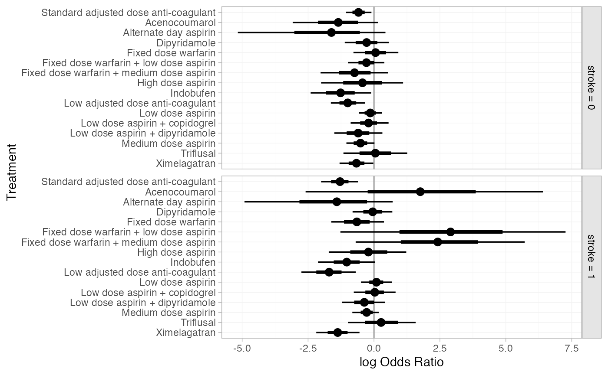

The estimated class interactions (against the reference “Mixed” class)
are very uncertain.

``` r

plot(af_fit_4b, pars = "beta", stat = "halfeye", ref_line = 0)
```

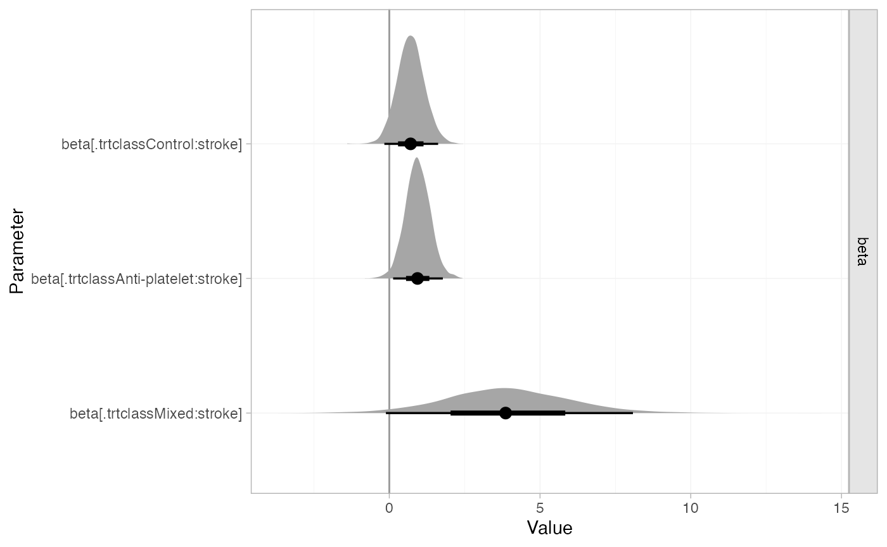

The interactions are more straightforward to interpret if we transform
the interaction coefficients (using the consistency equations) so that
they are against the control class:

``` r

af_4b_beta <- as.array(af_fit_4b, pars = "beta")

# Subtract beta[Control:stroke] from the other class interactions
af_4b_beta[ , , 2:3] <- sweep(af_4b_beta[ , , 2:3], 1:2, 
                              af_4b_beta[ , , "beta[.trtclassControl:stroke]"], FUN = "-")

# Set beta[Anti-coagulant:stroke] = -beta[Control:stroke]
af_4b_beta[ , , "beta[.trtclassControl:stroke]"] <- -af_4b_beta[ , , "beta[.trtclassControl:stroke]"]
names(af_4b_beta)[1] <- "beta[.trtclassAnti-coagulant:stroke]"

# Summarise
summary(af_4b_beta)
#>                                       mean   sd  2.5%   25%   50%   75% 97.5% Bulk_ESS
#> beta[.trtclassAnti-coagulant:stroke] -0.71 0.45 -1.62 -1.00 -0.71 -0.41  0.16     4630
#> beta[.trtclassAnti-platelet:stroke]   0.23 0.34 -0.47  0.02  0.23  0.45  0.87     4901
#> beta[.trtclassMixed:stroke]           3.20 2.09 -0.94  1.86  3.18  4.51  7.50     4997
#>                                      Tail_ESS Rhat
#> beta[.trtclassAnti-coagulant:stroke]     2717    1
#> beta[.trtclassAnti-platelet:stroke]      2966    1
#> beta[.trtclassMixed:stroke]              2846    1
plot(summary(af_4b_beta), stat = "halfeye", ref_line = 0)
```

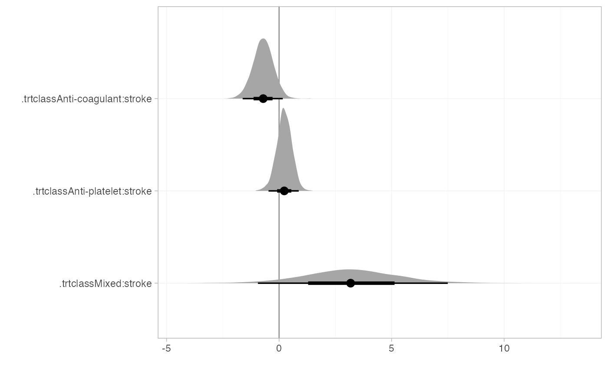

There is some evidence that the effect of anti-coagulants increases
(compared to control) with prior stroke. There is little evidence the
effect of anti-platelets reduces with prior stroke, although the point
estimate represents a substantial reduction in effectiveness, and the
95% Credible Interval includes values that correspond to substantial
increases in treatment effect. The interaction effect of stroke on mixed
treatments is very uncertain, but potentially indicates a substantial
reduction in treatment effects with prior stroke.

We can also produce treatment rankings, rank probabilities, and
cumulative rank probabilities. By default (without the `newdata`
argument specified), these are produced at the value of `stroke` for
each study in the network in turn. To instead produce rankings for when
no individuals or all individuals have prior stroke, we specify the
`newdata` argument.

``` r

(af_4b_ranks <- posterior_ranks(af_fit_4b,
                                newdata = data.frame(stroke = c(0, 1), 
                                                     label = c("stroke = 0", "stroke = 1")), 
                                study = label))
#> ------------------------------------------------------------- Study: stroke = 0 ---- 
#> 
#> Covariate values:
#>  stroke
#>       0
#> 
#>                                                              mean   sd 2.5% 25% 50% 75% 97.5%
#> rank[stroke = 0: Standard adjusted dose anti-coagulant]      7.71 1.89    4   6   8   9 11.00
#> rank[stroke = 0: Acenocoumarol]                              3.96 3.69    1   1   2   5 15.00
#> rank[stroke = 0: Alternate day aspirin]                      4.01 4.48    1   1   2   5 16.00
#> rank[stroke = 0: Dipyridamole]                              11.13 3.62    4   8  11  14 17.00
#> rank[stroke = 0: Fixed dose warfarin]                       14.15 2.85    7  12  15  16 17.00
#> rank[stroke = 0: Fixed dose warfarin + low dose aspirin]    10.99 3.66    4   8  11  14 17.00
#> rank[stroke = 0: Fixed dose warfarin + medium dose aspirin]  7.14 4.50    1   3   6  10 16.00
#> rank[stroke = 0: High dose aspirin]                          9.63 5.32    1   5  10  15 17.00
#> rank[stroke = 0: Indobufen]                                  3.70 2.86    1   2   3   4 12.03
#> rank[stroke = 0: Low adjusted dose anti-coagulant]           4.60 2.46    1   3   4   6 11.00
#> rank[stroke = 0: Low dose aspirin]                          12.91 1.98    9  12  13  14 16.00
#> rank[stroke = 0: Low dose aspirin + copidogrel]             12.03 2.96    5  10  12  14 17.00
#> rank[stroke = 0: Low dose aspirin + dipyridamole]            7.89 3.72    2   5   7  11 16.00
#> rank[stroke = 0: Medium dose aspirin]                        8.61 2.23    4   7   9  10 13.00
#> rank[stroke = 0: Placebo/Standard care]                     14.27 1.90   10  13  15  16 17.00
#> rank[stroke = 0: Triflusal]                                 13.33 4.06    4  11  15  17 17.00
#> rank[stroke = 0: Ximelagatran]                               6.93 2.60    3   5   7   9 13.00
#>                                                             Bulk_ESS Tail_ESS Rhat
#> rank[stroke = 0: Standard adjusted dose anti-coagulant]         4611     3159    1
#> rank[stroke = 0: Acenocoumarol]                                 4621     3405    1
#> rank[stroke = 0: Alternate day aspirin]                         3882     2835    1
#> rank[stroke = 0: Dipyridamole]                                  5599       NA    1
#> rank[stroke = 0: Fixed dose warfarin]                           4664       NA    1
#> rank[stroke = 0: Fixed dose warfarin + low dose aspirin]        4578     2959    1
#> rank[stroke = 0: Fixed dose warfarin + medium dose aspirin]     4778     3261    1
#> rank[stroke = 0: High dose aspirin]                             6178       NA    1
#> rank[stroke = 0: Indobufen]                                     3491     2877    1
#> rank[stroke = 0: Low adjusted dose anti-coagulant]              4322     3274    1
#> rank[stroke = 0: Low dose aspirin]                              3873     3162    1
#> rank[stroke = 0: Low dose aspirin + copidogrel]                 3576     2774    1
#> rank[stroke = 0: Low dose aspirin + dipyridamole]               5010     3192    1
#> rank[stroke = 0: Medium dose aspirin]                           4328     2917    1
#> rank[stroke = 0: Placebo/Standard care]                         3616       NA    1
#> rank[stroke = 0: Triflusal]                                     5035       NA    1
#> rank[stroke = 0: Ximelagatran]                                  3989     2766    1
#> 
#> ------------------------------------------------------------- Study: stroke = 1 ---- 
#> 
#> Covariate values:
#>  stroke
#>       1
#> 
#>                                                              mean   sd 2.5% 25% 50% 75% 97.5%
#> rank[stroke = 1: Standard adjusted dose anti-coagulant]      3.61 1.12 2.00   3   4   4     6
#> rank[stroke = 1: Acenocoumarol]                             13.29 4.32 1.00  14  15  16    17
#> rank[stroke = 1: Alternate day aspirin]                      4.45 4.05 1.00   1   3   6    14
#> rank[stroke = 1: Dipyridamole]                              10.57 2.68 6.00   9  11  13    15
#> rank[stroke = 1: Fixed dose warfarin]                        7.05 2.67 3.00   5   6   8    14
#> rank[stroke = 1: Fixed dose warfarin + low dose aspirin]    15.82 2.87 5.98  16  17  17    17
#> rank[stroke = 1: Fixed dose warfarin + medium dose aspirin] 15.43 1.92 9.00  15  16  16    17
#> rank[stroke = 1: High dose aspirin]                          9.46 3.97 2.00   6   9  13    16
#> rank[stroke = 1: Indobufen]                                  5.02 2.24 1.00   4   5   6    11
#> rank[stroke = 1: Low adjusted dose anti-coagulant]           2.05 1.31 1.00   1   2   2     5
#> rank[stroke = 1: Low dose aspirin]                          11.86 1.83 8.00  11  12  13    15
#> rank[stroke = 1: Low dose aspirin + copidogrel]             11.14 2.43 6.00   9  11  13    15
#> rank[stroke = 1: Low dose aspirin + dipyridamole]            8.25 2.63 4.00   6   8  10    14
#> rank[stroke = 1: Medium dose aspirin]                        8.64 1.73 6.00   7   8  10    12
#> rank[stroke = 1: Placebo/Standard care]                     11.14 1.95 7.00  10  11  12    15
#> rank[stroke = 1: Triflusal]                                 12.07 3.12 5.00  10  13  14    17
#> rank[stroke = 1: Ximelagatran]                               3.14 1.38 1.00   2   3   4     6
#>                                                             Bulk_ESS Tail_ESS Rhat
#> rank[stroke = 1: Standard adjusted dose anti-coagulant]         4278     3530    1
#> rank[stroke = 1: Acenocoumarol]                                 4533       NA    1
#> rank[stroke = 1: Alternate day aspirin]                         3796     2596    1
#> rank[stroke = 1: Dipyridamole]                                  4797     3224    1
#> rank[stroke = 1: Fixed dose warfarin]                           4208     3170    1
#> rank[stroke = 1: Fixed dose warfarin + low dose aspirin]        3300       NA    1
#> rank[stroke = 1: Fixed dose warfarin + medium dose aspirin]     3671       NA    1
#> rank[stroke = 1: High dose aspirin]                             5839     3415    1
#> rank[stroke = 1: Indobufen]                                     3923     2714    1
#> rank[stroke = 1: Low adjusted dose anti-coagulant]              3026     3053    1
#> rank[stroke = 1: Low dose aspirin]                              3877     3043    1
#> rank[stroke = 1: Low dose aspirin + copidogrel]                 3820     2948    1
#> rank[stroke = 1: Low dose aspirin + dipyridamole]               4548     2985    1
#> rank[stroke = 1: Medium dose aspirin]                           3989     2722    1
#> rank[stroke = 1: Placebo/Standard care]                         3955     3349    1
#> rank[stroke = 1: Triflusal]                                     4657     3410    1
#> rank[stroke = 1: Ximelagatran]                                  3241     2981    1
plot(af_4b_ranks)
```

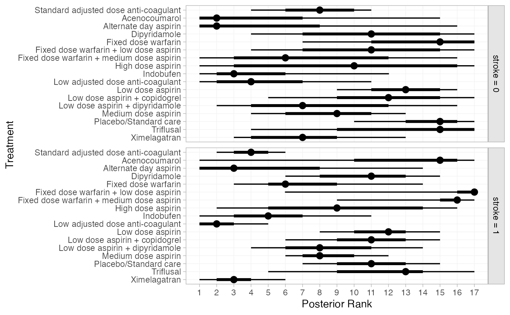

``` r

(af_4b_rankprobs <- posterior_rank_probs(af_fit_4b,
                                         newdata = data.frame(stroke = c(0, 1), 
                                                              label = c("stroke = 0", "stroke = 1")), 
                                         study = label))
#> ------------------------------------------------------------- Study: stroke = 0 ---- 
#> 
#> Covariate values:
#>  stroke
#>       0
#> 
#>                                                          p_rank[1] p_rank[2] p_rank[3]
#> d[stroke = 0: Standard adjusted dose anti-coagulant]          0.00      0.00      0.01
#> d[stroke = 0: Acenocoumarol]                                  0.26      0.24      0.13
#> d[stroke = 0: Alternate day aspirin]                          0.44      0.16      0.08
#> d[stroke = 0: Dipyridamole]                                   0.00      0.00      0.01
#> d[stroke = 0: Fixed dose warfarin]                            0.00      0.00      0.00
#> d[stroke = 0: Fixed dose warfarin + low dose aspirin]         0.00      0.01      0.01
#> d[stroke = 0: Fixed dose warfarin + medium dose aspirin]      0.05      0.09      0.12
#> d[stroke = 0: High dose aspirin]                              0.03      0.06      0.07
#> d[stroke = 0: Indobufen]                                      0.16      0.26      0.21
#> d[stroke = 0: Low adjusted dose anti-coagulant]               0.04      0.13      0.21
#> d[stroke = 0: Low dose aspirin]                               0.00      0.00      0.00
#> d[stroke = 0: Low dose aspirin + copidogrel]                  0.00      0.00      0.00
#> d[stroke = 0: Low dose aspirin + dipyridamole]                0.01      0.03      0.07
#> d[stroke = 0: Medium dose aspirin]                            0.00      0.00      0.01
#> d[stroke = 0: Placebo/Standard care]                          0.00      0.00      0.00
#> d[stroke = 0: Triflusal]                                      0.00      0.01      0.01
#> d[stroke = 0: Ximelagatran]                                   0.00      0.01      0.05
#>                                                          p_rank[4] p_rank[5] p_rank[6]
#> d[stroke = 0: Standard adjusted dose anti-coagulant]          0.03      0.08      0.15
#> d[stroke = 0: Acenocoumarol]                                  0.08      0.06      0.04
#> d[stroke = 0: Alternate day aspirin]                          0.06      0.04      0.03
#> d[stroke = 0: Dipyridamole]                                   0.03      0.04      0.05
#> d[stroke = 0: Fixed dose warfarin]                            0.00      0.00      0.01
#> d[stroke = 0: Fixed dose warfarin + low dose aspirin]         0.03      0.04      0.05
#> d[stroke = 0: Fixed dose warfarin + medium dose aspirin]      0.12      0.09      0.07
#> d[stroke = 0: High dose aspirin]                              0.07      0.06      0.06
#> d[stroke = 0: Indobufen]                                      0.12      0.07      0.05
#> d[stroke = 0: Low adjusted dose anti-coagulant]               0.20      0.15      0.09
#> d[stroke = 0: Low dose aspirin]                               0.00      0.00      0.00
#> d[stroke = 0: Low dose aspirin + copidogrel]                  0.01      0.01      0.02
#> d[stroke = 0: Low dose aspirin + dipyridamole]                0.10      0.11      0.10
#> d[stroke = 0: Medium dose aspirin]                            0.02      0.05      0.10
#> d[stroke = 0: Placebo/Standard care]                          0.00      0.00      0.00
#> d[stroke = 0: Triflusal]                                      0.02      0.03      0.03
#> d[stroke = 0: Ximelagatran]                                   0.11      0.15      0.16
#>                                                          p_rank[7] p_rank[8] p_rank[9]
#> d[stroke = 0: Standard adjusted dose anti-coagulant]          0.20      0.19      0.16
#> d[stroke = 0: Acenocoumarol]                                  0.03      0.02      0.02
#> d[stroke = 0: Alternate day aspirin]                          0.02      0.02      0.02
#> d[stroke = 0: Dipyridamole]                                   0.05      0.07      0.07
#> d[stroke = 0: Fixed dose warfarin]                            0.01      0.02      0.03
#> d[stroke = 0: Fixed dose warfarin + low dose aspirin]         0.06      0.06      0.07
#> d[stroke = 0: Fixed dose warfarin + medium dose aspirin]      0.06      0.05      0.05
#> d[stroke = 0: High dose aspirin]                              0.04      0.04      0.04
#> d[stroke = 0: Indobufen]                                      0.04      0.02      0.02
#> d[stroke = 0: Low adjusted dose anti-coagulant]               0.05      0.04      0.03
#> d[stroke = 0: Low dose aspirin]                               0.01      0.01      0.03
#> d[stroke = 0: Low dose aspirin + copidogrel]                  0.03      0.04      0.07
#> d[stroke = 0: Low dose aspirin + dipyridamole]                0.09      0.09      0.07
#> d[stroke = 0: Medium dose aspirin]                            0.13      0.16      0.18
#> d[stroke = 0: Placebo/Standard care]                          0.00      0.00      0.01
#> d[stroke = 0: Triflusal]                                      0.03      0.03      0.04
#> d[stroke = 0: Ximelagatran]                                   0.14      0.12      0.09
#>                                                          p_rank[10] p_rank[11] p_rank[12]
#> d[stroke = 0: Standard adjusted dose anti-coagulant]           0.10       0.05       0.02
#> d[stroke = 0: Acenocoumarol]                                   0.02       0.01       0.02
#> d[stroke = 0: Alternate day aspirin]                           0.02       0.02       0.01
#> d[stroke = 0: Dipyridamole]                                    0.09       0.11       0.10
#> d[stroke = 0: Fixed dose warfarin]                             0.04       0.06       0.07
#> d[stroke = 0: Fixed dose warfarin + low dose aspirin]          0.08       0.10       0.11
#> d[stroke = 0: Fixed dose warfarin + medium dose aspirin]       0.04       0.05       0.04
#> d[stroke = 0: High dose aspirin]                               0.05       0.05       0.05
#> d[stroke = 0: Indobufen]                                       0.01       0.01       0.01
#> d[stroke = 0: Low adjusted dose anti-coagulant]                0.02       0.02       0.01
#> d[stroke = 0: Low dose aspirin]                                0.07       0.11       0.17
#> d[stroke = 0: Low dose aspirin + copidogrel]                   0.10       0.12       0.12
#> d[stroke = 0: Low dose aspirin + dipyridamole]                 0.07       0.07       0.05
#> d[stroke = 0: Medium dose aspirin]                             0.15       0.09       0.06
#> d[stroke = 0: Placebo/Standard care]                           0.02       0.04       0.08
#> d[stroke = 0: Triflusal]                                       0.05       0.05       0.06
#> d[stroke = 0: Ximelagatran]                                    0.06       0.04       0.03
#>                                                          p_rank[13] p_rank[14] p_rank[15]
#> d[stroke = 0: Standard adjusted dose anti-coagulant]           0.01       0.00       0.00
#> d[stroke = 0: Acenocoumarol]                                   0.01       0.01       0.01
#> d[stroke = 0: Alternate day aspirin]                           0.01       0.02       0.02
#> d[stroke = 0: Dipyridamole]                                    0.09       0.08       0.08
#> d[stroke = 0: Fixed dose warfarin]                             0.08       0.11       0.13
#> d[stroke = 0: Fixed dose warfarin + low dose aspirin]          0.10       0.09       0.08
#> d[stroke = 0: Fixed dose warfarin + medium dose aspirin]       0.03       0.04       0.03
#> d[stroke = 0: High dose aspirin]                               0.05       0.04       0.05
#> d[stroke = 0: Indobufen]                                       0.01       0.01       0.00
#> d[stroke = 0: Low adjusted dose anti-coagulant]                0.01       0.00       0.00
#> d[stroke = 0: Low dose aspirin]                                0.20       0.20       0.13
#> d[stroke = 0: Low dose aspirin + copidogrel]                   0.12       0.12       0.11
#> d[stroke = 0: Low dose aspirin + dipyridamole]                 0.04       0.04       0.02
#> d[stroke = 0: Medium dose aspirin]                             0.03       0.01       0.00
#> d[stroke = 0: Placebo/Standard care]                           0.13       0.19       0.23
#> d[stroke = 0: Triflusal]                                       0.06       0.05       0.09
#> d[stroke = 0: Ximelagatran]                                    0.02       0.01       0.00
#>                                                          p_rank[16] p_rank[17]
#> d[stroke = 0: Standard adjusted dose anti-coagulant]           0.00       0.00
#> d[stroke = 0: Acenocoumarol]                                   0.02       0.00
#> d[stroke = 0: Alternate day aspirin]                           0.02       0.02
#> d[stroke = 0: Dipyridamole]                                    0.08       0.05
#> d[stroke = 0: Fixed dose warfarin]                             0.20       0.23
#> d[stroke = 0: Fixed dose warfarin + low dose aspirin]          0.07       0.04
#> d[stroke = 0: Fixed dose warfarin + medium dose aspirin]       0.04       0.02
#> d[stroke = 0: High dose aspirin]                               0.08       0.14
#> d[stroke = 0: Indobufen]                                       0.00       0.00
#> d[stroke = 0: Low adjusted dose anti-coagulant]                0.00       0.00
#> d[stroke = 0: Low dose aspirin]                                0.07       0.02
#> d[stroke = 0: Low dose aspirin + copidogrel]                   0.08       0.04
#> d[stroke = 0: Low dose aspirin + dipyridamole]                 0.02       0.01
#> d[stroke = 0: Medium dose aspirin]                             0.00       0.00
#> d[stroke = 0: Placebo/Standard care]                           0.19       0.10
#> d[stroke = 0: Triflusal]                                       0.13       0.32
#> d[stroke = 0: Ximelagatran]                                    0.00       0.00
#> 
#> ------------------------------------------------------------- Study: stroke = 1 ---- 
#> 
#> Covariate values:
#>  stroke
#>       1
#> 
#>                                                          p_rank[1] p_rank[2] p_rank[3]
#> d[stroke = 1: Standard adjusted dose anti-coagulant]          0.01      0.13      0.34
#> d[stroke = 1: Acenocoumarol]                                  0.04      0.02      0.01
#> d[stroke = 1: Alternate day aspirin]                          0.38      0.10      0.04
#> d[stroke = 1: Dipyridamole]                                   0.00      0.00      0.00
#> d[stroke = 1: Fixed dose warfarin]                            0.00      0.01      0.02
#> d[stroke = 1: Fixed dose warfarin + low dose aspirin]         0.00      0.01      0.01
#> d[stroke = 1: Fixed dose warfarin + medium dose aspirin]      0.00      0.00      0.00
#> d[stroke = 1: High dose aspirin]                              0.02      0.03      0.03
#> d[stroke = 1: Indobufen]                                      0.03      0.09      0.10
#> d[stroke = 1: Low adjusted dose anti-coagulant]               0.43      0.33      0.11
#> d[stroke = 1: Low dose aspirin]                               0.00      0.00      0.00
#> d[stroke = 1: Low dose aspirin + copidogrel]                  0.00      0.00      0.00
#> d[stroke = 1: Low dose aspirin + dipyridamole]                0.00      0.01      0.01
#> d[stroke = 1: Medium dose aspirin]                            0.00      0.00      0.00
#> d[stroke = 1: Placebo/Standard care]                          0.00      0.00      0.00
#> d[stroke = 1: Triflusal]                                      0.00      0.00      0.01
#> d[stroke = 1: Ximelagatran]                                   0.08      0.26      0.31
#>                                                          p_rank[4] p_rank[5] p_rank[6]
#> d[stroke = 1: Standard adjusted dose anti-coagulant]          0.34      0.13      0.04
#> d[stroke = 1: Acenocoumarol]                                  0.01      0.01      0.03
#> d[stroke = 1: Alternate day aspirin]                          0.06      0.09      0.08
#> d[stroke = 1: Dipyridamole]                                   0.00      0.01      0.04
#> d[stroke = 1: Fixed dose warfarin]                            0.07      0.17      0.26
#> d[stroke = 1: Fixed dose warfarin + low dose aspirin]         0.00      0.00      0.01
#> d[stroke = 1: Fixed dose warfarin + medium dose aspirin]      0.00      0.00      0.00
#> d[stroke = 1: High dose aspirin]                              0.03      0.07      0.09
#> d[stroke = 1: Indobufen]                                      0.17      0.26      0.16
#> d[stroke = 1: Low adjusted dose anti-coagulant]               0.07      0.04      0.02
#> d[stroke = 1: Low dose aspirin]                               0.00      0.00      0.00
#> d[stroke = 1: Low dose aspirin + copidogrel]                  0.00      0.01      0.02
#> d[stroke = 1: Low dose aspirin + dipyridamole]                0.03      0.07      0.13
#> d[stroke = 1: Medium dose aspirin]                            0.00      0.01      0.06
#> d[stroke = 1: Placebo/Standard care]                          0.00      0.00      0.01
#> d[stroke = 1: Triflusal]                                      0.01      0.02      0.03
#> d[stroke = 1: Ximelagatran]                                   0.19      0.10      0.03
#>                                                          p_rank[7] p_rank[8] p_rank[9]
#> d[stroke = 1: Standard adjusted dose anti-coagulant]          0.01      0.00      0.00
#> d[stroke = 1: Acenocoumarol]                                  0.02      0.02      0.01
#> d[stroke = 1: Alternate day aspirin]                          0.05      0.03      0.03
#> d[stroke = 1: Dipyridamole]                                   0.07      0.10      0.13
#> d[stroke = 1: Fixed dose warfarin]                            0.15      0.09      0.06
#> d[stroke = 1: Fixed dose warfarin + low dose aspirin]         0.01      0.01      0.01
#> d[stroke = 1: Fixed dose warfarin + medium dose aspirin]      0.01      0.01      0.01
#> d[stroke = 1: High dose aspirin]                              0.10      0.09      0.07
#> d[stroke = 1: Indobufen]                                      0.08      0.03      0.02
#> d[stroke = 1: Low adjusted dose anti-coagulant]               0.00      0.00      0.00
#> d[stroke = 1: Low dose aspirin]                               0.01      0.03      0.06
#> d[stroke = 1: Low dose aspirin + copidogrel]                  0.05      0.07      0.10
#> d[stroke = 1: Low dose aspirin + dipyridamole]                0.18      0.16      0.12
#> d[stroke = 1: Medium dose aspirin]                            0.18      0.24      0.21
#> d[stroke = 1: Placebo/Standard care]                          0.02      0.05      0.11
#> d[stroke = 1: Triflusal]                                      0.05      0.05      0.06
#> d[stroke = 1: Ximelagatran]                                   0.01      0.00      0.00
#>                                                          p_rank[10] p_rank[11] p_rank[12]
#> d[stroke = 1: Standard adjusted dose anti-coagulant]           0.00       0.00       0.00
#> d[stroke = 1: Acenocoumarol]                                   0.01       0.02       0.01
#> d[stroke = 1: Alternate day aspirin]                           0.02       0.02       0.02
#> d[stroke = 1: Dipyridamole]                                    0.12       0.13       0.11
#> d[stroke = 1: Fixed dose warfarin]                             0.04       0.04       0.03
#> d[stroke = 1: Fixed dose warfarin + low dose aspirin]          0.01       0.01       0.01
#> d[stroke = 1: Fixed dose warfarin + medium dose aspirin]       0.01       0.01       0.01
#> d[stroke = 1: High dose aspirin]                               0.06       0.06       0.06
#> d[stroke = 1: Indobufen]                                       0.01       0.01       0.01
#> d[stroke = 1: Low adjusted dose anti-coagulant]                0.00       0.00       0.00
#> d[stroke = 1: Low dose aspirin]                                0.11       0.17       0.23
#> d[stroke = 1: Low dose aspirin + copidogrel]                   0.12       0.14       0.16
#> d[stroke = 1: Low dose aspirin + dipyridamole]                 0.09       0.07       0.06
#> d[stroke = 1: Medium dose aspirin]                             0.15       0.08       0.03
#> d[stroke = 1: Placebo/Standard care]                           0.18       0.20       0.18
#> d[stroke = 1: Triflusal]                                       0.06       0.06       0.07
#> d[stroke = 1: Ximelagatran]                                    0.00       0.00       0.00
#>                                                          p_rank[13] p_rank[14] p_rank[15]
#> d[stroke = 1: Standard adjusted dose anti-coagulant]           0.00       0.00       0.00
#> d[stroke = 1: Acenocoumarol]                                   0.02       0.05       0.44
#> d[stroke = 1: Alternate day aspirin]                           0.03       0.03       0.01
#> d[stroke = 1: Dipyridamole]                                    0.13       0.09       0.03
#> d[stroke = 1: Fixed dose warfarin]                             0.03       0.02       0.01
#> d[stroke = 1: Fixed dose warfarin + low dose aspirin]          0.01       0.02       0.05
#> d[stroke = 1: Fixed dose warfarin + medium dose aspirin]       0.01       0.02       0.26
#> d[stroke = 1: High dose aspirin]                               0.09       0.14       0.04
#> d[stroke = 1: Indobufen]                                       0.01       0.00       0.00
#> d[stroke = 1: Low adjusted dose anti-coagulant]                0.00       0.00       0.00
#> d[stroke = 1: Low dose aspirin]                                0.22       0.11       0.03
#> d[stroke = 1: Low dose aspirin + copidogrel]                   0.16       0.10       0.04
#> d[stroke = 1: Low dose aspirin + dipyridamole]                 0.04       0.02       0.01
#> d[stroke = 1: Medium dose aspirin]                             0.02       0.01       0.00
#> d[stroke = 1: Placebo/Standard care]                           0.14       0.07       0.02
#> d[stroke = 1: Triflusal]                                       0.12       0.33       0.06
#> d[stroke = 1: Ximelagatran]                                    0.00       0.00       0.00
#>                                                          p_rank[16] p_rank[17]
#> d[stroke = 1: Standard adjusted dose anti-coagulant]           0.00       0.00
#> d[stroke = 1: Acenocoumarol]                                   0.20       0.07
#> d[stroke = 1: Alternate day aspirin]                           0.00       0.01
#> d[stroke = 1: Dipyridamole]                                    0.01       0.01
#> d[stroke = 1: Fixed dose warfarin]                             0.00       0.00
#> d[stroke = 1: Fixed dose warfarin + low dose aspirin]          0.18       0.66
#> d[stroke = 1: Fixed dose warfarin + medium dose aspirin]       0.50       0.16
#> d[stroke = 1: High dose aspirin]                               0.02       0.02
#> d[stroke = 1: Indobufen]                                       0.00       0.00
#> d[stroke = 1: Low adjusted dose anti-coagulant]                0.00       0.00
#> d[stroke = 1: Low dose aspirin]                                0.01       0.01
#> d[stroke = 1: Low dose aspirin + copidogrel]                   0.02       0.01
#> d[stroke = 1: Low dose aspirin + dipyridamole]                 0.00       0.00
#> d[stroke = 1: Medium dose aspirin]                             0.00       0.00
#> d[stroke = 1: Placebo/Standard care]                           0.01       0.00
#> d[stroke = 1: Triflusal]                                       0.03       0.05
#> d[stroke = 1: Ximelagatran]                                    0.00       0.00

# Modify the default output with ggplot2 functionality
library(ggplot2)
plot(af_4b_rankprobs) + 
  facet_grid(Treatment~Study, labeller = label_wrap_gen(20)) + 
  theme(strip.text.y = element_text(angle = 0))
```

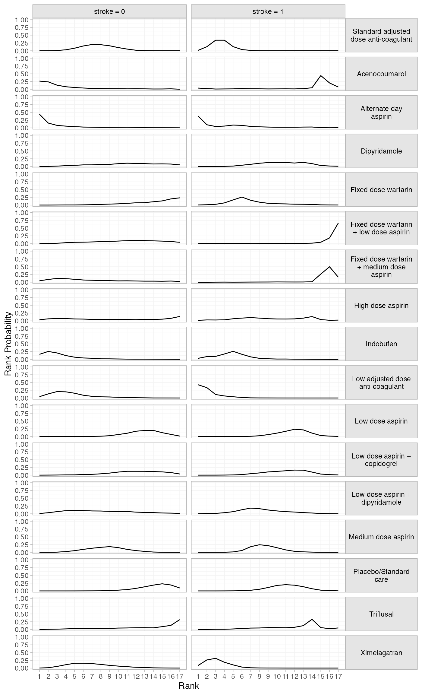

``` r

(af_4b_cumrankprobs <- posterior_rank_probs(af_fit_4b, cumulative = TRUE,
                                            newdata = data.frame(stroke = c(0, 1), 
                                                                 label = c("stroke = 0", "stroke = 1")), 
                                            study = label))
#> ------------------------------------------------------------- Study: stroke = 0 ---- 
#> 
#> Covariate values:
#>  stroke
#>       0
#> 
#>                                                          p_rank[1] p_rank[2] p_rank[3]
#> d[stroke = 0: Standard adjusted dose anti-coagulant]          0.00      0.00      0.01
#> d[stroke = 0: Acenocoumarol]                                  0.26      0.50      0.64
#> d[stroke = 0: Alternate day aspirin]                          0.44      0.59      0.67
#> d[stroke = 0: Dipyridamole]                                   0.00      0.00      0.01
#> d[stroke = 0: Fixed dose warfarin]                            0.00      0.00      0.00
#> d[stroke = 0: Fixed dose warfarin + low dose aspirin]         0.00      0.01      0.02
#> d[stroke = 0: Fixed dose warfarin + medium dose aspirin]      0.05      0.14      0.26
#> d[stroke = 0: High dose aspirin]                              0.03      0.10      0.17
#> d[stroke = 0: Indobufen]                                      0.16      0.42      0.63
#> d[stroke = 0: Low adjusted dose anti-coagulant]               0.04      0.17      0.38
#> d[stroke = 0: Low dose aspirin]                               0.00      0.00      0.00
#> d[stroke = 0: Low dose aspirin + copidogrel]                  0.00      0.00      0.01
#> d[stroke = 0: Low dose aspirin + dipyridamole]                0.01      0.04      0.11
#> d[stroke = 0: Medium dose aspirin]                            0.00      0.00      0.01
#> d[stroke = 0: Placebo/Standard care]                          0.00      0.00      0.00
#> d[stroke = 0: Triflusal]                                      0.00      0.01      0.02
#> d[stroke = 0: Ximelagatran]                                   0.00      0.01      0.07
#>                                                          p_rank[4] p_rank[5] p_rank[6]
#> d[stroke = 0: Standard adjusted dose anti-coagulant]          0.04      0.12      0.27
#> d[stroke = 0: Acenocoumarol]                                  0.72      0.78      0.82
#> d[stroke = 0: Alternate day aspirin]                          0.73      0.77      0.80
#> d[stroke = 0: Dipyridamole]                                   0.04      0.08      0.13
#> d[stroke = 0: Fixed dose warfarin]                            0.01      0.01      0.02
#> d[stroke = 0: Fixed dose warfarin + low dose aspirin]         0.05      0.09      0.14
#> d[stroke = 0: Fixed dose warfarin + medium dose aspirin]      0.37      0.47      0.54
#> d[stroke = 0: High dose aspirin]                              0.24      0.30      0.36
#> d[stroke = 0: Indobufen]                                      0.75      0.82      0.87
#> d[stroke = 0: Low adjusted dose anti-coagulant]               0.58      0.73      0.82
#> d[stroke = 0: Low dose aspirin]                               0.00      0.00      0.00
#> d[stroke = 0: Low dose aspirin + copidogrel]                  0.02      0.03      0.05
#> d[stroke = 0: Low dose aspirin + dipyridamole]                0.21      0.32      0.42
#> d[stroke = 0: Medium dose aspirin]                            0.03      0.08      0.18
#> d[stroke = 0: Placebo/Standard care]                          0.00      0.00      0.00
#> d[stroke = 0: Triflusal]                                      0.04      0.07      0.10
#> d[stroke = 0: Ximelagatran]                                   0.17      0.33      0.49
#>                                                          p_rank[7] p_rank[8] p_rank[9]
#> d[stroke = 0: Standard adjusted dose anti-coagulant]          0.47      0.66      0.82
#> d[stroke = 0: Acenocoumarol]                                  0.85      0.87      0.89
#> d[stroke = 0: Alternate day aspirin]                          0.82      0.84      0.86
#> d[stroke = 0: Dipyridamole]                                   0.18      0.25      0.32
#> d[stroke = 0: Fixed dose warfarin]                            0.03      0.05      0.08
#> d[stroke = 0: Fixed dose warfarin + low dose aspirin]         0.20      0.26      0.33
#> d[stroke = 0: Fixed dose warfarin + medium dose aspirin]      0.60      0.66      0.71
#> d[stroke = 0: High dose aspirin]                              0.40      0.45      0.49
#> d[stroke = 0: Indobufen]                                      0.91      0.93      0.94
#> d[stroke = 0: Low adjusted dose anti-coagulant]               0.87      0.91      0.95
#> d[stroke = 0: Low dose aspirin]                               0.01      0.02      0.05
#> d[stroke = 0: Low dose aspirin + copidogrel]                  0.07      0.12      0.18
#> d[stroke = 0: Low dose aspirin + dipyridamole]                0.51      0.60      0.67
#> d[stroke = 0: Medium dose aspirin]                            0.31      0.47      0.66
#> d[stroke = 0: Placebo/Standard care]                          0.00      0.01      0.02
#> d[stroke = 0: Triflusal]                                      0.12      0.16      0.19
#> d[stroke = 0: Ximelagatran]                                   0.63      0.75      0.83
#>                                                          p_rank[10] p_rank[11] p_rank[12]
#> d[stroke = 0: Standard adjusted dose anti-coagulant]           0.92       0.98       0.99
#> d[stroke = 0: Acenocoumarol]                                   0.91       0.93       0.95
#> d[stroke = 0: Alternate day aspirin]                           0.87       0.89       0.91
#> d[stroke = 0: Dipyridamole]                                    0.41       0.52       0.61
#> d[stroke = 0: Fixed dose warfarin]                             0.12       0.18       0.25
#> d[stroke = 0: Fixed dose warfarin + low dose aspirin]          0.41       0.51       0.62
#> d[stroke = 0: Fixed dose warfarin + medium dose aspirin]       0.75       0.80       0.84
#> d[stroke = 0: High dose aspirin]                               0.54       0.59       0.64
#> d[stroke = 0: Indobufen]                                       0.96       0.97       0.98
#> d[stroke = 0: Low adjusted dose anti-coagulant]                0.97       0.98       0.99
#> d[stroke = 0: Low dose aspirin]                                0.11       0.22       0.39
#> d[stroke = 0: Low dose aspirin + copidogrel]                   0.28       0.41       0.53
#> d[stroke = 0: Low dose aspirin + dipyridamole]                 0.74       0.81       0.87
#> d[stroke = 0: Medium dose aspirin]                             0.81       0.90       0.96
#> d[stroke = 0: Placebo/Standard care]                           0.04       0.09       0.17
#> d[stroke = 0: Triflusal]                                       0.24       0.29       0.35
#> d[stroke = 0: Ximelagatran]                                    0.90       0.94       0.97
#>                                                          p_rank[13] p_rank[14] p_rank[15]
#> d[stroke = 0: Standard adjusted dose anti-coagulant]           1.00       1.00       1.00
#> d[stroke = 0: Acenocoumarol]                                   0.96       0.97       0.98
#> d[stroke = 0: Alternate day aspirin]                           0.92       0.94       0.96
#> d[stroke = 0: Dipyridamole]                                    0.71       0.79       0.87
#> d[stroke = 0: Fixed dose warfarin]                             0.33       0.44       0.57
#> d[stroke = 0: Fixed dose warfarin + low dose aspirin]          0.72       0.81       0.89
#> d[stroke = 0: Fixed dose warfarin + medium dose aspirin]       0.87       0.91       0.94
#> d[stroke = 0: High dose aspirin]                               0.68       0.73       0.78
#> d[stroke = 0: Indobufen]                                       0.98       0.99       0.99
#> d[stroke = 0: Low adjusted dose anti-coagulant]                1.00       1.00       1.00
#> d[stroke = 0: Low dose aspirin]                                0.59       0.79       0.91
#> d[stroke = 0: Low dose aspirin + copidogrel]                   0.66       0.77       0.88
#> d[stroke = 0: Low dose aspirin + dipyridamole]                 0.91       0.94       0.97
#> d[stroke = 0: Medium dose aspirin]                             0.99       1.00       1.00
#> d[stroke = 0: Placebo/Standard care]                           0.30       0.49       0.71
#> d[stroke = 0: Triflusal]                                       0.41       0.46       0.55
#> d[stroke = 0: Ximelagatran]                                    0.99       0.99       1.00
#>                                                          p_rank[16] p_rank[17]
#> d[stroke = 0: Standard adjusted dose anti-coagulant]           1.00          1
#> d[stroke = 0: Acenocoumarol]                                   1.00          1
#> d[stroke = 0: Alternate day aspirin]                           0.98          1
#> d[stroke = 0: Dipyridamole]                                    0.95          1
#> d[stroke = 0: Fixed dose warfarin]                             0.77          1
#> d[stroke = 0: Fixed dose warfarin + low dose aspirin]          0.96          1
#> d[stroke = 0: Fixed dose warfarin + medium dose aspirin]       0.98          1
#> d[stroke = 0: High dose aspirin]                               0.86          1
#> d[stroke = 0: Indobufen]                                       1.00          1
#> d[stroke = 0: Low adjusted dose anti-coagulant]                1.00          1
#> d[stroke = 0: Low dose aspirin]                                0.98          1
#> d[stroke = 0: Low dose aspirin + copidogrel]                   0.96          1
#> d[stroke = 0: Low dose aspirin + dipyridamole]                 0.99          1
#> d[stroke = 0: Medium dose aspirin]                             1.00          1
#> d[stroke = 0: Placebo/Standard care]                           0.90          1
#> d[stroke = 0: Triflusal]                                       0.68          1
#> d[stroke = 0: Ximelagatran]                                    1.00          1
#> 
#> ------------------------------------------------------------- Study: stroke = 1 ---- 
#> 
#> Covariate values:
#>  stroke
#>       1
#> 
#>                                                          p_rank[1] p_rank[2] p_rank[3]
#> d[stroke = 1: Standard adjusted dose anti-coagulant]          0.01      0.14      0.48
#> d[stroke = 1: Acenocoumarol]                                  0.04      0.06      0.07
#> d[stroke = 1: Alternate day aspirin]                          0.38      0.48      0.53
#> d[stroke = 1: Dipyridamole]                                   0.00      0.00      0.01
#> d[stroke = 1: Fixed dose warfarin]                            0.00      0.01      0.04
#> d[stroke = 1: Fixed dose warfarin + low dose aspirin]         0.00      0.01      0.02
#> d[stroke = 1: Fixed dose warfarin + medium dose aspirin]      0.00      0.00      0.00
#> d[stroke = 1: High dose aspirin]                              0.02      0.04      0.07
#> d[stroke = 1: Indobufen]                                      0.03      0.12      0.22
#> d[stroke = 1: Low adjusted dose anti-coagulant]               0.43      0.76      0.87
#> d[stroke = 1: Low dose aspirin]                               0.00      0.00      0.00
#> d[stroke = 1: Low dose aspirin + copidogrel]                  0.00      0.00      0.00
#> d[stroke = 1: Low dose aspirin + dipyridamole]                0.00      0.01      0.02
#> d[stroke = 1: Medium dose aspirin]                            0.00      0.00      0.00
#> d[stroke = 1: Placebo/Standard care]                          0.00      0.00      0.00
#> d[stroke = 1: Triflusal]                                      0.00      0.00      0.01
#> d[stroke = 1: Ximelagatran]                                   0.08      0.35      0.66
#>                                                          p_rank[4] p_rank[5] p_rank[6]
#> d[stroke = 1: Standard adjusted dose anti-coagulant]          0.82      0.95      0.99
#> d[stroke = 1: Acenocoumarol]                                  0.08      0.10      0.12
#> d[stroke = 1: Alternate day aspirin]                          0.58      0.68      0.76
#> d[stroke = 1: Dipyridamole]                                   0.01      0.02      0.06
#> d[stroke = 1: Fixed dose warfarin]                            0.11      0.27      0.53
#> d[stroke = 1: Fixed dose warfarin + low dose aspirin]         0.02      0.03      0.03
#> d[stroke = 1: Fixed dose warfarin + medium dose aspirin]      0.01      0.01      0.01
#> d[stroke = 1: High dose aspirin]                              0.10      0.17      0.26
#> d[stroke = 1: Indobufen]                                      0.40      0.66      0.82
#> d[stroke = 1: Low adjusted dose anti-coagulant]               0.94      0.98      0.99
#> d[stroke = 1: Low dose aspirin]                               0.00      0.00      0.00
#> d[stroke = 1: Low dose aspirin + copidogrel]                  0.00      0.01      0.03
#> d[stroke = 1: Low dose aspirin + dipyridamole]                0.06      0.12      0.25
#> d[stroke = 1: Medium dose aspirin]                            0.01      0.02      0.08
#> d[stroke = 1: Placebo/Standard care]                          0.00      0.00      0.01
#> d[stroke = 1: Triflusal]                                      0.02      0.03      0.07
#> d[stroke = 1: Ximelagatran]                                   0.85      0.95      0.98
#>                                                          p_rank[7] p_rank[8] p_rank[9]
#> d[stroke = 1: Standard adjusted dose anti-coagulant]          1.00      1.00      1.00
#> d[stroke = 1: Acenocoumarol]                                  0.14      0.16      0.17
#> d[stroke = 1: Alternate day aspirin]                          0.80      0.84      0.86
#> d[stroke = 1: Dipyridamole]                                   0.13      0.24      0.36
#> d[stroke = 1: Fixed dose warfarin]                            0.69      0.78      0.83
#> d[stroke = 1: Fixed dose warfarin + low dose aspirin]         0.04      0.05      0.06
#> d[stroke = 1: Fixed dose warfarin + medium dose aspirin]      0.02      0.02      0.03
#> d[stroke = 1: High dose aspirin]                              0.36      0.45      0.52
#> d[stroke = 1: Indobufen]                                      0.90      0.94      0.96
#> d[stroke = 1: Low adjusted dose anti-coagulant]               1.00      1.00      1.00
#> d[stroke = 1: Low dose aspirin]                               0.01      0.04      0.10
#> d[stroke = 1: Low dose aspirin + copidogrel]                  0.08      0.15      0.25
#> d[stroke = 1: Low dose aspirin + dipyridamole]                0.43      0.60      0.72
#> d[stroke = 1: Medium dose aspirin]                            0.26      0.50      0.72
#> d[stroke = 1: Placebo/Standard care]                          0.03      0.08      0.19
#> d[stroke = 1: Triflusal]                                      0.11      0.16      0.22
#> d[stroke = 1: Ximelagatran]                                   0.99      1.00      1.00
#>                                                          p_rank[10] p_rank[11] p_rank[12]
#> d[stroke = 1: Standard adjusted dose anti-coagulant]           1.00       1.00       1.00
#> d[stroke = 1: Acenocoumarol]                                   0.18       0.20       0.21
#> d[stroke = 1: Alternate day aspirin]                           0.89       0.91       0.93
#> d[stroke = 1: Dipyridamole]                                    0.48       0.61       0.72
#> d[stroke = 1: Fixed dose warfarin]                             0.88       0.91       0.94
#> d[stroke = 1: Fixed dose warfarin + low dose aspirin]          0.07       0.08       0.08
#> d[stroke = 1: Fixed dose warfarin + medium dose aspirin]       0.04       0.05       0.06
#> d[stroke = 1: High dose aspirin]                               0.58       0.63       0.70
#> d[stroke = 1: Indobufen]                                       0.97       0.98       0.99
#> d[stroke = 1: Low adjusted dose anti-coagulant]                1.00       1.00       1.00
#> d[stroke = 1: Low dose aspirin]                                0.22       0.38       0.62
#> d[stroke = 1: Low dose aspirin + copidogrel]                   0.38       0.52       0.68
#> d[stroke = 1: Low dose aspirin + dipyridamole]                 0.81       0.87       0.93
#> d[stroke = 1: Medium dose aspirin]                             0.87       0.94       0.98
#> d[stroke = 1: Placebo/Standard care]                           0.37       0.57       0.76
#> d[stroke = 1: Triflusal]                                       0.28       0.34       0.41
#> d[stroke = 1: Ximelagatran]                                    1.00       1.00       1.00
#>                                                          p_rank[13] p_rank[14] p_rank[15]
#> d[stroke = 1: Standard adjusted dose anti-coagulant]           1.00       1.00       1.00
#> d[stroke = 1: Acenocoumarol]                                   0.23       0.28       0.72
#> d[stroke = 1: Alternate day aspirin]                           0.95       0.98       0.99
#> d[stroke = 1: Dipyridamole]                                    0.86       0.95       0.98
#> d[stroke = 1: Fixed dose warfarin]                             0.97       0.99       0.99
#> d[stroke = 1: Fixed dose warfarin + low dose aspirin]          0.09       0.11       0.15
#> d[stroke = 1: Fixed dose warfarin + medium dose aspirin]       0.06       0.08       0.34
#> d[stroke = 1: High dose aspirin]                               0.78       0.92       0.96
#> d[stroke = 1: Indobufen]                                       1.00       1.00       1.00
#> d[stroke = 1: Low adjusted dose anti-coagulant]                1.00       1.00       1.00
#> d[stroke = 1: Low dose aspirin]                                0.83       0.95       0.98
#> d[stroke = 1: Low dose aspirin + copidogrel]                   0.84       0.94       0.98
#> d[stroke = 1: Low dose aspirin + dipyridamole]                 0.96       0.99       1.00
#> d[stroke = 1: Medium dose aspirin]                             0.99       1.00       1.00
#> d[stroke = 1: Placebo/Standard care]                           0.89       0.96       0.99
#> d[stroke = 1: Triflusal]                                       0.53       0.86       0.92
#> d[stroke = 1: Ximelagatran]                                    1.00       1.00       1.00
#>                                                          p_rank[16] p_rank[17]
#> d[stroke = 1: Standard adjusted dose anti-coagulant]           1.00          1
#> d[stroke = 1: Acenocoumarol]                                   0.93          1
#> d[stroke = 1: Alternate day aspirin]                           0.99          1
#> d[stroke = 1: Dipyridamole]                                    0.99          1
#> d[stroke = 1: Fixed dose warfarin]                             1.00          1
#> d[stroke = 1: Fixed dose warfarin + low dose aspirin]          0.34          1
#> d[stroke = 1: Fixed dose warfarin + medium dose aspirin]       0.84          1
#> d[stroke = 1: High dose aspirin]                               0.98          1
#> d[stroke = 1: Indobufen]                                       1.00          1
#> d[stroke = 1: Low adjusted dose anti-coagulant]                1.00          1
#> d[stroke = 1: Low dose aspirin]                                0.99          1
#> d[stroke = 1: Low dose aspirin + copidogrel]                   0.99          1
#> d[stroke = 1: Low dose aspirin + dipyridamole]                 1.00          1
#> d[stroke = 1: Medium dose aspirin]                             1.00          1
#> d[stroke = 1: Placebo/Standard care]                           1.00          1
#> d[stroke = 1: Triflusal]                                       0.95          1
#> d[stroke = 1: Ximelagatran]                                    1.00          1

plot(af_4b_cumrankprobs) + 
  facet_grid(Treatment~Study, labeller = label_wrap_gen(20)) + 
  theme(strip.text.y = element_text(angle = 0))
```

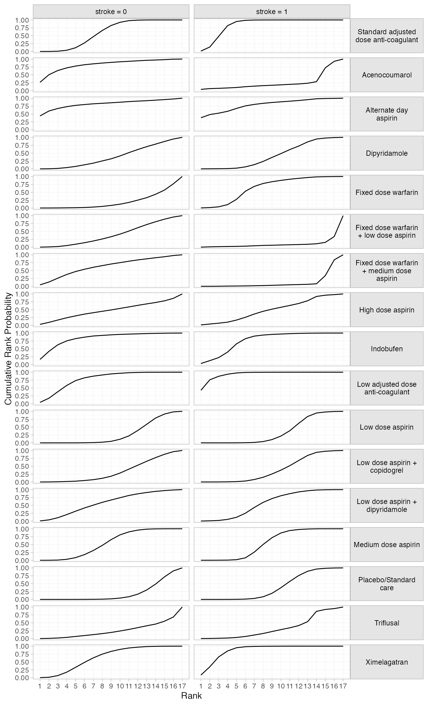

## Model fit and comparison

Model fit can be checked using the
[`dic()`](https://dmphillippo.github.io/multinma/dev/reference/dic.md)
function:

``` r

(af_dic_1 <- dic(af_fit_1))
#> Residual deviance: 60.4 (on 61 data points)
#>                pD: 48.7
#>               DIC: 109
```

``` r

(af_dic_4b <- dic(af_fit_4b))
#> Residual deviance: 57.9 (on 61 data points)
#>                pD: 47.9
#>               DIC: 105.7
```

Both models fit the data well, having posterior mean residual deviance
close to the number of data points. The DIC is slightly lower for the
meta-regression model, although only by a couple of points (substantial
differences are usually considered 3-5 points). The estimated
heterogeneity standard deviation is much lower for the meta-regression
model, suggesting that adjusting for the proportion of patients with
prior stroke is explaining some of the heterogeneity in the data.

We can also examine the residual deviance contributions with the
corresponding [`plot()`](https://rdrr.io/r/graphics/plot.default.html)
method.

``` r

plot(af_dic_1)
```

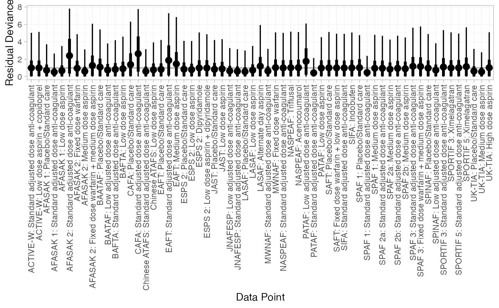

``` r

plot(af_dic_4b)
```

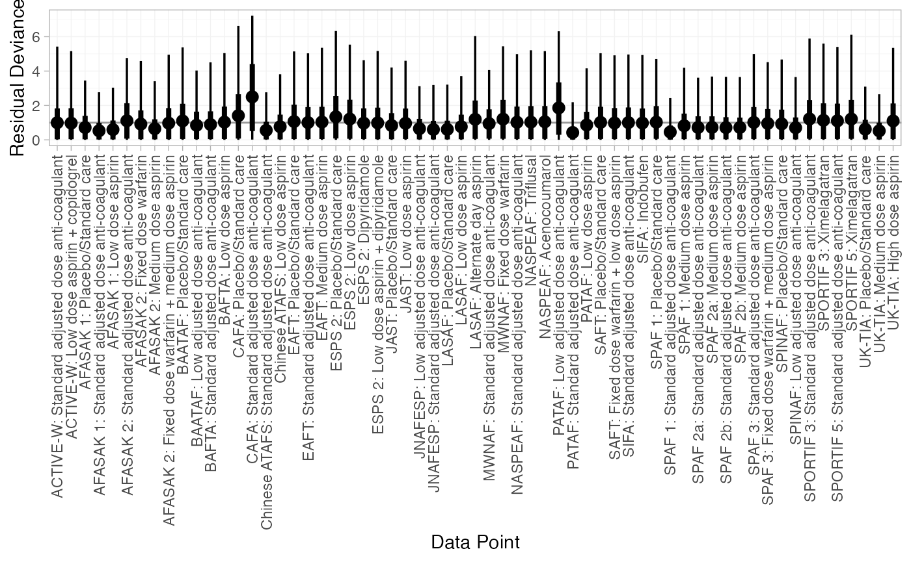

## References

Cooper, N. J., A. J. Sutton, D. Morris, A. E. Ades, and N. J. Welton.
2009. “Addressing Between-Study Heterogeneity and Inconsistency in Mixed
Treatment Comparisons: Application to Stroke Prevention Treatments in
Individuals with Non-Rheumatic Atrial Fibrillation.” *Statistics in
Medicine* 28 (14): 1861–81. <https://doi.org/10.1002/sim.3594>.
