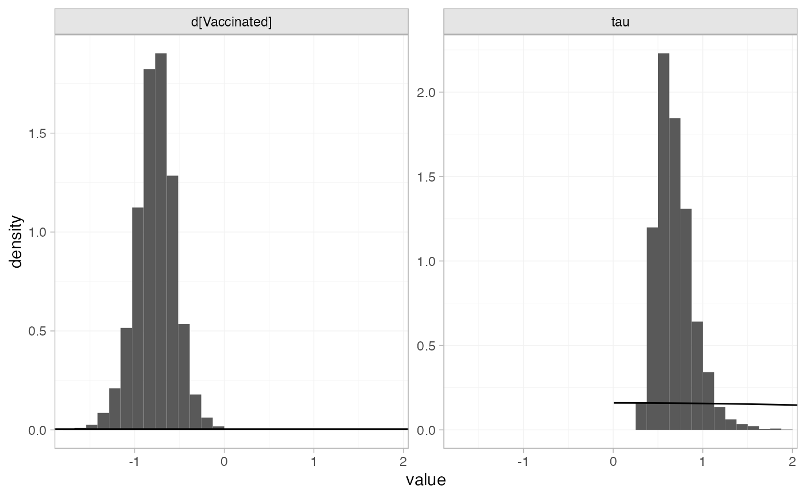
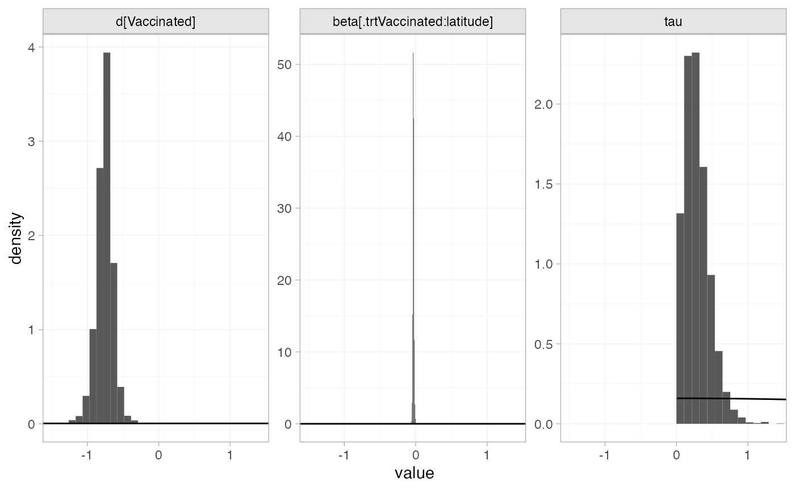
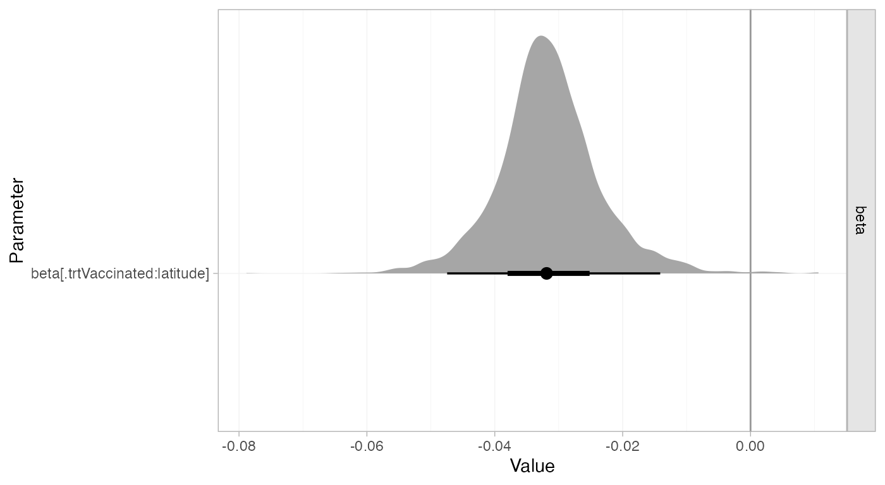
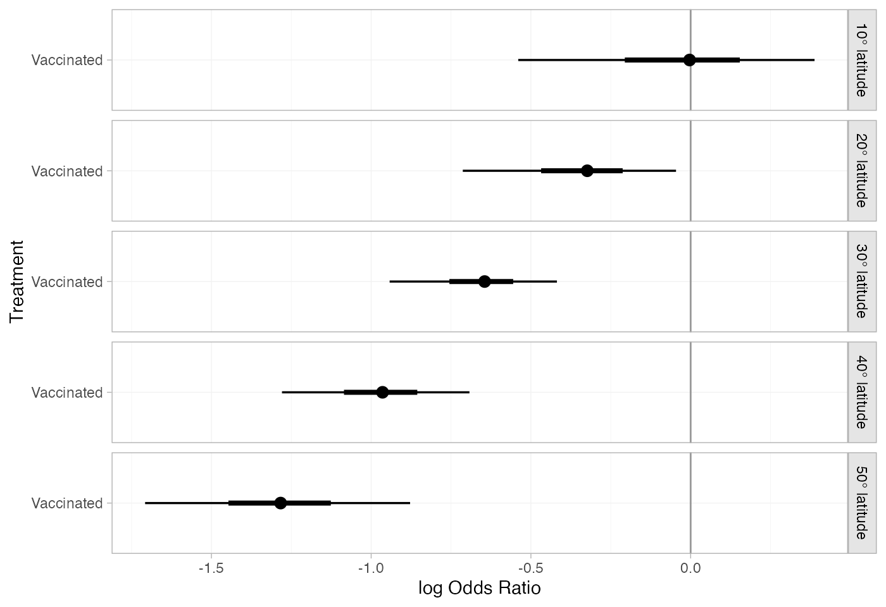
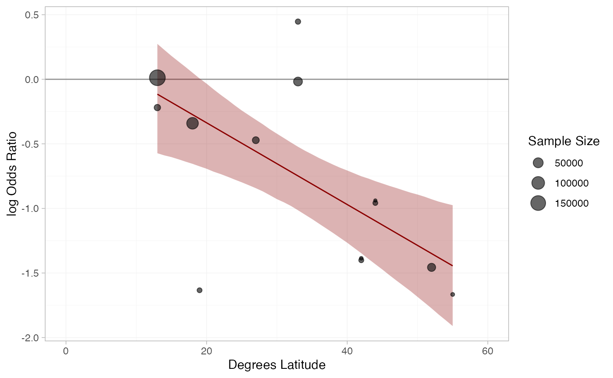

# Example: BCG vaccine for tuberculosis

``` r

library(multinma)
options(mc.cores = parallel::detectCores())
```

    #> For execution on a local, multicore CPU with excess RAM we recommend calling
    #> options(mc.cores = parallel::detectCores())
    #> 
    #> Attaching package: 'multinma'
    #> The following objects are masked from 'package:stats':
    #> 
    #>     dgamma, pgamma, qgamma

This vignette describes the analysis of 13 trials investigating BCG
vaccination vs. no vaccination for prevention of Tuberculosis (TB)
([Dias et al. 2011](#ref-TSD3); [Berkey et al. 1995](#ref-Berkey1995)).
The data are available in this package as `bcg_vaccine`:

``` r

head(bcg_vaccine)
#>   studyn trtn         trtc latitude  r   n
#> 1      1    1 Unvaccinated       44 11 139
#> 2      1    2   Vaccinated       44  4 123
#> 3      2    1 Unvaccinated       55 29 303
#> 4      2    2   Vaccinated       55  6 306
#> 5      3    1 Unvaccinated       42 11 220
#> 6      3    2   Vaccinated       42  3 231
```

Dias et al. ([2011](#ref-TSD3)) used these data to demonstrate
meta-regression models adjusting for the continuous covariate
`latitude`, the absolute degrees latitude at which the study was
conducted, which we recreate here.

## Setting up the network

We have data giving the number diagnosed with TB during trial follow-up
(`r`) out of the total (`n`) in each arm, so we use the function
[`set_agd_arm()`](https://dmphillippo.github.io/multinma/dev/reference/set_agd_arm.md)
to set up the network. We set “unvaccinated” as the network reference
treatment.

``` r

bcg_net <- set_agd_arm(bcg_vaccine, 
                       study = studyn,
                       trt = trtc,
                       r = r, 
                       n = n,
                       trt_ref = "Unvaccinated")
bcg_net
#> A network with 13 AgD studies (arm-based).
#> 
#> ------------------------------------------------------- AgD studies (arm-based) ---- 
#>  Study Treatment arms              
#>  1     2: Unvaccinated | Vaccinated
#>  2     2: Unvaccinated | Vaccinated
#>  3     2: Unvaccinated | Vaccinated
#>  4     2: Unvaccinated | Vaccinated
#>  5     2: Unvaccinated | Vaccinated
#>  6     2: Unvaccinated | Vaccinated
#>  7     2: Unvaccinated | Vaccinated
#>  8     2: Unvaccinated | Vaccinated
#>  9     2: Unvaccinated | Vaccinated
#>  10    2: Unvaccinated | Vaccinated
#>  ... plus 3 more studies
#> 
#>  Outcome type: count
#> ------------------------------------------------------------------------------------
#> Total number of treatments: 2
#> Total number of studies: 13
#> Reference treatment is: Unvaccinated
#> Network is connected
```

The `latitude` variable in the `bcg_vaccine` data frame will
automatically be available to use in a meta-regression model.

## Meta-analysis models

We fit random effects (RE) models, firstly without any covariates, and
then with a meta-regression on the continuous covariate `latitude`.

### RE meta-analysis (no covariate)

We start by fitting a standard RE model without any covariates. We use
\mathrm{N}(0, 100^2) prior distributions for the treatment effect
d\_\mathrm{Vaccine} and study-specific intercepts \mu_j, and a
\textrm{half-N}(0, 5^2) prior distribution for the heterogeneity
standard deviation \tau. We can examine the range of parameter values
implied by these prior distributions with the
[`summary()`](https://rdrr.io/r/base/summary.html) method:

``` r

summary(normal(scale = 100))
#> A Normal prior distribution: location = 0, scale = 100.
#> 50% of the prior density lies between -67.45 and 67.45.
#> 95% of the prior density lies between -196 and 196.
summary(half_normal(scale = 5))
#> A half-Normal prior distribution: scale = 5.
#> 50% of the prior density lies between 0 and 3.37.
#> 95% of the prior density lies between 0 and 9.8.
```

The model is fitted with the
[`nma()`](https://dmphillippo.github.io/multinma/dev/reference/nma.md)
function, with a random effects model specified by
`trt_effects = "random"`.

``` r

bcg_fit_unadj <- nma(bcg_net, 
                     trt_effects = "random",
                     prior_intercept = normal(scale = 100),
                     prior_trt = normal(scale = 100),
                     prior_het = half_normal(scale = 5))
```

Basic parameter summaries are given by the
[`print()`](https://rdrr.io/r/base/print.html) method:

``` r

bcg_fit_unadj
#> A random effects NMA with a binomial likelihood (logit link).
#> Inference for Stan model: binomial_1par.
#> 4 chains, each with iter=10000; warmup=5000; thin=1; 
#> post-warmup draws per chain=5000, total post-warmup draws=20000.
#> 
#>                    mean se_mean   sd      2.5%       25%       50%       75%     97.5% n_eff
#> d[Vaccinated]     -0.76    0.00 0.22     -1.20     -0.90     -0.76     -0.62     -0.33  6566
#> lp__          -13453.89    0.06 4.49 -13463.54 -13456.77 -13453.55 -13450.72 -13446.06  5292
#> tau                0.68    0.00 0.20      0.39      0.54      0.65      0.78      1.16  6576
#>               Rhat
#> d[Vaccinated]    1
#> lp__             1
#> tau              1
#> 
#> Samples were drawn using NUTS(diag_e) at Wed Jul 22 15:04:56 2026.
#> For each parameter, n_eff is a crude measure of effective sample size,
#> and Rhat is the potential scale reduction factor on split chains (at 
#> convergence, Rhat=1).
```

By default, summaries of the study-specific intercepts \mu_j and random
effects \delta_j are hidden, but could be examined by changing the
`pars` argument:

``` r

# Not run
print(bcg_fit_unadj, pars = c("d", "mu", "delta", "tau"))
```

The prior and posterior distributions can be compared visually using the
[`plot_prior_posterior()`](https://dmphillippo.github.io/multinma/dev/reference/plot_prior_posterior.md)
function:

``` r

plot_prior_posterior(bcg_fit_unadj, prior = c("trt", "het"))
```



### RE meta-regression with covariate `latitude`

We now fit a RE meta-regression model, adjusting for `latitude`. We use
\mathrm{N}(0, 100^2) prior distributions for the treatment effect
d\_\mathrm{Vaccine}, study-specific intercepts \mu_j, and regression
coefficient \beta. We use a \text{half-N}(0, 5^2) prior distribution for
the heterogeneity standard deviation \tau. We can examine the range of
parameter values implied by these prior distributions with the
[`summary()`](https://rdrr.io/r/base/summary.html) method:

``` r

summary(normal(scale = 100))
#> A Normal prior distribution: location = 0, scale = 100.
#> 50% of the prior density lies between -67.45 and 67.45.
#> 95% of the prior density lies between -196 and 196.
summary(half_normal(scale = 5))
#> A half-Normal prior distribution: scale = 5.
#> 50% of the prior density lies between 0 and 3.37.
#> 95% of the prior density lies between 0 and 9.8.
```

Again, the model is fitted with the
[`nma()`](https://dmphillippo.github.io/multinma/dev/reference/nma.md)
function. The `regression` formula `~ .trt:latitude` means that the
interaction of latitude with treatment will be included; the `.trt`
special variable indicates treatment, and `latitude` is in the original
data set. We increase `adapt_delta` to 0.99 to remove a small number of
divergent transition errors (the default for RE models is set to 0.95).

``` r

bcg_fit_lat <- nma(bcg_net, 
                   trt_effects = "random",
                   regression = ~.trt:latitude,
                   prior_intercept = normal(scale = 100),
                   prior_trt = normal(scale = 100),
                   prior_reg = normal(scale = 100),
                   prior_het = half_normal(scale = 5),
                   adapt_delta = 0.99)
```

    #> Note: No treatment classes specified in network, any interactions in `regression` formula will be separate (independent) for each treatment.
    #> Use set_*() argument `trt_class` and nma() argument `class_interactions` to change this.

Basic parameter summaries are given by the
[`print()`](https://rdrr.io/r/base/print.html) method:

``` r

bcg_fit_lat
#> A random effects NMA with a binomial likelihood (logit link).
#> Regression model: ~.trt:latitude.
#> Centred covariates at the following overall mean values:
#> latitude 
#> 33.46154 
#> Inference for Stan model: binomial_1par.
#> 4 chains, each with iter=5000; warmup=2500; thin=1; 
#> post-warmup draws per chain=2500, total post-warmup draws=10000.
#> 
#>                                    mean se_mean   sd      2.5%       25%       50%       75%
#> beta[.trtVaccinated:latitude]     -0.03    0.00 0.01     -0.05     -0.04     -0.03     -0.03
#> d[Vaccinated]                     -0.76    0.00 0.12     -1.03     -0.83     -0.76     -0.69
#> lp__                          -13457.21    0.12 5.07 -13468.16 -13460.40 -13456.94 -13453.61
#> tau                                0.30    0.00 0.18      0.03      0.16      0.27      0.40
#>                                   97.5% n_eff Rhat
#> beta[.trtVaccinated:latitude]     -0.01  4569    1
#> d[Vaccinated]                     -0.54  4898    1
#> lp__                          -13448.27  1772    1
#> tau                                0.73  1905    1
#> 
#> Samples were drawn using NUTS(diag_e) at Wed Jul 22 15:05:06 2026.
#> For each parameter, n_eff is a crude measure of effective sample size,
#> and Rhat is the potential scale reduction factor on split chains (at 
#> convergence, Rhat=1).
```

Note that `latitude` has automatically been centered at 33.46, the mean
value for the studies in the network.

By default, summaries of the study-specific intercepts \mu_j and
study-specific relative effects \delta\_{jk} are hidden, but could be
examined by changing the `pars` argument:

``` r

# Not run
print(bcg_fit_lat, pars = c("d", "beta", "mu", "delta", "tau"))
```

The prior and posterior distributions can be compared visually using the
[`plot_prior_posterior()`](https://dmphillippo.github.io/multinma/dev/reference/plot_prior_posterior.md)
function:

``` r

plot_prior_posterior(bcg_fit_lat, prior = c("trt", "reg", "het"))
```



## Model fit and comparison

Model fit can be checked using the
[`dic()`](https://dmphillippo.github.io/multinma/dev/reference/dic.md)
function:

``` r

(bcg_dic_unadj <- dic(bcg_fit_unadj))
#> Residual deviance: 26 (on 26 data points)
#>                pD: 23.5
#>               DIC: 49.5
```

``` r

(bcg_dic_lat <- dic(bcg_fit_lat))
#> Residual deviance: 30.7 (on 26 data points)
#>                pD: 21.5
#>               DIC: 52.1
```

The DIC is very similar between the two models, so we might at first
choose the unadjusted model. The posterior mean residual deviance is
larger for the model with the covariate, but this model also has a lower
effective number of parameters p_D so is allowing for more shrinkage of
the random treatment effects. Moreover, the model with the covariate has
a much lower estimated heterogeneity standard deviation:

``` r

summary(bcg_fit_unadj, pars = "tau")
#>     mean  sd 2.5%  25%  50%  75% 97.5% Bulk_ESS Tail_ESS Rhat
#> tau 0.68 0.2 0.39 0.54 0.65 0.78  1.16     6616    10707    1
summary(bcg_fit_lat, pars = "tau")
#>     mean   sd 2.5%  25%  50% 75% 97.5% Bulk_ESS Tail_ESS Rhat
#> tau  0.3 0.18 0.03 0.16 0.27 0.4  0.73     1678     2461    1
```

Adjusting for latitude is explaining a substantial amount of
heterogeneity in the data. The 95% Credible Interval for the regression
coefficient also excludes zero:

``` r

summary(bcg_fit_lat, pars = "beta")
#>                                mean   sd  2.5%   25%   50%   75% 97.5% Bulk_ESS Tail_ESS Rhat
#> beta[.trtVaccinated:latitude] -0.03 0.01 -0.05 -0.04 -0.03 -0.03 -0.01     4890     4242    1

plot(bcg_fit_lat, 
     pars = "beta", 
     ref_line = 0,
     stat = "halfeye")
```



Altogether, we might prefer the model with the adjustment for latitude.
When considering covariates in random effects models it is important not
to just look at the DIC ([Dias et al. 2011](#ref-TSD3)). We should also
consider any reductions in heterogeneity, and the estimated regression
coefficients and their standard error. The DIC is not sensitive to
changes in the heterogeneity, as RE models are very flexible and can fit
the data well whatever the level of heterogeneity.

## Further results

We can produce estimates of the relative effect of vaccination at any
latitude using the
[`relative_effects()`](https://dmphillippo.github.io/multinma/dev/reference/relative_effects.md)
function. The `newdata` argument specifies a data frame containing the
values of the covariate `latitude` that we are interested in, and the
`study` argument is used to specify a column of `newdata` for an
informative label.

``` r

bcg_releff_lat <- relative_effects(bcg_fit_lat,
                                   newdata = tibble::tibble(latitude = seq(10, 50, by = 10),
                                                            label = paste0(latitude, "\u00B0 latitude")),
                                   study = label)

bcg_releff_lat
#> ----------------------------------------------------------- Study: 10° latitude ---- 
#> 
#> Covariate values:
#>  latitude
#>        10
#> 
#>                              mean   sd  2.5%   25% 50% 75% 97.5% Bulk_ESS Tail_ESS Rhat
#> d[10° latitude: Vaccinated] -0.02 0.22 -0.52 -0.13   0 0.1  0.41     4584     4077    1
#> 
#> ----------------------------------------------------------- Study: 20° latitude ---- 
#> 
#> Covariate values:
#>  latitude
#>        20
#> 
#>                              mean   sd  2.5%   25%   50%   75% 97.5% Bulk_ESS Tail_ESS Rhat
#> d[20° latitude: Vaccinated] -0.34 0.16 -0.69 -0.42 -0.32 -0.25 -0.03     4587     4402    1
#> 
#> ----------------------------------------------------------- Study: 30° latitude ---- 
#> 
#> Covariate values:
#>  latitude
#>        30
#> 
#>                              mean   sd  2.5%   25%   50%   75% 97.5% Bulk_ESS Tail_ESS Rhat
#> d[30° latitude: Vaccinated] -0.65 0.12 -0.93 -0.72 -0.65 -0.58 -0.42     4890     4879    1
#> 
#> ----------------------------------------------------------- Study: 40° latitude ---- 
#> 
#> Covariate values:
#>  latitude
#>        40
#> 
#>                              mean   sd  2.5%   25%   50%   75% 97.5% Bulk_ESS Tail_ESS Rhat
#> d[40° latitude: Vaccinated] -0.97 0.14 -1.27 -1.05 -0.97 -0.89 -0.71     5451     5245    1
#> 
#> ----------------------------------------------------------- Study: 50° latitude ---- 
#> 
#> Covariate values:
#>  latitude
#>        50
#> 
#>                              mean   sd  2.5%   25%   50%   75% 97.5% Bulk_ESS Tail_ESS Rhat
#> d[50° latitude: Vaccinated] -1.29 0.19 -1.68 -1.39 -1.29 -1.18 -0.89     5398     4690    1
```

The [`plot()`](https://rdrr.io/r/graphics/plot.default.html) method may
be used to visually compare these estimates:

``` r

plot(bcg_releff_lat, 
     ref_line = 0)
```



A more sophisticated plot shows the regression line and confidence band
for the effect of latitude, overlaid on the observed log odds ratios in
each study:

``` r

library(dplyr)
#> 
#> Attaching package: 'dplyr'
#> The following objects are masked from 'package:stats':
#> 
#>     filter, lag
#> The following objects are masked from 'package:base':
#> 
#>     intersect, setdiff, setequal, union
library(ggplot2)

# Get data for regression line
lat_range <- range(bcg_vaccine$latitude)
lat_dat <- tibble(latitude = seq(lat_range[1], lat_range[2], by = 1))

bcg_lat_reg <- relative_effects(bcg_fit_lat, 
                                newdata = lat_dat) %>% 
  as_tibble() %>% 
  bind_cols(lat_dat)

# Get study log odds ratios
bcg_lor <- bcg_vaccine %>% 
  group_by(studyn) %>% 
  mutate(lor = log(r / (n - r)) - log(first(r) / (first(n) - first(r))),
         sample_size = sum(n)) %>% 
  slice(-1)

# Plot
ggplot(aes(x = latitude), data = bcg_lor) +
  geom_hline(yintercept = 0, colour = "grey60") +
  geom_ribbon(aes(ymin = `2.5%`, ymax = `97.5%`), data = bcg_lat_reg,
              fill = "darkred", alpha = 0.3) +
  geom_line(aes(y = mean), data = bcg_lat_reg,
            colour = "darkred") +
  geom_point(aes(y = lor, size = sample_size), alpha = 0.6) +
  coord_cartesian(xlim = c(0, 60)) +
  xlab("Degrees Latitude") + ylab("log Odds Ratio") +
  scale_size("Sample Size") +
  theme_multinma()
```



In the presence of heterogeneity, it has been argued that decision
makers should consider the predictive distribution of relative effects
in a new study, instead of the posterior distribution of the mean
treatment effects, as this reflects uncertainty due to heterogeneity and
may better represent uncertainty about a future roll-out of a treatment
(see [Dias et al. 2011](#ref-TSD3)). We can produce predictive
distributions using the `predictive_distribution = TRUE` argument to
[`relative_effects()`](https://dmphillippo.github.io/multinma/dev/reference/relative_effects.md).
Dias et al. ([2018, sec. 8.3.2](#ref-Dias2018)) consider the predictive
distributions for this BCG vaccine analysis.

In the unadjusted analysis, whilst there is substantial evidence that
vaccination is effective on average and essentially zero probability of
harm based on the mean effect, the predictive distribution for
effectiveness in a new study is wide and covers a range of harmful
effects:

``` r

(bcg_predeff_unadj <- relative_effects(bcg_fit_unadj, predictive_distribution = TRUE))
#>                        mean   sd 2.5%   25%   50%   75% 97.5% Bulk_ESS Tail_ESS Rhat
#> delta_new[Vaccinated] -0.77 0.75 -2.3 -1.22 -0.76 -0.31  0.73    16583    17208    1
```

The predictive probability of a new trial showing a harmful effect is:

``` r

mean(as.matrix(bcg_predeff_unadj) > 0)
#> [1] 0.1316
```

For the analysis adjusting for latitude, the predictive distribution of
relative effects now depends on latitude; here we calculate these in
increments of 10 degrees from the equator:

``` r

bcg_predeff_lat <- relative_effects(bcg_fit_lat,
                                   newdata = tibble::tibble(latitude = seq(0, 50, by = 10),
                                                            label = paste0(latitude, "\u00B0 latitude")),
                                   study = label,
                                   predictive_distribution = TRUE)

bcg_predeff_lat
#> ------------------------------------------------------------ Study: 0° latitude ---- 
#> 
#> Covariate values:
#>  latitude
#>         0
#> 
#>                                    mean   sd  2.5%  25%  50%  75% 97.5% Bulk_ESS Tail_ESS Rhat
#> delta_new[0° latitude: Vaccinated]  0.3 0.46 -0.71 0.08 0.32 0.52   1.2     6645     5618    1
#> 
#> ----------------------------------------------------------- Study: 10° latitude ---- 
#> 
#> Covariate values:
#>  latitude
#>        10
#> 
#>                                      mean   sd  2.5%   25% 50%  75% 97.5% Bulk_ESS Tail_ESS
#> delta_new[10° latitude: Vaccinated] -0.02 0.41 -0.93 -0.21   0 0.18   0.8     7313     6060
#>                                     Rhat
#> delta_new[10° latitude: Vaccinated]    1
#> 
#> ----------------------------------------------------------- Study: 20° latitude ---- 
#> 
#> Covariate values:
#>  latitude
#>        20
#> 
#>                                      mean   sd  2.5%   25%   50%   75% 97.5% Bulk_ESS Tail_ESS
#> delta_new[20° latitude: Vaccinated] -0.34 0.38 -1.18 -0.51 -0.32 -0.16  0.45     8079     6925
#>                                     Rhat
#> delta_new[20° latitude: Vaccinated]    1
#> 
#> ----------------------------------------------------------- Study: 30° latitude ---- 
#> 
#> Covariate values:
#>  latitude
#>        30
#> 
#>                                      mean   sd  2.5%   25%   50%   75% 97.5% Bulk_ESS Tail_ESS
#> delta_new[30° latitude: Vaccinated] -0.65 0.37 -1.44 -0.82 -0.64 -0.48  0.12     8646     7396
#>                                     Rhat
#> delta_new[30° latitude: Vaccinated]    1
#> 
#> ----------------------------------------------------------- Study: 40° latitude ---- 
#> 
#> Covariate values:
#>  latitude
#>        40
#> 
#>                                      mean   sd  2.5%   25%   50%   75% 97.5% Bulk_ESS Tail_ESS
#> delta_new[40° latitude: Vaccinated] -0.97 0.38 -1.75 -1.15 -0.96 -0.79 -0.18     8573     7868
#>                                     Rhat
#> delta_new[40° latitude: Vaccinated]    1
#> 
#> ----------------------------------------------------------- Study: 50° latitude ---- 
#> 
#> Covariate values:
#>  latitude
#>        50
#> 
#>                                      mean  sd  2.5%   25%   50%   75% 97.5% Bulk_ESS Tail_ESS
#> delta_new[50° latitude: Vaccinated] -1.29 0.4 -2.12 -1.47 -1.29 -1.09 -0.45     7930     7734
#>                                     Rhat
#> delta_new[50° latitude: Vaccinated]    1
```

The predictive probabilities of a new trial carried out at a given
latitude showing a harmful effect can be calculated as:

``` r

colMeans(as.matrix(bcg_predeff_lat) > 0)
#>  delta_new[0° latitude: Vaccinated] delta_new[10° latitude: Vaccinated] 
#>                              0.8062                              0.5047 
#> delta_new[20° latitude: Vaccinated] delta_new[30° latitude: Vaccinated] 
#>                              0.1327                              0.0398 
#> delta_new[40° latitude: Vaccinated] delta_new[50° latitude: Vaccinated] 
#>                              0.0135                              0.0061
```

So the predictive probability that a new trial carried out at the
equator shows a harmful effect is around 80%, whereas at 50 degrees
latitude the predictive probability is only 0.7%.

## References

Berkey, C. S., D. C. Hoaglin, F. Mosteller, and G. A. Colditz. 1995. “A
Random-Effects Regression Model for Meta-Analysis.” *Statistics in
Medicine* 14 (4): 395–411. <https://doi.org/10.1002/sim.4780140406>.

Dias, S., A. E. Ades, N. J. Welton, J. P. Jansen, and A. J. Sutton.
2018. *Network Meta-Analysis for Decision Making*. Statistics in
Practice. John Wiley & Sons, Ltd.

Dias, S., A. J. Sutton, N. J. Welton, and A. E. Ades. 2011. *NICE DSU
Technical Support Document 3: Heterogeneity: Subgroups, Meta-Regression,
Bias and Bias-Adjustment*. National Institute for Health and Care
Excellence. <https://sheffield.ac.uk/nice-dsu>.
