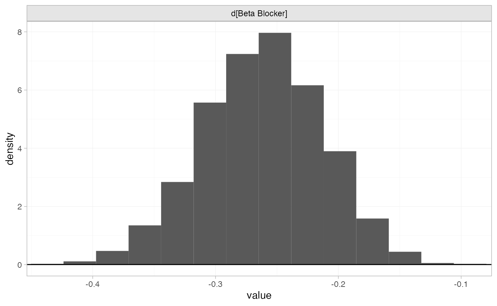
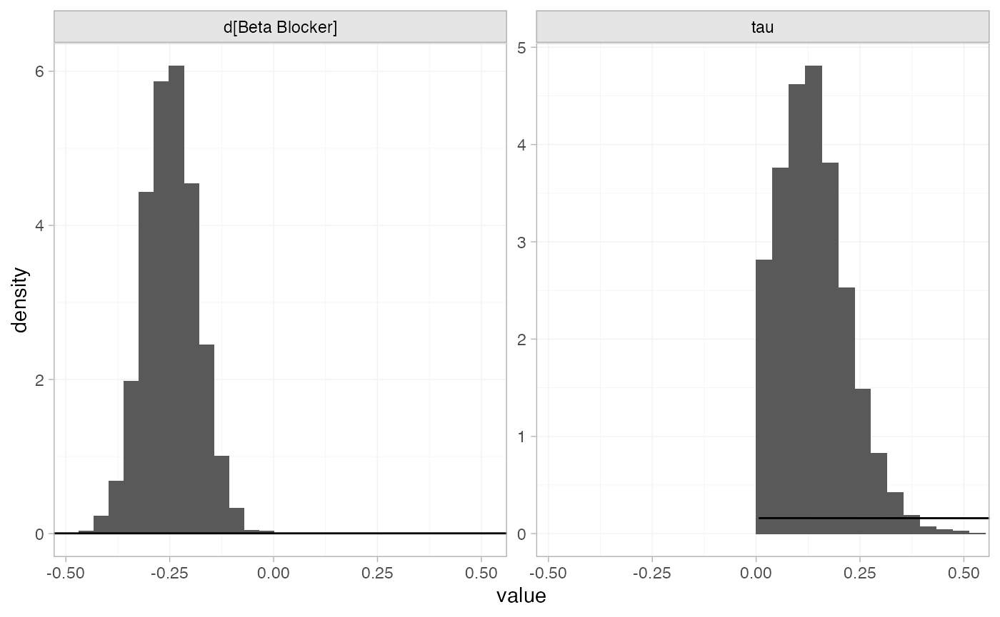
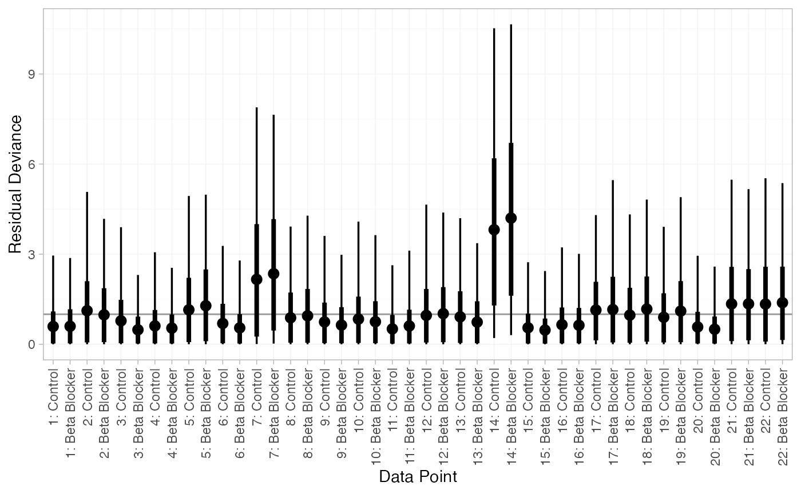
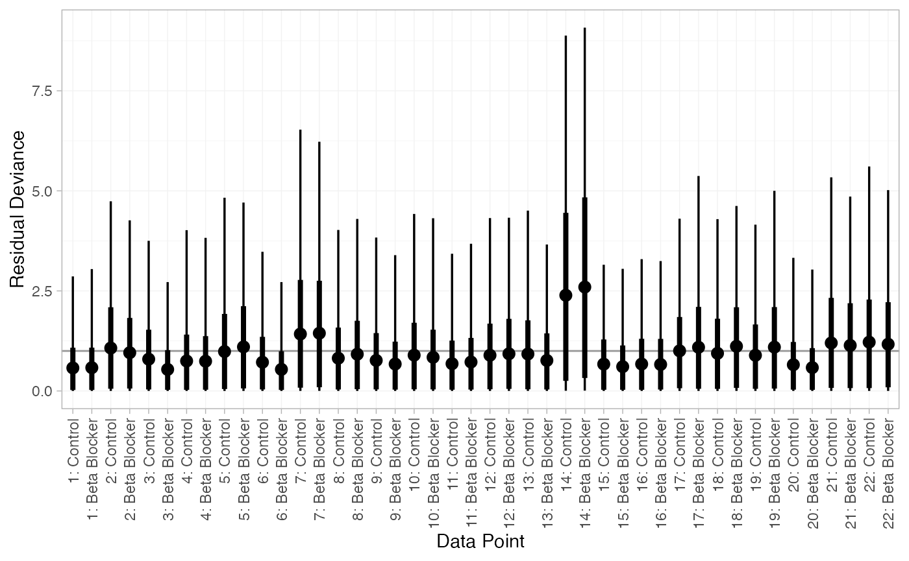
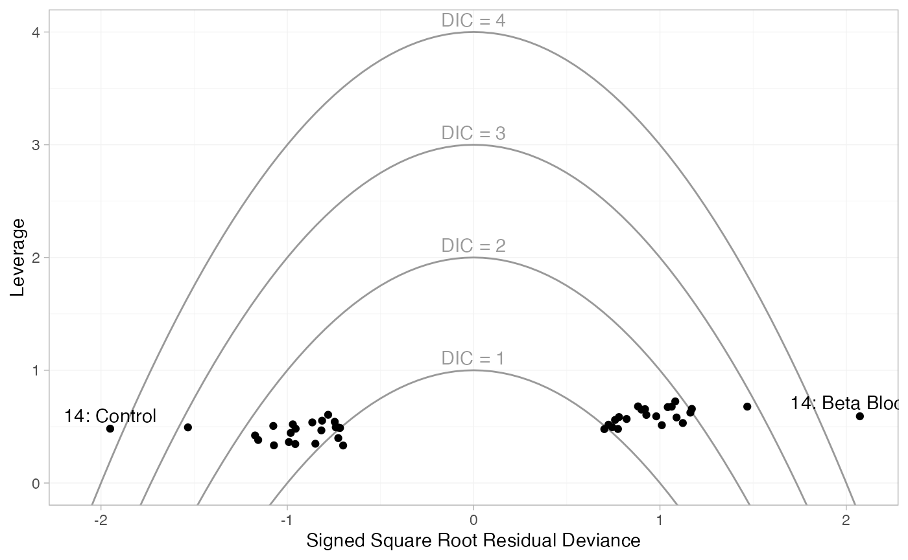
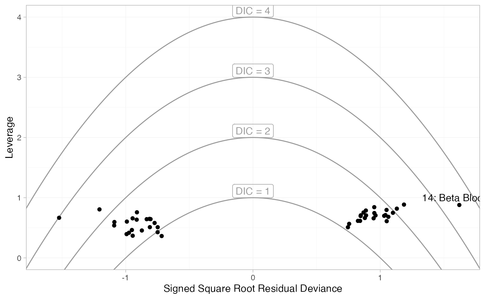
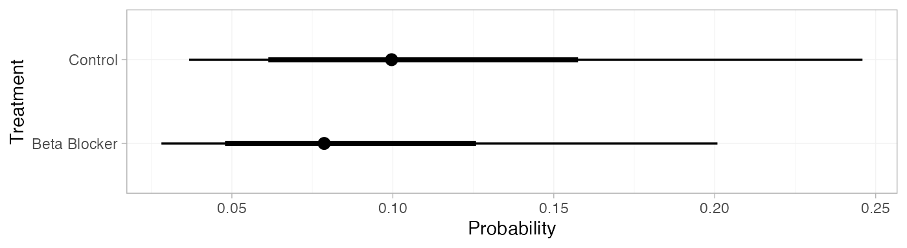
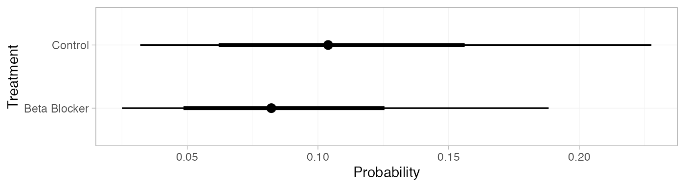
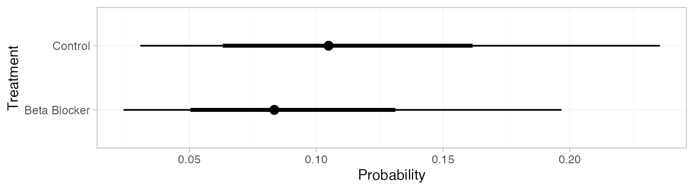

# Example: Beta blockers

``` r

library(multinma)
options(mc.cores = parallel::detectCores())
library(ggplot2)
```

    #> For execution on a local, multicore CPU with excess RAM we recommend calling
    #> options(mc.cores = parallel::detectCores())
    #> 
    #> Attaching package: 'multinma'
    #> The following objects are masked from 'package:stats':
    #> 
    #>     dgamma, pgamma, qgamma

This vignette describes the analysis of 22 trials comparing beta
blockers to control for preventing mortality after myocardial infarction
([Carlin 1992](#ref-Carlin1992); [Dias et al. 2011](#ref-TSD2)). The
data are available in this package as `blocker`:

``` r

head(blocker)
#>   studyn trtn         trtc  r   n
#> 1      1    1      Control  3  39
#> 2      1    2 Beta Blocker  3  38
#> 3      2    1      Control 14 116
#> 4      2    2 Beta Blocker  7 114
#> 5      3    1      Control 11  93
#> 6      3    2 Beta Blocker  5  69
```

## Setting up the network

We begin by setting up the network - here just a pairwise meta-analysis.
We have arm-level count data giving the number of deaths (`r`) out of
the total (`n`) in each arm, so we use the function
[`set_agd_arm()`](https://dmphillippo.github.io/multinma/dev/reference/set_agd_arm.md).
We set “Control” as the reference treatment.

``` r

blocker_net <- set_agd_arm(blocker, 
                           study = studyn,
                           trt = trtc,
                           r = r, 
                           n = n,
                           trt_ref = "Control")
blocker_net
#> A network with 22 AgD studies (arm-based).
#> 
#> ------------------------------------------------------- AgD studies (arm-based) ---- 
#>  Study Treatment arms           
#>  1     2: Control | Beta Blocker
#>  2     2: Control | Beta Blocker
#>  3     2: Control | Beta Blocker
#>  4     2: Control | Beta Blocker
#>  5     2: Control | Beta Blocker
#>  6     2: Control | Beta Blocker
#>  7     2: Control | Beta Blocker
#>  8     2: Control | Beta Blocker
#>  9     2: Control | Beta Blocker
#>  10    2: Control | Beta Blocker
#>  ... plus 12 more studies
#> 
#>  Outcome type: count
#> ------------------------------------------------------------------------------------
#> Total number of treatments: 2
#> Total number of studies: 22
#> Reference treatment is: Control
#> Network is connected
```

## Meta-analysis models

We fit both fixed effect (FE) and random effects (RE) models.

### Fixed effect meta-analysis

First, we fit a fixed effect model using the
[`nma()`](https://dmphillippo.github.io/multinma/dev/reference/nma.md)
function with `trt_effects = "fixed"`. We use \mathrm{N}(0, 100^2) prior
distributions for the treatment effects d_k and study-specific
intercepts \mu_j. We can examine the range of parameter values implied
by these prior distributions with the
[`summary()`](https://rdrr.io/r/base/summary.html) method:

``` r

summary(normal(scale = 100))
#> A Normal prior distribution: location = 0, scale = 100.
#> 50% of the prior density lies between -67.45 and 67.45.
#> 95% of the prior density lies between -196 and 196.
```

The model is fitted using the
[`nma()`](https://dmphillippo.github.io/multinma/dev/reference/nma.md)
function. By default, this will use a Binomial likelihood and a logit
link function, auto-detected from the data.

``` r

blocker_fit_FE <- nma(blocker_net, 
                   trt_effects = "fixed",
                   prior_intercept = normal(scale = 100),
                   prior_trt = normal(scale = 100))
```

Basic parameter summaries are given by the
[`print()`](https://rdrr.io/r/base/print.html) method:

``` r

blocker_fit_FE
#> A fixed effects NMA with a binomial likelihood (logit link).
#> Inference for Stan model: binomial_1par.
#> 4 chains, each with iter=2000; warmup=1000; thin=1; 
#> post-warmup draws per chain=1000, total post-warmup draws=4000.
#> 
#>                     mean se_mean   sd     2.5%      25%      50%      75%    97.5% n_eff Rhat
#> d[Beta Blocker]    -0.26    0.00 0.05    -0.36    -0.30    -0.26    -0.23    -0.16  3693    1
#> lp__            -5960.39    0.09 3.48 -5968.17 -5962.42 -5960.09 -5957.94 -5954.57  1363    1
#> 
#> Samples were drawn using NUTS(diag_e) at Fri Jun 26 12:35:32 2026.
#> For each parameter, n_eff is a crude measure of effective sample size,
#> and Rhat is the potential scale reduction factor on split chains (at 
#> convergence, Rhat=1).
```

By default, summaries of the study-specific intercepts \mu_j are hidden,
but could be examined by changing the `pars` argument:

``` r

# Not run
print(blocker_fit_FE, pars = c("d", "mu"))
```

The prior and posterior distributions can be compared visually using the
[`plot_prior_posterior()`](https://dmphillippo.github.io/multinma/dev/reference/plot_prior_posterior.md)
function:

``` r

plot_prior_posterior(blocker_fit_FE, prior = "trt")
```



### Random effects meta-analysis

We now fit a random effects model using the
[`nma()`](https://dmphillippo.github.io/multinma/dev/reference/nma.md)
function with `trt_effects = "random"`. Again, we use \mathrm{N}(0,
100^2) prior distributions for the treatment effects d_k and
study-specific intercepts \mu_j, and we additionally use a
\textrm{half-N}(5^2) prior for the heterogeneity standard deviation
\tau. We can examine the range of parameter values implied by these
prior distributions with the
[`summary()`](https://rdrr.io/r/base/summary.html) method:

``` r

summary(normal(scale = 100))
#> A Normal prior distribution: location = 0, scale = 100.
#> 50% of the prior density lies between -67.45 and 67.45.
#> 95% of the prior density lies between -196 and 196.
summary(half_normal(scale = 5))
#> A half-Normal prior distribution: scale = 5.
#> 50% of the prior density lies between 0 and 3.37.
#> 95% of the prior density lies between 0 and 9.8.
```

Fitting the RE model

``` r

blocker_fit_RE <- nma(blocker_net, 
                   trt_effects = "random",
                   prior_intercept = normal(scale = 100),
                   prior_trt = normal(scale = 100),
                   prior_het = half_normal(scale = 5))
```

Basic parameter summaries are given by the
[`print()`](https://rdrr.io/r/base/print.html) method:

``` r

blocker_fit_RE
#> A random effects NMA with a binomial likelihood (logit link).
#> Inference for Stan model: binomial_1par.
#> 4 chains, each with iter=2000; warmup=1000; thin=1; 
#> post-warmup draws per chain=1000, total post-warmup draws=4000.
#> 
#>                     mean se_mean   sd     2.5%      25%      50%      75%    97.5% n_eff Rhat
#> d[Beta Blocker]    -0.25    0.00 0.06    -0.38    -0.29    -0.25    -0.21    -0.13  4174    1
#> lp__            -5970.70    0.17 5.66 -5982.57 -5974.43 -5970.52 -5966.81 -5960.34  1072    1
#> tau                 0.13    0.00 0.08     0.01     0.07     0.13     0.19     0.31   928    1
#> 
#> Samples were drawn using NUTS(diag_e) at Fri Jun 26 12:35:35 2026.
#> For each parameter, n_eff is a crude measure of effective sample size,
#> and Rhat is the potential scale reduction factor on split chains (at 
#> convergence, Rhat=1).
```

By default, summaries of the study-specific intercepts \mu_j and
study-specific relative effects \delta\_{jk} are hidden, but could be
examined by changing the `pars` argument:

``` r

# Not run
print(blocker_fit_RE, pars = c("d", "mu", "delta"))
```

The prior and posterior distributions can be compared visually using the
[`plot_prior_posterior()`](https://dmphillippo.github.io/multinma/dev/reference/plot_prior_posterior.md)
function:

``` r

plot_prior_posterior(blocker_fit_RE, prior = c("trt", "het"))
```



### Model comparison

Model fit can be checked using the
[`dic()`](https://dmphillippo.github.io/multinma/dev/reference/dic.md)
function:

``` r

(dic_FE <- dic(blocker_fit_FE))
#> Residual deviance: 46.8 (on 44 data points)
#>                pD: 23.1
#>               DIC: 69.9
```

``` r

(dic_RE <- dic(blocker_fit_RE))
#> Residual deviance: 41.8 (on 44 data points)
#>                pD: 28.1
#>               DIC: 69.9
```

The residual deviance is lower under the RE model, which is to be
expected as this model is more flexible. However, this comes with an
increased effective number of parameters (note the increase in p_D). As
a result, the DIC of both models is very similar and the FE model may be
preferred for parsimony.

We can also examine the residual deviance contributions with the
corresponding [`plot()`](https://rdrr.io/r/graphics/plot.default.html)
method.

``` r

plot(dic_FE)
```



``` r

plot(dic_RE)
```



There are a number of points which are not very well fit by the FE
model, having posterior mean residual deviance contributions greater
than 1. Study 14 is a particularly poor fit under the FE model, but its
residual deviance is reduced (although still high) under the RE model.
The evidence should be given further careful examination, and
consideration given to other issues such as the potential for
effect-modifying covariates ([Dias et al. 2011](#ref-TSD2)).

Leverage plots can also be produced with the
[`plot()`](https://rdrr.io/r/graphics/plot.default.html) method, with
`type = "leverage"`.

``` r

plot(dic_FE, type = "leverage") + 
  # Add labels for points outside DIC=3
  geom_text(aes(label = parameter), data = ~subset(., dic > 3), vjust = -0.5)
```



``` r

plot(dic_RE, type = "leverage") + 
  # Add labels for points outside DIC=3
  geom_text(aes(label = parameter), data = ~subset(., dic > 3), vjust = -0.5)
```



These plot the leverage for each data point (i.e. its contribution to
model complexity p_D) against the square root of the residual deviance.
The sign of the square root residual deviance is given by sign of the
difference between the observed and model-predicted values, indicating
whether each data point is under- or over-estimated by the model.
Contours are displayed which indicate lines of constant contribution to
the DIC. Points contributing more than 3 to the DIC are generally
considered to be contributing to poor fit; here we have labelled these
points using the `ggplot2` function
[`geom_text()`](https://ggplot2.tidyverse.org/reference/geom_text.html).
As with the residual deviance plots above, we again see that both arms
of study 14 are fit poorly under the FE model, and their fit is improved
(but still poor) under the RE model.

## Further results

Dias et al. ([2011](#ref-TSD2)) produce absolute predictions of the
probability of mortality on beta blockers and control, assuming a Normal
distribution on the baseline logit-probability of mortality with mean
-2.2 and precision 3.3. We can replicate these results using the
[`predict()`](https://rdrr.io/r/stats/predict.html) method. The
`baseline` argument takes a
[`distr()`](https://dmphillippo.github.io/multinma/dev/reference/distr.md)
distribution object, with which we specify the corresponding Normal
distribution. We set `type = "response"` to produce predicted
probabilities (`type = "link"` would produce predicted log odds).

``` r

pred_FE <- predict(blocker_fit_FE, 
                   baseline = distr(qnorm, mean = -2.2, sd = 3.3^-0.5), 
                   type = "response")
pred_FE
#>                    mean   sd 2.5%  25%  50%  75% 97.5% Bulk_ESS Tail_ESS Rhat
#> pred[Control]      0.11 0.05 0.04 0.07 0.10 0.14  0.24     4073     3875    1
#> pred[Beta Blocker] 0.09 0.04 0.03 0.06 0.08 0.11  0.19     4086     3948    1
plot(pred_FE)
```



``` r

pred_RE <- predict(blocker_fit_RE, 
                   baseline = distr(qnorm, mean = -2.2, sd = 3.3^-0.5), 
                   type = "response")
pred_RE
#>                    mean   sd 2.5%  25%  50%  75% 97.5% Bulk_ESS Tail_ESS Rhat
#> pred[Control]      0.11 0.05 0.04 0.07 0.10 0.14  0.25     4384     3718    1
#> pred[Beta Blocker] 0.09 0.05 0.03 0.06 0.08 0.11  0.20     4373     3486    1
plot(pred_RE)
```


If instead of information on the baseline logit-probability of mortality
we have event counts, we can use these to construct a Beta distribution
for the baseline probability of mortality. For example, if 4 out of 36
individuals died on control treatment in the target population of
interest, the appropriate Beta distribution for the probability would be
\textrm{Beta}(4, 36-4). We can specify this Beta distribution for the
baseline response using the `baseline_type = "reponse"` argument (the
default is `"link"`, used above for the baseline logit-probability).

``` r

pred_FE_beta <- predict(blocker_fit_FE, 
                        baseline = distr(qbeta, 4, 36-4),
                        baseline_type = "response",
                        type = "response")
pred_FE_beta
#>                    mean   sd 2.5%  25%  50%  75% 97.5% Bulk_ESS Tail_ESS Rhat
#> pred[Control]      0.11 0.05 0.03 0.07 0.10 0.14  0.23     3493     3846    1
#> pred[Beta Blocker] 0.09 0.04 0.02 0.06 0.08 0.11  0.19     3523     3885    1
plot(pred_FE_beta)
```



``` r

pred_RE_beta <- predict(blocker_fit_RE, 
                        baseline = distr(qbeta, 4, 36-4),
                        baseline_type = "response",
                        type = "response")
pred_RE_beta
#>                    mean   sd 2.5%  25%  50%  75% 97.5% Bulk_ESS Tail_ESS Rhat
#> pred[Control]      0.11 0.05 0.03 0.07 0.10 0.14  0.23     3990     3890    1
#> pred[Beta Blocker] 0.09 0.04 0.03 0.06 0.08 0.11  0.19     4017     3918    1
plot(pred_RE_beta)
```



Notice that these results are nearly equivalent to those calculated
above using the Normal distribution for the baseline logit-probability,
since these event counts correspond to approximately the same
distribution on the logit-probability.

## References

Carlin, J. B. 1992. “Meta-Analysis for 2 x 2 Tables: A Bayesian
Approach.” *Statistics in Medicine* 11 (2): 141–58.
<https://doi.org/10.1002/sim.4780110202>.

Dias, S., N. J. Welton, A. J. Sutton, and A. E. Ades. 2011. *NICE DSU
Technical Support Document 2: A Generalised Linear Modelling Framework
for Pair-Wise and Network Meta-Analysis of Randomised Controlled
Trials*. National Institute for Health and Care Excellence.
<https://sheffield.ac.uk/nice-dsu>.
