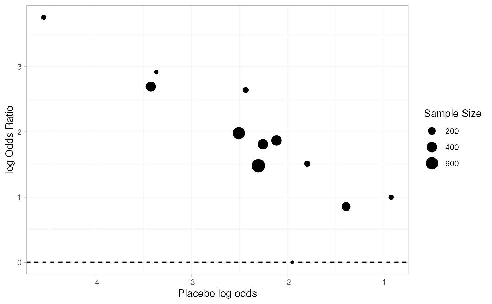
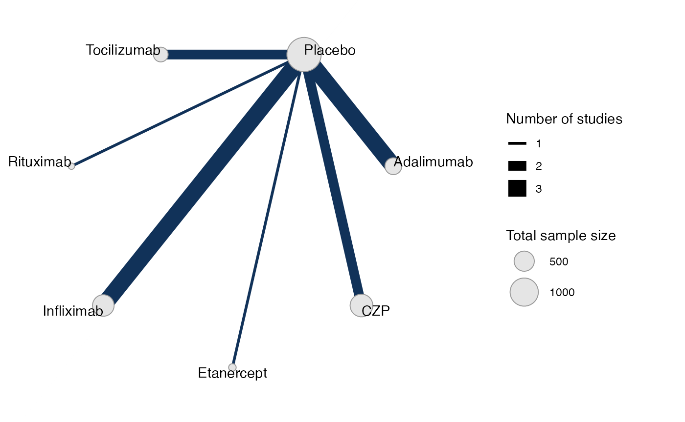
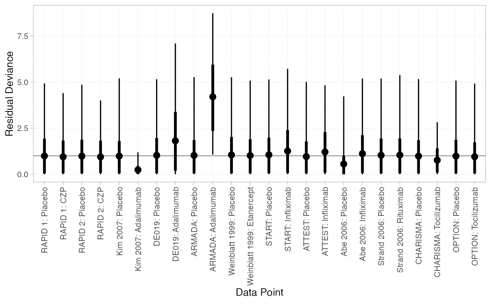
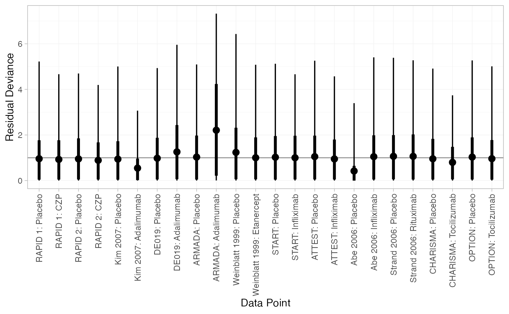
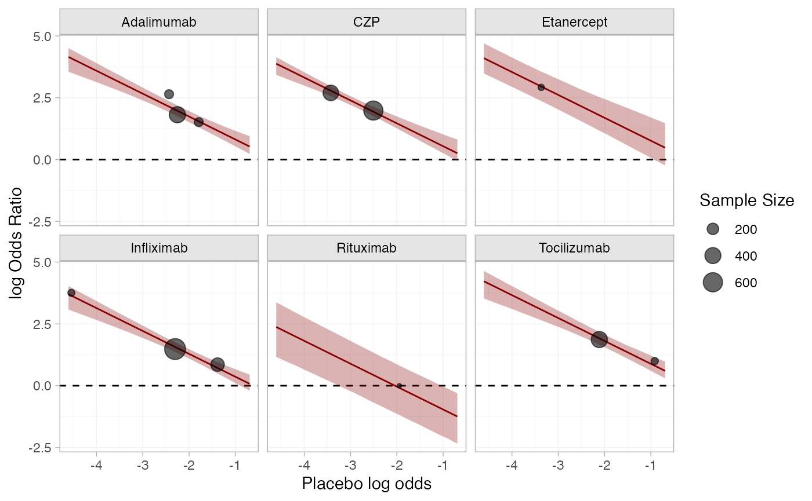
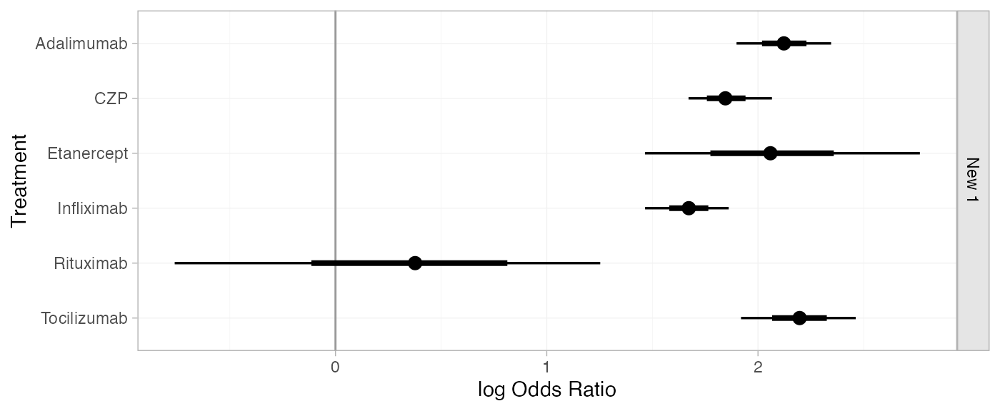
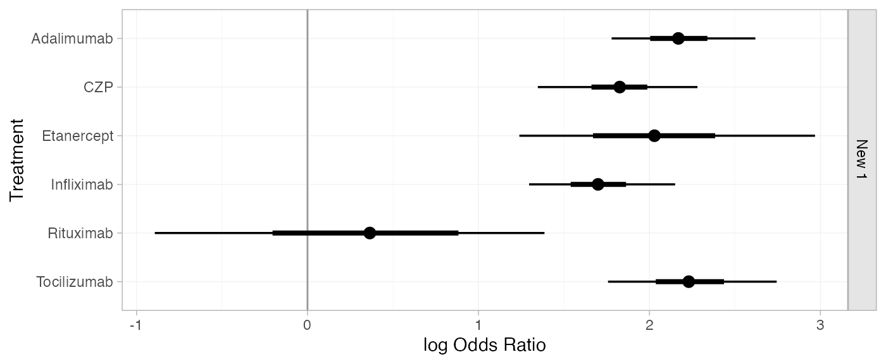
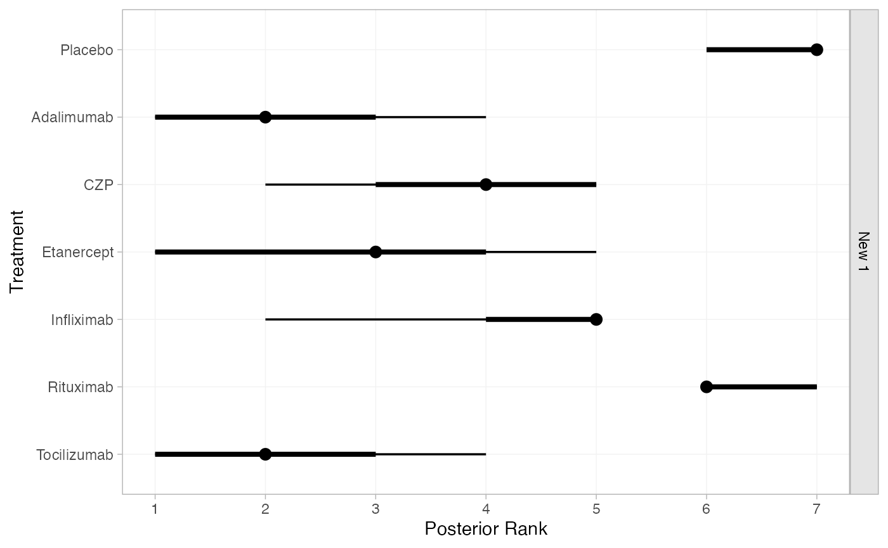
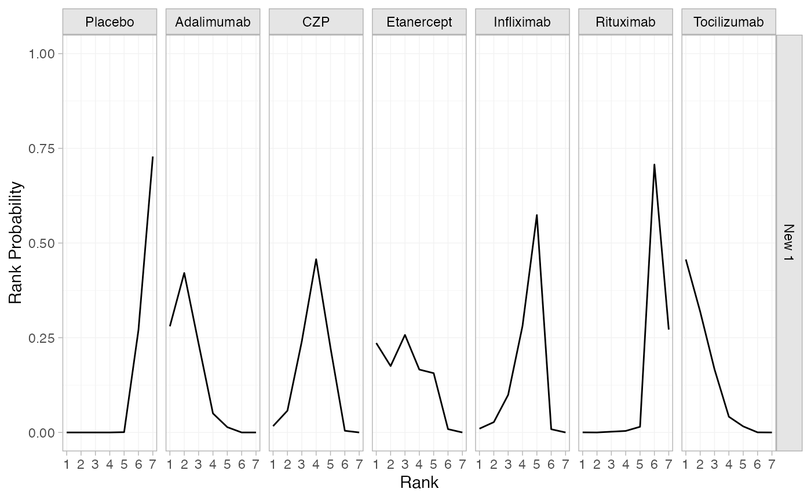
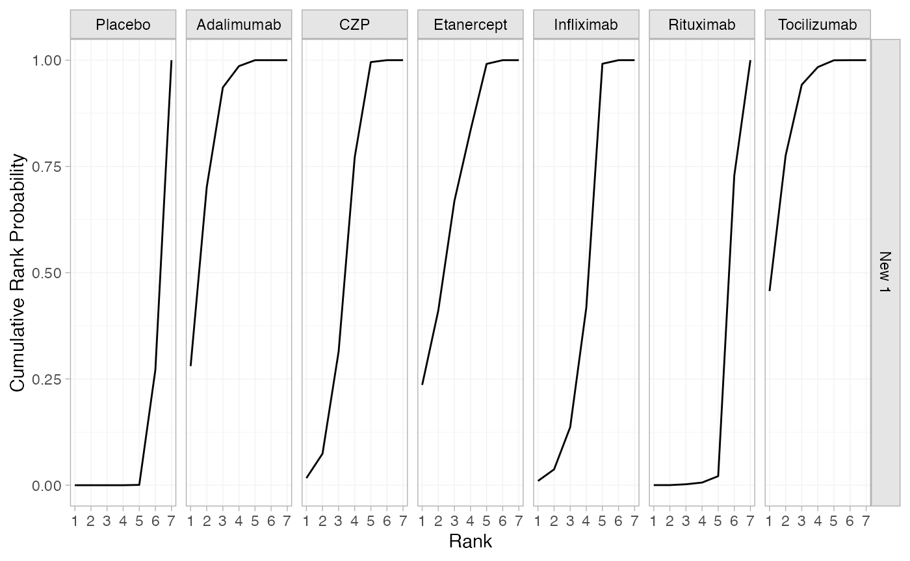

# Example: Certolizumab

``` r
library(multinma)
options(mc.cores = parallel::detectCores())
```

    #> For execution on a local, multicore CPU with excess RAM we recommend calling
    #> options(mc.cores = parallel::detectCores())
    #> 
    #> Attaching package: 'multinma'
    #> The following objects are masked from 'package:stats':
    #> 
    #>     dgamma, pgamma, qgamma

``` r
library(dplyr)
#> 
#> Attaching package: 'dplyr'
#> The following objects are masked from 'package:stats':
#> 
#>     filter, lag
#> The following objects are masked from 'package:base':
#> 
#>     intersect, setdiff, setequal, union
library(ggplot2)
```

This vignette describes the analysis of 12 trials comparing 6 treatments
against placebo for “the treatment of rheumatoid arthritis (RA) in
patients who had failed on disease-modifying anti-rheumatic drugs
(DMARDs)” ([Dias et al. 2011](#ref-TSD3)). The data are available in
this package as `certolizumab`:

``` r
head(certolizumab)
#>      study        trt   r   n disease_duration
#> 1  RAPID 1    Placebo  15 199             6.15
#> 2  RAPID 1        CZP 146 393             6.15
#> 3  RAPID 2    Placebo   4 127             5.85
#> 4  RAPID 2        CZP  80 246             5.85
#> 5 Kim 2007    Placebo   9  63             6.85
#> 6 Kim 2007 Adalimumab  28  65             6.85
```

Dias et al. ([2011](#ref-TSD3)) used this data to demonstrate baseline
risk meta-regression models. Plotting the baseline risk against the
treatment effect, we suspect there might be an effect of the baseline
risk on the treatment effect. Specifically, the log baseline odds
(placebo in this case) seem to be negatively linearly correlated with
the odds ratio. For purposes of plotting only, we apply a continuity
correction to the Abe 2006 study, in which no events were observed on
placebo.

``` r
certolizumab <-
  certolizumab %>%
  group_by(study) %>% 
  mutate(
    cc = any(r == 0),
    probability = if_else(cc, (r + 0.5) / (n + 0.5), r / n),
    odds = probability / (1 - probability),
    log_odds = log(odds)
  )

p_baseline_risk <-
  left_join(
    filter(certolizumab, trt != "Placebo"),
    filter(certolizumab, trt == "Placebo"),
    by = "study",
    suffix = c("", "_baseline")
  ) %>%
  mutate(log_odds_ratio = log_odds - log_odds_baseline, n_total = n + n_baseline) %>%
  ggplot(aes(log_odds_baseline)) +
  geom_hline(yintercept = 0, linetype = "dashed") +
  labs(x = "Placebo log odds", y = "log Odds Ratio", size = "Sample Size") +
  theme_multinma()

p_baseline_risk +
  geom_point(aes(y = log_odds_ratio, size = n_total))
```



## Setting up the network

We begin by setting up the network.

``` r
cert_net <- set_agd_arm(certolizumab,
                        study = study, trt = trt, n = n, r = r,
                        trt_class = if_else(trt == "Placebo", "Placebo", "Treatment"))
cert_net
#> A network with 12 AgD studies (arm-based).
#> 
#> ------------------------------------------------------- AgD studies (arm-based) ---- 
#>  Study    Treatment arms          
#>  Abe 2006 2: Placebo | Infliximab 
#>  ARMADA   2: Placebo | Adalimumab 
#>  ATTEST   2: Placebo | Infliximab 
#>  CHARISMA 2: Placebo | Tocilizumab
#>  DE019    2: Placebo | Adalimumab 
#>  Kim 2007 2: Placebo | Adalimumab 
#>  OPTION   2: Placebo | Tocilizumab
#>  RAPID 1  2: Placebo | CZP        
#>  RAPID 2  2: Placebo | CZP        
#>  START    2: Placebo | Infliximab 
#>  ... plus 2 more studies
#> 
#>  Outcome type: count
#> ------------------------------------------------------------------------------------
#> Total number of treatments: 7, in 2 classes
#> Total number of studies: 12
#> Reference treatment is: Placebo
#> Network is connected
```

Plot the network structure.

``` r
plot(cert_net, weight_edges = TRUE, weight_nodes = TRUE)
```



## Meta-analysis models

We fit both fixed effect (FE) and random effects (RE) models. The
special variable `.mu` is used in the `regression` formula to specify a
baseline risk meta-regression model.

### Fixed effect meta-analysis

``` r
cert_fit_FE <- nma(cert_net,
                   trt_effects = "fixed",
                   regression = ~.mu:.trt,
                   prior_intercept = normal(scale = sqrt(1000)),
                   prior_trt = normal(scale = 100),
                   prior_reg = normal(scale = 100),
                   adapt_delta = 0.95)
#> Note: Setting "Placebo" as the network reference treatment.
```

We may see a few divergent transitions due to the zero on placebo in Abe
2006; increasing `adapt_delta` to 0.95 here helps to minimise these.

Basic parameter summaries are given by the
[`print()`](https://rdrr.io/r/base/print.html) method:

``` r
cert_fit_FE
#> A fixed effects NMA with a binomial likelihood (logit link).
#> Regression model: ~.mu:.trt.
#> Centred covariates at the following overall mean values:
#>      .mu 
#> -2.41557 
#> Inference for Stan model: binomial_1par.
#> 4 chains, each with iter=2000; warmup=1000; thin=1; 
#> post-warmup draws per chain=1000, total post-warmup draws=4000.
#> 
#>                                  mean se_mean   sd     2.5%      25%      50%      75%
#> beta[.mu:.trtclassTreatment]    -0.93    0.00 0.09    -1.03    -0.99    -0.96    -0.88
#> d[Adalimumab]                    2.12    0.00 0.11     1.90     2.05     2.12     2.20
#> d[CZP]                           1.85    0.00 0.10     1.67     1.78     1.85     1.91
#> d[Etanercept]                    2.07    0.01 0.34     1.46     1.85     2.06     2.27
#> d[Infliximab]                    1.67    0.00 0.10     1.47     1.61     1.67     1.74
#> d[Rituximab]                     0.35    0.01 0.50    -0.76     0.03     0.38     0.69
#> d[Tocilizumab]                   2.20    0.00 0.14     1.92     2.11     2.20     2.29
#> lp__                         -1708.53    0.08 3.09 -1715.37 -1710.43 -1708.27 -1706.28
#>                                 97.5% n_eff Rhat
#> beta[.mu:.trtclassTreatment]    -0.69   738 1.01
#> d[Adalimumab]                    2.35  3832 1.00
#> d[CZP]                           2.07  1940 1.00
#> d[Etanercept]                    2.77  1328 1.00
#> d[Infliximab]                    1.86  2621 1.00
#> d[Rituximab]                     1.25  4552 1.00
#> d[Tocilizumab]                   2.46  2863 1.00
#> lp__                         -1703.43  1589 1.00
#> 
#> Samples were drawn using NUTS(diag_e) at Thu Apr 16 09:37:17 2026.
#> For each parameter, n_eff is a crude measure of effective sample size,
#> and Rhat is the potential scale reduction factor on split chains (at 
#> convergence, Rhat=1).
```

### Random effects meta-analysis

``` r
cert_fit_RE <- nma(cert_net,
                   trt_effects = "random",
                   regression = ~.mu:.trt,
                   prior_intercept = normal(scale = sqrt(1000)),
                   prior_trt = normal(scale = 100),
                   prior_reg = normal(scale = 100),
                   prior_het = half_normal(2.5),
                   adapt_delta = 0.95)
#> Note: Setting "Placebo" as the network reference treatment.
#> Warning: There were 6 divergent transitions after warmup. See
#> https://mc-stan.org/misc/warnings.html#divergent-transitions-after-warmup
#> to find out why this is a problem and how to eliminate them.
#> Warning: Examine the pairs() plot to diagnose sampling problems
```

Basic parameter summaries are given by the
[`print()`](https://rdrr.io/r/base/print.html) method:

``` r
cert_fit_RE
#> A random effects NMA with a binomial likelihood (logit link).
#> Regression model: ~.mu:.trt.
#> Centred covariates at the following overall mean values:
#>      .mu 
#> -2.41557 
#> Inference for Stan model: binomial_1par.
#> 4 chains, each with iter=2000; warmup=1000; thin=1; 
#> post-warmup draws per chain=1000, total post-warmup draws=4000.
#> 
#>                                  mean se_mean   sd     2.5%      25%      50%      75%
#> beta[.mu:.trtclassTreatment]    -0.95    0.00 0.10    -1.09    -1.00    -0.97    -0.91
#> d[Adalimumab]                    2.17    0.01 0.21     1.78     2.06     2.17     2.29
#> d[CZP]                           1.82    0.01 0.23     1.35     1.72     1.83     1.93
#> d[Etanercept]                    2.04    0.01 0.44     1.24     1.77     2.03     2.26
#> d[Infliximab]                    1.70    0.00 0.21     1.30     1.59     1.70     1.81
#> d[Rituximab]                     0.34    0.01 0.58    -0.89    -0.04     0.36     0.74
#> d[Tocilizumab]                   2.24    0.01 0.24     1.76     2.09     2.23     2.37
#> lp__                         -1714.52    0.13 4.42 -1723.95 -1717.33 -1714.27 -1711.38
#> tau                              0.22    0.01 0.18     0.01     0.10     0.18     0.29
#>                                 97.5% n_eff Rhat
#> beta[.mu:.trtclassTreatment]    -0.70   445 1.02
#> d[Adalimumab]                    2.62  1670 1.00
#> d[CZP]                           2.28  1625 1.00
#> d[Etanercept]                    2.97  1853 1.00
#> d[Infliximab]                    2.15  2034 1.00
#> d[Rituximab]                     1.39  3859 1.00
#> d[Tocilizumab]                   2.74  1590 1.00
#> lp__                         -1706.97  1087 1.00
#> tau                              0.69   617 1.00
#> 
#> Samples were drawn using NUTS(diag_e) at Thu Apr 16 09:37:21 2026.
#> For each parameter, n_eff is a crude measure of effective sample size,
#> and Rhat is the potential scale reduction factor on split chains (at 
#> convergence, Rhat=1).
```

### Model comparison

Model fit can be checked using the
[`dic()`](https://dmphillippo.github.io/multinma/dev/reference/dic.md)
function:

``` r
(dic_FE <- dic(cert_fit_FE))
#> Residual deviance: 27.1 (on 24 data points)
#>                pD: 18.7
#>               DIC: 45.7
(dic_RE <- dic(cert_fit_RE))
#> Residual deviance: 24.3 (on 24 data points)
#>                pD: 21.5
#>               DIC: 45.8
```

We can also examine the residual deviance contributions with the
corresponding [`plot()`](https://rdrr.io/r/graphics/plot.default.html)
method.

``` r
plot(dic_FE)
```



``` r
plot(dic_RE)
```



### Baseline risk meta-regression

Plotting the estimated baseline risk effect (fixed effect model)
together with the crude odds ratios.

``` r
cert_mu_reg <-
  cert_fit_FE %>%
  relative_effects(
    newdata = tibble(.mu = seq(log(0.01), log(0.5), length.out = 20)),
    study = .mu
  ) %>%
  as_tibble() %>%
  mutate(
    trt = .trtb,
    log_odds_baseline = as.numeric(as.character(.study))
  )

p_baseline_risk +
  facet_wrap(vars(trt)) +
  geom_ribbon(aes(ymin = `2.5%`, ymax = `97.5%`), data = cert_mu_reg,
              fill = "darkred", alpha = 0.3) +
  geom_line(aes(y = mean), data = cert_mu_reg,
            colour = "darkred") +
  geom_point(aes(y = log_odds_ratio, size = n_total), alpha = 0.6)
```



## Further results

For comparison with Dias et al. ([2011](#ref-TSD3)), we can produce
relative effects against placebo at the average observed log odds, using
the
[`relative_effects()`](https://dmphillippo.github.io/multinma/dev/reference/relative_effects.md)
function:

``` r
newdata <- data.frame(.mu = cert_fit_FE$xbar[[".mu"]])
(cert_releff_FE <- relative_effects(cert_fit_FE, newdata = newdata))
#> ------------------------------------------------------------------ Study: New 1 ---- 
#> 
#> Covariate values:
#>    .mu
#>  -2.42
#> 
#>                       mean   sd  2.5%  25%  50%  75% 97.5% Bulk_ESS Tail_ESS Rhat
#> d[New 1: Adalimumab]  2.12 0.11  1.90 2.05 2.12 2.20  2.35     3901     2446    1
#> d[New 1: CZP]         1.85 0.10  1.67 1.78 1.85 1.91  2.07     2230     1630    1
#> d[New 1: Etanercept]  2.07 0.34  1.46 1.85 2.06 2.27  2.77     1822     1200    1
#> d[New 1: Infliximab]  1.67 0.10  1.47 1.61 1.67 1.74  1.86     2862     1771    1
#> d[New 1: Rituximab]   0.35 0.50 -0.76 0.03 0.38 0.69  1.25     4849     2305    1
#> d[New 1: Tocilizumab] 2.20 0.14  1.92 2.11 2.20 2.29  2.46     2947     2587    1
plot(cert_releff_FE, ref_line = 0)
```



``` r
(cert_releff_RE <- relative_effects(cert_fit_RE, newdata = newdata))
#> ------------------------------------------------------------------ Study: New 1 ---- 
#> 
#> Covariate values:
#>    .mu
#>  -2.42
#> 
#>                       mean   sd  2.5%   25%  50%  75% 97.5% Bulk_ESS Tail_ESS Rhat
#> d[New 1: Adalimumab]  2.17 0.21  1.78  2.06 2.17 2.29  2.62     1987      948 1.00
#> d[New 1: CZP]         1.82 0.23  1.35  1.72 1.83 1.93  2.28     2009     1483 1.00
#> d[New 1: Etanercept]  2.04 0.44  1.24  1.77 2.03 2.26  2.97     2097     1625 1.00
#> d[New 1: Infliximab]  1.70 0.21  1.30  1.59 1.70 1.81  2.15     2238     1726 1.00
#> d[New 1: Rituximab]   0.34 0.58 -0.89 -0.04 0.36 0.74  1.39     4174     1795 1.00
#> d[New 1: Tocilizumab] 2.24 0.24  1.76  2.09 2.23 2.37  2.74     1647     1599 1.01
plot(cert_releff_RE, ref_line = 0)
```



Without providing `newdata`,
[`relative_effects()`](https://dmphillippo.github.io/multinma/dev/reference/relative_effects.md)
will produce relative effects per study. Note that the estimated
study-specific intercepts are used.

``` r
(cert_releff_study_RE <- relative_effects(cert_fit_RE))
#> --------------------------------------------------------------- Study: Abe 2006 ---- 
#> 
#> Covariate values:
#>     .mu
#>  -13.86
#> 
#>                           mean    sd 2.5%  25%  50%   75% 97.5% Bulk_ESS Tail_ESS Rhat
#> d[Abe 2006: Adalimumab]  13.40 12.16 2.71 5.21 8.92 17.16 49.31     1035      927 1.01
#> d[Abe 2006: CZP]         13.04 12.14 2.51 4.89 8.49 16.76 49.14     1050     1080 1.01
#> d[Abe 2006: Etanercept]  13.26 12.11 2.77 5.14 8.69 16.88 49.28     1225     1335 1.00
#> d[Abe 2006: Infliximab]  12.92 12.15 2.29 4.78 8.43 16.64 48.88     1072     1192 1.01
#> d[Abe 2006: Rituximab]   11.56 12.15 0.73 3.46 7.08 15.24 47.28     1068     1166 1.01
#> d[Abe 2006: Tocilizumab] 13.46 12.16 2.72 5.31 9.00 17.23 49.47     1042      852 1.01
#> 
#> ----------------------------------------------------------------- Study: ARMADA ---- 
#> 
#> Covariate values:
#>    .mu
#>  -2.46
#> 
#>                        mean   sd  2.5%   25%  50%  75% 97.5% Bulk_ESS Tail_ESS Rhat
#> d[ARMADA: Adalimumab]  2.23 0.52  1.30  1.87 2.19 2.56  3.36     3047     2593    1
#> d[ARMADA: CZP]         1.88 0.51  0.93  1.54 1.84 2.20  2.95     3708     2685    1
#> d[ARMADA: Etanercept]  2.09 0.61  0.96  1.70 2.06 2.46  3.34     3914     2068    1
#> d[ARMADA: Infliximab]  1.76 0.51  0.85  1.41 1.72 2.08  2.87     3154     2824    1
#> d[ARMADA: Rituximab]   0.40 0.75 -1.06 -0.11 0.38 0.90  1.94     3728     2090    1
#> d[ARMADA: Tocilizumab] 2.29 0.53  1.39  1.92 2.25 2.61  3.41     2942     2765    1
#> 
#> ----------------------------------------------------------------- Study: ATTEST ---- 
#> 
#> Covariate values:
#>    .mu
#>  -1.41
#> 
#>                         mean   sd  2.5%   25%   50%   75% 97.5% Bulk_ESS Tail_ESS Rhat
#> d[ATTEST: Adalimumab]   1.22 0.31  0.62  1.02  1.21  1.41  1.85     3481     2239    1
#> d[ATTEST: CZP]          0.87 0.35  0.20  0.65  0.86  1.08  1.58     2389     1779    1
#> d[ATTEST: Etanercept]   1.08 0.54  0.08  0.77  1.07  1.38  2.23     1554      987    1
#> d[ATTEST: Infliximab]   0.75 0.33  0.12  0.54  0.74  0.96  1.42     2964     2076    1
#> d[ATTEST: Rituximab]   -0.62 0.62 -1.87 -1.03 -0.58 -0.19  0.57     4533     2690    1
#> d[ATTEST: Tocilizumab]  1.28 0.33  0.64  1.07  1.27  1.48  1.94     3317     2276    1
#> 
#> --------------------------------------------------------------- Study: CHARISMA ---- 
#> 
#> Covariate values:
#>    .mu
#>  -0.94
#> 
#>                           mean   sd  2.5%   25%   50%   75% 97.5% Bulk_ESS Tail_ESS Rhat
#> d[CHARISMA: Adalimumab]   0.77 0.38  0.04  0.51  0.76  1.02  1.52     3213     2346 1.00
#> d[CHARISMA: CZP]          0.42 0.42 -0.39  0.15  0.42  0.68  1.24     2108     1566 1.00
#> d[CHARISMA: Etanercept]   0.63 0.58 -0.43  0.27  0.61  0.96  1.90     1416      840 1.01
#> d[CHARISMA: Infliximab]   0.30 0.39 -0.45  0.05  0.30  0.55  1.08     2489     1585 1.00
#> d[CHARISMA: Rituximab]   -1.06 0.65 -2.41 -1.49 -1.04 -0.61  0.15     4125     2349 1.00
#> d[CHARISMA: Tocilizumab]  0.83 0.39  0.08  0.58  0.83  1.08  1.61     3167     2529 1.00
#> 
#> ------------------------------------------------------------------ Study: DE019 ---- 
#> 
#> Covariate values:
#>    .mu
#>  -2.28
#> 
#>                       mean   sd  2.5%   25%  50%  75% 97.5% Bulk_ESS Tail_ESS Rhat
#> d[DE019: Adalimumab]  2.05 0.31  1.45  1.84 2.04 2.25  2.66     3002     2489    1
#> d[DE019: CZP]         1.70 0.34  1.02  1.49 1.70 1.91  2.35     2624     2212    1
#> d[DE019: Etanercept]  1.91 0.50  0.96  1.59 1.91 2.21  2.97     2238     1758    1
#> d[DE019: Infliximab]  1.58 0.32  0.98  1.37 1.58 1.77  2.21     3069     2497    1
#> d[DE019: Rituximab]   0.21 0.62 -1.07 -0.19 0.24 0.64  1.38     4038     2141    1
#> d[DE019: Tocilizumab] 2.11 0.33  1.49  1.89 2.10 2.32  2.77     3098     2474    1
#> 
#> --------------------------------------------------------------- Study: Kim 2007 ---- 
#> 
#> Covariate values:
#>    .mu
#>  -1.85
#> 
#>                           mean   sd  2.5%   25%   50%  75% 97.5% Bulk_ESS Tail_ESS Rhat
#> d[Kim 2007: Adalimumab]   1.64 0.40  0.88  1.36  1.62 1.89  2.46     3916     2702    1
#> d[Kim 2007: CZP]          1.29 0.42  0.45  1.01  1.29 1.56  2.13     2772     2255    1
#> d[Kim 2007: Etanercept]   1.50 0.58  0.40  1.14  1.49 1.83  2.71     2081     1809    1
#> d[Kim 2007: Infliximab]   1.17 0.41  0.38  0.90  1.16 1.43  2.00     3450     2614    1
#> d[Kim 2007: Rituximab]   -0.20 0.67 -1.53 -0.63 -0.18 0.25  1.10     4590     2542    1
#> d[Kim 2007: Tocilizumab]  1.70 0.41  0.91  1.43  1.69 1.95  2.56     3645     2871    1
#> 
#> ----------------------------------------------------------------- Study: OPTION ---- 
#> 
#> Covariate values:
#>    .mu
#>  -2.13
#> 
#>                        mean   sd  2.5%   25%  50%  75% 97.5% Bulk_ESS Tail_ESS Rhat
#> d[OPTION: Adalimumab]  1.91 0.30  1.33  1.71 1.89 2.09  2.52     3708     2191    1
#> d[OPTION: CZP]         1.55 0.32  0.92  1.36 1.56 1.76  2.17     2849     2114    1
#> d[OPTION: Etanercept]  1.77 0.50  0.81  1.47 1.76 2.06  2.78     2057     1631    1
#> d[OPTION: Infliximab]  1.44 0.31  0.85  1.25 1.43 1.63  2.07     2942     2125    1
#> d[OPTION: Rituximab]   0.07 0.62 -1.19 -0.33 0.09 0.49  1.23     4437     2790    1
#> d[OPTION: Tocilizumab] 1.97 0.33  1.35  1.76 1.95 2.18  2.64     3476     2390    1
#> 
#> ---------------------------------------------------------------- Study: RAPID 1 ---- 
#> 
#> Covariate values:
#>    .mu
#>  -2.54
#> 
#>                         mean   sd  2.5%  25%  50%  75% 97.5% Bulk_ESS Tail_ESS Rhat
#> d[RAPID 1: Adalimumab]  2.29 0.33  1.66 2.07 2.28 2.49  3.00     2699     1980    1
#> d[RAPID 1: CZP]         1.94 0.34  1.29 1.73 1.93 2.15  2.62     2926     2313    1
#> d[RAPID 1: Etanercept]  2.15 0.51  1.20 1.84 2.14 2.47  3.17     2772     1874    1
#> d[RAPID 1: Infliximab]  1.82 0.33  1.19 1.61 1.81 2.02  2.50     3481     2496    1
#> d[RAPID 1: Rituximab]   0.46 0.64 -0.85 0.03 0.47 0.90  1.66     4154     2141    1
#> d[RAPID 1: Tocilizumab] 2.35 0.36  1.69 2.11 2.34 2.58  3.09     2346     2247    1
#> 
#> ---------------------------------------------------------------- Study: RAPID 2 ---- 
#> 
#> Covariate values:
#>    .mu
#>  -3.55
#> 
#>                         mean   sd  2.5%  25%  50%  75% 97.5% Bulk_ESS Tail_ESS Rhat
#> d[RAPID 2: Adalimumab]  3.25 0.56  2.26 2.87 3.21 3.59  4.46     2045     1245    1
#> d[RAPID 2: CZP]         2.90 0.56  1.92 2.53 2.86 3.23  4.09     2625     2246    1
#> d[RAPID 2: Etanercept]  3.11 0.64  1.96 2.68 3.09 3.53  4.44     3515     2376    1
#> d[RAPID 2: Infliximab]  2.78 0.55  1.81 2.40 2.74 3.11  3.98     2466     1783    1
#> d[RAPID 2: Rituximab]   1.42 0.79 -0.13 0.89 1.42 1.93  2.97     3025     1893    1
#> d[RAPID 2: Tocilizumab] 3.31 0.58  2.27 2.91 3.28 3.66  4.55     2150     1165    1
#> 
#> ------------------------------------------------------------------ Study: START ---- 
#> 
#> Covariate values:
#>    .mu
#>  -2.32
#> 
#>                       mean   sd  2.5%   25%  50%  75% 97.5% Bulk_ESS Tail_ESS Rhat
#> d[START: Adalimumab]  2.09 0.28  1.59  1.91 2.08 2.25  2.66     2658     1898    1
#> d[START: CZP]         1.74 0.30  1.14  1.56 1.74 1.91  2.33     2377     1857    1
#> d[START: Etanercept]  1.95 0.48  1.09  1.65 1.94 2.22  2.94     2065     1696    1
#> d[START: Infliximab]  1.62 0.28  1.07  1.44 1.61 1.79  2.17     3069     2227    1
#> d[START: Rituximab]   0.25 0.61 -1.01 -0.14 0.28 0.67  1.38     4249     2197    1
#> d[START: Tocilizumab] 2.15 0.30  1.59  1.95 2.15 2.34  2.75     2445     1578    1
#> 
#> ------------------------------------------------------------ Study: Strand 2006 ---- 
#> 
#> Covariate values:
#>    .mu
#>  -2.04
#> 
#>                              mean   sd  2.5%   25%   50%  75% 97.5% Bulk_ESS Tail_ESS Rhat
#> d[Strand 2006: Adalimumab]   1.82 0.52  0.86  1.47  1.80 2.15  2.92     4554     2734    1
#> d[Strand 2006: CZP]          1.47 0.54  0.47  1.11  1.47 1.81  2.60     3560     2453    1
#> d[Strand 2006: Etanercept]   1.68 0.66  0.46  1.25  1.67 2.09  3.06     2923     1991    1
#> d[Strand 2006: Infliximab]   1.35 0.53  0.37  0.99  1.34 1.68  2.48     4028     2584    1
#> d[Strand 2006: Rituximab]   -0.01 0.77 -1.52 -0.52 -0.01 0.49  1.49     3994     2773    1
#> d[Strand 2006: Tocilizumab]  1.88 0.54  0.89  1.51  1.87 2.23  3.02     4031     2879    1
#> 
#> --------------------------------------------------------- Study: Weinblatt 1999 ---- 
#> 
#> Covariate values:
#>    .mu
#>  -3.95
#> 
#>                                mean   sd  2.5%  25%  50%  75% 97.5% Bulk_ESS Tail_ESS Rhat
#> d[Weinblatt 1999: Adalimumab]  3.63 1.33  1.69 2.70 3.40 4.25  6.99     2774     2099    1
#> d[Weinblatt 1999: CZP]         3.27 1.32  1.31 2.36 3.05 3.93  6.57     2821     2010    1
#> d[Weinblatt 1999: Etanercept]  3.49 1.42  1.31 2.52 3.28 4.23  6.98     2948     1999    1
#> d[Weinblatt 1999: Infliximab]  3.15 1.33  1.24 2.23 2.92 3.80  6.47     2828     2077    1
#> d[Weinblatt 1999: Rituximab]   1.79 1.45 -0.59 0.81 1.60 2.57  5.27     2459     2122    1
#> d[Weinblatt 1999: Tocilizumab] 3.69 1.34  1.74 2.77 3.46 4.36  7.04     2866     2040    1
```

To produce predictions against a reference baseline risk distribution,
[`predict()`](https://rdrr.io/r/stats/predict.html) will use the `.mu`
values sampled from the `baseline` distribution, for example:

``` r
predict(cert_fit_RE, baseline = distr(qnorm, mean = cert_fit_RE$xbar[[".mu"]], sd = 0.5))
#> ------------------------------------------------------------------ Study: New 1 ---- 
#> 
#>                           mean   sd   2.5%    25%   50%   75% 97.5% Bulk_ESS Tail_ESS Rhat
#> pred[New 1: Placebo]     -2.42 0.51  -3.43  -2.76 -2.43 -2.08 -1.43     4032     3972 1.00
#> pred[New 1: Adalimumab]  -8.07 0.99  -9.70  -8.67 -8.17 -7.57 -5.75     1225      666 1.01
#> pred[New 1: CZP]         -8.42 1.05 -10.12  -9.08 -8.52 -7.92 -5.92     1087      703 1.01
#> pred[New 1: Etanercept]  -8.21 1.20 -10.16  -8.93 -8.34 -7.66 -5.45     1042      706 1.01
#> pred[New 1: Infliximab]  -8.54 1.03 -10.29  -9.18 -8.63 -8.03 -6.27     1260      644 1.01
#> pred[New 1: Rituximab]   -9.90 1.10 -11.90 -10.61 -9.97 -9.29 -7.49     1317      707 1.01
#> pred[New 1: Tocilizumab] -8.01 0.96  -9.60  -8.62 -8.10 -7.54 -5.84     1175      797 1.01
```

When not passing a `baseline` distribution, predictions will be produced
per study. The estimated study-specific intercepts are used in the
baseline risk meta-regression.

``` r
predict(cert_fit_RE)
#> --------------------------------------------------------------- Study: Abe 2006 ---- 
#> 
#>                               mean    sd   2.5%    25%    50%   75% 97.5% Bulk_ESS Tail_ESS
#> pred[Abe 2006: Placebo]     -13.86 12.12 -49.68 -17.58  -9.34 -5.72 -3.30     1208     1340
#> pred[Abe 2006: Adalimumab]  -13.97 12.18 -49.98 -17.77  -9.50 -5.81 -3.07     1115     1350
#> pred[Abe 2006: CZP]         -14.32 12.20 -49.99 -18.16  -9.88 -6.16 -3.27     1100     1350
#> pred[Abe 2006: Etanercept]  -14.11 12.24 -49.68 -17.97  -9.68 -6.00 -2.83     1011      923
#> pred[Abe 2006: Infliximab]  -14.44 12.19 -50.41 -18.21  -9.98 -6.28 -3.54     1093     1230
#> pred[Abe 2006: Rituximab]   -15.81 12.21 -51.51 -19.64 -11.32 -7.64 -4.77     1140     1335
#> pred[Abe 2006: Tocilizumab] -13.91 12.18 -49.62 -17.73  -9.40 -5.73 -3.08     1113     1331
#>                             Rhat
#> pred[Abe 2006: Placebo]     1.00
#> pred[Abe 2006: Adalimumab]  1.01
#> pred[Abe 2006: CZP]         1.01
#> pred[Abe 2006: Etanercept]  1.01
#> pred[Abe 2006: Infliximab]  1.01
#> pred[Abe 2006: Rituximab]   1.00
#> pred[Abe 2006: Tocilizumab] 1.00
#> 
#> ----------------------------------------------------------------- Study: ARMADA ---- 
#> 
#>                            mean   sd  2.5%   25%   50%   75% 97.5% Bulk_ESS Tail_ESS Rhat
#> pred[ARMADA: Placebo]     -2.46 0.48 -3.51 -2.77 -2.42 -2.13 -1.61     4213     2740    1
#> pred[ARMADA: Adalimumab]  -2.58 0.59 -3.79 -2.96 -2.56 -2.21 -1.41     1936      981    1
#> pred[ARMADA: CZP]         -2.93 0.64 -4.22 -3.33 -2.93 -2.52 -1.60     1544     1050    1
#> pred[ARMADA: Etanercept]  -2.72 0.80 -4.26 -3.22 -2.74 -2.26 -0.93     1241      774    1
#> pred[ARMADA: Infliximab]  -3.05 0.62 -4.32 -3.44 -3.03 -2.65 -1.83     1734     1104    1
#> pred[ARMADA: Rituximab]   -4.41 0.79 -6.03 -4.93 -4.39 -3.88 -2.90     2523     2331    1
#> pred[ARMADA: Tocilizumab] -2.52 0.60 -3.73 -2.90 -2.50 -2.12 -1.37     1750      931    1
#> 
#> ----------------------------------------------------------------- Study: ATTEST ---- 
#> 
#>                            mean   sd  2.5%   25%   50%   75% 97.5% Bulk_ESS Tail_ESS Rhat
#> pred[ATTEST: Placebo]     -1.41 0.25 -1.91 -1.57 -1.40 -1.24 -0.94     5400     2907 1.00
#> pred[ATTEST: Adalimumab]  -1.52 0.39 -2.27 -1.77 -1.53 -1.28 -0.72     2001     1206 1.00
#> pred[ATTEST: CZP]         -1.87 0.44 -2.71 -2.15 -1.89 -1.61 -0.95     1462     1128 1.00
#> pred[ATTEST: Etanercept]  -1.66 0.62 -2.77 -2.05 -1.69 -1.33 -0.33     1278      830 1.01
#> pred[ATTEST: Infliximab]  -1.99 0.42 -2.81 -2.24 -1.99 -1.73 -1.18     1693     1219 1.00
#> pred[ATTEST: Rituximab]   -3.36 0.65 -4.67 -3.79 -3.32 -2.92 -2.14     3310     2641 1.00
#> pred[ATTEST: Tocilizumab] -1.46 0.39 -2.20 -1.70 -1.46 -1.22 -0.67     1710     1062 1.00
#> 
#> --------------------------------------------------------------- Study: CHARISMA ---- 
#> 
#>                              mean   sd  2.5%   25%   50%   75% 97.5% Bulk_ESS Tail_ESS Rhat
#> pred[CHARISMA: Placebo]     -0.94 0.31 -1.59 -1.14 -0.93 -0.72 -0.34     5858     2923    1
#> pred[CHARISMA: Adalimumab]  -1.05 0.43 -1.90 -1.32 -1.05 -0.78 -0.17     2550     1295    1
#> pred[CHARISMA: CZP]         -1.40 0.48 -2.36 -1.70 -1.40 -1.10 -0.38     1833      889    1
#> pred[CHARISMA: Etanercept]  -1.19 0.65 -2.37 -1.60 -1.21 -0.82  0.19     1390      759    1
#> pred[CHARISMA: Infliximab]  -1.52 0.47 -2.45 -1.81 -1.52 -1.23 -0.60     2165     1255    1
#> pred[CHARISMA: Rituximab]   -2.88 0.68 -4.24 -3.34 -2.87 -2.42 -1.59     3676     2667    1
#> pred[CHARISMA: Tocilizumab] -0.99 0.43 -1.85 -1.26 -0.99 -0.71 -0.18     2053     1148    1
#> 
#> ------------------------------------------------------------------ Study: DE019 ---- 
#> 
#>                           mean   sd  2.5%   25%   50%   75% 97.5% Bulk_ESS Tail_ESS Rhat
#> pred[DE019: Placebo]     -2.28 0.24 -2.76 -2.44 -2.28 -2.12 -1.83     5327     2836 1.00
#> pred[DE019: Adalimumab]  -2.40 0.37 -3.10 -2.63 -2.41 -2.17 -1.65     2044     1104 1.00
#> pred[DE019: CZP]         -2.75 0.42 -3.55 -3.01 -2.77 -2.51 -1.84     1468      971 1.00
#> pred[DE019: Etanercept]  -2.54 0.61 -3.64 -2.91 -2.57 -2.23 -1.19     1290      773 1.01
#> pred[DE019: Infliximab]  -2.87 0.40 -3.62 -3.11 -2.88 -2.64 -2.08     1837     1037 1.00
#> pred[DE019: Rituximab]   -4.23 0.64 -5.52 -4.66 -4.22 -3.78 -3.03     3390     2341 1.00
#> pred[DE019: Tocilizumab] -2.34 0.37 -3.05 -2.57 -2.34 -2.10 -1.59     1660     1119 1.00
#> 
#> --------------------------------------------------------------- Study: Kim 2007 ---- 
#> 
#>                              mean   sd  2.5%   25%   50%   75% 97.5% Bulk_ESS Tail_ESS Rhat
#> pred[Kim 2007: Placebo]     -1.85 0.35 -2.59 -2.07 -1.84 -1.61 -1.21     5133     2590    1
#> pred[Kim 2007: Adalimumab]  -1.97 0.45 -2.87 -2.24 -1.96 -1.68 -1.10     2746     2084    1
#> pred[Kim 2007: CZP]         -2.32 0.50 -3.34 -2.63 -2.31 -2.01 -1.33     1925     1350    1
#> pred[Kim 2007: Etanercept]  -2.10 0.66 -3.33 -2.51 -2.13 -1.72 -0.72     1298      825    1
#> pred[Kim 2007: Infliximab]  -2.44 0.47 -3.40 -2.72 -2.43 -2.14 -1.51     2083     1245    1
#> pred[Kim 2007: Rituximab]   -3.80 0.70 -5.19 -4.26 -3.78 -3.30 -2.50     3541     2845    1
#> pred[Kim 2007: Tocilizumab] -1.90 0.45 -2.82 -2.19 -1.90 -1.61 -1.03     2277     1341    1
#> 
#> ----------------------------------------------------------------- Study: OPTION ---- 
#> 
#>                            mean   sd  2.5%   25%   50%   75% 97.5% Bulk_ESS Tail_ESS Rhat
#> pred[OPTION: Placebo]     -2.13 0.23 -2.61 -2.28 -2.13 -1.97 -1.70     5849     2834    1
#> pred[OPTION: Adalimumab]  -2.25 0.38 -2.99 -2.48 -2.26 -2.03 -1.45     1961     1167    1
#> pred[OPTION: CZP]         -2.60 0.43 -3.43 -2.86 -2.61 -2.35 -1.64     1476      962    1
#> pred[OPTION: Etanercept]  -2.38 0.62 -3.48 -2.76 -2.41 -2.06 -0.99     1303      724    1
#> pred[OPTION: Infliximab]  -2.72 0.41 -3.50 -2.96 -2.72 -2.48 -1.91     1829      924    1
#> pred[OPTION: Rituximab]   -4.08 0.64 -5.40 -4.50 -4.07 -3.62 -2.84     3095     2473    1
#> pred[OPTION: Tocilizumab] -2.18 0.37 -2.90 -2.42 -2.18 -1.95 -1.45     1665     1015    1
#> 
#> ---------------------------------------------------------------- Study: RAPID 1 ---- 
#> 
#>                             mean   sd  2.5%   25%   50%   75% 97.5% Bulk_ESS Tail_ESS Rhat
#> pred[RAPID 1: Placebo]     -2.54 0.27 -3.12 -2.71 -2.52 -2.36 -2.04     5676     2835 1.00
#> pred[RAPID 1: Adalimumab]  -2.65 0.40 -3.44 -2.90 -2.65 -2.40 -1.85     2024     1242 1.00
#> pred[RAPID 1: CZP]         -3.00 0.45 -3.90 -3.28 -3.01 -2.73 -2.09     1484     1265 1.00
#> pred[RAPID 1: Etanercept]  -2.79 0.62 -3.92 -3.18 -2.82 -2.44 -1.46     1193      722 1.01
#> pred[RAPID 1: Infliximab]  -3.12 0.42 -3.96 -3.39 -3.12 -2.86 -2.29     1746      933 1.00
#> pred[RAPID 1: Rituximab]   -4.49 0.65 -5.85 -4.90 -4.47 -4.03 -3.28     3034     2246 1.00
#> pred[RAPID 1: Tocilizumab] -2.59 0.39 -3.36 -2.84 -2.59 -2.34 -1.83     1798     1048 1.00
#> 
#> ---------------------------------------------------------------- Study: RAPID 2 ---- 
#> 
#>                             mean   sd  2.5%   25%   50%   75% 97.5% Bulk_ESS Tail_ESS Rhat
#> pred[RAPID 2: Placebo]     -3.55 0.51 -4.64 -3.86 -3.52 -3.19 -2.65     4327     2351    1
#> pred[RAPID 2: Adalimumab]  -3.66 0.59 -4.91 -4.03 -3.65 -3.27 -2.57     2318     1209    1
#> pred[RAPID 2: CZP]         -4.02 0.62 -5.29 -4.41 -3.99 -3.61 -2.83     1974     1182    1
#> pred[RAPID 2: Etanercept]  -3.80 0.77 -5.26 -4.30 -3.81 -3.36 -2.19     1698      819    1
#> pred[RAPID 2: Infliximab]  -4.13 0.61 -5.40 -4.51 -4.12 -3.72 -3.01     2173     1293    1
#> pred[RAPID 2: Rituximab]   -5.50 0.78 -7.11 -5.98 -5.48 -4.95 -4.04     3153     2306    1
#> pred[RAPID 2: Tocilizumab] -3.60 0.59 -4.83 -3.97 -3.58 -3.21 -2.49     2113     1222    1
#> 
#> ------------------------------------------------------------------ Study: START ---- 
#> 
#>                           mean   sd  2.5%   25%   50%   75% 97.5% Bulk_ESS Tail_ESS Rhat
#> pred[START: Placebo]     -2.32 0.19 -2.70 -2.45 -2.32 -2.20 -1.98     5635     2617 1.00
#> pred[START: Adalimumab]  -2.44 0.35 -3.08 -2.66 -2.46 -2.25 -1.66     1886      824 1.00
#> pred[START: CZP]         -2.79 0.40 -3.52 -3.03 -2.81 -2.58 -1.87     1368     1129 1.00
#> pred[START: Etanercept]  -2.58 0.60 -3.63 -2.92 -2.62 -2.28 -1.28     1239      749 1.01
#> pred[START: Infliximab]  -2.91 0.37 -3.63 -3.13 -2.92 -2.70 -2.14     1589      812 1.00
#> pred[START: Rituximab]   -4.27 0.63 -5.58 -4.69 -4.26 -3.84 -3.09     3139     2300 1.00
#> pred[START: Tocilizumab] -2.38 0.34 -3.03 -2.59 -2.39 -2.17 -1.67     1417     1094 1.00
#> 
#> ------------------------------------------------------------ Study: Strand 2006 ---- 
#> 
#>                                 mean   sd  2.5%   25%   50%   75% 97.5% Bulk_ESS Tail_ESS Rhat
#> pred[Strand 2006: Placebo]     -2.04 0.51 -3.15 -2.35 -2.03 -1.69 -1.13     4985     2302 1.00
#> pred[Strand 2006: Adalimumab]  -2.16 0.59 -3.36 -2.53 -2.14 -1.76 -1.04     2692     1313 1.00
#> pred[Strand 2006: CZP]         -2.51 0.62 -3.74 -2.92 -2.50 -2.11 -1.29     2122     1413 1.00
#> pred[Strand 2006: Etanercept]  -2.30 0.77 -3.78 -2.78 -2.32 -1.84 -0.68     1603      855 1.01
#> pred[Strand 2006: Infliximab]  -2.63 0.60 -3.84 -3.02 -2.62 -2.22 -1.46     2142     1224 1.00
#> pred[Strand 2006: Rituximab]   -3.99 0.77 -5.58 -4.49 -3.97 -3.47 -2.53     3934     2805 1.00
#> pred[Strand 2006: Tocilizumab] -2.10 0.58 -3.33 -2.46 -2.07 -1.71 -1.01     2616     1748 1.00
#> 
#> --------------------------------------------------------- Study: Weinblatt 1999 ---- 
#> 
#>                                    mean   sd  2.5%   25%   50%   75% 97.5% Bulk_ESS Tail_ESS
#> pred[Weinblatt 1999: Placebo]     -3.95 1.37 -7.47 -4.62 -3.70 -3.01 -1.96     3049     2042
#> pred[Weinblatt 1999: Adalimumab]  -4.06 1.40 -7.58 -4.78 -3.85 -3.10 -1.96     2716     1928
#> pred[Weinblatt 1999: CZP]         -4.41 1.42 -7.89 -5.13 -4.21 -3.45 -2.23     2553     2010
#> pred[Weinblatt 1999: Etanercept]  -4.20 1.41 -7.66 -4.94 -3.99 -3.24 -2.00     1991     1400
#> pred[Weinblatt 1999: Infliximab]  -4.53 1.41 -8.01 -5.26 -4.32 -3.57 -2.40     2658     1988
#> pred[Weinblatt 1999: Rituximab]   -5.90 1.48 -9.33 -6.70 -5.70 -4.88 -3.48     2844     2042
#> pred[Weinblatt 1999: Tocilizumab] -4.00 1.40 -7.52 -4.70 -3.78 -3.03 -1.87     2649     1979
#>                                   Rhat
#> pred[Weinblatt 1999: Placebo]        1
#> pred[Weinblatt 1999: Adalimumab]     1
#> pred[Weinblatt 1999: CZP]            1
#> pred[Weinblatt 1999: Etanercept]     1
#> pred[Weinblatt 1999: Infliximab]     1
#> pred[Weinblatt 1999: Rituximab]      1
#> pred[Weinblatt 1999: Tocilizumab]    1
```

We can also produce treatment rankings, rank probabilities, and
cumulative rank probabilities.

``` r
(cert_ranks <- posterior_ranks(cert_fit_RE, newdata = newdata,
                               lower_better = FALSE))
#> ------------------------------------------------------------------ Study: New 1 ---- 
#> 
#> Covariate values:
#>    .mu
#>  -2.42
#> 
#>                          mean   sd 2.5% 25% 50% 75% 97.5% Bulk_ESS Tail_ESS Rhat
#> rank[New 1: Placebo]     6.73 0.45    6   6   7   7     7     2895       NA    1
#> rank[New 1: Adalimumab]  2.10 0.91    1   1   2   3     4     1841     2432    1
#> rank[New 1: CZP]         3.83 0.91    2   3   4   4     5     2727     1967    1
#> rank[New 1: Etanercept]  2.86 1.40    1   2   3   4     5     2495     2107    1
#> rank[New 1: Infliximab]  4.41 0.86    2   4   5   5     5     2065     2179    1
#> rank[New 1: Rituximab]   6.24 0.52    6   6   6   7     7     3602       NA    1
#> rank[New 1: Tocilizumab] 1.84 0.96    1   1   2   2     4     2154     2624    1
plot(cert_ranks)
```



``` r
(cert_rankprobs <- posterior_rank_probs(cert_fit_RE, newdata = newdata,
                                        lower_better = FALSE))
#> ------------------------------------------------------------------ Study: New 1 ---- 
#> 
#> Covariate values:
#>    .mu
#>  -2.42
#> 
#>                       p_rank[1] p_rank[2] p_rank[3] p_rank[4] p_rank[5] p_rank[6] p_rank[7]
#> d[New 1: Placebo]          0.00      0.00      0.00      0.00      0.00      0.27      0.73
#> d[New 1: Adalimumab]       0.28      0.42      0.23      0.05      0.01      0.00      0.00
#> d[New 1: CZP]              0.02      0.06      0.24      0.46      0.22      0.00      0.00
#> d[New 1: Etanercept]       0.24      0.18      0.26      0.17      0.16      0.01      0.00
#> d[New 1: Infliximab]       0.01      0.03      0.10      0.28      0.57      0.01      0.00
#> d[New 1: Rituximab]        0.00      0.00      0.00      0.00      0.01      0.71      0.27
#> d[New 1: Tocilizumab]      0.46      0.32      0.17      0.04      0.02      0.00      0.00
plot(cert_rankprobs)
```



``` r
(cert_cumrankprobs <- posterior_rank_probs(cert_fit_RE, cumulative = TRUE,
                                           newdata = newdata, lower_better = FALSE))
#> ------------------------------------------------------------------ Study: New 1 ---- 
#> 
#> Covariate values:
#>    .mu
#>  -2.42
#> 
#>                       p_rank[1] p_rank[2] p_rank[3] p_rank[4] p_rank[5] p_rank[6] p_rank[7]
#> d[New 1: Placebo]          0.00      0.00      0.00      0.00      0.00      0.27         1
#> d[New 1: Adalimumab]       0.28      0.70      0.94      0.99      1.00      1.00         1
#> d[New 1: CZP]              0.02      0.07      0.31      0.77      1.00      1.00         1
#> d[New 1: Etanercept]       0.24      0.41      0.67      0.83      0.99      1.00         1
#> d[New 1: Infliximab]       0.01      0.04      0.14      0.42      0.99      1.00         1
#> d[New 1: Rituximab]        0.00      0.00      0.00      0.01      0.02      0.73         1
#> d[New 1: Tocilizumab]      0.46      0.78      0.94      0.98      1.00      1.00         1
plot(cert_cumrankprobs)
```



It is also possible to combine baseline risk meta-regression with
regular meta-regression. For example, we can add `disease_duration` to
the regression formula.

``` r
nma(cert_net,
    trt_effects = "fixed",
    regression = ~(disease_duration + .mu):.trt,
    prior_intercept = normal(scale = sqrt(1000)),
    prior_trt = normal(scale = 100),
    prior_reg = normal(scale = 100),
    adapt_delta = 0.95)
#> Note: Setting "Placebo" as the network reference treatment.
#> A fixed effects NMA with a binomial likelihood (logit link).
#> Regression model: ~(disease_duration + .mu):.trt.
#> Centred covariates at the following overall mean values:
#> disease_duration              .mu 
#>         8.209583        -2.415570 
#> Inference for Stan model: binomial_1par.
#> 4 chains, each with iter=2000; warmup=1000; thin=1; 
#> post-warmup draws per chain=1000, total post-warmup draws=4000.
#> 
#>                                               mean se_mean   sd     2.5%      25%      50%
#> beta[disease_duration:.trtclassTreatment]    -0.01    0.00 0.04    -0.09    -0.04    -0.01
#> beta[.trtclassTreatment:.mu]                 -0.93    0.01 0.11    -1.05    -0.99    -0.96
#> d[Adalimumab]                                 2.15    0.00 0.15     1.85     2.05     2.15
#> d[CZP]                                        1.82    0.00 0.15     1.55     1.72     1.81
#> d[Etanercept]                                 2.12    0.01 0.39     1.46     1.88     2.10
#> d[Infliximab]                                 1.67    0.00 0.10     1.47     1.60     1.67
#> d[Rituximab]                                  0.37    0.01 0.54    -0.79     0.04     0.42
#> d[Tocilizumab]                                2.17    0.00 0.15     1.87     2.07     2.18
#> lp__                                      -1709.20    0.08 3.21 -1716.33 -1711.10 -1708.85
#>                                                75%    97.5% n_eff Rhat
#> beta[disease_duration:.trtclassTreatment]     0.02     0.08  1574 1.00
#> beta[.trtclassTreatment:.mu]                 -0.89    -0.63   453 1.01
#> d[Adalimumab]                                 2.24     2.42  2006 1.00
#> d[CZP]                                        1.91     2.16  1117 1.00
#> d[Etanercept]                                 2.34     2.91  1033 1.00
#> d[Infliximab]                                 1.73     1.86  3205 1.00
#> d[Rituximab]                                  0.75     1.30  3394 1.00
#> d[Tocilizumab]                                2.28     2.48  3132 1.00
#> lp__                                      -1706.87 -1703.98  1706 1.00
#> 
#> Samples were drawn using NUTS(diag_e) at Thu Apr 16 09:37:29 2026.
#> For each parameter, n_eff is a crude measure of effective sample size,
#> and Rhat is the potential scale reduction factor on split chains (at 
#> convergence, Rhat=1).
```

## References

Dias, S., A. J. Sutton, N. J. Welton, and A. E. Ades. 2011. “NICE DSU
Technical Support Document 3: Heterogeneity: Subgroups, Meta-Regression,
Bias and Bias-Adjustment.” National Institute for Health and Care
Excellence. <https://sheffield.ac.uk/nice-dsu>.
