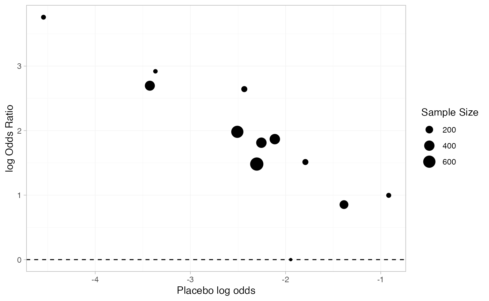
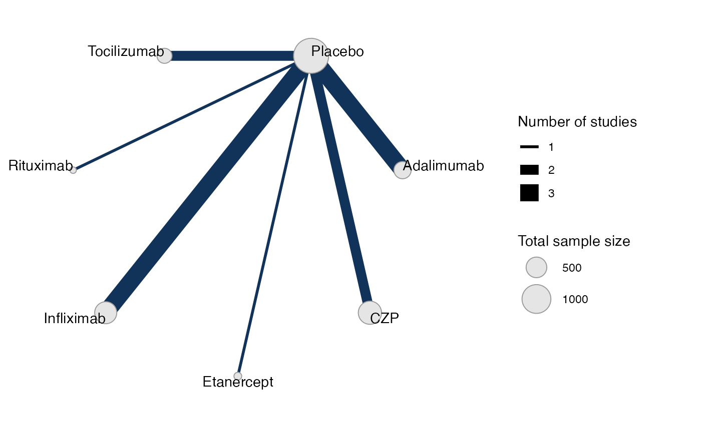
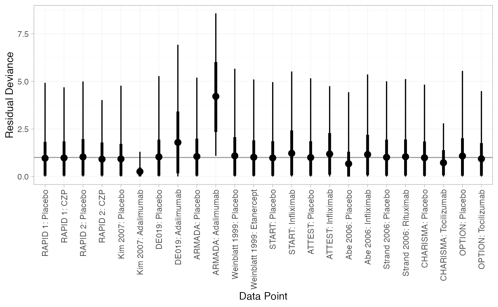
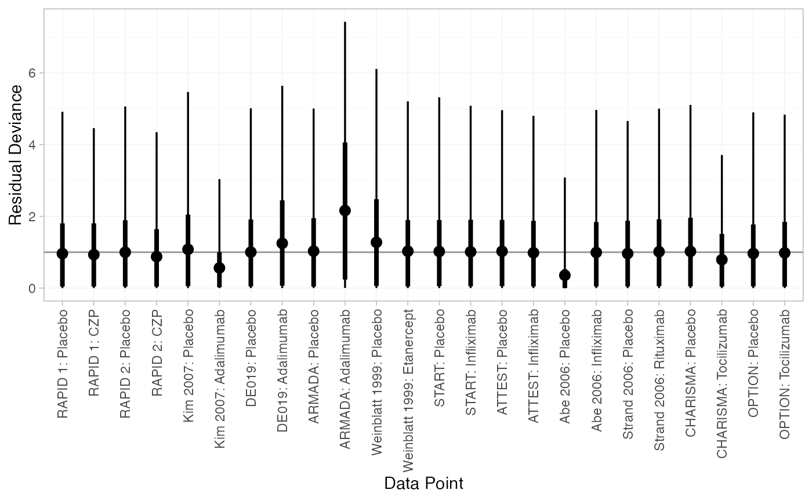
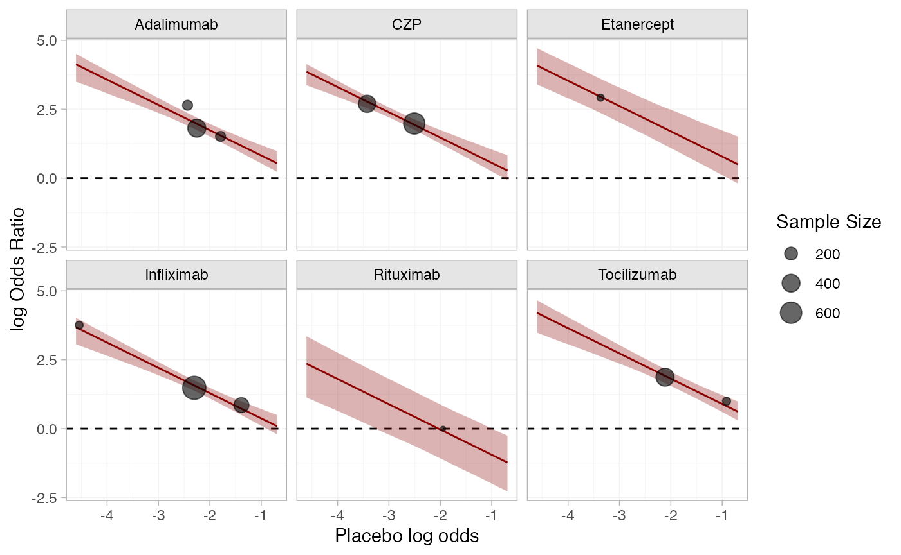
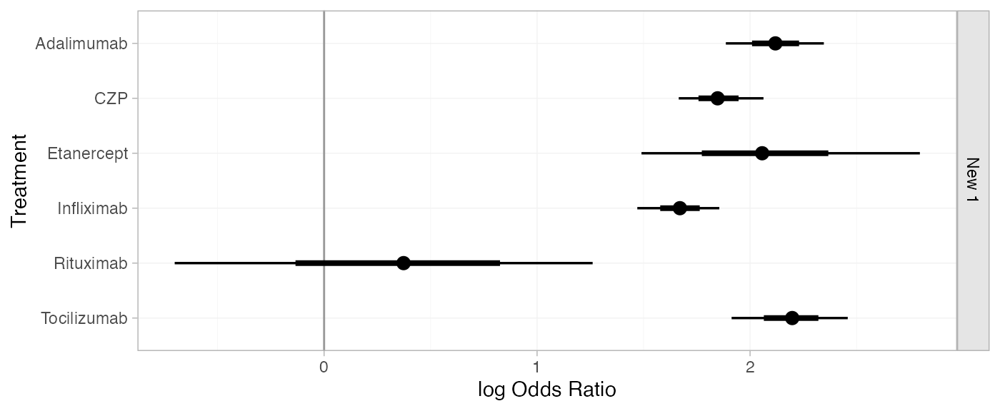
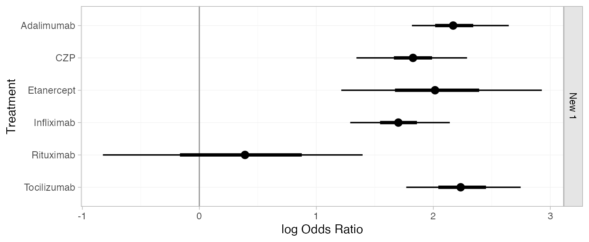
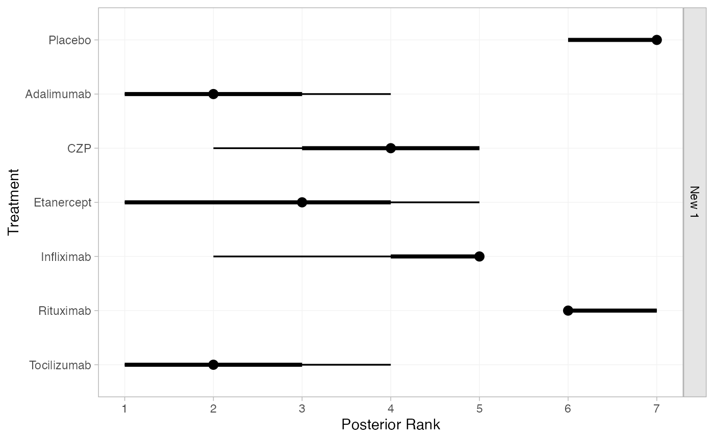
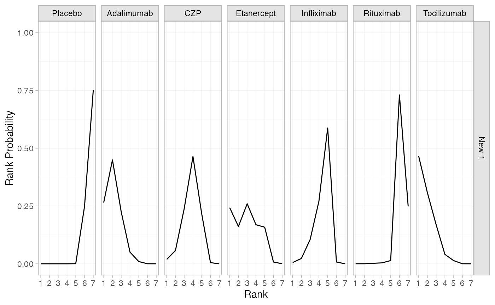
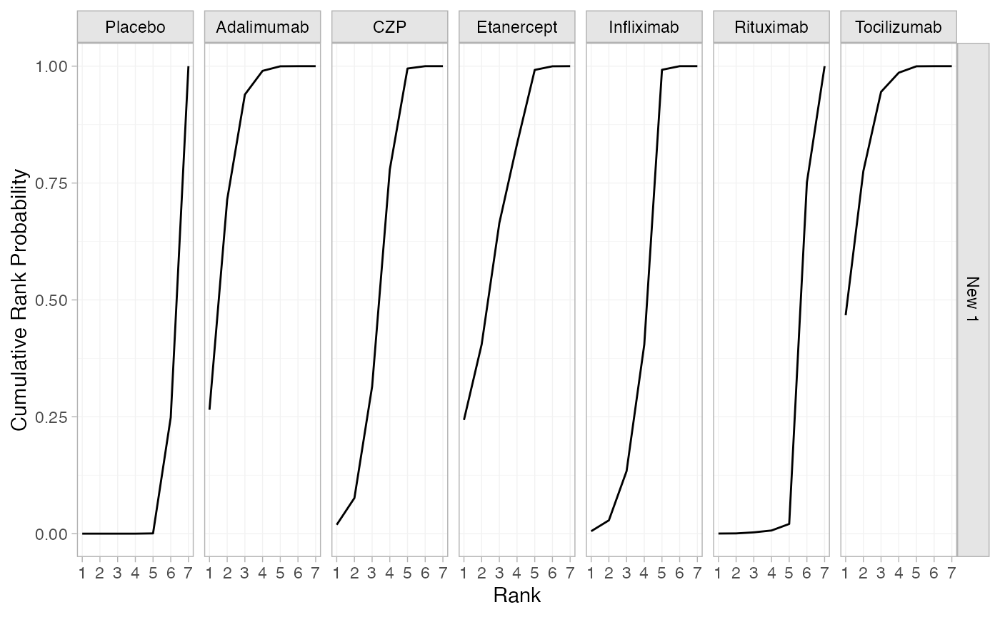

# Example: Certolizumab

``` r

library(multinma)
options(mc.cores = parallel::detectCores())
```

    #> For execution on a local, multicore CPU with excess RAM we recommend calling
    #> options(mc.cores = parallel::detectCores())
    #> 
    #> Attaching package: 'multinma'
    #> The following objects are masked from 'package:stats':
    #> 
    #>     dgamma, pgamma, qgamma

``` r

library(dplyr)
#> 
#> Attaching package: 'dplyr'
#> The following objects are masked from 'package:stats':
#> 
#>     filter, lag
#> The following objects are masked from 'package:base':
#> 
#>     intersect, setdiff, setequal, union
library(ggplot2)
```

This vignette describes the analysis of 12 trials comparing 6 treatments
against placebo for “the treatment of rheumatoid arthritis (RA) in
patients who had failed on disease-modifying anti-rheumatic drugs
(DMARDs)” ([Dias et al. 2011](#ref-TSD3)). The data are available in
this package as `certolizumab`:

``` r

head(certolizumab)
#>      study        trt   r   n disease_duration
#> 1  RAPID 1    Placebo  15 199             6.15
#> 2  RAPID 1        CZP 146 393             6.15
#> 3  RAPID 2    Placebo   4 127             5.85
#> 4  RAPID 2        CZP  80 246             5.85
#> 5 Kim 2007    Placebo   9  63             6.85
#> 6 Kim 2007 Adalimumab  28  65             6.85
```

Dias et al. ([2011](#ref-TSD3)) used this data to demonstrate baseline
risk meta-regression models. Plotting the baseline risk against the
treatment effect, we suspect there might be an effect of the baseline
risk on the treatment effect. Specifically, the log baseline odds
(placebo in this case) seem to be negatively linearly correlated with
the odds ratio. For purposes of plotting only, we apply a continuity
correction to the Abe 2006 study, in which no events were observed on
placebo.

``` r

certolizumab <-
  certolizumab %>%
  group_by(study) %>% 
  mutate(
    cc = any(r == 0),
    probability = if_else(cc, (r + 0.5) / (n + 0.5), r / n),
    odds = probability / (1 - probability),
    log_odds = log(odds)
  )

p_baseline_risk <-
  left_join(
    filter(certolizumab, trt != "Placebo"),
    filter(certolizumab, trt == "Placebo"),
    by = "study",
    suffix = c("", "_baseline")
  ) %>%
  mutate(log_odds_ratio = log_odds - log_odds_baseline, n_total = n + n_baseline) %>%
  ggplot(aes(log_odds_baseline)) +
  geom_hline(yintercept = 0, linetype = "dashed") +
  labs(x = "Placebo log odds", y = "log Odds Ratio", size = "Sample Size") +
  theme_multinma()

p_baseline_risk +
  geom_point(aes(y = log_odds_ratio, size = n_total))
```



## Setting up the network

We begin by setting up the network.

``` r

cert_net <- set_agd_arm(certolizumab,
                        study = study, trt = trt, n = n, r = r,
                        trt_class = if_else(trt == "Placebo", "Placebo", "Treatment"))
cert_net
#> A network with 12 AgD studies (arm-based).
#> 
#> ------------------------------------------------------- AgD studies (arm-based) ---- 
#>  Study    Treatment arms          
#>  Abe 2006 2: Placebo | Infliximab 
#>  ARMADA   2: Placebo | Adalimumab 
#>  ATTEST   2: Placebo | Infliximab 
#>  CHARISMA 2: Placebo | Tocilizumab
#>  DE019    2: Placebo | Adalimumab 
#>  Kim 2007 2: Placebo | Adalimumab 
#>  OPTION   2: Placebo | Tocilizumab
#>  RAPID 1  2: Placebo | CZP        
#>  RAPID 2  2: Placebo | CZP        
#>  START    2: Placebo | Infliximab 
#>  ... plus 2 more studies
#> 
#>  Outcome type: count
#> ------------------------------------------------------------------------------------
#> Total number of treatments: 7, in 2 classes
#> Total number of studies: 12
#> Reference treatment is: Placebo
#> Network is connected
```

Plot the network structure.

``` r

plot(cert_net, weight_edges = TRUE, weight_nodes = TRUE)
```



## Meta-analysis models

We fit both fixed effect (FE) and random effects (RE) models. The
special variable `.mu` is used in the `regression` formula to specify a
baseline risk meta-regression model.

### Fixed effect meta-analysis

``` r

cert_fit_FE <- nma(cert_net,
                   trt_effects = "fixed",
                   regression = ~.mu:.trt,
                   prior_intercept = normal(scale = sqrt(1000)),
                   prior_trt = normal(scale = 100),
                   prior_reg = normal(scale = 100),
                   adapt_delta = 0.95)
#> Note: Setting "Placebo" as the network reference treatment.
#> Warning: There were 1 divergent transitions after warmup. See
#> https://mc-stan.org/misc/warnings.html#divergent-transitions-after-warmup
#> to find out why this is a problem and how to eliminate them.
#> Warning: Examine the pairs() plot to diagnose sampling problems
```

We may see a few divergent transitions due to the zero on placebo in Abe
2006; increasing `adapt_delta` to 0.95 here helps to minimise these.

Basic parameter summaries are given by the
[`print()`](https://rdrr.io/r/base/print.html) method:

``` r

cert_fit_FE
#> A fixed effects NMA with a binomial likelihood (logit link).
#> Regression model: ~.mu:.trt.
#> Centred covariates at the following overall mean values:
#>      .mu 
#> -2.41557 
#> Inference for Stan model: binomial_1par.
#> 4 chains, each with iter=2000; warmup=1000; thin=1; 
#> post-warmup draws per chain=1000, total post-warmup draws=4000.
#> 
#>                                  mean se_mean   sd     2.5%      25%      50%      75%
#> beta[.mu:.trtclassTreatment]    -0.92    0.00 0.10    -1.04    -0.99    -0.95    -0.87
#> d[Adalimumab]                    2.12    0.00 0.12     1.89     2.04     2.12     2.20
#> d[CZP]                           1.85    0.00 0.10     1.67     1.78     1.85     1.92
#> d[Etanercept]                    2.08    0.01 0.35     1.49     1.86     2.06     2.28
#> d[Infliximab]                    1.67    0.00 0.10     1.47     1.60     1.67     1.74
#> d[Rituximab]                     0.35    0.01 0.50    -0.70     0.03     0.37     0.70
#> d[Tocilizumab]                   2.19    0.00 0.14     1.91     2.11     2.20     2.29
#> lp__                         -1708.58    0.08 3.11 -1715.60 -1710.47 -1708.26 -1706.34
#>                                 97.5% n_eff Rhat
#> beta[.mu:.trtclassTreatment]    -0.67   806    1
#> d[Adalimumab]                    2.35  4575    1
#> d[CZP]                           2.06  2001    1
#> d[Etanercept]                    2.80  1793    1
#> d[Infliximab]                    1.86  2966    1
#> d[Rituximab]                     1.26  4458    1
#> d[Tocilizumab]                   2.46  2652    1
#> lp__                         -1703.40  1629    1
#> 
#> Samples were drawn using NUTS(diag_e) at Fri Oct  9 11:35:15 2026.
#> For each parameter, n_eff is a crude measure of effective sample size,
#> and Rhat is the potential scale reduction factor on split chains (at 
#> convergence, Rhat=1).
```

### Random effects meta-analysis

``` r

cert_fit_RE <- nma(cert_net,
                   trt_effects = "random",
                   regression = ~.mu:.trt,
                   prior_intercept = normal(scale = sqrt(1000)),
                   prior_trt = normal(scale = 100),
                   prior_reg = normal(scale = 100),
                   prior_het = half_normal(2.5),
                   adapt_delta = 0.95)
#> Note: Setting "Placebo" as the network reference treatment.
#> Warning: There were 10 divergent transitions after warmup. See
#> https://mc-stan.org/misc/warnings.html#divergent-transitions-after-warmup
#> to find out why this is a problem and how to eliminate them.
#> Warning: Examine the pairs() plot to diagnose sampling problems
```

Basic parameter summaries are given by the
[`print()`](https://rdrr.io/r/base/print.html) method:

``` r

cert_fit_RE
#> A random effects NMA with a binomial likelihood (logit link).
#> Regression model: ~.mu:.trt.
#> Centred covariates at the following overall mean values:
#>      .mu 
#> -2.41557 
#> Inference for Stan model: binomial_1par.
#> 4 chains, each with iter=2000; warmup=1000; thin=1; 
#> post-warmup draws per chain=1000, total post-warmup draws=4000.
#> 
#>                                  mean se_mean   sd     2.5%      25%      50%      75%
#> beta[.mu:.trtclassTreatment]    -0.95    0.00 0.09    -1.10    -1.00    -0.98    -0.92
#> d[Adalimumab]                    2.18    0.00 0.21     1.82     2.06     2.17     2.29
#> d[CZP]                           1.82    0.01 0.23     1.34     1.72     1.83     1.94
#> d[Etanercept]                    2.03    0.01 0.43     1.21     1.77     2.01     2.28
#> d[Infliximab]                    1.70    0.00 0.21     1.29     1.60     1.70     1.81
#> d[Rituximab]                     0.36    0.01 0.56    -0.82     0.00     0.39     0.74
#> d[Tocilizumab]                   2.25    0.01 0.25     1.77     2.10     2.23     2.38
#> lp__                         -1714.63    0.15 4.63 -1724.52 -1717.59 -1714.37 -1711.31
#> tau                              0.22    0.01 0.18     0.01     0.10     0.18     0.29
#>                                 97.5% n_eff Rhat
#> beta[.mu:.trtclassTreatment]    -0.73  1024 1.00
#> d[Adalimumab]                    2.65  2019 1.00
#> d[CZP]                           2.29  1807 1.00
#> d[Etanercept]                    2.93  2621 1.00
#> d[Infliximab]                    2.14  2244 1.00
#> d[Rituximab]                     1.40  4240 1.00
#> d[Tocilizumab]                   2.75  2257 1.00
#> lp__                         -1706.62   941 1.00
#> tau                              0.67   609 1.01
#> 
#> Samples were drawn using NUTS(diag_e) at Fri Oct  9 11:35:18 2026.
#> For each parameter, n_eff is a crude measure of effective sample size,
#> and Rhat is the potential scale reduction factor on split chains (at 
#> convergence, Rhat=1).
```

### Model comparison

Model fit can be checked using the
[`dic()`](https://dmphillippo.github.io/multinma/dev/reference/dic.md)
function:

``` r

(dic_FE <- dic(cert_fit_FE))
#> Residual deviance: 27.2 (on 24 data points)
#>                pD: 18.9
#>               DIC: 46.1
(dic_RE <- dic(cert_fit_RE))
#> Residual deviance: 24.3 (on 24 data points)
#>                pD: 21.5
#>               DIC: 45.8
```

We can also examine the residual deviance contributions with the
corresponding [`plot()`](https://rdrr.io/r/graphics/plot.default.html)
method.

``` r

plot(dic_FE)
```



``` r

plot(dic_RE)
```



### Baseline risk meta-regression

Plotting the estimated baseline risk effect (fixed effect model)
together with the crude odds ratios.

``` r

cert_mu_reg <-
  cert_fit_FE %>%
  relative_effects(
    newdata = tibble(.mu = seq(log(0.01), log(0.5), length.out = 20)),
    study = .mu
  ) %>%
  as_tibble() %>%
  mutate(
    trt = .trtb,
    log_odds_baseline = as.numeric(as.character(.study))
  )

p_baseline_risk +
  facet_wrap(vars(trt)) +
  geom_ribbon(aes(ymin = `2.5%`, ymax = `97.5%`), data = cert_mu_reg,
              fill = "darkred", alpha = 0.3) +
  geom_line(aes(y = mean), data = cert_mu_reg,
            colour = "darkred") +
  geom_point(aes(y = log_odds_ratio, size = n_total), alpha = 0.6)
```



## Further results

For comparison with Dias et al. ([2011](#ref-TSD3)), we can produce
relative effects against placebo at the average observed log odds, using
the
[`relative_effects()`](https://dmphillippo.github.io/multinma/dev/reference/relative_effects.md)
function:

``` r

newdata <- data.frame(.mu = cert_fit_FE$xbar[[".mu"]])
(cert_releff_FE <- relative_effects(cert_fit_FE, newdata = newdata))
#> ------------------------------------------------------------------ Study: New 1 ---- 
#> 
#> Covariate values:
#>    .mu
#>  -2.42
#> 
#>                       mean   sd  2.5%  25%  50%  75% 97.5% Bulk_ESS Tail_ESS Rhat
#> d[New 1: Adalimumab]  2.12 0.12  1.89 2.04 2.12 2.20  2.35     4695     2830    1
#> d[New 1: CZP]         1.85 0.10  1.67 1.78 1.85 1.92  2.06     2134     1876    1
#> d[New 1: Etanercept]  2.08 0.35  1.49 1.86 2.06 2.28  2.80     2323     1388    1
#> d[New 1: Infliximab]  1.67 0.10  1.47 1.60 1.67 1.74  1.86     3052     2396    1
#> d[New 1: Rituximab]   0.35 0.50 -0.70 0.03 0.37 0.70  1.26     4794     2442    1
#> d[New 1: Tocilizumab] 2.19 0.14  1.91 2.11 2.20 2.29  2.46     2832     2071    1
plot(cert_releff_FE, ref_line = 0)
```



``` r

(cert_releff_RE <- relative_effects(cert_fit_RE, newdata = newdata))
#> ------------------------------------------------------------------ Study: New 1 ---- 
#> 
#> Covariate values:
#>    .mu
#>  -2.42
#> 
#>                       mean   sd  2.5%  25%  50%  75% 97.5% Bulk_ESS Tail_ESS Rhat
#> d[New 1: Adalimumab]  2.18 0.21  1.82 2.06 2.17 2.29  2.65     2376     1380 1.01
#> d[New 1: CZP]         1.82 0.23  1.34 1.72 1.83 1.94  2.29     2109     1563 1.00
#> d[New 1: Etanercept]  2.03 0.43  1.21 1.77 2.01 2.28  2.93     2859     1899 1.00
#> d[New 1: Infliximab]  1.70 0.21  1.29 1.60 1.70 1.81  2.14     2505     1856 1.00
#> d[New 1: Rituximab]   0.36 0.56 -0.82 0.00 0.39 0.74  1.40     4368     2624 1.00
#> d[New 1: Tocilizumab] 2.25 0.25  1.77 2.10 2.23 2.38  2.75     2676     1871 1.00
plot(cert_releff_RE, ref_line = 0)
```



Without providing `newdata`,
[`relative_effects()`](https://dmphillippo.github.io/multinma/dev/reference/relative_effects.md)
will produce relative effects per study. Note that the estimated
study-specific intercepts are used.

``` r

(cert_releff_study_RE <- relative_effects(cert_fit_RE))
#> --------------------------------------------------------------- Study: Abe 2006 ---- 
#> 
#> Covariate values:
#>    .mu
#>  -14.4
#> 
#>                           mean    sd 2.5%  25%  50%   75% 97.5% Bulk_ESS Tail_ESS Rhat
#> d[Abe 2006: Adalimumab]  13.96 12.40 2.96 5.46 9.37 18.10 49.43     1161     1655    1
#> d[Abe 2006: CZP]         13.60 12.38 2.71 5.09 9.04 17.75 49.24     1178     1700    1
#> d[Abe 2006: Etanercept]  13.80 12.36 2.92 5.32 9.17 17.89 49.08     1210     1634    1
#> d[Abe 2006: Infliximab]  13.48 12.39 2.45 5.01 8.87 17.57 48.97     1136     1641    1
#> d[Abe 2006: Rituximab]   12.13 12.42 1.01 3.64 7.59 16.31 47.33     1159     1692    1
#> d[Abe 2006: Tocilizumab] 14.02 12.41 2.92 5.47 9.46 18.17 49.47     1132     1700    1
#> 
#> ----------------------------------------------------------------- Study: ARMADA ---- 
#> 
#> Covariate values:
#>    .mu
#>  -2.47
#> 
#>                        mean   sd  2.5%   25%  50%  75% 97.5% Bulk_ESS Tail_ESS Rhat
#> d[ARMADA: Adalimumab]  2.24 0.52  1.34  1.88 2.20 2.58  3.35     3514     2619    1
#> d[ARMADA: CZP]         1.89 0.52  0.96  1.54 1.85 2.21  3.00     3842     2866    1
#> d[ARMADA: Etanercept]  2.09 0.62  0.95  1.68 2.08 2.47  3.33     4157     2781    1
#> d[ARMADA: Infliximab]  1.76 0.51  0.88  1.41 1.73 2.08  2.86     3548     2808    1
#> d[ARMADA: Rituximab]   0.42 0.74 -1.02 -0.06 0.42 0.89  1.88     4248     2395    1
#> d[ARMADA: Tocilizumab] 2.31 0.54  1.36  1.94 2.27 2.63  3.48     3280     2571    1
#> 
#> ----------------------------------------------------------------- Study: ATTEST ---- 
#> 
#> Covariate values:
#>   .mu
#>  -1.4
#> 
#>                         mean   sd  2.5%   25%   50%   75% 97.5% Bulk_ESS Tail_ESS Rhat
#> d[ATTEST: Adalimumab]   1.21 0.32  0.58  1.00  1.20  1.41  1.87     3425     1812    1
#> d[ATTEST: CZP]          0.85 0.35  0.18  0.62  0.86  1.08  1.56     2390     1880    1
#> d[ATTEST: Etanercept]   1.06 0.52  0.07  0.72  1.06  1.38  2.10     2763     1984    1
#> d[ATTEST: Infliximab]   0.73 0.33  0.08  0.52  0.74  0.94  1.37     2904     2384    1
#> d[ATTEST: Rituximab]   -0.61 0.61 -1.89 -0.99 -0.59 -0.20  0.53     4539     2693    1
#> d[ATTEST: Tocilizumab]  1.28 0.33  0.62  1.06  1.27  1.49  1.92     3944     2695    1
#> 
#> --------------------------------------------------------------- Study: CHARISMA ---- 
#> 
#> Covariate values:
#>    .mu
#>  -0.94
#> 
#>                           mean   sd  2.5%   25%   50%   75% 97.5% Bulk_ESS Tail_ESS Rhat
#> d[CHARISMA: Adalimumab]   0.77 0.39  0.01  0.51  0.77  1.01  1.56     3744     2079    1
#> d[CHARISMA: CZP]          0.42 0.43 -0.41  0.15  0.41  0.69  1.26     2571     1851    1
#> d[CHARISMA: Etanercept]   0.62 0.58 -0.52  0.25  0.61  0.98  1.79     2882     1999    1
#> d[CHARISMA: Infliximab]   0.29 0.40 -0.49  0.03  0.29  0.56  1.09     3606     2540    1
#> d[CHARISMA: Rituximab]   -1.05 0.64 -2.36 -1.46 -1.04 -0.62  0.15     4601     2715    1
#> d[CHARISMA: Tocilizumab]  0.84 0.40  0.03  0.57  0.83  1.09  1.68     4184     2607    1
#> 
#> ------------------------------------------------------------------ Study: DE019 ---- 
#> 
#> Covariate values:
#>    .mu
#>  -2.29
#> 
#>                       mean   sd  2.5%   25%  50%  75% 97.5% Bulk_ESS Tail_ESS Rhat
#> d[DE019: Adalimumab]  2.06 0.31  1.48  1.87 2.05 2.26  2.68     3422     2362    1
#> d[DE019: CZP]         1.71 0.34  1.03  1.50 1.71 1.92  2.34     2884     2088    1
#> d[DE019: Etanercept]  1.91 0.50  0.93  1.60 1.90 2.21  2.94     3039     2111    1
#> d[DE019: Infliximab]  1.58 0.31  0.98  1.39 1.58 1.78  2.20     3523     2676    1
#> d[DE019: Rituximab]   0.24 0.62 -1.04 -0.15 0.26 0.66  1.39     4607     2445    1
#> d[DE019: Tocilizumab] 2.13 0.33  1.49  1.91 2.12 2.34  2.81     3545     2273    1
#> 
#> --------------------------------------------------------------- Study: Kim 2007 ---- 
#> 
#> Covariate values:
#>    .mu
#>  -1.85
#> 
#>                           mean   sd  2.5%   25%   50%  75% 97.5% Bulk_ESS Tail_ESS Rhat
#> d[Kim 2007: Adalimumab]   1.64 0.43  0.87  1.34  1.63 1.91  2.51     4347     2139 1.01
#> d[Kim 2007: CZP]          1.28 0.44  0.45  0.99  1.28 1.57  2.18     3329     1685 1.00
#> d[Kim 2007: Etanercept]   1.49 0.59  0.32  1.11  1.47 1.86  2.68     3217     2459 1.00
#> d[Kim 2007: Infliximab]   1.16 0.42  0.36  0.88  1.15 1.43  2.02     4440     2829 1.00
#> d[Kim 2007: Rituximab]   -0.18 0.67 -1.53 -0.62 -0.18 0.27  1.11     5066     2697 1.00
#> d[Kim 2007: Tocilizumab]  1.71 0.44  0.89  1.41  1.69 1.99  2.61     4618     2505 1.00
#> 
#> ----------------------------------------------------------------- Study: OPTION ---- 
#> 
#> Covariate values:
#>    .mu
#>  -2.13
#> 
#>                        mean   sd  2.5%   25%  50%  75% 97.5% Bulk_ESS Tail_ESS Rhat
#> d[OPTION: Adalimumab]  1.91 0.29  1.37  1.72 1.90 2.09  2.52     3343     1845    1
#> d[OPTION: CZP]         1.56 0.32  0.92  1.36 1.56 1.75  2.17     2751     1596    1
#> d[OPTION: Etanercept]  1.76 0.48  0.82  1.46 1.75 2.05  2.75     2952     2089    1
#> d[OPTION: Infliximab]  1.43 0.30  0.84  1.25 1.43 1.62  2.04     3623     2256    1
#> d[OPTION: Rituximab]   0.09 0.60 -1.16 -0.30 0.10 0.50  1.20     4610     2551    1
#> d[OPTION: Tocilizumab] 1.98 0.33  1.33  1.78 1.97 2.18  2.63     3287     2065    1
#> 
#> ---------------------------------------------------------------- Study: RAPID 1 ---- 
#> 
#> Covariate values:
#>    .mu
#>  -2.54
#> 
#>                         mean   sd  2.5%  25%  50%  75% 97.5% Bulk_ESS Tail_ESS Rhat
#> d[RAPID 1: Adalimumab]  2.30 0.33  1.68 2.08 2.28 2.50  2.97     3618     2451    1
#> d[RAPID 1: CZP]         1.94 0.35  1.26 1.72 1.94 2.15  2.65     3361     2120    1
#> d[RAPID 1: Etanercept]  2.14 0.49  1.19 1.83 2.14 2.46  3.13     3263     1951    1
#> d[RAPID 1: Infliximab]  1.82 0.32  1.20 1.61 1.81 2.03  2.49     3921     2792    1
#> d[RAPID 1: Rituximab]   0.48 0.62 -0.76 0.09 0.50 0.90  1.65     4559     2551    1
#> d[RAPID 1: Tocilizumab] 2.36 0.36  1.71 2.13 2.34 2.58  3.12     3771     2423    1
#> 
#> ---------------------------------------------------------------- Study: RAPID 2 ---- 
#> 
#> Covariate values:
#>    .mu
#>  -3.54
#> 
#>                         mean   sd  2.5%  25%  50%  75% 97.5% Bulk_ESS Tail_ESS Rhat
#> d[RAPID 2: Adalimumab]  3.25 0.56  2.28 2.86 3.21 3.60  4.47     4286     2773    1
#> d[RAPID 2: CZP]         2.90 0.57  1.88 2.51 2.87 3.25  4.12     4281     2676    1
#> d[RAPID 2: Etanercept]  3.10 0.66  1.87 2.66 3.08 3.53  4.45     4234     3062    1
#> d[RAPID 2: Infliximab]  2.78 0.55  1.80 2.39 2.73 3.11  3.97     4856     2963    1
#> d[RAPID 2: Rituximab]   1.43 0.78 -0.09 0.91 1.43 1.94  3.05     4443     2743    1
#> d[RAPID 2: Tocilizumab] 3.32 0.59  2.29 2.91 3.28 3.70  4.56     3922     2960    1
#> 
#> ------------------------------------------------------------------ Study: START ---- 
#> 
#> Covariate values:
#>    .mu
#>  -2.32
#> 
#>                       mean   sd  2.5%   25%  50%  75% 97.5% Bulk_ESS Tail_ESS Rhat
#> d[START: Adalimumab]  2.09 0.27  1.60  1.91 2.08 2.26  2.67     3029     1852    1
#> d[START: CZP]         1.73 0.30  1.13  1.56 1.73 1.91  2.33     2564     1911    1
#> d[START: Etanercept]  1.94 0.46  1.03  1.66 1.92 2.22  2.88     2861     1951    1
#> d[START: Infliximab]  1.61 0.28  1.08  1.44 1.61 1.78  2.15     3301     2282    1
#> d[START: Rituximab]   0.27 0.59 -0.97 -0.09 0.29 0.65  1.36     4877     2520    1
#> d[START: Tocilizumab] 2.16 0.30  1.59  1.96 2.14 2.34  2.78     3366     2043    1
#> 
#> ------------------------------------------------------------ Study: Strand 2006 ---- 
#> 
#> Covariate values:
#>    .mu
#>  -2.03
#> 
#>                              mean   sd  2.5%   25%  50%  75% 97.5% Bulk_ESS Tail_ESS Rhat
#> d[Strand 2006: Adalimumab]   1.81 0.51  0.90  1.46 1.78 2.14  2.88     5158     2493    1
#> d[Strand 2006: CZP]          1.46 0.52  0.49  1.11 1.44 1.79  2.54     4526     2274    1
#> d[Strand 2006: Etanercept]   1.66 0.64  0.42  1.23 1.64 2.06  3.01     3697     2879    1
#> d[Strand 2006: Infliximab]   1.33 0.51  0.42  0.99 1.31 1.66  2.40     5087     2374    1
#> d[Strand 2006: Rituximab]   -0.01 0.73 -1.45 -0.49 0.00 0.48  1.43     4909     2983    1
#> d[Strand 2006: Tocilizumab]  1.88 0.52  0.95  1.52 1.85 2.19  3.00     4835     2579    1
#> 
#> --------------------------------------------------------- Study: Weinblatt 1999 ---- 
#> 
#> Covariate values:
#>    .mu
#>  -3.98
#> 
#>                                mean   sd  2.5%  25%  50%  75% 97.5% Bulk_ESS Tail_ESS Rhat
#> d[Weinblatt 1999: Adalimumab]  3.67 1.34  1.72 2.73 3.46 4.36  6.95     3387     1671    1
#> d[Weinblatt 1999: CZP]         3.32 1.35  1.31 2.37 3.09 4.03  6.53     3378     1602    1
#> d[Weinblatt 1999: Etanercept]  3.52 1.44  1.32 2.50 3.32 4.31  6.90     3201     1588    1
#> d[Weinblatt 1999: Infliximab]  3.19 1.35  1.21 2.26 2.97 3.91  6.43     3492     1623    1
#> d[Weinblatt 1999: Rituximab]   1.85 1.44 -0.49 0.86 1.66 2.66  5.27     3093     1727    1
#> d[Weinblatt 1999: Tocilizumab] 3.74 1.35  1.74 2.81 3.53 4.47  6.96     3136     1639    1
```

To produce predictions against a reference baseline risk distribution,
[`predict()`](https://rdrr.io/r/stats/predict.html) will use the `.mu`
values sampled from the `baseline` distribution, for example:

``` r

predict(cert_fit_RE, baseline = distr(qnorm, mean = cert_fit_RE$xbar[[".mu"]], sd = 0.5))
#> ------------------------------------------------------------------ Study: New 1 ---- 
#> 
#>                           mean   sd   2.5%    25%   50%   75% 97.5% Bulk_ESS Tail_ESS Rhat
#> pred[New 1: Placebo]     -2.42 0.51  -3.43  -2.76 -2.43 -2.08 -1.43     4032     3972    1
#> pred[New 1: Adalimumab]  -8.12 0.89  -9.65  -8.70 -8.20 -7.64 -6.11     1583     1428    1
#> pred[New 1: CZP]         -8.47 0.96 -10.13  -9.08 -8.55 -8.00 -6.25     1413     1289    1
#> pred[New 1: Etanercept]  -8.27 1.07 -10.14  -8.95 -8.37 -7.68 -5.76     1471     1299    1
#> pred[New 1: Infliximab]  -8.60 0.92 -10.21  -9.19 -8.67 -8.09 -6.54     1483     1497    1
#> pred[New 1: Rituximab]   -9.94 1.03 -11.83 -10.60 -9.99 -9.32 -7.73     1739     1653    1
#> pred[New 1: Tocilizumab] -8.05 0.87  -9.54  -8.61 -8.12 -7.57 -6.12     1617     1485    1
```

When not passing a `baseline` distribution, predictions will be produced
per study. The estimated study-specific intercepts are used in the
baseline risk meta-regression.

``` r

predict(cert_fit_RE)
#> --------------------------------------------------------------- Study: Abe 2006 ---- 
#> 
#>                               mean    sd   2.5%    25%    50%   75% 97.5% Bulk_ESS Tail_ESS
#> pred[Abe 2006: Placebo]     -14.40 12.37 -49.93 -18.44  -9.84 -5.92 -3.40     1202     1642
#> pred[Abe 2006: Adalimumab]  -14.52 12.43 -50.18 -18.68  -9.97 -6.05 -3.24     1118     1678
#> pred[Abe 2006: CZP]         -14.88 12.45 -50.41 -19.08 -10.30 -6.38 -3.50     1114     1641
#> pred[Abe 2006: Etanercept]  -14.67 12.48 -50.50 -18.84 -10.14 -6.20 -3.08     1109     1645
#> pred[Abe 2006: Infliximab]  -15.00 12.43 -50.47 -19.05 -10.47 -6.49 -3.76     1137     1664
#> pred[Abe 2006: Rituximab]   -16.34 12.44 -52.00 -20.45 -11.87 -7.93 -4.99     1160     1641
#> pred[Abe 2006: Tocilizumab] -14.46 12.42 -49.90 -18.55  -9.92 -5.97 -3.25     1144     1642
#>                             Rhat
#> pred[Abe 2006: Placebo]        1
#> pred[Abe 2006: Adalimumab]     1
#> pred[Abe 2006: CZP]            1
#> pred[Abe 2006: Etanercept]     1
#> pred[Abe 2006: Infliximab]     1
#> pred[Abe 2006: Rituximab]      1
#> pred[Abe 2006: Tocilizumab]    1
#> 
#> ----------------------------------------------------------------- Study: ARMADA ---- 
#> 
#>                            mean   sd  2.5%   25%   50%   75% 97.5% Bulk_ESS Tail_ESS Rhat
#> pred[ARMADA: Placebo]     -2.47 0.49 -3.54 -2.78 -2.43 -2.13 -1.63     4156     2831    1
#> pred[ARMADA: Adalimumab]  -2.60 0.59 -3.84 -2.97 -2.57 -2.20 -1.50     2319     2066    1
#> pred[ARMADA: CZP]         -2.95 0.64 -4.25 -3.35 -2.94 -2.52 -1.74     1909     1882    1
#> pred[ARMADA: Etanercept]  -2.75 0.76 -4.23 -3.24 -2.75 -2.27 -1.20     1933     1529    1
#> pred[ARMADA: Infliximab]  -3.08 0.61 -4.36 -3.46 -3.05 -2.67 -1.93     2320     2304    1
#> pred[ARMADA: Rituximab]   -4.42 0.79 -6.04 -4.93 -4.39 -3.88 -2.96     3077     2765    1
#> pred[ARMADA: Tocilizumab] -2.53 0.59 -3.76 -2.90 -2.50 -2.13 -1.47     2622     2632    1
#> 
#> ----------------------------------------------------------------- Study: ATTEST ---- 
#> 
#>                            mean   sd  2.5%   25%   50%   75% 97.5% Bulk_ESS Tail_ESS Rhat
#> pred[ATTEST: Placebo]     -1.40 0.24 -1.89 -1.56 -1.39 -1.23 -0.94     6349     2833 1.00
#> pred[ATTEST: Adalimumab]  -1.52 0.37 -2.21 -1.76 -1.53 -1.29 -0.78     2457     1743 1.01
#> pred[ATTEST: CZP]         -1.88 0.42 -2.70 -2.14 -1.90 -1.63 -0.99     1748     1492 1.00
#> pred[ATTEST: Etanercept]  -1.68 0.58 -2.82 -2.03 -1.69 -1.33 -0.44     2021     1926 1.00
#> pred[ATTEST: Infliximab]  -2.00 0.39 -2.78 -2.24 -2.00 -1.76 -1.23     2190     1853 1.00
#> pred[ATTEST: Rituximab]   -3.34 0.64 -4.63 -3.75 -3.33 -2.91 -2.11     3851     2666 1.00
#> pred[ATTEST: Tocilizumab] -1.46 0.38 -2.20 -1.71 -1.46 -1.22 -0.73     2831     2081 1.00
#> 
#> --------------------------------------------------------------- Study: CHARISMA ---- 
#> 
#>                              mean   sd  2.5%   25%   50%   75% 97.5% Bulk_ESS Tail_ESS Rhat
#> pred[CHARISMA: Placebo]     -0.94 0.32 -1.61 -1.15 -0.93 -0.71 -0.34     7025     2794    1
#> pred[CHARISMA: Adalimumab]  -1.06 0.43 -1.88 -1.35 -1.07 -0.78 -0.21     2685     1890    1
#> pred[CHARISMA: CZP]         -1.42 0.47 -2.36 -1.73 -1.43 -1.12 -0.42     1997     1732    1
#> pred[CHARISMA: Etanercept]  -1.22 0.61 -2.38 -1.61 -1.24 -0.83  0.05     2124     2085    1
#> pred[CHARISMA: Infliximab]  -1.54 0.44 -2.43 -1.82 -1.54 -1.25 -0.70     2316     2205    1
#> pred[CHARISMA: Rituximab]   -2.89 0.67 -4.30 -3.32 -2.87 -2.43 -1.59     3861     2912    1
#> pred[CHARISMA: Tocilizumab] -1.00 0.42 -1.84 -1.28 -1.01 -0.72 -0.19     2998     2133    1
#> 
#> ------------------------------------------------------------------ Study: DE019 ---- 
#> 
#>                           mean   sd  2.5%   25%   50%   75% 97.5% Bulk_ESS Tail_ESS Rhat
#> pred[DE019: Placebo]     -2.29 0.24 -2.78 -2.45 -2.29 -2.13 -1.84     5959     2580    1
#> pred[DE019: Adalimumab]  -2.42 0.36 -3.11 -2.65 -2.42 -2.20 -1.68     2651     1764    1
#> pred[DE019: CZP]         -2.77 0.41 -3.61 -3.03 -2.79 -2.53 -1.93     1849     1378    1
#> pred[DE019: Etanercept]  -2.57 0.57 -3.68 -2.92 -2.59 -2.23 -1.39     2177     1803    1
#> pred[DE019: Infliximab]  -2.90 0.38 -3.65 -3.13 -2.90 -2.65 -2.15     2286     2211    1
#> pred[DE019: Rituximab]   -4.24 0.62 -5.54 -4.63 -4.22 -3.82 -3.07     3958     2643    1
#> pred[DE019: Tocilizumab] -2.35 0.37 -3.04 -2.59 -2.36 -2.12 -1.59     3432     1906    1
#> 
#> --------------------------------------------------------------- Study: Kim 2007 ---- 
#> 
#>                              mean   sd  2.5%   25%   50%   75% 97.5% Bulk_ESS Tail_ESS Rhat
#> pred[Kim 2007: Placebo]     -1.85 0.38 -2.64 -2.10 -1.84 -1.59 -1.16     6913     2988    1
#> pred[Kim 2007: Adalimumab]  -1.98 0.46 -2.89 -2.27 -1.97 -1.68 -1.10     3758     2289    1
#> pred[Kim 2007: CZP]         -2.33 0.50 -3.33 -2.65 -2.33 -2.00 -1.38     2617     2357    1
#> pred[Kim 2007: Etanercept]  -2.13 0.63 -3.38 -2.53 -2.13 -1.75 -0.82     2616     2083    1
#> pred[Kim 2007: Infliximab]  -2.46 0.48 -3.43 -2.76 -2.44 -2.14 -1.51     3227     2720    1
#> pred[Kim 2007: Rituximab]   -3.80 0.69 -5.26 -4.24 -3.78 -3.33 -2.47     4418     2807    1
#> pred[Kim 2007: Tocilizumab] -1.91 0.46 -2.83 -2.21 -1.90 -1.60 -1.03     4004     3133    1
#> 
#> ----------------------------------------------------------------- Study: OPTION ---- 
#> 
#>                            mean   sd  2.5%   25%   50%   75% 97.5% Bulk_ESS Tail_ESS Rhat
#> pred[OPTION: Placebo]     -2.13 0.22 -2.58 -2.28 -2.13 -1.98 -1.72     6427     2614    1
#> pred[OPTION: Adalimumab]  -2.26 0.36 -2.93 -2.49 -2.26 -2.05 -1.51     2515     1651    1
#> pred[OPTION: CZP]         -2.61 0.41 -3.40 -2.87 -2.63 -2.38 -1.76     1808     1483    1
#> pred[OPTION: Etanercept]  -2.41 0.57 -3.53 -2.76 -2.43 -2.07 -1.21     2126     1982    1
#> pred[OPTION: Infliximab]  -2.74 0.38 -3.49 -2.96 -2.74 -2.51 -1.98     2119     2066    1
#> pred[OPTION: Rituximab]   -4.08 0.63 -5.38 -4.48 -4.06 -3.66 -2.88     3782     2601    1
#> pred[OPTION: Tocilizumab] -2.19 0.36 -2.89 -2.42 -2.19 -1.97 -1.51     3064     2322    1
#> 
#> ---------------------------------------------------------------- Study: RAPID 1 ---- 
#> 
#>                             mean   sd  2.5%   25%   50%   75% 97.5% Bulk_ESS Tail_ESS Rhat
#> pred[RAPID 1: Placebo]     -2.54 0.27 -3.09 -2.71 -2.53 -2.36 -2.04     6226     2580    1
#> pred[RAPID 1: Adalimumab]  -2.66 0.39 -3.42 -2.91 -2.66 -2.42 -1.85     2763     1594    1
#> pred[RAPID 1: CZP]         -3.02 0.43 -3.89 -3.28 -3.01 -2.75 -2.13     1993     1680    1
#> pred[RAPID 1: Etanercept]  -2.82 0.59 -3.95 -3.19 -2.83 -2.45 -1.62     2282     1865    1
#> pred[RAPID 1: Infliximab]  -3.14 0.41 -4.00 -3.39 -3.13 -2.88 -2.35     2457     2257    1
#> pred[RAPID 1: Rituximab]   -4.48 0.65 -5.82 -4.90 -4.47 -4.06 -3.20     3939     2811    1
#> pred[RAPID 1: Tocilizumab] -2.60 0.39 -3.37 -2.84 -2.59 -2.35 -1.84     3233     2511    1
#> 
#> ---------------------------------------------------------------- Study: RAPID 2 ---- 
#> 
#>                             mean   sd  2.5%   25%   50%   75% 97.5% Bulk_ESS Tail_ESS Rhat
#> pred[RAPID 2: Placebo]     -3.54 0.53 -4.66 -3.87 -3.49 -3.18 -2.63     6131     2771    1
#> pred[RAPID 2: Adalimumab]  -3.67 0.60 -4.91 -4.04 -3.63 -3.25 -2.56     3866     2432    1
#> pred[RAPID 2: CZP]         -4.02 0.63 -5.35 -4.42 -3.99 -3.60 -2.87     2886     2257    1
#> pred[RAPID 2: Etanercept]  -3.82 0.75 -5.32 -4.32 -3.81 -3.35 -2.31     2785     2413    1
#> pred[RAPID 2: Infliximab]  -4.14 0.61 -5.43 -4.53 -4.12 -3.73 -2.97     3531     2697    1
#> pred[RAPID 2: Rituximab]   -5.49 0.78 -7.11 -6.00 -5.46 -4.96 -4.03     4400     2972    1
#> pred[RAPID 2: Tocilizumab] -3.60 0.60 -4.86 -3.97 -3.57 -3.20 -2.49     4172     2869    1
#> 
#> ------------------------------------------------------------------ Study: START ---- 
#> 
#>                           mean   sd  2.5%   25%   50%   75% 97.5% Bulk_ESS Tail_ESS Rhat
#> pred[START: Placebo]     -2.32 0.19 -2.69 -2.44 -2.32 -2.20 -1.97     6398     2849    1
#> pred[START: Adalimumab]  -2.45 0.33 -3.08 -2.66 -2.46 -2.25 -1.75     2392     1583    1
#> pred[START: CZP]         -2.80 0.39 -3.52 -3.04 -2.82 -2.58 -1.99     1757     1441    1
#> pred[START: Etanercept]  -2.60 0.56 -3.68 -2.95 -2.62 -2.27 -1.41     2090     2001    1
#> pred[START: Infliximab]  -2.93 0.35 -3.64 -3.14 -2.93 -2.72 -2.21     1975     1665    1
#> pred[START: Rituximab]   -4.27 0.62 -5.53 -4.67 -4.25 -3.85 -3.07     3555     2367    1
#> pred[START: Tocilizumab] -2.38 0.34 -3.03 -2.60 -2.38 -2.18 -1.68     2707     2147    1
#> 
#> ------------------------------------------------------------ Study: Strand 2006 ---- 
#> 
#>                                 mean   sd  2.5%   25%   50%   75% 97.5% Bulk_ESS Tail_ESS Rhat
#> pred[Strand 2006: Placebo]     -2.03 0.48 -3.04 -2.34 -2.01 -1.69 -1.18     6965     2251    1
#> pred[Strand 2006: Adalimumab]  -2.15 0.56 -3.29 -2.50 -2.14 -1.79 -1.10     3267     2091    1
#> pred[Strand 2006: CZP]         -2.51 0.61 -3.78 -2.89 -2.48 -2.11 -1.35     2472     1839    1
#> pred[Strand 2006: Etanercept]  -2.31 0.71 -3.71 -2.77 -2.31 -1.84 -0.89     2528     2003    1
#> pred[Strand 2006: Infliximab]  -2.63 0.57 -3.81 -3.00 -2.62 -2.24 -1.55     3028     2313    1
#> pred[Strand 2006: Rituximab]   -3.97 0.75 -5.58 -4.46 -3.96 -3.44 -2.59     4285     2516    1
#> pred[Strand 2006: Tocilizumab] -2.09 0.57 -3.28 -2.45 -2.06 -1.71 -1.04     3806     2244    1
#> 
#> --------------------------------------------------------- Study: Weinblatt 1999 ---- 
#> 
#>                                    mean   sd  2.5%   25%   50%   75% 97.5% Bulk_ESS Tail_ESS
#> pred[Weinblatt 1999: Placebo]     -3.98 1.37 -7.25 -4.72 -3.76 -3.00 -1.96     3436     1555
#> pred[Weinblatt 1999: Adalimumab]  -4.10 1.41 -7.48 -4.85 -3.87 -3.10 -1.99     2892     1516
#> pred[Weinblatt 1999: CZP]         -4.46 1.42 -7.78 -5.25 -4.25 -3.46 -2.26     2679     1629
#> pred[Weinblatt 1999: Etanercept]  -4.26 1.41 -7.67 -5.00 -4.04 -3.26 -2.14     2931     1708
#> pred[Weinblatt 1999: Infliximab]  -4.58 1.41 -7.95 -5.32 -4.37 -3.60 -2.45     2847     1544
#> pred[Weinblatt 1999: Rituximab]   -5.92 1.50 -9.40 -6.75 -5.72 -4.89 -3.51     3072     1673
#> pred[Weinblatt 1999: Tocilizumab] -4.04 1.42 -7.43 -4.78 -3.82 -3.04 -1.90     3184     1632
#>                                   Rhat
#> pred[Weinblatt 1999: Placebo]        1
#> pred[Weinblatt 1999: Adalimumab]     1
#> pred[Weinblatt 1999: CZP]            1
#> pred[Weinblatt 1999: Etanercept]     1
#> pred[Weinblatt 1999: Infliximab]     1
#> pred[Weinblatt 1999: Rituximab]      1
#> pred[Weinblatt 1999: Tocilizumab]    1
```

We can also produce treatment rankings, rank probabilities, and
cumulative rank probabilities.

``` r

(cert_ranks <- posterior_ranks(cert_fit_RE, newdata = newdata,
                               lower_better = FALSE))
#> ------------------------------------------------------------------ Study: New 1 ---- 
#> 
#> Covariate values:
#>    .mu
#>  -2.42
#> 
#>                          mean   sd 2.5% 25% 50% 75% 97.5% Bulk_ESS Tail_ESS Rhat
#> rank[New 1: Placebo]     6.75 0.43    6   7   7   7     7     3469       NA    1
#> rank[New 1: Adalimumab]  2.09 0.88    1   1   2   3     4     2569     2522    1
#> rank[New 1: CZP]         3.82 0.92    2   3   4   4     5     2461     1870    1
#> rank[New 1: Etanercept]  2.86 1.41    1   2   3   4     5     3146     2293    1
#> rank[New 1: Infliximab]  4.44 0.82    2   4   5   5     5     2399     2404    1
#> rank[New 1: Rituximab]   6.22 0.51    6   6   6   6     7     3156       NA    1
#> rank[New 1: Tocilizumab] 1.83 0.95    1   1   2   2     4     2662     2381    1
plot(cert_ranks)
```



``` r

(cert_rankprobs <- posterior_rank_probs(cert_fit_RE, newdata = newdata,
                                        lower_better = FALSE))
#> ------------------------------------------------------------------ Study: New 1 ---- 
#> 
#> Covariate values:
#>    .mu
#>  -2.42
#> 
#>                       p_rank[1] p_rank[2] p_rank[3] p_rank[4] p_rank[5] p_rank[6] p_rank[7]
#> d[New 1: Placebo]          0.00      0.00      0.00      0.00      0.00      0.25      0.75
#> d[New 1: Adalimumab]       0.26      0.45      0.22      0.05      0.01      0.00      0.00
#> d[New 1: CZP]              0.02      0.06      0.24      0.46      0.22      0.00      0.00
#> d[New 1: Etanercept]       0.24      0.16      0.26      0.17      0.16      0.01      0.00
#> d[New 1: Infliximab]       0.01      0.02      0.11      0.27      0.59      0.01      0.00
#> d[New 1: Rituximab]        0.00      0.00      0.00      0.00      0.01      0.73      0.25
#> d[New 1: Tocilizumab]      0.47      0.31      0.17      0.04      0.01      0.00      0.00
plot(cert_rankprobs)
```



``` r

(cert_cumrankprobs <- posterior_rank_probs(cert_fit_RE, cumulative = TRUE,
                                           newdata = newdata, lower_better = FALSE))
#> ------------------------------------------------------------------ Study: New 1 ---- 
#> 
#> Covariate values:
#>    .mu
#>  -2.42
#> 
#>                       p_rank[1] p_rank[2] p_rank[3] p_rank[4] p_rank[5] p_rank[6] p_rank[7]
#> d[New 1: Placebo]          0.00      0.00      0.00      0.00      0.00      0.25         1
#> d[New 1: Adalimumab]       0.26      0.71      0.94      0.99      1.00      1.00         1
#> d[New 1: CZP]              0.02      0.08      0.31      0.78      0.99      1.00         1
#> d[New 1: Etanercept]       0.24      0.40      0.66      0.83      0.99      1.00         1
#> d[New 1: Infliximab]       0.01      0.03      0.13      0.40      0.99      1.00         1
#> d[New 1: Rituximab]        0.00      0.00      0.00      0.01      0.02      0.75         1
#> d[New 1: Tocilizumab]      0.47      0.78      0.95      0.99      1.00      1.00         1
plot(cert_cumrankprobs)
```



It is also possible to combine baseline risk meta-regression with
regular meta-regression. For example, we can add `disease_duration` to
the regression formula.

``` r

nma(cert_net,
    trt_effects = "fixed",
    regression = ~(disease_duration + .mu):.trt,
    prior_intercept = normal(scale = sqrt(1000)),
    prior_trt = normal(scale = 100),
    prior_reg = normal(scale = 100),
    adapt_delta = 0.95)
#> Note: Setting "Placebo" as the network reference treatment.
#> Warning: There were 1 divergent transitions after warmup. See
#> https://mc-stan.org/misc/warnings.html#divergent-transitions-after-warmup
#> to find out why this is a problem and how to eliminate them.
#> Warning: Examine the pairs() plot to diagnose sampling problems
#> A fixed effects NMA with a binomial likelihood (logit link).
#> Regression model: ~(disease_duration + .mu):.trt.
#> Centred covariates at the following overall mean values:
#> disease_duration              .mu 
#>         8.209583        -2.415570 
#> Inference for Stan model: binomial_1par.
#> 4 chains, each with iter=2000; warmup=1000; thin=1; 
#> post-warmup draws per chain=1000, total post-warmup draws=4000.
#> 
#>                                               mean se_mean   sd     2.5%      25%      50%
#> beta[disease_duration:.trtclassTreatment]    -0.01    0.00 0.04    -0.09    -0.04    -0.01
#> beta[.trtclassTreatment:.mu]                 -0.93    0.00 0.10    -1.04    -1.00    -0.97
#> d[Adalimumab]                                 2.15    0.00 0.14     1.86     2.06     2.16
#> d[CZP]                                        1.82    0.00 0.14     1.55     1.72     1.81
#> d[Etanercept]                                 2.12    0.01 0.35     1.45     1.89     2.12
#> d[Infliximab]                                 1.67    0.00 0.10     1.48     1.61     1.67
#> d[Rituximab]                                  0.40    0.01 0.51    -0.69     0.08     0.42
#> d[Tocilizumab]                                2.18    0.00 0.15     1.88     2.08     2.17
#> lp__                                      -1709.05    0.07 3.12 -1716.06 -1710.87 -1708.73
#>                                                75%    97.5% n_eff Rhat
#> beta[disease_duration:.trtclassTreatment]     0.01     0.07  1493    1
#> beta[.trtclassTreatment:.mu]                 -0.90    -0.66   676    1
#> d[Adalimumab]                                 2.25     2.42  1831    1
#> d[CZP]                                        1.91     2.13  1277    1
#> d[Etanercept]                                 2.34     2.81  2458    1
#> d[Infliximab]                                 1.73     1.85  2169    1
#> d[Rituximab]                                  0.75     1.35  3364    1
#> d[Tocilizumab]                                2.28     2.46  2786    1
#> lp__                                      -1706.87 -1703.94  1892    1
#> 
#> Samples were drawn using NUTS(diag_e) at Fri Oct  9 11:35:28 2026.
#> For each parameter, n_eff is a crude measure of effective sample size,
#> and Rhat is the potential scale reduction factor on split chains (at 
#> convergence, Rhat=1).
```

## References

Dias, S., A. J. Sutton, N. J. Welton, and A. E. Ades. 2011. *NICE DSU
Technical Support Document 3: Heterogeneity: Subgroups, Meta-Regression,
Bias and Bias-Adjustment*. National Institute for Health and Care
Excellence. <https://sheffield.ac.uk/nice-dsu>.
