# Example: Plaque psoriasis HTA report

``` r

library(multinma)
options(mc.cores = parallel::detectCores())
```

    #> For execution on a local, multicore CPU with excess RAM we recommend calling
    #> options(mc.cores = parallel::detectCores())
    #> 
    #> Attaching package: 'multinma'
    #> The following objects are masked from 'package:stats':
    #> 
    #>     dgamma, pgamma, qgamma

This vignette describes the analysis of treatments for
moderate-to-severe plaque psoriasis from an HTA report ([Woolacott et
al. 2006](#ref-Woolacott2006)), replicating the analysis in NICE
Technical Support Document 2 ([Dias et al. 2011](#ref-TSD2)). The data
are available in this package as `hta_psoriasis`:

``` r

head(hta_psoriasis)
#>   studyn   studyc year trtn             trtc sample_size PASI50 PASI75 PASI90
#> 1      1  Elewski 2004    1  Supportive care         193     12      5      1
#> 2      1  Elewski 2004    2 Etanercept 25 mg         196     59     46     21
#> 3      1  Elewski 2004    3 Etanercept 50 mg         194     54     56     40
#> 4      2 Gottlieb 2003    1  Supportive care          55      5      1      0
#> 5      2 Gottlieb 2003    2 Etanercept 25 mg          57     23     11      6
#> 6      3  Lebwohl 2003    1  Supportive care         122     13      5      1
```

Outcomes are ordered multinomial success/failure to achieve 50%, 75%, or
90% reduction in symptoms on the Psoriasis Area and Severity Index
(PASI) scale. Some studies report ordered outcomes at all three
cutpoints, others only one or two:

``` r

dplyr::filter(hta_psoriasis, studyc %in% c("Elewski", "Gordon", "ACD2058g", "Altmeyer"))
#>   studyn   studyc year trtn             trtc sample_size PASI50 PASI75 PASI90
#> 1      1  Elewski 2004    1  Supportive care         193     12      5      1
#> 2      1  Elewski 2004    2 Etanercept 25 mg         196     59     46     21
#> 3      1  Elewski 2004    3 Etanercept 50 mg         194     54     56     40
#> 4      5   Gordon 2003    1  Supportive care         187     18      8     NA
#> 5      5   Gordon 2003    4       Efalizumab         369    118     98     NA
#> 6      6 ACD2058g 2004    1  Supportive care         170     25     NA     NA
#> 7      6 ACD2058g 2004    4       Efalizumab         162     99     NA     NA
#> 8     10 Altmeyer 1994    1  Supportive care          51     NA      1     NA
#> 9     10 Altmeyer 1994    6         Fumaderm          49     NA     12     NA
```

Here, the outcome counts are given as “exclusive” counts. That is, for a
study reporting all outcomes (e.g. Elewski), the counts represent the
categories 50 \< PASI \< 75, 75 \< PASI \< 90, and 90 \< PASI \< 100,
and the corresponding columns are named by the lower end of the
interval. Missing values are used where studies only report a subset of
the outcomes. For a study reporting only two outcomes, say PASI50 and
PASI75 as in Gordon, the counts represent the categories 50 \< PASI \<
75 and 75 \< PASI \< 100. For a study reporting only one outcome, say
PASI70 as in Altmeyer, the count represents 70 \< PASI \< 100. We also
need the count for the lowest category (i.e. no higher outcomes
achieved), which is equal to the sample size minus the counts in the
other observed categories.

## Setting up the network

We begin by setting up the network. We have arm-level ordered
multinomial count data, so we use the function
[`set_agd_arm()`](https://dmphillippo.github.io/multinma/dev/reference/set_agd_arm.md).
The function
[`multi()`](https://dmphillippo.github.io/multinma/dev/reference/multi.md)
helps us to specify the ordered outcomes correctly.

``` r

pso_net <- set_agd_arm(hta_psoriasis, 
                       study = paste(studyc, year), 
                       trt = trtc, 
                       r = multi(r0 = sample_size - rowSums(cbind(PASI50, PASI75, PASI90), na.rm = TRUE), 
                                 PASI50, PASI75, PASI90,
                                 inclusive = FALSE, 
                                 type = "ordered"))
pso_net
#> A network with 16 AgD studies (arm-based).
#> 
#> ------------------------------------------------------- AgD studies (arm-based) ---- 
#>  Study         Treatment arms                                          
#>  ACD2058g 2004 2: Supportive care | Efalizumab                         
#>  ACD2600g 2004 2: Supportive care | Efalizumab                         
#>  Altmeyer 1994 2: Supportive care | Fumaderm                           
#>  Chaudari 2001 2: Supportive care | Infliximab                         
#>  Elewski 2004  3: Supportive care | Etanercept 25 mg | Etanercept 50 mg
#>  Ellis 1991    3: Supportive care | Ciclosporin | Ciclosporin          
#>  Gordon 2003   2: Supportive care | Efalizumab                         
#>  Gottlieb 2003 2: Supportive care | Etanercept 25 mg                   
#>  Gottlieb 2004 3: Supportive care | Infliximab | Infliximab            
#>  Guenther 1991 2: Supportive care | Ciclosporin                        
#>  ... plus 6 more studies
#> 
#>  Outcome type: ordered (4 categories)
#> ------------------------------------------------------------------------------------
#> Total number of treatments: 8
#> Total number of studies: 16
#> Reference treatment is: Supportive care
#> Network is connected
```

Plot the network structure.

``` r

plot(pso_net, weight_edges = TRUE, weight_nodes = TRUE) + 
  # Nudge the legend over
  ggplot2::theme(legend.box.spacing = ggplot2::unit(0.75, "in"),
                 plot.margin = ggplot2::margin(0.1, 0, 0.1, 0.75, "in"))
```

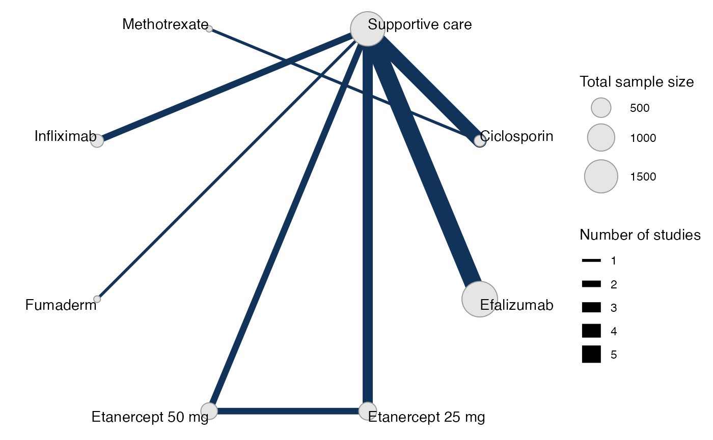

## Meta-analysis models

We fit both fixed effect (FE) and random effects (RE) models.

### Fixed effect meta-analysis

First, we fit a fixed effect model using the
[`nma()`](https://dmphillippo.github.io/multinma/dev/reference/nma.md)
function with `trt_effects = "fixed"`, using a probit link function
`link = "probit"`. We use \mathrm{N}(0, 10^2) prior distributions for
the treatment effects d_k, and \mathrm{N}(0, 100^2) prior distributions
for the study-specific intercepts \mu_j. We can examine the range of
parameter values implied by these prior distributions with the
[`summary()`](https://rdrr.io/r/base/summary.html) method:

``` r

summary(normal(scale = 10))
#> A Normal prior distribution: location = 0, scale = 10.
#> 50% of the prior density lies between -6.74 and 6.74.
#> 95% of the prior density lies between -19.6 and 19.6.
summary(normal(scale = 100))
#> A Normal prior distribution: location = 0, scale = 100.
#> 50% of the prior density lies between -67.45 and 67.45.
#> 95% of the prior density lies between -196 and 196.
```

We also need to specify prior distributions for the latent cutpoints
c\_\textrm{PASI75} and c\_\textrm{PASI90} on the underlying scale - here
the PASI standardised mean difference due to the probit link (the
cutpoint c\_\textrm{PASI50}=0). To make these easier to reason about, we
actually specify priors on the *differences* between adjacent cutpoints,
e.g. c\_\textrm{PASI90} - c\_\textrm{PASI75} and c\_\textrm{PASI75} -
c\_\textrm{PASI50}. These can be given any positive-valued prior
distribution, and Stan will automatically impose the necessary ordering
constraints behind the scenes. We choose to give these implicit flat
priors
[`flat()`](https://dmphillippo.github.io/multinma/dev/reference/priors.md).

The model is fitted using the
[`nma()`](https://dmphillippo.github.io/multinma/dev/reference/nma.md)
function.

``` r

pso_fit_FE <- nma(pso_net, 
                  trt_effects = "fixed",
                  link = "probit",
                  prior_intercept = normal(scale = 100),
                  prior_trt = normal(scale = 10),
                  prior_aux = flat())
#> Note: Setting "Supportive care" as the network reference treatment.
```

Basic parameter summaries are given by the
[`print()`](https://rdrr.io/r/base/print.html) method:

``` r

pso_fit_FE
#> A fixed effects NMA with a ordered likelihood (probit link).
#> Inference for Stan model: ordered_multinomial.
#> 4 chains, each with iter=2000; warmup=1000; thin=1; 
#> post-warmup draws per chain=1000, total post-warmup draws=4000.
#> 
#>                         mean se_mean   sd     2.5%      25%      50%      75%    97.5% n_eff
#> d[Ciclosporin]          1.92    0.01 0.33     1.31     1.68     1.91     2.14     2.61  1525
#> d[Efalizumab]           1.19    0.00 0.06     1.07     1.15     1.19     1.23     1.30  1886
#> d[Etanercept 25 mg]     1.51    0.00 0.10     1.32     1.45     1.51     1.58     1.70  2002
#> d[Etanercept 50 mg]     1.92    0.00 0.10     1.72     1.85     1.92     1.99     2.11  2100
#> d[Fumaderm]             1.48    0.01 0.48     0.63     1.14     1.44     1.78     2.49  2793
#> d[Infliximab]           2.33    0.01 0.27     1.84     2.14     2.32     2.50     2.88  2568
#> d[Methotrexate]         1.62    0.01 0.44     0.77     1.33     1.61     1.91     2.49  1833
#> lp__                -3405.05    0.09 3.52 -3412.77 -3407.19 -3404.72 -3402.54 -3399.05  1610
#> cc[PASI50]              0.00     NaN 0.00     0.00     0.00     0.00     0.00     0.00   NaN
#> cc[PASI75]              0.76    0.00 0.03     0.70     0.74     0.76     0.78     0.82  5083
#> cc[PASI90]              1.56    0.00 0.05     1.46     1.53     1.56     1.60     1.67  5920
#>                     Rhat
#> d[Ciclosporin]         1
#> d[Efalizumab]          1
#> d[Etanercept 25 mg]    1
#> d[Etanercept 50 mg]    1
#> d[Fumaderm]            1
#> d[Infliximab]          1
#> d[Methotrexate]        1
#> lp__                   1
#> cc[PASI50]           NaN
#> cc[PASI75]             1
#> cc[PASI90]             1
#> 
#> Samples were drawn using NUTS(diag_e) at Wed Jun 17 14:39:27 2026.
#> For each parameter, n_eff is a crude measure of effective sample size,
#> and Rhat is the potential scale reduction factor on split chains (at 
#> convergence, Rhat=1).
```

> **Note:** the treatment effects are the *opposite sign* to those in
> TSD 2 ([Dias et al. 2011](#ref-TSD2)). This is because we parameterise
> the linear predictor as \mu_j + d_k + c_m, rather than \mu_j + d_k -
> c_m. The interpretation here thus follows that of a standard binomial
> probit (or logit) regression; SMDs (or log ORs) greater than zero mean
> that the treatment increases the probability of an event compared to
> the comparator (and less than zero mean a reduction in probability).
> Here higher outcomes are positive, and all of the active treatments
> are estimated to increase the response (i.e. a greater reduction) on
> the PASI scale compared to the network reference (supportive care).

By default, summaries of the study-specific intercepts \mu_j are hidden,
but could be examined by changing the `pars` argument:

``` r

# Not run
print(pso_fit_FE, pars = c("d", "mu", "cc"))
```

The prior and posterior distributions can be compared visually using the
[`plot_prior_posterior()`](https://dmphillippo.github.io/multinma/dev/reference/plot_prior_posterior.md)
function:

``` r

plot_prior_posterior(pso_fit_FE)
```

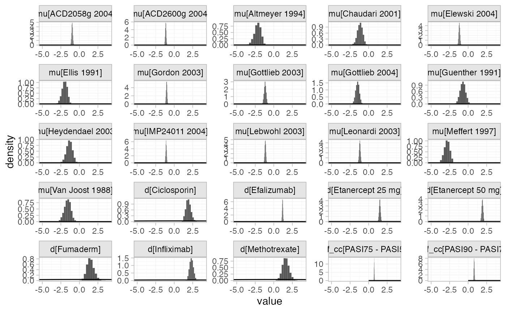

Focusing specifically on the cutpoints we see that these are highly
identified by the data, which is why the implicit flat priors work for
these parameters.

``` r

plot_prior_posterior(pso_fit_FE, prior = "aux")
```

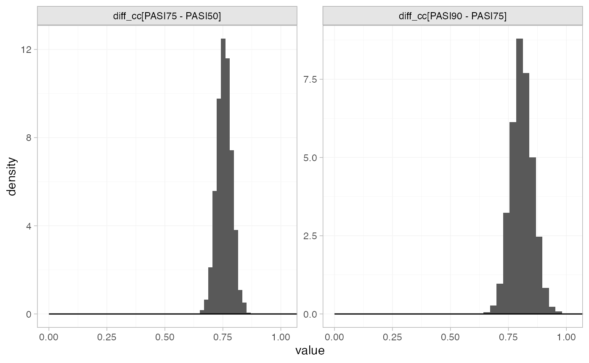

### Random effects meta-analysis

We now fit a random effects model using the
[`nma()`](https://dmphillippo.github.io/multinma/dev/reference/nma.md)
function with `trt_effects = "random"`. Again, we use \mathrm{N}(0,
10^2) prior distributions for the treatment effects d_k, \mathrm{N}(0,
100^2) prior distributions for the study-specific intercepts \mu_j,
implicit flat prior distributions for the latent cutpoints, and we
additionally use a \textrm{half-N}(2.5^2) prior for the heterogeneity
standard deviation \tau. We can examine the range of parameter values
implied by these prior distributions with the
[`summary()`](https://rdrr.io/r/base/summary.html) method:

``` r

summary(normal(scale = 10))
#> A Normal prior distribution: location = 0, scale = 10.
#> 50% of the prior density lies between -6.74 and 6.74.
#> 95% of the prior density lies between -19.6 and 19.6.
summary(normal(scale = 100))
#> A Normal prior distribution: location = 0, scale = 100.
#> 50% of the prior density lies between -67.45 and 67.45.
#> 95% of the prior density lies between -196 and 196.
summary(half_normal(scale = 2.5))
#> A half-Normal prior distribution: scale = 2.5.
#> 50% of the prior density lies between 0 and 1.69.
#> 95% of the prior density lies between 0 and 4.9.
```

Fitting the RE model

``` r

pso_fit_RE <- nma(pso_net, 
                  trt_effects = "random",
                  link = "probit",
                  prior_intercept = normal(scale = 100),
                  prior_trt = normal(scale = 10),
                  prior_aux = flat(),
                  prior_het = half_normal(scale = 2.5),
                  adapt_delta = 0.99)
```

    #> Note: Setting "Supportive care" as the network reference treatment.

Basic parameter summaries are given by the
[`print()`](https://rdrr.io/r/base/print.html) method:

``` r

pso_fit_RE
#> A random effects NMA with a ordered likelihood (probit link).
#> Inference for Stan model: ordered_multinomial.
#> 4 chains, each with iter=5000; warmup=2500; thin=1; 
#> post-warmup draws per chain=2500, total post-warmup draws=10000.
#> 
#>                         mean se_mean   sd     2.5%      25%      50%      75%    97.5% n_eff
#> d[Ciclosporin]          2.02    0.01 0.42     1.30     1.73     1.99     2.27     2.95  3445
#> d[Efalizumab]           1.18    0.00 0.18     0.82     1.10     1.19     1.27     1.55  4612
#> d[Etanercept 25 mg]     1.53    0.00 0.25     1.02     1.40     1.52     1.65     2.05  4159
#> d[Etanercept 50 mg]     1.93    0.00 0.27     1.35     1.80     1.93     2.06     2.51  4818
#> d[Fumaderm]             1.48    0.01 0.63     0.27     1.08     1.45     1.88     2.77  7699
#> d[Infliximab]           2.31    0.00 0.38     1.55     2.08     2.31     2.55     3.07  8199
#> d[Methotrexate]         1.70    0.01 0.62     0.54     1.30     1.67     2.07     3.00  4511
#> lp__                -3410.46    0.18 6.82 -3424.39 -3414.96 -3410.32 -3405.69 -3397.77  1372
#> tau                     0.31    0.01 0.22     0.02     0.15     0.27     0.43     0.85   947
#> cc[PASI50]              0.00     NaN 0.00     0.00     0.00     0.00     0.00     0.00   NaN
#> cc[PASI75]              0.76    0.00 0.03     0.70     0.73     0.76     0.78     0.82 14642
#> cc[PASI90]              1.56    0.00 0.05     1.46     1.53     1.56     1.60     1.66 16421
#>                     Rhat
#> d[Ciclosporin]      1.00
#> d[Efalizumab]       1.00
#> d[Etanercept 25 mg] 1.00
#> d[Etanercept 50 mg] 1.00
#> d[Fumaderm]         1.00
#> d[Infliximab]       1.00
#> d[Methotrexate]     1.00
#> lp__                1.00
#> tau                 1.01
#> cc[PASI50]           NaN
#> cc[PASI75]          1.00
#> cc[PASI90]          1.00
#> 
#> Samples were drawn using NUTS(diag_e) at Wed Jun 17 14:40:12 2026.
#> For each parameter, n_eff is a crude measure of effective sample size,
#> and Rhat is the potential scale reduction factor on split chains (at 
#> convergence, Rhat=1).
```

By default, summaries of the study-specific intercepts \mu_j and
study-specific relative effects \delta\_{jk} are hidden, but could be
examined by changing the `pars` argument:

``` r

# Not run
print(pso_fit_RE, pars = c("d", "cc", "mu", "delta"))
```

The prior and posterior distributions can be compared visually using the
[`plot_prior_posterior()`](https://dmphillippo.github.io/multinma/dev/reference/plot_prior_posterior.md)
function:

``` r

plot_prior_posterior(pso_fit_RE, prior = c("trt", "aux", "het"))
```

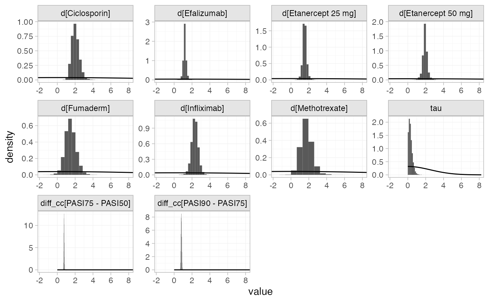

### Model comparison

Model fit can be checked using the
[`dic()`](https://dmphillippo.github.io/multinma/dev/reference/dic.md)
function:

``` r

(dic_FE <- dic(pso_fit_FE))
#> Residual deviance: 74.7 (on 58 data points)
#>                pD: 25.2
#>               DIC: 100
```

``` r

(dic_RE <- dic(pso_fit_RE))
#> Residual deviance: 62.6 (on 58 data points)
#>                pD: 33.3
#>               DIC: 95.9
```

The random effects model has a lower DIC and the residual deviance is
closer to the number of data points, so is preferred in this case.

We can also examine the residual deviance contributions with the
corresponding [`plot()`](https://rdrr.io/r/graphics/plot.default.html)
method.

``` r

plot(dic_FE)
```

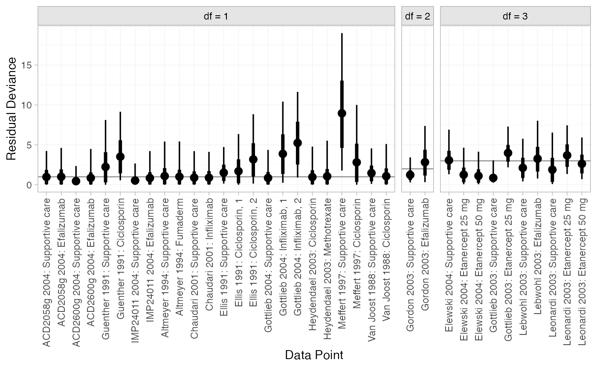

``` r

plot(dic_RE)
```

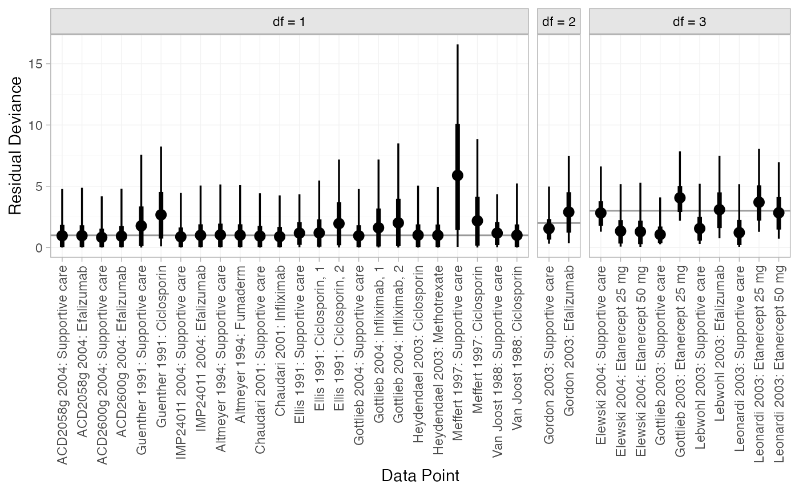

Most data points are fit well, with posterior mean residual deviances
close to the degrees of freedom. The Meffert 1997 study has a
substantially higher residual deviance contribution, which could be
investigated further to see why this study appears to be an outlier.

## Further results

### Predicted probabilities of response

Dias et al. ([2011](#ref-TSD2)) produce absolute predictions of
probability of achieving responses at each PASI cutoff, assuming a
Normal distribution for the baseline probit probability of PASI50
response on supportive care with mean -1.097 and precision 123. We can
replicate these results using the
[`predict()`](https://rdrr.io/r/stats/predict.html) method. The
`baseline` argument takes a
[`distr()`](https://dmphillippo.github.io/multinma/dev/reference/distr.md)
distribution object, with which we specify the corresponding Normal
distribution. We set `type = "response"` to produce predicted
probabilities (`type = "link"` would produce predicted probit
probabilities).

``` r

pred_FE <- predict(pso_fit_FE, 
                   baseline = distr(qnorm, mean = -1.097, sd = 123^-0.5), 
                   type = "response")
pred_FE
#>                                mean   sd 2.5%  25%  50%  75% 97.5% Bulk_ESS Tail_ESS Rhat
#> pred[Supportive care, PASI50]  0.14 0.02 0.10 0.12 0.14 0.15  0.18     3631     3432    1
#> pred[Supportive care, PASI75]  0.03 0.01 0.02 0.03 0.03 0.04  0.05     3724     3434    1
#> pred[Supportive care, PASI90]  0.00 0.00 0.00 0.00 0.00 0.00  0.01     4040     3841    1
#> pred[Ciclosporin, PASI50]      0.78 0.10 0.57 0.72 0.79 0.85  0.94     1633     2194    1
#> pred[Ciclosporin, PASI75]      0.52 0.13 0.28 0.43 0.52 0.61  0.78     1616     2120    1
#> pred[Ciclosporin, PASI90]      0.24 0.11 0.08 0.16 0.23 0.30  0.49     1646     2169    1
#> pred[Efalizumab, PASI50]       0.54 0.04 0.45 0.51 0.54 0.57  0.62     2866     3591    1
#> pred[Efalizumab, PASI75]       0.25 0.03 0.19 0.23 0.25 0.28  0.33     2948     3178    1
#> pred[Efalizumab, PASI90]       0.07 0.02 0.05 0.06 0.07 0.08  0.11     3189     3694    1
#> pred[Etanercept 25 mg, PASI50] 0.66 0.05 0.56 0.63 0.66 0.69  0.75     2515     3271    1
#> pred[Etanercept 25 mg, PASI75] 0.37 0.05 0.27 0.33 0.37 0.40  0.47     2600     3535    1
#> pred[Etanercept 25 mg, PASI90] 0.13 0.03 0.08 0.11 0.12 0.14  0.19     2802     3523    1
#> pred[Etanercept 50 mg, PASI50] 0.79 0.04 0.71 0.77 0.79 0.82  0.86     2596     3315    1
#> pred[Etanercept 50 mg, PASI75] 0.53 0.05 0.42 0.49 0.53 0.56  0.63     2689     3381    1
#> pred[Etanercept 50 mg, PASI90] 0.23 0.04 0.16 0.20 0.23 0.26  0.32     2813     3509    1
#> pred[Fumaderm, PASI50]         0.63 0.16 0.32 0.51 0.63 0.76  0.92     3142     2210    1
#> pred[Fumaderm, PASI75]         0.37 0.17 0.11 0.23 0.34 0.47  0.75     3086     2160    1
#> pred[Fumaderm, PASI90]         0.14 0.11 0.02 0.06 0.11 0.19  0.44     3055     2146    1
#> pred[Infliximab, PASI50]       0.88 0.05 0.76 0.85 0.89 0.92  0.97     2858     2694    1
#> pred[Infliximab, PASI75]       0.68 0.10 0.47 0.61 0.68 0.74  0.86     2832     2656    1
#> pred[Infliximab, PASI90]       0.37 0.10 0.19 0.30 0.37 0.44  0.60     2893     2673    1
#> pred[Methotrexate, PASI50]     0.68 0.14 0.37 0.59 0.70 0.79  0.92     1917     2382    1
#> pred[Methotrexate, PASI75]     0.42 0.16 0.14 0.30 0.41 0.52  0.74     1893     2389    1
#> pred[Methotrexate, PASI90]     0.17 0.11 0.03 0.09 0.15 0.23  0.43     1923     2344    1
plot(pred_FE)
```


``` r

pred_RE <- predict(pso_fit_RE, 
                   baseline = distr(qnorm, mean = -1.097, sd = 123^-0.5), 
                   type = "response")
pred_RE
#>                                mean   sd 2.5%  25%  50%  75% 97.5% Bulk_ESS Tail_ESS Rhat
#> pred[Supportive care, PASI50]  0.14 0.02 0.10 0.12 0.14 0.15  0.18     9886     9993    1
#> pred[Supportive care, PASI75]  0.03 0.01 0.02 0.03 0.03 0.04  0.05    10214     9804    1
#> pred[Supportive care, PASI90]  0.00 0.00 0.00 0.00 0.00 0.00  0.01    11067     9195    1
#> pred[Ciclosporin, PASI50]      0.80 0.11 0.57 0.74 0.81 0.88  0.97     3818     3904    1
#> pred[Ciclosporin, PASI75]      0.56 0.15 0.28 0.45 0.55 0.67  0.87     3797     3762    1
#> pred[Ciclosporin, PASI90]      0.28 0.14 0.08 0.17 0.25 0.35  0.62     3867     3836    1
#> pred[Efalizumab, PASI50]       0.53 0.08 0.37 0.49 0.53 0.58  0.69     5724     4943    1
#> pred[Efalizumab, PASI75]       0.26 0.06 0.14 0.22 0.25 0.29  0.40     5807     4872    1
#> pred[Efalizumab, PASI90]       0.07 0.03 0.03 0.06 0.07 0.09  0.14     5982     5094    1
#> pred[Etanercept 25 mg, PASI50] 0.66 0.09 0.46 0.61 0.66 0.72  0.84     5290     3843    1
#> pred[Etanercept 25 mg, PASI75] 0.38 0.10 0.20 0.32 0.37 0.43  0.59     5313     3915    1
#> pred[Etanercept 25 mg, PASI90] 0.14 0.06 0.05 0.10 0.13 0.16  0.28     5338     4164    1
#> pred[Etanercept 50 mg, PASI50] 0.79 0.08 0.59 0.75 0.80 0.84  0.92     5769     3818    1
#> pred[Etanercept 50 mg, PASI75] 0.53 0.11 0.30 0.47 0.53 0.59  0.75     5785     3895    1
#> pred[Etanercept 50 mg, PASI90] 0.24 0.09 0.09 0.19 0.23 0.28  0.45     5726     3792    1
#> pred[Fumaderm, PASI50]         0.63 0.20 0.20 0.49 0.64 0.78  0.96     7901     5277    1
#> pred[Fumaderm, PASI75]         0.37 0.20 0.05 0.22 0.34 0.51  0.83     7915     5162    1
#> pred[Fumaderm, PASI90]         0.16 0.15 0.01 0.06 0.11 0.22  0.56     7948     4788    1
#> pred[Infliximab, PASI50]       0.87 0.08 0.67 0.83 0.89 0.93  0.98     8322     5613    1
#> pred[Infliximab, PASI75]       0.67 0.13 0.37 0.58 0.67 0.76  0.89     8319     5479    1
#> pred[Infliximab, PASI90]       0.37 0.14 0.13 0.28 0.36 0.46  0.66     8370     5474    1
#> pred[Methotrexate, PASI50]     0.69 0.18 0.28 0.58 0.72 0.83  0.97     4706     4457    1
#> pred[Methotrexate, PASI75]     0.44 0.21 0.09 0.29 0.42 0.59  0.88     4700     4651    1
#> pred[Methotrexate, PASI90]     0.20 0.16 0.02 0.09 0.16 0.28  0.65     4746     4506    1
plot(pred_RE)
```

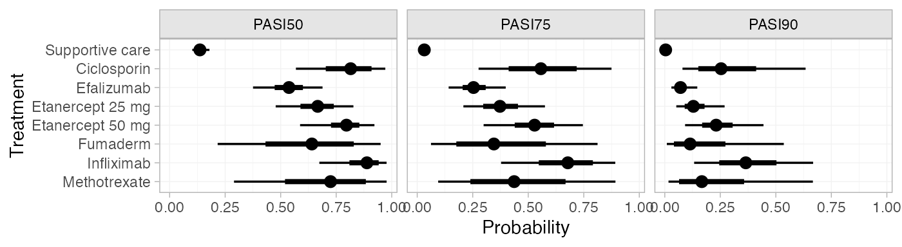

If instead of information on the baseline PASI 50 response probit
probability we have PASI 50 event counts, we can use these to construct
a Beta distribution for the baseline probability of PASI 50 response.
For example, if 56 out of 408 individuals achieved PASI 50 response on
supportive care in the target population of interest, the appropriate
Beta distribution for the response probability would be
\textrm{Beta}(56, 408-56). We can specify this Beta distribution for the
baseline response using the `baseline_type = "reponse"` argument (the
default is `"link"`, used above for the baseline probit probability).

``` r

pred_FE_beta <- predict(pso_fit_FE, 
                        baseline = distr(qbeta, 56, 408-56),
                        baseline_type = "response",
                        type = "response")
pred_FE_beta
#>                                mean   sd 2.5%  25%  50%  75% 97.5% Bulk_ESS Tail_ESS Rhat
#> pred[Supportive care, PASI50]  0.14 0.02 0.10 0.12 0.14 0.15  0.17     3940     4002    1
#> pred[Supportive care, PASI75]  0.03 0.01 0.02 0.03 0.03 0.04  0.05     4026     3931    1
#> pred[Supportive care, PASI90]  0.00 0.00 0.00 0.00 0.00 0.00  0.01     4614     4140    1
#> pred[Ciclosporin, PASI50]      0.78 0.09 0.58 0.72 0.79 0.85  0.94     1659     2017    1
#> pred[Ciclosporin, PASI75]      0.52 0.13 0.29 0.43 0.52 0.61  0.78     1636     1987    1
#> pred[Ciclosporin, PASI90]      0.24 0.11 0.08 0.16 0.23 0.30  0.49     1669     2093    1
#> pred[Efalizumab, PASI50]       0.54 0.04 0.46 0.51 0.54 0.56  0.61     3238     3759    1
#> pred[Efalizumab, PASI75]       0.25 0.03 0.19 0.23 0.25 0.28  0.32     3276     3480    1
#> pred[Efalizumab, PASI90]       0.07 0.02 0.05 0.06 0.07 0.08  0.10     3624     3838    1
#> pred[Etanercept 25 mg, PASI50] 0.66 0.05 0.56 0.63 0.66 0.69  0.74     2528     3368    1
#> pred[Etanercept 25 mg, PASI75] 0.37 0.05 0.28 0.34 0.37 0.40  0.46     2682     3458    1
#> pred[Etanercept 25 mg, PASI90] 0.13 0.03 0.08 0.11 0.13 0.14  0.19     3045     3396    1
#> pred[Etanercept 50 mg, PASI50] 0.79 0.04 0.71 0.77 0.79 0.82  0.86     2616     3614    1
#> pred[Etanercept 50 mg, PASI75] 0.53 0.05 0.42 0.49 0.53 0.56  0.62     2735     3551    1
#> pred[Etanercept 50 mg, PASI90] 0.23 0.04 0.16 0.20 0.23 0.26  0.32     2852     3278    1
#> pred[Fumaderm, PASI50]         0.63 0.16 0.32 0.51 0.63 0.75  0.92     3227     2153    1
#> pred[Fumaderm, PASI75]         0.36 0.17 0.11 0.23 0.34 0.47  0.75     3191     2153    1
#> pred[Fumaderm, PASI90]         0.14 0.11 0.02 0.06 0.11 0.19  0.44     3162     2112    1
#> pred[Infliximab, PASI50]       0.88 0.05 0.76 0.85 0.89 0.92  0.96     2662     2669    1
#> pred[Infliximab, PASI75]       0.68 0.10 0.48 0.61 0.68 0.74  0.85     2649     2702    1
#> pred[Infliximab, PASI90]       0.37 0.10 0.19 0.30 0.37 0.44  0.59     2721     2621    1
#> pred[Methotrexate, PASI50]     0.68 0.14 0.37 0.59 0.70 0.79  0.92     1918     2206    1
#> pred[Methotrexate, PASI75]     0.42 0.16 0.13 0.30 0.41 0.52  0.74     1896     2275    1
#> pred[Methotrexate, PASI90]     0.17 0.11 0.03 0.09 0.15 0.23  0.43     1924     2318    1
plot(pred_FE_beta)
```

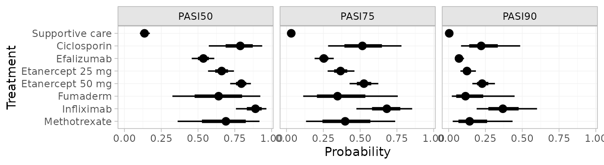

``` r

pred_RE_beta <- predict(pso_fit_RE, 
                        baseline = distr(qbeta, 56, 408-56),
                        baseline_type = "response",
                        type = "response")
pred_RE_beta
#>                                mean   sd 2.5%  25%  50%  75% 97.5% Bulk_ESS Tail_ESS Rhat
#> pred[Supportive care, PASI50]  0.14 0.02 0.11 0.13 0.14 0.15  0.17     9843     9606    1
#> pred[Supportive care, PASI75]  0.03 0.01 0.02 0.03 0.03 0.04  0.05    10312    10142    1
#> pred[Supportive care, PASI90]  0.00 0.00 0.00 0.00 0.00 0.00  0.01    11248     9733    1
#> pred[Ciclosporin, PASI50]      0.80 0.11 0.57 0.74 0.81 0.88  0.97     3949     3809    1
#> pred[Ciclosporin, PASI75]      0.56 0.15 0.28 0.45 0.55 0.66  0.87     3930     3807    1
#> pred[Ciclosporin, PASI90]      0.28 0.14 0.08 0.18 0.25 0.35  0.62     3994     3711    1
#> pred[Efalizumab, PASI50]       0.53 0.07 0.38 0.49 0.54 0.58  0.68     5268     4467    1
#> pred[Efalizumab, PASI75]       0.26 0.06 0.14 0.22 0.25 0.29  0.39     5309     4845    1
#> pred[Efalizumab, PASI90]       0.07 0.03 0.03 0.06 0.07 0.09  0.14     5412     4570    1
#> pred[Etanercept 25 mg, PASI50] 0.66 0.09 0.47 0.61 0.66 0.71  0.83     4862     4111    1
#> pred[Etanercept 25 mg, PASI75] 0.38 0.09 0.20 0.32 0.37 0.43  0.58     4872     3898    1
#> pred[Etanercept 25 mg, PASI90] 0.14 0.06 0.05 0.10 0.13 0.16  0.28     4890     4331    1
#> pred[Etanercept 50 mg, PASI50] 0.79 0.08 0.60 0.75 0.80 0.84  0.92     5452     3614    1
#> pred[Etanercept 50 mg, PASI75] 0.53 0.11 0.30 0.47 0.53 0.59  0.75     5441     3711    1
#> pred[Etanercept 50 mg, PASI90] 0.24 0.08 0.09 0.19 0.23 0.28  0.45     5403     3761    1
#> pred[Fumaderm, PASI50]         0.63 0.20 0.20 0.49 0.64 0.78  0.95     7940     5012    1
#> pred[Fumaderm, PASI75]         0.37 0.20 0.06 0.22 0.34 0.51  0.82     7954     5047    1
#> pred[Fumaderm, PASI90]         0.16 0.14 0.01 0.06 0.11 0.22  0.55     7995     4970    1
#> pred[Infliximab, PASI50]       0.87 0.08 0.67 0.83 0.89 0.93  0.98     8400     5360    1
#> pred[Infliximab, PASI75]       0.67 0.13 0.37 0.59 0.68 0.76  0.89     8396     5573    1
#> pred[Infliximab, PASI90]       0.37 0.14 0.13 0.28 0.36 0.46  0.66     8454     5928    1
#> pred[Methotrexate, PASI50]     0.69 0.18 0.29 0.58 0.72 0.84  0.97     4852     4451    1
#> pred[Methotrexate, PASI75]     0.44 0.21 0.09 0.29 0.43 0.59  0.88     4847     4407    1
#> pred[Methotrexate, PASI90]     0.20 0.16 0.02 0.09 0.16 0.28  0.64     4893     4362    1
plot(pred_RE_beta)
```

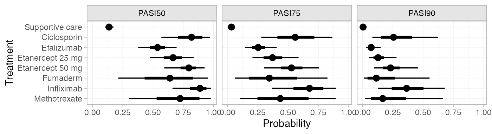
(Notice that these results are equivalent to those calculated above
using the Normal distribution for the baseline probit probability, since
these event counts correspond to the same probit probability.)

We can modify the plots using standard `ggplot2` functions. For example,
to plot the cutpoints together with a colour coding (instead of split
into facets):

``` r

library(ggplot2)
plot(pred_RE, position = position_dodge(width = 0.75)) +
  facet_null() +
  aes(colour = Category) +
  scale_colour_brewer(palette = "Blues")
```

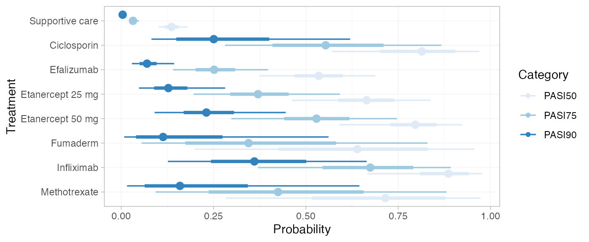

If the `baseline` argument is omitted, predicted probabilities will be
produced for every study in the network based on their estimated
baseline probit probability \mu_j.

### Ranks and rank probabilities

Treatment rankings, rank probabilities, and cumulative rank
probabilities can also be produced. We set `lower_better = FALSE` since
higher outcome categories are better (the outcomes are positive).

``` r

(pso_ranks <- posterior_ranks(pso_fit_RE, lower_better = FALSE))
#>                        mean   sd 2.5% 25% 50% 75% 97.5% Bulk_ESS Tail_ESS Rhat
#> rank[Supportive care]  7.99 0.12    8   8   8   8     8     5133       NA    1
#> rank[Ciclosporin]      2.76 1.26    1   2   3   4     5     6535     6914    1
#> rank[Efalizumab]       6.35 0.80    4   6   7   7     7     5853       NA    1
#> rank[Etanercept 25 mg] 4.91 1.08    3   4   5   6     7     6411     4916    1
#> rank[Etanercept 50 mg] 3.03 1.20    1   2   3   4     5     5547     5831    1
#> rank[Fumaderm]         4.90 1.96    1   3   5   7     7     7797     5347    1
#> rank[Infliximab]       1.80 1.18    1   1   1   2     5     4057     4624    1
#> rank[Methotrexate]     4.26 1.87    1   3   4   6     7     5791     6025    1
plot(pso_ranks)
```

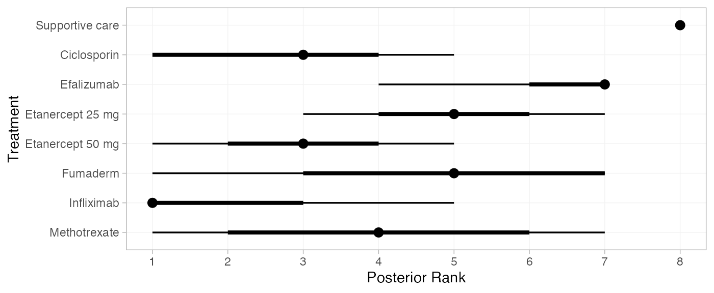

``` r

(pso_rankprobs <- posterior_rank_probs(pso_fit_RE, lower_better = FALSE))
#>                     p_rank[1] p_rank[2] p_rank[3] p_rank[4] p_rank[5] p_rank[6] p_rank[7]
#> d[Supportive care]       0.00      0.00      0.00      0.00      0.00      0.00      0.01
#> d[Ciclosporin]           0.17      0.29      0.27      0.17      0.08      0.02      0.00
#> d[Efalizumab]            0.00      0.00      0.00      0.02      0.10      0.36      0.51
#> d[Etanercept 25 mg]      0.00      0.01      0.08      0.21      0.38      0.26      0.04
#> d[Etanercept 50 mg]      0.08      0.30      0.27      0.24      0.09      0.02      0.00
#> d[Fumaderm]              0.07      0.09      0.10      0.11      0.16      0.19      0.27
#> d[Infliximab]            0.58      0.19      0.13      0.06      0.03      0.01      0.00
#> d[Methotrexate]          0.09      0.12      0.14      0.18      0.17      0.14      0.15
#>                     p_rank[8]
#> d[Supportive care]       0.99
#> d[Ciclosporin]           0.00
#> d[Efalizumab]            0.00
#> d[Etanercept 25 mg]      0.00
#> d[Etanercept 50 mg]      0.00
#> d[Fumaderm]              0.01
#> d[Infliximab]            0.00
#> d[Methotrexate]          0.00
plot(pso_rankprobs)
```

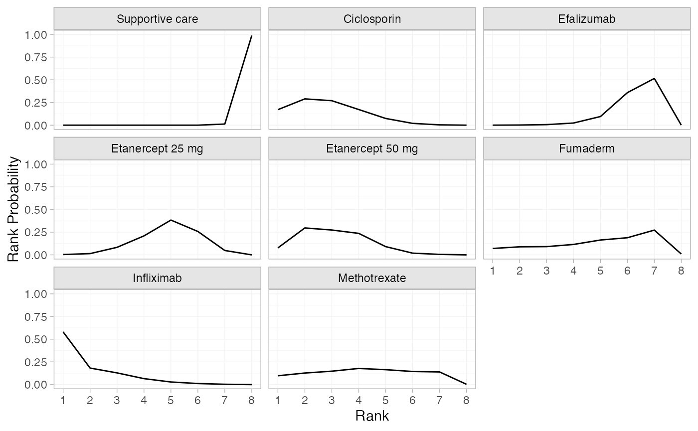

``` r

(pso_cumrankprobs <- posterior_rank_probs(pso_fit_RE, lower_better = FALSE, cumulative = TRUE))
#>                     p_rank[1] p_rank[2] p_rank[3] p_rank[4] p_rank[5] p_rank[6] p_rank[7]
#> d[Supportive care]       0.00      0.00      0.00      0.00      0.00      0.00      0.01
#> d[Ciclosporin]           0.17      0.46      0.73      0.90      0.98      1.00      1.00
#> d[Efalizumab]            0.00      0.00      0.01      0.03      0.13      0.49      1.00
#> d[Etanercept 25 mg]      0.00      0.02      0.10      0.32      0.69      0.95      1.00
#> d[Etanercept 50 mg]      0.08      0.38      0.65      0.89      0.98      1.00      1.00
#> d[Fumaderm]              0.07      0.16      0.26      0.37      0.53      0.71      0.99
#> d[Infliximab]            0.58      0.77      0.90      0.96      0.99      1.00      1.00
#> d[Methotrexate]          0.09      0.21      0.35      0.53      0.71      0.85      1.00
#>                     p_rank[8]
#> d[Supportive care]          1
#> d[Ciclosporin]              1
#> d[Efalizumab]               1
#> d[Etanercept 25 mg]         1
#> d[Etanercept 50 mg]         1
#> d[Fumaderm]                 1
#> d[Infliximab]               1
#> d[Methotrexate]             1
plot(pso_cumrankprobs)
```

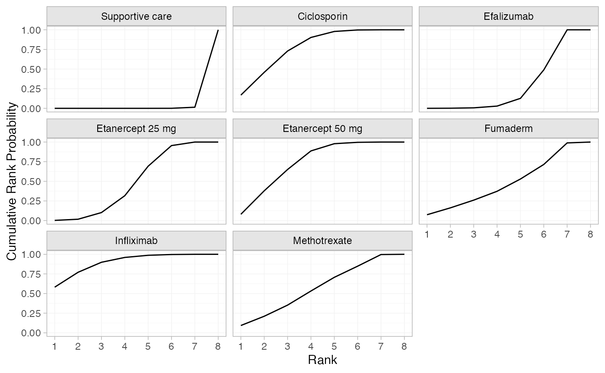

## References

Dias, S., N. J. Welton, A. J. Sutton, and A. E. Ades. 2011. *NICE DSU
Technical Support Document 2: A Generalised Linear Modelling Framework
for Pair-Wise and Network Meta-Analysis of Randomised Controlled
Trials*. National Institute for Health and Care Excellence.
<https://sheffield.ac.uk/nice-dsu>.

Woolacott, N., N. Hawkins, A. Mason, et al. 2006. “Etanercept and
Efalizumab for the Treatment of Psoriasis: A Systematic Review.” *Health
Technology Assessment* 10 (46). <https://doi.org/10.3310/hta10460>.
