# Example: Parkinson's disease

``` r
library(multinma)
options(mc.cores = parallel::detectCores())
```

    #> For execution on a local, multicore CPU with excess RAM we recommend calling
    #> options(mc.cores = parallel::detectCores())
    #> 
    #> Attaching package: 'multinma'
    #> The following objects are masked from 'package:stats':
    #> 
    #>     dgamma, pgamma, qgamma

This vignette describes the analysis of data on the mean off-time
reduction in patients given dopamine agonists as adjunct therapy in
Parkinson’s disease, in a network of 7 trials of 4 active drugs plus
placebo ([Dias et al. 2011](#ref-TSD2)). The data are available in this
package as `parkinsons`:

``` r
head(parkinsons)
#>   studyn trtn     y    se   n  diff se_diff
#> 1      1    1 -1.22 0.504  54    NA   0.504
#> 2      1    3 -1.53 0.439  95 -0.31   0.668
#> 3      2    1 -0.70 0.282 172    NA   0.282
#> 4      2    2 -2.40 0.258 173 -1.70   0.382
#> 5      3    1 -0.30 0.505  76    NA   0.505
#> 6      3    2 -2.60 0.510  71 -2.30   0.718
```

We consider analysing these data in three separate ways:

1.  Using arm-based data (means `y` and corresponding standard errors
    `se`);
2.  Using contrast-based data (mean differences `diff` and corresponding
    standard errors `se_diff`);
3.  A combination of the two, where some studies contribute arm-based
    data, and other contribute contrast-based data.

> **Note:** In this case, with Normal likelihoods for both arms and
> contrasts, we will see that the three analyses give identical results.
> In general, unless the arm-based likelihood is Normal, results from a
> model using a contrast-based likelihood will not exactly match those
> from a model using an arm-based likelihood, since the contrast-based
> Normal likelihood is only an approximation. Similarity of results
> depends on the suitability of the Normal approximation, which may not
> always be appropriate - e.g. with a small number of events or small
> sample size for a binary outcome. The use of an arm-based likelihood
> (sometimes called an “exact” likelihood) is therefore preferable where
> possible in general.

## Analysis of arm-based data

We begin with an analysis of the arm-based data - means and standard
errors.

### Setting up the network

We have arm-level continuous data giving the mean off-time reduction
(`y`) and standard error (`se`) in each arm. We use the function
[`set_agd_arm()`](https://dmphillippo.github.io/multinma/dev/reference/set_agd_arm.md)
to set up the network.

``` r
arm_net <- set_agd_arm(parkinsons, 
                      study = studyn,
                      trt = trtn,
                      y = y, 
                      se = se,
                      sample_size = n)
arm_net
#> A network with 7 AgD studies (arm-based).
#> 
#> ------------------------------------------------------- AgD studies (arm-based) ---- 
#>  Study Treatment arms
#>  1     2: 1 | 3      
#>  2     2: 1 | 2      
#>  3     3: 4 | 1 | 2  
#>  4     2: 4 | 3      
#>  5     2: 4 | 3      
#>  6     2: 4 | 5      
#>  7     2: 4 | 5      
#> 
#>  Outcome type: continuous
#> ------------------------------------------------------------------------------------
#> Total number of treatments: 5
#> Total number of studies: 7
#> Reference treatment is: 4
#> Network is connected
```

We let treatment 4 be set by default as the network reference treatment,
since this results in considerably improved sampling efficiency over
choosing treatment 1 as the network reference. The `sample_size`
argument is optional, but enables the nodes to be weighted by sample
size in the network plot.

Plot the network structure.

``` r
plot(arm_net, weight_edges = TRUE, weight_nodes = TRUE)
```

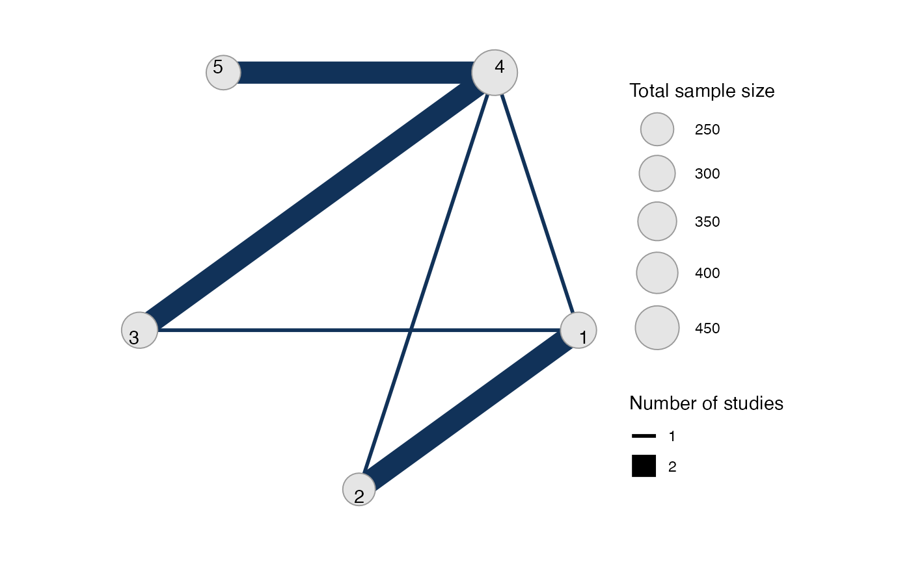

### Meta-analysis models

We fit both fixed effect (FE) and random effects (RE) models.

#### Fixed effect meta-analysis

First, we fit a fixed effect model using the
[`nma()`](https://dmphillippo.github.io/multinma/dev/reference/nma.md)
function with `trt_effects = "fixed"`. We use \mathrm{N}(0, 100^2) prior
distributions for the treatment effects d_k and study-specific
intercepts \mu_j. We can examine the range of parameter values implied
by these prior distributions with the
[`summary()`](https://rdrr.io/r/base/summary.html) method:

``` r
summary(normal(scale = 100))
#> A Normal prior distribution: location = 0, scale = 100.
#> 50% of the prior density lies between -67.45 and 67.45.
#> 95% of the prior density lies between -196 and 196.
```

The model is fitted using the
[`nma()`](https://dmphillippo.github.io/multinma/dev/reference/nma.md)
function.

``` r
arm_fit_FE <- nma(arm_net, 
                  trt_effects = "fixed",
                  prior_intercept = normal(scale = 100),
                  prior_trt = normal(scale = 10))
#> Note: Setting "4" as the network reference treatment.
```

Basic parameter summaries are given by the
[`print()`](https://rdrr.io/r/base/print.html) method:

``` r
arm_fit_FE
#> A fixed effects NMA with a normal likelihood (identity link).
#> Inference for Stan model: normal.
#> 4 chains, each with iter=2000; warmup=1000; thin=1; 
#> post-warmup draws per chain=1000, total post-warmup draws=4000.
#> 
#>       mean se_mean   sd   2.5%   25%   50%   75% 97.5% n_eff Rhat
#> d[1]  0.54    0.01 0.47  -0.38  0.23  0.55  0.86  1.47  1503    1
#> d[2] -1.26    0.01 0.52  -2.29 -1.61 -1.26 -0.91 -0.26  1555    1
#> d[3]  0.05    0.01 0.33  -0.60 -0.18  0.04  0.27  0.68  1965    1
#> d[5] -0.30    0.00 0.22  -0.73 -0.45 -0.30 -0.15  0.12  3127    1
#> lp__ -6.76    0.06 2.41 -12.44 -8.12 -6.42 -5.02 -3.12  1724    1
#> 
#> Samples were drawn using NUTS(diag_e) at Thu Dec 11 16:04:01 2025.
#> For each parameter, n_eff is a crude measure of effective sample size,
#> and Rhat is the potential scale reduction factor on split chains (at 
#> convergence, Rhat=1).
```

By default, summaries of the study-specific intercepts \mu_j are hidden,
but could be examined by changing the `pars` argument:

``` r
# Not run
print(arm_fit_FE, pars = c("d", "mu"))
```

The prior and posterior distributions can be compared visually using the
[`plot_prior_posterior()`](https://dmphillippo.github.io/multinma/dev/reference/plot_prior_posterior.md)
function:

``` r
plot_prior_posterior(arm_fit_FE)
```

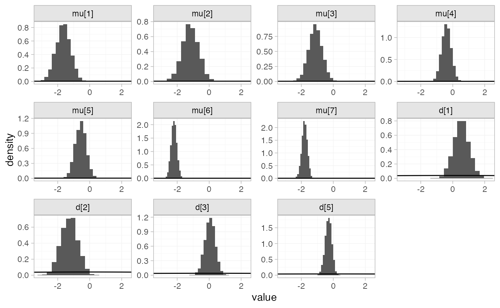

#### Random effects meta-analysis

We now fit a random effects model using the
[`nma()`](https://dmphillippo.github.io/multinma/dev/reference/nma.md)
function with `trt_effects = "random"`. Again, we use \mathrm{N}(0,
100^2) prior distributions for the treatment effects d_k and
study-specific intercepts \mu_j, and we additionally use a
\textrm{half-N}(5^2) prior for the heterogeneity standard deviation
\tau. We can examine the range of parameter values implied by these
prior distributions with the
[`summary()`](https://rdrr.io/r/base/summary.html) method:

``` r
summary(normal(scale = 100))
#> A Normal prior distribution: location = 0, scale = 100.
#> 50% of the prior density lies between -67.45 and 67.45.
#> 95% of the prior density lies between -196 and 196.
summary(half_normal(scale = 5))
#> A half-Normal prior distribution: scale = 5.
#> 50% of the prior density lies between 0 and 3.37.
#> 95% of the prior density lies between 0 and 9.8.
```

Fitting the RE model

``` r
arm_fit_RE <- nma(arm_net, 
                  seed = 379394727,
                  trt_effects = "random",
                  prior_intercept = normal(scale = 100),
                  prior_trt = normal(scale = 100),
                  prior_het = half_normal(scale = 5),
                  adapt_delta = 0.99)
#> Note: Setting "4" as the network reference treatment.
#> Warning: There were 3 divergent transitions after warmup. See
#> https://mc-stan.org/misc/warnings.html#divergent-transitions-after-warmup
#> to find out why this is a problem and how to eliminate them.
#> Warning: Examine the pairs() plot to diagnose sampling problems
```

We do see a small number of divergent transition errors, which cannot
simply be removed by increasing the value of the `adapt_delta` argument
(by default set to `0.95` for RE models). To diagnose, we use the
[`pairs()`](https://rdrr.io/r/graphics/pairs.html) method to investigate
where in the posterior distribution these divergences are happening
(indicated by red crosses):

``` r
pairs(arm_fit_RE, pars = c("mu[4]", "d[3]", "delta[4: 3]", "tau"))
```

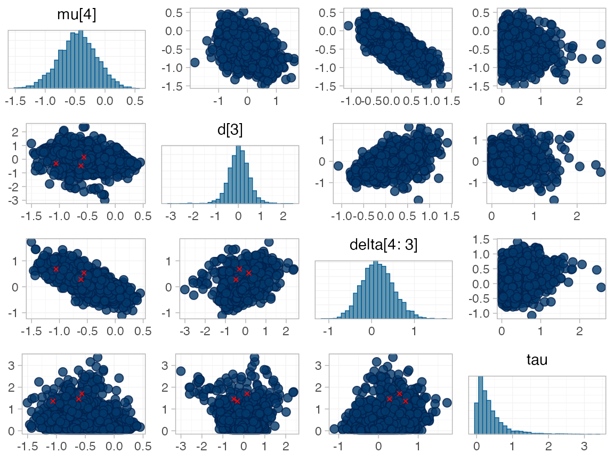

The divergent transitions occur in the upper tail of the heterogeneity
standard deviation. In this case, with only a small number of studies,
there is not very much information to estimate the heterogeneity
standard deviation and the prior distribution may be too heavy-tailed.
We could consider a more informative prior distribution for the
heterogeneity variance to aid estimation.

Basic parameter summaries are given by the
[`print()`](https://rdrr.io/r/base/print.html) method:

``` r
arm_fit_RE
#> A random effects NMA with a normal likelihood (identity link).
#> Inference for Stan model: normal.
#> 4 chains, each with iter=2000; warmup=1000; thin=1; 
#> post-warmup draws per chain=1000, total post-warmup draws=4000.
#> 
#>        mean se_mean   sd   2.5%    25%    50%    75% 97.5% n_eff Rhat
#> d[1]   0.53    0.01 0.61  -0.65   0.15   0.55   0.91  1.69  1935    1
#> d[2]  -1.33    0.02 0.71  -2.72  -1.75  -1.31  -0.88 -0.05  1448    1
#> d[3]   0.02    0.01 0.47  -0.90  -0.25   0.03   0.31  0.91  1999    1
#> d[5]  -0.29    0.01 0.41  -1.09  -0.49  -0.29  -0.10  0.54  2340    1
#> lp__ -13.00    0.10 3.53 -20.90 -15.16 -12.71 -10.46 -7.04  1160    1
#> tau    0.37    0.02 0.39   0.01   0.11   0.26   0.49  1.46   516    1
#> 
#> Samples were drawn using NUTS(diag_e) at Thu Dec 11 16:04:07 2025.
#> For each parameter, n_eff is a crude measure of effective sample size,
#> and Rhat is the potential scale reduction factor on split chains (at 
#> convergence, Rhat=1).
```

By default, summaries of the study-specific intercepts \mu_j and
study-specific relative effects \delta\_{jk} are hidden, but could be
examined by changing the `pars` argument:

``` r
# Not run
print(arm_fit_RE, pars = c("d", "mu", "delta"))
```

The prior and posterior distributions can be compared visually using the
[`plot_prior_posterior()`](https://dmphillippo.github.io/multinma/dev/reference/plot_prior_posterior.md)
function:

``` r
plot_prior_posterior(arm_fit_RE)
```

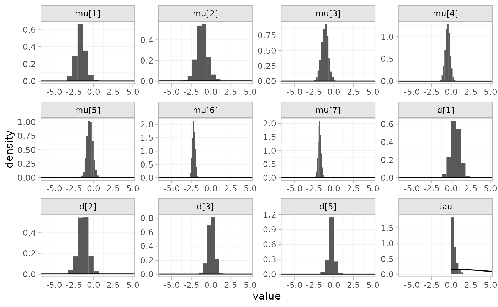

#### Model comparison

Model fit can be checked using the
[`dic()`](https://dmphillippo.github.io/multinma/dev/reference/dic.md)
function:

``` r
(arm_dic_FE <- dic(arm_fit_FE))
#> Residual deviance: 13.5 (on 15 data points)
#>                pD: 11.2
#>               DIC: 24.7
```

``` r
(arm_dic_RE <- dic(arm_fit_RE))
#> Residual deviance: 13.7 (on 15 data points)
#>                pD: 12.4
#>               DIC: 26.1
```

Both models fit the data well, having posterior mean residual deviance
close to the number of data points. The DIC is similar between models,
so we choose the FE model based on parsimony.

We can also examine the residual deviance contributions with the
corresponding [`plot()`](https://rdrr.io/r/graphics/plot.default.html)
method.

``` r
plot(arm_dic_FE)
```

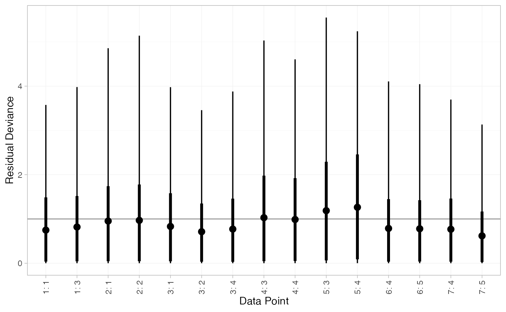

``` r
plot(arm_dic_RE)
```

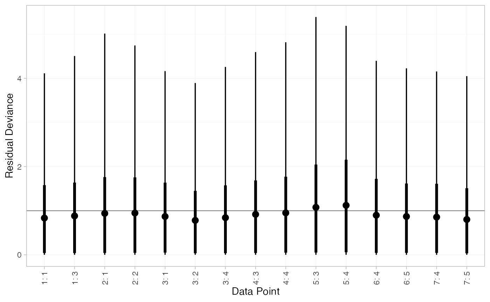

### Further results

For comparison with Dias et al. ([2011](#ref-TSD2)), we can produce
relative effects against placebo using the
[`relative_effects()`](https://dmphillippo.github.io/multinma/dev/reference/relative_effects.md)
function with `trt_ref = 1`:

``` r
(arm_releff_FE <- relative_effects(arm_fit_FE, trt_ref = 1))
#>       mean   sd  2.5%   25%   50%   75% 97.5% Bulk_ESS Tail_ESS Rhat
#> d[4] -0.54 0.47 -1.47 -0.86 -0.55 -0.23  0.38     1520     2166    1
#> d[2] -1.81 0.34 -2.46 -2.05 -1.81 -1.57 -1.13     5565     3253    1
#> d[3] -0.50 0.49 -1.43 -0.82 -0.50 -0.17  0.46     2474     2878    1
#> d[5] -0.84 0.52 -1.85 -1.19 -0.85 -0.50  0.17     1747     2429    1
plot(arm_releff_FE, ref_line = 0)
```

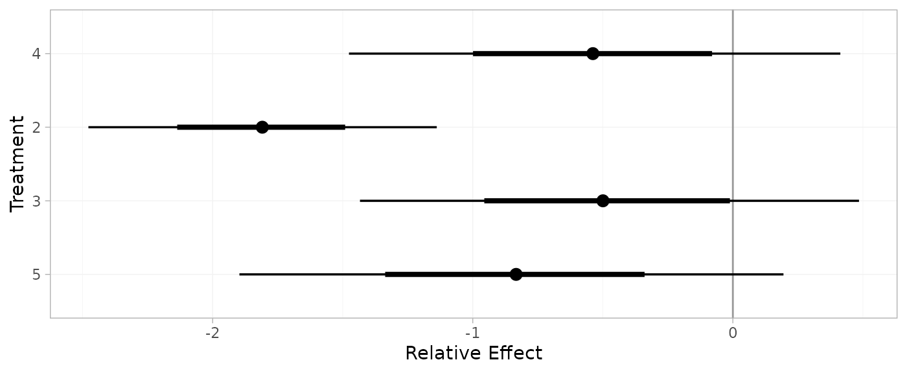

``` r
(arm_releff_RE <- relative_effects(arm_fit_RE, trt_ref = 1))
#>       mean   sd  2.5%   25%   50%   75% 97.5% Bulk_ESS Tail_ESS Rhat
#> d[4] -0.53 0.61 -1.69 -0.91 -0.55 -0.15  0.65     1998     1640    1
#> d[2] -1.86 0.54 -2.97 -2.14 -1.84 -1.55 -0.87     4450     1638    1
#> d[3] -0.50 0.64 -1.74 -0.88 -0.50 -0.12  0.72     3033     2509    1
#> d[5] -0.82 0.72 -2.19 -1.25 -0.84 -0.39  0.58     2075     1955    1
plot(arm_releff_RE, ref_line = 0)
```

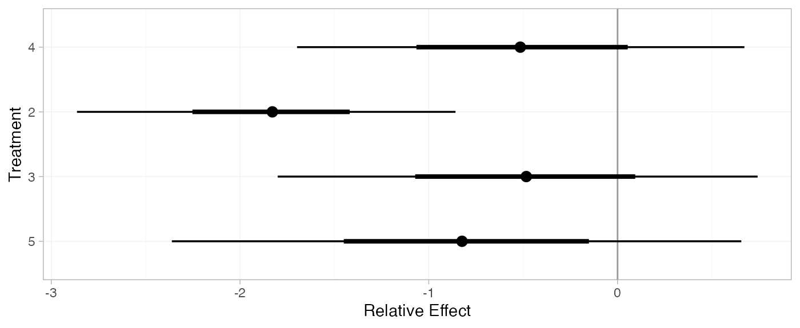

Following Dias et al. ([2011](#ref-TSD2)), we produce absolute
predictions of the mean off-time reduction on each treatment assuming a
Normal distribution for the outcomes on treatment 1 (placebo) with mean
-0.73 and precision 21. We use the
[`predict()`](https://rdrr.io/r/stats/predict.html) method, where the
`baseline` argument takes a
[`distr()`](https://dmphillippo.github.io/multinma/dev/reference/distr.md)
distribution object with which we specify the corresponding Normal
distribution, and we specify `baseline_trt = 1` to indicate that the
baseline distribution corresponds to treatment 1. (Strictly speaking,
`type = "response"` is unnecessary here, since the identity link
function was used.)

``` r
arm_pred_FE <- predict(arm_fit_FE, 
                       baseline = distr(qnorm, mean = -0.73, sd = 21^-0.5),
                       type = "response",
                       baseline_trt = 1)
arm_pred_FE
#>          mean   sd  2.5%   25%   50%   75% 97.5% Bulk_ESS Tail_ESS Rhat
#> pred[4] -1.27 0.53 -2.29 -1.62 -1.28 -0.91 -0.24     1701     2585    1
#> pred[1] -0.73 0.22 -1.16 -0.88 -0.73 -0.58 -0.29     3910     3936    1
#> pred[2] -2.53 0.41 -3.33 -2.81 -2.53 -2.26 -1.74     5361     3716    1
#> pred[3] -1.22 0.54 -2.27 -1.59 -1.22 -0.86 -0.17     2650     3202    1
#> pred[5] -1.57 0.57 -2.68 -1.96 -1.58 -1.18 -0.44     1935     2716    1
plot(arm_pred_FE)
```


``` r
arm_pred_RE <- predict(arm_fit_RE, 
                       baseline = distr(qnorm, mean = -0.73, sd = 21^-0.5),
                       type = "response",
                       baseline_trt = 1)
arm_pred_RE
#>          mean   sd  2.5%   25%   50%   75% 97.5% Bulk_ESS Tail_ESS Rhat
#> pred[4] -1.25 0.64 -2.50 -1.68 -1.26 -0.85 -0.02     2148     1954    1
#> pred[1] -0.73 0.22 -1.16 -0.87 -0.73 -0.58 -0.30     3976     3867    1
#> pred[2] -2.58 0.58 -3.76 -2.90 -2.57 -2.25 -1.49     4216     1441    1
#> pred[3] -1.23 0.68 -2.57 -1.63 -1.22 -0.82  0.06     3151     2639    1
#> pred[5] -1.55 0.75 -3.02 -2.00 -1.55 -1.10 -0.08     2181     2142    1
plot(arm_pred_RE)
```

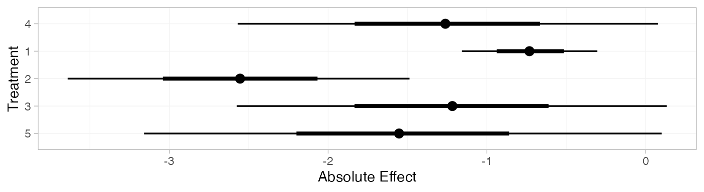

If the `baseline` argument is omitted, predictions of mean off-time
reduction will be produced for every study in the network based on their
estimated baseline response \mu_j:

``` r
arm_pred_FE_studies <- predict(arm_fit_FE, type = "response")
arm_pred_FE_studies
#> ---------------------------------------------------------------------- Study: 1 ---- 
#> 
#>             mean   sd  2.5%   25%   50%   75% 97.5% Bulk_ESS Tail_ESS Rhat
#> pred[1: 4] -1.66 0.46 -2.52 -1.98 -1.66 -1.35 -0.77     1884     2597    1
#> pred[1: 1] -1.12 0.43 -1.97 -1.40 -1.12 -0.83 -0.27     3777     3318    1
#> pred[1: 2] -2.92 0.52 -3.97 -3.28 -2.92 -2.58 -1.93     3554     3227    1
#> pred[1: 3] -1.61 0.39 -2.35 -1.88 -1.61 -1.35 -0.85     3393     3380    1
#> pred[1: 5] -1.96 0.50 -2.90 -2.32 -1.97 -1.62 -0.95     2052     2630    1
#> 
#> ---------------------------------------------------------------------- Study: 2 ---- 
#> 
#>             mean   sd  2.5%   25%   50%   75% 97.5% Bulk_ESS Tail_ESS Rhat
#> pred[2: 4] -1.18 0.51 -2.16 -1.52 -1.18 -0.85 -0.17     1478     2006    1
#> pred[2: 1] -0.64 0.27 -1.16 -0.82 -0.64 -0.45 -0.12     4690     3456    1
#> pred[2: 2] -2.45 0.24 -2.91 -2.61 -2.45 -2.28 -1.99     5023     3477    1
#> pred[2: 3] -1.14 0.53 -2.17 -1.50 -1.14 -0.78 -0.10     2234     2653    1
#> pred[2: 5] -1.48 0.55 -2.55 -1.86 -1.49 -1.12 -0.38     1704     2387    1
#> 
#> ---------------------------------------------------------------------- Study: 3 ---- 
#> 
#>             mean   sd  2.5%   25%   50%   75% 97.5% Bulk_ESS Tail_ESS Rhat
#> pred[3: 4] -1.12 0.41 -1.93 -1.40 -1.12 -0.85 -0.31     1834     2637    1
#> pred[3: 1] -0.58 0.36 -1.26 -0.82 -0.58 -0.34  0.11     3935     3596    1
#> pred[3: 2] -2.39 0.37 -3.12 -2.64 -2.38 -2.14 -1.66     3721     3110    1
#> pred[3: 3] -1.08 0.48 -2.04 -1.40 -1.08 -0.75 -0.12     2759     2766    1
#> pred[3: 5] -1.43 0.47 -2.34 -1.74 -1.43 -1.11 -0.53     2144     2574    1
#> 
#> ---------------------------------------------------------------------- Study: 4 ---- 
#> 
#>             mean   sd  2.5%   25%   50%   75% 97.5% Bulk_ESS Tail_ESS Rhat
#> pred[4: 4] -0.39 0.30 -0.98 -0.60 -0.40 -0.19  0.21     2218     2451    1
#> pred[4: 1]  0.15 0.50 -0.85 -0.19  0.16  0.49  1.11     2290     2536    1
#> pred[4: 2] -1.66 0.56 -2.79 -2.03 -1.64 -1.28 -0.57     2160     2387    1
#> pred[4: 3] -0.35 0.25 -0.83 -0.52 -0.35 -0.18  0.14     5423     3545    1
#> pred[4: 5] -0.70 0.37 -1.42 -0.94 -0.70 -0.45  0.05     2540     2624    1
#> 
#> ---------------------------------------------------------------------- Study: 5 ---- 
#> 
#>             mean   sd  2.5%   25%   50%   75% 97.5% Bulk_ESS Tail_ESS Rhat
#> pred[5: 4] -0.56 0.34 -1.24 -0.79 -0.56 -0.33  0.10     2436     2809    1
#> pred[5: 1] -0.02 0.52 -1.03 -0.38 -0.01  0.33  0.99     2383     2706    1
#> pred[5: 2] -1.83 0.58 -2.94 -2.21 -1.84 -1.44 -0.71     2259     2744    1
#> pred[5: 3] -0.52 0.29 -1.08 -0.72 -0.53 -0.32  0.08     5745     3401    1
#> pred[5: 5] -0.87 0.41 -1.68 -1.14 -0.85 -0.58 -0.08     2827     2930    1
#> 
#> ---------------------------------------------------------------------- Study: 6 ---- 
#> 
#>             mean   sd  2.5%   25%   50%   75% 97.5% Bulk_ESS Tail_ESS Rhat
#> pred[6: 4] -2.20 0.18 -2.56 -2.32 -2.19 -2.08 -1.84     3387     2923    1
#> pred[6: 1] -1.65 0.50 -2.64 -1.99 -1.65 -1.32 -0.65     1650     2421    1
#> pred[6: 2] -3.46 0.55 -4.55 -3.83 -3.46 -3.09 -2.38     1680     2233    1
#> pred[6: 3] -2.15 0.38 -2.90 -2.40 -2.15 -1.89 -1.42     2186     2773    1
#> pred[6: 5] -2.50 0.17 -2.83 -2.61 -2.50 -2.38 -2.16     4987     3117    1
#> 
#> ---------------------------------------------------------------------- Study: 7 ---- 
#> 
#>             mean   sd  2.5%   25%   50%   75% 97.5% Bulk_ESS Tail_ESS Rhat
#> pred[7: 4] -1.80 0.18 -2.16 -1.92 -1.80 -1.68 -1.45     3551     2946    1
#> pred[7: 1] -1.26 0.50 -2.24 -1.59 -1.25 -0.91 -0.29     1679     2355    1
#> pred[7: 2] -3.06 0.55 -4.15 -3.43 -3.06 -2.70 -1.99     1742     2606    1
#> pred[7: 3] -1.75 0.38 -2.50 -2.01 -1.75 -1.50 -1.01     2214     2539    1
#> pred[7: 5] -2.10 0.21 -2.50 -2.24 -2.10 -1.96 -1.70     4914     3210    1
plot(arm_pred_FE_studies)
```

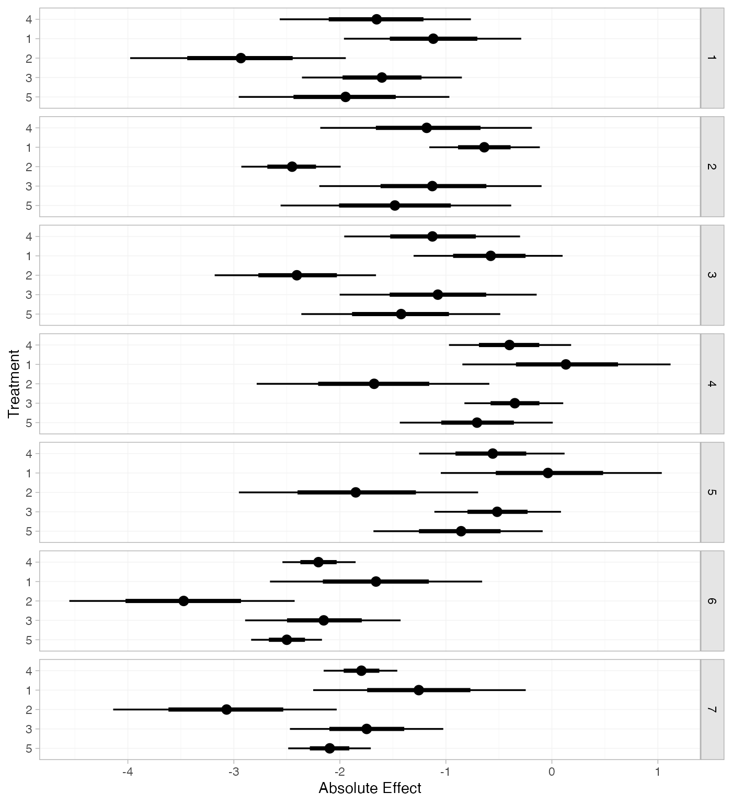

We can also produce treatment rankings, rank probabilities, and
cumulative rank probabilities.

``` r
(arm_ranks <- posterior_ranks(arm_fit_FE))
#>         mean   sd 2.5% 25% 50% 75% 97.5% Bulk_ESS Tail_ESS Rhat
#> rank[4] 3.49 0.70    2   3   3   4     5     1990       NA    1
#> rank[1] 4.66 0.75    2   5   5   5     5     2335       NA    1
#> rank[2] 1.06 0.30    1   1   1   1     2     2583     2595    1
#> rank[3] 3.51 0.93    2   3   4   4     5     2854       NA    1
#> rank[5] 2.28 0.69    1   2   2   2     4     2545     2543    1
plot(arm_ranks)
```

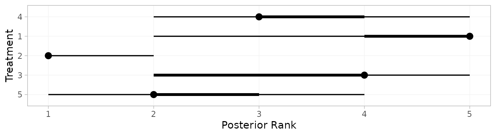

``` r
(arm_rankprobs <- posterior_rank_probs(arm_fit_FE))
#>      p_rank[1] p_rank[2] p_rank[3] p_rank[4] p_rank[5]
#> d[4]      0.00      0.04      0.49      0.39      0.07
#> d[1]      0.00      0.04      0.06      0.11      0.79
#> d[2]      0.95      0.04      0.01      0.00      0.00
#> d[3]      0.00      0.17      0.26      0.45      0.12
#> d[5]      0.04      0.71      0.18      0.05      0.01
plot(arm_rankprobs)
```


``` r
(arm_cumrankprobs <- posterior_rank_probs(arm_fit_FE, cumulative = TRUE))
#>      p_rank[1] p_rank[2] p_rank[3] p_rank[4] p_rank[5]
#> d[4]      0.00      0.05      0.54      0.93         1
#> d[1]      0.00      0.04      0.10      0.21         1
#> d[2]      0.95      0.99      1.00      1.00         1
#> d[3]      0.00      0.17      0.43      0.88         1
#> d[5]      0.04      0.75      0.94      0.99         1
plot(arm_cumrankprobs)
```

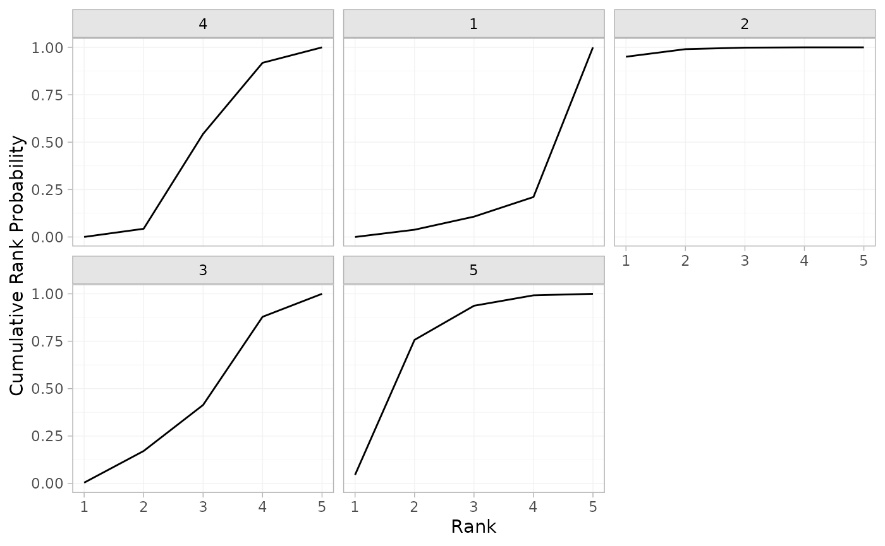

## Analysis of contrast-based data

We now perform an analysis using the contrast-based data (mean
differences and standard errors).

### Setting up the network

With contrast-level data giving the mean difference in off-time
reduction (`diff`) and standard error (`se_diff`), we use the function
[`set_agd_contrast()`](https://dmphillippo.github.io/multinma/dev/reference/set_agd_contrast.md)
to set up the network.

``` r
contr_net <- set_agd_contrast(parkinsons, 
                              study = studyn,
                              trt = trtn,
                              y = diff, 
                              se = se_diff,
                              sample_size = n)
contr_net
#> A network with 7 AgD studies (contrast-based).
#> 
#> -------------------------------------------------- AgD studies (contrast-based) ---- 
#>  Study Treatment arms
#>  1     2: 1 | 3      
#>  2     2: 1 | 2      
#>  3     3: 4 | 1 | 2  
#>  4     2: 4 | 3      
#>  5     2: 4 | 3      
#>  6     2: 4 | 5      
#>  7     2: 4 | 5      
#> 
#>  Outcome type: continuous
#> ------------------------------------------------------------------------------------
#> Total number of treatments: 5
#> Total number of studies: 7
#> Reference treatment is: 4
#> Network is connected
```

The `sample_size` argument is optional, but enables the nodes to be
weighted by sample size in the network plot.

Plot the network structure.

``` r
plot(contr_net, weight_edges = TRUE, weight_nodes = TRUE)
```


### Meta-analysis models

We fit both fixed effect (FE) and random effects (RE) models.

#### Fixed effect meta-analysis

First, we fit a fixed effect model using the
[`nma()`](https://dmphillippo.github.io/multinma/dev/reference/nma.md)
function with `trt_effects = "fixed"`. We use \mathrm{N}(0, 100^2) prior
distributions for the treatment effects d_k. We can examine the range of
parameter values implied by these prior distributions with the
[`summary()`](https://rdrr.io/r/base/summary.html) method:

``` r
summary(normal(scale = 100))
#> A Normal prior distribution: location = 0, scale = 100.
#> 50% of the prior density lies between -67.45 and 67.45.
#> 95% of the prior density lies between -196 and 196.
```

The model is fitted using the
[`nma()`](https://dmphillippo.github.io/multinma/dev/reference/nma.md)
function.

``` r
contr_fit_FE <- nma(contr_net, 
                    trt_effects = "fixed",
                    prior_trt = normal(scale = 100))
#> Note: Setting "4" as the network reference treatment.
```

Basic parameter summaries are given by the
[`print()`](https://rdrr.io/r/base/print.html) method:

``` r
contr_fit_FE
#> A fixed effects NMA with a normal likelihood (identity link).
#> Inference for Stan model: normal.
#> 4 chains, each with iter=2000; warmup=1000; thin=1; 
#> post-warmup draws per chain=1000, total post-warmup draws=4000.
#> 
#>       mean se_mean   sd  2.5%   25%   50%   75% 97.5% n_eff Rhat
#> d[1]  0.54    0.01 0.46 -0.37  0.23  0.53  0.84  1.43  2175    1
#> d[2] -1.27    0.01 0.50 -2.26 -1.62 -1.27 -0.93 -0.29  2263    1
#> d[3]  0.05    0.01 0.33 -0.58 -0.18  0.05  0.27  0.71  3058    1
#> d[5] -0.30    0.00 0.21 -0.71 -0.44 -0.30 -0.16  0.08  3831    1
#> lp__ -3.12    0.03 1.36 -6.55 -3.77 -2.82 -2.12 -1.39  1841    1
#> 
#> Samples were drawn using NUTS(diag_e) at Thu Dec 11 16:04:19 2025.
#> For each parameter, n_eff is a crude measure of effective sample size,
#> and Rhat is the potential scale reduction factor on split chains (at 
#> convergence, Rhat=1).
```

The prior and posterior distributions can be compared visually using the
[`plot_prior_posterior()`](https://dmphillippo.github.io/multinma/dev/reference/plot_prior_posterior.md)
function:

``` r
plot_prior_posterior(contr_fit_FE)
```

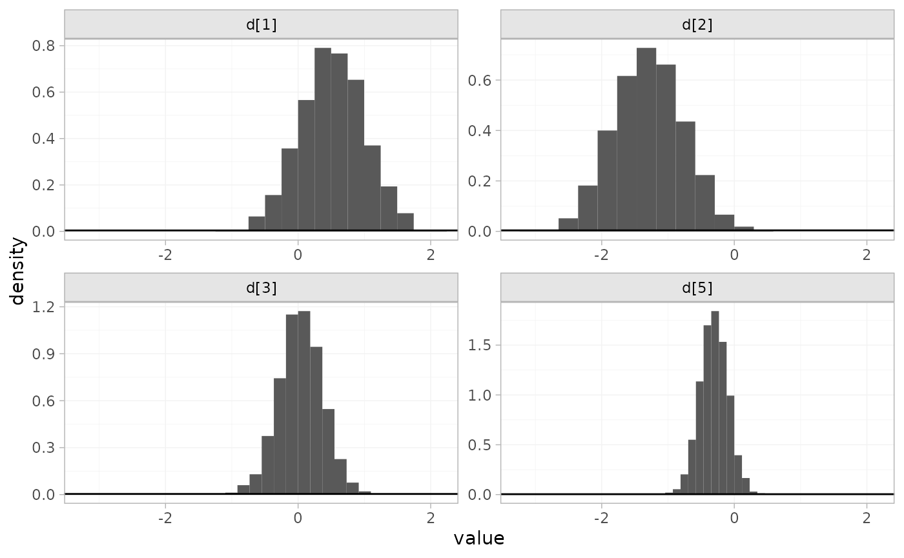

#### Random effects meta-analysis

We now fit a random effects model using the
[`nma()`](https://dmphillippo.github.io/multinma/dev/reference/nma.md)
function with `trt_effects = "random"`. Again, we use \mathrm{N}(0,
100^2) prior distributions for the treatment effects d_k, and we
additionally use a \textrm{half-N}(5^2) prior for the heterogeneity
standard deviation \tau. We can examine the range of parameter values
implied by these prior distributions with the
[`summary()`](https://rdrr.io/r/base/summary.html) method:

``` r
summary(normal(scale = 100))
#> A Normal prior distribution: location = 0, scale = 100.
#> 50% of the prior density lies between -67.45 and 67.45.
#> 95% of the prior density lies between -196 and 196.
summary(half_normal(scale = 5))
#> A half-Normal prior distribution: scale = 5.
#> 50% of the prior density lies between 0 and 3.37.
#> 95% of the prior density lies between 0 and 9.8.
```

Fitting the RE model

``` r
contr_fit_RE <- nma(contr_net, 
                    seed = 1150676438,
                    trt_effects = "random",
                    prior_trt = normal(scale = 100),
                    prior_het = half_normal(scale = 5),
                    adapt_delta = 0.99)
#> Note: Setting "4" as the network reference treatment.
```

We do see a small number of divergent transition errors, which cannot
simply be removed by increasing the value of the `adapt_delta` argument
(by default set to `0.95` for RE models). To diagnose, we use the
[`pairs()`](https://rdrr.io/r/graphics/pairs.html) method to investigate
where in the posterior distribution these divergences are happening
(indicated by red crosses):

``` r
pairs(contr_fit_RE, pars = c("d[3]", "delta[4: 4 vs. 3]", "tau"))
```

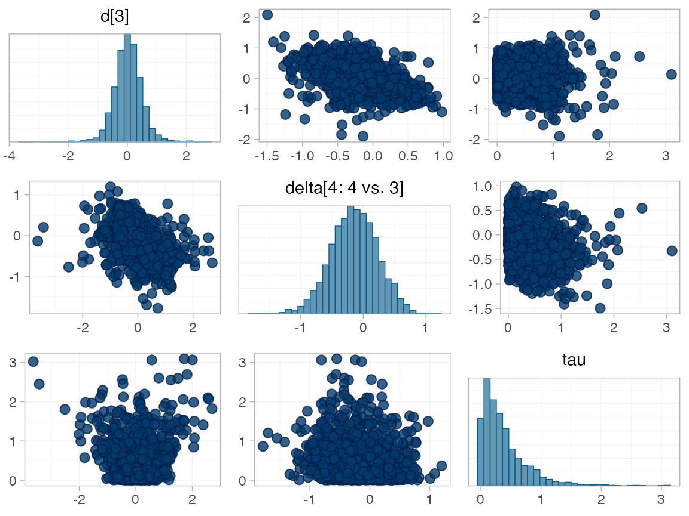

The divergent transitions occur in the upper tail of the heterogeneity
standard deviation. In this case, with only a small number of studies,
there is not very much information to estimate the heterogeneity
standard deviation and the prior distribution may be too heavy-tailed.
We could consider a more informative prior distribution for the
heterogeneity variance to aid estimation.

Basic parameter summaries are given by the
[`print()`](https://rdrr.io/r/base/print.html) method:

``` r
contr_fit_RE
#> A random effects NMA with a normal likelihood (identity link).
#> Inference for Stan model: normal.
#> 4 chains, each with iter=2000; warmup=1000; thin=1; 
#> post-warmup draws per chain=1000, total post-warmup draws=4000.
#> 
#>       mean se_mean   sd   2.5%    25%   50%   75% 97.5% n_eff Rhat
#> d[1]  0.51    0.01 0.60  -0.65   0.13  0.52  0.90  1.65  2435 1.00
#> d[2] -1.33    0.01 0.69  -2.70  -1.74 -1.31 -0.89 -0.01  2356 1.00
#> d[3]  0.03    0.01 0.47  -0.83  -0.24  0.03  0.30  0.95  1953 1.00
#> d[5] -0.31    0.01 0.41  -1.19  -0.52 -0.30 -0.10  0.48  2077 1.00
#> lp__ -8.27    0.09 2.92 -14.84 -10.03 -7.97 -6.20 -3.43  1172 1.00
#> tau   0.38    0.01 0.38   0.01   0.12  0.28  0.52  1.42   945 1.01
#> 
#> Samples were drawn using NUTS(diag_e) at Thu Dec 11 16:04:21 2025.
#> For each parameter, n_eff is a crude measure of effective sample size,
#> and Rhat is the potential scale reduction factor on split chains (at 
#> convergence, Rhat=1).
```

By default, summaries of the study-specific relative effects
\delta\_{jk} are hidden, but could be examined by changing the `pars`
argument:

``` r
# Not run
print(contr_fit_RE, pars = c("d", "delta"))
```

The prior and posterior distributions can be compared visually using the
[`plot_prior_posterior()`](https://dmphillippo.github.io/multinma/dev/reference/plot_prior_posterior.md)
function:

``` r
plot_prior_posterior(contr_fit_RE)
```

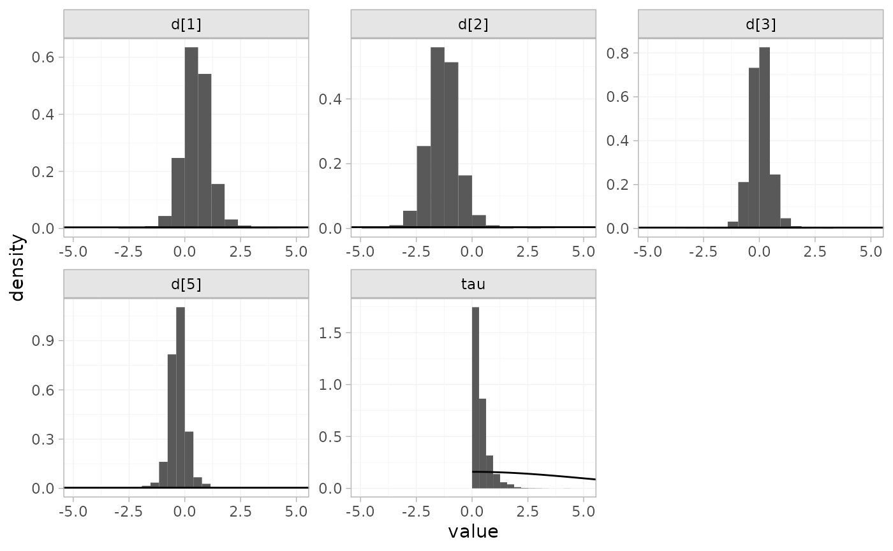

#### Model comparison

Model fit can be checked using the
[`dic()`](https://dmphillippo.github.io/multinma/dev/reference/dic.md)
function:

``` r
(contr_dic_FE <- dic(contr_fit_FE))
#> Residual deviance: 6.2 (on 8 data points)
#>                pD: 3.9
#>               DIC: 10.2
```

``` r
(contr_dic_RE <- dic(contr_fit_RE))
#> Residual deviance: 6.5 (on 8 data points)
#>                pD: 5.3
#>               DIC: 11.8
```

Both models fit the data well, having posterior mean residual deviance
close to the number of data points. The DIC is similar between models,
so we choose the FE model based on parsimony.

We can also examine the residual deviance contributions with the
corresponding [`plot()`](https://rdrr.io/r/graphics/plot.default.html)
method.

``` r
plot(contr_dic_FE)
```

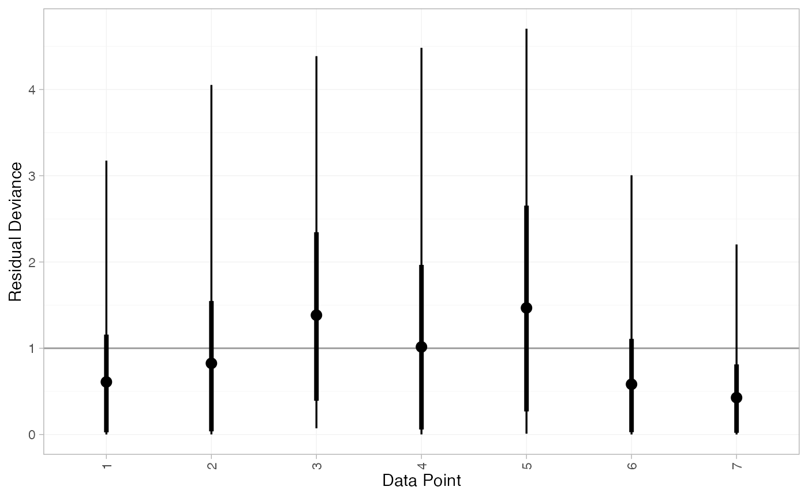

``` r
plot(contr_dic_RE)
```

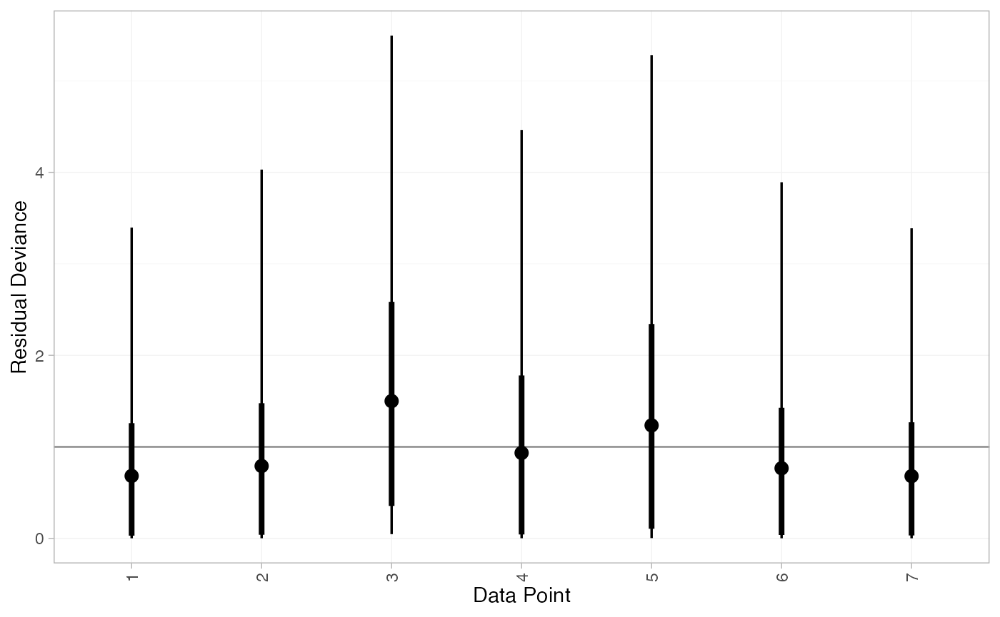

### Further results

For comparison with Dias et al. ([2011](#ref-TSD2)), we can produce
relative effects against placebo using the
[`relative_effects()`](https://dmphillippo.github.io/multinma/dev/reference/relative_effects.md)
function with `trt_ref = 1`:

``` r
(contr_releff_FE <- relative_effects(contr_fit_FE, trt_ref = 1))
#>       mean   sd  2.5%   25%   50%   75% 97.5% Bulk_ESS Tail_ESS Rhat
#> d[4] -0.54 0.46 -1.43 -0.84 -0.53 -0.23  0.37     2193     2485    1
#> d[2] -1.81 0.33 -2.46 -2.03 -1.81 -1.58 -1.17     5584     3277    1
#> d[3] -0.49 0.48 -1.43 -0.81 -0.48 -0.15  0.46     3041     2924    1
#> d[5] -0.83 0.50 -1.83 -1.18 -0.83 -0.50  0.15     2444     2494    1
plot(contr_releff_FE, ref_line = 0)
```

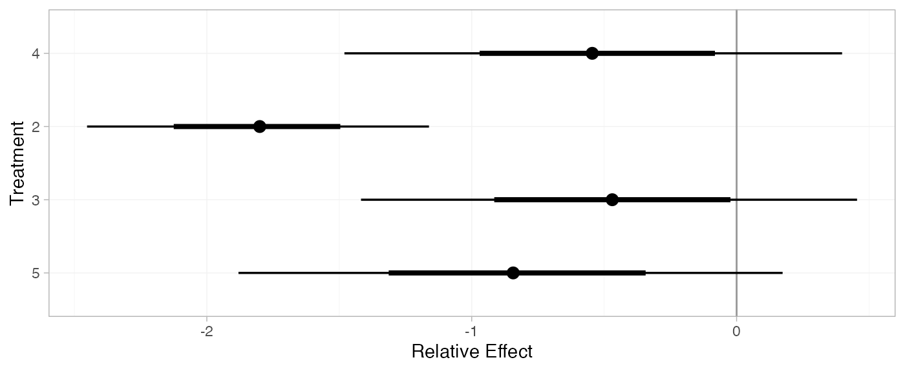

``` r
(contr_releff_RE <- relative_effects(contr_fit_RE, trt_ref = 1))
#>       mean   sd  2.5%   25%   50%   75% 97.5% Bulk_ESS Tail_ESS Rhat
#> d[4] -0.51 0.60 -1.65 -0.90 -0.52 -0.13  0.65     2505     2312    1
#> d[2] -1.84 0.51 -2.85 -2.12 -1.83 -1.55 -0.87     3437     2322    1
#> d[3] -0.48 0.63 -1.71 -0.86 -0.49 -0.11  0.75     3210     2479    1
#> d[5] -0.82 0.74 -2.29 -1.25 -0.82 -0.38  0.59     2325     1876    1
plot(contr_releff_RE, ref_line = 0)
```

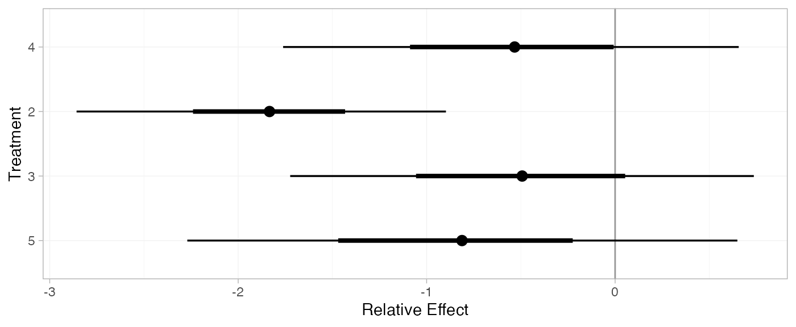

Following Dias et al. ([2011](#ref-TSD2)), we produce absolute
predictions of the mean off-time reduction on each treatment assuming a
Normal distribution for the outcomes on treatment 1 (placebo) with mean
-0.73 and precision 21. We use the
[`predict()`](https://rdrr.io/r/stats/predict.html) method, where the
`baseline` argument takes a
[`distr()`](https://dmphillippo.github.io/multinma/dev/reference/distr.md)
distribution object with which we specify the corresponding Normal
distribution, and we specify `baseline_trt = 1` to indicate that the
baseline distribution corresponds to treatment 1. (Strictly speaking,
`type = "response"` is unnecessary here, since the identity link
function was used.)

``` r
contr_pred_FE <- predict(contr_fit_FE, 
                       baseline = distr(qnorm, mean = -0.73, sd = 21^-0.5),
                       type = "response",
                       baseline_trt = 1)
contr_pred_FE
#>          mean   sd  2.5%   25%   50%   75% 97.5% Bulk_ESS Tail_ESS Rhat
#> pred[4] -1.26 0.51 -2.27 -1.61 -1.27 -0.91 -0.25     2343     3040    1
#> pred[1] -0.73 0.22 -1.16 -0.88 -0.73 -0.58 -0.30     3988     3629    1
#> pred[2] -2.54 0.39 -3.33 -2.80 -2.54 -2.28 -1.77     4860     3667    1
#> pred[3] -1.22 0.53 -2.24 -1.58 -1.22 -0.87 -0.18     3029     3222    1
#> pred[5] -1.56 0.55 -2.65 -1.94 -1.56 -1.19 -0.51     2499     2945    1
plot(contr_pred_FE)
```

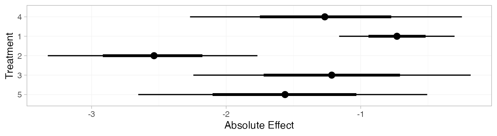

``` r
contr_pred_RE <- predict(contr_fit_RE, 
                       baseline = distr(qnorm, mean = -0.73, sd = 21^-0.5),
                       type = "response",
                       baseline_trt = 1)
contr_pred_RE
#>          mean   sd  2.5%   25%   50%   75% 97.5% Bulk_ESS Tail_ESS Rhat
#> pred[4] -1.25 0.63 -2.47 -1.65 -1.25 -0.84 -0.01     2628     2267    1
#> pred[1] -0.73 0.22 -1.16 -0.88 -0.73 -0.59 -0.31     3715     3592    1
#> pred[2] -2.58 0.55 -3.67 -2.91 -2.58 -2.24 -1.50     3516     2575    1
#> pred[3] -1.22 0.67 -2.51 -1.63 -1.22 -0.80  0.09     3217     2295    1
#> pred[5] -1.56 0.77 -3.09 -2.02 -1.55 -1.09 -0.04     2445     2093    1
plot(contr_pred_RE)
```

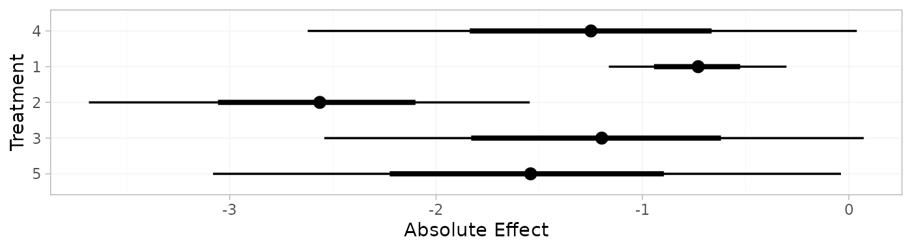

If the `baseline` argument is omitted an error will be raised, as there
are no study baselines estimated in this network.

``` r
# Not run
predict(contr_fit_FE, type = "response")
```

We can also produce treatment rankings, rank probabilities, and
cumulative rank probabilities.

``` r
(contr_ranks <- posterior_ranks(contr_fit_FE))
#>         mean   sd 2.5% 25% 50% 75% 97.5% Bulk_ESS Tail_ESS Rhat
#> rank[4] 3.49 0.70    2   3   3   4     5     2741       NA    1
#> rank[1] 4.68 0.73    2   5   5   5     5     2532       NA    1
#> rank[2] 1.04 0.23    1   1   1   1     2     2825     2834    1
#> rank[3] 3.51 0.92    2   3   4   4     5     3397       NA    1
#> rank[5] 2.28 0.65    1   2   2   2     4     2845     2127    1
plot(contr_ranks)
```

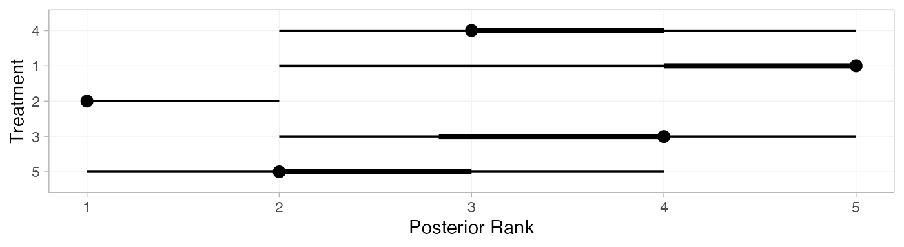

``` r
(contr_rankprobs <- posterior_rank_probs(contr_fit_FE))
#>      p_rank[1] p_rank[2] p_rank[3] p_rank[4] p_rank[5]
#> d[4]      0.00      0.04      0.50      0.39      0.07
#> d[1]      0.00      0.03      0.06      0.11      0.80
#> d[2]      0.96      0.03      0.00      0.00      0.00
#> d[3]      0.00      0.17      0.25      0.45      0.12
#> d[5]      0.03      0.72      0.19      0.05      0.01
plot(contr_rankprobs)
```

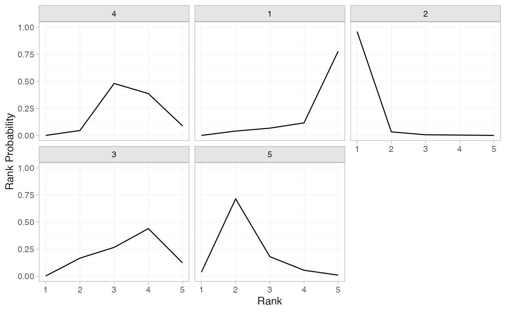

``` r
(contr_cumrankprobs <- posterior_rank_probs(contr_fit_FE, cumulative = TRUE))
#>      p_rank[1] p_rank[2] p_rank[3] p_rank[4] p_rank[5]
#> d[4]      0.00      0.04      0.54      0.93         1
#> d[1]      0.00      0.03      0.09      0.20         1
#> d[2]      0.96      0.99      1.00      1.00         1
#> d[3]      0.00      0.18      0.43      0.88         1
#> d[5]      0.03      0.75      0.94      0.99         1
plot(contr_cumrankprobs)
```


## Analysis of mixed arm-based and contrast-based data

We now perform an analysis where some studies contribute arm-based data,
and other contribute contrast-based data. Replicating Dias et al.
([2011](#ref-TSD2)), we consider arm-based data from studies 1-3, and
contrast-based data from studies 4-7.

``` r
studies <- parkinsons$studyn
(parkinsons_arm <- parkinsons[studies %in% 1:3, ])
#>   studyn trtn     y    se   n  diff se_diff
#> 1      1    1 -1.22 0.504  54    NA   0.504
#> 2      1    3 -1.53 0.439  95 -0.31   0.668
#> 3      2    1 -0.70 0.282 172    NA   0.282
#> 4      2    2 -2.40 0.258 173 -1.70   0.382
#> 5      3    1 -0.30 0.505  76    NA   0.505
#> 6      3    2 -2.60 0.510  71 -2.30   0.718
#> 7      3    4 -1.20 0.478  81 -0.90   0.695
(parkinsons_contr <- parkinsons[studies %in% 4:7, ])
#>    studyn trtn     y    se   n  diff se_diff
#> 8       4    3 -0.24 0.265 128    NA   0.265
#> 9       4    4 -0.59 0.354  72 -0.35   0.442
#> 10      5    3 -0.73 0.335  80    NA   0.335
#> 11      5    4 -0.18 0.442  46  0.55   0.555
#> 12      6    4 -2.20 0.197 137    NA   0.197
#> 13      6    5 -2.50 0.190 131 -0.30   0.274
#> 14      7    4 -1.80 0.200 154    NA   0.200
#> 15      7    5 -2.10 0.250 143 -0.30   0.320
```

### Setting up the network

We use the functions
[`set_agd_arm()`](https://dmphillippo.github.io/multinma/dev/reference/set_agd_arm.md)
and
[`set_agd_contrast()`](https://dmphillippo.github.io/multinma/dev/reference/set_agd_contrast.md)
to set up the respective data sources within the network, and then
combine together with
[`combine_network()`](https://dmphillippo.github.io/multinma/dev/reference/combine_network.md).

``` r
mix_arm_net <- set_agd_arm(parkinsons_arm, 
                           study = studyn,
                           trt = trtn,
                           y = y, 
                           se = se,
                           sample_size = n)

mix_contr_net <- set_agd_contrast(parkinsons_contr, 
                                  study = studyn,
                                  trt = trtn,
                                  y = diff, 
                                  se = se_diff,
                                  sample_size = n)

mix_net <- combine_network(mix_arm_net, mix_contr_net)
mix_net
#> A network with 3 AgD studies (arm-based), and 4 AgD studies (contrast-based).
#> 
#> ------------------------------------------------------- AgD studies (arm-based) ---- 
#>  Study Treatment arms
#>  1     2: 1 | 3      
#>  2     2: 1 | 2      
#>  3     3: 4 | 1 | 2  
#> 
#>  Outcome type: continuous
#> -------------------------------------------------- AgD studies (contrast-based) ---- 
#>  Study Treatment arms
#>  4     2: 4 | 3      
#>  5     2: 4 | 3      
#>  6     2: 4 | 5      
#>  7     2: 4 | 5      
#> 
#>  Outcome type: continuous
#> ------------------------------------------------------------------------------------
#> Total number of treatments: 5
#> Total number of studies: 7
#> Reference treatment is: 4
#> Network is connected
```

The `sample_size` argument is optional, but enables the nodes to be
weighted by sample size in the network plot.

Plot the network structure.

``` r
plot(mix_net, weight_edges = TRUE, weight_nodes = TRUE)
```


### Meta-analysis models

We fit both fixed effect (FE) and random effects (RE) models.

#### Fixed effect meta-analysis

First, we fit a fixed effect model using the
[`nma()`](https://dmphillippo.github.io/multinma/dev/reference/nma.md)
function with `trt_effects = "fixed"`. We use \mathrm{N}(0, 100^2) prior
distributions for the treatment effects d_k and study-specific
intercepts \mu_j. We can examine the range of parameter values implied
by these prior distributions with the
[`summary()`](https://rdrr.io/r/base/summary.html) method:

``` r
summary(normal(scale = 100))
#> A Normal prior distribution: location = 0, scale = 100.
#> 50% of the prior density lies between -67.45 and 67.45.
#> 95% of the prior density lies between -196 and 196.
```

The model is fitted using the
[`nma()`](https://dmphillippo.github.io/multinma/dev/reference/nma.md)
function.

``` r
mix_fit_FE <- nma(mix_net, 
                  trt_effects = "fixed",
                  prior_intercept = normal(scale = 100),
                  prior_trt = normal(scale = 100))
#> Note: Setting "4" as the network reference treatment.
```

Basic parameter summaries are given by the
[`print()`](https://rdrr.io/r/base/print.html) method:

``` r
mix_fit_FE
#> A fixed effects NMA with a normal likelihood (identity link).
#> Inference for Stan model: normal.
#> 4 chains, each with iter=2000; warmup=1000; thin=1; 
#> post-warmup draws per chain=1000, total post-warmup draws=4000.
#> 
#>       mean se_mean   sd  2.5%   25%   50%   75% 97.5% n_eff Rhat
#> d[1]  0.51    0.01 0.48 -0.43  0.18  0.50  0.83  1.46  1586    1
#> d[2] -1.31    0.01 0.53 -2.35 -1.66 -1.31 -0.94 -0.31  1626    1
#> d[3]  0.04    0.01 0.32 -0.62 -0.18  0.04  0.26  0.64  2553    1
#> d[5] -0.30    0.00 0.21 -0.72 -0.44 -0.29 -0.16  0.11  3050    1
#> lp__ -4.66    0.05 1.87 -9.12 -5.73 -4.34 -3.23 -2.01  1640    1
#> 
#> Samples were drawn using NUTS(diag_e) at Thu Dec 11 16:04:30 2025.
#> For each parameter, n_eff is a crude measure of effective sample size,
#> and Rhat is the potential scale reduction factor on split chains (at 
#> convergence, Rhat=1).
```

By default, summaries of the study-specific intercepts \mu_j are hidden,
but could be examined by changing the `pars` argument:

``` r
# Not run
print(mix_fit_FE, pars = c("d", "mu"))
```

The prior and posterior distributions can be compared visually using the
[`plot_prior_posterior()`](https://dmphillippo.github.io/multinma/dev/reference/plot_prior_posterior.md)
function:

``` r
plot_prior_posterior(mix_fit_FE)
```

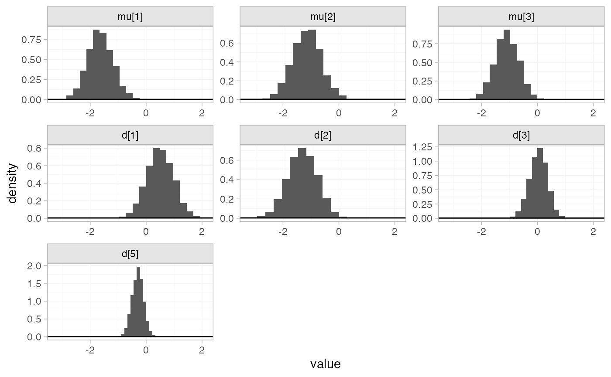

#### Random effects meta-analysis

We now fit a random effects model using the
[`nma()`](https://dmphillippo.github.io/multinma/dev/reference/nma.md)
function with `trt_effects = "random"`. Again, we use \mathrm{N}(0,
100^2) prior distributions for the treatment effects d_k and
study-specific intercepts \mu_j, and we additionally use a
\textrm{half-N}(5^2) prior for the heterogeneity standard deviation
\tau. We can examine the range of parameter values implied by these
prior distributions with the
[`summary()`](https://rdrr.io/r/base/summary.html) method:

``` r
summary(normal(scale = 100))
#> A Normal prior distribution: location = 0, scale = 100.
#> 50% of the prior density lies between -67.45 and 67.45.
#> 95% of the prior density lies between -196 and 196.
summary(half_normal(scale = 5))
#> A half-Normal prior distribution: scale = 5.
#> 50% of the prior density lies between 0 and 3.37.
#> 95% of the prior density lies between 0 and 9.8.
```

Fitting the RE model

``` r
mix_fit_RE <- nma(mix_net, 
                  seed = 437219664,
                  trt_effects = "random",
                  prior_intercept = normal(scale = 100),
                  prior_trt = normal(scale = 100),
                  prior_het = half_normal(scale = 5),
                  adapt_delta = 0.99)
#> Note: Setting "4" as the network reference treatment.
```

We do see a small number of divergent transition errors, which cannot
simply be removed by increasing the value of the `adapt_delta` argument
(by default set to `0.95` for RE models). To diagnose, we use the
[`pairs()`](https://rdrr.io/r/graphics/pairs.html) method to investigate
where in the posterior distribution these divergences are happening
(indicated by red crosses):

``` r
pairs(mix_fit_RE, pars = c("d[3]", "delta[4: 4 vs. 3]", "tau"))
```

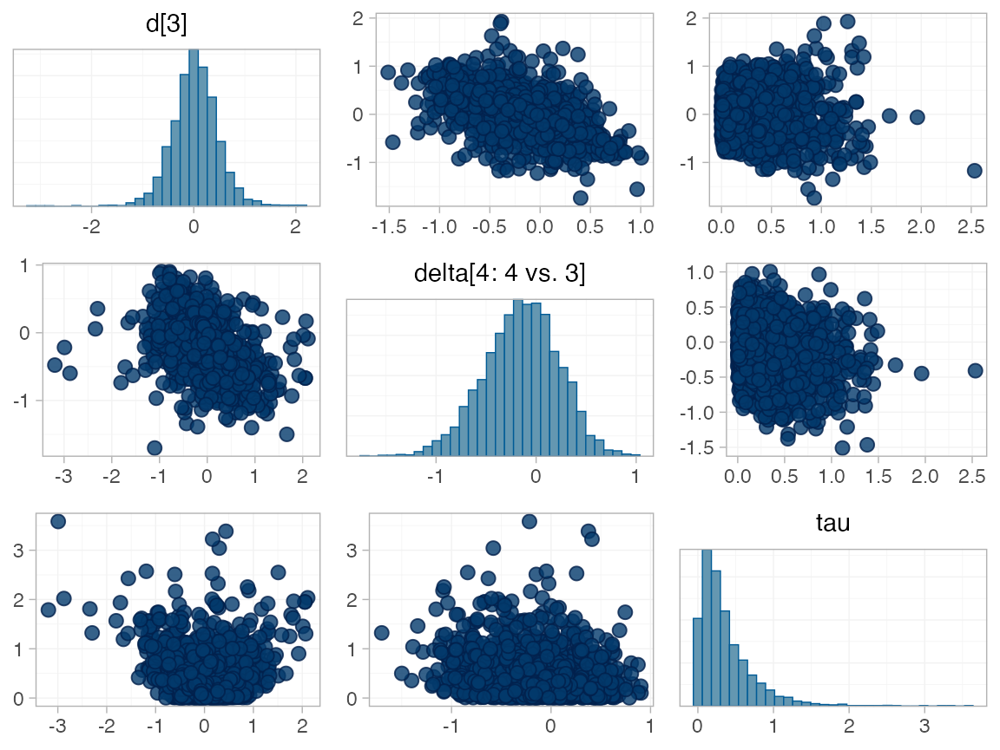

The divergent transitions occur in the upper tail of the heterogeneity
standard deviation. In this case, with only a small number of studies,
there is not very much information to estimate the heterogeneity
standard deviation and the prior distribution may be too heavy-tailed.
We could consider a more informative prior distribution for the
heterogeneity variance to aid estimation.

Basic parameter summaries are given by the
[`print()`](https://rdrr.io/r/base/print.html) method:

``` r
mix_fit_RE
#> A random effects NMA with a normal likelihood (identity link).
#> Inference for Stan model: normal.
#> 4 chains, each with iter=2000; warmup=1000; thin=1; 
#> post-warmup draws per chain=1000, total post-warmup draws=4000.
#> 
#>        mean se_mean   sd   2.5%    25%    50%   75% 97.5% n_eff Rhat
#> d[1]   0.55    0.01 0.59  -0.61   0.15   0.54  0.91  1.73  1945    1
#> d[2]  -1.30    0.01 0.67  -2.61  -1.73  -1.29 -0.88  0.01  2026    1
#> d[3]   0.03    0.01 0.45  -0.86  -0.24   0.02  0.30  0.92  2923    1
#> d[5]  -0.31    0.01 0.40  -1.13  -0.51  -0.30 -0.09  0.47  2330    1
#> lp__ -10.88    0.09 3.26 -18.03 -12.90 -10.60 -8.59 -5.26  1465    1
#> tau    0.37    0.01 0.36   0.01   0.12   0.27  0.49  1.28  1080    1
#> 
#> Samples were drawn using NUTS(diag_e) at Thu Dec 11 16:04:35 2025.
#> For each parameter, n_eff is a crude measure of effective sample size,
#> and Rhat is the potential scale reduction factor on split chains (at 
#> convergence, Rhat=1).
```

By default, summaries of the study-specific intercepts \mu_j and
study-specific relative effects \delta\_{jk} are hidden, but could be
examined by changing the `pars` argument:

``` r
# Not run
print(mix_fit_RE, pars = c("d", "mu", "delta"))
```

The prior and posterior distributions can be compared visually using the
[`plot_prior_posterior()`](https://dmphillippo.github.io/multinma/dev/reference/plot_prior_posterior.md)
function:

``` r
plot_prior_posterior(mix_fit_RE)
```

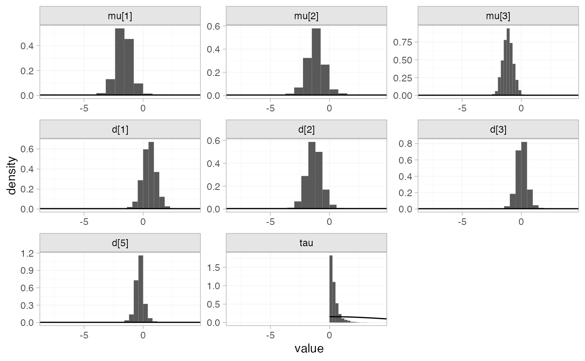

#### Model comparison

Model fit can be checked using the
[`dic()`](https://dmphillippo.github.io/multinma/dev/reference/dic.md)
function:

``` r
(mix_dic_FE <- dic(mix_fit_FE))
#> Residual deviance: 9.3 (on 11 data points)
#>                pD: 7
#>               DIC: 16.3
```

``` r
(mix_dic_RE <- dic(mix_fit_RE))
#> Residual deviance: 9.6 (on 11 data points)
#>                pD: 8.4
#>               DIC: 18
```

Both models fit the data well, having posterior mean residual deviance
close to the number of data points. The DIC is similar between models,
so we choose the FE model based on parsimony.

We can also examine the residual deviance contributions with the
corresponding [`plot()`](https://rdrr.io/r/graphics/plot.default.html)
method.

``` r
plot(mix_dic_FE)
```

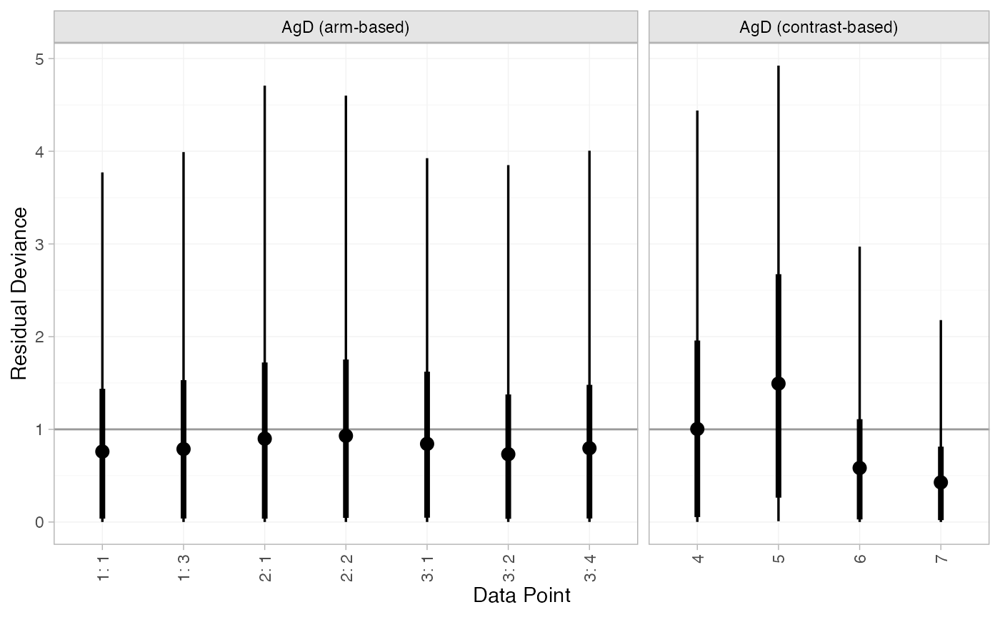

``` r
plot(mix_dic_RE)
```

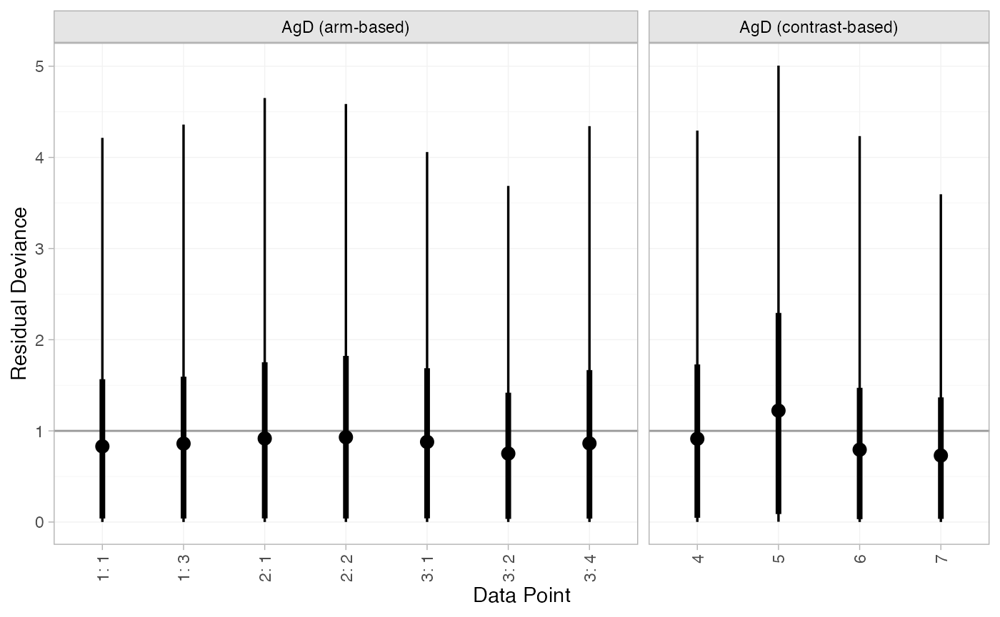

### Further results

For comparison with Dias et al. ([2011](#ref-TSD2)), we can produce
relative effects against placebo using the
[`relative_effects()`](https://dmphillippo.github.io/multinma/dev/reference/relative_effects.md)
function with `trt_ref = 1`:

``` r
(mix_releff_FE <- relative_effects(mix_fit_FE, trt_ref = 1))
#>       mean   sd  2.5%   25%   50%   75% 97.5% Bulk_ESS Tail_ESS Rhat
#> d[4] -0.51 0.48 -1.46 -0.83 -0.50 -0.18  0.43     1606     2262    1
#> d[2] -1.81 0.33 -2.47 -2.04 -1.81 -1.58 -1.16     5739     2842    1
#> d[3] -0.47 0.49 -1.43 -0.80 -0.47 -0.14  0.50     2409     3011    1
#> d[5] -0.80 0.53 -1.85 -1.16 -0.79 -0.45  0.27     1713     2275    1
plot(mix_releff_FE, ref_line = 0)
```


``` r
(mix_releff_RE <- relative_effects(mix_fit_RE, trt_ref = 1))
#>       mean   sd  2.5%   25%   50%   75% 97.5% Bulk_ESS Tail_ESS Rhat
#> d[4] -0.55 0.59 -1.73 -0.91 -0.54 -0.15  0.61     1952     2171    1
#> d[2] -1.85 0.49 -2.89 -2.13 -1.85 -1.55 -0.96     4054     2813    1
#> d[3] -0.52 0.62 -1.74 -0.89 -0.51 -0.13  0.64     2989     2480    1
#> d[5] -0.85 0.71 -2.23 -1.28 -0.84 -0.40  0.51     2067     1959    1
plot(mix_releff_RE, ref_line = 0)
```

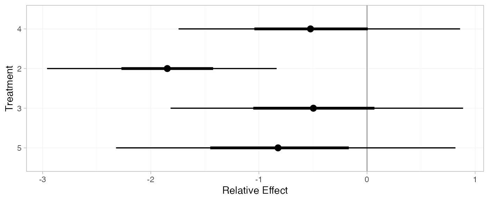

Following Dias et al. ([2011](#ref-TSD2)), we produce absolute
predictions of the mean off-time reduction on each treatment assuming a
Normal distribution for the outcomes on treatment 1 (placebo) with mean
-0.73 and precision 21. We use the
[`predict()`](https://rdrr.io/r/stats/predict.html) method, where the
`baseline` argument takes a
[`distr()`](https://dmphillippo.github.io/multinma/dev/reference/distr.md)
distribution object with which we specify the corresponding Normal
distribution, and we specify `baseline_trt = 1` to indicate that the
baseline distribution corresponds to treatment 1. (Strictly speaking,
`type = "response"` is unnecessary here, since the identity link
function was used.)

``` r
mix_pred_FE <- predict(mix_fit_FE, 
                       baseline = distr(qnorm, mean = -0.73, sd = 21^-0.5),
                       type = "response",
                       baseline_trt = 1)
mix_pred_FE
#>          mean   sd  2.5%   25%   50%   75% 97.5% Bulk_ESS Tail_ESS Rhat
#> pred[4] -1.23 0.53 -2.27 -1.59 -1.22 -0.88 -0.17     1777     2613    1
#> pred[1] -0.72 0.22 -1.14 -0.87 -0.72 -0.58 -0.29     3556     3638    1
#> pred[2] -2.53 0.39 -3.31 -2.80 -2.53 -2.26 -1.78     5108     3551    1
#> pred[3] -1.19 0.54 -2.24 -1.55 -1.21 -0.82 -0.10     2525     3106    1
#> pred[5] -1.52 0.57 -2.66 -1.91 -1.52 -1.14 -0.37     1842     2382    1
plot(mix_pred_FE)
```

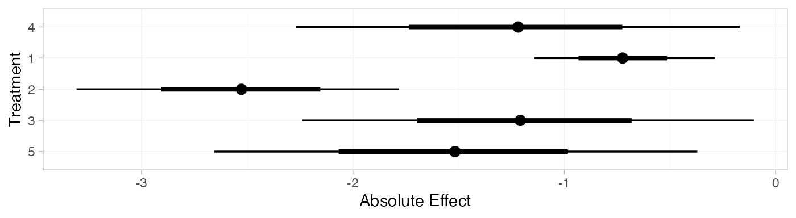

``` r
mix_pred_RE <- predict(mix_fit_RE, 
                       baseline = distr(qnorm, mean = -0.73, sd = 21^-0.5),
                       type = "response",
                       baseline_trt = 1)
mix_pred_RE
#>          mean   sd  2.5%   25%   50%   75% 97.5% Bulk_ESS Tail_ESS Rhat
#> pred[4] -1.27 0.63 -2.52 -1.68 -1.27 -0.87 -0.06     2088     2415    1
#> pred[1] -0.73 0.22 -1.17 -0.88 -0.73 -0.58 -0.31     4051     3817    1
#> pred[2] -2.58 0.54 -3.68 -2.90 -2.57 -2.24 -1.57     4000     2896    1
#> pred[3] -1.25 0.65 -2.52 -1.66 -1.24 -0.84  0.01     3099     2869    1
#> pred[5] -1.58 0.74 -2.99 -2.04 -1.58 -1.14 -0.13     2124     2509    1
plot(mix_pred_RE)
```

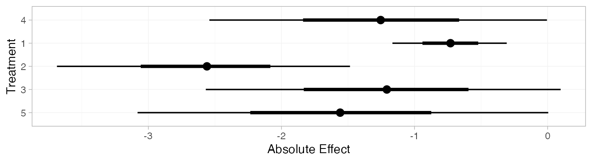

If the `baseline` argument is omitted, predictions of mean off-time
reduction will be produced for every *arm-based* study in the network
based on their estimated baseline response \mu_j:

``` r
mix_pred_FE_studies <- predict(mix_fit_FE, type = "response")
mix_pred_FE_studies
#> ---------------------------------------------------------------------- Study: 1 ---- 
#> 
#>             mean   sd  2.5%   25%   50%   75% 97.5% Bulk_ESS Tail_ESS Rhat
#> pred[1: 4] -1.64 0.45 -2.50 -1.94 -1.65 -1.34 -0.70     2068     2403    1
#> pred[1: 1] -1.13 0.43 -1.95 -1.42 -1.14 -0.84 -0.29     3407     2920    1
#> pred[1: 2] -2.94 0.52 -3.93 -3.29 -2.94 -2.59 -1.96     3148     3019    1
#> pred[1: 3] -1.60 0.39 -2.35 -1.86 -1.61 -1.34 -0.84     3552     3294    1
#> pred[1: 5] -1.93 0.50 -2.88 -2.28 -1.93 -1.60 -0.94     2099     2516    1
#> 
#> ---------------------------------------------------------------------- Study: 2 ---- 
#> 
#>             mean   sd  2.5%   25%   50%   75% 97.5% Bulk_ESS Tail_ESS Rhat
#> pred[2: 4] -1.14 0.52 -2.14 -1.50 -1.13 -0.79 -0.10     1589     2167    1
#> pred[2: 1] -0.64 0.26 -1.15 -0.81 -0.63 -0.46 -0.11     4656     3462    1
#> pred[2: 2] -2.45 0.24 -2.93 -2.61 -2.45 -2.28 -1.96     5173     3692    1
#> pred[2: 3] -1.11 0.53 -2.15 -1.46 -1.11 -0.74 -0.05     2303     2812    1
#> pred[2: 5] -1.44 0.56 -2.53 -1.83 -1.44 -1.05 -0.31     1690     2295    1
#> 
#> ---------------------------------------------------------------------- Study: 3 ---- 
#> 
#>             mean   sd  2.5%   25%   50%   75% 97.5% Bulk_ESS Tail_ESS Rhat
#> pred[3: 4] -1.10 0.42 -1.94 -1.38 -1.10 -0.81 -0.28     2007     2612    1
#> pred[3: 1] -0.59 0.36 -1.30 -0.84 -0.60 -0.35  0.11     4337     2979    1
#> pred[3: 2] -2.41 0.39 -3.17 -2.66 -2.41 -2.14 -1.66     3882     3167    1
#> pred[3: 3] -1.06 0.47 -1.99 -1.39 -1.04 -0.75 -0.14     3112     2988    1
#> pred[3: 5] -1.40 0.48 -2.34 -1.71 -1.40 -1.06 -0.47     2072     2409    1
plot(mix_pred_FE_studies)
```

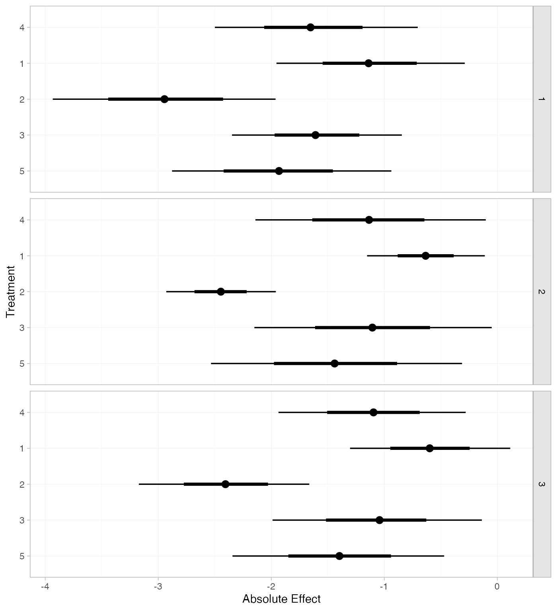

We can also produce treatment rankings, rank probabilities, and
cumulative rank probabilities.

``` r
(mix_ranks <- posterior_ranks(mix_fit_FE))
#>         mean   sd 2.5% 25% 50% 75% 97.5% Bulk_ESS Tail_ESS Rhat
#> rank[4] 3.51 0.71    2   3   3   4     5     2379       NA    1
#> rank[1] 4.63 0.79    2   5   5   5     5     2077       NA    1
#> rank[2] 1.05 0.26    1   1   1   1     2     2572     2682    1
#> rank[3] 3.52 0.92    2   3   4   4     5     3397       NA    1
#> rank[5] 2.29 0.68    1   2   2   3     4     2517     2745    1
plot(mix_ranks)
```

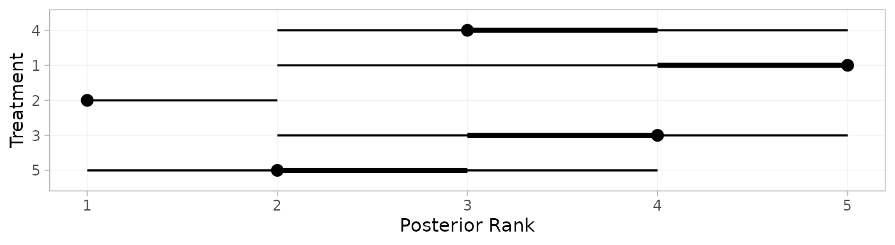

``` r
(mix_rankprobs <- posterior_rank_probs(mix_fit_FE))
#>      p_rank[1] p_rank[2] p_rank[3] p_rank[4] p_rank[5]
#> d[4]      0.00      0.04      0.49      0.39      0.08
#> d[1]      0.00      0.04      0.07      0.11      0.78
#> d[2]      0.96      0.03      0.01      0.00      0.00
#> d[3]      0.00      0.17      0.25      0.45      0.13
#> d[5]      0.04      0.71      0.19      0.05      0.01
plot(mix_rankprobs)
```

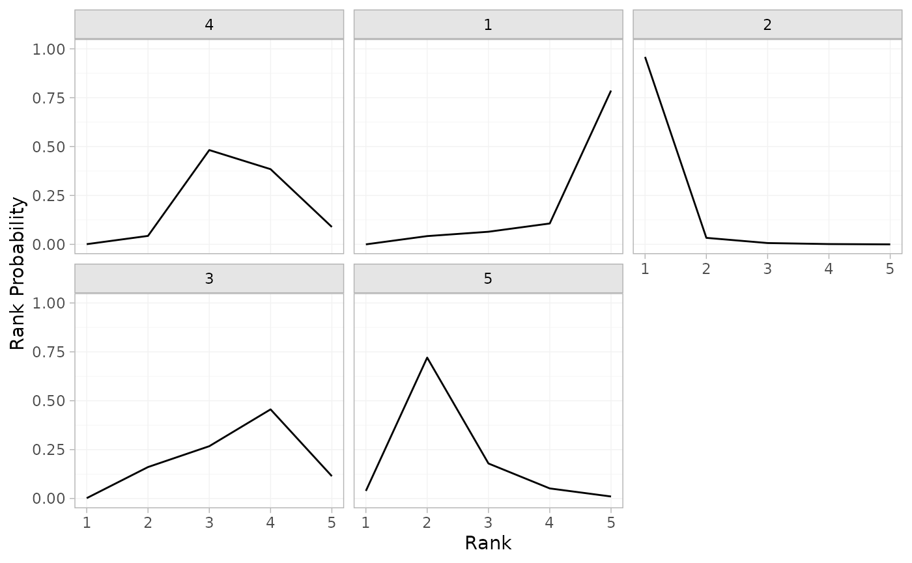

``` r
(mix_cumrankprobs <- posterior_rank_probs(mix_fit_FE, cumulative = TRUE))
#>      p_rank[1] p_rank[2] p_rank[3] p_rank[4] p_rank[5]
#> d[4]      0.00      0.04      0.53      0.92         1
#> d[1]      0.00      0.04      0.11      0.22         1
#> d[2]      0.96      0.99      1.00      1.00         1
#> d[3]      0.00      0.17      0.43      0.87         1
#> d[5]      0.04      0.75      0.94      0.99         1
plot(mix_cumrankprobs)
```

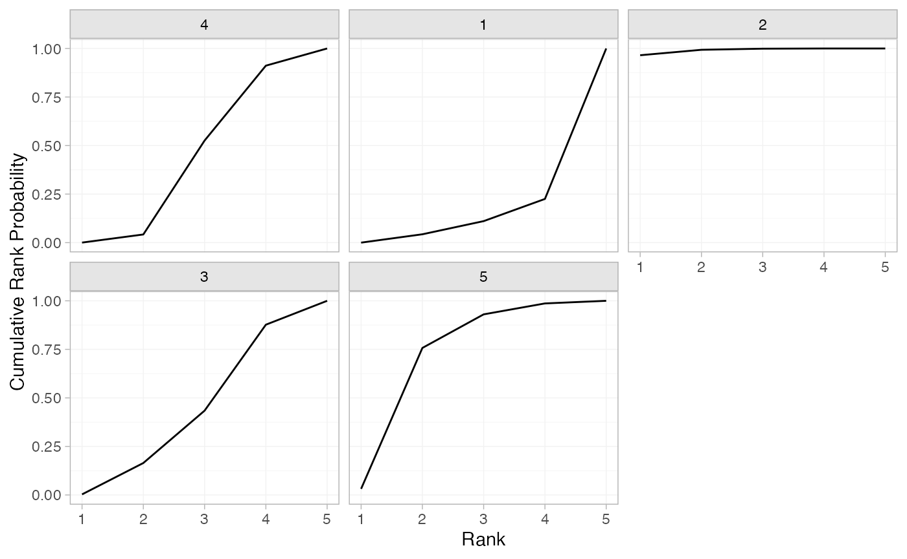

## References

Dias, S., N. J. Welton, A. J. Sutton, and A. E. Ades. 2011. “NICE DSU
Technical Support Document 2: A Generalised Linear Modelling Framework
for Pair-Wise and Network Meta-Analysis of Randomised Controlled
Trials.” National Institute for Health and Care Excellence.
<https://www.sheffield.ac.uk/nice-dsu>.
