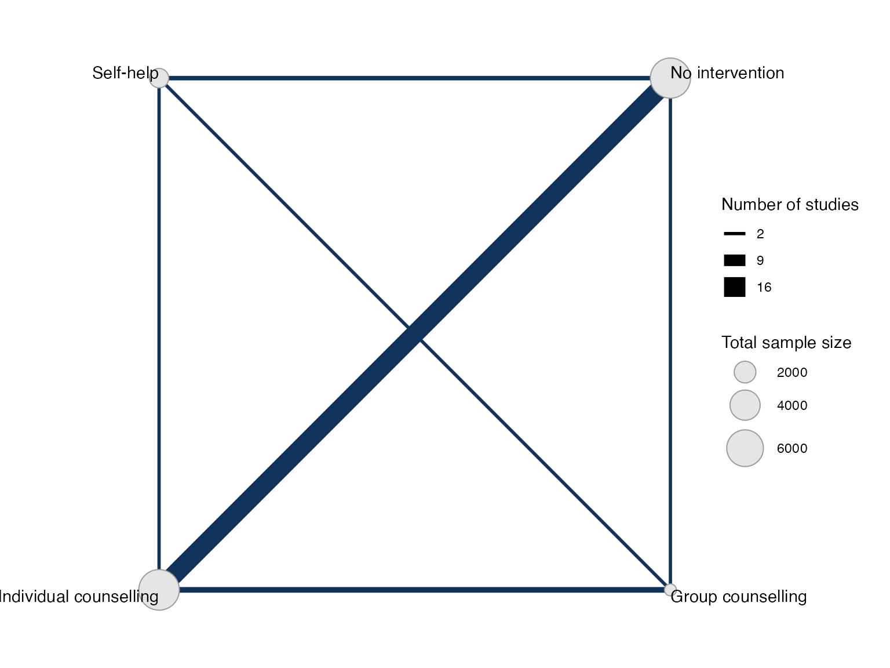
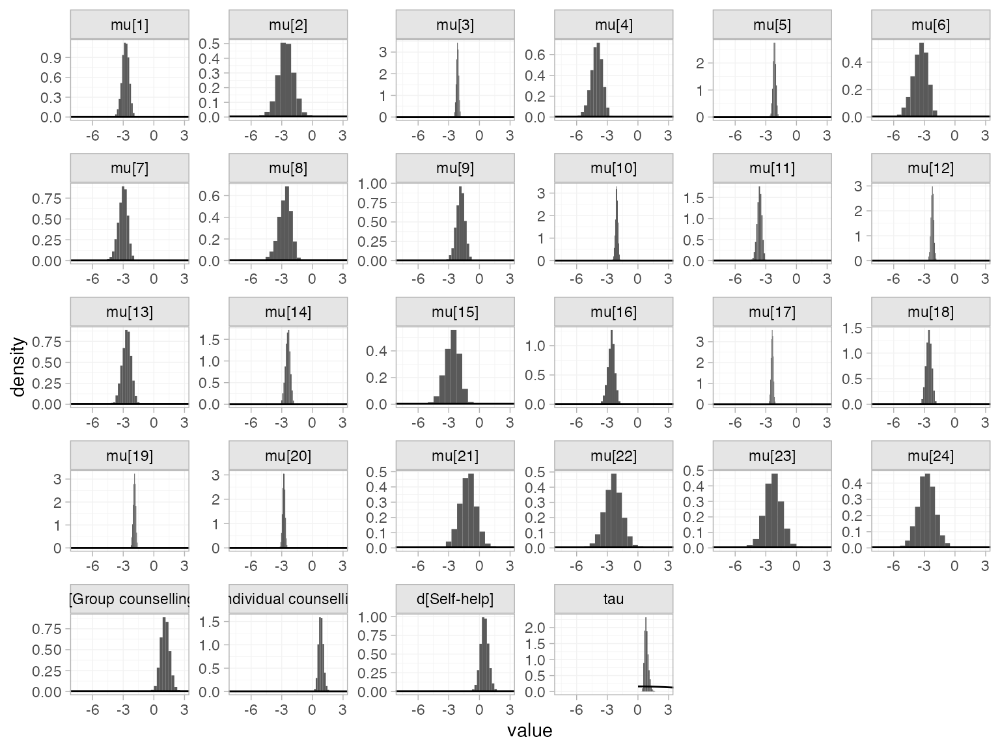
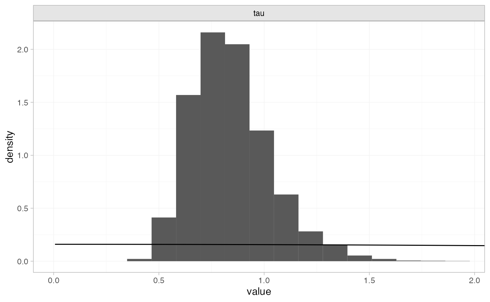
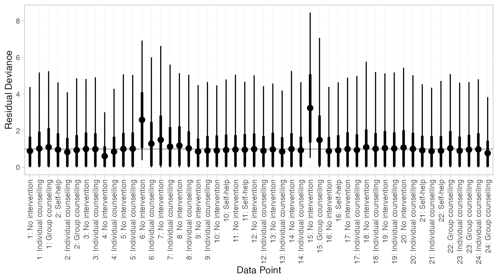
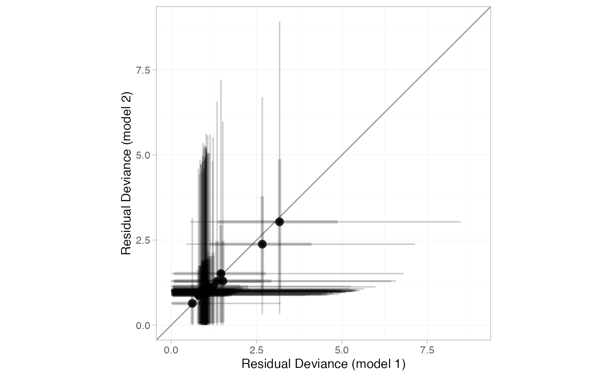
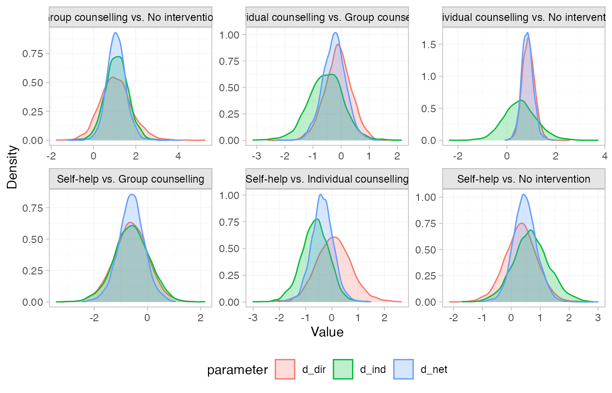
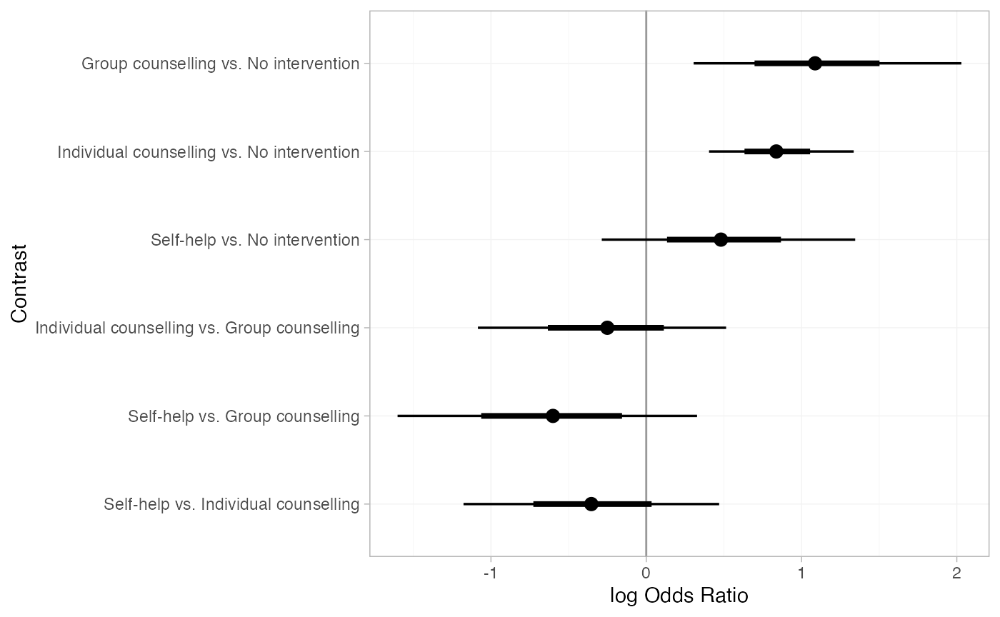
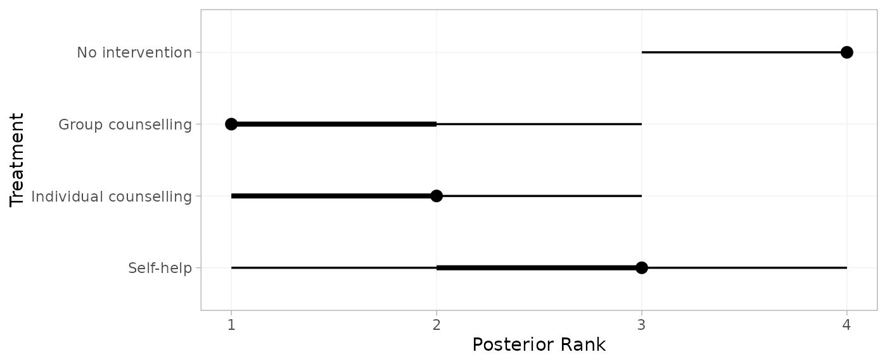
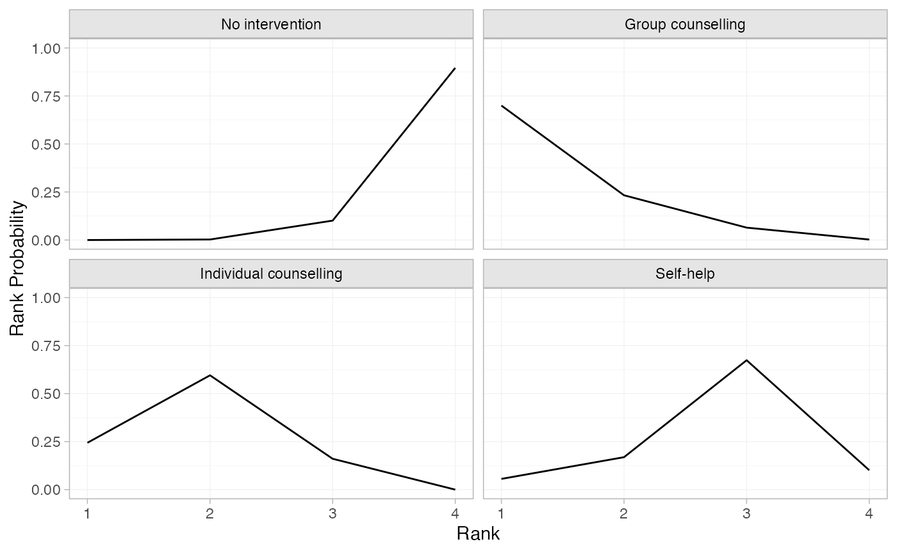
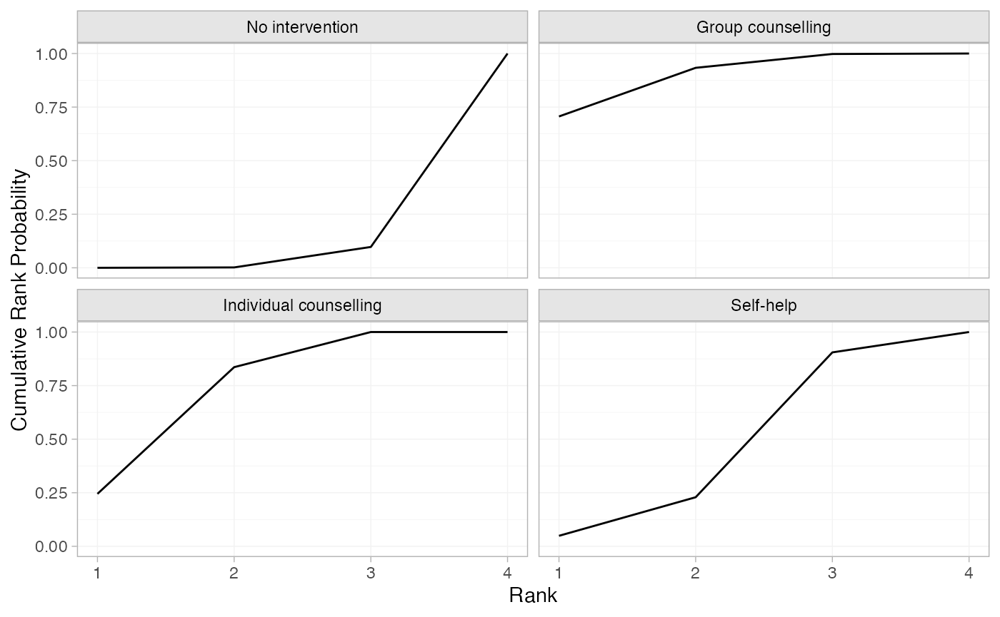

# Example: Smoking cessation

``` r

library(multinma)
options(mc.cores = parallel::detectCores())
```

    #> For execution on a local, multicore CPU with excess RAM we recommend calling
    #> options(mc.cores = parallel::detectCores())
    #> 
    #> Attaching package: 'multinma'
    #> The following objects are masked from 'package:stats':
    #> 
    #>     dgamma, pgamma, qgamma

This vignette describes the analysis of smoking cessation data
([Hasselblad 1998](#ref-Hasselblad1998)), replicating the analysis in
NICE Technical Support Document 4 ([Dias et al. 2011](#ref-TSD4)). The
data are available in this package as `smoking`:

``` r

head(smoking)
#>   studyn trtn                   trtc  r   n
#> 1      1    1        No intervention  9 140
#> 2      1    3 Individual counselling 23 140
#> 3      1    4      Group counselling 10 138
#> 4      2    2              Self-help 11  78
#> 5      2    3 Individual counselling 12  85
#> 6      2    4      Group counselling 29 170
```

## Setting up the network

We begin by setting up the network. We have arm-level count data giving
the number quitting smoking (`r`) out of the total (`n`) in each arm, so
we use the function
[`set_agd_arm()`](https://dmphillippo.github.io/multinma/dev/reference/set_agd_arm.md).
Treatment “No intervention” is set as the network reference treatment.

``` r

smknet <- set_agd_arm(smoking, 
                      study = studyn,
                      trt = trtc,
                      r = r, 
                      n = n,
                      trt_ref = "No intervention")
smknet
#> A network with 24 AgD studies (arm-based).
#> 
#> ------------------------------------------------------- AgD studies (arm-based) ---- 
#>  Study Treatment arms                                                 
#>  1     3: No intervention | Group counselling | Individual counselling
#>  2     3: Group counselling | Individual counselling | Self-help      
#>  3     2: No intervention | Individual counselling                    
#>  4     2: No intervention | Individual counselling                    
#>  5     2: No intervention | Individual counselling                    
#>  6     2: No intervention | Individual counselling                    
#>  7     2: No intervention | Individual counselling                    
#>  8     2: No intervention | Individual counselling                    
#>  9     2: No intervention | Individual counselling                    
#>  10    2: No intervention | Self-help                                 
#>  ... plus 14 more studies
#> 
#>  Outcome type: count
#> ------------------------------------------------------------------------------------
#> Total number of treatments: 4
#> Total number of studies: 24
#> Reference treatment is: No intervention
#> Network is connected
```

Plot the network structure.

``` r

plot(smknet, weight_edges = TRUE, weight_nodes = TRUE)
```



## Random effects NMA

Following TSD 4, we fit a random effects NMA model, using the
[`nma()`](https://dmphillippo.github.io/multinma/dev/reference/nma.md)
function with `trt_effects = "random"`. We use \mathrm{N}(0, 100^2)
prior distributions for the treatment effects d_k and study-specific
intercepts \mu_j, and a \textrm{half-N}(5^2) prior distribution for the
between-study heterogeneity standard deviation \tau. We can examine the
range of parameter values implied by these prior distributions with the
[`summary()`](https://rdrr.io/r/base/summary.html) method:

``` r

summary(normal(scale = 100))
#> A Normal prior distribution: location = 0, scale = 100.
#> 50% of the prior density lies between -67.45 and 67.45.
#> 95% of the prior density lies between -196 and 196.
```

``` r

summary(half_normal(scale = 5))
#> A half-Normal prior distribution: scale = 5.
#> 50% of the prior density lies between 0 and 3.37.
#> 95% of the prior density lies between 0 and 9.8.
```

The model is fitted using the
[`nma()`](https://dmphillippo.github.io/multinma/dev/reference/nma.md)
function. By default, this will use a Binomial likelihood and a logit
link function, auto-detected from the data.

``` r

smkfit <- nma(smknet, 
              trt_effects = "random",
              prior_intercept = normal(scale = 100),
              prior_trt = normal(scale = 100),
              prior_het = normal(scale = 5))
```

Basic parameter summaries are given by the
[`print()`](https://rdrr.io/r/base/print.html) method:

``` r

smkfit
#> A random effects NMA with a binomial likelihood (logit link).
#> Inference for Stan model: binomial_1par.
#> 4 chains, each with iter=2000; warmup=1000; thin=1; 
#> post-warmup draws per chain=1000, total post-warmup draws=4000.
#> 
#>                               mean se_mean   sd     2.5%      25%      50%      75%    97.5%
#> d[Group counselling]          1.11    0.01 0.45     0.22     0.82     1.10     1.40     2.05
#> d[Individual counselling]     0.85    0.01 0.25     0.39     0.68     0.83     1.00     1.36
#> d[Self-help]                  0.49    0.01 0.42    -0.32     0.23     0.48     0.75     1.34
#> lp__                      -5767.58    0.19 6.30 -5781.19 -5771.58 -5767.27 -5763.13 -5756.26
#> tau                           0.85    0.01 0.18     0.56     0.72     0.82     0.96     1.26
#>                           n_eff Rhat
#> d[Group counselling]       1582 1.00
#> d[Individual counselling]   889 1.01
#> d[Self-help]               1751 1.00
#> lp__                       1137 1.01
#> tau                        1067 1.00
#> 
#> Samples were drawn using NUTS(diag_e) at Wed Jun 17 14:46:55 2026.
#> For each parameter, n_eff is a crude measure of effective sample size,
#> and Rhat is the potential scale reduction factor on split chains (at 
#> convergence, Rhat=1).
```

By default, summaries of the study-specific intercepts \mu_j and
study-specific relative effects \delta\_{jk} are hidden, but could be
examined by changing the `pars` argument:

``` r

# Not run
print(smkfit, pars = c("d", "tau", "mu", "delta"))
```

The prior and posterior distributions can be compared visually using the
[`plot_prior_posterior()`](https://dmphillippo.github.io/multinma/dev/reference/plot_prior_posterior.md)
function:

``` r

plot_prior_posterior(smkfit)
```



By default, this displays all model parameters given prior distributions
(in this case d_k, \mu_j, and \tau), but this may be changed using the
`prior` argument:

``` r

plot_prior_posterior(smkfit, prior = "het")
```



Model fit can be checked using the
[`dic()`](https://dmphillippo.github.io/multinma/dev/reference/dic.md)
function

``` r

(dic_consistency <- dic(smkfit))
#> Residual deviance: 53.5 (on 50 data points)
#>                pD: 43.5
#>               DIC: 97
```

and the residual deviance contributions examined with the corresponding
[`plot()`](https://rdrr.io/r/graphics/plot.default.html) method

``` r

plot(dic_consistency)
```



Overall model fit seems to be adequate, with almost all points showing
good fit (mean residual deviance contribution of 1). The only two points
with higher residual deviance (i.e. worse fit) correspond to the two
zero counts in the data:

``` r

smoking[smoking$r == 0, ]
#>    studyn trtn            trtc r  n
#> 13      6    1 No intervention 0 33
#> 31     15    1 No intervention 0 20
```

## Checking for inconsistency

> **Note:** The results of the inconsistency models here are slightly
> different to those of Dias et al. ([2010](#ref-Dias2010),
> [2011](#ref-TSD4)), although the overall conclusions are the same.
> This is due to the presence of multi-arm trials and a different
> ordering of treatments, meaning that inconsistency is parameterised
> differently within the multi-arm trials. The same results as Dias et
> al. are obtained if the network is instead set up with `trtn` as the
> treatment variable.

### Unrelated mean effects

We first fit an unrelated mean effects (UME) model ([Dias et al.
2011](#ref-TSD4)) to assess the consistency assumption. Again, we use
the function
[`nma()`](https://dmphillippo.github.io/multinma/dev/reference/nma.md),
but now with the argument `consistency = "ume"`.

``` r

smkfit_ume <- nma(smknet, 
                  consistency = "ume",
                  trt_effects = "random",
                  prior_intercept = normal(scale = 100),
                  prior_trt = normal(scale = 100),
                  prior_het = normal(scale = 5))
smkfit_ume
#> A random effects NMA with a binomial likelihood (logit link).
#> An inconsistency model ('ume') was fitted.
#> Inference for Stan model: binomial_1par.
#> 4 chains, each with iter=2000; warmup=1000; thin=1; 
#> post-warmup draws per chain=1000, total post-warmup draws=4000.
#> 
#>                                                     mean se_mean   sd     2.5%      25%
#> d[Group counselling vs. No intervention]            1.13    0.02 0.79    -0.36     0.60
#> d[Individual counselling vs. No intervention]       0.90    0.01 0.27     0.38     0.72
#> d[Self-help vs. No intervention]                    0.36    0.01 0.57    -0.76     0.00
#> d[Individual counselling vs. Group counselling]    -0.30    0.01 0.59    -1.48    -0.68
#> d[Self-help vs. Group counselling]                 -0.61    0.01 0.70    -1.99    -1.06
#> d[Self-help vs. Individual counselling]             0.21    0.02 1.04    -1.92    -0.45
#> lp__                                            -5765.38    0.22 6.51 -5779.01 -5769.62
#> tau                                                 0.93    0.01 0.22     0.58     0.77
#>                                                      50%      75%    97.5% n_eff Rhat
#> d[Group counselling vs. No intervention]            1.10     1.63     2.73  2279    1
#> d[Individual counselling vs. No intervention]       0.89     1.06     1.44  1100    1
#> d[Self-help vs. No intervention]                    0.35     0.73     1.47  2081    1
#> d[Individual counselling vs. Group counselling]    -0.28     0.09     0.86  2360    1
#> d[Self-help vs. Group counselling]                 -0.61    -0.15     0.74  2420    1
#> d[Self-help vs. Individual counselling]             0.21     0.86     2.32  3639    1
#> lp__                                            -5764.97 -5760.84 -5753.71   898    1
#> tau                                                 0.90     1.05     1.45  1123    1
#> 
#> Samples were drawn using NUTS(diag_e) at Wed Jun 17 14:47:04 2026.
#> For each parameter, n_eff is a crude measure of effective sample size,
#> and Rhat is the potential scale reduction factor on split chains (at 
#> convergence, Rhat=1).
```

Comparing the model fit statistics

``` r

dic_consistency
#> Residual deviance: 53.5 (on 50 data points)
#>                pD: 43.5
#>               DIC: 97
(dic_ume <- dic(smkfit_ume))
#> Residual deviance: 53.9 (on 50 data points)
#>                pD: 45.1
#>               DIC: 99
```

We see that there is little to choose between the two models. However,
it is also important to examine the individual contributions to model
fit of each data point under the two models (a so-called “dev-dev”
plot). Passing two `nma_dic` objects produced by the
[`dic()`](https://dmphillippo.github.io/multinma/dev/reference/dic.md)
function to the [`plot()`](https://rdrr.io/r/graphics/plot.default.html)
method produces this dev-dev plot:

``` r

plot(dic_consistency, dic_ume, point_alpha = 0.5, interval_alpha = 0.2)
```



All points lie roughly on the line of equality, so there is no evidence
for inconsistency here.

### Node-splitting

Another method for assessing inconsistency is node-splitting ([Dias et
al. 2011](#ref-TSD4), [2010](#ref-Dias2010)). Whereas the UME model
assesses inconsistency globally, node-splitting assesses inconsistency
locally for each potentially inconsistent comparison (those with both
direct and indirect evidence) in turn.

Node-splitting can be performed using the
[`nma()`](https://dmphillippo.github.io/multinma/dev/reference/nma.md)
function with the argument `consistency = "nodesplit"`. By default, all
possible comparisons will be split (as determined by the
[`get_nodesplits()`](https://dmphillippo.github.io/multinma/dev/reference/get_nodesplits.md)
function). Alternatively, a specific comparison or comparisons to split
can be provided to the `nodesplit` argument.

``` r

smk_nodesplit <- nma(smknet, 
                     consistency = "nodesplit",
                     trt_effects = "random",
                     prior_intercept = normal(scale = 100),
                     prior_trt = normal(scale = 100),
                     prior_het = normal(scale = 5))
#> Fitting model 1 of 7, node-split: Group counselling vs. No intervention
#> Fitting model 2 of 7, node-split: Individual counselling vs. No intervention
#> Fitting model 3 of 7, node-split: Self-help vs. No intervention
#> Fitting model 4 of 7, node-split: Individual counselling vs. Group counselling
#> Fitting model 5 of 7, node-split: Self-help vs. Group counselling
#> Fitting model 6 of 7, node-split: Self-help vs. Individual counselling
#> Fitting model 7 of 7, consistency model
```

The [`summary()`](https://rdrr.io/r/base/summary.html) method summarises
the node-splitting results, displaying the direct and indirect estimates
d\_\mathrm{dir} and d\_\mathrm{ind} from each node-split model, the
network estimate d\_\mathrm{net} from the consistency model, the
inconsistency factor \omega = d\_\mathrm{dir} - d\_\mathrm{ind}, and a
Bayesian p-value for inconsistency on each comparison. Since random
effects models are fitted, the heterogeneity standard deviation \tau
under each node-split model and under the consistency model is also
displayed. The DIC model fit statistics are also provided.

``` r

summary(smk_nodesplit)
#> Node-splitting models fitted for 6 comparisons.
#> 
#> ------------------------------ Node-split Group counselling vs. No intervention ---- 
#> 
#>                  mean   sd  2.5%   25%   50%  75% 97.5% Bulk_ESS Tail_ESS Rhat
#> d_net            1.08 0.43  0.25  0.80  1.07 1.35  1.98     2179     2443    1
#> d_dir            1.07 0.75 -0.40  0.58  1.04 1.54  2.62     3496     2691    1
#> d_ind            1.17 0.56  0.08  0.79  1.15 1.53  2.28     1500     1802    1
#> omega           -0.09 0.91 -1.81 -0.70 -0.11 0.50  1.77     2383     2719    1
#> tau              0.88 0.20  0.55  0.73  0.85 0.99  1.35      997     1524    1
#> tau_consistency  0.83 0.18  0.54  0.70  0.81 0.94  1.25     1430     2327    1
#> 
#> Residual deviance: 53.8 (on 50 data points)
#>                pD: 44.1
#>               DIC: 97.9
#> 
#> Bayesian p-value: 0.89
#> 
#> ------------------------- Node-split Individual counselling vs. No intervention ---- 
#> 
#>                 mean   sd  2.5%   25%  50%  75% 97.5% Bulk_ESS Tail_ESS Rhat
#> d_net           0.84 0.24  0.40  0.68 0.83 0.98  1.33     1247     2061    1
#> d_dir           0.87 0.24  0.43  0.71 0.87 1.02  1.37     1917     2370    1
#> d_ind           0.55 0.63 -0.65  0.13 0.54 0.96  1.80     1385     2313    1
#> omega           0.32 0.65 -0.95 -0.10 0.33 0.76  1.55     1541     2365    1
#> tau             0.85 0.19  0.55  0.71 0.82 0.95  1.29     1090     1658    1
#> tau_consistency 0.83 0.18  0.54  0.70 0.81 0.94  1.25     1430     2327    1
#> 
#> Residual deviance: 54.7 (on 50 data points)
#>                pD: 44.5
#>               DIC: 99.1
#> 
#> Bayesian p-value: 0.59
#> 
#> -------------------------------------- Node-split Self-help vs. No intervention ---- 
#> 
#>                  mean   sd  2.5%   25%   50%  75% 97.5% Bulk_ESS Tail_ESS Rhat
#> d_net            0.49 0.40 -0.29  0.23  0.48 0.75  1.30     1895     2212    1
#> d_dir            0.34 0.55 -0.75 -0.01  0.33 0.68  1.42     3074     2991    1
#> d_ind            0.70 0.61 -0.47  0.30  0.70 1.09  1.90     2235     2495    1
#> omega           -0.36 0.83 -2.04 -0.90 -0.36 0.18  1.28     2294     2366    1
#> tau              0.88 0.20  0.57  0.74  0.85 0.99  1.32     1098     2054    1
#> tau_consistency  0.83 0.18  0.54  0.70  0.81 0.94  1.25     1430     2327    1
#> 
#> Residual deviance: 53.6 (on 50 data points)
#>                pD: 44.2
#>               DIC: 97.8
#> 
#> Bayesian p-value: 0.66
#> 
#> ----------------------- Node-split Individual counselling vs. Group counselling ---- 
#> 
#>                  mean   sd  2.5%   25%   50%   75% 97.5% Bulk_ESS Tail_ESS Rhat
#> d_net           -0.24 0.40 -1.05 -0.51 -0.24  0.02  0.53     3229     2694    1
#> d_dir           -0.10 0.48 -1.05 -0.42 -0.10  0.20  0.84     3440     3085    1
#> d_ind           -0.54 0.61 -1.74 -0.94 -0.53 -0.13  0.68     1684     2247    1
#> omega            0.43 0.68 -0.87 -0.02  0.43  0.87  1.78     1826     2417    1
#> tau              0.87 0.19  0.55  0.73  0.84  0.98  1.31      981     1828    1
#> tau_consistency  0.83 0.18  0.54  0.70  0.81  0.94  1.25     1430     2327    1
#> 
#> Residual deviance: 53.9 (on 50 data points)
#>                pD: 44.3
#>               DIC: 98.2
#> 
#> Bayesian p-value: 0.52
#> 
#> ------------------------------------ Node-split Self-help vs. Group counselling ---- 
#> 
#>                  mean   sd  2.5%   25%   50%   75% 97.5% Bulk_ESS Tail_ESS Rhat
#> d_net           -0.59 0.47 -1.53 -0.90 -0.59 -0.28  0.31     2833     2619    1
#> d_dir           -0.62 0.64 -1.91 -1.05 -0.61 -0.19  0.62     3445     2767    1
#> d_ind           -0.61 0.67 -1.96 -1.04 -0.60 -0.16  0.65     1852     2014    1
#> omega           -0.01 0.86 -1.70 -0.58 -0.01  0.55  1.74     1873     2755    1
#> tau              0.87 0.19  0.57  0.74  0.85  0.98  1.30     1043     1830    1
#> tau_consistency  0.83 0.18  0.54  0.70  0.81  0.94  1.25     1430     2327    1
#> 
#> Residual deviance: 53.7 (on 50 data points)
#>                pD: 44
#>               DIC: 97.6
#> 
#> Bayesian p-value: 0.99
#> 
#> ------------------------------- Node-split Self-help vs. Individual counselling ---- 
#> 
#>                  mean   sd  2.5%   25%   50%   75% 97.5% Bulk_ESS Tail_ESS Rhat
#> d_net           -0.35 0.41 -1.17 -0.61 -0.35 -0.09  0.46     2293     2588    1
#> d_dir            0.07 0.66 -1.19 -0.35  0.07  0.49  1.39     3070     2653    1
#> d_ind           -0.63 0.52 -1.72 -0.96 -0.62 -0.28  0.37     1740     2022    1
#> omega            0.70 0.82 -0.85  0.16  0.69  1.21  2.34     2261     2662    1
#> tau              0.86 0.20  0.54  0.72  0.83  0.97  1.30     1122     1750    1
#> tau_consistency  0.83 0.18  0.54  0.70  0.81  0.94  1.25     1430     2327    1
#> 
#> Residual deviance: 53.6 (on 50 data points)
#>                pD: 43.9
#>               DIC: 97.5
#> 
#> Bayesian p-value: 0.39
```

The DIC of each inconsistency model is unchanged from the consistency
model, no node-splits result in reduced heterogeneity standard deviation
\tau compared to the consistency model, and the Bayesian p-values are
all large. There is no evidence of inconsistency.

We can visually compare the posterior distributions of the direct,
indirect, and network estimates using the
[`plot()`](https://rdrr.io/r/graphics/plot.default.html) method. These
are all in agreement; the posterior densities of the direct and indirect
estimates overlap. Notice that there is not much indirect information
for the Individual counselling vs. No intervention comparison, so the
network (consistency) estimate is very similar to the direct estimate
for this comparison.

``` r

plot(smk_nodesplit) +
  ggplot2::theme(legend.position = "bottom", legend.direction = "horizontal")
```



## Further results

Pairwise relative effects, for all pairwise contrasts with
`all_contrasts = TRUE`.

``` r

(smk_releff <- relative_effects(smkfit, all_contrasts = TRUE))
#>                                                  mean   sd  2.5%   25%   50%   75% 97.5%
#> d[Group counselling vs. No intervention]         1.11 0.45  0.22  0.82  1.10  1.40  2.05
#> d[Individual counselling vs. No intervention]    0.85 0.25  0.39  0.68  0.83  1.00  1.36
#> d[Self-help vs. No intervention]                 0.49 0.42 -0.32  0.23  0.48  0.75  1.34
#> d[Individual counselling vs. Group counselling] -0.26 0.43 -1.10 -0.55 -0.26  0.02  0.56
#> d[Self-help vs. Group counselling]              -0.62 0.49 -1.60 -0.93 -0.61 -0.30  0.35
#> d[Self-help vs. Individual counselling]         -0.36 0.42 -1.21 -0.62 -0.35 -0.09  0.47
#>                                                 Bulk_ESS Tail_ESS Rhat
#> d[Group counselling vs. No intervention]            1736     1873 1.00
#> d[Individual counselling vs. No intervention]        901     1593 1.01
#> d[Self-help vs. No intervention]                    1822     2102 1.00
#> d[Individual counselling vs. Group counselling]     2768     2704 1.00
#> d[Self-help vs. Group counselling]                  3048     3098 1.00
#> d[Self-help vs. Individual counselling]             2360     2533 1.00
plot(smk_releff, ref_line = 0)
```



Treatment rankings, rank probabilities, and cumulative rank
probabilities. We set `lower_better = FALSE` since a higher log odds of
cessation is better (the outcome is positive).

``` r

(smk_ranks <- posterior_ranks(smkfit, lower_better = FALSE))
#>                              mean   sd 2.5% 25% 50% 75% 97.5% Bulk_ESS Tail_ESS Rhat
#> rank[No intervention]        3.88 0.33    3   4   4   4     4     2240       NA    1
#> rank[Group counselling]      1.37 0.62    1   1   1   2     3     3157     2727    1
#> rank[Individual counselling] 1.92 0.63    1   2   2   2     3     2937     3132    1
#> rank[Self-help]              2.82 0.70    1   3   3   3     4     2612       NA    1
plot(smk_ranks)
```



``` r

(smk_rankprobs <- posterior_rank_probs(smkfit, lower_better = FALSE))
#>                           p_rank[1] p_rank[2] p_rank[3] p_rank[4]
#> d[No intervention]             0.00      0.00      0.11      0.88
#> d[Group counselling]           0.70      0.23      0.07      0.00
#> d[Individual counselling]      0.24      0.60      0.16      0.00
#> d[Self-help]                   0.06      0.18      0.65      0.11
plot(smk_rankprobs)
```



``` r

(smk_cumrankprobs <- posterior_rank_probs(smkfit, lower_better = FALSE, cumulative = TRUE))
#>                           p_rank[1] p_rank[2] p_rank[3] p_rank[4]
#> d[No intervention]             0.00      0.00      0.12         1
#> d[Group counselling]           0.70      0.93      1.00         1
#> d[Individual counselling]      0.24      0.84      1.00         1
#> d[Self-help]                   0.06      0.23      0.89         1
plot(smk_cumrankprobs)
```



## References

Dias, S., N. J. Welton, D. M. Caldwell, and A. E. Ades. 2010. “Checking
Consistency in Mixed Treatment Comparison Meta-Analysis.” *Statistics in
Medicine* 29 (7-8): 932–44. <https://doi.org/10.1002/sim.3767>.

Dias, S., N. J. Welton, A. J. Sutton, D. M. Caldwell, G. Lu, and A. E.
Ades. 2011. *NICE DSU Technical Support Document 4: Inconsistency in
Networks of Evidence Based on Randomised Controlled Trials*. National
Institute for Health and Care Excellence.
<https://sheffield.ac.uk/nice-dsu>.

Hasselblad, V. 1998. “Meta-Analysis of Multitreatment Studies.” *Medical
Decision Making* 18 (1): 37–43.
<https://doi.org/10.1177/0272989x9801800110>.
