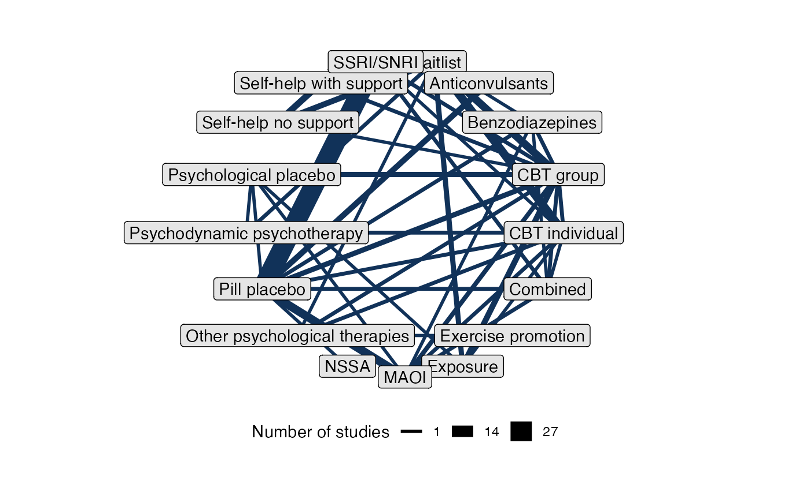
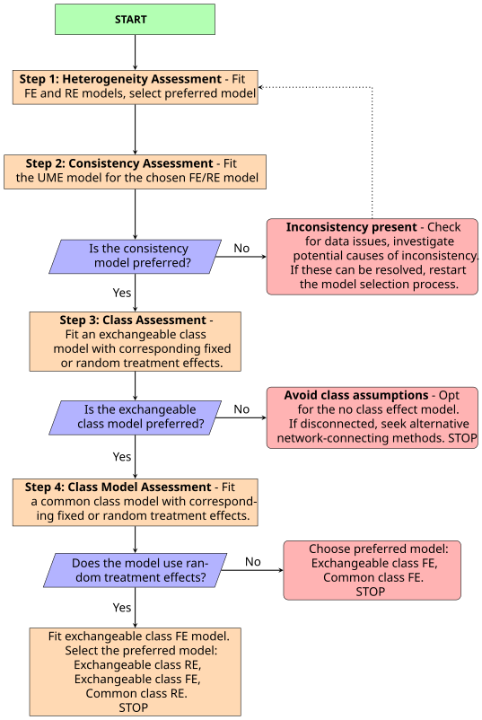
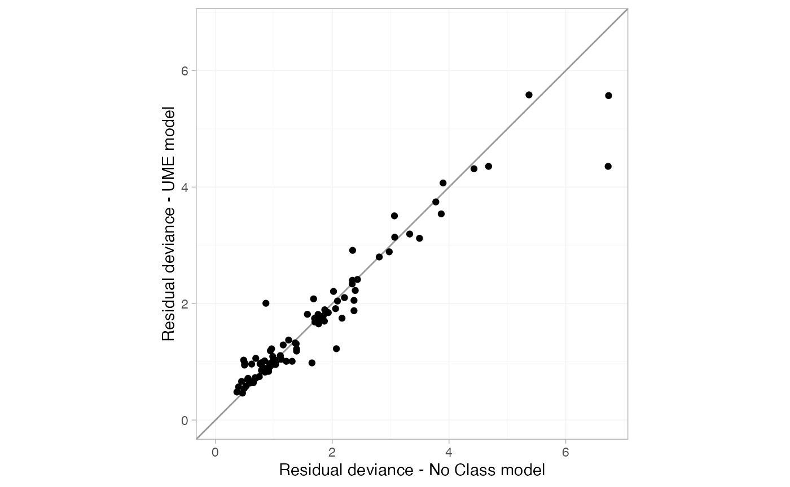
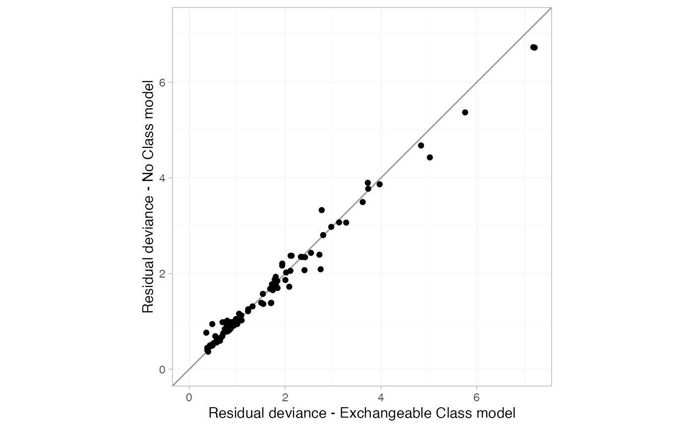
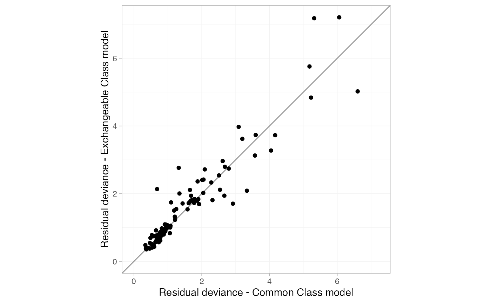
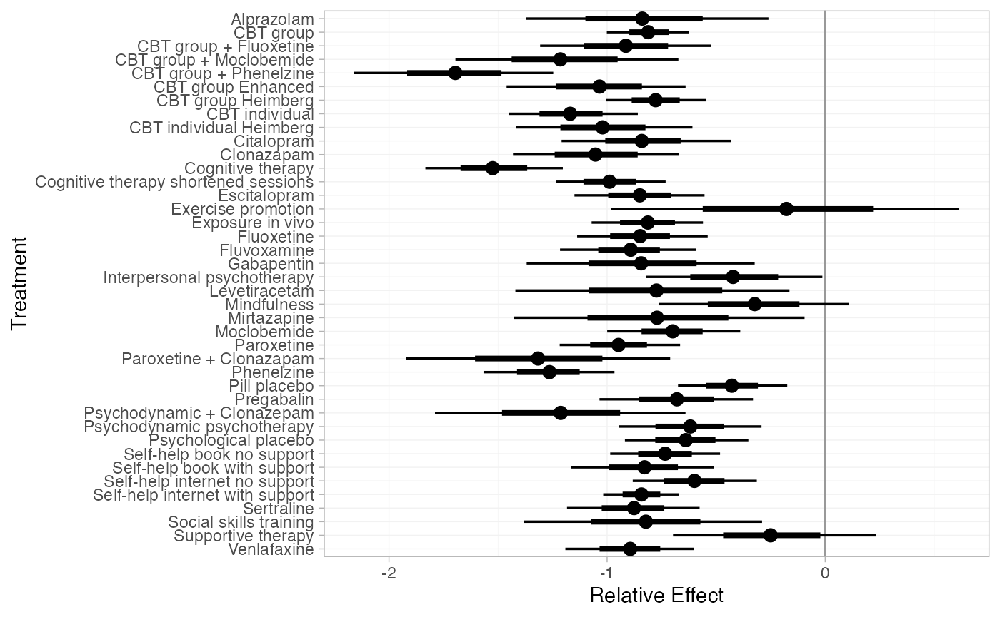
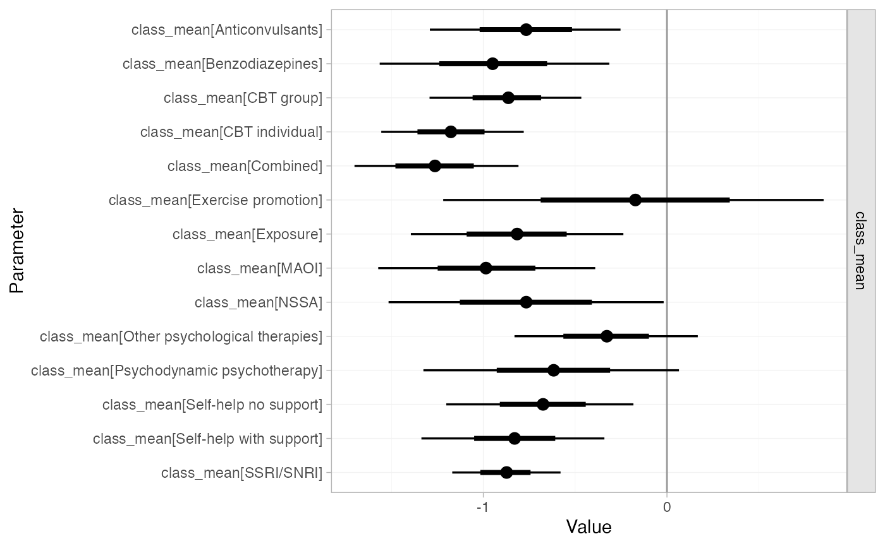
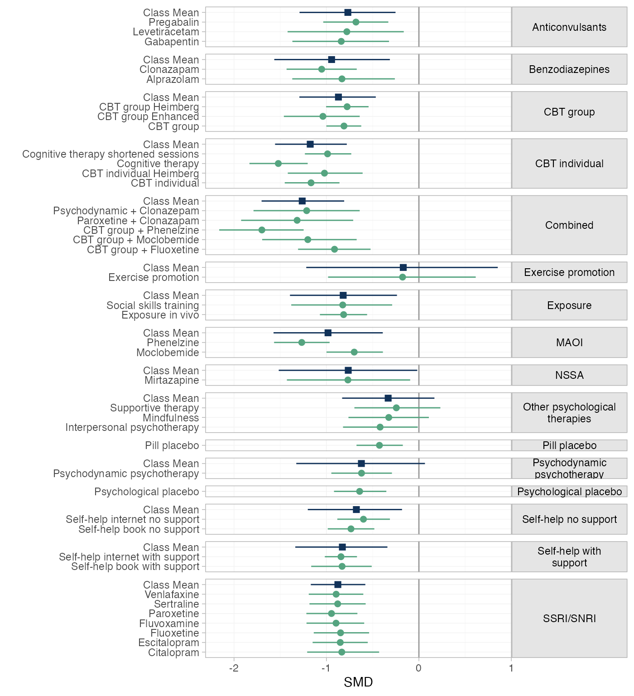
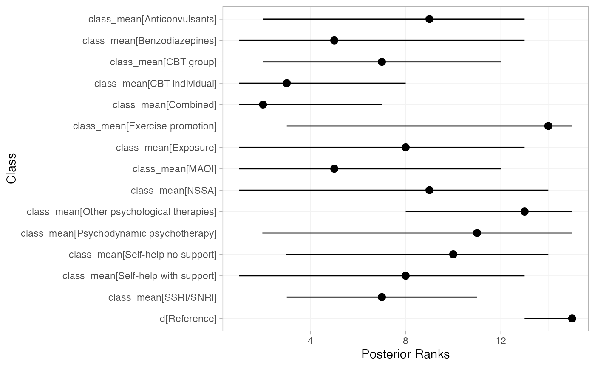
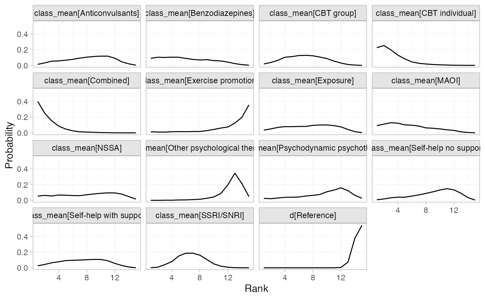

# Example: Social Anxiety

This vignette describes the analysis of 101 trials comparing 41
first-line treatments in 17 classes for social anxiety disorder in
adults ([Mayo-Wilson et al. 2014](#ref-mayo2014psychological)). The data
are available in this package as `social_anxiety`:

``` r
head(social_anxiety)
#> # A tibble: 6 × 8
#>   studyn studyc          trtn      y     se trtc                            classn classc      
#>    <dbl> <chr>          <dbl>  <dbl>  <dbl> <chr>                            <dbl> <chr>       
#> 1      1 BOWLER2012         1 NA     NA     Waitlist                             1 Waitlist    
#> 2      1 BOWLER2012         6 -0.916  0.318 Self-help internet no support        5 Self-help n…
#> 3      2 ABRAMOWITZ2009     1 NA     NA     Waitlist                             1 Waitlist    
#> 4      2 ABRAMOWITZ2009     7 -0.956  0.390 Self-help book with support          6 Self-help w…
#> 5      3 ANDERSSON2012      1 NA     NA     Waitlist                             1 Waitlist    
#> 6      3 ANDERSSON2012      8 -0.768  0.125 Self-help internet with support      6 Self-help w…
```

Mayo-Wilson et al. ([2014](#ref-mayo2014psychological)) analysed this
dataset using a NMA model with class effects, which we recreate here.
When fitting class effects models there are multiple modeling options
available.

We demonstrate the model selection strategy proposed by Perren et al.
([2025](#ref-Perren2025)) to determine the most suitable class effects
model.

## Setting up the network

We follow Mayo-Wilson et al. by analysing results as standardised mean
differences (`y`) with standard errors (`se`) therefore we use the
function `set_agd_contrast` to set up the network. We set treatment
classes with `trt_class = classc` and set `Waitlist` as the network
reference treatment.

``` r
sa_net <- set_agd_contrast(social_anxiety,
                           study = studyc, 
                           trt = trtc,
                           y = y,
                           se = se,
                           trt_class = classc,
                           trt_ref = "Waitlist")
#> Note: Optional argument `sample_size` not provided, some features may not be available (see
#> ?set_agd_contrast).

sa_net
#> A network with 101 AgD studies (contrast-based).
#> 
#> -------------------------------------------------- AgD studies (contrast-based) ---- 
#>  Study           Treatment arms                                
#>  ABRAMOWITZ2009  2: Waitlist | Self-help book with support     
#>  ALDEN2011       2: Waitlist | CBT group                       
#>  ALLGULANDER1999 2: Paroxetine | Pill placebo                  
#>  ALLGULANDER2004 3: Paroxetine | Pill placebo | Venlafaxine    
#>  ANDERSSON2006   2: Waitlist | Exposure in vivo                
#>  ANDERSSON2012   2: Waitlist | Self-help internet with support 
#>  ANDREWS2011     2: CBT group | Self-help internet with support
#>  ASAKURA2007     2: Fluvoxamine | Pill placebo                 
#>  BALDWIN1999     2: Paroxetine | Pill placebo                  
#>  BERGER2009      2: Waitlist | Self-help internet with support 
#>  ... plus 91 more studies
#> 
#>  Outcome type: continuous
#> ------------------------------------------------------------------------------------
#> Total number of treatments: 41, in 17 classes
#> Total number of studies: 101
#> Reference treatment is: Waitlist
#> Network is connected
```

We create a plot at the class level by setting `level = "class"`.

``` r
plot(sa_net, level = "class") + 
  theme(legend.position = "bottom", legend.box = "vertical")
```



## Model selection strategy

We follow the model selection strategy proposed by Perren et al.
([2025](#ref-Perren2025))



### STEP 1: Heterogeniety assessement

First, we assess heterogeneity by fitting fixed effects (FE) and random
effects (RE) models using
[`nma()`](https://dmphillippo.github.io/multinma/dev/reference/nma.md)
and stating `trt_effects = "random"` for the RE model and
`trt_effects = "fixed"` for the FE model. We use uninformative priors on
the treatment effects with `prior_trt = normal(0, 100)` and
heterogeneity with `prior_het = half_normal(5)`.

``` r
set.seed(951)
sa_fit_FE <- nma(sa_net,
                 trt_effects = "fixed",
                 prior_trt = normal(0, 100),
                 prior_het = half_normal(5),
)

sa_fit_RE <- nma(sa_net,
                 trt_effects = "random",
                 prior_trt = normal(0, 100),
                 prior_het = half_normal(5),
)
```

The model fit under the FE and RE models can be checked using the
[`dic()`](https://dmphillippo.github.io/multinma/dev/reference/dic.md)
function.

``` r
(sa_dic_FE <- dic(sa_fit_FE))
#> Residual deviance: 288.1 (on 147 data points)
#>                pD: 39.9
#>               DIC: 328.1
(sa_dic_RE <- dic(sa_fit_RE))
#> Residual deviance: 162.6 (on 147 data points)
#>                pD: 94.3
#>               DIC: 256.9
```

The DIC for the random effects model (256.9) is much lower than that of
the fixed effects model (328.1) due to the large decrease in residual
deviance showing a much better fit to the data. Therefore, our preferred
model is the RE model, which we use in subsequent steps.

### STEP 2: Consistency assessment

The next step is to assess inconsistency using an unrelated mean effects
model (UME), comparing model fit statistics for the UME model and the
NMA (consistency) model, both with RE. To fit a UME model we specify
`consistency = "ume"`.

``` r
sa_UME_RE <- nma(sa_net,
                 trt_effects = "random",
                 consistency = "ume",
                 prior_trt = normal(0, 100),
                 prior_het = half_normal(5))
```

We compare model fit from the NMA (consistency) RE model and the UME RE
model using the
[`dic()`](https://dmphillippo.github.io/multinma/dev/reference/dic.md)
function and \tau.

``` r
(sa_dic_RE <- dic(sa_fit_RE))
#> Residual deviance: 162.6 (on 147 data points)
#>                pD: 94.3
#>               DIC: 256.9
(sa_dic_ume_RE <- dic(sa_UME_RE))
#> Residual deviance: 161.3 (on 147 data points)
#>                pD: 109
#>               DIC: 270.4

summary(sa_UME_RE, pars = "tau")
#>     mean   sd 2.5% 25%  50%  75% 97.5% Bulk_ESS Tail_ESS Rhat
#> tau 0.22 0.03 0.16 0.2 0.22 0.24  0.29      878     2051    1
summary(sa_fit_RE, pars = "tau")
#>     mean   sd 2.5%  25% 50%  75% 97.5% Bulk_ESS Tail_ESS Rhat
#> tau 0.21 0.03 0.15 0.18 0.2 0.23  0.27     1127     2095    1
```

The residual deviance is not meaningfully different between the two
models, however, the DIC is lower in the NMA model (256.9) compared to
the UME model (270.4). There is no evidence of inconsistency at the
global level.

To asses local inconsistency, we use the
[`plot()`](https://rdrr.io/r/graphics/plot.default.html) function that
produces a “dev-dev” plot of the residual deviance contributions for the
UME model plotted against the NMA consistency model.

``` r
plot(sa_dic_RE, sa_dic_ume_RE, show_uncertainty = FALSE) +
  xlab("Residual deviance - No Class model") +
  ylab("Residual deviance - UME model")
```



The dev-dev plot comparing residual deviance contributions for the UME
model and no-class model shows that most data points lie close to the
line of equality.

``` r
as.data.frame(sa_dic_RE) %>%
  arrange(desc(resdev)) %>%
  head(5)
#>          .study n_contrast   resdev  leverage      dic df
#> 1     ALDEN2011          1 6.734567 0.4807275 7.215294  1
#> 2 EMMELKAMP2006          2 6.726275 0.9495117 7.675786  2
#> 3  STANGIER2003          2 5.370313 1.0404009 6.410714  2
#> 4  VERSIANI1992          2 4.678505 1.1216433 5.800149  2
#> 5  HEIMBERG1998          3 4.428477 2.0041343 6.432611  3
```

We can see from investigating the pointwise contributions to the
residual deviance that the two outlier studies are ALDEN2011 and
EMMELKAMP2006 with their large `resdev` values in the no class model.

We can explore the consistency of specific evidence loops using
node-splitting by setting `consistency = "nodesplit"`. However, given
the size of the network, running node-splitting on all comparisons would
be computationally intensive. We instead run the node-splitting analysis
specifically for the loops that include the studies identified in the
dev-dev plots (ALDEN2011 and EMMELKAMP2006). We first define the
specific treatment comparisons of interest by creating two data frames
that specify the desired treatment comparisons. These are then passed to
the `nodesplit` argument within the
[`nma()`](https://dmphillippo.github.io/multinma/dev/reference/nma.md)
function.

``` r
EMMELKAMP2006 <- data.frame(
  Treatment_1 = c("CBT individual", "Waitlist", "Waitlist"),
  Treatment_2 = c("Psychodynamic psychotherapy", "Psychodynamic psychotherapy", "CBT individual")
)

ALDEN2011 <- data.frame(
  Treatment_1 = c("Waitlist"),
  Treatment_2 = c("CBT group")
)

sa_fit_RE_nodesplit_EMMELKAMP <- nma(sa_net,
                           consistency = "nodesplit",
                           nodesplit = EMMELKAMP2006,
                           trt_effects = "random",
                           prior_trt = normal(0, 100),
                           prior_het = half_normal(5),
)
#> Fitting model 1 of 3, node-split: Psychodynamic psychotherapy vs. CBT individual
#> Fitting model 2 of 3, node-split: Psychodynamic psychotherapy vs. Waitlist
#> Fitting model 3 of 3, node-split: CBT individual vs. Waitlist

sa_fit_RE_nodesplit_ALDEN <- nma(sa_net,
                             consistency = "nodesplit",
                             nodesplit = ALDEN2011,
                             trt_effects = "random",
                             prior_trt = normal(0, 100),
                             prior_het = half_normal(5),
)
#> Fitting model 1 of 1, node-split: CBT group vs. Waitlist
```

``` r
summary(sa_fit_RE_nodesplit_ALDEN)
#> Node-splitting model fitted for 1 comparison: CBT group vs. Waitlist.
#> 
#>        mean   sd  2.5%   25%   50%   75% 97.5% Bulk_ESS Tail_ESS Rhat
#> d_dir -0.90 0.14 -1.17 -0.99 -0.90 -0.81 -0.63     3562     3110    1
#> d_ind -0.74 0.14 -1.01 -0.83 -0.73 -0.64 -0.46     1008     1685    1
#> omega -0.16 0.18 -0.53 -0.28 -0.16 -0.03  0.18     1750     2566    1
#> tau    0.21 0.03  0.15  0.19  0.21  0.23  0.27     1268     2393    1
#> 
#> Residual deviance: 161.9 (on 147 data points)
#>                pD: 94.9
#>               DIC: 256.8
#> 
#> Bayesian p-value: 0.38
summary(sa_fit_RE_nodesplit_EMMELKAMP)
#> Node-splitting models fitted for 3 comparisons.
#> 
#> --------------------- Node-split Psychodynamic psychotherapy vs. CBT individual ---- 
#> 
#>       mean   sd  2.5%  25%  50%  75% 97.5% Bulk_ESS Tail_ESS Rhat
#> d_dir 0.71 0.33  0.07 0.50 0.72 0.93  1.34     4630     3316    1
#> d_ind 0.44 0.26 -0.08 0.27 0.43 0.61  0.93     2503     2808    1
#> omega 0.27 0.39 -0.49 0.02 0.28 0.53  1.03     3634     2533    1
#> tau   0.21 0.03  0.15 0.19 0.21 0.23  0.27     1101     2198    1
#> 
#> Residual deviance: 161.8 (on 147 data points)
#>                pD: 94.8
#>               DIC: 256.5
#> 
#> Bayesian p-value: 0.47
#> 
#> --------------------------- Node-split Psychodynamic psychotherapy vs. Waitlist ---- 
#> 
#>        mean   sd  2.5%   25%   50%   75% 97.5% Bulk_ESS Tail_ESS Rhat
#> d_dir -0.60 0.18 -0.95 -0.72 -0.60 -0.48 -0.24     5165     3238    1
#> d_ind -0.67 0.42 -1.49 -0.96 -0.67 -0.38  0.14     3636     3389    1
#> omega  0.07 0.44 -0.78 -0.23  0.08  0.37  0.94     3816     3242    1
#> tau    0.21 0.03  0.15  0.19  0.21  0.23  0.27     1516     2297    1
#> 
#> Residual deviance: 163 (on 147 data points)
#>                pD: 95.6
#>               DIC: 258.6
#> 
#> Bayesian p-value: 0.87
#> 
#> ---------------------------------------- Node-split CBT individual vs. Waitlist ---- 
#> 
#>        mean   sd  2.5%   25%   50%   75% 97.5% Bulk_ESS Tail_ESS Rhat
#> d_dir -0.84 0.24 -1.31 -1.00 -0.84 -0.68 -0.37     5278     3755 1.00
#> d_ind -1.46 0.24 -1.95 -1.62 -1.46 -1.29 -0.98     1636     2329 1.00
#> omega  0.62 0.34 -0.05  0.39  0.63  0.84  1.29     2198     2805 1.00
#> tau    0.20 0.03  0.15  0.18  0.20  0.22  0.27     1290     1878 1.01
#> 
#> Residual deviance: 161.7 (on 147 data points)
#>                pD: 94.3
#>               DIC: 256
#> 
#> Bayesian p-value: 0.071
```

Our node‐splitting analysis shows that the CBT individual and Waitlist
comparison has a p-value of 0.065 and a stronger effect for the indirect
estimate compared to the direct estimate, however the CrIs do overlap
and both estimates are in the same direction and do not include 0. This
indicates no evidence of inconsistency in the network meta‐analysis.
However, studies should be reviewed and sensitivity analyses are
advised.

### STEP 3: Class effects assessment

In this step, we assess whether a class assumption is suitable for the
data by comparing our NMA RE model with an exchangeable class model with
a RE treatment model. In this model, we specify
`class_effects = "exchangeable"`, meaning that treatments within each
class are considered to be from a common distribution. The
`prior_class_sd` sets a prior on the standard deviation between
treatment effects within each class. Because it is difficult to estimate
the class standard deviations with only a small number of treatments in
each class, here we specify an informative \mathrm{N}(0.33,0.1^2) prior
distribution that is chosen to keep class variability within a
clinically-plausible range ([Perren et al. 2025](#ref-Perren2025)). We
also define `class_sd` as a list of character vectors indicating which
classes share a common SD, again aiding estimation of these parameters.
For the class effects means, `prior_class_mean` is set as \mathrm{N}(0,
10^2).

``` r
sa_fit_EXclass_RE <- nma(sa_net,
                         trt_effects = "random",
                         prior_trt = normal(0, 100),
                         prior_het = half_normal(5),
                         class_effects = "exchangeable",
                         prior_class_mean = normal(0, 10),
                         prior_class_sd = normal(0.33,0.1),
                         class_sd = 
                           list(`Exercise and SH no support` = 
                                  c("Exercise promotion", "Self-help no support"),
                                `SSRIs and NSSA` = 
                                  c("SSRI/SNRI", "NSSA"),
                                `Psychodynamic & Other psychological therapies` =
                                  c("Psychodynamic psychotherapy", "Other psychological therapies"))
                         )
```

We compare model fit from the Exchangeable class RE model and the no
class RE model using the
[`dic()`](https://dmphillippo.github.io/multinma/dev/reference/dic.md)
function and \tau.

``` r
(sa_dic_EXclass_RE <- dic(sa_fit_EXclass_RE))
#> Residual deviance: 163.4 (on 147 data points)
#>                pD: 88.2
#>               DIC: 251.6
(sa_dic_RE <- dic(sa_fit_RE))
#> Residual deviance: 162.6 (on 147 data points)
#>                pD: 94.3
#>               DIC: 256.9

summary(sa_fit_RE, pars = "tau")
#>     mean   sd 2.5%  25% 50%  75% 97.5% Bulk_ESS Tail_ESS Rhat
#> tau 0.21 0.03 0.15 0.18 0.2 0.23  0.27     1127     2095    1
summary(sa_fit_EXclass_RE, pars = "tau")
#>     mean   sd 2.5%  25% 50%  75% 97.5% Bulk_ESS Tail_ESS Rhat
#> tau  0.2 0.03 0.14 0.18 0.2 0.22  0.26     1366     2407    1
```

We use the [`plot()`](https://rdrr.io/r/graphics/plot.default.html)
function that produces a “dev-dev” plot of the residual deviance
contributions for the Exchangeable class model plotted against the no
class model.

``` r
plot(sa_dic_EXclass_RE, sa_dic_RE, show_uncertainty = FALSE) +
  xlab("Residual deviance - Exchangeable Class model") +
  ylab("Residual deviance - No Class model")
```



Although both models yield similar residual deviance (163.4 vs. 162.6)
and between‐study heterogeneity, the exchangeable class model reduces
model complexity—reflected by a lower effective number of parameters (
vs. 94.3) and a lower DIC (251.6 vs. 256.9). A deviance–deviance plot
confirms that all data points fit equally well. Overall, these findings
support using the class model for the social anxiety data.

### STEP 4: Class Model Assessment

After we have determined that a class effects model is appropriate, it
is time to finalise which combination of common or exchangeable class
effects and fixed or random treatment effects provides the most suitable
model fit. As we are using a random effects model, we now fit 2 other
models to our data; Exchangeable class FE and Common class RE. This
gives us a total of 3 models to compare. Exchangeable class FE,
Exchangeable class RE and Common class RE.

``` r
sa_fit_COclass_RE <- nma(sa_net,
                         trt_effects = "random",
                         prior_trt = normal(0, 100),
                         prior_het = half_normal(5),
                         class_effects = "common")

sa_fit_EXclass_FE <- nma(sa_net,
                         trt_effects = "fixed",
                         prior_trt = normal(0, 100),
                         prior_het = half_normal(5),
                         class_effects = "exchangeable",
                         prior_class_mean = normal(0, 10),
                         prior_class_sd = normal(0.33,0.1),
                         class_sd = 
                           list(`Exercise and SH no support` = 
                                  c("Exercise promotion", "Self-help no support"),
                                `SSRIs and NSSA` = 
                                  c("SSRI/SNRI", "NSSA"),
                                `Psychodynamic & Other psychological therapies` = 
                                  c("Psychodynamic psychotherapy", "Other psychological therapies"))
                         )
```

We compare model fit from all three models using the
[`dic()`](https://dmphillippo.github.io/multinma/dev/reference/dic.md)
function and evaluate \tau in the common class RE model and the
exchangeable class RE model.

``` r
(sa_dic_COclass_RE <- dic(sa_fit_COclass_RE))
#> Residual deviance: 157.7 (on 147 data points)
#>                pD: 93
#>               DIC: 250.7
(sa_dic_EXclass_FE <- dic(sa_fit_EXclass_FE))
#> Residual deviance: 284.9 (on 147 data points)
#>                pD: 34.4
#>               DIC: 319.3
(sa_dic_EXclass_RE <- dic(sa_fit_EXclass_RE))
#> Residual deviance: 163.4 (on 147 data points)
#>                pD: 88.2
#>               DIC: 251.6

summary(sa_fit_COclass_RE, pars = "tau")
#>     mean   sd 2.5%  25%  50%  75% 97.5% Bulk_ESS Tail_ESS Rhat
#> tau 0.25 0.03  0.2 0.23 0.25 0.27  0.31      842     1890    1
summary(sa_fit_EXclass_RE, pars = "tau")
#>     mean   sd 2.5%  25% 50%  75% 97.5% Bulk_ESS Tail_ESS Rhat
#> tau  0.2 0.03 0.14 0.18 0.2 0.22  0.26     1366     2407    1
```

Both random‐effects models showed substantially better fit than the
fixed‐effect model (posterior mean residual deviance of 157.7 and 163.4
versus 284.9, and DIC values of 250.7 and 251.6 versus 319.3). Although
the common class model achieved a slightly better absolute fit, it had
higher between‐study heterogeneity (0.25 vs. 0.20) than the exchangeable
class model. We use the
[`plot()`](https://rdrr.io/r/graphics/plot.default.html) function to
produce a “dev-dev” plot of the residual deviance contributions for the
Exchangeable class model plotted against the no class model.

``` r
plot(sa_dic_COclass_RE, sa_dic_EXclass_RE, show_uncertainty = FALSE) +
  xlab("Residual deviance - Common Class model") +
  ylab("Residual deviance - Exchangeable Class model")
```



The dev–dev plot indicates that while some data points favor one model
over the other, overall the fit is similar. Therefore, given nearly
identical DIC scores, the choice between the two random‐effects models
should be guided by clinical considerations: use the exchangeable class
model if reporting distinct treatment‐level effects is important, or the
common class model if the focus is on class-level effects and not
concerned with potential variability of treatment effects within
classes.

## Results for final chosen model

### Relative treatment effects

Relative treatment effects are produced with the
[`relative_effects()`](https://dmphillippo.github.io/multinma/dev/reference/relative_effects.md)
function, and can be plotted using
[`plot()`](https://rdrr.io/r/graphics/plot.default.html).

``` r
plot(relative_effects(sa_fit_EXclass_RE), ref_line = 0)
```



### Relative class effects

We can produce a plot showing relative class effects against `Waitlist`
using [`plot()`](https://rdrr.io/r/graphics/plot.default.html) with
`pars = "class_mean"` to select these parameters.

``` r
plot(sa_fit_EXclass_RE,
     pars = "class_mean",
     ref_line = 0)
```



We can combine the treatment and class effects into a single plot as
follows:

``` r
# Relative treatment effects
trt_eff <- as_tibble(relative_effects(sa_fit_EXclass_RE)) %>% 
  # Add in class details
  mutate(Class = sa_net$classes[as.numeric(.trtb)],
         level = "treatment")

# Class effects
class_eff <- as_tibble(summary(sa_fit_EXclass_RE, pars = "class_mean")) %>% 
  # Extract class details
  mutate(Class = factor(gsub(".*\\[(.+)\\]", "\\1", parameter), levels = levels(sa_net$classes)),
         level = "class",
         .trtb = factor("Class Mean", levels = c(levels(sa_net$classes), "Class Mean")))

# Combine and plot
bind_rows(trt_eff, class_eff) %>% 
  ggplot(aes(y = .trtb, 
             x = mean, xmin = `2.5%`, xmax = `97.5%`,
             colour = level, shape = level)) +
  geom_vline(xintercept = 0, colour = "grey60") +
  geom_pointrange() +
  facet_grid(rows = "Class", scales = "free", space = "free", labeller = label_wrap_gen(22)) +
  scale_shape_manual(values = c(15, 16), guide = guide_none()) +
  scale_colour_manual(values = c("#113259", "#55A480"), guide = guide_none()) +
  xlab("SMD") + ylab("") +
  theme_multinma() +
  theme(strip.text.y = element_text(angle = 0))
```



We aim to visualize the class ranks and rank probabilities by
summarizing their distributions. To achieve this, we extract the
posterior draws for class means, add a reference treatment, and compute
the rank of each treatment at every iteration. We then summarize these
ranks by calculating the median and 95% credible intervals to generate a
point-range plot and derive the rank probability distributions for each
treatment class, which we then plot.

``` r
# Class means
EXclass_mean <- as.matrix(sa_fit_EXclass_RE, pars = "class_mean")

EXclass_mean <- cbind(`d[Reference]` = 0, EXclass_mean)

# Take ranks at each iteration
EXranks <- t(apply(EXclass_mean, 1, rank))

# Get median rank and 95% credible interval
EXresults <- t(apply(EXranks, 2, quantile, probs = c(0.025, 0.5, 0.975)))

# Convert to data frame
EXresults_df <- as.data.frame(EXresults)
EXresults_df$class <- rownames(EXresults_df)

EXresults_df$class <- factor(EXresults_df$class, 
                             levels = sort(unique(EXresults_df$class), decreasing = TRUE))

ggplot(EXresults_df, aes(x=class, y=`50%`, ymin=`2.5%`, ymax=`97.5%`)) +
geom_pointrange(size = 0.5) +
coord_flip() +
xlab("Class") + ylab("Posterior Ranks") +
theme_multinma()
```



Treatment classes with higher ranks have median values closer to 1,
positioned toward the left of the x-axis. The Combined treatment class
has the highest median rank, followed by CBT individual. In contrast,
Exercise promotion appears to have the lowest rank among the treatment
classes, aside from the reference.

We now calculate and plot the class rank probabilities.

``` r
EXranks_df <- as.data.frame(EXranks)

# Rank probabilities for class
rank_probs_EX <- apply(EXranks_df, 2, function(x) table(factor(x, levels = 1:ncol(EXranks_df))) / nrow(EXranks_df))

# Convert to data frame
rank_probs_df_EX <- as.data.frame(rank_probs_EX)

# Convert the data frame to a long format
rank_probs_long_EX <- rank_probs_df_EX %>%
  mutate(Rank = row_number()) %>%
  pivot_longer(
    cols = -Rank,
    names_to = "Class",
    values_to = "Probability"
  )

# Plot density
ggplot(rank_probs_long_EX, aes(x = Rank, y = Probability)) +
  geom_line() +
  facet_wrap(~ Class) +
  theme_multinma() +
  labs(x = "Rank",
       y = "Probability")
```



Higher-ranked classes have a greater density on the left side of the
x-axis, indicating a higher probability of achieving a top rank across
posterior samples. The Combined class shows the highest density on the
left, suggesting it is most likely to be ranked among the top
treatments, followed by CBT individual. In contrast, most other classes
have relatively flat distributions, reflecting greater uncertainty in
their rankings. Exercise promotion, Other psychological therapies, and
the reference class have densities skewed toward the right, indicating a
higher probability of lower rankings.

## References

Mayo-Wilson, Evan, Sofia Dias, Ifigeneia Mavranezouli, Kayleigh Kew,
David M Clark, AE Ades, and Stephen Pilling. 2014. “Psychological and
Pharmacological Interventions for Social Anxiety Disorder in Adults: A
Systematic Review and Network Meta-Analysis.” *The Lancet Psychiatry* 1
(5): 368–76.

Perren, Samuel J., Hugo Pedder, Nicky J. Welton, and David M. Phillippo.
2025. “Network Meta-Analysis with Class Effects: A Practical Guide and
Model Selection Algorithm.” *Medical Decision Making*, November.
<https://doi.org/10.1177/0272989x251389887>.
