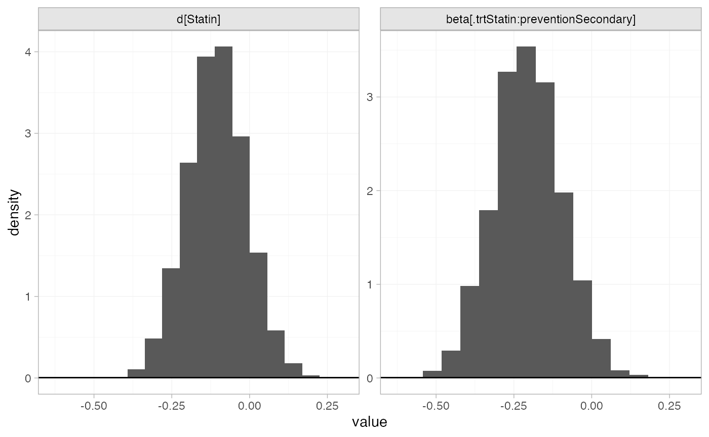
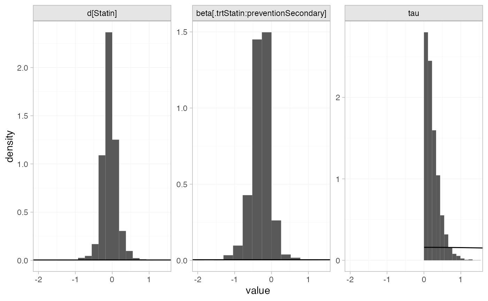
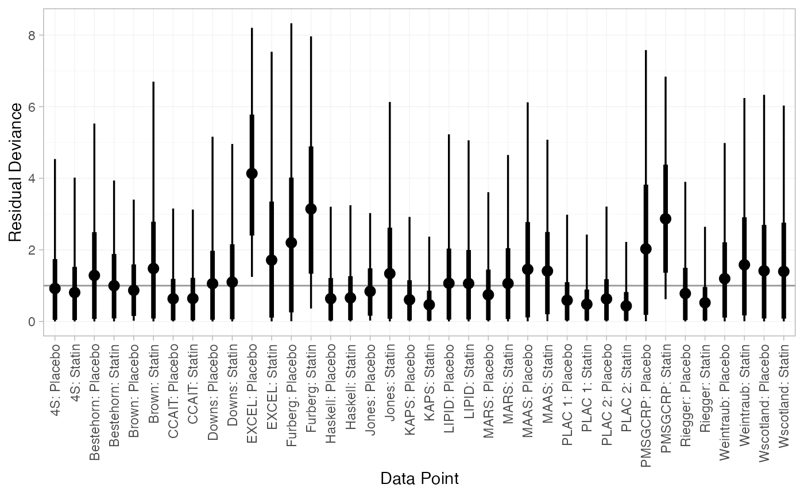
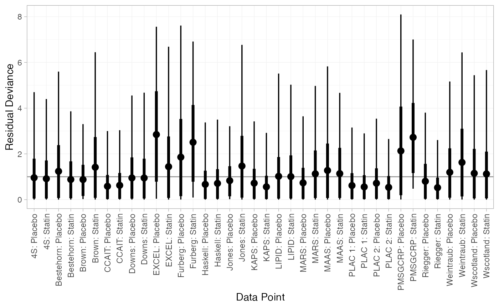
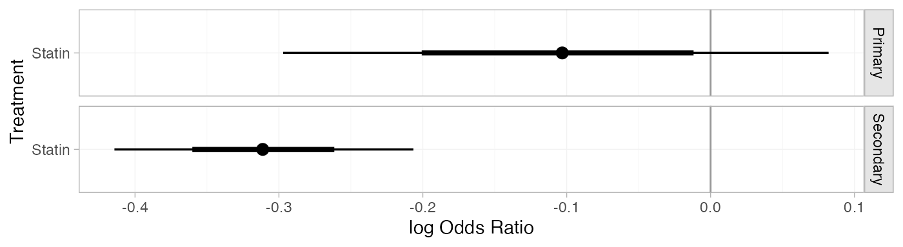
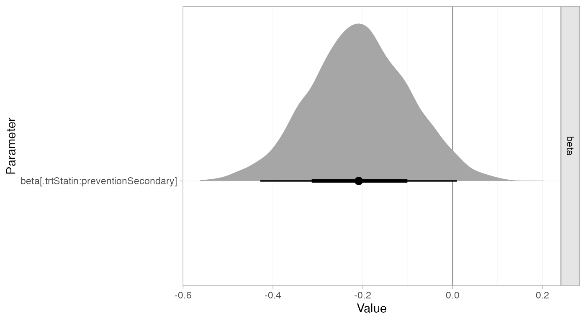

# Example: Statins for cholesterol lowering

``` r
library(multinma)
options(mc.cores = parallel::detectCores())
```

    #> For execution on a local, multicore CPU with excess RAM we recommend calling
    #> options(mc.cores = parallel::detectCores())
    #> 
    #> Attaching package: 'multinma'
    #> The following objects are masked from 'package:stats':
    #> 
    #>     dgamma, pgamma, qgamma

This vignette describes the analysis of 19 trials comparing statins to
placebo or usual care ([Dias et al. 2011](#ref-TSD3)). The data are
available in this package as `statins`:

``` r
head(statins)
#>   studyn    studyc trtn    trtc prevention   r    n
#> 1      1        4S    1 Placebo  Secondary 256 2223
#> 2      1        4S    2  Statin  Secondary 182 2221
#> 3      2 Bestehorn    1 Placebo  Secondary   4  125
#> 4      2 Bestehorn    2  Statin  Secondary   1  129
#> 5      3     Brown    1 Placebo  Secondary   0   52
#> 6      3     Brown    2  Statin  Secondary   1   94
```

Dias et al. ([2011](#ref-TSD3)) used these data to demonstrate
meta-regression models adjusting for the binary covariate `prevention`
(primary or secondary prevention), which we recreate here.

## Setting up the network

We have data giving the number of deaths (`r`) out of the total (`n`) in
each arm, so we use the function
[`set_agd_arm()`](https://dmphillippo.github.io/multinma/dev/reference/set_agd_arm.md)
to set up the network. We set placebo as the network reference
treatment.

``` r
statin_net <- set_agd_arm(statins, 
                          study = studyc,
                          trt = trtc,
                          r = r, 
                          n = n,
                          trt_ref = "Placebo")
statin_net
#> A network with 19 AgD studies (arm-based).
#> 
#> ------------------------------------------------------- AgD studies (arm-based) ---- 
#>  Study     Treatment arms     
#>  4S        2: Placebo | Statin
#>  Bestehorn 2: Placebo | Statin
#>  Brown     2: Placebo | Statin
#>  CCAIT     2: Placebo | Statin
#>  Downs     2: Placebo | Statin
#>  EXCEL     2: Placebo | Statin
#>  Furberg   2: Placebo | Statin
#>  Haskell   2: Placebo | Statin
#>  Jones     2: Placebo | Statin
#>  KAPS      2: Placebo | Statin
#>  ... plus 9 more studies
#> 
#>  Outcome type: count
#> ------------------------------------------------------------------------------------
#> Total number of treatments: 2
#> Total number of studies: 19
#> Reference treatment is: Placebo
#> Network is connected
```

The `prevention` variable in the `statins` data frame will automatically
be available to use in a meta-regression model.

## Meta-analysis models

We fit fixed effect (FE) and random effects (RE) models, with a
meta-regression on the binary covariate `prevention`.

### Fixed effect meta-regression

We start by fitting a FE model. We use \mathrm{N}(0, 100^2) prior
distributions for the treatment effect d\_\mathrm{Statin},
study-specific intercepts \mu_j, and regression coefficient \beta. We
can examine the range of parameter values implied by these prior
distributions with the
[`summary()`](https://rdrr.io/r/base/summary.html) method:

``` r
summary(normal(scale = 100))
#> A Normal prior distribution: location = 0, scale = 100.
#> 50% of the prior density lies between -67.45 and 67.45.
#> 95% of the prior density lies between -196 and 196.
```

The model is fitted with the
[`nma()`](https://dmphillippo.github.io/multinma/dev/reference/nma.md)
function, with a fixed effect model specified by
`trt_effects = "fixed"`. The `regression` formula `~ .trt:prevention`
means that interaction of primary/secondary prevention with treatment
will be included; the `.trt` special variable indicates treatment, and
`prevention` is in the original data set.

``` r
statin_fit_FE <- nma(statin_net, 
                     trt_effects = "fixed",
                     regression = ~.trt:prevention,
                     prior_intercept = normal(scale = 100),
                     prior_trt = normal(scale = 100),
                     prior_reg = normal(scale = 100))
#> Note: No treatment classes specified in network, any interactions in `regression` formula will be separate (independent) for each treatment.
#> Use set_*() argument `trt_class` and nma() argument `class_interactions` to change this.
```

Basic parameter summaries are given by the
[`print()`](https://rdrr.io/r/base/print.html) method:

``` r
statin_fit_FE
#> A fixed effects NMA with a binomial likelihood (logit link).
#> Regression model: ~.trt:prevention.
#> Inference for Stan model: binomial_1par.
#> 4 chains, each with iter=2000; warmup=1000; thin=1; 
#> post-warmup draws per chain=1000, total post-warmup draws=4000.
#> 
#>                                          mean se_mean   sd     2.5%      25%      50%      75%
#> beta[.trtStatin:preventionSecondary]    -0.21    0.00 0.11    -0.43    -0.28    -0.21    -0.13
#> d[Statin]                               -0.10    0.00 0.10    -0.29    -0.17    -0.10    -0.04
#> lp__                                 -7246.65    0.09 3.40 -7254.24 -7248.77 -7246.33 -7244.14
#>                                         97.5% n_eff Rhat
#> beta[.trtStatin:preventionSecondary]     0.01  2522    1
#> d[Statin]                                0.09  2463    1
#> lp__                                 -7241.06  1543    1
#> 
#> Samples were drawn using NUTS(diag_e) at Fri Apr 10 15:06:19 2026.
#> For each parameter, n_eff is a crude measure of effective sample size,
#> and Rhat is the potential scale reduction factor on split chains (at 
#> convergence, Rhat=1).
```

By default, summaries of the study-specific intercepts \mu_j are hidden,
but could be examined by changing the `pars` argument:

``` r
# Not run
print(statin_fit_FE, pars = c("d", "beta", "mu"))
```

The prior and posterior distributions can be compared visually using the
[`plot_prior_posterior()`](https://dmphillippo.github.io/multinma/dev/reference/plot_prior_posterior.md)
function:

``` r
plot_prior_posterior(statin_fit_FE, prior = c("trt", "reg"))
```



### Random effects meta-regression

We now fit a RE model. We use \mathrm{N}(0, 100^2) prior distributions
for the treatment effect d\_\mathrm{Statin}, study-specific intercepts
\mu_j, and regression coefficient \beta. We use a \textrm{half-N}(0,
5^2) prior distribution for the heterogeneity standard deviation \tau.
We can examine the range of parameter values implied by these prior
distributions with the
[`summary()`](https://rdrr.io/r/base/summary.html) method:

``` r
summary(normal(scale = 100))
#> A Normal prior distribution: location = 0, scale = 100.
#> 50% of the prior density lies between -67.45 and 67.45.
#> 95% of the prior density lies between -196 and 196.
summary(half_normal(scale = 5))
#> A half-Normal prior distribution: scale = 5.
#> 50% of the prior density lies between 0 and 3.37.
#> 95% of the prior density lies between 0 and 9.8.
```

Again, the model is fitted with the
[`nma()`](https://dmphillippo.github.io/multinma/dev/reference/nma.md)
function, now with `trt_effects = "random"`. We increase `adapt_delta`
to 0.99 to remove a small number of divergent transition errors (the
default for RE models is set to 0.95).

``` r
statin_fit_RE <- nma(statin_net, 
                     trt_effects = "random",
                     regression = ~.trt:prevention,
                     prior_intercept = normal(scale = 100),
                     prior_trt = normal(scale = 100),
                     prior_reg = normal(scale = 100),
                     prior_het = half_normal(scale = 5),
                     adapt_delta = 0.99)
#> Note: No treatment classes specified in network, any interactions in `regression` formula will be separate (independent) for each treatment.
#> Use set_*() argument `trt_class` and nma() argument `class_interactions` to change this.
```

Basic parameter summaries are given by the
[`print()`](https://rdrr.io/r/base/print.html) method:

``` r
statin_fit_RE
#> A random effects NMA with a binomial likelihood (logit link).
#> Regression model: ~.trt:prevention.
#> Inference for Stan model: binomial_1par.
#> 4 chains, each with iter=2000; warmup=1000; thin=1; 
#> post-warmup draws per chain=1000, total post-warmup draws=4000.
#> 
#>                                          mean se_mean   sd     2.5%      25%      50%      75%
#> beta[.trtStatin:preventionSecondary]    -0.30    0.01 0.26    -0.90    -0.43    -0.27    -0.15
#> d[Statin]                               -0.06    0.01 0.21    -0.46    -0.18    -0.07     0.04
#> lp__                                 -7255.75    0.18 5.35 -7266.83 -7259.27 -7255.51 -7252.11
#> tau                                      0.25    0.01 0.21     0.01     0.09     0.19     0.34
#>                                         97.5% n_eff Rhat
#> beta[.trtStatin:preventionSecondary]     0.19   970 1.01
#> d[Statin]                                0.39  1080 1.01
#> lp__                                 -7246.03   863 1.01
#> tau                                      0.77   667 1.01
#> 
#> Samples were drawn using NUTS(diag_e) at Fri Apr 10 15:06:24 2026.
#> For each parameter, n_eff is a crude measure of effective sample size,
#> and Rhat is the potential scale reduction factor on split chains (at 
#> convergence, Rhat=1).
```

By default, summaries of the study-specific intercepts \mu_j and
study-specific relative effects \delta\_{jk} are hidden, but could be
examined by changing the `pars` argument:

``` r
# Not run
print(statin_fit_RE, pars = c("d", "beta", "mu", "delta"))
```

The prior and posterior distributions can be compared visually using the
[`plot_prior_posterior()`](https://dmphillippo.github.io/multinma/dev/reference/plot_prior_posterior.md)
function:

``` r
plot_prior_posterior(statin_fit_RE, prior = c("trt", "reg", "het"))
```



## Model fit and comparison

Model fit can be checked using the
[`dic()`](https://dmphillippo.github.io/multinma/dev/reference/dic.md)
function:

``` r
(statin_dic_FE <- dic(statin_fit_FE))
#> Residual deviance: 45.9 (on 38 data points)
#>                pD: 21.6
#>               DIC: 67.5
```

``` r
(statin_dic_RE <- dic(statin_fit_RE))
#> Residual deviance: 42.5 (on 38 data points)
#>                pD: 25
#>               DIC: 67.4
```

The DIC is very similar between FE and RE models, so we might choose the
FE model based on parsimony. The residual deviance statistics are larger
than the number of data points, suggesting that some data points are not
fit well.

We can also examine the residual deviance contributions with the
corresponding [`plot()`](https://rdrr.io/r/graphics/plot.default.html)
method.

``` r
plot(statin_dic_FE)
```



``` r
plot(statin_dic_RE)
```



There are a number of studies which are not fit well under either model,
having posterior mean residual deviance contributions greater than 1,
and should be investigated to see if there are further substantive
differences between studies.

## Further results

We can produce estimates of the relative effect of statins vs. placebo
for either primary or secondary prevention, using the
[`relative_effects()`](https://dmphillippo.github.io/multinma/dev/reference/relative_effects.md)
function. The `newdata` argument specifies a data frame containing the
levels of the covariate `prevention` that we are interested in, and the
`study` argument is used to specify a column of `newdata` for an
informative label.

``` r
statin_releff_FE <- relative_effects(statin_fit_FE,
                                     newdata = data.frame(prevention = c("Primary", "Secondary")),
                                     study = prevention)

statin_releff_FE
#> ---------------------------------------------------------------- Study: Primary ---- 
#> 
#> Covariate values:
#>  prevention
#>     Primary
#> 
#>                    mean  sd  2.5%   25%  50%   75% 97.5% Bulk_ESS Tail_ESS Rhat
#> d[Primary: Statin] -0.1 0.1 -0.29 -0.17 -0.1 -0.04  0.09     2476     2633    1
#> 
#> -------------------------------------------------------------- Study: Secondary ---- 
#> 
#> Covariate values:
#>  prevention
#>   Secondary
#> 
#>                       mean   sd  2.5%   25%   50%   75% 97.5% Bulk_ESS Tail_ESS Rhat
#> d[Secondary: Statin] -0.31 0.05 -0.42 -0.35 -0.31 -0.28 -0.21     4856     3721    1
```

The [`plot()`](https://rdrr.io/r/graphics/plot.default.html) method may
be used to visually compare these estimates:

``` r
plot(statin_releff_FE, 
     ref_line = 0)
```



Model parameters may be plotted with the corresponding
[`plot()`](https://rdrr.io/r/graphics/plot.default.html) method:

``` r
plot(statin_fit_FE, 
     pars = "beta", 
     ref_line = 0,
     stat = "halfeye")
```



Whilst the 95% Credible Interval includes zero, there is a suggestion
that statins are more effective for secondary prevention.

## References

Dias, S., A. J. Sutton, N. J. Welton, and A. E. Ades. 2011. “NICE DSU
Technical Support Document 3: Heterogeneity: Subgroups, Meta-Regression,
Bias and Bias-Adjustment.” National Institute for Health and Care
Excellence. <https://www.sheffield.ac.uk/nice-dsu>.
