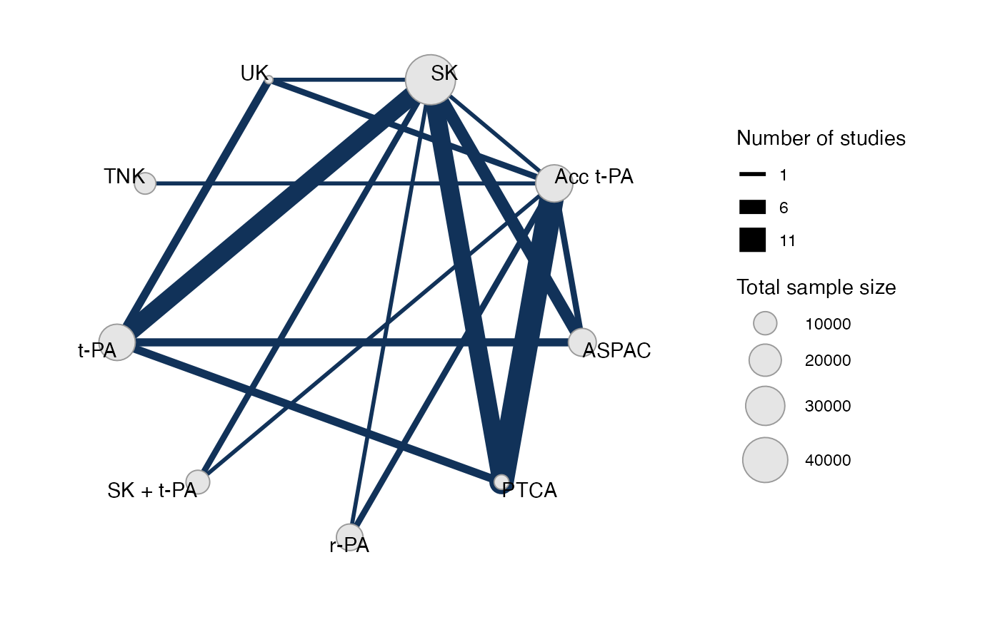
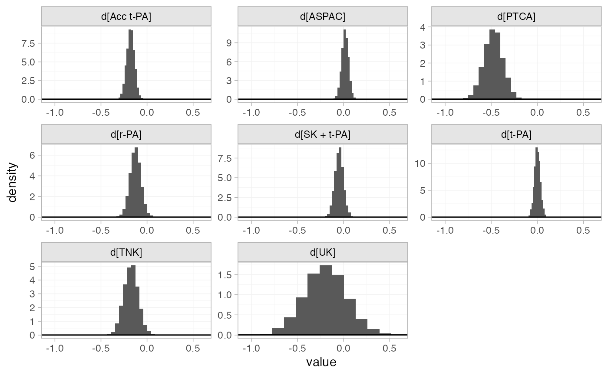
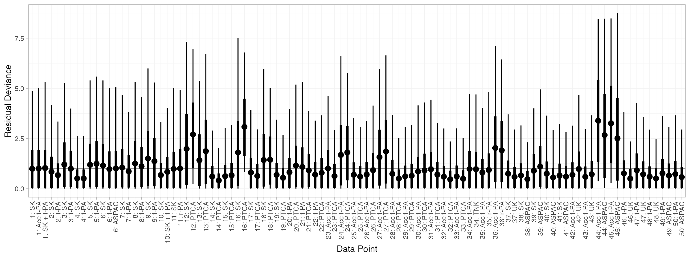
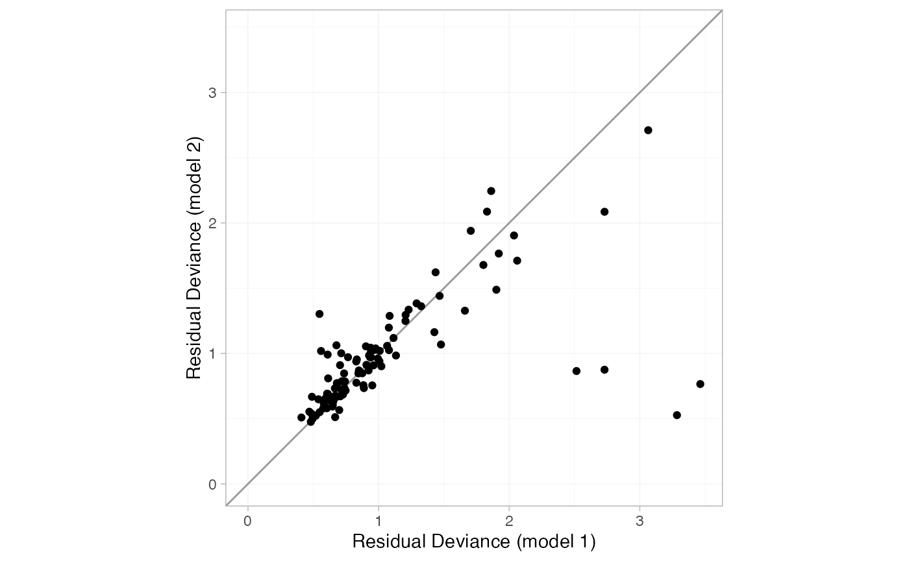
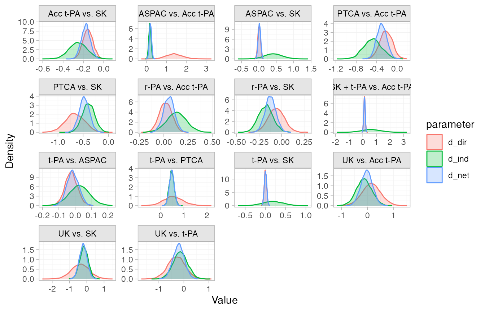
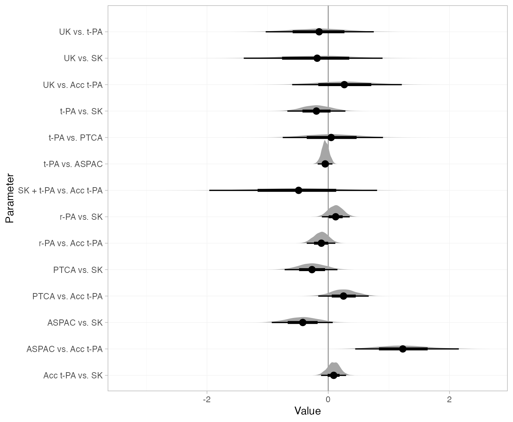
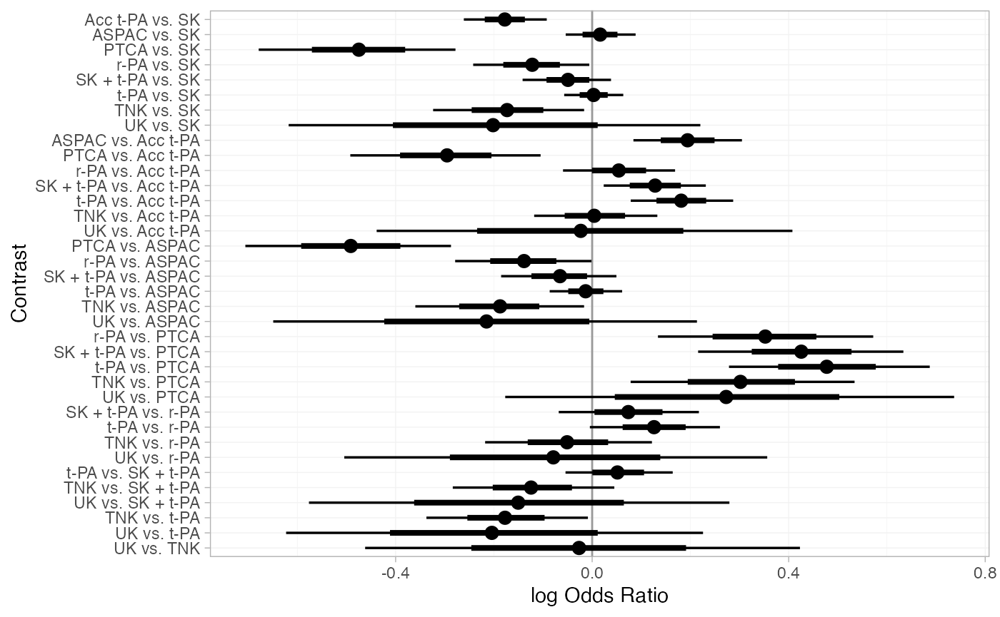
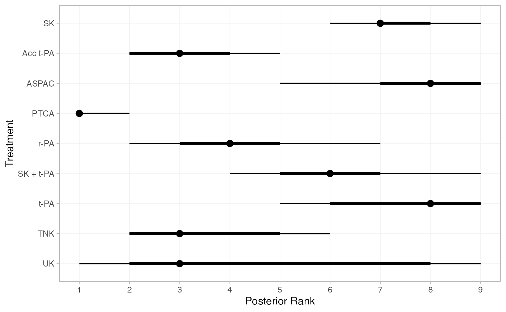
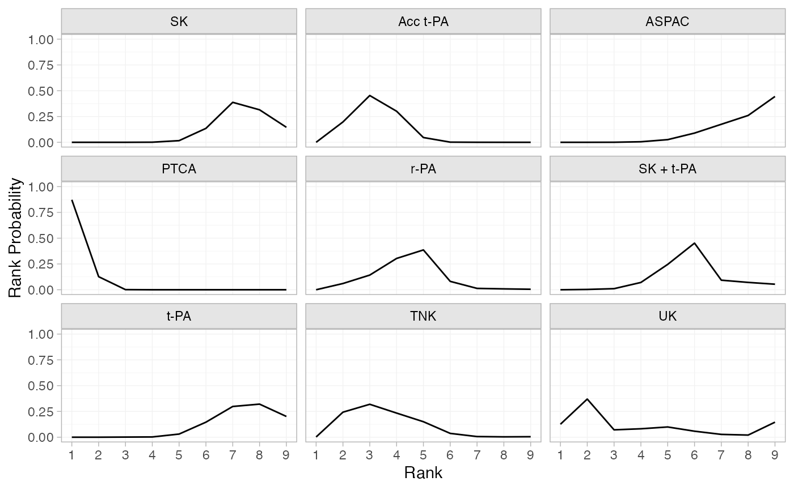
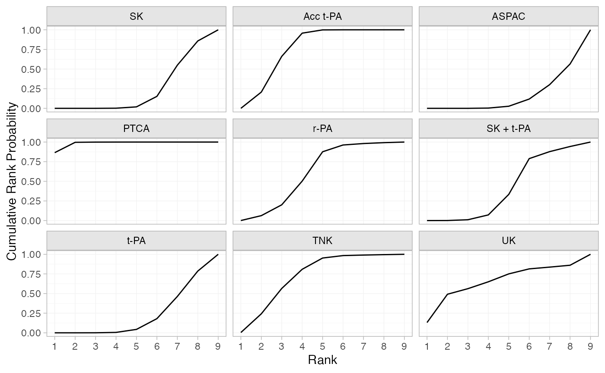

# Example: Thrombolytic treatments

``` r
library(multinma)
options(mc.cores = parallel::detectCores())
```

    #> For execution on a local, multicore CPU with excess RAM we recommend calling
    #> options(mc.cores = parallel::detectCores())
    #> 
    #> Attaching package: 'multinma'
    #> The following objects are masked from 'package:stats':
    #> 
    #>     dgamma, pgamma, qgamma

This vignette describes the analysis of 50 trials of 8 thrombolytic
drugs (streptokinase, SK; alteplase, t-PA; accelerated alteplase, Acc
t-PA; streptokinase plus alteplase, SK+tPA; reteplase, r-PA;
tenocteplase, TNK; urokinase, UK; anistreptilase, ASPAC) plus
per-cutaneous transluminal coronary angioplasty (PTCA) ([Boland et al.
2003](#ref-Boland2003); [Lu and Ades 2006](#ref-Lu2006); [Dias et al.
2011](#ref-TSD4), [2010](#ref-Dias2010)). The number of deaths in 30 or
35 days following acute myocardial infarction are recorded. The data are
available in this package as `thrombolytics`:

``` r
head(thrombolytics)
#>   studyn trtn      trtc    r     n
#> 1      1    1        SK 1472 20251
#> 2      1    3  Acc t-PA  652 10396
#> 3      1    4 SK + t-PA  723 10374
#> 4      2    1        SK    9   130
#> 5      2    2      t-PA    6   123
#> 6      3    1        SK    5    63
```

## Setting up the network

We begin by setting up the network. We have arm-level count data giving
the number of deaths (`r`) out of the total (`n`) in each arm, so we use
the function
[`set_agd_arm()`](https://dmphillippo.github.io/multinma/dev/reference/set_agd_arm.md).
By default, SK is set as the network reference treatment.

``` r
thrombo_net <- set_agd_arm(thrombolytics, 
                           study = studyn,
                           trt = trtc,
                           r = r, 
                           n = n)
thrombo_net
#> A network with 50 AgD studies (arm-based).
#> 
#> ------------------------------------------------------- AgD studies (arm-based) ---- 
#>  Study Treatment arms              
#>  1     3: SK | Acc t-PA | SK + t-PA
#>  2     2: SK | t-PA                
#>  3     2: SK | t-PA                
#>  4     2: SK | t-PA                
#>  5     2: SK | t-PA                
#>  6     3: SK | ASPAC | t-PA        
#>  7     2: SK | t-PA                
#>  8     2: SK | t-PA                
#>  9     2: SK | t-PA                
#>  10    2: SK | SK + t-PA           
#>  ... plus 40 more studies
#> 
#>  Outcome type: count
#> ------------------------------------------------------------------------------------
#> Total number of treatments: 9
#> Total number of studies: 50
#> Reference treatment is: SK
#> Network is connected
```

Plot the network structure.

``` r
plot(thrombo_net, weight_edges = TRUE, weight_nodes = TRUE)
```



## Fixed effects NMA

Following TSD 4 ([Dias et al. 2011](#ref-TSD4)), we fit a fixed effects
NMA model, using the
[`nma()`](https://dmphillippo.github.io/multinma/dev/reference/nma.md)
function with `trt_effects = "fixed"`. We use \mathrm{N}(0, 100^2) prior
distributions for the treatment effects d_k and study-specific
intercepts \mu_j. We can examine the range of parameter values implied
by these prior distributions with the
[`summary()`](https://rdrr.io/r/base/summary.html) method:

``` r
summary(normal(scale = 100))
#> A Normal prior distribution: location = 0, scale = 100.
#> 50% of the prior density lies between -67.45 and 67.45.
#> 95% of the prior density lies between -196 and 196.
```

The model is fitted using the
[`nma()`](https://dmphillippo.github.io/multinma/dev/reference/nma.md)
function. By default, this will use a Binomial likelihood and a logit
link function, auto-detected from the data.

``` r
thrombo_fit <- nma(thrombo_net, 
                   trt_effects = "fixed",
                   prior_intercept = normal(scale = 100),
                   prior_trt = normal(scale = 100))
#> Note: Setting "SK" as the network reference treatment.
```

Basic parameter summaries are given by the
[`print()`](https://rdrr.io/r/base/print.html) method:

``` r
thrombo_fit
#> A fixed effects NMA with a binomial likelihood (logit link).
#> Inference for Stan model: binomial_1par.
#> 4 chains, each with iter=2000; warmup=1000; thin=1; 
#> post-warmup draws per chain=1000, total post-warmup draws=4000.
#> 
#>                   mean se_mean   sd      2.5%       25%       50%       75%     97.5% n_eff
#> d[Acc t-PA]      -0.18    0.00 0.04     -0.26     -0.21     -0.18     -0.15     -0.09  2282
#> d[ASPAC]          0.02    0.00 0.04     -0.06     -0.01      0.02      0.04      0.09  6274
#> d[PTCA]          -0.48    0.00 0.10     -0.68     -0.54     -0.48     -0.41     -0.29  3674
#> d[r-PA]          -0.12    0.00 0.06     -0.24     -0.16     -0.12     -0.08     -0.01  3136
#> d[SK + t-PA]     -0.05    0.00 0.05     -0.14     -0.08     -0.05     -0.02      0.04  4511
#> d[t-PA]           0.00    0.00 0.03     -0.05     -0.02      0.00      0.02      0.06  4702
#> d[TNK]           -0.17    0.00 0.08     -0.33     -0.23     -0.17     -0.12     -0.02  3049
#> d[UK]            -0.20    0.00 0.22     -0.62     -0.35     -0.20     -0.05      0.24  4542
#> lp__         -43042.86    0.14 5.45 -43054.42 -43046.43 -43042.59 -43038.91 -43033.24  1459
#>              Rhat
#> d[Acc t-PA]     1
#> d[ASPAC]        1
#> d[PTCA]         1
#> d[r-PA]         1
#> d[SK + t-PA]    1
#> d[t-PA]         1
#> d[TNK]          1
#> d[UK]           1
#> lp__            1
#> 
#> Samples were drawn using NUTS(diag_e) at Fri Apr 17 10:12:54 2026.
#> For each parameter, n_eff is a crude measure of effective sample size,
#> and Rhat is the potential scale reduction factor on split chains (at 
#> convergence, Rhat=1).
```

By default, summaries of the study-specific intercepts \mu_j are hidden,
but could be examined by changing the `pars` argument:

``` r
# Not run
print(thrombo_fit, pars = c("d", "mu"))
```

The prior and posterior distributions can be compared visually using the
[`plot_prior_posterior()`](https://dmphillippo.github.io/multinma/dev/reference/plot_prior_posterior.md)
function:

``` r
plot_prior_posterior(thrombo_fit, prior = "trt")
```



Model fit can be checked using the
[`dic()`](https://dmphillippo.github.io/multinma/dev/reference/dic.md)
function

``` r
(dic_consistency <- dic(thrombo_fit))
#> Residual deviance: 105.9 (on 102 data points)
#>                pD: 58.7
#>               DIC: 164.6
```

and the residual deviance contributions examined with the corresponding
[`plot()`](https://rdrr.io/r/graphics/plot.default.html) method.

``` r
plot(dic_consistency)
```



There are a number of points which are not very well fit by the model,
having posterior mean residual deviance contributions greater than 1.

## Checking for inconsistency

> **Note:** The results of the inconsistency models here are slightly
> different to those of Dias et al. ([2010](#ref-Dias2010),
> [2011](#ref-TSD4)), although the overall conclusions are the same.
> This is due to the presence of multi-arm trials and a different
> ordering of treatments, meaning that inconsistency is parameterised
> differently within the multi-arm trials. The same results as Dias et
> al. are obtained if the network is instead set up with `trtn` as the
> treatment variable.

### Unrelated mean effects model

We first fit an unrelated mean effects (UME) model ([Dias et al.
2011](#ref-TSD4)) to assess the consistency assumption. Again, we use
the function
[`nma()`](https://dmphillippo.github.io/multinma/dev/reference/nma.md),
but now with the argument `consistency = "ume"`.

``` r
thrombo_fit_ume <- nma(thrombo_net, 
                       consistency = "ume",
                       trt_effects = "fixed",
                       prior_intercept = normal(scale = 100),
                       prior_trt = normal(scale = 100))
#> Note: Setting "SK" as the network reference treatment.
thrombo_fit_ume
#> A fixed effects NMA with a binomial likelihood (logit link).
#> An inconsistency model ('ume') was fitted.
#> Inference for Stan model: binomial_1par.
#> 4 chains, each with iter=2000; warmup=1000; thin=1; 
#> post-warmup draws per chain=1000, total post-warmup draws=4000.
#> 
#>                            mean se_mean   sd      2.5%       25%       50%       75%     97.5%
#> d[Acc t-PA vs. SK]        -0.16    0.00 0.05     -0.25     -0.19     -0.16     -0.13     -0.07
#> d[ASPAC vs. SK]            0.01    0.00 0.04     -0.07     -0.02      0.01      0.03      0.08
#> d[PTCA vs. SK]            -0.66    0.00 0.19     -1.04     -0.79     -0.66     -0.54     -0.29
#> d[r-PA vs. SK]            -0.06    0.00 0.09     -0.24     -0.12     -0.06      0.00      0.12
#> d[SK + t-PA vs. SK]       -0.04    0.00 0.05     -0.13     -0.08     -0.04     -0.01      0.05
#> d[t-PA vs. SK]             0.00    0.00 0.03     -0.06     -0.02      0.00      0.02      0.06
#> d[UK vs. SK]              -0.37    0.01 0.52     -1.46     -0.71     -0.38     -0.01      0.65
#> d[ASPAC vs. Acc t-PA]      1.41    0.01 0.42      0.62      1.12      1.39      1.69      2.23
#> d[PTCA vs. Acc t-PA]      -0.21    0.00 0.12     -0.44     -0.29     -0.22     -0.13      0.01
#> d[r-PA vs. Acc t-PA]       0.02    0.00 0.07     -0.11     -0.03      0.02      0.06      0.16
#> d[TNK vs. Acc t-PA]        0.00    0.00 0.06     -0.12     -0.04      0.01      0.05      0.13
#> d[UK vs. Acc t-PA]         0.15    0.01 0.35     -0.53     -0.09      0.15      0.38      0.84
#> d[t-PA vs. ASPAC]          0.29    0.01 0.36     -0.41      0.06      0.29      0.53      1.02
#> d[t-PA vs. PTCA]           0.54    0.01 0.41     -0.25      0.26      0.53      0.82      1.36
#> d[UK vs. t-PA]            -0.30    0.01 0.34     -0.98     -0.52     -0.29     -0.07      0.38
#> lp__                  -43039.71    0.14 5.73 -43051.68 -43043.41 -43039.38 -43035.70 -43029.33
#>                       n_eff Rhat
#> d[Acc t-PA vs. SK]     4922    1
#> d[ASPAC vs. SK]        4156    1
#> d[PTCA vs. SK]         4903    1
#> d[r-PA vs. SK]         5564    1
#> d[SK + t-PA vs. SK]    5284    1
#> d[t-PA vs. SK]         3442    1
#> d[UK vs. SK]           4330    1
#> d[ASPAC vs. Acc t-PA]  3406    1
#> d[PTCA vs. Acc t-PA]   4038    1
#> d[r-PA vs. Acc t-PA]   4655    1
#> d[TNK vs. Acc t-PA]    5642    1
#> d[UK vs. Acc t-PA]     4389    1
#> d[t-PA vs. ASPAC]      3816    1
#> d[t-PA vs. PTCA]       3505    1
#> d[UK vs. t-PA]         4645    1
#> lp__                   1655    1
#> 
#> Samples were drawn using NUTS(diag_e) at Fri Apr 17 10:13:00 2026.
#> For each parameter, n_eff is a crude measure of effective sample size,
#> and Rhat is the potential scale reduction factor on split chains (at 
#> convergence, Rhat=1).
```

Comparing the model fit statistics

``` r
dic_consistency
#> Residual deviance: 105.9 (on 102 data points)
#>                pD: 58.7
#>               DIC: 164.6
(dic_ume <- dic(thrombo_fit_ume))
#> Residual deviance: 99.6 (on 102 data points)
#>                pD: 65.9
#>               DIC: 165.4
```

Whilst the UME model fits the data better, having a lower residual
deviance, the additional parameters in the UME model mean that the DIC
is very similar between both models. However, it is also important to
examine the individual contributions to model fit of each data point
under the two models (a so-called “dev-dev” plot). Passing two `nma_dic`
objects produced by the
[`dic()`](https://dmphillippo.github.io/multinma/dev/reference/dic.md)
function to the [`plot()`](https://rdrr.io/r/graphics/plot.default.html)
method produces this dev-dev plot:

``` r
plot(dic_consistency, dic_ume, show_uncertainty = FALSE)
```



The four points lying in the lower right corner of the plot have much
lower posterior mean residual deviance under the UME model, indicating
that these data are potentially inconsistent. These points correspond to
trials 44 and 45, the only two trials comparing Acc t-PA to ASPAC. The
ASPAC vs. Acc t-PA estimates are very different under the consistency
model and inconsistency (UME) model, suggesting that these two trials
may be systematically different from the others in the network.

### Node-splitting

Another method for assessing inconsistency is node-splitting ([Dias et
al. 2011](#ref-TSD4), [2010](#ref-Dias2010)). Whereas the UME model
assesses inconsistency globally, node-splitting assesses inconsistency
locally for each potentially inconsistent comparison (those with both
direct and indirect evidence) in turn.

Node-splitting can be performed using the
[`nma()`](https://dmphillippo.github.io/multinma/dev/reference/nma.md)
function with the argument `consistency = "nodesplit"`. By default, all
possible comparisons will be split (as determined by the
[`get_nodesplits()`](https://dmphillippo.github.io/multinma/dev/reference/get_nodesplits.md)
function). Alternatively, a specific comparison or comparisons to split
can be provided to the `nodesplit` argument.

``` r
thrombo_nodesplit <- nma(thrombo_net, 
                         consistency = "nodesplit",
                         trt_effects = "fixed",
                         prior_intercept = normal(scale = 100),
                         prior_trt = normal(scale = 100))
#> Fitting model 1 of 15, node-split: Acc t-PA vs. SK
#> Note: Setting "SK" as the network reference treatment.
#> Fitting model 2 of 15, node-split: ASPAC vs. SK
#> Note: Setting "SK" as the network reference treatment.
#> Fitting model 3 of 15, node-split: PTCA vs. SK
#> Note: Setting "SK" as the network reference treatment.
#> Fitting model 4 of 15, node-split: r-PA vs. SK
#> Note: Setting "SK" as the network reference treatment.
#> Fitting model 5 of 15, node-split: t-PA vs. SK
#> Note: Setting "SK" as the network reference treatment.
#> Fitting model 6 of 15, node-split: UK vs. SK
#> Note: Setting "SK" as the network reference treatment.
#> Fitting model 7 of 15, node-split: ASPAC vs. Acc t-PA
#> Note: Setting "SK" as the network reference treatment.
#> Fitting model 8 of 15, node-split: PTCA vs. Acc t-PA
#> Note: Setting "SK" as the network reference treatment.
#> Fitting model 9 of 15, node-split: r-PA vs. Acc t-PA
#> Note: Setting "SK" as the network reference treatment.
#> Fitting model 10 of 15, node-split: SK + t-PA vs. Acc t-PA
#> Note: Setting "SK" as the network reference treatment.
#> Fitting model 11 of 15, node-split: UK vs. Acc t-PA
#> Note: Setting "SK" as the network reference treatment.
#> Fitting model 12 of 15, node-split: t-PA vs. ASPAC
#> Note: Setting "SK" as the network reference treatment.
#> Fitting model 13 of 15, node-split: t-PA vs. PTCA
#> Note: Setting "SK" as the network reference treatment.
#> Fitting model 14 of 15, node-split: UK vs. t-PA
#> Note: Setting "SK" as the network reference treatment.
#> Fitting model 15 of 15, consistency model
#> Note: Setting "SK" as the network reference treatment.
```

The [`summary()`](https://rdrr.io/r/base/summary.html) method summarises
the node-splitting results, displaying the direct and indirect estimates
d\_\mathrm{dir} and d\_\mathrm{ind} from each node-split model, the
network estimate d\_\mathrm{net} from the consistency model, the
inconsistency factor \omega = d\_\mathrm{dir} - d\_\mathrm{ind}, and a
Bayesian p-value for inconsistency on each comparison. The DIC model fit
statistics are also provided. (If a random effects model was fitted, the
heterogeneity standard deviation \tau under each node-split model and
under the consistency model would also be displayed.)

``` r
summary(thrombo_nodesplit)
#> Node-splitting models fitted for 14 comparisons.
#> 
#> ---------------------------------------------------- Node-split Acc t-PA vs. SK ---- 
#> 
#>        mean   sd  2.5%   25%   50%   75% 97.5% Bulk_ESS Tail_ESS Rhat
#> d_net -0.18 0.04 -0.26 -0.21 -0.18 -0.15 -0.09     2829     3285    1
#> d_dir -0.16 0.05 -0.25 -0.19 -0.16 -0.12 -0.06     3611     3629    1
#> d_ind -0.25 0.09 -0.42 -0.31 -0.25 -0.18 -0.06      781     1281    1
#> omega  0.09 0.10 -0.12  0.02  0.09  0.16  0.29      897     1821    1
#> 
#> Residual deviance: 106.1 (on 102 data points)
#>                pD: 59.7
#>               DIC: 165.8
#> 
#> Bayesian p-value: 0.39
#> 
#> ------------------------------------------------------- Node-split ASPAC vs. SK ---- 
#> 
#>        mean   sd  2.5%   25%   50%   75% 97.5% Bulk_ESS Tail_ESS Rhat
#> d_net  0.02 0.04 -0.06 -0.01  0.02  0.04  0.09     4921     3272    1
#> d_dir  0.01 0.04 -0.06 -0.02  0.01  0.03  0.08     4413     3279    1
#> d_ind  0.43 0.26 -0.06  0.26  0.43  0.61  0.93     2412     2650    1
#> omega -0.42 0.26 -0.93 -0.60 -0.42 -0.25  0.07     2466     2237    1
#> 
#> Residual deviance: 104.6 (on 102 data points)
#>                pD: 60.1
#>               DIC: 164.7
#> 
#> Bayesian p-value: 0.096
#> 
#> -------------------------------------------------------- Node-split PTCA vs. SK ---- 
#> 
#>        mean   sd  2.5%   25%   50%   75% 97.5% Bulk_ESS Tail_ESS Rhat
#> d_net -0.47 0.10 -0.68 -0.54 -0.47 -0.40 -0.28     4278     3561    1
#> d_dir -0.66 0.19 -1.03 -0.78 -0.66 -0.54 -0.30     5008     3177    1
#> d_ind -0.39 0.12 -0.62 -0.47 -0.39 -0.31 -0.16     3479     3476    1
#> omega -0.27 0.22 -0.72 -0.42 -0.27 -0.12  0.15     4281     3302    1
#> 
#> Residual deviance: 105.5 (on 102 data points)
#>                pD: 59.8
#>               DIC: 165.3
#> 
#> Bayesian p-value: 0.23
#> 
#> -------------------------------------------------------- Node-split r-PA vs. SK ---- 
#> 
#>        mean   sd  2.5%   25%   50%   75% 97.5% Bulk_ESS Tail_ESS Rhat
#> d_net -0.12 0.06 -0.24 -0.16 -0.12 -0.08  0.00     3934     3728    1
#> d_dir -0.06 0.09 -0.23 -0.12 -0.06  0.00  0.11     5317     3758    1
#> d_ind -0.18 0.08 -0.34 -0.23 -0.18 -0.13 -0.02     2616     2797    1
#> omega  0.12 0.12 -0.11  0.04  0.12  0.20  0.35     3166     3404    1
#> 
#> Residual deviance: 105.8 (on 102 data points)
#>                pD: 59.5
#>               DIC: 165.3
#> 
#> Bayesian p-value: 0.3
#> 
#> -------------------------------------------------------- Node-split t-PA vs. SK ---- 
#> 
#>        mean   sd  2.5%   25%  50%   75% 97.5% Bulk_ESS Tail_ESS Rhat
#> d_net  0.00 0.03 -0.06 -0.02  0.0  0.02  0.06     4247     3428    1
#> d_dir  0.00 0.03 -0.06 -0.02  0.0  0.02  0.06     3766     3236    1
#> d_ind  0.20 0.24 -0.28  0.03  0.2  0.36  0.67     1188     1674    1
#> omega -0.19 0.24 -0.67 -0.36 -0.2 -0.03  0.28     1192     1627    1
#> 
#> Residual deviance: 106.1 (on 102 data points)
#>                pD: 59.5
#>               DIC: 165.6
#> 
#> Bayesian p-value: 0.42
#> 
#> ---------------------------------------------------------- Node-split UK vs. SK ---- 
#> 
#>        mean   sd  2.5%   25%   50%   75% 97.5% Bulk_ESS Tail_ESS Rhat
#> d_net -0.20 0.22 -0.63 -0.35 -0.20 -0.05  0.23     5086     3492    1
#> d_dir -0.37 0.53 -1.45 -0.71 -0.36 -0.02  0.64     5967     3383    1
#> d_ind -0.16 0.25 -0.64 -0.34 -0.17  0.00  0.33     4475     3188    1
#> omega -0.21 0.59 -1.39 -0.60 -0.18  0.19  0.90     5313     3072    1
#> 
#> Residual deviance: 107.1 (on 102 data points)
#>                pD: 60
#>               DIC: 167.1
#> 
#> Bayesian p-value: 0.75
#> 
#> ------------------------------------------------- Node-split ASPAC vs. Acc t-PA ---- 
#> 
#>       mean   sd 2.5%  25%  50%  75% 97.5% Bulk_ESS Tail_ESS Rhat
#> d_net 0.19 0.06 0.08 0.15 0.19 0.23  0.30     3578     3457    1
#> d_dir 1.41 0.42 0.63 1.12 1.40 1.68  2.29     3819     2946    1
#> d_ind 0.16 0.06 0.05 0.13 0.16 0.20  0.28     2801     2977    1
#> omega 1.25 0.42 0.44 0.95 1.23 1.52  2.15     3567     3100    1
#> 
#> Residual deviance: 96.6 (on 102 data points)
#>                pD: 59.4
#>               DIC: 156
#> 
#> Bayesian p-value: <0.01
#> 
#> -------------------------------------------------- Node-split PTCA vs. Acc t-PA ---- 
#> 
#>        mean   sd  2.5%   25%   50%   75% 97.5% Bulk_ESS Tail_ESS Rhat
#> d_net -0.30 0.10 -0.49 -0.36 -0.30 -0.23 -0.10     5146     3648    1
#> d_dir -0.22 0.12 -0.46 -0.30 -0.22 -0.14  0.01     4205     3251    1
#> d_ind -0.47 0.17 -0.82 -0.59 -0.47 -0.36 -0.12     2983     2689    1
#> omega  0.25 0.21 -0.16  0.11  0.25  0.39  0.67     2791     2653    1
#> 
#> Residual deviance: 105.3 (on 102 data points)
#>                pD: 59.7
#>               DIC: 165
#> 
#> Bayesian p-value: 0.22
#> 
#> -------------------------------------------------- Node-split r-PA vs. Acc t-PA ---- 
#> 
#>        mean   sd  2.5%   25%   50%   75% 97.5% Bulk_ESS Tail_ESS Rhat
#> d_net  0.05 0.06 -0.05  0.02  0.05  0.09  0.17     6384     3753    1
#> d_dir  0.02 0.07 -0.11 -0.02  0.02  0.07  0.15     5499     3773    1
#> d_ind  0.14 0.10 -0.06  0.07  0.14  0.21  0.34     2200     2558    1
#> omega -0.12 0.12 -0.35 -0.20 -0.11 -0.03  0.12     2284     2744    1
#> 
#> Residual deviance: 106 (on 102 data points)
#>                pD: 59.7
#>               DIC: 165.7
#> 
#> Bayesian p-value: 0.33
#> 
#> --------------------------------------------- Node-split SK + t-PA vs. Acc t-PA ---- 
#> 
#>        mean   sd  2.5%   25%   50%   75% 97.5% Bulk_ESS Tail_ESS Rhat
#> d_net  0.13 0.05  0.02  0.09  0.13  0.16  0.23     5546     3319    1
#> d_dir  0.13 0.05  0.02  0.09  0.13  0.16  0.23     3859     3320    1
#> d_ind  0.64 0.70 -0.66  0.16  0.61  1.08  2.09     3244     2285    1
#> omega -0.51 0.70 -1.96 -0.95 -0.49 -0.03  0.81     3266     2399    1
#> 
#> Residual deviance: 106.6 (on 102 data points)
#>                pD: 59.9
#>               DIC: 166.6
#> 
#> Bayesian p-value: 0.46
#> 
#> ---------------------------------------------------- Node-split UK vs. Acc t-PA ---- 
#> 
#>        mean   sd  2.5%   25%   50%  75% 97.5% Bulk_ESS Tail_ESS Rhat
#> d_net -0.02 0.22 -0.45 -0.18 -0.03 0.13  0.41     5173     3586    1
#> d_dir  0.14 0.36 -0.55 -0.10  0.14 0.38  0.86     5105     3461    1
#> d_ind -0.13 0.29 -0.71 -0.32 -0.13 0.07  0.42     4119     2829    1
#> omega  0.27 0.46 -0.60 -0.04  0.27 0.58  1.21     3884     2684    1
#> 
#> Residual deviance: 106.7 (on 102 data points)
#>                pD: 59.8
#>               DIC: 166.5
#> 
#> Bayesian p-value: 0.55
#> 
#> ----------------------------------------------------- Node-split t-PA vs. ASPAC ---- 
#> 
#>        mean   sd  2.5%   25%   50%   75% 97.5% Bulk_ESS Tail_ESS Rhat
#> d_net -0.01 0.04 -0.08 -0.04 -0.01  0.01  0.06     6939     3338    1
#> d_dir -0.02 0.04 -0.10 -0.05 -0.02  0.00  0.05     4488     3651    1
#> d_ind  0.03 0.06 -0.09 -0.01  0.03  0.07  0.15     3471     3236    1
#> omega -0.05 0.06 -0.17 -0.09 -0.05 -0.01  0.07     3519     3264    1
#> 
#> Residual deviance: 106.6 (on 102 data points)
#>                pD: 60
#>               DIC: 166.6
#> 
#> Bayesian p-value: 0.42
#> 
#> ------------------------------------------------------ Node-split t-PA vs. PTCA ---- 
#> 
#>       mean   sd  2.5%   25%  50%  75% 97.5% Bulk_ESS Tail_ESS Rhat
#> d_net 0.48 0.11  0.27  0.40 0.48 0.55  0.69     4341     3407    1
#> d_dir 0.53 0.41 -0.22  0.25 0.53 0.80  1.36     4940     3163    1
#> d_ind 0.48 0.11  0.27  0.40 0.48 0.55  0.69     4014     3519    1
#> omega 0.06 0.43 -0.75 -0.24 0.05 0.34  0.90     4453     3145    1
#> 
#> Residual deviance: 106.6 (on 102 data points)
#>                pD: 59.4
#>               DIC: 166
#> 
#> Bayesian p-value: 0.9
#> 
#> -------------------------------------------------------- Node-split UK vs. t-PA ---- 
#> 
#>        mean   sd  2.5%   25%   50%   75% 97.5% Bulk_ESS Tail_ESS Rhat
#> d_net -0.20 0.22 -0.64 -0.36 -0.21 -0.06  0.23     5258     3628    1
#> d_dir -0.30 0.35 -0.98 -0.53 -0.29 -0.07  0.37     4838     3525    1
#> d_ind -0.14 0.29 -0.70 -0.33 -0.15  0.05  0.43     3982     3187    1
#> omega -0.16 0.45 -1.03 -0.47 -0.15  0.14  0.75     4112     3155    1
#> 
#> Residual deviance: 106.7 (on 102 data points)
#>                pD: 59.6
#>               DIC: 166.3
#> 
#> Bayesian p-value: 0.72
```

Node-splitting the ASPAC vs. Acc t-PA comparison results the lowest DIC,
and this is lower than the consistency model. The posterior distribution
for the inconsistency factor \omega for this comparison lies far from 0
and the Bayesian p-value for inconsistency is small (\< 0.01), meaning
that there is substantial disagreement between the direct and indirect
evidence on this comparison.

We can visually compare the direct, indirect, and network estimates
using the [`plot()`](https://rdrr.io/r/graphics/plot.default.html)
method.

``` r
plot(thrombo_nodesplit)
```



We can also plot the posterior distributions of the inconsistency
factors \omega, again using the
[`plot()`](https://rdrr.io/r/graphics/plot.default.html) method. Here,
we specify a “halfeye” plot of the posterior density with median and
credible intervals, and customise the plot layout with standard
`ggplot2` functions.

``` r
plot(thrombo_nodesplit, pars = "omega", stat = "halfeye", ref_line = 0) +
  ggplot2::aes(y = comparison) +
  ggplot2::facet_null()
```



Notice again that the posterior distribution of the inconsistency factor
for the ASPAC vs. Acc t-PA comparison lies far from 0, indicating
substantial inconsistency between the direct and indirect evidence on
this comparison.

## Further results

Relative effects for all pairwise contrasts between treatments can be
produced using the
[`relative_effects()`](https://dmphillippo.github.io/multinma/dev/reference/relative_effects.md)
function, with `all_contrasts = TRUE`.

``` r
(thrombo_releff <- relative_effects(thrombo_fit, all_contrasts = TRUE))
#>                            mean   sd  2.5%   25%   50%   75% 97.5% Bulk_ESS Tail_ESS Rhat
#> d[Acc t-PA vs. SK]        -0.18 0.04 -0.26 -0.21 -0.18 -0.15 -0.09     2297     2890    1
#> d[ASPAC vs. SK]            0.02 0.04 -0.06 -0.01  0.02  0.04  0.09     6306     3122    1
#> d[PTCA vs. SK]            -0.48 0.10 -0.68 -0.54 -0.48 -0.41 -0.29     3707     2941    1
#> d[r-PA vs. SK]            -0.12 0.06 -0.24 -0.16 -0.12 -0.08 -0.01     3155     3054    1
#> d[SK + t-PA vs. SK]       -0.05 0.05 -0.14 -0.08 -0.05 -0.02  0.04     4626     3134    1
#> d[t-PA vs. SK]             0.00 0.03 -0.05 -0.02  0.00  0.02  0.06     4738     3740    1
#> d[TNK vs. SK]             -0.17 0.08 -0.33 -0.23 -0.17 -0.12 -0.02     3102     3056    1
#> d[UK vs. SK]              -0.20 0.22 -0.62 -0.35 -0.20 -0.05  0.24     4587     3185    1
#> d[ASPAC vs. Acc t-PA]      0.19 0.06  0.08  0.16  0.19  0.23  0.30     2991     3249    1
#> d[PTCA vs. Acc t-PA]      -0.30 0.10 -0.50 -0.37 -0.30 -0.23 -0.11     5470     3119    1
#> d[r-PA vs. Acc t-PA]       0.05 0.05 -0.05  0.02  0.05  0.09  0.16     5337     3122    1
#> d[SK + t-PA vs. Acc t-PA]  0.13 0.05  0.02  0.09  0.13  0.16  0.23     5625     3490    1
#> d[t-PA vs. Acc t-PA]       0.18 0.05  0.07  0.14  0.18  0.22  0.29     2778     3132    1
#> d[TNK vs. Acc t-PA]        0.00 0.06 -0.13 -0.04  0.01  0.05  0.13     5569     3440    1
#> d[UK vs. Acc t-PA]        -0.02 0.22 -0.45 -0.18 -0.02  0.12  0.42     4777     3139    1
#> d[PTCA vs. ASPAC]         -0.49 0.11 -0.71 -0.56 -0.49 -0.42 -0.29     3813     2868    1
#> d[r-PA vs. ASPAC]         -0.14 0.07 -0.28 -0.19 -0.14 -0.09  0.00     3739     3517    1
#> d[SK + t-PA vs. ASPAC]    -0.07 0.06 -0.18 -0.11 -0.07 -0.03  0.05     5913     3605    1
#> d[t-PA vs. ASPAC]         -0.01 0.04 -0.09 -0.04 -0.01  0.01  0.06     8004     3118    1
#> d[TNK vs. ASPAC]          -0.19 0.09 -0.36 -0.25 -0.19 -0.13 -0.02     3388     3468    1
#> d[UK vs. ASPAC]           -0.22 0.22 -0.66 -0.37 -0.22 -0.07  0.23     4701     3155    1
#> d[r-PA vs. PTCA]           0.35 0.11  0.14  0.28  0.35  0.43  0.57     5165     3169    1
#> d[SK + t-PA vs. PTCA]      0.43 0.11  0.22  0.36  0.43  0.50  0.64     5069     3705    1
#> d[t-PA vs. PTCA]           0.48 0.10  0.28  0.41  0.48  0.55  0.69     3723     2692    1
#> d[TNK vs. PTCA]            0.30 0.12  0.08  0.23  0.31  0.38  0.53     5869     3409    1
#> d[UK vs. PTCA]             0.28 0.24 -0.20  0.11  0.28  0.44  0.76     4930     3276    1
#> d[SK + t-PA vs. r-PA]      0.07 0.07 -0.06  0.03  0.07  0.12  0.21     5588     3336    1
#> d[t-PA vs. r-PA]           0.13 0.07  0.00  0.08  0.13  0.17  0.26     3351     3015    1
#> d[TNK vs. r-PA]           -0.05 0.08 -0.21 -0.10 -0.05  0.01  0.12     6617     3188    1
#> d[UK vs. r-PA]            -0.08 0.23 -0.51 -0.23 -0.08  0.07  0.37     4906     3153    1
#> d[t-PA vs. SK + t-PA]      0.05 0.06 -0.06  0.02  0.05  0.09  0.16     5193     3110    1
#> d[TNK vs. SK + t-PA]      -0.12 0.09 -0.29 -0.18 -0.12 -0.06  0.04     5361     3211    1
#> d[UK vs. SK + t-PA]       -0.15 0.22 -0.59 -0.31 -0.15  0.00  0.29     4783     3208    1
#> d[TNK vs. t-PA]           -0.18 0.08 -0.34 -0.23 -0.17 -0.12 -0.02     3205     3243    1
#> d[UK vs. t-PA]            -0.20 0.22 -0.63 -0.35 -0.20 -0.06  0.23     4686     3328    1
#> d[UK vs. TNK]             -0.03 0.23 -0.47 -0.19 -0.03  0.13  0.42     4894     3502    1
plot(thrombo_releff, ref_line = 0)
```



Treatment rankings, rank probabilities, and cumulative rank
probabilities.

``` r
(thrombo_ranks <- posterior_ranks(thrombo_fit))
#>                 mean   sd 2.5% 25% 50% 75% 97.5% Bulk_ESS Tail_ESS Rhat
#> rank[SK]        7.44 0.96    6   7   7   8     9     3745       NA    1
#> rank[Acc t-PA]  3.20 0.81    2   3   3   4     5     3992     3614    1
#> rank[ASPAC]     7.99 1.14    5   7   8   9     9     5171       NA    1
#> rank[PTCA]      1.13 0.34    1   1   1   1     2     3792     2868    1
#> rank[r-PA]      4.38 1.15    2   4   4   5     7     4593     3572    1
#> rank[SK + t-PA] 5.97 1.24    4   5   6   6     9     5264       NA    1
#> rank[t-PA]      7.50 1.09    5   7   8   8     9     4634       NA    1
#> rank[TNK]       3.47 1.25    2   3   3   4     6     5166     3851    1
#> rank[UK]        3.92 2.69    1   2   3   6     9     4645       NA    1
plot(thrombo_ranks)
```



``` r
(thrombo_rankprobs <- posterior_rank_probs(thrombo_fit))
#>              p_rank[1] p_rank[2] p_rank[3] p_rank[4] p_rank[5] p_rank[6] p_rank[7] p_rank[8]
#> d[SK]             0.00      0.00      0.00      0.00      0.02      0.14      0.39      0.32
#> d[Acc t-PA]       0.00      0.20      0.45      0.30      0.05      0.00      0.00      0.00
#> d[ASPAC]          0.00      0.00      0.00      0.01      0.03      0.09      0.17      0.26
#> d[PTCA]           0.87      0.13      0.00      0.00      0.00      0.00      0.00      0.00
#> d[r-PA]           0.00      0.06      0.14      0.30      0.39      0.08      0.01      0.01
#> d[SK + t-PA]      0.00      0.00      0.01      0.07      0.25      0.45      0.09      0.07
#> d[t-PA]           0.00      0.00      0.00      0.00      0.03      0.15      0.30      0.32
#> d[TNK]            0.00      0.24      0.32      0.23      0.15      0.04      0.01      0.00
#> d[UK]             0.13      0.37      0.07      0.08      0.10      0.06      0.03      0.02
#>              p_rank[9]
#> d[SK]             0.15
#> d[Acc t-PA]       0.00
#> d[ASPAC]          0.44
#> d[PTCA]           0.00
#> d[r-PA]           0.00
#> d[SK + t-PA]      0.05
#> d[t-PA]           0.20
#> d[TNK]            0.00
#> d[UK]             0.15
plot(thrombo_rankprobs)
```



``` r
(thrombo_cumrankprobs <- posterior_rank_probs(thrombo_fit, cumulative = TRUE))
#>              p_rank[1] p_rank[2] p_rank[3] p_rank[4] p_rank[5] p_rank[6] p_rank[7] p_rank[8]
#> d[SK]             0.00      0.00      0.00      0.00      0.02      0.15      0.54      0.85
#> d[Acc t-PA]       0.00      0.20      0.65      0.95      1.00      1.00      1.00      1.00
#> d[ASPAC]          0.00      0.00      0.00      0.01      0.03      0.12      0.30      0.56
#> d[PTCA]           0.87      1.00      1.00      1.00      1.00      1.00      1.00      1.00
#> d[r-PA]           0.00      0.06      0.20      0.51      0.89      0.97      0.99      1.00
#> d[SK + t-PA]      0.00      0.00      0.01      0.08      0.33      0.78      0.88      0.95
#> d[t-PA]           0.00      0.00      0.00      0.00      0.03      0.18      0.48      0.80
#> d[TNK]            0.00      0.24      0.56      0.80      0.95      0.99      0.99      1.00
#> d[UK]             0.13      0.50      0.57      0.65      0.75      0.81      0.83      0.85
#>              p_rank[9]
#> d[SK]                1
#> d[Acc t-PA]          1
#> d[ASPAC]             1
#> d[PTCA]              1
#> d[r-PA]              1
#> d[SK + t-PA]         1
#> d[t-PA]              1
#> d[TNK]               1
#> d[UK]                1
plot(thrombo_cumrankprobs)
```



## References

Boland, A., Y. Dundar, A. Bagust, A. Haycox, R. Hill, R. Mujica Mota, T.
Walley, and R. Dickson. 2003. “Early Thrombolysis for the Treatment of
Acute Myocardial Infarction: A Systematic Review and Economic
Evaluation.” *Health Technology Assessment* 7 (15).
<https://doi.org/10.3310/hta7150>.

Dias, S., N. J. Welton, D. M. Caldwell, and A. E. Ades. 2010. “Checking
Consistency in Mixed Treatment Comparison Meta-Analysis.” *Statistics in
Medicine* 29 (7-8): 932–44. <https://doi.org/10.1002/sim.3767>.

Dias, S., N. J. Welton, A. J. Sutton, D. M. Caldwell, G. Lu, and A. E.
Ades. 2011. “NICE DSU Technical Support Document 4: Inconsistency in
Networks of Evidence Based on Randomised Controlled Trials.” National
Institute for Health and Care Excellence.
<https://sheffield.ac.uk/nice-dsu>.

Lu, G. B., and A. E. Ades. 2006. “Assessing Evidence Inconsistency in
Mixed Treatment Comparisons.” *Journal of the American Statistical
Association* 101 (474): 447–59.
<https://doi.org/10.1198/016214505000001302>.
