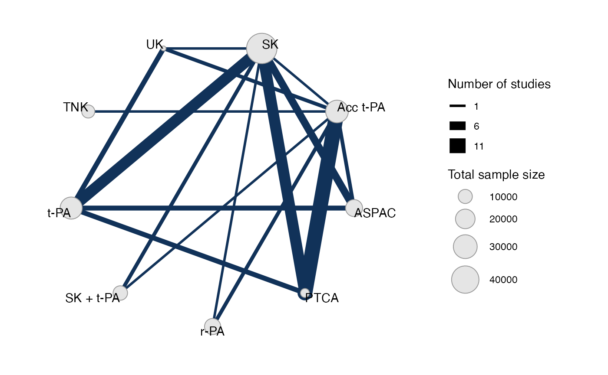
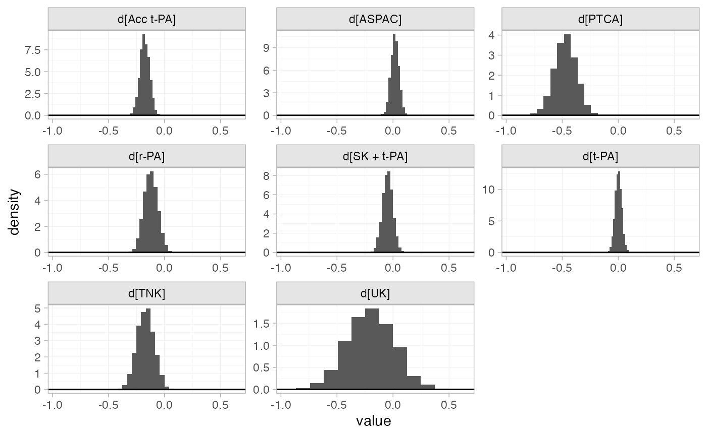
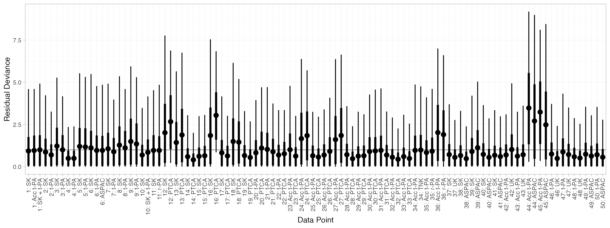
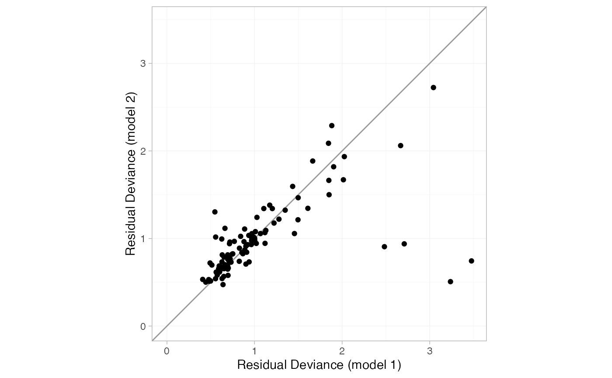
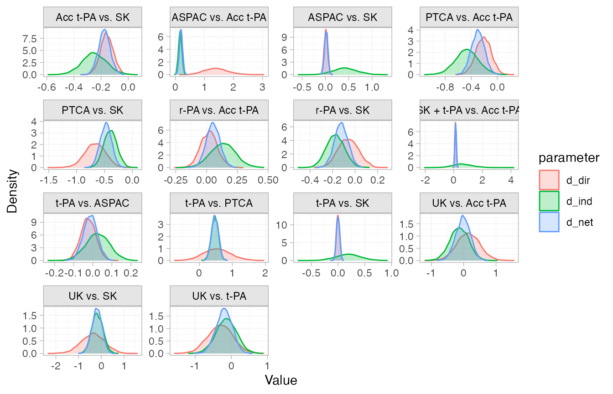
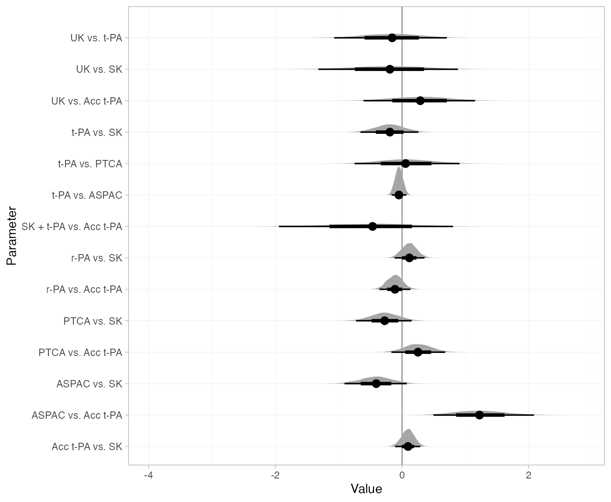
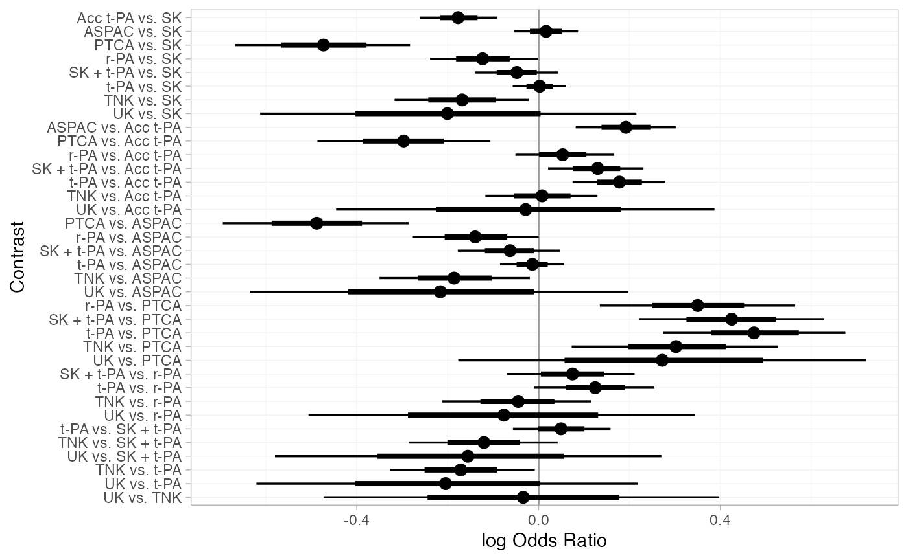
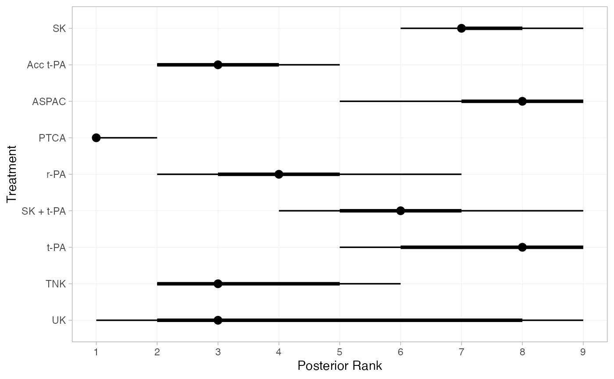
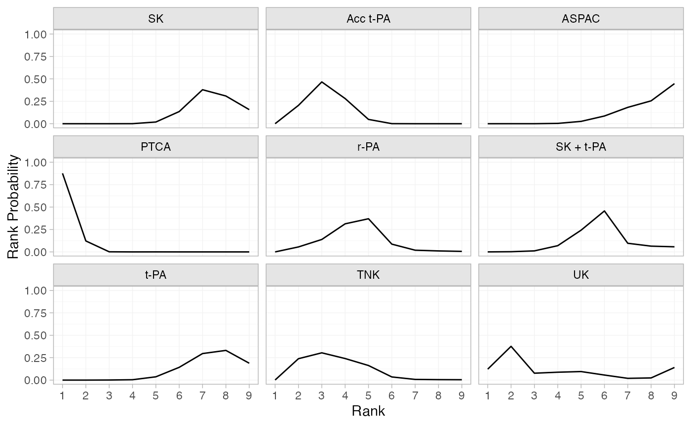
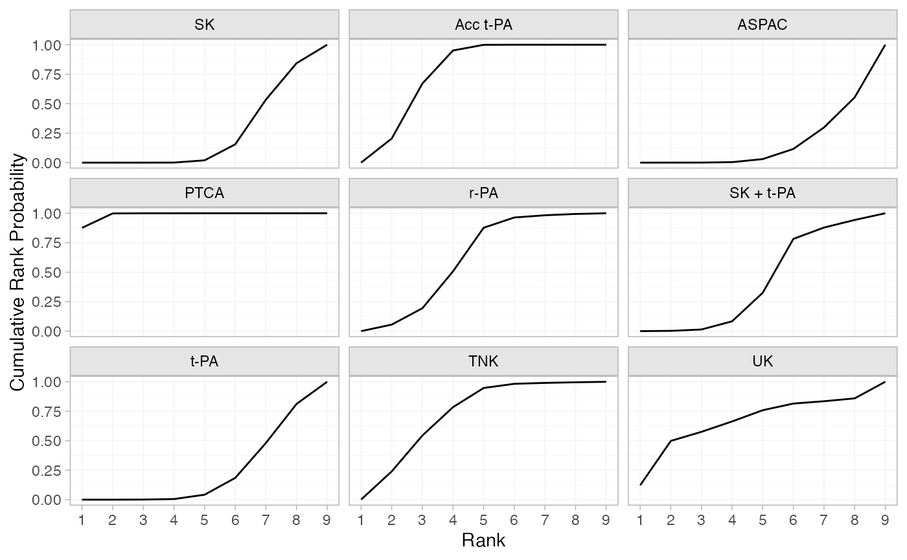

# Example: Thrombolytic treatments

``` r

library(multinma)
options(mc.cores = parallel::detectCores())
```

    #> For execution on a local, multicore CPU with excess RAM we recommend calling
    #> options(mc.cores = parallel::detectCores())
    #> 
    #> Attaching package: 'multinma'
    #> The following objects are masked from 'package:stats':
    #> 
    #>     dgamma, pgamma, qgamma

This vignette describes the analysis of 50 trials of 8 thrombolytic
drugs (streptokinase, SK; alteplase, t-PA; accelerated alteplase, Acc
t-PA; streptokinase plus alteplase, SK+tPA; reteplase, r-PA;
tenocteplase, TNK; urokinase, UK; anistreptilase, ASPAC) plus
per-cutaneous transluminal coronary angioplasty (PTCA) ([Boland et al.
2003](#ref-Boland2003); [Lu and Ades 2006](#ref-Lu2006); [Dias et al.
2011](#ref-TSD4), [2010](#ref-Dias2010)). The number of deaths in 30 or
35 days following acute myocardial infarction are recorded. The data are
available in this package as `thrombolytics`:

``` r

head(thrombolytics)
#>   studyn trtn      trtc    r     n
#> 1      1    1        SK 1472 20251
#> 2      1    3  Acc t-PA  652 10396
#> 3      1    4 SK + t-PA  723 10374
#> 4      2    1        SK    9   130
#> 5      2    2      t-PA    6   123
#> 6      3    1        SK    5    63
```

## Setting up the network

We begin by setting up the network. We have arm-level count data giving
the number of deaths (`r`) out of the total (`n`) in each arm, so we use
the function
[`set_agd_arm()`](https://dmphillippo.github.io/multinma/dev/reference/set_agd_arm.md).
By default, SK is set as the network reference treatment.

``` r

thrombo_net <- set_agd_arm(thrombolytics, 
                           study = studyn,
                           trt = trtc,
                           r = r, 
                           n = n)
thrombo_net
#> A network with 50 AgD studies (arm-based).
#> 
#> ------------------------------------------------------- AgD studies (arm-based) ---- 
#>  Study Treatment arms              
#>  1     3: SK | Acc t-PA | SK + t-PA
#>  2     2: SK | t-PA                
#>  3     2: SK | t-PA                
#>  4     2: SK | t-PA                
#>  5     2: SK | t-PA                
#>  6     3: SK | ASPAC | t-PA        
#>  7     2: SK | t-PA                
#>  8     2: SK | t-PA                
#>  9     2: SK | t-PA                
#>  10    2: SK | SK + t-PA           
#>  ... plus 40 more studies
#> 
#>  Outcome type: count
#> ------------------------------------------------------------------------------------
#> Total number of treatments: 9
#> Total number of studies: 50
#> Reference treatment is: SK
#> Network is connected
```

Plot the network structure.

``` r

plot(thrombo_net, weight_edges = TRUE, weight_nodes = TRUE)
```



## Fixed effects NMA

Following TSD 4 ([Dias et al. 2011](#ref-TSD4)), we fit a fixed effects
NMA model, using the
[`nma()`](https://dmphillippo.github.io/multinma/dev/reference/nma.md)
function with `trt_effects = "fixed"`. We use \mathrm{N}(0, 100^2) prior
distributions for the treatment effects d_k and study-specific
intercepts \mu_j. We can examine the range of parameter values implied
by these prior distributions with the
[`summary()`](https://rdrr.io/r/base/summary.html) method:

``` r

summary(normal(scale = 100))
#> A Normal prior distribution: location = 0, scale = 100.
#> 50% of the prior density lies between -67.45 and 67.45.
#> 95% of the prior density lies between -196 and 196.
```

The model is fitted using the
[`nma()`](https://dmphillippo.github.io/multinma/dev/reference/nma.md)
function. By default, this will use a Binomial likelihood and a logit
link function, auto-detected from the data.

``` r

thrombo_fit <- nma(thrombo_net, 
                   trt_effects = "fixed",
                   prior_intercept = normal(scale = 100),
                   prior_trt = normal(scale = 100))
#> Note: Setting "SK" as the network reference treatment.
```

Basic parameter summaries are given by the
[`print()`](https://rdrr.io/r/base/print.html) method:

``` r

thrombo_fit
#> A fixed effects NMA with a binomial likelihood (logit link).
#> Inference for Stan model: binomial_1par.
#> 4 chains, each with iter=2000; warmup=1000; thin=1; 
#> post-warmup draws per chain=1000, total post-warmup draws=4000.
#> 
#>                   mean se_mean   sd      2.5%       25%       50%       75%     97.5% n_eff
#> d[Acc t-PA]      -0.18    0.00 0.04     -0.26     -0.21     -0.18     -0.15     -0.09  2879
#> d[ASPAC]          0.02    0.00 0.04     -0.05     -0.01      0.02      0.04      0.09  5639
#> d[PTCA]          -0.47    0.00 0.10     -0.67     -0.54     -0.47     -0.41     -0.28  3600
#> d[r-PA]          -0.12    0.00 0.06     -0.24     -0.16     -0.12     -0.08      0.00  3876
#> d[SK + t-PA]     -0.05    0.00 0.05     -0.14     -0.08     -0.05     -0.02      0.04  6030
#> d[t-PA]           0.00    0.00 0.03     -0.06     -0.02      0.00      0.02      0.06  4466
#> d[TNK]           -0.17    0.00 0.08     -0.32     -0.22     -0.17     -0.12     -0.02  3892
#> d[UK]            -0.20    0.00 0.21     -0.61     -0.34     -0.20     -0.06      0.22  4850
#> lp__         -43042.73    0.14 5.43 -43054.46 -43046.03 -43042.47 -43038.82 -43033.17  1581
#>              Rhat
#> d[Acc t-PA]     1
#> d[ASPAC]        1
#> d[PTCA]         1
#> d[r-PA]         1
#> d[SK + t-PA]    1
#> d[t-PA]         1
#> d[TNK]          1
#> d[UK]           1
#> lp__            1
#> 
#> Samples were drawn using NUTS(diag_e) at Fri Oct  9 11:50:03 2026.
#> For each parameter, n_eff is a crude measure of effective sample size,
#> and Rhat is the potential scale reduction factor on split chains (at 
#> convergence, Rhat=1).
```

By default, summaries of the study-specific intercepts \mu_j are hidden,
but could be examined by changing the `pars` argument:

``` r

# Not run
print(thrombo_fit, pars = c("d", "mu"))
```

The prior and posterior distributions can be compared visually using the
[`plot_prior_posterior()`](https://dmphillippo.github.io/multinma/dev/reference/plot_prior_posterior.md)
function:

``` r

plot_prior_posterior(thrombo_fit, prior = "trt")
```



Model fit can be checked using the
[`dic()`](https://dmphillippo.github.io/multinma/dev/reference/dic.md)
function

``` r

(dic_consistency <- dic(thrombo_fit))
#> Residual deviance: 105.6 (on 102 data points)
#>                pD: 58.5
#>               DIC: 164.1
```

and the residual deviance contributions examined with the corresponding
[`plot()`](https://rdrr.io/r/graphics/plot.default.html) method.

``` r

plot(dic_consistency)
```



There are a number of points which are not very well fit by the model,
having posterior mean residual deviance contributions greater than 1.

## Checking for inconsistency

> **Note:** The results of the inconsistency models here are slightly
> different to those of Dias et al. ([2010](#ref-Dias2010),
> [2011](#ref-TSD4)), although the overall conclusions are the same.
> This is due to the presence of multi-arm trials and a different
> ordering of treatments, meaning that inconsistency is parameterised
> differently within the multi-arm trials. The same results as Dias et
> al. are obtained if the network is instead set up with `trtn` as the
> treatment variable.

### Unrelated mean effects model

We first fit an unrelated mean effects (UME) model ([Dias et al.
2011](#ref-TSD4)) to assess the consistency assumption. Again, we use
the function
[`nma()`](https://dmphillippo.github.io/multinma/dev/reference/nma.md),
but now with the argument `consistency = "ume"`.

``` r

thrombo_fit_ume <- nma(thrombo_net, 
                       consistency = "ume",
                       trt_effects = "fixed",
                       prior_intercept = normal(scale = 100),
                       prior_trt = normal(scale = 100))
#> Note: Setting "SK" as the network reference treatment.
thrombo_fit_ume
#> A fixed effects NMA with a binomial likelihood (logit link).
#> An inconsistency model ('ume') was fitted.
#> Inference for Stan model: binomial_1par.
#> 4 chains, each with iter=2000; warmup=1000; thin=1; 
#> post-warmup draws per chain=1000, total post-warmup draws=4000.
#> 
#>                            mean se_mean   sd      2.5%       25%       50%       75%     97.5%
#> d[Acc t-PA vs. SK]        -0.16    0.00 0.05     -0.26     -0.19     -0.16     -0.12     -0.06
#> d[ASPAC vs. SK]            0.01    0.00 0.04     -0.07     -0.02      0.01      0.03      0.08
#> d[PTCA vs. SK]            -0.67    0.00 0.19     -1.03     -0.79     -0.66     -0.54     -0.30
#> d[r-PA vs. SK]            -0.06    0.00 0.09     -0.23     -0.12     -0.06      0.00      0.11
#> d[SK + t-PA vs. SK]       -0.04    0.00 0.05     -0.14     -0.07     -0.04     -0.01      0.05
#> d[t-PA vs. SK]             0.00    0.00 0.03     -0.06     -0.02      0.00      0.02      0.06
#> d[UK vs. SK]              -0.38    0.01 0.51     -1.39     -0.73     -0.38     -0.03      0.59
#> d[ASPAC vs. Acc t-PA]      1.40    0.01 0.41      0.63      1.12      1.39      1.67      2.25
#> d[PTCA vs. Acc t-PA]      -0.21    0.00 0.12     -0.45     -0.30     -0.22     -0.13      0.02
#> d[r-PA vs. Acc t-PA]       0.02    0.00 0.07     -0.11     -0.03      0.02      0.06      0.14
#> d[TNK vs. Acc t-PA]        0.01    0.00 0.06     -0.12     -0.04      0.01      0.05      0.14
#> d[UK vs. Acc t-PA]         0.14    0.01 0.36     -0.56     -0.10      0.14      0.39      0.86
#> d[t-PA vs. ASPAC]          0.29    0.01 0.35     -0.39      0.05      0.29      0.52      0.98
#> d[t-PA vs. PTCA]           0.55    0.01 0.42     -0.26      0.27      0.54      0.83      1.39
#> d[UK vs. t-PA]            -0.30    0.00 0.35     -1.00     -0.53     -0.29     -0.06      0.36
#> lp__                  -43039.75    0.16 5.91 -43052.64 -43043.41 -43039.40 -43035.70 -43029.22
#>                       n_eff Rhat
#> d[Acc t-PA vs. SK]     6628    1
#> d[ASPAC vs. SK]        5203    1
#> d[PTCA vs. SK]         5441    1
#> d[r-PA vs. SK]         5455    1
#> d[SK + t-PA vs. SK]    6766    1
#> d[t-PA vs. SK]         4250    1
#> d[UK vs. SK]           5953    1
#> d[ASPAC vs. Acc t-PA]  3542    1
#> d[PTCA vs. Acc t-PA]   4269    1
#> d[r-PA vs. Acc t-PA]   5154    1
#> d[TNK vs. Acc t-PA]    5579    1
#> d[UK vs. Acc t-PA]     4017    1
#> d[t-PA vs. ASPAC]      4378    1
#> d[t-PA vs. PTCA]       4054    1
#> d[UK vs. t-PA]         5410    1
#> lp__                   1365    1
#> 
#> Samples were drawn using NUTS(diag_e) at Fri Oct  9 11:50:10 2026.
#> For each parameter, n_eff is a crude measure of effective sample size,
#> and Rhat is the potential scale reduction factor on split chains (at 
#> convergence, Rhat=1).
```

Comparing the model fit statistics

``` r

dic_consistency
#> Residual deviance: 105.6 (on 102 data points)
#>                pD: 58.5
#>               DIC: 164.1
(dic_ume <- dic(thrombo_fit_ume))
#> Residual deviance: 99.7 (on 102 data points)
#>                pD: 65.9
#>               DIC: 165.6
```

Whilst the UME model fits the data better, having a lower residual
deviance, the additional parameters in the UME model mean that the DIC
is very similar between both models. However, it is also important to
examine the individual contributions to model fit of each data point
under the two models (a so-called “dev-dev” plot). Passing two `nma_dic`
objects produced by the
[`dic()`](https://dmphillippo.github.io/multinma/dev/reference/dic.md)
function to the [`plot()`](https://rdrr.io/r/graphics/plot.default.html)
method produces this dev-dev plot:

``` r

plot(dic_consistency, dic_ume, show_uncertainty = FALSE)
```



The four points lying in the lower right corner of the plot have much
lower posterior mean residual deviance under the UME model, indicating
that these data are potentially inconsistent. These points correspond to
trials 44 and 45, the only two trials comparing Acc t-PA to ASPAC. The
ASPAC vs. Acc t-PA estimates are very different under the consistency
model and inconsistency (UME) model, suggesting that these two trials
may be systematically different from the others in the network.

### Node-splitting

Another method for assessing inconsistency is node-splitting ([Dias et
al. 2011](#ref-TSD4), [2010](#ref-Dias2010)). Whereas the UME model
assesses inconsistency globally, node-splitting assesses inconsistency
locally for each potentially inconsistent comparison (those with both
direct and indirect evidence) in turn.

Node-splitting can be performed using the
[`nma()`](https://dmphillippo.github.io/multinma/dev/reference/nma.md)
function with the argument `consistency = "nodesplit"`. By default, all
possible comparisons will be split (as determined by the
[`get_nodesplits()`](https://dmphillippo.github.io/multinma/dev/reference/get_nodesplits.md)
function). Alternatively, a specific comparison or comparisons to split
can be provided to the `nodesplit` argument.

``` r

thrombo_nodesplit <- nma(thrombo_net, 
                         consistency = "nodesplit",
                         trt_effects = "fixed",
                         prior_intercept = normal(scale = 100),
                         prior_trt = normal(scale = 100))
#> Fitting model 1 of 15, node-split: Acc t-PA vs. SK
#> Note: Setting "SK" as the network reference treatment.
#> Fitting model 2 of 15, node-split: ASPAC vs. SK
#> Note: Setting "SK" as the network reference treatment.
#> Fitting model 3 of 15, node-split: PTCA vs. SK
#> Note: Setting "SK" as the network reference treatment.
#> Fitting model 4 of 15, node-split: r-PA vs. SK
#> Note: Setting "SK" as the network reference treatment.
#> Fitting model 5 of 15, node-split: t-PA vs. SK
#> Note: Setting "SK" as the network reference treatment.
#> Fitting model 6 of 15, node-split: UK vs. SK
#> Note: Setting "SK" as the network reference treatment.
#> Fitting model 7 of 15, node-split: ASPAC vs. Acc t-PA
#> Note: Setting "SK" as the network reference treatment.
#> Fitting model 8 of 15, node-split: PTCA vs. Acc t-PA
#> Note: Setting "SK" as the network reference treatment.
#> Fitting model 9 of 15, node-split: r-PA vs. Acc t-PA
#> Note: Setting "SK" as the network reference treatment.
#> Fitting model 10 of 15, node-split: SK + t-PA vs. Acc t-PA
#> Note: Setting "SK" as the network reference treatment.
#> Fitting model 11 of 15, node-split: UK vs. Acc t-PA
#> Note: Setting "SK" as the network reference treatment.
#> Fitting model 12 of 15, node-split: t-PA vs. ASPAC
#> Note: Setting "SK" as the network reference treatment.
#> Fitting model 13 of 15, node-split: t-PA vs. PTCA
#> Note: Setting "SK" as the network reference treatment.
#> Fitting model 14 of 15, node-split: UK vs. t-PA
#> Note: Setting "SK" as the network reference treatment.
#> Fitting model 15 of 15, consistency model
#> Note: Setting "SK" as the network reference treatment.
```

The [`summary()`](https://rdrr.io/r/base/summary.html) method summarises
the node-splitting results, displaying the direct and indirect estimates
d\_\mathrm{dir} and d\_\mathrm{ind} from each node-split model, the
network estimate d\_\mathrm{net} from the consistency model, the
inconsistency factor \omega = d\_\mathrm{dir} - d\_\mathrm{ind}, and a
Bayesian p-value for inconsistency on each comparison. The DIC model fit
statistics are also provided. (If a random effects model was fitted, the
heterogeneity standard deviation \tau under each node-split model and
under the consistency model would also be displayed.)

``` r

summary(thrombo_nodesplit)
#> Node-splitting models fitted for 14 comparisons.
#> 
#> ---------------------------------------------------- Node-split Acc t-PA vs. SK ---- 
#> 
#>        mean   sd  2.5%   25%   50%   75% 97.5% Bulk_ESS Tail_ESS Rhat
#> d_net -0.18 0.04 -0.26 -0.20 -0.18 -0.15 -0.09     2700     2968 1.00
#> d_dir -0.16 0.05 -0.25 -0.19 -0.16 -0.13 -0.06     4335     3575 1.00
#> d_ind -0.25 0.09 -0.43 -0.31 -0.25 -0.19 -0.07      884     1638 1.01
#> omega  0.09 0.10 -0.11  0.03  0.09  0.16  0.29     1019     1711 1.01
#> 
#> Residual deviance: 105.9 (on 102 data points)
#>                pD: 59.4
#>               DIC: 165.4
#> 
#> Bayesian p-value: 0.35
#> 
#> ------------------------------------------------------- Node-split ASPAC vs. SK ---- 
#> 
#>        mean   sd  2.5%   25%   50%   75% 97.5% Bulk_ESS Tail_ESS Rhat
#> d_net  0.02 0.04 -0.06 -0.01  0.02  0.04  0.09     5417     3762    1
#> d_dir  0.01 0.04 -0.07 -0.02  0.01  0.03  0.08     4943     3508    1
#> d_ind  0.42 0.25 -0.07  0.25  0.42  0.59  0.92     2361     2902    1
#> omega -0.41 0.26 -0.91 -0.58 -0.41 -0.24  0.07     2398     2895    1
#> 
#> Residual deviance: 104.3 (on 102 data points)
#>                pD: 59.7
#>               DIC: 163.9
#> 
#> Bayesian p-value: 0.11
#> 
#> -------------------------------------------------------- Node-split PTCA vs. SK ---- 
#> 
#>        mean   sd  2.5%   25%   50%   75% 97.5% Bulk_ESS Tail_ESS Rhat
#> d_net -0.47 0.10 -0.67 -0.54 -0.47 -0.41 -0.28     4270     3371    1
#> d_dir -0.67 0.18 -1.04 -0.79 -0.67 -0.54 -0.32     5548     3369    1
#> d_ind -0.39 0.12 -0.63 -0.48 -0.39 -0.31 -0.15     2861     3068    1
#> omega -0.27 0.22 -0.73 -0.42 -0.27 -0.12  0.15     3673     3082    1
#> 
#> Residual deviance: 105.2 (on 102 data points)
#>                pD: 59.5
#>               DIC: 164.7
#> 
#> Bayesian p-value: 0.22
#> 
#> -------------------------------------------------------- Node-split r-PA vs. SK ---- 
#> 
#>        mean   sd  2.5%   25%   50%   75% 97.5% Bulk_ESS Tail_ESS Rhat
#> d_net -0.12 0.06 -0.24 -0.16 -0.12 -0.08  0.00     3745     3516    1
#> d_dir -0.06 0.09 -0.23 -0.12 -0.06  0.00  0.12     4638     3337    1
#> d_ind -0.18 0.08 -0.33 -0.23 -0.18 -0.12 -0.02     2295     2802    1
#> omega  0.11 0.12 -0.12  0.03  0.12  0.19  0.36     2634     3030    1
#> 
#> Residual deviance: 105.9 (on 102 data points)
#>                pD: 59.7
#>               DIC: 165.6
#> 
#> Bayesian p-value: 0.34
#> 
#> -------------------------------------------------------- Node-split t-PA vs. SK ---- 
#> 
#>        mean   sd  2.5%   25%   50%   75% 97.5% Bulk_ESS Tail_ESS Rhat
#> d_net  0.00 0.03 -0.06 -0.02  0.00  0.02  0.06     4991     3570 1.00
#> d_dir  0.00 0.03 -0.06 -0.02  0.00  0.02  0.06     4175     3376 1.00
#> d_ind  0.19 0.23 -0.26  0.04  0.19  0.34  0.64     1264     2080 1.01
#> omega -0.19 0.23 -0.66 -0.35 -0.19 -0.04  0.26     1266     2297 1.01
#> 
#> Residual deviance: 105.8 (on 102 data points)
#>                pD: 59.3
#>               DIC: 165.1
#> 
#> Bayesian p-value: 0.4
#> 
#> ---------------------------------------------------------- Node-split UK vs. SK ---- 
#> 
#>        mean   sd  2.5%   25%   50%   75% 97.5% Bulk_ESS Tail_ESS Rhat
#> d_net -0.20 0.22 -0.63 -0.34 -0.19 -0.04  0.22     4323     3645    1
#> d_dir -0.37 0.51 -1.38 -0.72 -0.36 -0.02  0.61     5210     3420    1
#> d_ind -0.17 0.25 -0.65 -0.34 -0.18  0.00  0.31     4198     3258    1
#> omega -0.20 0.56 -1.32 -0.59 -0.19  0.20  0.88     4635     3134    1
#> 
#> Residual deviance: 107.3 (on 102 data points)
#>                pD: 60.2
#>               DIC: 167.6
#> 
#> Bayesian p-value: 0.74
#> 
#> ------------------------------------------------- Node-split ASPAC vs. Acc t-PA ---- 
#> 
#>       mean   sd 2.5%  25%  50%  75% 97.5% Bulk_ESS Tail_ESS Rhat
#> d_net 0.19 0.06 0.08 0.16 0.19 0.23  0.30     3587     3032    1
#> d_dir 1.40 0.40 0.66 1.12 1.39 1.66  2.25     3371     2649    1
#> d_ind 0.16 0.06 0.05 0.13 0.16 0.20  0.28     2933     3417    1
#> omega 1.24 0.41 0.49 0.96 1.22 1.50  2.08     3267     2515    1
#> 
#> Residual deviance: 96.2 (on 102 data points)
#>                pD: 59.1
#>               DIC: 155.3
#> 
#> Bayesian p-value: <0.01
#> 
#> -------------------------------------------------- Node-split PTCA vs. Acc t-PA ---- 
#> 
#>        mean   sd  2.5%   25%   50%   75% 97.5% Bulk_ESS Tail_ESS Rhat
#> d_net -0.30 0.10 -0.50 -0.37 -0.30 -0.23 -0.10     5797     3287    1
#> d_dir -0.21 0.12 -0.45 -0.29 -0.21 -0.13  0.01     4673     3164    1
#> d_ind -0.47 0.18 -0.82 -0.58 -0.47 -0.35 -0.11     3255     3299    1
#> omega  0.25 0.22 -0.17  0.11  0.25  0.40  0.68     3156     3264    1
#> 
#> Residual deviance: 105.2 (on 102 data points)
#>                pD: 59.5
#>               DIC: 164.7
#> 
#> Bayesian p-value: 0.23
#> 
#> -------------------------------------------------- Node-split r-PA vs. Acc t-PA ---- 
#> 
#>        mean   sd  2.5%   25%   50%   75% 97.5% Bulk_ESS Tail_ESS Rhat
#> d_net  0.05 0.06 -0.06  0.02  0.05  0.09  0.16     4956     2849    1
#> d_dir  0.02 0.07 -0.11 -0.03  0.02  0.07  0.16     4577     3717    1
#> d_ind  0.13 0.10 -0.07  0.07  0.13  0.20  0.33     1537     2568    1
#> omega -0.11 0.12 -0.36 -0.20 -0.11 -0.03  0.13     1572     2302    1
#> 
#> Residual deviance: 106.3 (on 102 data points)
#>                pD: 60.1
#>               DIC: 166.4
#> 
#> Bayesian p-value: 0.34
#> 
#> --------------------------------------------- Node-split SK + t-PA vs. Acc t-PA ---- 
#> 
#>        mean   sd  2.5%   25%   50%   75% 97.5% Bulk_ESS Tail_ESS Rhat
#> d_net  0.13 0.05  0.03  0.09  0.13  0.17  0.24     5135     3247    1
#> d_dir  0.13 0.05  0.02  0.09  0.13  0.16  0.23     3633     3409    1
#> d_ind  0.63 0.71 -0.69  0.16  0.59  1.07  2.07     2687     2168    1
#> omega -0.50 0.70 -1.94 -0.95 -0.47 -0.04  0.80     2666     2373    1
#> 
#> Residual deviance: 106.5 (on 102 data points)
#>                pD: 59.7
#>               DIC: 166.2
#> 
#> Bayesian p-value: 0.46
#> 
#> ---------------------------------------------------- Node-split UK vs. Acc t-PA ---- 
#> 
#>        mean   sd  2.5%   25%   50%  75% 97.5% Bulk_ESS Tail_ESS Rhat
#> d_net -0.02 0.22 -0.46 -0.17 -0.02 0.13  0.41     4379     3435    1
#> d_dir  0.14 0.35 -0.54 -0.10  0.14 0.38  0.84     4613     3242    1
#> d_ind -0.14 0.29 -0.70 -0.33 -0.13 0.07  0.42     4098     3387    1
#> omega  0.28 0.45 -0.61 -0.03  0.29 0.59  1.15     3831     2944    1
#> 
#> Residual deviance: 106.8 (on 102 data points)
#>                pD: 60
#>               DIC: 166.8
#> 
#> Bayesian p-value: 0.54
#> 
#> ----------------------------------------------------- Node-split t-PA vs. ASPAC ---- 
#> 
#>        mean   sd  2.5%   25%   50%   75% 97.5% Bulk_ESS Tail_ESS Rhat
#> d_net -0.01 0.04 -0.08 -0.04 -0.01  0.01  0.06     7284     3219    1
#> d_dir -0.02 0.04 -0.10 -0.05 -0.02  0.00  0.05     4805     3667    1
#> d_ind  0.03 0.06 -0.09 -0.02  0.03  0.07  0.15     3896     3396    1
#> omega -0.05 0.06 -0.17 -0.09 -0.05 -0.01  0.07     4079     3115    1
#> 
#> Residual deviance: 106.4 (on 102 data points)
#>                pD: 59.8
#>               DIC: 166.2
#> 
#> Bayesian p-value: 0.43
#> 
#> ------------------------------------------------------ Node-split t-PA vs. PTCA ---- 
#> 
#>       mean   sd  2.5%   25%  50%  75% 97.5% Bulk_ESS Tail_ESS Rhat
#> d_net 0.48 0.11  0.27  0.40 0.47 0.55  0.68     4603     3595    1
#> d_dir 0.54 0.41 -0.25  0.26 0.53 0.81  1.36     4808     3384    1
#> d_ind 0.47 0.11  0.26  0.40 0.47 0.55  0.68     3837     3310    1
#> omega 0.07 0.42 -0.75 -0.22 0.06 0.35  0.91     4480     3176    1
#> 
#> Residual deviance: 106.7 (on 102 data points)
#>                pD: 59.5
#>               DIC: 166.2
#> 
#> Bayesian p-value: 0.89
#> 
#> -------------------------------------------------------- Node-split UK vs. t-PA ---- 
#> 
#>        mean   sd  2.5%   25%   50%   75% 97.5% Bulk_ESS Tail_ESS Rhat
#> d_net -0.20 0.22 -0.64 -0.34 -0.19 -0.05  0.22     4354     3429    1
#> d_dir -0.31 0.35 -0.98 -0.54 -0.30 -0.07  0.37     5130     3359    1
#> d_ind -0.14 0.29 -0.71 -0.33 -0.14  0.06  0.42     3684     3269    1
#> omega -0.17 0.44 -1.07 -0.47 -0.16  0.13  0.71     3580     3417    1
#> 
#> Residual deviance: 107.3 (on 102 data points)
#>                pD: 60.3
#>               DIC: 167.6
#> 
#> Bayesian p-value: 0.71
```

Node-splitting the ASPAC vs. Acc t-PA comparison results the lowest DIC,
and this is lower than the consistency model. The posterior distribution
for the inconsistency factor \omega for this comparison lies far from 0
and the Bayesian p-value for inconsistency is small (\< 0.01), meaning
that there is substantial disagreement between the direct and indirect
evidence on this comparison.

We can visually compare the direct, indirect, and network estimates
using the [`plot()`](https://rdrr.io/r/graphics/plot.default.html)
method.

``` r

plot(thrombo_nodesplit)
```



We can also plot the posterior distributions of the inconsistency
factors \omega, again using the
[`plot()`](https://rdrr.io/r/graphics/plot.default.html) method. Here,
we specify a “halfeye” plot of the posterior density with median and
credible intervals, and customise the plot layout with standard
`ggplot2` functions.

``` r

plot(thrombo_nodesplit, pars = "omega", stat = "halfeye", ref_line = 0) +
  ggplot2::aes(y = comparison) +
  ggplot2::facet_null()
```



Notice again that the posterior distribution of the inconsistency factor
for the ASPAC vs. Acc t-PA comparison lies far from 0, indicating
substantial inconsistency between the direct and indirect evidence on
this comparison.

## Further results

Relative effects for all pairwise contrasts between treatments can be
produced using the
[`relative_effects()`](https://dmphillippo.github.io/multinma/dev/reference/relative_effects.md)
function, with `all_contrasts = TRUE`.

``` r

(thrombo_releff <- relative_effects(thrombo_fit, all_contrasts = TRUE))
#>                            mean   sd  2.5%   25%   50%   75% 97.5% Bulk_ESS Tail_ESS Rhat
#> d[Acc t-PA vs. SK]        -0.18 0.04 -0.26 -0.21 -0.18 -0.15 -0.09     2906     3333    1
#> d[ASPAC vs. SK]            0.02 0.04 -0.05 -0.01  0.02  0.04  0.09     5734     3338    1
#> d[PTCA vs. SK]            -0.47 0.10 -0.67 -0.54 -0.47 -0.41 -0.28     3632     3500    1
#> d[r-PA vs. SK]            -0.12 0.06 -0.24 -0.16 -0.12 -0.08  0.00     3885     3190    1
#> d[SK + t-PA vs. SK]       -0.05 0.05 -0.14 -0.08 -0.05 -0.02  0.04     6092     3339    1
#> d[t-PA vs. SK]             0.00 0.03 -0.06 -0.02  0.00  0.02  0.06     4504     3387    1
#> d[TNK vs. SK]             -0.17 0.08 -0.32 -0.22 -0.17 -0.12 -0.02     3888     3173    1
#> d[UK vs. SK]              -0.20 0.21 -0.61 -0.34 -0.20 -0.06  0.22     4903     3381    1
#> d[ASPAC vs. Acc t-PA]      0.19 0.06  0.08  0.15  0.19  0.23  0.30     3886     3625    1
#> d[PTCA vs. Acc t-PA]      -0.30 0.09 -0.49 -0.36 -0.30 -0.23 -0.11     4740     3458    1
#> d[r-PA vs. Acc t-PA]       0.05 0.06 -0.05  0.02  0.05  0.09  0.17     5788     3723    1
#> d[SK + t-PA vs. Acc t-PA]  0.13 0.05  0.02  0.09  0.13  0.17  0.23     6124     3469    1
#> d[t-PA vs. Acc t-PA]       0.18 0.05  0.07  0.14  0.18  0.21  0.28     3409     3078    1
#> d[TNK vs. Acc t-PA]        0.01 0.06 -0.12 -0.04  0.01  0.05  0.13     6371     3781    1
#> d[UK vs. Acc t-PA]        -0.03 0.21 -0.45 -0.17 -0.03  0.12  0.39     4798     3363    1
#> d[PTCA vs. ASPAC]         -0.49 0.11 -0.69 -0.56 -0.49 -0.42 -0.29     3780     3209    1
#> d[r-PA vs. ASPAC]         -0.14 0.07 -0.28 -0.19 -0.14 -0.09  0.00     4443     3027    1
#> d[SK + t-PA vs. ASPAC]    -0.06 0.06 -0.18 -0.10 -0.06 -0.03  0.05     5658     3486    1
#> d[t-PA vs. ASPAC]         -0.01 0.04 -0.08 -0.04 -0.01  0.01  0.06     6687     2893    1
#> d[TNK vs. ASPAC]          -0.18 0.09 -0.35 -0.24 -0.19 -0.13 -0.02     4266     3506    1
#> d[UK vs. ASPAC]           -0.22 0.21 -0.64 -0.36 -0.22 -0.07  0.20     5079     3267    1
#> d[r-PA vs. PTCA]           0.35 0.11  0.13  0.28  0.35  0.42  0.56     4853     3294    1
#> d[SK + t-PA vs. PTCA]      0.42 0.10  0.22  0.35  0.43  0.50  0.63     4469     3755    1
#> d[t-PA vs. PTCA]           0.47 0.10  0.27  0.41  0.47  0.54  0.67     3607     3307    1
#> d[TNK vs. PTCA]            0.30 0.11  0.07  0.23  0.30  0.38  0.53     5818     3378    1
#> d[UK vs. PTCA]             0.27 0.23 -0.18  0.11  0.27  0.43  0.72     4510     3447    1
#> d[SK + t-PA vs. r-PA]      0.07 0.07 -0.07  0.03  0.07  0.12  0.21     6196     3476    1
#> d[t-PA vs. r-PA]           0.12 0.07 -0.01  0.08  0.12  0.17  0.25     4029     3378    1
#> d[TNK vs. r-PA]           -0.05 0.08 -0.21 -0.10 -0.04  0.01  0.12     7434     3250    1
#> d[UK vs. r-PA]            -0.08 0.22 -0.51 -0.22 -0.08  0.07  0.34     4895     3739    1
#> d[t-PA vs. SK + t-PA]      0.05 0.05 -0.06  0.01  0.05  0.09  0.16     5883     3320    1
#> d[TNK vs. SK + t-PA]      -0.12 0.08 -0.29 -0.18 -0.12 -0.06  0.04     6105     3391    1
#> d[UK vs. SK + t-PA]       -0.15 0.22 -0.58 -0.30 -0.16 -0.01  0.27     4949     3434    1
#> d[TNK vs. t-PA]           -0.17 0.08 -0.33 -0.23 -0.17 -0.11 -0.01     4033     3003    1
#> d[UK vs. t-PA]            -0.20 0.21 -0.62 -0.35 -0.20 -0.06  0.22     4991     3361    1
#> d[UK vs. TNK]             -0.03 0.22 -0.47 -0.18 -0.03  0.12  0.40     4871     2502    1
plot(thrombo_releff, ref_line = 0)
```



Treatment rankings, rank probabilities, and cumulative rank
probabilities.

``` r

(thrombo_ranks <- posterior_ranks(thrombo_fit))
#>                 mean   sd 2.5% 25% 50% 75% 97.5% Bulk_ESS Tail_ESS Rhat
#> rank[SK]        7.45 0.98    6   7   7   8     9     4011       NA    1
#> rank[Acc t-PA]  3.17 0.81    2   3   3   4     5     4292     3778    1
#> rank[ASPAC]     8.00 1.13    5   7   8   9     9     4322       NA    1
#> rank[PTCA]      1.13 0.34    1   1   1   1     2     3321     3252    1
#> rank[r-PA]      4.42 1.18    2   4   4   5     7     5341     3623    1
#> rank[SK + t-PA] 5.97 1.24    4   5   6   6     9     5132       NA    1
#> rank[t-PA]      7.47 1.10    5   7   8   8     9     4863       NA    1
#> rank[TNK]       3.51 1.26    2   3   3   4     6     5365     3706    1
#> rank[UK]        3.87 2.66    1   2   3   5     9     4557       NA    1
plot(thrombo_ranks)
```



``` r

(thrombo_rankprobs <- posterior_rank_probs(thrombo_fit))
#>              p_rank[1] p_rank[2] p_rank[3] p_rank[4] p_rank[5] p_rank[6] p_rank[7] p_rank[8]
#> d[SK]             0.00      0.00      0.00      0.00      0.02      0.14      0.38      0.31
#> d[Acc t-PA]       0.00      0.20      0.47      0.28      0.05      0.00      0.00      0.00
#> d[ASPAC]          0.00      0.00      0.00      0.00      0.03      0.09      0.18      0.26
#> d[PTCA]           0.88      0.12      0.00      0.00      0.00      0.00      0.00      0.00
#> d[r-PA]           0.00      0.06      0.14      0.31      0.37      0.09      0.02      0.01
#> d[SK + t-PA]      0.00      0.00      0.01      0.07      0.24      0.46      0.10      0.06
#> d[t-PA]           0.00      0.00      0.00      0.00      0.04      0.14      0.30      0.33
#> d[TNK]            0.00      0.24      0.30      0.24      0.16      0.04      0.01      0.01
#> d[UK]             0.12      0.38      0.08      0.09      0.10      0.06      0.02      0.02
#>              p_rank[9]
#> d[SK]             0.16
#> d[Acc t-PA]       0.00
#> d[ASPAC]          0.45
#> d[PTCA]           0.00
#> d[r-PA]           0.01
#> d[SK + t-PA]      0.06
#> d[t-PA]           0.19
#> d[TNK]            0.00
#> d[UK]             0.14
plot(thrombo_rankprobs)
```



``` r

(thrombo_cumrankprobs <- posterior_rank_probs(thrombo_fit, cumulative = TRUE))
#>              p_rank[1] p_rank[2] p_rank[3] p_rank[4] p_rank[5] p_rank[6] p_rank[7] p_rank[8]
#> d[SK]             0.00      0.00      0.00      0.00      0.02      0.16      0.53      0.84
#> d[Acc t-PA]       0.00      0.20      0.67      0.95      1.00      1.00      1.00      1.00
#> d[ASPAC]          0.00      0.00      0.00      0.00      0.03      0.12      0.30      0.55
#> d[PTCA]           0.88      1.00      1.00      1.00      1.00      1.00      1.00      1.00
#> d[r-PA]           0.00      0.06      0.19      0.51      0.88      0.96      0.98      0.99
#> d[SK + t-PA]      0.00      0.00      0.01      0.08      0.33      0.78      0.88      0.94
#> d[t-PA]           0.00      0.00      0.00      0.01      0.04      0.18      0.48      0.81
#> d[TNK]            0.00      0.24      0.54      0.78      0.95      0.98      0.99      1.00
#> d[UK]             0.12      0.50      0.58      0.66      0.76      0.82      0.84      0.86
#>              p_rank[9]
#> d[SK]                1
#> d[Acc t-PA]          1
#> d[ASPAC]             1
#> d[PTCA]              1
#> d[r-PA]              1
#> d[SK + t-PA]         1
#> d[t-PA]              1
#> d[TNK]               1
#> d[UK]                1
plot(thrombo_cumrankprobs)
```



## References

Boland, A., Y. Dundar, A. Bagust, et al. 2003. “Early Thrombolysis for
the Treatment of Acute Myocardial Infarction: A Systematic Review and
Economic Evaluation.” *Health Technology Assessment* 7 (15).
<https://doi.org/10.3310/hta7150>.

Dias, S., N. J. Welton, D. M. Caldwell, and A. E. Ades. 2010. “Checking
Consistency in Mixed Treatment Comparison Meta-Analysis.” *Statistics in
Medicine* 29 (7-8): 932–44. <https://doi.org/10.1002/sim.3767>.

Dias, S., N. J. Welton, A. J. Sutton, D. M. Caldwell, G. Lu, and A. E.
Ades. 2011. *NICE DSU Technical Support Document 4: Inconsistency in
Networks of Evidence Based on Randomised Controlled Trials*. National
Institute for Health and Care Excellence.
<https://sheffield.ac.uk/nice-dsu>.

Lu, G. B., and A. E. Ades. 2006. “Assessing Evidence Inconsistency in
Mixed Treatment Comparisons.” *Journal of the American Statistical
Association* 101 (474): 447–59.
<https://doi.org/10.1198/016214505000001302>.
