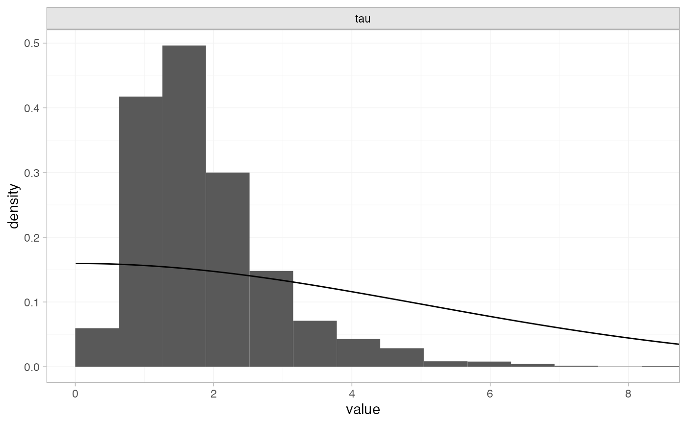
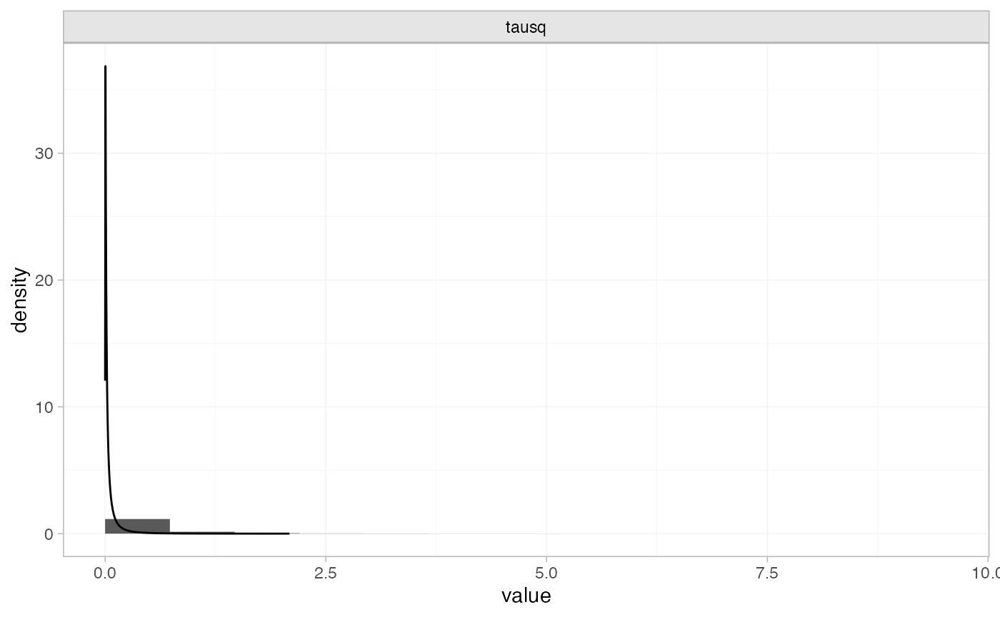

# Example: White blood cell transfusion

``` r
library(multinma)
options(mc.cores = parallel::detectCores())
```

    #> For execution on a local, multicore CPU with excess RAM we recommend calling
    #> options(mc.cores = parallel::detectCores())
    #> 
    #> Attaching package: 'multinma'
    #> The following objects are masked from 'package:stats':
    #> 
    #>     dgamma, pgamma, qgamma

This vignette describes the analysis of 6 trials comparing transfusion
of granulocytes (white blood cells) to control for preventing mortality
in patients with neutropenia or neutrophil dysfunction ([Stanworth et
al. 2005](#ref-Stanworth2005); [Turner et al. 2012](#ref-Turner2012)).
The data are available in this package as `transfusion`:

``` r
head(transfusion)
#>        studyc        trtc  r  n
#> 1    Bow 1984 Transfusion  5 13
#> 2    Bow 1984     Control  4 11
#> 3 Herzig 1977 Transfusion  1 13
#> 4 Herzig 1977     Control  3 14
#> 5  Higby 1975 Transfusion  2 17
#> 6  Higby 1975     Control 14 19
```

Turner et al. ([2012](#ref-Turner2012)) previously used this dataset to
demonstrate the application of informative priors for heterogeneity, an
analysis which we recreate here.

## Setting up the network

We begin by setting up the network - here just a pairwise meta-analysis.
We have arm-level count data giving the number of deaths (`r`) out of
the total (`n`) in each arm, so we use the function
[`set_agd_arm()`](https://dmphillippo.github.io/multinma/dev/reference/set_agd_arm.md).
We set “Control” as the reference treatment.

``` r
tr_net <- set_agd_arm(transfusion, 
                           study = studyc,
                           trt = trtc,
                           r = r, 
                           n = n,
                           trt_ref = "Control")
tr_net
#> A network with 6 AgD studies (arm-based).
#> 
#> ------------------------------------------------------- AgD studies (arm-based) ---- 
#>  Study         Treatment arms          
#>  Bow 1984      2: Control | Transfusion
#>  Herzig 1977   2: Control | Transfusion
#>  Higby 1975    2: Control | Transfusion
#>  Scali 1978    2: Control | Transfusion
#>  Vogler 1977   2: Control | Transfusion
#>  Winston 1982a 2: Control | Transfusion
#> 
#>  Outcome type: count
#> ------------------------------------------------------------------------------------
#> Total number of treatments: 2
#> Total number of studies: 6
#> Reference treatment is: Control
#> Network is connected
```

## Meta-analysis models

We fit two random effects models, first with a non-informative prior for
the heterogeneity, then using the informative prior described by Turner
et al. ([2012](#ref-Turner2012)).

### Random effects meta-analysis with non-informative heterogeneity prior

We fit a random effects model using the
[`nma()`](https://dmphillippo.github.io/multinma/dev/reference/nma.md)
function with `trt_effects = "random"`. We use \mathrm{N}(0, 100^2)
prior distributions for the treatment effects d_k and study-specific
intercepts \mu_j, and a non-informative \textrm{half-N}(5^2) prior for
the heterogeneity standard deviation \tau. We can examine the range of
parameter values implied by these prior distributions with the
[`summary()`](https://rdrr.io/r/base/summary.html) method:

``` r
summary(normal(scale = 100))
#> A Normal prior distribution: location = 0, scale = 100.
#> 50% of the prior density lies between -67.45 and 67.45.
#> 95% of the prior density lies between -196 and 196.
summary(half_normal(scale = 5))
#> A half-Normal prior distribution: scale = 5.
#> 50% of the prior density lies between 0 and 3.37.
#> 95% of the prior density lies between 0 and 9.8.
```

Fitting the RE model

``` r
tr_fit_RE_noninf <- nma(tr_net, 
                        trt_effects = "random",
                        prior_intercept = normal(scale = 100),
                        prior_trt = normal(scale = 100),
                        prior_het = half_normal(scale = 5))
```

Basic parameter summaries are given by the
[`print()`](https://rdrr.io/r/base/print.html) method:

``` r
tr_fit_RE_noninf
#> A random effects NMA with a binomial likelihood (logit link).
#> Inference for Stan model: binomial_1par.
#> 4 chains, each with iter=2000; warmup=1000; thin=1; 
#> post-warmup draws per chain=1000, total post-warmup draws=4000.
#> 
#>                   mean se_mean   sd    2.5%     25%     50%     75%   97.5% n_eff Rhat
#> d[Transfusion]   -1.17    0.05 1.06   -3.34   -1.67   -1.10   -0.56    0.68   538    1
#> lp__           -134.50    0.09 3.11 -141.53 -136.37 -134.16 -132.24 -129.53  1098    1
#> tau               1.87    0.04 1.09    0.56    1.16    1.63    2.29    4.73   650    1
#> 
#> Samples were drawn using NUTS(diag_e) at Tue Dec  2 12:46:40 2025.
#> For each parameter, n_eff is a crude measure of effective sample size,
#> and Rhat is the potential scale reduction factor on split chains (at 
#> convergence, Rhat=1).
```

By default, summaries of the study-specific intercepts \mu_j and
study-specific relative effects \delta\_{jk} are hidden, but could be
examined by changing the `pars` argument:

``` r
# Not run
print(tr_fit_RE_noninf, pars = c("d", "mu", "delta"))
```

The prior and posterior distributions can be compared visually using the
[`plot_prior_posterior()`](https://dmphillippo.github.io/multinma/dev/reference/plot_prior_posterior.md)
function:

``` r
plot_prior_posterior(tr_fit_RE_noninf, prior = "het")
```



The posterior distribution for the heterogeneity variance \tau^2 is
summarised by

``` r
noninf_tau <- as.array(tr_fit_RE_noninf, pars = "tau")
noninf_tausq <- noninf_tau^2
names(noninf_tausq) <- "tausq"
summary(noninf_tausq)
#>       mean   sd 2.5%  25%  50%  75% 97.5% Bulk_ESS Tail_ESS Rhat
#> tausq  4.7 7.02 0.31 1.34 2.64 5.26 22.34      883      941    1
```

### Random effects meta-analysis with informative heterogeneity prior

Keeping the rest of the model setup the same, we now use an informative
\textrm{log-N}(-3.93, 1.51^2) prior for the heterogeneity variance
\tau^2. We can examine the range of parameter values implied by this
prior distribution with the
[`summary()`](https://rdrr.io/r/base/summary.html) method:

``` r
summary(log_normal(-3.93, 1.51))
#> A log-Normal prior distribution: location = -3.93, scale = 1.51.
#> 50% of the prior density lies between 0.01 and 0.05.
#> 95% of the prior density lies between 0 and 0.38.
```

Fitting the RE model, we specify the `log_normal` prior distribution in
the `prior_het` argument, and set `prior_het_type = "var"` to indicate
that this prior distribution is on the variance scale (instead of the
standard deviation, the default).

``` r
tr_fit_RE_inf <- nma(tr_net, 
                     trt_effects = "random",
                     prior_intercept = normal(scale = 100),
                     prior_trt = normal(scale = 100),
                     prior_het = log_normal(-3.93, 1.51),
                     prior_het_type = "var")
```

Basic parameter summaries are given by the
[`print()`](https://rdrr.io/r/base/print.html) method:

``` r
tr_fit_RE_inf
#> A random effects NMA with a binomial likelihood (logit link).
#> Inference for Stan model: binomial_1par.
#> 4 chains, each with iter=2000; warmup=1000; thin=1; 
#> post-warmup draws per chain=1000, total post-warmup draws=4000.
#> 
#>                   mean se_mean   sd    2.5%     25%     50%     75%   97.5% n_eff Rhat
#> d[Transfusion]   -0.78    0.01 0.44   -1.76   -1.03   -0.74   -0.49    0.01  2308    1
#> lp__           -140.97    0.07 2.77 -147.30 -142.63 -140.64 -138.91 -136.61  1385    1
#> tau               0.50    0.01 0.36    0.05    0.21    0.44    0.70    1.38  1654    1
#> 
#> Samples were drawn using NUTS(diag_e) at Tue Dec  2 12:46:43 2025.
#> For each parameter, n_eff is a crude measure of effective sample size,
#> and Rhat is the potential scale reduction factor on split chains (at 
#> convergence, Rhat=1).
```

By default, summaries of the study-specific intercepts \mu_j and
study-specific relative effects \delta\_{jk} are hidden, but could be
examined by changing the `pars` argument:

``` r
# Not run
print(tr_fit_RE_inf, pars = c("d", "mu", "delta"))
```

The prior and posterior distributions can be compared visually using the
[`plot_prior_posterior()`](https://dmphillippo.github.io/multinma/dev/reference/plot_prior_posterior.md)
function:

``` r
plot_prior_posterior(tr_fit_RE_inf, prior = "het")
```



> **Note:** The heterogeneity *variance* \tau^2 is plotted here since
> the prior was specified on \tau^2.

The posterior distribution for the heterogeneity variance \tau^2 is
summarised by

``` r
inf_tau <- as.array(tr_fit_RE_inf, pars = "tau")
inf_tausq <- inf_tau^2
names(inf_tausq) <- "tausq"
summary(inf_tausq)
#>       mean   sd 2.5%  25%  50%  75% 97.5% Bulk_ESS Tail_ESS Rhat
#> tausq 0.38 0.55    0 0.05 0.19 0.49  1.92     1553     2904    1
```

## References

Stanworth, S., E. Massey, C. Hyde, S. J. Brunskill, C. Navarette, G.
Lucas, D. Marks, and U. Paulus. 2005. “Granulocyte Transfusions for
Treating Infections in Patients with Neutropenia or Neutrophil
Dysfunction.” *Cochrane Database of Systematic Reviews*, no. 3.
<https://doi.org/10.1002/14651858.CD005339>.

Turner, R. M., J. Davey, M. J. Clarke, S. G. Thompson, and J. P. T.
Higgins. 2012. “Predicting the Extent of Heterogeneity in Meta-Analysis,
Using Empirical Data from the Cochrane Database of Systematic Reviews.”
*International Journal of Epidemiology* 41 (3): 818–27.
<https://doi.org/10.1093/ije/dys041>.
