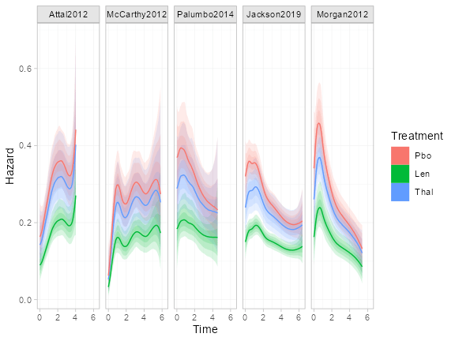

```r
library(multinma)
#> For execution on a local, multicore CPU with excess RAM we recommend calling
#> options(mc.cores = parallel::detectCores())
#> 
#> Attaching package: 'multinma'
#> The following objects are masked from 'package:stats':
#> 
#>     dgamma, pgamma, qgamma
library(survival)
library(dplyr)
#> 
#> Attaching package: 'dplyr'
#> The following objects are masked from 'package:stats':
#> 
#>     filter, lag
#> The following objects are masked from 'package:base':
#> 
#>     intersect, setdiff, setequal, union
library(ggplot2)
library(loo)
#> This is loo version 2.6.0
#> - Online documentation and vignettes at mc-stan.org/loo
#> - As of v2.0.0 loo defaults to 1 core but we recommend using as many as possible. Use the 'cores' argument or set options(mc.cores = NUM_CORES) for an entire session.
#> - Windows 10 users: loo may be very slow if 'mc.cores' is set in your .Rprofile file (see https://github.com/stan-dev/loo/issues/94).
```

```r
options(mc.cores = parallel::detectCores())
```


@Leahy2019 present a network of five trials comparing lenalidomide and thalidomide to placebo for newly diagnosed multiple myeloma (NDMM) after autologous stem cell transplant (ASCT).
The outcome of interest is progression free survival (PFS).
Simulated individual patient data (IPD) from three trials are found in the data set `ndmm_ipd`.
These include outcome times, censoring indicators, and covariates for each individual:

```r
head(ndmm_ipd)
#>          study trt       studyf trtf      age iss_stage3 response_cr_vgpr male eventtime status
#> 1 McCarthy2012 Pbo McCarthy2012  Pbo 50.81625          0                1    0 31.106516      1
#> 2 McCarthy2012 Pbo McCarthy2012  Pbo 62.18165          0                0    0  3.299623      0
#> 3 McCarthy2012 Pbo McCarthy2012  Pbo 51.53762          1                1    1 57.400000      0
#> 4 McCarthy2012 Pbo McCarthy2012  Pbo 46.74128          0                1    1 57.400000      0
#> 5 McCarthy2012 Pbo McCarthy2012  Pbo 62.62561          0                1    1 57.400000      0
#> 6 McCarthy2012 Pbo McCarthy2012  Pbo 49.24520          1                1    0 30.714460      0
```

Aggregate data (AgD) consisting of reconstructed event/censoring times from digitized Kaplan-Meier curves and covariate summaries are available on a further two trials, found in the data sets `ndmm_agd` and `ndmm_agd_covs`.

```r
head(ndmm_agd)
#>        study     studyf trt trtf eventtime status
#> 1 Morgan2012 Morgan2012 Pbo  Pbo  18.72575      1
#> 2 Morgan2012 Morgan2012 Pbo  Pbo  63.36000      0
#> 3 Morgan2012 Morgan2012 Pbo  Pbo  34.35726      1
#> 4 Morgan2012 Morgan2012 Pbo  Pbo  10.77826      1
#> 5 Morgan2012 Morgan2012 Pbo  Pbo  63.36000      0
#> 6 Morgan2012 Morgan2012 Pbo  Pbo  14.52966      1

ndmm_agd_covs
#>         study      studyf  trt trtf sample_size  age_min age_iqr_l age_median age_iqr_h  age_max
#> 1 Jackson2019 Jackson2019  Len  Len        1137 17.28246  59.13164   65.76766  72.00756 85.76095
#> 2 Jackson2019 Jackson2019  Pbo  Pbo         864 21.18572  58.30991   65.47402  71.80261 86.23080
#> 3  Morgan2012  Morgan2012  Pbo  Pbo         410 33.88979  58.05696   64.15999  70.44791 84.79372
#> 4  Morgan2012  Morgan2012 Thal Thal         408 38.45127  59.30022   65.48736  71.73597 84.69365
#>   age_mean   age_sd iss_stage3 response_cr_vgpr      male
#> 1 65.16867 8.936962  0.2480211        0.8258575 0.6165347
#> 2 64.62894 9.399272  0.1921296        0.8310185 0.6215278
#> 3 63.92360 9.006311  0.3634146        0.7170732 0.6195122
#> 4 65.59387 8.384686  0.3186275        0.7450980 0.6151961
```

@Phillippo_survival analysed these data using multilevel network meta-regression (ML-NMR), and we recreate these analyses here.

# Study data
We consider adjustment for the following covariates:

 * Age
 * Sex
 * ISS stage, I-II vs. III
 * Response post-ASCT, complete or very good partial response vs. lesser response

The summary distributions of these characteristics in each study are as follows:

```r
bind_rows(
  summarise(ndmm_ipd,
            N = n(),
            age_mean = mean(age), age_sd = sd(age),
            iss_stage3 = mean(iss_stage3),
            response_cr_vgpr = mean(response_cr_vgpr),
            male = mean(male),
            .by = c(studyf, trtf)),
  transmute(ndmm_agd_covs,
            studyf, trtf,
            N = sample_size,
            age_mean, age_sd, iss_stage3, response_cr_vgpr, male)
) %>%
  mutate(across(where(is.double), ~round(., digits = 2)))
#>          studyf trtf    N age_mean age_sd iss_stage3 response_cr_vgpr male
#> 1  McCarthy2012  Pbo  229    57.39   5.56       0.18             0.71 0.55
#> 2  McCarthy2012  Len  231    57.93   6.33       0.27             0.62 0.52
#> 3     Attal2012  Pbo  307    54.22   5.24       0.16             0.54 0.58
#> 4     Attal2012  Len  307    54.35   6.06       0.24             0.55 0.55
#> 5   Palumbo2014  Pbo  125    54.44   8.98       0.12             0.38 0.63
#> 6   Palumbo2014  Len  126    53.90   9.69       0.10             0.42 0.46
#> 7   Jackson2019  Len 1137    65.17   8.94       0.25             0.83 0.62
#> 8   Jackson2019  Pbo  864    64.63   9.40       0.19             0.83 0.62
#> 9    Morgan2012  Pbo  410    63.92   9.01       0.36             0.72 0.62
#> 10   Morgan2012 Thal  408    65.59   8.38       0.32             0.75 0.62
```

# Setup
## Preparing treatment classes
We start by setting up the network for the analysis.
Since we only have IPD on the placebo vs. lenalidomide comparison, and only one AgD study on the placebo vs. thalidomide comparison, we make the shared effect modifier assumption between the two active treatments in order to estimate the effect modifying treatment-covariate interactions for thalidomide [@TSD18;@methods_paper].
Since lenalidomide and thalidomide are both in the same class of treatments, this assumption may be reasonable.

To impose this assumption, we create a treatment class variable for active treatments vs. placebo.

```r
ndmm_ipd$trtclass <- case_match(ndmm_ipd$trtf,
                                "Pbo" ~ "Placebo",
                                c("Len", "Thal") ~ "Active")

ndmm_agd$trtclass <- case_match(ndmm_agd$trtf,
                                "Pbo" ~ "Placebo",
                                c("Len", "Thal") ~ "Active")
```


## Setting up the network
We then set up the network using the `set_ipd()`, `set_agd_surv()`, and `combine_network()` functions.
Since we have survival data in the form of event/censoring times and censoring indicators, we use the `Surv` argument to the `set_*()` functions to set up the outcome data using the usual `survival::Surv()` function.
The AgD are set up in a similar fashion to the IPD, except that we only have summary covariate information (in the data frame `ndmm_agd_covs`) which is included using the `covariates` argument.
The data frame passed to `covariates` must have matching study and treatment columns to the outcome data set (`ndmm_agd`), in this case `studyf` and `trtf` respectively, one row per arm, so that the covariate information can be matched to the corresponding arms in the outcome data.
The IPD and AgD are then combined into a single network using `combine_network()`.

```r
ndmm_net <- combine_network(
  set_ipd(ndmm_ipd,
          study = studyf,
          trt = trtf,
          trt_class = trtclass,
          Surv = Surv(eventtime / 12, status)),
  set_agd_surv(ndmm_agd,
               study = studyf,
               trt = trtf,
               trt_class = trtclass,
               Surv = Surv(eventtime / 12, status),
               covariates = ndmm_agd_covs)
)
```

## Adding numerical integration for ML-NMR
To perform ML-NMR, we need to create numerical integration points for the joint covariate distributions in each AgD study.
These are used to integrate (i.e. average) the individual-level model over the joint covariate distribution to form the aggregate-level model.
This is done using the `add_integration()` function, and for each covariate we specify the marginal distribution using the `distr()` function.
Since age is skewed, we use a gamma distribution for this covariate; the remaining covariates are all binary and so are given Bernoulli distributions.
This procedure also requires information on the correlations between covariates.
If known, these can be specified using the `cor` argument.
However, by default the weighted average correlations from the IPD studies will be used.

```r
ndmm_net <- add_integration(ndmm_net,
                            age = distr(qgamma, mean = age_mean, sd = age_sd),
                            iss_stage3 = distr(qbern, iss_stage3),
                            response_cr_vgpr = distr(qbern, response_cr_vgpr),
                            male = distr(qbern, male))
#> Using weighted average correlation matrix computed from IPD studies.

ndmm_net
#> A network with 3 IPD studies, and 2 AgD studies (arm-based).
#> 
#> ------------------------------------------------------------------- IPD studies ---- 
#>  Study        Treatment arms
#>  Attal2012    2: Pbo | Len  
#>  McCarthy2012 2: Pbo | Len  
#>  Palumbo2014  2: Pbo | Len  
#> 
#>  Outcome type: survival
#> ------------------------------------------------------- AgD studies (arm-based) ---- 
#>  Study       Treatment arms
#>  Jackson2019 2: Pbo | Len  
#>  Morgan2012  2: Pbo | Thal 
#> 
#>  Outcome type: survival
#> ------------------------------------------------------------------------------------
#> Total number of treatments: 3, in 2 classes
#> Total number of studies: 5
#> Reference treatment is: Pbo
#> Network is connected
#> 
#> --------------------------------------------------------- Numerical integration ---- 
#> Numerical integration points available for 4 covariates: 
#>   age iss_stage3 response_cr_vgpr male
#> Number of numerical integration points: 64
```

## Network plot
We can plot the network diagram using the `plot()` method.

```r
plot(ndmm_net,
     weight_nodes = TRUE,
     weight_edges = TRUE,
     # Nudge treatment labels away from nodes
     nudge = 0.1,
     # Manual layout
     layout = data.frame(x = c(0, -1, 1),
                         y = c(-0.5, 0, 0))) +
  guides(edge_colour = guide_legend(override.aes = list(edge_width = 2))) +
  theme(legend.position = "bottom", legend.direction = "vertical")
```


## Kaplan-Meier plots
We can produce Kaplan-Meier plots of the data from each study, with the aid of the `geom_km()` function.

```r
ggplot() +
  geom_km(ndmm_net) +
  facet_wrap(~.study) +
  labs(y = "Survival probability", x = "Time") +
  coord_cartesian(ylim = c(0, 1)) +
  theme_multinma() +
  theme(legend.position = "top", legend.box.spacing = unit(0, "lines"))
```


The `transform` argument to `geom_km()` can be used to transform the Kaplan-Meier curves prior to plotting, for example `transform = "cloglog"` to assess proportional hazards with a log-log plot.

# ML-NMR models with M-spline baseline hazards
We fit a proportional hazards survival model with cubic M-splines on the baseline hazard [@Brilleman2020,@Phillippo_survival].
This allows the baseline hazard to flexibly follow any shape that the baseline hazard may take.
ML-NMR models are fit using the `nma()` function, and we specify that a M-spline baseline hazard should be used with `likelihood = "mspline"`.

Fitting spline models requires the user to specify the number and location of the knots.
By default, seven internal knots are used (`n_knots = 7`) which are placed at evenly spaced quantiles on the observed event times within each study.
Overfitting is avoided by the use of a random walk prior distribution on the (inverse softmax transformed) spline coefficients that penalises complexity and shrinks towards a constant baseline hazard [@Phillippo_survival]; in practice this means that the number of knots can be set to a sufficiently large number and left to shrink to a suitable level of complexity controlled by the standard deviation of the random walk.
The number of knots can be changed using the `n_knots` argument, or custom knot locations can be specified using the `knots` argument.
The `nma()` function will always place boundary knots at the earliest entry time into the study (0 with no delayed entry) and at the maximum event/censoring time.

By default, the `nma()` function will fit a cubic M-spline (`mspline_degree = 3`).
Piecewise-constant hazards (i.e. piecewise exponential hazards) are a special case with degree 0 splines, specified using `likelihood = "pexp"` (which is equivalent to `mspline_degree = 0`).

We specify a regression model using the `regression` argument which includes main effects of covariates (prognostic effects)  and treatment-covariate interactions (effect modifier interactions) for each covariate.
We place vague $\operatorname{N}(0, 100^2)$ priors on each of the parameters in the linear predictor.
We give the standard deviation for the random walk prior for the spline coefficients a $\operatorname{half-N}(0, 1^2)$ prior distribution.
We also set `QR = TRUE`, as using the QR decomposition can greatly increase sampling efficiency for regression models.


```r
ndmm_fit <- nma(ndmm_net,
                regression = ~(age + iss_stage3 + response_cr_vgpr + male)*.trt,
                likelihood = "mspline",
                prior_intercept = normal(0, 100),
                prior_trt = normal(0, 100),
                prior_reg = normal(0, 100),
                prior_aux = half_normal(1),
                QR = TRUE)
#> Note: Setting "Pbo" as the network reference treatment.

ndmm_fit
#> A fixed effects ML-NMR with a mspline likelihood (log link).
#> Cubic M-spline baseline hazard with 7 internal knots.
#> Regression model: ~(age + iss_stage3 + response_cr_vgpr + male) * .trt.
#> Centred covariates at the following overall mean values:
#>              age       iss_stage3 response_cr_vgpr             male 
#>       61.6558571        0.2297184        0.7314265        0.6020451 
#> Inference for Stan model: survival_mspline.
#> 4 chains, each with iter=2000; warmup=1000; thin=1; 
#> post-warmup draws per chain=1000, total post-warmup draws=4000.
#> 
#>                                            mean se_mean   sd     2.5%      25%      50%      75%
#> beta[age]                                  0.08    0.00 0.01     0.06     0.07     0.08     0.08
#> beta[iss_stage3]                           0.35    0.00 0.13     0.08     0.26     0.35     0.44
#> beta[response_cr_vgpr]                    -0.13    0.00 0.10    -0.33    -0.20    -0.13    -0.07
#> beta[male]                                 0.00    0.00 0.10    -0.20    -0.07     0.00     0.07
#> beta[age:.trtclassActive]                 -0.02    0.00 0.01    -0.03    -0.02    -0.02    -0.01
#> beta[iss_stage3:.trtclassActive]           0.21    0.00 0.18    -0.14     0.09     0.21     0.32
#> beta[response_cr_vgpr:.trtclassActive]     0.20    0.00 0.14    -0.09     0.11     0.20     0.29
#> beta[male:.trtclassActive]                 0.13    0.00 0.15    -0.16     0.04     0.13     0.23
#> d[Len]                                    -0.66    0.00 0.05    -0.77    -0.70    -0.66    -0.63
#> d[Thal]                                   -0.20    0.00 0.11    -0.41    -0.27    -0.19    -0.12
#> lp__                                   -6142.01    0.22 7.11 -6156.79 -6146.76 -6141.61 -6137.15
#> sigma[Attal2012]                           0.88    0.01 0.39     0.26     0.60     0.82     1.09
#> sigma[McCarthy2012]                        1.77    0.01 0.55     0.85     1.36     1.72     2.11
#> sigma[Palumbo2014]                         0.61    0.01 0.53     0.02     0.20     0.47     0.88
#> sigma[Jackson2019]                         0.80    0.01 0.33     0.30     0.55     0.74     0.98
#> sigma[Morgan2012]                          0.79    0.02 0.49     0.05     0.43     0.73     1.07
#>                                           97.5% n_eff Rhat
#> beta[age]                                  0.09  4064    1
#> beta[iss_stage3]                           0.61  5131    1
#> beta[response_cr_vgpr]                     0.07  4804    1
#> beta[male]                                 0.21  6516    1
#> beta[age:.trtclassActive]                  0.00  3544    1
#> beta[iss_stage3:.trtclassActive]           0.56  4974    1
#> beta[response_cr_vgpr:.trtclassActive]     0.47  3194    1
#> beta[male:.trtclassActive]                 0.43  5312    1
#> d[Len]                                    -0.56  4723    1
#> d[Thal]                                    0.02  3842    1
#> lp__                                   -6128.88  1081    1
#> sigma[Attal2012]                           1.77  1817    1
#> sigma[McCarthy2012]                        2.94  2106    1
#> sigma[Palumbo2014]                         2.00  1506    1
#> sigma[Jackson2019]                         1.57  1511    1
#> sigma[Morgan2012]                          1.95  1004    1
#> 
#> Samples were drawn using NUTS(diag_e) at Sat Apr 27 02:43:00 2024.
#> For each parameter, n_eff is a crude measure of effective sample size,
#> and Rhat is the potential scale reduction factor on split chains (at 
#> convergence, Rhat=1).
```

The details of the spline coefficients are not printed by default, but can be shown with `print()` or `summary()` using the `pars` option:

```r
summary(ndmm_fit, pars = "scoef")
#>                         mean   sd 2.5%  25%  50%  75% 97.5% Bulk_ESS Tail_ESS Rhat
#> scoef[Attal2012, 1]     0.02 0.00 0.01 0.01 0.02 0.02  0.03     2587     2098 1.00
#> scoef[McCarthy2012, 1]  0.01 0.00 0.00 0.00 0.01 0.01  0.01     3120     3214 1.00
#> scoef[Palumbo2014, 1]   0.01 0.00 0.01 0.01 0.02 0.02  0.02     2055     3306 1.00
#> scoef[Jackson2019, 1]   0.01 0.00 0.01 0.01 0.01 0.01  0.01     2162     3013 1.01
#> scoef[Morgan2012, 1]    0.01 0.00 0.01 0.01 0.01 0.01  0.02     1195     2463 1.00
#> scoef[Attal2012, 2]     0.03 0.01 0.02 0.02 0.03 0.03  0.04     2857     2436 1.00
#> scoef[McCarthy2012, 2]  0.01 0.01 0.01 0.01 0.01 0.02  0.03     3252     2680 1.00
#> scoef[Palumbo2014, 2]   0.03 0.01 0.02 0.03 0.03 0.03  0.04     2563     3889 1.00
#> scoef[Jackson2019, 2]   0.02 0.00 0.02 0.02 0.02 0.03  0.03     2550     3571 1.01
#> scoef[Morgan2012, 2]    0.02 0.00 0.01 0.02 0.02 0.03  0.03     1548     2542 1.00
#> scoef[Attal2012, 3]     0.05 0.01 0.04 0.05 0.05 0.06  0.07     4196     3599 1.00
#> scoef[McCarthy2012, 3]  0.05 0.01 0.03 0.05 0.05 0.06  0.08     2954     3520 1.00
#> scoef[Palumbo2014, 3]   0.05 0.01 0.04 0.05 0.05 0.06  0.07     5008     3892 1.00
#> scoef[Jackson2019, 3]   0.04 0.00 0.04 0.04 0.04 0.05  0.05     3295     3299 1.00
#> scoef[Morgan2012, 3]    0.04 0.01 0.03 0.04 0.04 0.05  0.06     3051     3396 1.00
#> scoef[Attal2012, 4]     0.09 0.01 0.07 0.08 0.08 0.09  0.11     4662     3890 1.00
#> scoef[McCarthy2012, 4]  0.09 0.02 0.06 0.08 0.09 0.10  0.13     3948     3648 1.00
#> scoef[Palumbo2014, 4]   0.07 0.01 0.05 0.06 0.07 0.07  0.09     4576     3631 1.00
#> scoef[Jackson2019, 4]   0.06 0.01 0.05 0.06 0.06 0.07  0.08     3611     3096 1.00
#> scoef[Morgan2012, 4]    0.07 0.01 0.05 0.06 0.07 0.07  0.08     3457     3155 1.00
#> scoef[Attal2012, 5]     0.10 0.01 0.07 0.09 0.10 0.11  0.13     3837     3318 1.00
#> scoef[McCarthy2012, 5]  0.07 0.02 0.04 0.06 0.07 0.08  0.11     3598     3568 1.00
#> scoef[Palumbo2014, 5]   0.09 0.01 0.07 0.08 0.08 0.09  0.12     3510     3013 1.00
#> scoef[Jackson2019, 5]   0.08 0.01 0.07 0.08 0.08 0.09  0.10     3458     3456 1.00
#> scoef[Morgan2012, 5]    0.09 0.01 0.07 0.08 0.08 0.09  0.11     1584     3279 1.00
#> scoef[Attal2012, 6]     0.11 0.02 0.08 0.10 0.11 0.12  0.15     3436     3359 1.00
#> scoef[McCarthy2012, 6]  0.08 0.02 0.05 0.07 0.08 0.09  0.12     3315     2908 1.00
#> scoef[Palumbo2014, 6]   0.09 0.01 0.06 0.08 0.09 0.09  0.12     5062     3506 1.00
#> scoef[Jackson2019, 6]   0.11 0.01 0.09 0.10 0.10 0.11  0.13     3951     3407 1.00
#> scoef[Morgan2012, 6]    0.10 0.01 0.08 0.09 0.10 0.11  0.13     3735     3238 1.00
#> scoef[Attal2012, 7]     0.14 0.02 0.11 0.13 0.14 0.15  0.19     3401     3420 1.00
#> scoef[McCarthy2012, 7]  0.13 0.03 0.08 0.11 0.13 0.14  0.18     3191     3092 1.00
#> scoef[Palumbo2014, 7]   0.13 0.02 0.10 0.12 0.12 0.14  0.18     4028     3972 1.00
#> scoef[Jackson2019, 7]   0.13 0.01 0.10 0.12 0.13 0.13  0.15     3708     3016 1.00
#> scoef[Morgan2012, 7]    0.13 0.02 0.10 0.12 0.13 0.14  0.16     4266     3723 1.00
#> scoef[Attal2012, 8]     0.17 0.02 0.12 0.16 0.17 0.19  0.22     3805     3309 1.00
#> scoef[McCarthy2012, 8]  0.19 0.04 0.12 0.16 0.18 0.21  0.26     3395     3363 1.00
#> scoef[Palumbo2014, 8]   0.18 0.03 0.13 0.17 0.18 0.19  0.24     4403     3393 1.00
#> scoef[Jackson2019, 8]   0.19 0.02 0.15 0.18 0.19 0.20  0.23     3085     3193 1.00
#> scoef[Morgan2012, 8]    0.20 0.02 0.15 0.18 0.19 0.21  0.25     3857     3612 1.00
#> scoef[Attal2012, 9]     0.12 0.02 0.07 0.10 0.12 0.13  0.16     3185     3507 1.00
#> scoef[McCarthy2012, 9]  0.12 0.04 0.05 0.10 0.12 0.15  0.20     2975     3141 1.00
#> scoef[Palumbo2014, 9]   0.14 0.03 0.08 0.13 0.15 0.16  0.19     3241     2855 1.00
#> scoef[Jackson2019, 9]   0.15 0.02 0.11 0.14 0.15 0.16  0.19     3015     2984 1.00
#> scoef[Morgan2012, 9]    0.16 0.03 0.11 0.15 0.16 0.17  0.22     3478     3039 1.00
#> scoef[Attal2012, 10]    0.10 0.02 0.07 0.09 0.10 0.12  0.14     4591     3615 1.00
#> scoef[McCarthy2012, 10] 0.16 0.04 0.09 0.13 0.15 0.18  0.23     3741     3299 1.00
#> scoef[Palumbo2014, 10]  0.13 0.02 0.08 0.12 0.13 0.14  0.18     5639     3402 1.00
#> scoef[Jackson2019, 10]  0.12 0.02 0.09 0.11 0.12 0.13  0.16     3360     3424 1.00
#> scoef[Morgan2012, 10]   0.12 0.02 0.08 0.11 0.12 0.13  0.17     4206     3575 1.00
#> scoef[Attal2012, 11]    0.07 0.02 0.05 0.06 0.07 0.08  0.11     4771     2936 1.00
#> scoef[McCarthy2012, 11] 0.09 0.03 0.04 0.07 0.08 0.10  0.16     5087     3110 1.00
#> scoef[Palumbo2014, 11]  0.08 0.02 0.05 0.07 0.08 0.09  0.14     4560     3523 1.00
#> scoef[Jackson2019, 11]  0.08 0.01 0.06 0.07 0.08 0.09  0.12     5130     3486 1.00
#> scoef[Morgan2012, 11]   0.06 0.02 0.03 0.05 0.07 0.08  0.09     2543     3587 1.00
```

## Ploting hazards
Let us look at the estimated hazard functions under this model.

By default, the `predict()` function with `type = "hazard"` will produce plots of the population-average marginal hazards (`level = "aggregate"`, which is the default).
These can then be plotted using the `plot()` function.

```r
plot(predict(ndmm_fit, type = "hazard", level = "aggregate"))
```



We can also look at the individual-level baseline hazards.
This is again possible using the `predict()` function, this time with `level = "individual"`.
Since we want to show the baseline hazard for the reference level of the covariates, we'll create a data frame to pass to `predict()` as `newdata`.

```r
refdat <- tibble(study = ndmm_net$studies,
                 age = ndmm_fit$xbar["age"],
                 iss_stage3 = 0,
                 response_cr_vgpr = 0,
                 male = 0)
```

Since we are providing a new data frame for prediction, we also need to provide the times to predict at and the distributions of the baseline (intercept) and auxiliary (spline coefficient) parameters.
We will predict at evenly spaced times between time 0 and the last event/censoring time in each study.
We specify a named list of the study names for both `baseline` and `aux`, to use the posterior distributions from each study for these parameters.

```r
# At evenly spaced times between the boundary knots
tdat <- purrr::imap_dfr(ndmm_fit$basis,
                        ~tibble(study = factor(.y, levels = ndmm_net$studies),
                                lower = attr(.x, "Boundary.knots")[1],
                                upper = attr(.x, "Boundary.knots")[2],
                                times = seq(lower, upper, length = 50)))

refdat <- left_join(refdat, tdat, by = "study")

studies <- as.list(setNames(nm = levels(ndmm_net$studies)))
```

Then we produce the predictions and plot:

```r
plot(predict(ndmm_fit, type = "hazard", level = "individual",
             newdata = refdat, study = study, times = times,
             baseline = studies, aux = studies))
```


# Assessing the proportional hazards assumption

We can relax and assess the proportional hazards (PH) assumption by allowing the spline coefficients to vary between treatment arms within each study.
This may be achieved using the `aux_by` argument, with `aux_by = c(.study, .trt)`.
Technically, `aux_by = .study` is always assumed in order to respect randomisation (analogous to stratifying the intercept terms in a NMA by study), and we could simply write `aux_by = .trt`; but we choose to make the stratification by study explicit in this instance.


```r
ndmm_fit_nph <- nma(ndmm_net,
                    regression = ~(age + iss_stage3 + response_cr_vgpr + male)*.trt,
                    likelihood = "mspline",
                    prior_intercept = normal(0, 100),
                    prior_trt = normal(0, 100),
                    prior_reg = normal(0, 100),
                    prior_aux = half_normal(1),
                    aux_by = c(.study, .trt),
                    QR = TRUE)
#> Note: Setting "Pbo" as the network reference treatment.

ndmm_fit_nph
#> A fixed effects ML-NMR with a mspline likelihood (log link).
#> Cubic M-spline baseline hazard with 7 internal knots.
#> Regression model: ~(age + iss_stage3 + response_cr_vgpr + male) * .trt.
#> Centred covariates at the following overall mean values:
#>              age       iss_stage3 response_cr_vgpr             male 
#>       61.6558571        0.2297184        0.7314265        0.6020451 
#> Stratified baseline hazards by .study and .trt.
#> Inference for Stan model: survival_mspline.
#> 4 chains, each with iter=2000; warmup=1000; thin=1; 
#> post-warmup draws per chain=1000, total post-warmup draws=4000.
#> 
#>                                            mean se_mean   sd     2.5%      25%      50%      75%
#> beta[age]                                  0.07    0.00 0.01     0.06     0.07     0.07     0.08
#> beta[iss_stage3]                           0.34    0.00 0.12     0.09     0.25     0.34     0.42
#> beta[response_cr_vgpr]                    -0.11    0.00 0.10    -0.31    -0.18    -0.11    -0.04
#> beta[male]                                -0.01    0.00 0.10    -0.21    -0.08    -0.01     0.06
#> beta[age:.trtclassActive]                 -0.01    0.00 0.01    -0.03    -0.02    -0.01    -0.01
#> beta[iss_stage3:.trtclassActive]           0.23    0.00 0.18    -0.11     0.11     0.23     0.35
#> beta[response_cr_vgpr:.trtclassActive]     0.15    0.00 0.14    -0.12     0.06     0.15     0.26
#> beta[male:.trtclassActive]                 0.15    0.00 0.15    -0.13     0.05     0.15     0.25
#> d[Len]                                    -0.62    0.00 0.07    -0.75    -0.66    -0.62    -0.58
#> d[Thal]                                   -0.25    0.00 0.12    -0.49    -0.33    -0.25    -0.17
#> lp__                                   -6173.53    0.28 9.48 -6192.85 -6179.84 -6173.02 -6166.98
#> sigma[Attal2012: Pbo]                      0.95    0.01 0.43     0.20     0.65     0.90     1.21
#> sigma[Attal2012: Len]                      0.59    0.01 0.38     0.04     0.32     0.52     0.79
#> sigma[McCarthy2012: Pbo]                   1.38    0.01 0.53     0.54     0.99     1.31     1.73
#> sigma[McCarthy2012: Len]                   1.21    0.01 0.46     0.50     0.86     1.15     1.47
#> sigma[Palumbo2014: Pbo]                    0.60    0.01 0.49     0.02     0.23     0.48     0.85
#> sigma[Palumbo2014: Len]                    0.78    0.01 0.56     0.04     0.34     0.67     1.11
#> sigma[Jackson2019: Pbo]                    0.63    0.01 0.32     0.16     0.41     0.57     0.81
#> sigma[Jackson2019: Len]                    1.01    0.01 0.43     0.36     0.70     0.94     1.27
#> sigma[Morgan2012: Pbo]                     0.33    0.01 0.32     0.01     0.11     0.24     0.45
#> sigma[Morgan2012: Thal]                    1.01    0.02 0.50     0.13     0.65     0.97     1.31
#>                                           97.5% n_eff Rhat
#> beta[age]                                  0.09  2193    1
#> beta[iss_stage3]                           0.58  5568    1
#> beta[response_cr_vgpr]                     0.08  5831    1
#> beta[male]                                 0.18  5236    1
#> beta[age:.trtclassActive]                  0.01  2637    1
#> beta[iss_stage3:.trtclassActive]           0.57  5536    1
#> beta[response_cr_vgpr:.trtclassActive]     0.43  4496    1
#> beta[male:.trtclassActive]                 0.45  4772    1
#> d[Len]                                    -0.49  2425    1
#> d[Thal]                                   -0.02  3444    1
#> lp__                                   -6155.82  1156    1
#> sigma[Attal2012: Pbo]                      1.93  1491    1
#> sigma[Attal2012: Len]                      1.55  1642    1
#> sigma[McCarthy2012: Pbo]                   2.56  2173    1
#> sigma[McCarthy2012: Len]                   2.28  2430    1
#> sigma[Palumbo2014: Pbo]                    1.85  1934    1
#> sigma[Palumbo2014: Len]                    2.11  1783    1
#> sigma[Jackson2019: Pbo]                    1.39  1487    1
#> sigma[Jackson2019: Len]                    2.02  1479    1
#> sigma[Morgan2012: Pbo]                     1.18  1869    1
#> sigma[Morgan2012: Thal]                    2.15  1048    1
#> 
#> Samples were drawn using NUTS(diag_e) at Sat Apr 27 06:37:01 2024.
#> For each parameter, n_eff is a crude measure of effective sample size,
#> and Rhat is the potential scale reduction factor on split chains (at 
#> convergence, Rhat=1).
```

We then compare model fit between models with and without PH using the LOOIC.

```r
(ndmm_fit_loo <- loo(ndmm_fit))
#> 
#> Computed from 4000 by 4144 log-likelihood matrix
#> 
#>          Estimate   SE
#> elpd_loo  -6129.3 47.2
#> p_loo        35.2  0.7
#> looic     12258.5 94.5
#> ------
#> Monte Carlo SE of elpd_loo is 0.1.
#> 
#> All Pareto k estimates are good (k < 0.5).
#> See help('pareto-k-diagnostic') for details.
(ndmm_fit_nph_loo <- loo(ndmm_fit_nph))
#> 
#> Computed from 4000 by 4144 log-likelihood matrix
#> 
#>          Estimate   SE
#> elpd_loo  -6135.9 47.2
#> p_loo        44.0  0.8
#> looic     12271.9 94.3
#> ------
#> Monte Carlo SE of elpd_loo is 0.1.
#> 
#> All Pareto k estimates are good (k < 0.5).
#> See help('pareto-k-diagnostic') for details.

# Compare to PH model
loo_compare(ndmm_fit_loo, ndmm_fit_nph_loo)
#>        elpd_diff se_diff
#> model1  0.0       0.0   
#> model2 -6.7       3.5
```
The overall fit for the proportional hazards model is better.

We should check that no single study has a better fit with the non-PH model, in case an improved fit in one study has been masked by the increased complexity in others.

```r
studies_all <- c(ndmm_ipd$study, ndmm_agd$study)
cbind(
  PH = by(ndmm_fit_loo$pointwise[, "looic"], studies_all, sum),
  `non-PH` = by(ndmm_fit_nph_loo$pointwise[, "looic"], studies_all, sum)
)
#>                     PH    non-PH
#> Attal2012    1630.6453 1632.3042
#> Jackson2019  6270.7875 6272.2199
#> McCarthy2012 1378.9831 1390.9979
#> Morgan2012   2346.9508 2345.6749
#> Palumbo2014   631.1527  630.7023
```
The LOOIC is similar or lower for the proportional hazards model compared to the non-proportional hazards model in all studies.
Based on LOOIC alone, there is no evidence to suggest that the proportional hazards assumption is invalid here.
Later, visual inspection of the estimated survival curves also suggests that the model is a good fit to the data.

Stratifying the baseline hazards by treatment arm (as well as by study) results in a model that cannot produce absolute predictions for treatments in populations where they have not already been observed; e.g. an estimated survival curve for thalidomide can only be produced in the Morgan2012 study population (the only study with a thalidomide arm), and a survival curve for lenalidomide cannot be produced in this population.
Instead, if the proportional hazards assumption is deemed inappropriate, we might consider instead modelling departures from proportional hazards using the `aux_regression` argument to `nma()` which places a model on the (inverse softmax transformed) spline coefficients, or on the shape parameters in a parametric model.
For example, we can allow the baseline hazard to vary smoothly by treatment arm (`aux_regression = ~.trt`) and/or by other covariates (e.g. `aux_regression = ~.trt + iss_stage3`).
This further relaxes the proportional hazards assumption (which is already relaxed by the inclusion of patient-level covariates), whilst still allowing predictions to be produced on every treatment in any population of interest.

# Comparison to unadjusted NMA
For comparison, we also fit NMA models without any covariate adjustment, both with and without the proportional hazards assumption.

```r
ndmm_fit_nma <- nma(ndmm_net,
                    likelihood = "mspline",
                    prior_intercept = normal(0, 100),
                    prior_trt = normal(0, 100),
                    prior_aux = half_normal(1))
#> Note: Setting "Pbo" as the network reference treatment.

ndmm_fit_nma
#> A fixed effects ML-NMR with a mspline likelihood (log link).
#> Cubic M-spline baseline hazard with 7 internal knots.
#> Inference for Stan model: survival_mspline.
#> 4 chains, each with iter=2000; warmup=1000; thin=1; 
#> post-warmup draws per chain=1000, total post-warmup draws=4000.
#> 
#>                         mean se_mean   sd     2.5%      25%      50%      75%    97.5% n_eff Rhat
#> d[Len]                 -0.52    0.00 0.05    -0.61    -0.55    -0.52    -0.49    -0.43  4055    1
#> d[Thal]                -0.11    0.00 0.09    -0.28    -0.16    -0.11    -0.04     0.07  4644    1
#> lp__                -6220.38    0.21 6.74 -6235.14 -6224.78 -6220.01 -6215.62 -6208.25  1064    1
#> sigma[Attal2012]        0.81    0.01 0.39     0.20     0.54     0.75     1.03     1.73  1985    1
#> sigma[McCarthy2012]     1.68    0.01 0.56     0.73     1.28     1.64     2.02     2.91  2117    1
#> sigma[Palumbo2014]      0.64    0.01 0.47     0.03     0.28     0.53     0.88     1.78  1775    1
#> sigma[Jackson2019]      0.87    0.01 0.32     0.41     0.64     0.82     1.05     1.65  2280    1
#> sigma[Morgan2012]       0.91    0.01 0.46     0.27     0.57     0.82     1.16     2.03  1490    1
#> 
#> Samples were drawn using NUTS(diag_e) at Sat Apr 27 06:55:51 2024.
#> For each parameter, n_eff is a crude measure of effective sample size,
#> and Rhat is the potential scale reduction factor on split chains (at 
#> convergence, Rhat=1).

ndmm_fit_nma_nph <- nma(ndmm_net,
                        likelihood = "mspline",
                        prior_intercept = normal(0, 100),
                        prior_trt = normal(0, 100),
                        prior_aux = half_normal(1),
                        aux_by = c(.study, .trt))
#> Note: Setting "Pbo" as the network reference treatment.

ndmm_fit_nma_nph
#> A fixed effects ML-NMR with a mspline likelihood (log link).
#> Cubic M-spline baseline hazard with 7 internal knots.
#> Stratified baseline hazards by .study and .trt.
#> Inference for Stan model: survival_mspline.
#> 4 chains, each with iter=2000; warmup=1000; thin=1; 
#> post-warmup draws per chain=1000, total post-warmup draws=4000.
#> 
#>                              mean se_mean   sd     2.5%      25%      50%      75%    97.5% n_eff
#> d[Len]                      -0.47    0.00 0.05    -0.57    -0.50    -0.47    -0.43    -0.37  3041
#> d[Thal]                     -0.14    0.00 0.10    -0.33    -0.21    -0.14    -0.08     0.05  3173
#> lp__                     -6245.96    0.26 8.98 -6264.36 -6251.77 -6245.47 -6239.57 -6229.71  1230
#> sigma[Attal2012: Pbo]        0.93    0.01 0.42     0.21     0.64     0.89     1.18     1.86  1762
#> sigma[Attal2012: Len]        0.52    0.01 0.38     0.02     0.23     0.44     0.72     1.45  1861
#> sigma[McCarthy2012: Pbo]     1.27    0.01 0.54     0.41     0.86     1.20     1.59     2.50  2356
#> sigma[McCarthy2012: Len]     1.15    0.01 0.49     0.42     0.79     1.08     1.43     2.27  2842
#> sigma[Palumbo2014: Pbo]      0.88    0.01 0.50     0.13     0.52     0.80     1.15     2.10  2332
#> sigma[Palumbo2014: Len]      0.70    0.01 0.54     0.03     0.29     0.59     1.00     2.01  1938
#> sigma[Jackson2019: Pbo]      0.88    0.01 0.31     0.43     0.66     0.82     1.04     1.63  2452
#> sigma[Jackson2019: Len]      1.07    0.01 0.42     0.44     0.75     1.00     1.31     2.07  1859
#> sigma[Morgan2012: Pbo]       0.52    0.01 0.36     0.05     0.26     0.44     0.68     1.42  2233
#> sigma[Morgan2012: Thal]      1.07    0.01 0.45     0.36     0.74     1.02     1.33     2.12  2005
#>                          Rhat
#> d[Len]                      1
#> d[Thal]                     1
#> lp__                        1
#> sigma[Attal2012: Pbo]       1
#> sigma[Attal2012: Len]       1
#> sigma[McCarthy2012: Pbo]    1
#> sigma[McCarthy2012: Len]    1
#> sigma[Palumbo2014: Pbo]     1
#> sigma[Palumbo2014: Len]     1
#> sigma[Jackson2019: Pbo]     1
#> sigma[Jackson2019: Len]     1
#> sigma[Morgan2012: Pbo]      1
#> sigma[Morgan2012: Thal]     1
#> 
#> Samples were drawn using NUTS(diag_e) at Sat Apr 27 07:05:35 2024.
#> For each parameter, n_eff is a crude measure of effective sample size,
#> and Rhat is the potential scale reduction factor on split chains (at 
#> convergence, Rhat=1).
```

Again, we compare the model fit using the LOOIC, both overall and within each study.

```r
# Compare overall model fit
(ndmm_fit_nma_loo <- loo(ndmm_fit_nma))
#> 
#> Computed from 4000 by 4144 log-likelihood matrix
#> 
#>          Estimate   SE
#> elpd_loo  -6203.9 45.5
#> p_loo        27.1  0.4
#> looic     12407.8 91.1
#> ------
#> Monte Carlo SE of elpd_loo is 0.1.
#> 
#> All Pareto k estimates are good (k < 0.5).
#> See help('pareto-k-diagnostic') for details.

(ndmm_fit_nma_nph_loo <- loo(ndmm_fit_nma_nph))
#> 
#> Computed from 4000 by 4144 log-likelihood matrix
#> 
#>          Estimate   SE
#> elpd_loo  -6206.1 45.5
#> p_loo        37.4  0.6
#> looic     12412.3 91.0
#> ------
#> Monte Carlo SE of elpd_loo is 0.1.
#> 
#> All Pareto k estimates are good (k < 0.5).
#> See help('pareto-k-diagnostic') for details.

loo_compare(ndmm_fit_nma_loo, ndmm_fit_nma_nph_loo)
#>        elpd_diff se_diff
#> model1  0.0       0.0   
#> model2 -2.2       4.4

# Compare model fit by study
cbind(
  PH = by(ndmm_fit_nma_loo$pointwise[, "looic"], studies_all, sum),
  `non-PH` = by(ndmm_fit_nma_nph_loo$pointwise[, "looic"], studies_all, sum)
)
#>                     PH   non-PH
#> Attal2012    1695.4881 1695.942
#> Jackson2019  6276.3877 6270.620
#> McCarthy2012 1423.6705 1434.468
#> Morgan2012   2345.1156 2346.434
#> Palumbo2014   667.1769  664.794
```
Whilst there is little difference in overall model fit, the non-PH model is preferred in the Jackson2019 study with a substantially lower LOOIC.
Including the covariates in the ML-NMR model is sufficient to remove this PH violation, even though the covariates are fixed and not time-varying, and the ML-NMR model is a much better fit overall.

> **Note:** This test is likely to have low power, and is not a substitute for the usual inspection of proportional hazards prior to analysis. Using `transform = "cloglog"` in `geom_km()` to produce log-log plots is one option to assess proportionality.

# Producing population-average estimates
We now produce population-average estimates for several different quantities of interest.
The usual array of posterior summary functions is available, including `relative_effects()`, `predict()`, `marginal_effects()`, `posterior_ranks()` and `posterior_rank_probs()`.
The `predict()` function in particular has numerous options when working with survival models, selected using the `type` argument:

* `"survival"` for survival probabilities
* `"hazard"` for hazards
* `"cumhaz"` for cumulative hazards
* `"rmst"` for restricted mean survival times
* `"mean"` for mean survival times (equivalent to `type = "rmst"` with `time = Inf`)
* `"quantile"` for quantiles of the survival time distribution
* `"median"` for median survival times (equivalent to `type = "quantile"` with `quantiles = 0.5`)
* `"link"` for the linear predictor

When producing population-average predictions (which is the default with `level = "aggregate"`), each of these quantities corresponds to the population-average marginal survival function; see `?predict.stan_nma` for more details.
The `marginal_effects()` function may be used to form population-average marginal treatment effects from any of the above population-average predictions.

## Population-average survival probabilities
To produce population-average survival curves we use the `predict()` function with `type = "survival"`.
These are marginal or standardised survival curves.
We also overlay the unadjusted Kaplan-Meier curves from the data using the `geom_km()` helper function.

```r
plot(predict(ndmm_fit, type = "survival")) +
  geom_km(ndmm_net) +
  theme(legend.position = "top", legend.box.spacing = unit(0, "lines"))
```


Whilst the adjusted and unadjusted curves are not exactly comparable (although these are both marginal survival estimates, the adjusted curves account for differences in covariate distributions between arms and are relevant to the overall population of each study), the estimated survival curves are a good fit to the data.
The baseline imbalance in sex in Palumbo2014 study has been accounted for in the model, which explains the slight differences against the Kaplan-Meier curves there.

## Population-average median survival times
The `predict()` function can produce a range of other absolute effect summaries, for example population-average median survival times:

```r
(medsurv <- predict(ndmm_fit, type = "median"))
#> Warning: Evaluating M-spline at times beyond the boundary knots.
#> Evaluating M-spline at times beyond the boundary knots.
#> Evaluating M-spline at times beyond the boundary knots.
#> Evaluating M-spline at times beyond the boundary knots.
#> -------------------------------------------------------------- Study: Attal2012 ---- 
#> 
#>                       mean   sd 2.5%  25%  50%  75% 97.5% Bulk_ESS Tail_ESS Rhat
#> pred[Attal2012: Pbo]  2.41 0.13 2.17 2.33 2.41 2.50  2.67     5533     3109    1
#> pred[Attal2012: Len]  3.89 0.20 3.50 3.76 3.90 4.02  4.29     6980     3079    1
#> pred[Attal2012: Thal] 2.69 0.30 2.17 2.49 2.67 2.87  3.34     3590     3103    1
#> 
#> ----------------------------------------------------------- Study: McCarthy2012 ---- 
#> 
#>                          mean   sd 2.5%  25%  50%  75% 97.5% Bulk_ESS Tail_ESS Rhat
#> pred[McCarthy2012: Pbo]  2.81 0.16 2.51 2.70 2.81 2.92  3.14     4700     3412    1
#> pred[McCarthy2012: Len]  4.64 0.27 4.13 4.45 4.63 4.82  5.17     6116     3226    1
#> pred[McCarthy2012: Thal] 3.20 0.34 2.58 2.97 3.19 3.42  3.91     4287     3134    1
#> 
#> ------------------------------------------------------------ Study: Palumbo2014 ---- 
#> 
#>                         mean   sd 2.5%  25%  50%  75% 97.5% Bulk_ESS Tail_ESS Rhat
#> pred[Palumbo2014: Pbo]  1.86 0.18 1.52 1.73 1.85 1.98  2.25     5166     3450    1
#> pred[Palumbo2014: Len]  3.72 0.39 3.03 3.45 3.70 3.96  4.55     6734     3356    1
#> pred[Palumbo2014: Thal] 2.30 0.37 1.66 2.03 2.27 2.53  3.09     4463     3521    1
#> 
#> ------------------------------------------------------------ Study: Jackson2019 ---- 
#> 
#>                         mean   sd 2.5%  25%  50%  75% 97.5% Bulk_ESS Tail_ESS Rhat
#> pred[Jackson2019: Pbo]  2.04 0.11 1.83 1.96 2.04 2.11  2.26      196     2566 1.02
#> pred[Jackson2019: Len]  4.21 0.20 3.83 4.06 4.20 4.35  4.62      125     2626 1.03
#> pred[Jackson2019: Thal] 2.60 0.32 2.04 2.37 2.58 2.81  3.29     4478     3345 1.00
#> 
#> ------------------------------------------------------------- Study: Morgan2012 ---- 
#> 
#>                        mean   sd 2.5%  25%  50%  75% 97.5% Bulk_ESS Tail_ESS Rhat
#> pred[Morgan2012: Pbo]  1.77 0.16 1.47 1.66 1.76 1.88  2.12     1912     3489 1.01
#> pred[Morgan2012: Len]  4.09 0.57 3.17 3.69 4.03 4.41  5.37     3155     3106 1.01
#> pred[Morgan2012: Thal] 2.30 0.21 1.92 2.15 2.29 2.43  2.74     4889     3545 1.00

plot(medsurv)
```


## Population-average conditional log hazard ratios
Relative effects are produced using the `relative_effects()` function.
With a ML-NMR model (or an IPD meta-regression), these are population-average conditional log hazard ratios (or log survival time ratios for AFT models).

```r
(loghr <- relative_effects(ndmm_fit, all_contrasts = TRUE))
#> -------------------------------------------------------------- Study: Attal2012 ---- 
#> 
#> Covariate values:
#>    age iss_stage3 response_cr_vgpr male
#>  54.29        0.2             0.54 0.57
#> 
#>                             mean   sd  2.5%   25%   50%   75% 97.5% Bulk_ESS Tail_ESS Rhat
#> d[Attal2012: Len vs. Pbo]  -0.60 0.07 -0.74 -0.65 -0.59 -0.55 -0.45     7521     3160    1
#> d[Attal2012: Thal vs. Pbo] -0.13 0.14 -0.40 -0.22 -0.13 -0.04  0.14     3707     3286    1
#> d[Attal2012: Thal vs. Len]  0.47 0.12  0.23  0.38  0.46  0.55  0.71     3904     2960    1
#> 
#> ----------------------------------------------------------- Study: McCarthy2012 ---- 
#> 
#> Covariate values:
#>    age iss_stage3 response_cr_vgpr male
#>  57.66       0.23             0.67 0.54
#> 
#>                                mean   sd  2.5%   25%   50%   75% 97.5% Bulk_ESS Tail_ESS Rhat
#> d[McCarthy2012: Len vs. Pbo]  -0.62 0.06 -0.74 -0.66 -0.62 -0.58 -0.51     6907     3318    1
#> d[McCarthy2012: Thal vs. Pbo] -0.15 0.12 -0.39 -0.24 -0.15 -0.07  0.09     3687     3176    1
#> d[McCarthy2012: Thal vs. Len]  0.47 0.12  0.23  0.38  0.46  0.55  0.71     3904     2960    1
#> 
#> ------------------------------------------------------------ Study: Palumbo2014 ---- 
#> 
#> Covariate values:
#>    age iss_stage3 response_cr_vgpr male
#>  54.17       0.11              0.4 0.55
#> 
#>                               mean   sd  2.5%   25%   50%   75% 97.5% Bulk_ESS Tail_ESS Rhat
#> d[Palumbo2014: Len vs. Pbo]  -0.64 0.08 -0.80 -0.69 -0.64 -0.59 -0.48     7772     3098    1
#> d[Palumbo2014: Thal vs. Pbo] -0.18 0.14 -0.45 -0.27 -0.18 -0.08  0.10     3954     3073    1
#> d[Palumbo2014: Thal vs. Len]  0.47 0.12  0.23  0.38  0.46  0.55  0.71     3904     2960    1
#> 
#> ------------------------------------------------------------ Study: Jackson2019 ---- 
#> 
#> Covariate values:
#>    age iss_stage3 response_cr_vgpr male
#>  64.63       0.21             0.84 0.62
#> 
#>                               mean   sd  2.5%   25%   50%   75% 97.5% Bulk_ESS Tail_ESS Rhat
#> d[Jackson2019: Len vs. Pbo]  -0.69 0.06 -0.81 -0.73 -0.68 -0.64 -0.57     3658     2731    1
#> d[Jackson2019: Thal vs. Pbo] -0.22 0.11 -0.44 -0.30 -0.22 -0.14  0.00     4231     2708    1
#> d[Jackson2019: Thal vs. Len]  0.47 0.12  0.23  0.38  0.46  0.55  0.71     3904     2960    1
#> 
#> ------------------------------------------------------------- Study: Morgan2012 ---- 
#> 
#> Covariate values:
#>    age iss_stage3 response_cr_vgpr male
#>  64.46       0.33             0.73 0.62
#> 
#>                              mean   sd  2.5%   25%   50%   75% 97.5% Bulk_ESS Tail_ESS Rhat
#> d[Morgan2012: Len vs. Pbo]  -0.68 0.06 -0.81 -0.72 -0.68 -0.64 -0.56     4429     3066    1
#> d[Morgan2012: Thal vs. Pbo] -0.22 0.11 -0.43 -0.29 -0.21 -0.14 -0.01     4490     3058    1
#> d[Morgan2012: Thal vs. Len]  0.47 0.12  0.23  0.38  0.46  0.55  0.71     3904     2960    1

plot(loghr)
```


## Population-average marginal hazard ratios
The `marginal_effects()` function produces population-average marginal relative effects, which are formed from the marginal absolute predictions produced by `predict()`.
For example, we can produce population-average marginal hazard ratios:

```r
plot(marginal_effects(ndmm_fit, type = "hazard", mtype = "ratio")) +
  theme(legend.position = "top", legend.box.spacing = unit(0, "lines"))
```


These are time-varying and non-proportional because the model includes covariate effects, even though the covariates were only measured at baseline and were not themselves time-varying.

# References
