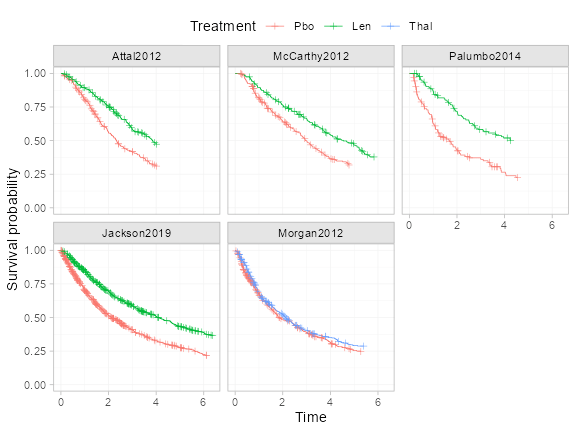

```r
library(multinma)
#> For execution on a local, multicore CPU with excess RAM we recommend calling
#> options(mc.cores = parallel::detectCores())
#> 
#> Attaching package: 'multinma'
#> The following objects are masked from 'package:stats':
#> 
#>     dgamma, pgamma, qgamma
library(survival)
library(dplyr)
#> 
#> Attaching package: 'dplyr'
#> The following objects are masked from 'package:stats':
#> 
#>     filter, lag
#> The following objects are masked from 'package:base':
#> 
#>     intersect, setdiff, setequal, union
library(ggplot2)
library(patchwork)
library(loo)
#> This is loo version 2.6.0
#> - Online documentation and vignettes at mc-stan.org/loo
#> - As of v2.0.0 loo defaults to 1 core but we recommend using as many as possible. Use the 'cores' argument or set options(mc.cores = NUM_CORES) for an entire session.
#> - Windows 10 users: loo may be very slow if 'mc.cores' is set in your .Rprofile file (see https://github.com/stan-dev/loo/issues/94).
```

```r
options(mc.cores = parallel::detectCores())
```


@Leahy2019 present a network of five trials comparing lenalidomide and thalidomide to placebo for newly diagnosed multiple myeloma (NDMM) after autologous stem cell transplant (ASCT).
The outcome of interest is progression free survival (PFS).
Simulated individual patient data (IPD) from three trials are found in the data set `ndmm_ipd`.
These include outcome times, censoring indicators, and covariates for each individual:

```r
head(ndmm_ipd)
#>          study trt       studyf trtf      age iss_stage3 response_cr_vgpr male eventtime status
#> 1 McCarthy2012 Pbo McCarthy2012  Pbo 50.81625          0                1    0 31.106516      1
#> 2 McCarthy2012 Pbo McCarthy2012  Pbo 62.18165          0                0    0  3.299623      0
#> 3 McCarthy2012 Pbo McCarthy2012  Pbo 51.53762          1                1    1 57.400000      0
#> 4 McCarthy2012 Pbo McCarthy2012  Pbo 46.74128          0                1    1 57.400000      0
#> 5 McCarthy2012 Pbo McCarthy2012  Pbo 62.62561          0                1    1 57.400000      0
#> 6 McCarthy2012 Pbo McCarthy2012  Pbo 49.24520          1                1    0 30.714460      0
```

Aggregate data (AgD) consisting of reconstructed event/censoring times from digitized Kaplan-Meier curves and covariate summaries are available on a further two trials, found in the data sets `ndmm_agd` and `ndmm_agd_covs`.

```r
head(ndmm_agd)
#>        study     studyf trt trtf eventtime status
#> 1 Morgan2012 Morgan2012 Pbo  Pbo  18.72575      1
#> 2 Morgan2012 Morgan2012 Pbo  Pbo  63.36000      0
#> 3 Morgan2012 Morgan2012 Pbo  Pbo  34.35726      1
#> 4 Morgan2012 Morgan2012 Pbo  Pbo  10.77826      1
#> 5 Morgan2012 Morgan2012 Pbo  Pbo  63.36000      0
#> 6 Morgan2012 Morgan2012 Pbo  Pbo  14.52966      1

ndmm_agd_covs
#>         study      studyf  trt trtf sample_size  age_min age_iqr_l age_median age_iqr_h  age_max
#> 1 Jackson2019 Jackson2019  Len  Len        1137 17.28246  59.13164   65.76766  72.00756 85.76095
#> 2 Jackson2019 Jackson2019  Pbo  Pbo         864 21.18572  58.30991   65.47402  71.80261 86.23080
#> 3  Morgan2012  Morgan2012  Pbo  Pbo         410 33.88979  58.05696   64.15999  70.44791 84.79372
#> 4  Morgan2012  Morgan2012 Thal Thal         408 38.45127  59.30022   65.48736  71.73597 84.69365
#>   age_mean   age_sd iss_stage3 response_cr_vgpr      male
#> 1 65.16867 8.936962  0.2480211        0.8258575 0.6165347
#> 2 64.62894 9.399272  0.1921296        0.8310185 0.6215278
#> 3 63.92360 9.006311  0.3634146        0.7170732 0.6195122
#> 4 65.59387 8.384686  0.3186275        0.7450980 0.6151961
```

@Phillippo_survival analysed these data using multilevel network meta-regression (ML-NMR), and we recreate these analyses here.

# Study data
First, let us look at Kaplan-Meier plots of the data from each study:

```r
kmdat <- bind_rows(ndmm_ipd, ndmm_agd) %>%
  group_by(studyf, trtf) %>%
  # KM estimate within each study
  group_modify(~with(survfit(Surv(eventtime, event = status) ~ 1, data = .),
                     tibble(time, n.censor, estimate = surv, std.err, upper, lower))) %>%
  # Add S(0) = 1
  group_modify(~add_row(., time = 0, n.censor = 0, estimate = 1, std.err = 0, upper = 1, lower = 1, .before = 0)) %>%
  arrange(studyf, trtf, time)

ggplot(kmdat, aes(x = time, y = estimate, colour = trtf)) +
  geom_step() +
  geom_point(shape = 3, data = function(x) filter(x, n.censor >= 1)) +
  facet_wrap(~studyf) +
  labs(y = "Survival probability", x = "Time") +
  coord_cartesian(ylim = c(0, 1)) +
  theme_multinma() +
  theme(legend.position = "top", legend.box.spacing = unit(0, "lines"))
```

<div class="figure" style="text-align: center">

<p class="caption">plot of chunk ndmm-km-data</p>
</div>

We consider adjustment for the following covariates:

 * Age
 * Sex
 * ISS stage, I-II vs. III
 * Response post-ASCT, complete or very good partial response vs. lesser response

The summary distributions of these characteristics in each study are as follows:

```r
bind_rows(
  summarise(ndmm_ipd,
            N = n(),
            age_mean = mean(age), age_sd = sd(age),
            iss_stage3 = mean(iss_stage3),
            response_cr_vgpr = mean(response_cr_vgpr),
            male = mean(male),
            .by = c(studyf, trtf)),
  transmute(ndmm_agd_covs,
            studyf, trtf,
            N = sample_size,
            age_mean, age_sd, iss_stage3, response_cr_vgpr, male)
) %>%
  mutate(across(where(is.double), ~round(., digits = 2)))
#>          studyf trtf    N age_mean age_sd iss_stage3 response_cr_vgpr male
#> 1  McCarthy2012  Pbo  229    57.39   5.56       0.18             0.71 0.55
#> 2  McCarthy2012  Len  231    57.93   6.33       0.27             0.62 0.52
#> 3     Attal2012  Pbo  307    54.22   5.24       0.16             0.54 0.58
#> 4     Attal2012  Len  307    54.35   6.06       0.24             0.55 0.55
#> 5   Palumbo2014  Pbo  125    54.44   8.98       0.12             0.38 0.63
#> 6   Palumbo2014  Len  126    53.90   9.69       0.10             0.42 0.46
#> 7   Jackson2019  Len 1137    65.17   8.94       0.25             0.83 0.62
#> 8   Jackson2019  Pbo  864    64.63   9.40       0.19             0.83 0.62
#> 9    Morgan2012  Pbo  410    63.92   9.01       0.36             0.72 0.62
#> 10   Morgan2012 Thal  408    65.59   8.38       0.32             0.75 0.62
```

# Setup
## Preparing treatment classes
We start by setting up the network for the analysis.
Since we only have IPD on the placebo vs. lenalidomide comparison, and only one AgD study on the placebo vs. thalidomide comparison, we make the shared effect modifier assumption between the two active treatments in order to estimate the effect modifying treatment-covariate interactions for thalidomide [@TSD18,@methods_paper].
Since lenalidomide and thalidomide are both in the same class of treatments, this assumption may be reasonable.

To impose this assumption, we create a treatment class variable for active treatments vs. placebo.

```r
ndmm_ipd$trtclass <- case_match(ndmm_ipd$trtf,
                                "Pbo" ~ "Placebo",
                                c("Len", "Thal") ~ "Active")

ndmm_agd$trtclass <- case_match(ndmm_agd$trtf,
                                "Pbo" ~ "Placebo",
                                c("Len", "Thal") ~ "Active")
```


## Setting up the network
We then set up the network using the `set_ipd()`, `set_agd_surv()`, and `combine_network()` functions.
Since we have survival data in the form of event/censoring times and censoring indicators, we use the `Surv` argument to the `set_*()` functions to set up the outcome data using the usual `survival::Surv()` function.
The AgD are set up in a similar fashion to the IPD, except that we only have summary covariate information (in the data frame `ndmm_agd_covs`) which is included using the `covariates` argument.
The data frame passed to `covariates` must have matching study and treatment columns to the outcome data set (`ndmm_agd`), in this case `studyf` and `trtf` respectively, one row per arm, so that the covariate information can be matched to the corresponding arms in the outcome data.
The IPD and AgD are then combined into a single network using `combine_network()`.

```r
ndmm_net <- combine_network(
  set_ipd(ndmm_ipd,
          study = studyf,
          trt = trtf,
          trt_class = trtclass,
          Surv = Surv(eventtime, status)),
  set_agd_surv(ndmm_agd,
               study = studyf,
               trt = trtf,
               trt_class = trtclass,
               Surv = Surv(eventtime, status),
               covariates = ndmm_agd_covs)
)
```

## Adding numerical integration for ML-NMR
To perform ML-NMR, we need to create numerical integration points for the joint covariate distributions in each AgD study.
These are used to integrate (i.e. average) the individual-level model over the joint covariate distribution to form the aggregate-level model.
This is done using the `add_integration()` function, and for each covariate we specify the marginal distribution using the `distr()` function.
Since age is skewed, we use a gamma distribution for this covariate; the remaining covariates are all binary and so are given Bernoulli distributions.
This procedure also requires information on the correlations between covariates.
If known, these can be specified using the `cor` argument.
However, by default the weighted average correlations from the IPD studies will be used.

```r
ndmm_net <- add_integration(ndmm_net,
                            age = distr(qgamma, mean = age_mean, sd = age_sd),
                            iss_stage3 = distr(qbern, iss_stage3),
                            response_cr_vgpr = distr(qbern, response_cr_vgpr),
                            male = distr(qbern, male))
#> Using weighted average correlation matrix computed from IPD studies.

ndmm_net
#> A network with 3 IPD studies, and 2 AgD studies (arm-based).
#> 
#> ------------------------------------------------------------------- IPD studies ---- 
#>  Study        Treatment arms
#>  Attal2012    2: Pbo | Len  
#>  McCarthy2012 2: Pbo | Len  
#>  Palumbo2014  2: Pbo | Len  
#> 
#>  Outcome type: survival
#> ------------------------------------------------------- AgD studies (arm-based) ---- 
#>  Study       Treatment arms
#>  Jackson2019 2: Pbo | Len  
#>  Morgan2012  2: Pbo | Thal 
#> 
#>  Outcome type: survival
#> ------------------------------------------------------------------------------------
#> Total number of treatments: 3, in 2 classes
#> Total number of studies: 5
#> Reference treatment is: Pbo
#> Network is connected
#> 
#> --------------------------------------------------------- Numerical integration ---- 
#> Numerical integration points available for 4 covariates: 
#>   age iss_stage3 response_cr_vgpr male
#> Number of numerical integration points: 64
```

## Network plot
We can plot the network diagram using the `plot()` method.

```r
plot(ndmm_net,
    weight_nodes = TRUE,
    weight_edges = TRUE,
    # Nudge treatment labels away from nodes
    nudge = 0.1,
    # Manual layout
    layout = data.frame(x = c(0, -1, 1),
                        y = c(-0.5, 0, 0))) +
  guides(edge_colour = guide_legend(override.aes = list(edge_width = 2))) +
  theme(legend.position = "bottom", legend.direction = "vertical")
```

<div class="figure" style="text-align: center">

<p class="caption">plot of chunk ndmm-network</p>
</div>

# ML-NMR models with M-spline baseline hazards
We fit a proportional hazards survival model with cubic M-splines on the baseline hazard [@Brilleman2020,@Phillippo_survival].
This allows the baseline hazard to flexibly follow any shape that the baseline hazard may take.

## Choosing the number of knots
ML-NMR models are fit using the `nma()` function, and we specify that a M-spline baseline hazard should be used with `likelihood = "mspline"`.

Fitting spline models requires the user to specify the number and location of the knots.
By default, three internal knots are used (`n_knots = 3`) which are placed at evenly spaced quantiles on the observed event times within each study (i.e. at the 25%, 50%, and 75% quantiles with 3 internal knots).
The number of knots can be changed using the `n_knots` argument, or custom knot locations can be specified using the `knots` argument.
The `nma()` function will always place boundary knots at the earliest entry time into the study (0 with no delayed entry) and at the maximum event/censoring time.

By default, the `nma()` function will fit a cubic M-spline (`mspline_degree = 3`).
Piecewise-constant hazards (i.e. piecewise exponential hazards) are a special case with degree 0 splines, specified using `likelihood = "pexp"` (which is equivalent to `mspline_degree = 0`).

We specify a regression model using the `regression` argument which includes main effects of covariates (prognostic effects)  and treatment-covariate interactions (effect modifier interactions) for each covariate.
We place vague $\operatorname{N}(0, 100^2)$ priors on each of the parameters in the linear predictor, and a $\operatorname{Dirichlet}(1)$ prior distribution for the spline coefficients which is uniform over the unit simplex.
Using the QR decomposition (`QR = TRUE`) can greatly increase sampling efficiency for regression models, and we also reduce the `max_treedepth` of the Stan sampler to speed up warm-up time.

We fit models with 1, 2, and 3 internal knots, and we will then choose the number of knots using the leave-one-out information criterion (LOOIC).


```r
ndmm_fit_1kt <- nma(ndmm_net,
                    regression = ~(age + iss_stage3 + response_cr_vgpr + male)*.trt,
                    likelihood = "mspline",
                    n_knots = 1,
                    prior_intercept = normal(0, 100),
                    prior_trt = normal(0, 100),
                    prior_reg = normal(0, 100),
                    prior_aux = dirichlet(1),
                    QR = TRUE,
                    # Reducing max_treedepth can speed up warm-up, but
                    # increase if max_treedepth errors occur
                    control = list(max_treedepth = 6))
#> Note: Setting "Pbo" as the network reference treatment.

ndmm_fit_1kt
#> A fixed effects ML-NMR with a mspline likelihood (log link).
#> Regression model: ~(age + iss_stage3 + response_cr_vgpr + male) * .trt.
#> Centred covariates at the following overall mean values:
#>              age       iss_stage3 response_cr_vgpr             male 
#>       61.6558571        0.2297184        0.7314265        0.6020451 
#> Inference for Stan model: survival_mspline.
#> 4 chains, each with iter=2000; warmup=1000; thin=1; 
#> post-warmup draws per chain=1000, total post-warmup draws=4000.
#> 
#>                                             mean se_mean   sd      2.5%       25%       50%
#> beta[age]                                   0.08    0.00 0.01      0.07      0.07      0.08
#> beta[iss_stage3]                            0.36    0.00 0.13      0.09      0.27      0.36
#> beta[response_cr_vgpr]                     -0.14    0.00 0.10     -0.33     -0.21     -0.14
#> beta[male]                                  0.01    0.00 0.10     -0.20     -0.06      0.00
#> beta[age:.trtclassActive]                  -0.02    0.00 0.01     -0.03     -0.02     -0.02
#> beta[iss_stage3:.trtclassActive]            0.20    0.00 0.18     -0.14      0.08      0.19
#> beta[response_cr_vgpr:.trtclassActive]      0.20    0.00 0.14     -0.07      0.11      0.20
#> beta[male:.trtclassActive]                  0.13    0.00 0.15     -0.17      0.03      0.13
#> d[Len]                                     -0.67    0.00 0.05     -0.77     -0.70     -0.67
#> d[Thal]                                    -0.20    0.00 0.11     -0.40     -0.27     -0.20
#> lp__                                   -12422.64    0.13 4.50 -12432.20 -12425.54 -12422.27
#> scoef[Attal2012, 1]                         0.03    0.00 0.01      0.01      0.02      0.03
#> scoef[Attal2012, 2]                         0.17    0.00 0.05      0.07      0.14      0.17
#> scoef[Attal2012, 3]                         0.38    0.00 0.10      0.19      0.32      0.39
#> scoef[Attal2012, 4]                         0.20    0.00 0.09      0.03      0.13      0.19
#> scoef[Attal2012, 5]                         0.22    0.00 0.05      0.13      0.19      0.22
#> scoef[McCarthy2012, 1]                      0.01    0.00 0.01      0.00      0.00      0.00
#> scoef[McCarthy2012, 2]                      0.29    0.00 0.05      0.20      0.25      0.29
#> scoef[McCarthy2012, 3]                      0.17    0.00 0.09      0.02      0.10      0.16
#> scoef[McCarthy2012, 4]                      0.31    0.00 0.11      0.09      0.23      0.32
#> scoef[McCarthy2012, 5]                      0.23    0.00 0.07      0.09      0.17      0.23
#> scoef[Palumbo2014, 1]                       0.01    0.00 0.01      0.00      0.00      0.01
#> scoef[Palumbo2014, 2]                       0.39    0.00 0.07      0.26      0.34      0.39
#> scoef[Palumbo2014, 3]                       0.20    0.00 0.11      0.02      0.12      0.20
#> scoef[Palumbo2014, 4]                       0.18    0.00 0.11      0.01      0.09      0.17
#> scoef[Palumbo2014, 5]                       0.21    0.00 0.08      0.06      0.16      0.21
#> scoef[Jackson2019, 1]                       0.04    0.00 0.01      0.03      0.03      0.04
#> scoef[Jackson2019, 2]                       0.32    0.00 0.03      0.25      0.29      0.32
#> scoef[Jackson2019, 3]                       0.23    0.00 0.06      0.10      0.18      0.23
#> scoef[Jackson2019, 4]                       0.22    0.00 0.07      0.09      0.18      0.22
#> scoef[Jackson2019, 5]                       0.20    0.00 0.04      0.12      0.17      0.19
#> scoef[Morgan2012, 1]                        0.02    0.00 0.01      0.01      0.02      0.02
#> scoef[Morgan2012, 2]                        0.46    0.00 0.04      0.37      0.43      0.45
#> scoef[Morgan2012, 3]                        0.10    0.00 0.07      0.01      0.05      0.09
#> scoef[Morgan2012, 4]                        0.34    0.00 0.08      0.17      0.29      0.35
#> scoef[Morgan2012, 5]                        0.08    0.00 0.05      0.01      0.04      0.07
#>                                              75%     97.5% n_eff Rhat
#> beta[age]                                   0.08      0.09  4010 1.00
#> beta[iss_stage3]                            0.45      0.61  7434 1.00
#> beta[response_cr_vgpr]                     -0.07      0.06  8689 1.00
#> beta[male]                                  0.07      0.21  7882 1.00
#> beta[age:.trtclassActive]                  -0.01      0.00  5379 1.00
#> beta[iss_stage3:.trtclassActive]            0.31      0.55  8217 1.00
#> beta[response_cr_vgpr:.trtclassActive]      0.30      0.49  6681 1.00
#> beta[male:.trtclassActive]                  0.23      0.41  6671 1.00
#> d[Len]                                     -0.63     -0.56  4691 1.00
#> d[Thal]                                    -0.12      0.02  3896 1.01
#> lp__                                   -12419.49 -12414.94  1290 1.01
#> scoef[Attal2012, 1]                         0.04      0.06  3369 1.00
#> scoef[Attal2012, 2]                         0.21      0.28  2387 1.00
#> scoef[Attal2012, 3]                         0.45      0.57  2184 1.00
#> scoef[Attal2012, 4]                         0.26      0.38  2351 1.00
#> scoef[Attal2012, 5]                         0.25      0.31  3637 1.00
#> scoef[McCarthy2012, 1]                      0.01      0.02  5970 1.00
#> scoef[McCarthy2012, 2]                      0.32      0.37  3895 1.00
#> scoef[McCarthy2012, 3]                      0.23      0.36  3125 1.00
#> scoef[McCarthy2012, 4]                      0.40      0.52  3410 1.00
#> scoef[McCarthy2012, 5]                      0.28      0.37  3915 1.00
#> scoef[Palumbo2014, 1]                       0.02      0.04  5576 1.00
#> scoef[Palumbo2014, 2]                       0.43      0.52  4006 1.00
#> scoef[Palumbo2014, 3]                       0.28      0.42  3130 1.00
#> scoef[Palumbo2014, 4]                       0.26      0.42  3963 1.00
#> scoef[Palumbo2014, 5]                       0.27      0.38  5354 1.00
#> scoef[Jackson2019, 1]                       0.04      0.05  2883 1.01
#> scoef[Jackson2019, 2]                       0.34      0.39  2654 1.00
#> scoef[Jackson2019, 3]                       0.27      0.35  2325 1.00
#> scoef[Jackson2019, 4]                       0.27      0.36  2688 1.00
#> scoef[Jackson2019, 5]                       0.22      0.27  3645 1.00
#> scoef[Morgan2012, 1]                        0.03      0.04  5369 1.00
#> scoef[Morgan2012, 2]                        0.49      0.54  3218 1.00
#> scoef[Morgan2012, 3]                        0.15      0.26  3653 1.00
#> scoef[Morgan2012, 4]                        0.40      0.48  4518 1.00
#> scoef[Morgan2012, 5]                        0.11      0.18  4594 1.00
#> 
#> Samples were drawn using NUTS(diag_e) at Thu Aug 24 20:21:16 2023.
#> For each parameter, n_eff is a crude measure of effective sample size,
#> and Rhat is the potential scale reduction factor on split chains (at 
#> convergence, Rhat=1).

ndmm_fit_2kt <- nma(ndmm_net,
                    regression = ~(age + iss_stage3 + response_cr_vgpr + male)*.trt,
                    likelihood = "mspline",
                    n_knots = 2,
                    prior_intercept = normal(0, 100),
                    prior_trt = normal(0, 100),
                    prior_reg = normal(0, 100),
                    prior_aux = dirichlet(1),
                    QR = TRUE,
                    # Reducing max_treedepth can speed up warm-up, but
                    # increase if max_treedepth errors occur
                    control = list(max_treedepth = 6))
#> Note: Setting "Pbo" as the network reference treatment.

ndmm_fit_2kt
#> A fixed effects ML-NMR with a mspline likelihood (log link).
#> Regression model: ~(age + iss_stage3 + response_cr_vgpr + male) * .trt.
#> Centred covariates at the following overall mean values:
#>              age       iss_stage3 response_cr_vgpr             male 
#>       61.6558571        0.2297184        0.7314265        0.6020451 
#> Inference for Stan model: survival_mspline.
#> 4 chains, each with iter=2000; warmup=1000; thin=1; 
#> post-warmup draws per chain=1000, total post-warmup draws=4000.
#> 
#>                                             mean se_mean   sd      2.5%       25%       50%
#> beta[age]                                   0.08    0.00 0.01      0.06      0.07      0.08
#> beta[iss_stage3]                            0.35    0.00 0.13      0.08      0.26      0.36
#> beta[response_cr_vgpr]                     -0.13    0.00 0.10     -0.33     -0.20     -0.14
#> beta[male]                                  0.01    0.00 0.11     -0.20     -0.06      0.01
#> beta[age:.trtclassActive]                  -0.02    0.00 0.01     -0.03     -0.02     -0.02
#> beta[iss_stage3:.trtclassActive]            0.20    0.00 0.18     -0.15      0.08      0.20
#> beta[response_cr_vgpr:.trtclassActive]      0.20    0.00 0.14     -0.08      0.10      0.20
#> beta[male:.trtclassActive]                  0.13    0.00 0.16     -0.19      0.03      0.13
#> d[Len]                                     -0.67    0.00 0.05     -0.77     -0.70     -0.67
#> d[Thal]                                    -0.20    0.00 0.11     -0.41     -0.27     -0.20
#> lp__                                   -12438.16    0.14 4.99 -12448.82 -12441.21 -12437.76
#> scoef[Attal2012, 1]                         0.02    0.00 0.01      0.00      0.01      0.01
#> scoef[Attal2012, 2]                         0.11    0.00 0.03      0.05      0.09      0.11
#> scoef[Attal2012, 3]                         0.21    0.00 0.07      0.08      0.16      0.20
#> scoef[Attal2012, 4]                         0.39    0.00 0.08      0.23      0.34      0.39
#> scoef[Attal2012, 5]                         0.09    0.00 0.06      0.00      0.05      0.09
#> scoef[Attal2012, 6]                         0.19    0.00 0.04      0.11      0.16      0.19
#> scoef[McCarthy2012, 1]                      0.00    0.00 0.00      0.00      0.00      0.00
#> scoef[McCarthy2012, 2]                      0.12    0.00 0.03      0.07      0.10      0.12
#> scoef[McCarthy2012, 3]                      0.19    0.00 0.07      0.07      0.15      0.19
#> scoef[McCarthy2012, 4]                      0.30    0.00 0.09      0.12      0.24      0.30
#> scoef[McCarthy2012, 5]                      0.17    0.00 0.10      0.01      0.09      0.16
#> scoef[McCarthy2012, 6]                      0.21    0.00 0.07      0.08      0.17      0.21
#> scoef[Palumbo2014, 1]                       0.01    0.00 0.01      0.00      0.00      0.00
#> scoef[Palumbo2014, 2]                       0.15    0.00 0.04      0.08      0.12      0.15
#> scoef[Palumbo2014, 3]                       0.27    0.00 0.09      0.10      0.20      0.26
#> scoef[Palumbo2014, 4]                       0.27    0.00 0.11      0.05      0.19      0.27
#> scoef[Palumbo2014, 5]                       0.12    0.00 0.09      0.00      0.05      0.10
#> scoef[Palumbo2014, 6]                       0.19    0.00 0.08      0.05      0.14      0.19
#> scoef[Jackson2019, 1]                       0.02    0.00 0.00      0.01      0.02      0.02
#> scoef[Jackson2019, 2]                       0.11    0.00 0.01      0.08      0.10      0.11
#> scoef[Jackson2019, 3]                       0.29    0.00 0.04      0.22      0.26      0.29
#> scoef[Jackson2019, 4]                       0.24    0.00 0.06      0.12      0.20      0.24
#> scoef[Jackson2019, 5]                       0.18    0.00 0.06      0.06      0.14      0.18
#> scoef[Jackson2019, 6]                       0.16    0.00 0.03      0.10      0.14      0.16
#> scoef[Morgan2012, 1]                        0.01    0.00 0.01      0.00      0.01      0.01
#> scoef[Morgan2012, 2]                        0.13    0.00 0.02      0.09      0.12      0.13
#> scoef[Morgan2012, 3]                        0.36    0.00 0.05      0.26      0.33      0.36
#> scoef[Morgan2012, 4]                        0.15    0.00 0.08      0.02      0.09      0.15
#> scoef[Morgan2012, 5]                        0.28    0.00 0.08      0.11      0.23      0.28
#> scoef[Morgan2012, 6]                        0.06    0.00 0.04      0.00      0.03      0.06
#>                                              75%     97.5% n_eff Rhat
#> beta[age]                                   0.08      0.09  3342 1.00
#> beta[iss_stage3]                            0.44      0.61  6615 1.00
#> beta[response_cr_vgpr]                     -0.07      0.06  8604 1.00
#> beta[male]                                  0.08      0.22 10134 1.00
#> beta[age:.trtclassActive]                  -0.01      0.00  4098 1.00
#> beta[iss_stage3:.trtclassActive]            0.32      0.55  6782 1.00
#> beta[response_cr_vgpr:.trtclassActive]      0.30      0.47  6349 1.00
#> beta[male:.trtclassActive]                  0.23      0.44  8475 1.00
#> d[Len]                                     -0.63     -0.56  5166 1.00
#> d[Thal]                                    -0.12      0.02  5710 1.00
#> lp__                                   -12434.70 -12429.60  1211 1.00
#> scoef[Attal2012, 1]                         0.02      0.04  3220 1.00
#> scoef[Attal2012, 2]                         0.13      0.17  2463 1.00
#> scoef[Attal2012, 3]                         0.25      0.34  2370 1.00
#> scoef[Attal2012, 4]                         0.44      0.54  2611 1.00
#> scoef[Attal2012, 5]                         0.13      0.23  2917 1.00
#> scoef[Attal2012, 6]                         0.21      0.27  3871 1.00
#> scoef[McCarthy2012, 1]                      0.00      0.01  7371 1.00
#> scoef[McCarthy2012, 2]                      0.14      0.18  3975 1.00
#> scoef[McCarthy2012, 3]                      0.24      0.33  3016 1.00
#> scoef[McCarthy2012, 4]                      0.37      0.48  3166 1.00
#> scoef[McCarthy2012, 5]                      0.23      0.37  3702 1.00
#> scoef[McCarthy2012, 6]                      0.26      0.35  4671 1.00
#> scoef[Palumbo2014, 1]                       0.01      0.03  6493 1.00
#> scoef[Palumbo2014, 2]                       0.17      0.22  4467 1.00
#> scoef[Palumbo2014, 3]                       0.33      0.45  3441 1.00
#> scoef[Palumbo2014, 4]                       0.34      0.49  3457 1.00
#> scoef[Palumbo2014, 5]                       0.17      0.33  4035 1.00
#> scoef[Palumbo2014, 6]                       0.25      0.34  5718 1.00
#> scoef[Jackson2019, 1]                       0.03      0.03  2685 1.01
#> scoef[Jackson2019, 2]                       0.12      0.14  3872 1.00
#> scoef[Jackson2019, 3]                       0.31      0.36  2627 1.00
#> scoef[Jackson2019, 4]                       0.28      0.35  2415 1.00
#> scoef[Jackson2019, 5]                       0.22      0.30  3001 1.00
#> scoef[Jackson2019, 6]                       0.19      0.23  3842 1.00
#> scoef[Morgan2012, 1]                        0.01      0.02  5555 1.00
#> scoef[Morgan2012, 2]                        0.14      0.17  3681 1.00
#> scoef[Morgan2012, 3]                        0.40      0.46  3235 1.00
#> scoef[Morgan2012, 4]                        0.21      0.31  2375 1.00
#> scoef[Morgan2012, 5]                        0.33      0.42  3138 1.00
#> scoef[Morgan2012, 6]                        0.09      0.16  4533 1.00
#> 
#> Samples were drawn using NUTS(diag_e) at Thu Aug 24 21:30:45 2023.
#> For each parameter, n_eff is a crude measure of effective sample size,
#> and Rhat is the potential scale reduction factor on split chains (at 
#> convergence, Rhat=1).

ndmm_fit_3kt <- nma(ndmm_net,
                    regression = ~(age + iss_stage3 + response_cr_vgpr + male)*.trt,
                    likelihood = "mspline",
                    n_knots = 3,
                    prior_intercept = normal(0, 100),
                    prior_trt = normal(0, 100),
                    prior_reg = normal(0, 100),
                    prior_aux = dirichlet(1),
                    QR = TRUE,
                    # Reducing max_treedepth can speed up warm-up, but
                    # increase if max_treedepth errors occur
                    control = list(max_treedepth = 6))
#> Note: Setting "Pbo" as the network reference treatment.

ndmm_fit_3kt
#> A fixed effects ML-NMR with a mspline likelihood (log link).
#> Regression model: ~(age + iss_stage3 + response_cr_vgpr + male) * .trt.
#> Centred covariates at the following overall mean values:
#>              age       iss_stage3 response_cr_vgpr             male 
#>       61.6558571        0.2297184        0.7314265        0.6020451 
#> Inference for Stan model: survival_mspline.
#> 4 chains, each with iter=2000; warmup=1000; thin=1; 
#> post-warmup draws per chain=1000, total post-warmup draws=4000.
#> 
#>                                             mean se_mean   sd      2.5%       25%       50%
#> beta[age]                                   0.08    0.00 0.01      0.06      0.07      0.08
#> beta[iss_stage3]                            0.35    0.00 0.13      0.09      0.27      0.36
#> beta[response_cr_vgpr]                     -0.14    0.00 0.10     -0.33     -0.20     -0.14
#> beta[male]                                  0.01    0.00 0.10     -0.19     -0.06      0.01
#> beta[age:.trtclassActive]                  -0.02    0.00 0.01     -0.03     -0.02     -0.02
#> beta[iss_stage3:.trtclassActive]            0.19    0.00 0.17     -0.14      0.08      0.19
#> beta[response_cr_vgpr:.trtclassActive]      0.20    0.00 0.14     -0.07      0.11      0.20
#> beta[male:.trtclassActive]                  0.13    0.00 0.15     -0.17      0.02      0.13
#> d[Len]                                     -0.67    0.00 0.05     -0.77     -0.70     -0.67
#> d[Thal]                                    -0.19    0.00 0.11     -0.41     -0.27     -0.19
#> lp__                                   -12455.14    0.13 5.18 -12466.01 -12458.45 -12454.74
#> scoef[Attal2012, 1]                         0.01    0.00 0.01      0.00      0.01      0.01
#> scoef[Attal2012, 2]                         0.07    0.00 0.03      0.02      0.05      0.07
#> scoef[Attal2012, 3]                         0.13    0.00 0.04      0.04      0.10      0.13
#> scoef[Attal2012, 4]                         0.29    0.00 0.07      0.16      0.24      0.29
#> scoef[Attal2012, 5]                         0.25    0.00 0.07      0.10      0.20      0.25
#> scoef[Attal2012, 6]                         0.09    0.00 0.06      0.01      0.04      0.08
#> scoef[Attal2012, 7]                         0.16    0.00 0.04      0.09      0.13      0.16
#> scoef[McCarthy2012, 1]                      0.00    0.00 0.00      0.00      0.00      0.00
#> scoef[McCarthy2012, 2]                      0.05    0.00 0.02      0.01      0.04      0.05
#> scoef[McCarthy2012, 3]                      0.18    0.00 0.04      0.10      0.15      0.18
#> scoef[McCarthy2012, 4]                      0.15    0.00 0.06      0.03      0.10      0.15
#> scoef[McCarthy2012, 5]                      0.32    0.00 0.07      0.16      0.27      0.32
#> scoef[McCarthy2012, 6]                      0.10    0.00 0.07      0.00      0.04      0.08
#> scoef[McCarthy2012, 7]                      0.21    0.00 0.07      0.08      0.16      0.21
#> scoef[Palumbo2014, 1]                       0.00    0.00 0.00      0.00      0.00      0.00
#> scoef[Palumbo2014, 2]                       0.09    0.00 0.03      0.03      0.07      0.08
#> scoef[Palumbo2014, 3]                       0.13    0.00 0.05      0.03      0.09      0.13
#> scoef[Palumbo2014, 4]                       0.29    0.00 0.09      0.12      0.23      0.29
#> scoef[Palumbo2014, 5]                       0.19    0.00 0.10      0.02      0.12      0.19
#> scoef[Palumbo2014, 6]                       0.12    0.00 0.08      0.01      0.05      0.10
#> scoef[Palumbo2014, 7]                       0.18    0.00 0.07      0.04      0.13      0.18
#> scoef[Jackson2019, 1]                       0.01    0.00 0.00      0.01      0.01      0.01
#> scoef[Jackson2019, 2]                       0.07    0.00 0.01      0.05      0.06      0.07
#> scoef[Jackson2019, 3]                       0.13    0.00 0.02      0.09      0.12      0.13
#> scoef[Jackson2019, 4]                       0.29    0.00 0.04      0.22      0.27      0.29
#> scoef[Jackson2019, 5]                       0.18    0.00 0.05      0.07      0.14      0.18
#> scoef[Jackson2019, 6]                       0.18    0.00 0.05      0.08      0.15      0.18
#> scoef[Jackson2019, 7]                       0.13    0.00 0.03      0.07      0.11      0.13
#> scoef[Morgan2012, 1]                        0.01    0.00 0.00      0.00      0.00      0.01
#> scoef[Morgan2012, 2]                        0.07    0.00 0.01      0.04      0.06      0.07
#> scoef[Morgan2012, 3]                        0.16    0.00 0.03      0.11      0.14      0.16
#> scoef[Morgan2012, 4]                        0.32    0.00 0.05      0.21      0.28      0.32
#> scoef[Morgan2012, 5]                        0.15    0.00 0.07      0.02      0.09      0.15
#> scoef[Morgan2012, 6]                        0.25    0.00 0.07      0.10      0.20      0.25
#> scoef[Morgan2012, 7]                        0.05    0.00 0.04      0.00      0.02      0.04
#>                                              75%     97.5% n_eff Rhat
#> beta[age]                                   0.08      0.09  4755 1.00
#> beta[iss_stage3]                            0.44      0.60  7624 1.00
#> beta[response_cr_vgpr]                     -0.07      0.06  7610 1.00
#> beta[male]                                  0.07      0.20  8990 1.00
#> beta[age:.trtclassActive]                  -0.01      0.00  5698 1.00
#> beta[iss_stage3:.trtclassActive]            0.31      0.54  6889 1.00
#> beta[response_cr_vgpr:.trtclassActive]      0.30      0.47  5200 1.00
#> beta[male:.trtclassActive]                  0.23      0.43  7227 1.00
#> d[Len]                                     -0.63     -0.56  5497 1.00
#> d[Thal]                                    -0.12      0.03  6050 1.00
#> lp__                                   -12451.46 -12446.23  1531 1.00
#> scoef[Attal2012, 1]                         0.02      0.03  3120 1.00
#> scoef[Attal2012, 2]                         0.09      0.12  2276 1.00
#> scoef[Attal2012, 3]                         0.16      0.22  2051 1.00
#> scoef[Attal2012, 4]                         0.33      0.42  2164 1.00
#> scoef[Attal2012, 5]                         0.30      0.38  2383 1.00
#> scoef[Attal2012, 6]                         0.13      0.22  3355 1.00
#> scoef[Attal2012, 7]                         0.19      0.24  4115 1.00
#> scoef[McCarthy2012, 1]                      0.00      0.01  6439 1.00
#> scoef[McCarthy2012, 2]                      0.06      0.09  3072 1.00
#> scoef[McCarthy2012, 3]                      0.21      0.26  2427 1.00
#> scoef[McCarthy2012, 4]                      0.19      0.28  2215 1.00
#> scoef[McCarthy2012, 5]                      0.37      0.45  2512 1.00
#> scoef[McCarthy2012, 6]                      0.14      0.26  3857 1.00
#> scoef[McCarthy2012, 7]                      0.25      0.33  5428 1.00
#> scoef[Palumbo2014, 1]                       0.01      0.02  5107 1.00
#> scoef[Palumbo2014, 2]                       0.10      0.14  3635 1.00
#> scoef[Palumbo2014, 3]                       0.17      0.24  2553 1.00
#> scoef[Palumbo2014, 4]                       0.36      0.46  2872 1.00
#> scoef[Palumbo2014, 5]                       0.26      0.39  3528 1.00
#> scoef[Palumbo2014, 6]                       0.17      0.30  5007 1.00
#> scoef[Palumbo2014, 7]                       0.23      0.33  5815 1.00
#> scoef[Jackson2019, 1]                       0.02      0.02  4745 1.00
#> scoef[Jackson2019, 2]                       0.08      0.09  3282 1.01
#> scoef[Jackson2019, 3]                       0.14      0.17  3328 1.00
#> scoef[Jackson2019, 4]                       0.31      0.37  2909 1.00
#> scoef[Jackson2019, 5]                       0.22      0.28  2801 1.00
#> scoef[Jackson2019, 6]                       0.22      0.29  3540 1.00
#> scoef[Jackson2019, 7]                       0.15      0.20  4414 1.00
#> scoef[Morgan2012, 1]                        0.01      0.02  4944 1.00
#> scoef[Morgan2012, 2]                        0.08      0.10  3728 1.00
#> scoef[Morgan2012, 3]                        0.18      0.22  3597 1.00
#> scoef[Morgan2012, 4]                        0.35      0.42  2560 1.00
#> scoef[Morgan2012, 5]                        0.20      0.30  2630 1.00
#> scoef[Morgan2012, 6]                        0.30      0.37  3918 1.00
#> scoef[Morgan2012, 7]                        0.07      0.14  4877 1.00
#> 
#> Samples were drawn using NUTS(diag_e) at Thu Aug 24 22:46:04 2023.
#> For each parameter, n_eff is a crude measure of effective sample size,
#> and Rhat is the potential scale reduction factor on split chains (at 
#> convergence, Rhat=1).
```

We then compare the LOOIC, using the `loo` package.

```r
(ndmm_fit_1kt_loo <- loo(ndmm_fit_1kt))
#> Error in serialize(data, node$con): error writing to connection
#> Error in serialize(data, node$con): error writing to connection

(ndmm_fit_2kt_loo <- loo(ndmm_fit_2kt))
#> Error in serialize(data, node$con): error writing to connection
#> Error in serialize(data, node$con): error writing to connection

(ndmm_fit_3kt_loo <- loo(ndmm_fit_3kt))
#> Error in serialize(data, node$con): error writing to connection
#> Error in serialize(data, node$con): error writing to connection

loo_compare(list("1 knot" = ndmm_fit_1kt_loo,
                 "2 knots" = ndmm_fit_2kt_loo,
                 "3 knots" = ndmm_fit_3kt_loo))
#> Error in eval(expr, envir, enclos): object 'ndmm_fit_1kt_loo' not found
```

The model with a single internal knot at the median uncensored survival time has the lowest LOOIC (highest ELPD).
Increasing the number of knots does not improve overall model fit in this case.

It is also important to check the model fit within each study, to check that no single study has a better fit with a larger number of knots which could be washed out by the increased model complexity in other studies.

```r
studies_all <- c(ndmm_ipd$study, ndmm_agd$study)
cbind(
  `1 knot` = by(ndmm_fit_1kt_loo$pointwise[, "looic"], studies_all, sum),
  `2 knots` = by(ndmm_fit_2kt_loo$pointwise[, "looic"], studies_all, sum),
  `3 knots` = by(ndmm_fit_3kt_loo$pointwise[, "looic"], studies_all, sum)
)
#> Error in eval(expr, envir, enclos): object 'ndmm_fit_1kt_loo' not found
```

We conclude that 1 knot is sufficient for all studies.


## Ploting hazards
Let us look at the estimated hazard functions under each model with increasing numbers of knots.

By default, the `predict()` function with `type = "hazard"` will produce plots of the population-average marginal hazards (`level = "aggregate"`, which is the default).
These can then be plotted using the `plot()` function.
We combine the plots into one grid using the `patchwork` package.

```r
mhp1 <- plot(predict(ndmm_fit_1kt, type = "hazard", level = "aggregate"))

mhp2 <- plot(predict(ndmm_fit_2kt, type = "hazard", level = "aggregate"))

mhp3 <- plot(predict(ndmm_fit_3kt, type = "hazard", level = "aggregate"))

# Combining these into a single plot using patchwork
mhp1 + facet_grid(rows = vars("1 knot"), cols = vars(Study)) +
  mhp2 + facet_grid(rows = vars("2 knots"), cols = vars(Study)) +
  mhp3 + facet_grid(rows = vars("3 knots"), cols = vars(Study)) +
  plot_layout(ncol = 1, guides = "collect") &
  theme(legend.position = "top", legend.box.spacing = unit(0, "lines"))
```

<div class="figure" style="text-align: center">

<p class="caption">plot of chunk marginal-hazards</p>
</div>

We see that with increasing numbers of knots the marginal hazards become increasingly "wiggly", which in this case is overfitting.

We can also look at the individual-level baseline hazards.
This is again possible using the `predict()` function, this time with `level = "individual"`.
Since we want to show the baseline hazard for the reference level of the covariates, we'll create a data frame to pass to `predict()` as `newdata`.

```r
refdat <- tibble(study = ndmm_net$studies,
                 age = ndmm_fit_1kt$xbar["age"],
                 iss_stage3 = 0,
                 response_cr_vgpr = 0,
                 male = 0)
```

Since we are providing a new data frame for prediction, we also need to provide the times to predict at and the distributions of the baseline (intercept) and auxiliary (spline coefficient) parameters.
We will predict at evenly spaced times between time 0 and the last event/censoring time in each study.
We specify a named list of the study names for both `baseline` and `aux`, to use the posterior distributions from each study for these parameters.

```r
# At evenly spaced times between the boundary knots
tdat <- purrr::imap_dfr(ndmm_fit_1kt$basis,
                        ~tibble(study = factor(.y, levels = ndmm_net$studies),
                                lower = attr(.x, "Boundary.knots")[1],
                                upper = attr(.x, "Boundary.knots")[2],
                                times = seq(lower, upper, length = 50)))

refdat <- left_join(refdat, tdat, by = "study")

studies <- as.list(setNames(nm = levels(ndmm_net$studies)))
```

Then we produce the predictions, plot and combine using `patchwork`.

```r
bhp1 <- plot(predict(ndmm_fit_1kt, type = "hazard", level = "individual",
                    newdata = refdat, study = study, times = times,
                    baseline = studies, aux = studies))

bhp2 <- plot(predict(ndmm_fit_2kt, type = "hazard", level = "individual",
                    newdata = refdat, study = study, times = times,
                    baseline = studies, aux = studies))

bhp3 <- plot(predict(ndmm_fit_3kt, type = "hazard", level = "individual",
                    newdata = refdat, study = study, times = times,
                    baseline = studies, aux = studies))

# Combining these into a single plot using patchwork
bhp1 + facet_grid(rows = vars("1 knot"), cols = vars(Study)) +
  bhp2 + facet_grid(rows = vars("2 knots"), cols = vars(Study)) +
  bhp3 + facet_grid(rows = vars("3 knots"), cols = vars(Study)) +
  plot_layout(ncol = 1, guides = "collect") &
  theme(legend.position = "top", legend.box.spacing = unit(0, "lines"))
```

<div class="figure" style="text-align: center">

<p class="caption">plot of chunk baseline-hazards</p>
</div>

Again, we see that as the number of knots increases the baseline hazards get more "wiggly".
As noted above, based on LOOIC the model with 1 internal knot is sufficient here.

# Assessing the proportional hazards assumption

We can relax and assess the proportional hazards (PH) assumption by allowing the spline coefficients to vary between treatment arms within each study.
This is achieved using the `aux_by` argument, with `aux_by = c(.study, .trt)`.
Technically, `aux_by = .study` is always assumed in order to respect randomisation (analogous to stratifying the intercept terms in a NMA by study), and we could simply write `aux_by = .trt`; but we choose to make the stratification by study explicit in this instance.

```r
ndmm_fit_nph <- nma(ndmm_net,
                    regression = ~(age + iss_stage3 + response_cr_vgpr + male)*.trt,
                    likelihood = "mspline",
                    n_knots = 1,
                    prior_intercept = normal(0, 100),
                    prior_trt = normal(0, 100),
                    prior_reg = normal(0, 100),
                    prior_aux = dirichlet(1),
                    aux_by = c(.study, .trt),
                    QR = TRUE,
                    # Reducing max_treedepth can speed up warm-up, but
                    # increase if max_treedepth errors occur
                    control = list(max_treedepth = 6))
#> Note: Setting "Pbo" as the network reference treatment.

ndmm_fit_nph
#> A fixed effects ML-NMR with a mspline likelihood (log link).
#> Regression model: ~(age + iss_stage3 + response_cr_vgpr + male) * .trt.
#> Centred covariates at the following overall mean values:
#>              age       iss_stage3 response_cr_vgpr             male 
#>       61.6558571        0.2297184        0.7314265        0.6020451 
#> Inference for Stan model: survival_mspline.
#> 4 chains, each with iter=2000; warmup=1000; thin=1; 
#> post-warmup draws per chain=1000, total post-warmup draws=4000.
#> 
#>                                             mean se_mean   sd      2.5%       25%       50%
#> beta[age]                                   0.08    0.00 0.01      0.06      0.07      0.07
#> beta[iss_stage3]                            0.34    0.00 0.13      0.07      0.25      0.34
#> beta[response_cr_vgpr]                     -0.11    0.00 0.10     -0.30     -0.18     -0.11
#> beta[male]                                 -0.01    0.00 0.10     -0.20     -0.08      0.00
#> beta[age:.trtclassActive]                  -0.01    0.00 0.01     -0.04     -0.02     -0.01
#> beta[iss_stage3:.trtclassActive]            0.24    0.00 0.18     -0.11      0.11      0.23
#> beta[response_cr_vgpr:.trtclassActive]      0.15    0.00 0.14     -0.12      0.06      0.15
#> beta[male:.trtclassActive]                  0.15    0.00 0.15     -0.15      0.05      0.15
#> d[Len]                                     -0.62    0.00 0.07     -0.75     -0.66     -0.62
#> d[Thal]                                    -0.27    0.00 0.12     -0.51     -0.36     -0.27
#> lp__                                   -12473.24    0.16 5.88 -12485.78 -12477.13 -12472.92
#> scoef[Attal2012: Pbo, 1]                    0.03    0.00 0.02      0.01      0.02      0.03
#> scoef[Attal2012: Pbo, 2]                    0.18    0.00 0.07      0.05      0.13      0.17
#> scoef[Attal2012: Pbo, 3]                    0.45    0.00 0.11      0.22      0.38      0.46
#> scoef[Attal2012: Pbo, 4]                    0.15    0.00 0.10      0.01      0.07      0.13
#> scoef[Attal2012: Pbo, 5]                    0.19    0.00 0.06      0.08      0.15      0.19
#> scoef[Attal2012: Len, 1]                    0.03    0.00 0.02      0.00      0.01      0.03
#> scoef[Attal2012: Len, 2]                    0.18    0.00 0.07      0.03      0.13      0.18
#> scoef[Attal2012: Len, 3]                    0.26    0.00 0.13      0.03      0.17      0.26
#> scoef[Attal2012: Len, 4]                    0.30    0.00 0.12      0.06      0.21      0.30
#> scoef[Attal2012: Len, 5]                    0.23    0.00 0.06      0.11      0.19      0.23
#> scoef[McCarthy2012: Pbo, 1]                 0.01    0.00 0.01      0.00      0.00      0.01
#> scoef[McCarthy2012: Pbo, 2]                 0.30    0.00 0.06      0.18      0.26      0.30
#> scoef[McCarthy2012: Pbo, 3]                 0.20    0.00 0.12      0.01      0.11      0.20
#> scoef[McCarthy2012: Pbo, 4]                 0.30    0.00 0.14      0.04      0.20      0.30
#> scoef[McCarthy2012: Pbo, 5]                 0.19    0.00 0.11      0.01      0.10      0.18
#> scoef[McCarthy2012: Len, 1]                 0.01    0.00 0.01      0.00      0.00      0.01
#> scoef[McCarthy2012: Len, 2]                 0.26    0.00 0.06      0.13      0.21      0.26
#> scoef[McCarthy2012: Len, 3]                 0.20    0.00 0.12      0.02      0.11      0.19
#> scoef[McCarthy2012: Len, 4]                 0.30    0.00 0.13      0.04      0.20      0.30
#> scoef[McCarthy2012: Len, 5]                 0.24    0.00 0.08      0.09      0.18      0.24
#> scoef[Palumbo2014: Pbo, 1]                  0.02    0.00 0.02      0.00      0.01      0.02
#> scoef[Palumbo2014: Pbo, 2]                  0.47    0.00 0.08      0.30      0.41      0.47
#> scoef[Palumbo2014: Pbo, 3]                  0.12    0.00 0.09      0.00      0.05      0.10
#> scoef[Palumbo2014: Pbo, 4]                  0.15    0.00 0.11      0.01      0.06      0.13
#> scoef[Palumbo2014: Pbo, 5]                  0.23    0.00 0.10      0.05      0.16      0.23
#> scoef[Palumbo2014: Len, 1]                  0.02    0.00 0.02      0.00      0.00      0.01
#> scoef[Palumbo2014: Len, 2]                  0.22    0.00 0.09      0.05      0.16      0.22
#> scoef[Palumbo2014: Len, 3]                  0.38    0.00 0.16      0.06      0.27      0.39
#> scoef[Palumbo2014: Len, 4]                  0.20    0.00 0.14      0.01      0.08      0.17
#> scoef[Palumbo2014: Len, 5]                  0.18    0.00 0.10      0.02      0.11      0.18
#> scoef[Jackson2019: Pbo, 1]                  0.06    0.00 0.01      0.04      0.05      0.05
#> scoef[Jackson2019: Pbo, 2]                  0.30    0.00 0.05      0.21      0.26      0.29
#> scoef[Jackson2019: Pbo, 3]                  0.27    0.00 0.08      0.11      0.22      0.27
#> scoef[Jackson2019: Pbo, 4]                  0.12    0.00 0.08      0.01      0.06      0.11
#> scoef[Jackson2019: Pbo, 5]                  0.26    0.00 0.06      0.14      0.22      0.26
#> scoef[Jackson2019: Len, 1]                  0.02    0.00 0.01      0.01      0.02      0.02
#> scoef[Jackson2019: Len, 2]                  0.36    0.00 0.04      0.27      0.33      0.36
#> scoef[Jackson2019: Len, 3]                  0.17    0.00 0.07      0.04      0.12      0.17
#> scoef[Jackson2019: Len, 4]                  0.29    0.00 0.08      0.13      0.23      0.29
#> scoef[Jackson2019: Len, 5]                  0.16    0.00 0.04      0.09      0.13      0.16
#> scoef[Morgan2012: Pbo, 1]                   0.03    0.00 0.01      0.01      0.02      0.03
#> scoef[Morgan2012: Pbo, 2]                   0.40    0.00 0.06      0.28      0.36      0.40
#> scoef[Morgan2012: Pbo, 3]                   0.12    0.00 0.09      0.00      0.05      0.10
#> scoef[Morgan2012: Pbo, 4]                   0.30    0.00 0.11      0.07      0.23      0.30
#> scoef[Morgan2012: Pbo, 5]                   0.15    0.00 0.08      0.02      0.09      0.14
#> scoef[Morgan2012: Thal, 1]                  0.02    0.00 0.01      0.00      0.01      0.02
#> scoef[Morgan2012: Thal, 2]                  0.48    0.00 0.06      0.36      0.44      0.48
#> scoef[Morgan2012: Thal, 3]                  0.15    0.00 0.10      0.01      0.08      0.14
#> scoef[Morgan2012: Thal, 4]                  0.28    0.00 0.10      0.06      0.21      0.28
#> scoef[Morgan2012: Thal, 5]                  0.07    0.00 0.05      0.00      0.03      0.06
#>                                              75%     97.5% n_eff Rhat
#> beta[age]                                   0.08      0.09  2375 1.00
#> beta[iss_stage3]                            0.43      0.58  5799 1.00
#> beta[response_cr_vgpr]                     -0.04      0.08  6934 1.00
#> beta[male]                                  0.06      0.19  6700 1.00
#> beta[age:.trtclassActive]                  -0.01      0.01  2461 1.00
#> beta[iss_stage3:.trtclassActive]            0.36      0.60  5549 1.00
#> beta[response_cr_vgpr:.trtclassActive]      0.25      0.44  4780 1.00
#> beta[male:.trtclassActive]                  0.25      0.44  5883 1.00
#> d[Len]                                     -0.57     -0.48  2831 1.00
#> d[Thal]                                    -0.19     -0.03  3711 1.00
#> lp__                                   -12468.99 -12462.98  1304 1.01
#> scoef[Attal2012: Pbo, 1]                    0.04      0.07  3589 1.00
#> scoef[Attal2012: Pbo, 2]                    0.22      0.31  2848 1.00
#> scoef[Attal2012: Pbo, 3]                    0.53      0.65  2682 1.00
#> scoef[Attal2012: Pbo, 4]                    0.21      0.37  3172 1.00
#> scoef[Attal2012: Pbo, 5]                    0.23      0.30  4589 1.00
#> scoef[Attal2012: Len, 1]                    0.04      0.08  2991 1.00
#> scoef[Attal2012: Len, 2]                    0.22      0.31  2368 1.00
#> scoef[Attal2012: Len, 3]                    0.36      0.52  2434 1.00
#> scoef[Attal2012: Len, 4]                    0.39      0.53  3041 1.00
#> scoef[Attal2012: Len, 5]                    0.27      0.36  4357 1.00
#> scoef[McCarthy2012: Pbo, 1]                 0.01      0.03  5154 1.00
#> scoef[McCarthy2012: Pbo, 2]                 0.34      0.43  3420 1.00
#> scoef[McCarthy2012: Pbo, 3]                 0.28      0.45  3353 1.00
#> scoef[McCarthy2012: Pbo, 4]                 0.41      0.57  3196 1.00
#> scoef[McCarthy2012: Pbo, 5]                 0.27      0.42  3573 1.00
#> scoef[McCarthy2012: Len, 1]                 0.02      0.04  4786 1.00
#> scoef[McCarthy2012: Len, 2]                 0.30      0.38  3087 1.00
#> scoef[McCarthy2012: Len, 3]                 0.28      0.45  2350 1.00
#> scoef[McCarthy2012: Len, 4]                 0.39      0.55  2937 1.00
#> scoef[McCarthy2012: Len, 5]                 0.29      0.40  4102 1.00
#> scoef[Palumbo2014: Pbo, 1]                  0.03      0.07  4552 1.00
#> scoef[Palumbo2014: Pbo, 2]                  0.53      0.63  3909 1.00
#> scoef[Palumbo2014: Pbo, 3]                  0.18      0.35  4041 1.00
#> scoef[Palumbo2014: Pbo, 4]                  0.22      0.39  5206 1.00
#> scoef[Palumbo2014: Pbo, 5]                  0.30      0.42  5542 1.00
#> scoef[Palumbo2014: Len, 1]                  0.02      0.06  5546 1.00
#> scoef[Palumbo2014: Len, 2]                  0.28      0.41  3236 1.00
#> scoef[Palumbo2014: Len, 3]                  0.49      0.67  2917 1.00
#> scoef[Palumbo2014: Len, 4]                  0.29      0.52  3226 1.00
#> scoef[Palumbo2014: Len, 5]                  0.25      0.38  4003 1.00
#> scoef[Jackson2019: Pbo, 1]                  0.06      0.08  2018 1.01
#> scoef[Jackson2019: Pbo, 2]                  0.33      0.39  2540 1.00
#> scoef[Jackson2019: Pbo, 3]                  0.32      0.40  2779 1.00
#> scoef[Jackson2019: Pbo, 4]                  0.18      0.31  3104 1.00
#> scoef[Jackson2019: Pbo, 5]                  0.30      0.37  3025 1.00
#> scoef[Jackson2019: Len, 1]                  0.03      0.04  4527 1.00
#> scoef[Jackson2019: Len, 2]                  0.39      0.44  2272 1.00
#> scoef[Jackson2019: Len, 3]                  0.23      0.33  2122 1.00
#> scoef[Jackson2019: Len, 4]                  0.34      0.43  2606 1.00
#> scoef[Jackson2019: Len, 5]                  0.19      0.24  3429 1.00
#> scoef[Morgan2012: Pbo, 1]                   0.04      0.06  4533 1.00
#> scoef[Morgan2012: Pbo, 2]                   0.44      0.52  3005 1.00
#> scoef[Morgan2012: Pbo, 3]                   0.17      0.32  2853 1.00
#> scoef[Morgan2012: Pbo, 4]                   0.38      0.49  3929 1.00
#> scoef[Morgan2012: Pbo, 5]                   0.20      0.32  4566 1.00
#> scoef[Morgan2012: Thal, 1]                  0.02      0.04  4851 1.00
#> scoef[Morgan2012: Thal, 2]                  0.52      0.60  3265 1.00
#> scoef[Morgan2012: Thal, 3]                  0.22      0.36  2983 1.00
#> scoef[Morgan2012: Thal, 4]                  0.35      0.45  3806 1.00
#> scoef[Morgan2012: Thal, 5]                  0.10      0.19  4576 1.00
#> 
#> Samples were drawn using NUTS(diag_e) at Fri Aug 25 00:53:09 2023.
#> For each parameter, n_eff is a crude measure of effective sample size,
#> and Rhat is the potential scale reduction factor on split chains (at 
#> convergence, Rhat=1).
```

We then compare model fit between models with and without PH using the LOOIC.

```r
(ndmm_fit_nph_loo <- loo(ndmm_fit_nph))
#> Error in serialize(data, node$con): error writing to connection
#> Error in serialize(data, node$con): error writing to connection

# Compare to PH model
loo_compare(ndmm_fit_1kt_loo, ndmm_fit_nph_loo)
#> Error in eval(expr, envir, enclos): object 'ndmm_fit_1kt_loo' not found
```
The overall fit for the proportional hazards model is better (but not substantially).

Again, we should check that no single study has a better fit with the non-PH model.

```r
cbind(
  PH = by(ndmm_fit_1kt_loo$pointwise[, "looic"], studies_all, sum),
  `non-PH` = by(ndmm_fit_nph_loo$pointwise[, "looic"], studies_all, sum)
)
#> Error in eval(expr, envir, enclos): object 'ndmm_fit_1kt_loo' not found
```
The LOOIC is slightly lower for the non-PH model in the Jackson2019 and Palumbo2014 studies, but not substantially so.
For the other studies the LOOIC is lower for the PH model.
Overall, there is little evidence to suggest that the proportional hazards assumption is invalid here.

## Comparison to unadjusted NMA
For comparison, we also fit NMA models without any covariate adjustment, both with and without the proportional hazards assumption.

```r
ndmm_fit_nma <- nma(ndmm_net,
                    likelihood = "mspline",
                    n_knots = 1,
                    prior_intercept = normal(0, 100),
                    prior_trt = normal(0, 100),
                    prior_aux = dirichlet(1))
#> Note: Setting "Pbo" as the network reference treatment.

ndmm_fit_nma
#> A fixed effects ML-NMR with a mspline likelihood (log link).
#> Inference for Stan model: survival_mspline.
#> 4 chains, each with iter=2000; warmup=1000; thin=1; 
#> post-warmup draws per chain=1000, total post-warmup draws=4000.
#> 
#>                             mean se_mean   sd      2.5%       25%       50%       75%     97.5%
#> d[Len]                     -0.52    0.00 0.04     -0.61     -0.55     -0.52     -0.49     -0.44
#> d[Thal]                    -0.10    0.00 0.09     -0.27     -0.16     -0.10     -0.04      0.07
#> lp__                   -12503.35    0.11 4.14 -12512.47 -12505.92 -12502.97 -12500.35 -12496.34
#> scoef[Attal2012, 1]         0.03    0.00 0.02      0.01      0.02      0.03      0.04      0.06
#> scoef[Attal2012, 2]         0.20    0.00 0.06      0.09      0.17      0.20      0.24      0.32
#> scoef[Attal2012, 3]         0.39    0.00 0.10      0.20      0.33      0.39      0.46      0.58
#> scoef[Attal2012, 4]         0.18    0.00 0.09      0.02      0.11      0.17      0.23      0.36
#> scoef[Attal2012, 5]         0.20    0.00 0.04      0.12      0.17      0.20      0.23      0.28
#> scoef[McCarthy2012, 1]      0.01    0.00 0.01      0.00      0.00      0.00      0.01      0.02
#> scoef[McCarthy2012, 2]      0.32    0.00 0.05      0.23      0.29      0.32      0.35      0.41
#> scoef[McCarthy2012, 3]      0.17    0.00 0.09      0.01      0.10      0.16      0.23      0.37
#> scoef[McCarthy2012, 4]      0.29    0.00 0.11      0.07      0.21      0.30      0.37      0.50
#> scoef[McCarthy2012, 5]      0.21    0.00 0.07      0.08      0.16      0.21      0.26      0.36
#> scoef[Palumbo2014, 1]       0.02    0.00 0.02      0.00      0.01      0.01      0.03      0.06
#> scoef[Palumbo2014, 2]       0.46    0.00 0.07      0.31      0.41      0.46      0.51      0.60
#> scoef[Palumbo2014, 3]       0.18    0.00 0.10      0.01      0.10      0.17      0.25      0.39
#> scoef[Palumbo2014, 4]       0.17    0.00 0.10      0.01      0.08      0.16      0.24      0.38
#> scoef[Palumbo2014, 5]       0.18    0.00 0.08      0.04      0.13      0.18      0.23      0.33
#> scoef[Jackson2019, 1]       0.06    0.00 0.01      0.04      0.05      0.06      0.06      0.07
#> scoef[Jackson2019, 2]       0.39    0.00 0.03      0.33      0.37      0.39      0.42      0.46
#> scoef[Jackson2019, 3]       0.19    0.00 0.06      0.07      0.15      0.19      0.23      0.31
#> scoef[Jackson2019, 4]       0.20    0.00 0.06      0.08      0.16      0.20      0.24      0.32
#> scoef[Jackson2019, 5]       0.16    0.00 0.03      0.10      0.14      0.16      0.18      0.23
#> scoef[Morgan2012, 1]        0.03    0.00 0.01      0.01      0.03      0.03      0.04      0.06
#> scoef[Morgan2012, 2]        0.54    0.00 0.04      0.45      0.52      0.54      0.57      0.62
#> scoef[Morgan2012, 3]        0.07    0.00 0.06      0.00      0.03      0.06      0.10      0.21
#> scoef[Morgan2012, 4]        0.29    0.00 0.07      0.14      0.25      0.29      0.33      0.40
#> scoef[Morgan2012, 5]        0.06    0.00 0.04      0.01      0.03      0.06      0.09      0.15
#>                        n_eff Rhat
#> d[Len]                  3881    1
#> d[Thal]                 4123    1
#> lp__                    1345    1
#> scoef[Attal2012, 1]     2440    1
#> scoef[Attal2012, 2]     2464    1
#> scoef[Attal2012, 3]     2479    1
#> scoef[Attal2012, 4]     2943    1
#> scoef[Attal2012, 5]     4343    1
#> scoef[McCarthy2012, 1]  6106    1
#> scoef[McCarthy2012, 2]  2838    1
#> scoef[McCarthy2012, 3]  2584    1
#> scoef[McCarthy2012, 4]  2850    1
#> scoef[McCarthy2012, 5]  3189    1
#> scoef[Palumbo2014, 1]   5289    1
#> scoef[Palumbo2014, 2]   3774    1
#> scoef[Palumbo2014, 3]   2796    1
#> scoef[Palumbo2014, 4]   4061    1
#> scoef[Palumbo2014, 5]   4642    1
#> scoef[Jackson2019, 1]   4430    1
#> scoef[Jackson2019, 2]   2366    1
#> scoef[Jackson2019, 3]   1858    1
#> scoef[Jackson2019, 4]   2000    1
#> scoef[Jackson2019, 5]   2790    1
#> scoef[Morgan2012, 1]    5547    1
#> scoef[Morgan2012, 2]    4248    1
#> scoef[Morgan2012, 3]    3440    1
#> scoef[Morgan2012, 4]    4211    1
#> scoef[Morgan2012, 5]    4140    1
#> 
#> Samples were drawn using NUTS(diag_e) at Fri Aug 25 01:00:06 2023.
#> For each parameter, n_eff is a crude measure of effective sample size,
#> and Rhat is the potential scale reduction factor on split chains (at 
#> convergence, Rhat=1).

ndmm_fit_nma_nph <- nma(ndmm_net,
                        likelihood = "mspline",
                        n_knots = 1,
                        prior_intercept = normal(0, 100),
                        prior_trt = normal(0, 100),
                        prior_aux = dirichlet(1),
                        aux_by = c(.study, .trt))
#> Note: Setting "Pbo" as the network reference treatment.

ndmm_fit_nma_nph
#> A fixed effects ML-NMR with a mspline likelihood (log link).
#> Inference for Stan model: survival_mspline.
#> 4 chains, each with iter=2000; warmup=1000; thin=1; 
#> post-warmup draws per chain=1000, total post-warmup draws=4000.
#> 
#>                                  mean se_mean   sd      2.5%       25%       50%       75%
#> d[Len]                          -0.46    0.00 0.05     -0.56     -0.50     -0.46     -0.43
#> d[Thal]                         -0.13    0.00 0.10     -0.33     -0.19     -0.13     -0.06
#> lp__                        -12548.73    0.16 5.61 -12560.77 -12552.27 -12548.37 -12544.71
#> scoef[Attal2012: Pbo, 1]         0.04    0.00 0.02      0.01      0.02      0.03      0.05
#> scoef[Attal2012: Pbo, 2]         0.21    0.00 0.07      0.07      0.16      0.21      0.26
#> scoef[Attal2012: Pbo, 3]         0.45    0.00 0.11      0.21      0.38      0.46      0.53
#> scoef[Attal2012: Pbo, 4]         0.13    0.00 0.09      0.01      0.06      0.12      0.19
#> scoef[Attal2012: Pbo, 5]         0.17    0.00 0.05      0.07      0.13      0.17      0.20
#> scoef[Attal2012: Len, 1]         0.03    0.00 0.02      0.00      0.02      0.03      0.05
#> scoef[Attal2012: Len, 2]         0.19    0.00 0.08      0.04      0.14      0.19      0.24
#> scoef[Attal2012: Len, 3]         0.28    0.00 0.13      0.04      0.19      0.28      0.37
#> scoef[Attal2012: Len, 4]         0.28    0.00 0.12      0.05      0.20      0.28      0.37
#> scoef[Attal2012: Len, 5]         0.21    0.00 0.06      0.10      0.17      0.21      0.25
#> scoef[McCarthy2012: Pbo, 1]      0.01    0.00 0.01      0.00      0.00      0.01      0.02
#> scoef[McCarthy2012: Pbo, 2]      0.34    0.00 0.06      0.21      0.29      0.33      0.38
#> scoef[McCarthy2012: Pbo, 3]      0.20    0.00 0.12      0.01      0.11      0.19      0.28
#> scoef[McCarthy2012: Pbo, 4]      0.28    0.00 0.13      0.03      0.18      0.28      0.38
#> scoef[McCarthy2012: Pbo, 5]      0.17    0.00 0.11      0.01      0.09      0.17      0.24
#> scoef[McCarthy2012: Len, 1]      0.01    0.00 0.01      0.00      0.00      0.01      0.02
#> scoef[McCarthy2012: Len, 2]      0.29    0.00 0.07      0.15      0.24      0.29      0.33
#> scoef[McCarthy2012: Len, 3]      0.20    0.00 0.12      0.01      0.10      0.19      0.28
#> scoef[McCarthy2012: Len, 4]      0.28    0.00 0.13      0.04      0.19      0.28      0.37
#> scoef[McCarthy2012: Len, 5]      0.22    0.00 0.07      0.08      0.17      0.22      0.27
#> scoef[Palumbo2014: Pbo, 1]       0.04    0.00 0.03      0.00      0.02      0.03      0.06
#> scoef[Palumbo2014: Pbo, 2]       0.54    0.00 0.10      0.34      0.47      0.54      0.60
#> scoef[Palumbo2014: Pbo, 3]       0.11    0.00 0.09      0.00      0.04      0.09      0.16
#> scoef[Palumbo2014: Pbo, 4]       0.13    0.00 0.09      0.01      0.06      0.12      0.19
#> scoef[Palumbo2014: Pbo, 5]       0.18    0.00 0.08      0.03      0.12      0.18      0.24
#> scoef[Palumbo2014: Len, 1]       0.02    0.00 0.02      0.00      0.01      0.01      0.03
#> scoef[Palumbo2014: Len, 2]       0.25    0.00 0.09      0.08      0.19      0.25      0.32
#> scoef[Palumbo2014: Len, 3]       0.37    0.00 0.15      0.07      0.26      0.37      0.48
#> scoef[Palumbo2014: Len, 4]       0.18    0.00 0.13      0.01      0.07      0.16      0.26
#> scoef[Palumbo2014: Len, 5]       0.18    0.00 0.09      0.02      0.11      0.18      0.25
#> scoef[Jackson2019: Pbo, 1]       0.08    0.00 0.01      0.06      0.07      0.08      0.09
#> scoef[Jackson2019: Pbo, 2]       0.39    0.00 0.05      0.29      0.35      0.38      0.42
#> scoef[Jackson2019: Pbo, 3]       0.22    0.00 0.08      0.06      0.16      0.22      0.27
#> scoef[Jackson2019: Pbo, 4]       0.11    0.00 0.07      0.00      0.05      0.10      0.16
#> scoef[Jackson2019: Pbo, 5]       0.20    0.00 0.05      0.10      0.17      0.21      0.24
#> scoef[Jackson2019: Len, 1]       0.03    0.00 0.01      0.01      0.02      0.03      0.03
#> scoef[Jackson2019: Len, 2]       0.42    0.00 0.04      0.33      0.39      0.42      0.45
#> scoef[Jackson2019: Len, 3]       0.15    0.00 0.08      0.02      0.10      0.15      0.21
#> scoef[Jackson2019: Len, 4]       0.27    0.00 0.07      0.12      0.22      0.27      0.31
#> scoef[Jackson2019: Len, 5]       0.14    0.00 0.03      0.07      0.11      0.13      0.16
#> scoef[Morgan2012: Pbo, 1]        0.05    0.00 0.02      0.02      0.04      0.05      0.06
#> scoef[Morgan2012: Pbo, 2]        0.48    0.00 0.06      0.37      0.44      0.48      0.52
#> scoef[Morgan2012: Pbo, 3]        0.10    0.00 0.08      0.00      0.04      0.09      0.15
#> scoef[Morgan2012: Pbo, 4]        0.25    0.00 0.09      0.06      0.19      0.25      0.31
#> scoef[Morgan2012: Pbo, 5]        0.12    0.00 0.06      0.02      0.07      0.11      0.16
#> scoef[Morgan2012: Thal, 1]       0.02    0.00 0.01      0.00      0.01      0.02      0.03
#> scoef[Morgan2012: Thal, 2]       0.56    0.00 0.06      0.43      0.52      0.56      0.59
#> scoef[Morgan2012: Thal, 3]       0.12    0.00 0.08      0.01      0.05      0.11      0.17
#> scoef[Morgan2012: Thal, 4]       0.24    0.00 0.08      0.07      0.19      0.25      0.30
#> scoef[Morgan2012: Thal, 5]       0.06    0.00 0.04      0.00      0.03      0.05      0.09
#>                                 97.5% n_eff Rhat
#> d[Len]                          -0.36  2859    1
#> d[Thal]                          0.07  3549    1
#> lp__                        -12538.95  1284    1
#> scoef[Attal2012: Pbo, 1]         0.08  3697    1
#> scoef[Attal2012: Pbo, 2]         0.36  2741    1
#> scoef[Attal2012: Pbo, 3]         0.65  2667    1
#> scoef[Attal2012: Pbo, 4]         0.34  3185    1
#> scoef[Attal2012: Pbo, 5]         0.27  3921    1
#> scoef[Attal2012: Len, 1]         0.09  3231    1
#> scoef[Attal2012: Len, 2]         0.33  2395    1
#> scoef[Attal2012: Len, 3]         0.55  2387    1
#> scoef[Attal2012: Len, 4]         0.51  3000    1
#> scoef[Attal2012: Len, 5]         0.33  4296    1
#> scoef[McCarthy2012: Pbo, 1]      0.04  5460    1
#> scoef[McCarthy2012: Pbo, 2]      0.46  2880    1
#> scoef[McCarthy2012: Pbo, 3]      0.44  3246    1
#> scoef[McCarthy2012: Pbo, 4]      0.54  3267    1
#> scoef[McCarthy2012: Pbo, 5]      0.40  2869    1
#> scoef[McCarthy2012: Len, 1]      0.05  5327    1
#> scoef[McCarthy2012: Len, 2]      0.42  3260    1
#> scoef[McCarthy2012: Len, 3]      0.45  2415    1
#> scoef[McCarthy2012: Len, 4]      0.52  2936    1
#> scoef[McCarthy2012: Len, 5]      0.37  3722    1
#> scoef[Palumbo2014: Pbo, 1]       0.12  5291    1
#> scoef[Palumbo2014: Pbo, 2]       0.71  4343    1
#> scoef[Palumbo2014: Pbo, 3]       0.33  3446    1
#> scoef[Palumbo2014: Pbo, 4]       0.34  5786    1
#> scoef[Palumbo2014: Pbo, 5]       0.35  6811    1
#> scoef[Palumbo2014: Len, 1]       0.06  5691    1
#> scoef[Palumbo2014: Len, 2]       0.45  2991    1
#> scoef[Palumbo2014: Len, 3]       0.66  2572    1
#> scoef[Palumbo2014: Len, 4]       0.50  3591    1
#> scoef[Palumbo2014: Len, 5]       0.38  5525    1
#> scoef[Jackson2019: Pbo, 1]       0.11  4000    1
#> scoef[Jackson2019: Pbo, 2]       0.48  2671    1
#> scoef[Jackson2019: Pbo, 3]       0.36  2346    1
#> scoef[Jackson2019: Pbo, 4]       0.28  2805    1
#> scoef[Jackson2019: Pbo, 5]       0.30  3552    1
#> scoef[Jackson2019: Len, 1]       0.05  3569    1
#> scoef[Jackson2019: Len, 2]       0.50  2654    1
#> scoef[Jackson2019: Len, 3]       0.31  2461    1
#> scoef[Jackson2019: Len, 4]       0.40  3066    1
#> scoef[Jackson2019: Len, 5]       0.21  4119    1
#> scoef[Morgan2012: Pbo, 1]        0.09  4988    1
#> scoef[Morgan2012: Pbo, 2]        0.59  3884    1
#> scoef[Morgan2012: Pbo, 3]        0.28  3148    1
#> scoef[Morgan2012: Pbo, 4]        0.41  4225    1
#> scoef[Morgan2012: Pbo, 5]        0.25  4857    1
#> scoef[Morgan2012: Thal, 1]       0.05  5088    1
#> scoef[Morgan2012: Thal, 2]       0.67  3561    1
#> scoef[Morgan2012: Thal, 3]       0.30  3037    1
#> scoef[Morgan2012: Thal, 4]       0.39  4283    1
#> scoef[Morgan2012: Thal, 5]       0.16  5094    1
#> 
#> Samples were drawn using NUTS(diag_e) at Fri Aug 25 01:06:08 2023.
#> For each parameter, n_eff is a crude measure of effective sample size,
#> and Rhat is the potential scale reduction factor on split chains (at 
#> convergence, Rhat=1).
```

Again, we compare the model fit using the LOOIC, both overall and within each study.

```r
# Compare overall model fit
(ndmm_fit_nma_loo <- loo(ndmm_fit_nma))
#> Error in serialize(data, node$con): error writing to connection
#> Error in serialize(data, node$con): error writing to connection

(ndmm_fit_nma_nph_loo <- loo(ndmm_fit_nma_nph))
#> Error in serialize(data, node$con): error writing to connection
#> Error in serialize(data, node$con): error writing to connection

loo_compare(ndmm_fit_nma_loo, ndmm_fit_nma_nph_loo)
#> Error in eval(expr, envir, enclos): object 'ndmm_fit_nma_loo' not found

# Compare model fit by study
cbind(
  PH = by(ndmm_fit_nma_loo$pointwise[, "looic"], studies_all, sum),
  `non-PH` = by(ndmm_fit_nma_nph_loo$pointwise[, "looic"], studies_all, sum)
)
#> Error in eval(expr, envir, enclos): object 'ndmm_fit_nma_loo' not found
```
Whilst there is little difference in overall model fit, the non-PH model is preferred in the Jackson2019 study with a substantially lower LOOIC.
Including the covariates in the ML-NMR model is sufficient to remove this PH violation, even though the covariates are fixed and not time-varying, and the ML-NMR model is a much better fit overall.

# Producing population-average estimates
We now produce population-average estimates for several different quantities of interest.
The usual array of posterior summary functions is available, including `relative_effects()`, `predict()`, `posterior_ranks()` and `posterior_rank_probs()`.
The `predict()` function in particular has numerous options when working with survival models, selected using the `type` argument:

* `"survival"` for survival probabilities
* `"hazard"` for hazards
* `"cumhaz"` for cumulative hazards
* `"rmst"` for restricted mean survival times
* `"mean"` for mean survival times (equivalent to `type = "rmst"` with `time = Inf`)
* `"quantile"` for quantiles of the survival time distribution
* `"median"` for median survival times (equivalent to `type = "quantile"` with `quantiles = 0.5`)
* `"link"` for the linear predictor

When producing population-average predictions (which is the default with `level = "aggregate"`), each of these quantities corresponds to the population-average marginal survival function; see `?predict.stan_nma` for more details.

## Population-average survival probabilities
To produce population-average survival curves we use the `predict()` function with `type = "survival"`.
These are marginal or standardised survival curves.

```r
sp <- plot(predict(ndmm_fit_1kt, type = "survival"))

# Overlay the KM data
kmdat <- bind_rows(ndmm_ipd, ndmm_agd) %>%
  group_by(studyf, trtf) %>%
  group_modify(~with(survfit(Surv(eventtime, event = status) ~ 1, data = .),
                     tibble(time, n.censor, estimate = surv, std.err, upper, lower))) %>%
  # Add S(0) = 1
  group_modify(~add_row(., time = 0, n.censor = 0, estimate = 1, std.err = 0, upper = 1, lower = 1, .before = 0)) %>%
  mutate(Treatment = trtf, Study = studyf)

sp +
  geom_step(aes(x = time, y = estimate, colour = Treatment), linewidth = 0.15, data = kmdat) +
  geom_point(aes(x = time, y = estimate, colour = Treatment), stroke = 0.15, shape = 3,
             data = filter(kmdat, n.censor >= 1)) +
  theme(legend.position = "top", legend.box.spacing = unit(0, "lines"))
#> Error: cannot allocate vector of size 11.4 Mb
```

## Population-average median survival times
The `predict()` function can produce a range of other absolute effect summaries, for example population-average median survival times:

```r
(medsurv <- predict(ndmm_fit_1kt, type = "median"))
#> Warning: Evaluating M-spline at times beyond the boundary knots.
#> Evaluating M-spline at times beyond the boundary knots.
#> Evaluating M-spline at times beyond the boundary knots.
#> -------------------------------------------------------------- Study: Attal2012 ---- 
#> 
#>                        mean   sd  2.5%   25%   50%   75% 97.5% Bulk_ESS Tail_ESS Rhat
#> pred[Attal2012: Pbo]  28.71 1.53 25.86 27.67 28.67 29.65 31.96     4643     3444 1.00
#> pred[Attal2012: Len]  46.69 2.52 41.88 45.00 46.66 48.28 51.82     6925     3305 1.00
#> pred[Attal2012: Thal] 32.03 3.57 25.77 29.53 31.77 34.25 39.74     3456     2837 1.01
#> 
#> ----------------------------------------------------------- Study: McCarthy2012 ---- 
#> 
#>                           mean   sd  2.5%   25%   50%   75% 97.5% Bulk_ESS Tail_ESS Rhat
#> pred[McCarthy2012: Pbo]  33.38 2.18 29.18 31.87 33.37 34.83 37.73     4180     3191 1.00
#> pred[McCarthy2012: Len]  55.92 3.03 50.08 53.83 55.90 58.01 61.86     5260     3159 1.00
#> pred[McCarthy2012: Thal] 38.42 4.29 30.43 35.33 38.31 41.39 46.97     4052     3116 1.01
#> 
#> ------------------------------------------------------------ Study: Palumbo2014 ---- 
#> 
#>                          mean   sd  2.5%   25%   50%   75% 97.5% Bulk_ESS Tail_ESS Rhat
#> pred[Palumbo2014: Pbo]  21.14 2.32 17.00 19.50 21.01 22.64 25.98     4690     3496    1
#> pred[Palumbo2014: Len]  44.83 4.74 36.18 41.72 44.67 47.72 54.53     5562     3447    1
#> pred[Palumbo2014: Thal] 26.50 4.60 18.81 23.21 25.99 29.21 36.55     3739     3397    1
#> 
#> ------------------------------------------------------------ Study: Jackson2019 ---- 
#> 
#>                          mean   sd  2.5%   25%   50%   75% 97.5% Bulk_ESS Tail_ESS Rhat
#> pred[Jackson2019: Pbo]  24.17 1.28 21.85 23.26 24.13 25.02 26.78      873     3354 1.01
#> pred[Jackson2019: Len]  50.94 2.54 46.13 49.14 50.88 52.65 56.04      101     2808 1.03
#> pred[Jackson2019: Thal] 31.06 3.80 24.38 28.42 30.71 33.50 39.13     6428     3195 1.00
#> 
#> ------------------------------------------------------------- Study: Morgan2012 ---- 
#> 
#>                         mean    sd  2.5%   25%   50%   75% 97.5% Bulk_ESS Tail_ESS Rhat
#> pred[Morgan2012: Pbo]  20.80  1.95 17.36 19.46 20.66 22.03 25.14     1039     3427 1.01
#> pred[Morgan2012: Len]  49.23 16.35 37.62 44.17 47.91 52.40 65.81      707     3197 1.01
#> pred[Morgan2012: Thal] 27.39  2.46 23.07 25.70 27.22 28.95 32.66     5500     3630 1.00

plot(medsurv)
```

<div class="figure" style="text-align: center">

<p class="caption">plot of chunk ndmm-median-survival</p>
</div>

## Population-average conditional log hazard ratios
Relative effects are produced using the `relative_effects()` function.
With a ML-NMR model (or an IPD meta-regression), these are population-average conditional log hazard ratios (or log survival time ratios for AFT models).

```r
(loghr <- relative_effects(ndmm_fit_1kt, all_contrasts = TRUE))
#> -------------------------------------------------------------- Study: Attal2012 ---- 
#> 
#> Covariate values:
#>    age iss_stage3 response_cr_vgpr male
#>  54.29        0.2             0.54 0.57
#> 
#>                             mean   sd  2.5%   25%   50%   75% 97.5% Bulk_ESS Tail_ESS Rhat
#> d[Attal2012: Len vs. Pbo]  -0.59 0.07 -0.74 -0.64 -0.59 -0.54 -0.44     6063     3006 1.00
#> d[Attal2012: Thal vs. Pbo] -0.12 0.13 -0.37 -0.21 -0.12 -0.03  0.15     3488     2855 1.01
#> d[Attal2012: Thal vs. Len]  0.47 0.12  0.24  0.39  0.47  0.55  0.71     2406     3129 1.01
#> 
#> ----------------------------------------------------------- Study: McCarthy2012 ---- 
#> 
#> Covariate values:
#>    age iss_stage3 response_cr_vgpr male
#>  57.66       0.23             0.67 0.54
#> 
#>                                mean   sd  2.5%   25%   50%   75% 97.5% Bulk_ESS Tail_ESS Rhat
#> d[McCarthy2012: Len vs. Pbo]  -0.62 0.06 -0.74 -0.66 -0.62 -0.58 -0.51     5801     3134 1.00
#> d[McCarthy2012: Thal vs. Pbo] -0.15 0.12 -0.37 -0.23 -0.15 -0.07  0.08     3480     2581 1.01
#> d[McCarthy2012: Thal vs. Len]  0.47 0.12  0.24  0.39  0.47  0.55  0.71     2406     3129 1.01
#> 
#> ------------------------------------------------------------ Study: Palumbo2014 ---- 
#> 
#> Covariate values:
#>    age iss_stage3 response_cr_vgpr male
#>  54.17       0.11              0.4 0.55
#> 
#>                               mean   sd  2.5%   25%   50%   75% 97.5% Bulk_ESS Tail_ESS Rhat
#> d[Palumbo2014: Len vs. Pbo]  -0.64 0.08 -0.79 -0.69 -0.64 -0.58 -0.48     6067     2957 1.00
#> d[Palumbo2014: Thal vs. Pbo] -0.17 0.14 -0.43 -0.26 -0.16 -0.07  0.11     3791     2676 1.01
#> d[Palumbo2014: Thal vs. Len]  0.47 0.12  0.24  0.39  0.47  0.55  0.71     2406     3129 1.01
#> 
#> ------------------------------------------------------------ Study: Jackson2019 ---- 
#> 
#> Covariate values:
#>    age iss_stage3 response_cr_vgpr male
#>  64.63       0.21             0.84 0.62
#> 
#>                               mean   sd  2.5%   25%   50%   75% 97.5% Bulk_ESS Tail_ESS Rhat
#> d[Jackson2019: Len vs. Pbo]  -0.70 0.06 -0.81 -0.74 -0.70 -0.65 -0.58     4549     3000 1.00
#> d[Jackson2019: Thal vs. Pbo] -0.23 0.11 -0.43 -0.30 -0.23 -0.15 -0.01     5144     3020 1.00
#> d[Jackson2019: Thal vs. Len]  0.47 0.12  0.24  0.39  0.47  0.55  0.71     2406     3129 1.01
#> 
#> ------------------------------------------------------------- Study: Morgan2012 ---- 
#> 
#> Covariate values:
#>    age iss_stage3 response_cr_vgpr male
#>  64.46       0.33             0.73 0.62
#> 
#>                              mean   sd  2.5%   25%   50%   75% 97.5% Bulk_ESS Tail_ESS Rhat
#> d[Morgan2012: Len vs. Pbo]  -0.69 0.06 -0.81 -0.73 -0.69 -0.65 -0.57     5289     2905 1.00
#> d[Morgan2012: Thal vs. Pbo] -0.22 0.10 -0.42 -0.29 -0.22 -0.15 -0.02     5213     2833 1.00
#> d[Morgan2012: Thal vs. Len]  0.47 0.12  0.24  0.39  0.47  0.55  0.71     2406     3129 1.01

plot(loghr)
```

<div class="figure" style="text-align: center">

<p class="caption">plot of chunk ndmm-loghr</p>
</div>

# References
