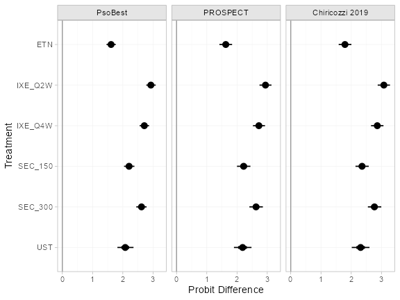

```{r, code=readLines("children/knitr_setup.R"), include=FALSE}
```

```{r setup}
library(multinma)
library(dplyr)      # dplyr and tidyr for data manipulation
library(tidyr)
library(ggplot2)    # ggplot2 for plotting covariate distributions
```
```{r, eval = FALSE}
options(mc.cores = parallel::detectCores())
```
```{r, echo = FALSE}
nc <- switch(tolower(Sys.getenv("_R_CHECK_LIMIT_CORES_")), 
             "true" =, "warn" = 2, 
             parallel::detectCores())
options(mc.cores = nc)
```

Simulated individual patient data (IPD) from trials comparing treatments for plaque psoriasis are found in the data set `plaque_psoriasis_ipd`.
Aggregate data (AgD) are available on a further set of trials, found in the data set `plaque_psoriasis_agd`.
In this vignette, we recreate the multilevel network meta-regression (ML-NMR) analyses performed by @methods_paper and @Phillippo2022 [see also @Phillippo_thesis].

In the [first analysis](#initial_analysis) [@methods_paper], we consider a network of four studies with a binary outcome (success/failure to achieve a 75% reduction on the psoriasis area and severity index, PASI 75).

In the [second analysis](#extended_analysis) [@Phillippo2022], we extend this network with a further five studies and demonstrate how the key assumptions of population adjustment can be assessed in this larger network.
We also demonstrate how to produce estimates for three external target populations, and fit a multinomial model to incorporate ordered categorical outcomes (PASI 75, PASI 90, and PASI 100).

# Initial analysis {#initial_analysis}
We start by recreating the analysis presented by @methods_paper.
We will analyse IPD from three studies, UNCOVER-1, UNCOVER-2, and UNCOVER-3 [@Griffiths2015;@Gordon2016], and AgD from one study, FIXTURE [@Langley2014].

```{r}
pso_ipd <- filter(plaque_psoriasis_ipd,
                  studyc %in% c("UNCOVER-1", "UNCOVER-2", "UNCOVER-3"))

pso_agd <- filter(plaque_psoriasis_agd,
                  studyc == "FIXTURE")

head(pso_ipd)
head(pso_agd)
```

We consider running a ML-NMR adjusting for five potential effect-modifying covariates: duration of psoriasis `durnpso`, weight `weight`, previous systemic treatment `prevsys`, body surface area `bsa`, and psoriatic arthritis `psa`.

## Setup
### Preparing the data
We need to prepare the data so that it is in an acceptable format to run a ML-NMR model.
Firstly, we need to handle the binary covariates `prevsys` and `psa`.
In the IPD, these are coded as `TRUE` or `FALSE`, but in the AgD these are coded as percentages (out of 100).
We need these to transform both of these sets of variables so that they are numeric and lie in the interval $[0,1]$, so that the variables are compatible across the data sources.
Whilst we are here, we also transform body surface area `bsa` (a percentage) to lie in $[0,1]$, since that will make specifying an appropriate marginal distribution easier later, and rescale `weight` and `duration` to aid interpretation of the regression coefficients (in terms of 10 kilos and 10 years respectively).
We also add in a `trtclass` variable, indicating which treatments belong to which classes.
Finally, we check for missing values in the IPD.
```{r}
pso_ipd <- pso_ipd %>% 
  mutate(# Variable transformations
         bsa = bsa / 100,
         prevsys = as.numeric(prevsys),
         psa = as.numeric(psa),
         weight = weight / 10,
         durnpso = durnpso / 10,
         # Treatment classes
         trtclass = case_when(trtn == 1 ~ "Placebo",
                              trtn %in% c(2, 3, 5, 6) ~ "IL blocker",
                              trtn == 4 ~ "TNFa blocker"),
         # Check complete cases for covariates of interest
         complete = complete.cases(durnpso, prevsys, bsa, weight, psa)
  )

pso_agd <- pso_agd %>% 
  mutate(
    # Variable transformations
    bsa_mean = bsa_mean / 100,
    bsa_sd = bsa_sd / 100,
    prevsys = prevsys / 100,
    psa = psa / 100,
    weight_mean = weight_mean / 10,
    weight_sd = weight_sd / 10,
    durnpso_mean = durnpso_mean / 10,
    durnpso_sd = durnpso_sd / 10,
    # Treatment classes
    trtclass = case_when(trtn == 1 ~ "Placebo",
                              trtn %in% c(2, 3, 5, 6) ~ "IL blocker",
                              trtn == 4 ~ "TNFa blocker")
  )
```

A small number of individuals have missing covariates:
```{r}
sum(!pso_ipd$complete)
mean(!pso_ipd$complete)
```

Since the proportion of missing data is so small, we will simply exclude these individuals from the analysis.
```{r}
pso_ipd <- filter(pso_ipd, complete)
```

### Creating the network
Set up the network, setting the IPD with `set_ipd()`, AgD (arm-based) with `set_agd_arm()`, and combining together using `combine_network()`.
We specify the binary `pasi75` outcome as `r` in the IPD, and the count outcome `pasi75_r` and denominator `pasi75_n` as `r` and `n` in the AgD.
We specify the treatment classes with `trt_class = trtclass`.
```{r}
pso_net <- combine_network(
  set_ipd(pso_ipd, 
          study = studyc, 
          trt = trtc, 
          r = pasi75,
          trt_class = trtclass),
  set_agd_arm(pso_agd, 
              study = studyc, 
              trt = trtc, 
              r = pasi75_r, 
              n = pasi75_n,
              trt_class = trtclass)
)

pso_net
```

We can produce a network plot with the `plot()` method:
```{r pso_network_plot, fig.width=8, fig.height=6}
plot(pso_net, weight_nodes = TRUE, weight_edges = TRUE, show_trt_class = TRUE) + 
  ggplot2::theme(legend.position = "bottom", legend.box = "vertical")
```

### Numerical integration for ML-NMR
ML-NMR models define the meta-regression model at the individual level, in exactly the same manner as a full-IPD meta-regression.
ML-NMR then incorporates the AgD into the model by integrating this individual-level model over the covariate distribution in each AgD study [@methods_paper;@Phillippo_thesis].
Using integration, instead of simply "plugging-in" mean covariate values for the AgD studies, avoids aggregation bias when the link function is not the identity function.

This package utilises numerical integration to incorporate the aggregate data - specifically, quasi-Monte Carlo (QMC) integration with a Gaussian copula [@methods_paper;@Phillippo_thesis].
QMC integration is a very general and flexible integration approach, which typically requires far fewer integration points than standard (pseudo-random) Monte-Carlo integration to achieve the same numerical accuracy.^[The convergence rate of QMC is typically $\mathcal{O}(1/n)$, whereas the expected convergence rate of standard MC is $\mathcal{O}(1/n^\frac{1}{2})$ [@Caflisch1998;@Niederreiter1978].]
A Gaussian copula allows us to account for correlations between covariates, which may have any specified marginal distributions.

We now set up the numerical integration for the network.
The five covariates that we will consider adjusting for are body surface area `bsa`, duration of psoriasis `durnpso`, previous systemic treatment `prevsys`, psoriatic arthritis `psa`, and weight `weight`.
We need to choose suitable marginal distributions for these covariates to draw the integration points from.
`prevsys` and `psa` are binary covariates, so these are given a Bernoulli distribution.
`bsa` is a percentage, so we choose a logit-Normal distribution (note, this requires the `logitnorm` package to be installed).
We choose Gamma distributions for `durnpso` and `weight` to account for skewness.
These choices seem to match well the marginal distributions observed in the IPD:
```{r pso_covariate_plot}
# Get mean and sd of covariates in each study
ipd_summary <- pso_ipd %>% 
  group_by(studyc) %>% 
  summarise_at(vars(weight, durnpso, bsa), list(mean = mean, sd = sd, min = min, max = max)) %>% 
  pivot_longer(weight_mean:bsa_max, names_sep = "_", names_to = c("covariate", ".value")) %>% 
  # Assign distributions
  mutate(dist = recode(covariate,
                       bsa = "dlogitnorm",
                       durnpso = "dgamma",
                       weight = "dgamma")) %>% 
  # Compute density curves
  group_by(studyc, covariate) %>% 
  mutate(value = if_else(dist == "dlogitnorm",
                         list(seq(0, 1, length.out = 101)),
                         list(seq(min*0.8, max*1.2, length.out = 101)))) %>% 
  unnest(cols = value) %>% 
  mutate(dens = eval(call(first(dist), x = value, mean = first(mean), sd = first(sd))))

# Plot histograms and assumed densities
pso_ipd %>% 
  pivot_longer(c(weight, durnpso, bsa), names_to = "covariate", values_to = "value") %>% 
ggplot(aes(x = value)) +
  geom_histogram(aes(y = after_stat(density)), 
                 binwidth = function(x) diff(range(x)) / nclass.Sturges(x),
                 boundary = 0,
                 fill = "grey50") +
  geom_line(aes(y = dens), data = ipd_summary,
            colour = "darkred", linewidth = 0.5) +
  facet_wrap(~studyc + covariate, scales = "free", ncol = 3) +
  theme_multinma()
```

We add integration points to the AgD studies in the network using the `add_integration()` function.
Marginal distributions for each covariate are specified using the `distr()` function, which takes a cumulative distribution function corresponding to the chosen marginal distribution, and arguments to that distribution as column names in the aggregate data.
Since we do not know the correlations between covariates in the AgD studies, we impute these with the weighted mean of the correlations in the IPD studies (the default option).
```{r}
pso_net <- add_integration(pso_net,
  durnpso = distr(qgamma, mean = durnpso_mean, sd = durnpso_sd),
  prevsys = distr(qbern, prob = prevsys),
  bsa = distr(qlogitnorm, mean = bsa_mean, sd = bsa_sd),
  weight = distr(qgamma, mean = weight_mean, sd = weight_sd),
  psa = distr(qbern, prob = psa),
  n_int = 64
)
```

> **Note:** This package provides several convenience functions for specifying these distributions, including `qgamma()` which allows for a parameterisation of the Gamma distribution in terms of mean and standard deviation, `qbern()` which provides the Bernoulli distribution, and `qlogitnorm()` which provides the logit-Normal distribution allowing for a parameterisation in terms of mean and standard deviation (requires the `logitnorm` package to be installed).

## ML-NMR models
We fit both fixed effect (FE) and random effects (RE) ML-NMR models.

### Fixed effect ML-NMR
First, we fit a FE ML-NMR model using the function `nma()`.
Following [@methods_paper] we specify weakly-informative $N(0, 10^2)$ priors on each parameter.
The range of parameter values implied by these prior distributions can be checked using the `summary()` method:
```{r}
summary(normal(scale = 10))
```

The regression model is specified with `regression = ~(durnpso + prevsys + bsa + weight + psa)*.trt`, which will include the main (prognostic) effects of each covariate as well as interactions with treatment.
We use a probit link function (`link = "probit"`), and specify that the two-parameter Binomial approximation for the aggregate-level likelihood should be used (`likelihood = "bernoulli2"`, where "bernoulli" refers to the individual-level likelihood, and "2" denotes the two-parameter adjustment to the aggregate-level likelihood) [@methods_paper].
We utilise the shared effect modifier assumption to help identify the model, setting treatment-covariate interactions to be equal within each class (`class_interactions = "common"`).
We narrow the possible range for random initial values with `init_r = 0.1` (the default is `init_r = 2`), since probit models in particular are often hard to initialise.
Using the QR decomposition (`QR = TRUE`) greatly improves sampling efficiency here, as is often the case for regression models.
```{r}
pso_fit_FE <- nma(pso_net, 
                  trt_effects = "fixed",
                  link = "probit", 
                  likelihood = "bernoulli2",
                  regression = ~(durnpso + prevsys + bsa + weight + psa)*.trt,
                  class_interactions = "common",
                  prior_intercept = normal(scale = 10),
                  prior_trt = normal(scale = 10),
                  prior_reg = normal(scale = 10),
                  init_r = 0.1,
                  QR = TRUE)
```

Basic parameter summaries are given by the `print()` method:
```{r}
print(pso_fit_FE)
```

By default, summaries of the study-specific intercepts $\mu_j$ are hidden, but could be examined by changing the `pars` argument:
```{r, eval=FALSE}
# Not run
print(pso_fit_FE, pars = c("d", "beta", "mu"))
```

The prior and posterior distributions can be compared visually using the `plot_prior_posterior()` function:
```{r pso_FE_pp_plot, fig.width=8, fig.height=6}
plot_prior_posterior(pso_fit_FE, prior = c("intercept", "trt", "reg"))
```

We now recommend assessing sufficient accuracy of the numerical integration by running half of the chains with `n_int / 2` integration points and half with the full `n_int`.
Any `Rhat` or `n_eff` diagnostic warnings can then either be attributed to insufficient MCMC iterations (argument `iter` in `nma()`) or to insufficient integration points (`n_int` in `add_integration()`), depending on whether they occur within the two groups of chains or for all chains combined.
This feature is enabled by default (`int_check = TRUE`).
In this case, there are no warnings and so we are content with both the number of iterations and with the number of integration points.

(@methods_paper used an alternative approach based on saving cumulative integration points and plotting the empirical integration error, which can be achieved by setting `int_thin` in `nma()` and using the `plot_integration_error()` function.)

### Random effects ML-NMR
We now fit a RE model.
Again, we specify weakly-informative $N(0, 10^2)$ priors on each parameter, and now specify a $\textrm{half-N}(0, 2.5^2)$ prior for the heterogeneity standard deviation $\tau$.
The range of parameter values implied by these prior distributions can be checked using the `summary()` method:
```{r}
summary(normal(scale = 10))
summary(half_normal(scale = 2.5))
```

Fitting the model uses the same call to `nma()` as before, except now with `trt_effects = "random"`.
```{r, eval=!params$run_tests}
pso_fit_RE <- nma(pso_net, 
                  trt_effects = "random",
                  link = "probit", 
                  likelihood = "bernoulli2",
                  regression = ~(durnpso + prevsys + bsa + weight + psa)*.trt,
                  class_interactions = "common",
                  prior_intercept = normal(scale = 10),
                  prior_trt = normal(scale = 10),
                  prior_reg = normal(scale = 10),
                  prior_het = half_normal(scale = 2.5),
                  init_r = 0.1,
                  QR = TRUE)
```

Basic parameter summaries are given by the `print()` method:
```{r, eval=!params$run_tests}
print(pso_fit_RE)
```

By default, summaries of the study-specific intercepts $\mu_j$ and study-specific relative effects $\delta_{jk}$ are hidden, but could be examined by changing the `pars` argument:
```{r, eval=FALSE}
# Not run
print(pso_fit_RE, pars = c("d", "beta", "tau", "mu", "delta"))
```

There are a number of divergent transitions, which we can investigate using the `pairs()` method:
```{r pso_RE_pairs, eval=!params$run_tests}
pairs(pso_fit_RE, pars = c("delta[UNCOVER-2: ETN]", "d[ETN]", "tau", "lp__"))
```

The divergent transition errors (red crosses) seem to be concentrated in the upper tail of the heterogeneity standard deviation parameter.
This suggests that the information to identify the heterogeneity parameter is weak - we have only four studies in the network - and that a more informative prior distribution might aid estimation.

The prior and posterior distributions can be compared visually using the `plot_prior_posterior()` function:
```{r pso_RE_pp_plot, eval=!params$run_tests, fig.width=8, fig.height=6}
plot_prior_posterior(pso_fit_RE, prior = c("intercept", "trt", "reg", "het"))
```

## Model comparison
The model fit under the FE and RE models can be checked using the `dic()` function.
```{r, eval=!params$run_tests}
(pso_dic_FE <- dic(pso_fit_FE))
(pso_dic_RE <- dic(pso_fit_RE))
```
```{r, eval=params$run_tests, echo=FALSE}
(pso_dic_FE <- dic(pso_fit_FE))
```

The DIC is similar between the FE and RE models, suggesting that there is little evidence for any residual heterogeneity.

## Producing relative effects and event probabilities
Parameter estimates can be plotted using the `plot()` method, for example to examine the estimated regression coefficients:
```{r}
plot(pso_fit_FE,
     pars = "beta",
     stat = "halfeye",
     ref_line = 0)
```

Plots of posterior summaries are based on the `ggdist` package, which allows a great degree of flexibility, and can be further customised using `ggplot2` commands. 
In the above command we specify a `"halfeye"` plot, which shows the posterior density along with posterior medians (points) and 95% Credible Intervals (thin line) with 66% inner bands (thicker line) by default.
For more details on the plotting options see `?plot.nma_summary`.

We can produce population-adjusted relative effects for each study population in the network using the `relative_effects()` function.
```{r pso_releff_FE}
(pso_releff_FE <- relative_effects(pso_fit_FE))
plot(pso_releff_FE, ref_line = 0)
```

Predicted probabilities of achieving PASI 75 in each study population on each treatment are produced using the `predict()` method.
The argument `type = "reponse"` specifies that we want predicted probabilities, rather than probit probabilities.
```{r pso_pred_FE}
(pso_pred_FE <- predict(pso_fit_FE, type = "response"))
plot(pso_pred_FE, ref_line = c(0, 1))
```

We can produce population-adjusted ranks, rank probabilities, and cumulative rank probabilities in each study population using the `posterior_ranks()` and `posterior_rank_probs()` functions (although here the ranks are unchanged between populations, as the distributions of effect modifiers are similar).
We specify `lower_better = FALSE`, since a higher outcome is better (higher chance of achieving PASI 75).
```{r pso_ranks_FE}
(pso_ranks_FE <- posterior_ranks(pso_fit_FE, lower_better = FALSE))
plot(pso_ranks_FE)
```

```{r pso_rankprobs_FE}
(pso_rankprobs_FE <- posterior_rank_probs(pso_fit_FE, lower_better = FALSE))
plot(pso_rankprobs_FE)
```

```{r pso_cumrankprobs_FE}
(pso_cumrankprobs_FE <- posterior_rank_probs(pso_fit_FE, lower_better = FALSE, cumulative = TRUE))
plot(pso_cumrankprobs_FE)
```

All of the above estimates (relative effects, predictions, rankings) can also be produced for a specific target population or populations by providing a suitable `newdata` argument to for function (and a `baseline` distribution for `predict()`).

To produce population-adjusted relative effects (and corresponding rankings) for a chosen target population, we require only the mean covariate values in that population.
For example, `newdata` could provide the following mean covariate values:
```{r}
new_agd_means <- tibble(
  bsa = 0.6,
  prevsys = 0.1,
  psa = 0.2,
  weight = 10,
  durnpso = 3)
```

Population-adjusted relative effects in this target population are then calculated using the `relative_effects()` function, and can be plotted with the corresponding `plot()` method:
```{r pso_releff_FE_new}
(pso_releff_FE_new <- relative_effects(pso_fit_FE, newdata = new_agd_means))
plot(pso_releff_FE_new, ref_line = 0)
```

For absolute predictions, we require information about the full covariate distribution in the target population, not just the mean values.
If IPD are available for the target population, `newdata` is simply a data frame of the IPD.
If AgD are available for the target population, `newdata` must be a data frame with added integration points created using the `add_integration()` function.
 
For example, suppose the aggregate target population introduced above had the following covariate means and standard deviations (for continuous covariates) or proportions (for discrete covariates):
```{r}
new_agd_int <- tibble(
  bsa_mean = 0.6,
  bsa_sd = 0.3,
  prevsys = 0.1,
  psa = 0.2,
  weight_mean = 10,
  weight_sd = 1,
  durnpso_mean = 3,
  durnpso_sd = 1
)
```

We add integration points to this data frame in a similar manner to before.
Again, we need to supply a correlation matrix for the joint covariate distribution; we use the same weighted mean correlation matrix computed earlier from the IPD in the network, which is stored in the network object as `int_cor`.
```{r}
new_agd_int <- add_integration(new_agd_int,
  durnpso = distr(qgamma, mean = durnpso_mean, sd = durnpso_sd),
  prevsys = distr(qbern, prob = prevsys),
  bsa = distr(qlogitnorm, mean = bsa_mean, sd = bsa_sd),
  weight = distr(qgamma, mean = weight_mean, sd = weight_sd),
  psa = distr(qbern, prob = psa),
  cor = pso_net$int_cor,
  n_int = 64)
```

Predicted probabilities of achieving PASI 75 in this target population, given a $N(-1.75, 0.08^2)$ distribution on the baseline probit-probability of response on Placebo (at the reference levels of the covariates), are then produced using the `predict()` method:
```{r pso_pred_FE_new}
(pso_pred_FE_new <- predict(pso_fit_FE, 
                            type = "response",
                            newdata = new_agd_int,
                            baseline = distr(qnorm, -1.75, 0.08)))
plot(pso_pred_FE_new, ref_line = c(0, 1))
```

# Extended analysis {#extended_analysis}
We now extend the network to include a further five studies (four AgD and one IPD), recreating the analysis of @Phillippo2022.
This larger network allows us to assess the key assumptions underlying population adjustment.

## Setup
### Preparing the data
We begin, as before, with some data transformations for each of the covariates and set up a treatment class variable `trtclass`.

```{r, eval=!params$run_tests}
# IPD studies
pso_ipd <- plaque_psoriasis_ipd %>% 
  mutate(
    # Variable transformations
    bsa = bsa / 100,
    weight = weight / 10,
    durnpso = durnpso / 10,
    prevsys = as.numeric(prevsys),
    psa = as.numeric(psa),
    # Treatment classes
    trtclass = case_when(trtn == 1 ~ "Placebo",
                         trtn %in% c(2, 3, 5, 6) ~ "IL-17 blocker",
                         trtn == 4 ~ "TNFa blocker",
                         trtn == 7 ~ "IL-12/23 blocker"),
    # Check complete cases for covariates of interest
    is_complete = complete.cases(durnpso, prevsys, bsa, weight, psa)
  ) %>% 
  arrange(studyc, trtn)

# AgD studies
pso_agd <- plaque_psoriasis_agd %>% 
  mutate(
    # Variable transformations
    bsa_mean = bsa_mean / 100, 
    bsa_sd = bsa_sd / 100,
    weight_mean = weight_mean / 10,
    weight_sd = weight_sd / 10,
    durnpso_mean = durnpso_mean / 10,
    durnpso_sd = durnpso_sd / 10,
    prevsys = prevsys / 100,
    psa = psa / 100,
    # Treatment classes
    trtclass = case_when(trtn == 1 ~ "Placebo",
                         trtn %in% c(2, 3, 5, 6) ~ "IL-17 blocker",
                         trtn == 4 ~ "TNFa blocker",
                         trtn == 7 ~ "IL-12/23 blocker")
    ) %>% 
  arrange(studyc, trtn)
```

There are a very small number of individuals with missing values in the IPD, which we simply exclude from the analysis.

```{r, eval=!params$run_tests}
pso_ipd %>% 
  group_by(studyc) %>% 
  summarise(n_total = n(),
            n_missing = sum(!is_complete), 
            pct_missing = mean(!is_complete) * 100)

pso_ipd <- filter(pso_ipd, is_complete)
```

### Creating the network
Next we set up the network.
We set the IPD with `set_ipd()` and AgD (arm-based) with `set_agd_arm()`, and combine these together using `combine_network()`.
We specify an ordered categorical (multinomial) outcome using the `multi()` helper function.
The outcome data are in "inclusive" format, i.e. the lowest category is the sample size (or 1 for IPD), the second category counts those achieving PASI 75 *or greater* ($\ge 75\%$ reduction in symptoms), the third counts those achieving PASI 90 *or greater* ($\ge 90\%$ reduction), and the final category counts those achieving PASI 100 ($100\%$ reduction).^[The alternative is "exclusive" format, where the lowest category counts those not achieving any higher outcomes (i.e. failure to achieve PASI 75, $<75\%$ reduction in symptoms), the second counts those achieving PASI 75 *but not PASI 90 or 100* ($\ge 75\%$ and $<90\%$ reduction), the third counts those achieving PASI 90 *but not PASI 100* ($\ge 90\%$ and $<100\%$ reduction), and the final category counts those achieving PASI 100 ($100\%$ reduction).]
We specify the treatment classes with `trt_class = trtclass`.

```{r, eval=!params$run_tests}
pso_net <- combine_network(
  set_ipd(pso_ipd,
    study = studyc,
    trt = trtc,
    r = multi(r0 = 1, 
              PASI75 = pasi75,
              PASI90 = pasi90,
              PASI100 = pasi100,
              type = "ordered", inclusive = TRUE),
    trt_class = trtclass),
  set_agd_arm(pso_agd,
    study = studyc,
    trt = trtc,
    r = multi(r0 = pasi75_n, 
              PASI75 = pasi75_r,
              PASI90 = pasi90_r,
              PASI100 = pasi100_r,
              type = "ordered", inclusive = TRUE),
    trt_class = trtclass)
)

pso_net
```

We create a network plot using the `plot()` function applied to the `pso_net` network object, choosing to scale the edges and nodes by the number of studies/sample size (`weight_edges` and `weight_nodes = TRUE`), colour the treatment nodes by class (`show_trt_class = TRUE`), and nudge the treatment names away from the nodes (`nudge = 0.1`). 
We further customise the plot using ggplot syntax to alter the colour scheme.

```{r pso-full-network, eval=!params$run_tests, fig.width=8, fig.height=6}
class_pal <- c("#D95F02", "#7570B3", "#E7298A", "#E6AB02")

plot(pso_net, weight_nodes = TRUE, weight_edges = TRUE, show_trt_class = TRUE, nudge = 0.1) +
  ggraph::scale_edge_colour_manual("Data", 
                                   values = c(AgD = "#113259", IPD = "#55A480"),
                                   guide = guide_legend(override.aes = list(edge_width = 2))) +
  scale_fill_manual("Treatment class", 
                    values = class_pal,
                    aesthetics = c("fill", "colour"),
                    guide = guide_legend(override.aes = list(size = 2)))
```

### Numerical integration for ML-NMR models
We add integration points to the AgD studies in the network using the `add_integration()` function, specifying the chosen marginal distribution for each covariate using the `distr()` function.
As before, we specify Gamma distributions for weight and duration of psoriasis, a logit-Normal distribution for body surface area, and Bernoulli distributions for previous systemic treatment and psoriatic arthritis as binary covariates.
Since we do not know the correlations between covariates in the AgD studies, we once again impute these with the weighted mean of the correlations in the IPD studies (the default option).

```{r, eval=!params$run_tests}
pso_net <- add_integration(pso_net,
  durnpso = distr(qgamma, mean = durnpso_mean, sd = durnpso_sd),
  prevsys = distr(qbern, prob = prevsys),
  bsa = distr(qlogitnorm, mean = bsa_mean, sd = bsa_sd),
  weight = distr(qgamma, mean = weight_mean, sd = weight_sd),
  psa = distr(qbern, prob = psa),
  n_int = 64)
```

## ML-NMR model
Using the `nma()` function, we fit a (fixed effect) ML-NMR model which includes main effects (prognostic terms) and covariate-treatment interactions (effect-modifying terms) for each of the five covariates.
Ideally, we would fit independent interaction terms for each treatment; however, this requires either IPD or several AgD studies at a range of covariate values on each treatment.
The data here are insufficient to fit independent interaction terms for each treatment, so we make the shared effect modifier assumption within each class of treatments [@TSD18] and specify common interaction terms within each treatment class (`class_interactions = "common"`).
As before, we specify $\mathrm{N}(0, 10^2)$ prior distributions on the study-specific intercepts, treatment effects, and regression parameters.
However, since we now have an ordered multinomial likelihood we also need to specify priors for the differences between the latent cutoffs for each outcome category; we choose an improper flat prior $\mathrm{U}(-\infty,\infty)$ which will automatically be truncated to meet the ordering constraints (`prior_aux = flat()`).

```{r, eval=!params$run_tests && params$eval_multinomial}
pso_fit_FE <- nma(pso_net, 
                  trt_effects = "fixed",
                  link = "probit", 
                  regression = ~(durnpso + prevsys + bsa + weight + psa)*.trt,
                  class_interactions = "common",
                  prior_intercept = normal(scale = 10),
                  prior_trt = normal(scale = 10),
                  prior_reg = normal(scale = 10),
                  prior_aux = flat(),
                  QR = TRUE,
                  init_r = 0.5)
```
```r
#> Note: Setting "PBO" as the network reference treatment.
```
```{r, eval=!params$run_tests && params$eval_multinomial}
pso_fit_FE
```
```r
#> A fixed effects ML-NMR with a ordered likelihood (probit link).
#> Regression model: ~(durnpso + prevsys + bsa + weight + psa) * .trt.
#> Centred covariates at the following overall mean values:
#>   durnpso   prevsys       bsa    weight       psa 
#> 1.8159830 0.6576489 0.2987820 8.9097263 0.2104826 
#> Inference for Stan model: ordered_multinomial.
#> 4 chains, each with iter=2000; warmup=1000; thin=1; 
#> post-warmup draws per chain=1000, total post-warmup draws=4000.
#> 
#>                                             mean se_mean   sd     2.5%      25%      50%      75%
#> beta[durnpso]                               0.03    0.00 0.06    -0.08    -0.01     0.03     0.08
#> beta[prevsys]                              -0.17    0.00 0.16    -0.49    -0.28    -0.17    -0.06
#> beta[bsa]                                  -0.10    0.01 0.45    -1.01    -0.40    -0.08     0.21
#> beta[weight]                                0.04    0.00 0.03    -0.01     0.02     0.04     0.06
#> beta[psa]                                  -0.08    0.00 0.17    -0.42    -0.20    -0.08     0.03
#> beta[durnpso:.trtclassTNFa blocker]        -0.02    0.00 0.07    -0.16    -0.07    -0.02     0.03
#> beta[durnpso:.trtclassIL-12/23 blocker]    -0.06    0.00 0.10    -0.26    -0.13    -0.07     0.00
#> beta[durnpso:.trtclassIL-17 blocker]       -0.02    0.00 0.06    -0.14    -0.07    -0.02     0.02
#> beta[prevsys:.trtclassTNFa blocker]         0.19    0.00 0.19    -0.18     0.07     0.19     0.32
#> beta[prevsys:.trtclassIL-12/23 blocker]     0.45    0.01 0.34    -0.24     0.24     0.47     0.68
#> beta[prevsys:.trtclassIL-17 blocker]        0.16    0.00 0.17    -0.17     0.05     0.16     0.28
#> beta[bsa:.trtclassTNFa blocker]             0.24    0.01 0.51    -0.73    -0.11     0.22     0.57
#> beta[bsa:.trtclassIL-12/23 blocker]         0.61    0.01 0.68    -0.71     0.14     0.61     1.07
#> beta[bsa:.trtclassIL-17 blocker]            0.27    0.01 0.47    -0.63    -0.06     0.26     0.58
#> beta[weight:.trtclassTNFa blocker]         -0.16    0.00 0.03    -0.23    -0.18    -0.16    -0.14
#> beta[weight:.trtclassIL-12/23 blocker]     -0.09    0.00 0.05    -0.18    -0.12    -0.09    -0.06
#> beta[weight:.trtclassIL-17 blocker]        -0.13    0.00 0.03    -0.19    -0.15    -0.13    -0.11
#> beta[psa:.trtclassTNFa blocker]            -0.05    0.00 0.20    -0.43    -0.18    -0.04     0.08
#> beta[psa:.trtclassIL-12/23 blocker]         0.12    0.01 0.33    -0.51    -0.11     0.12     0.36
#> beta[psa:.trtclassIL-17 blocker]            0.10    0.00 0.18    -0.24    -0.02     0.10     0.21
#> d[ETN]                                      1.58    0.00 0.07     1.44     1.53     1.58     1.63
#> d[IXE_Q2W]                                  2.91    0.00 0.07     2.76     2.86     2.91     2.96
#> d[IXE_Q4W]                                  2.69    0.00 0.08     2.54     2.64     2.69     2.74
#> d[SEC_150]                                  2.19    0.00 0.08     2.03     2.13     2.19     2.24
#> d[SEC_300]                                  2.60    0.00 0.08     2.45     2.54     2.60     2.65
#> d[UST]                                      2.13    0.00 0.11     1.91     2.06     2.13     2.20
#> lp__                                    -7640.27    0.11 4.31 -7649.63 -7642.96 -7639.97 -7637.16
#> cc[PASI75]                                  0.00     NaN 0.00     0.00     0.00     0.00     0.00
#> cc[PASI90]                                  0.69    0.00 0.02     0.65     0.68     0.69     0.70
#> cc[PASI100]                                 1.53    0.00 0.02     1.49     1.52     1.53     1.55
#>                                            97.5% n_eff Rhat
#> beta[durnpso]                               0.15  2512    1
#> beta[prevsys]                               0.14  2701    1
#> beta[bsa]                                   0.77  2254    1
#> beta[weight]                                0.10  2331    1
#> beta[psa]                                   0.24  3019    1
#> beta[durnpso:.trtclassTNFa blocker]         0.12  2678    1
#> beta[durnpso:.trtclassIL-12/23 blocker]     0.14  3490    1
#> beta[durnpso:.trtclassIL-17 blocker]        0.10  2899    1
#> beta[prevsys:.trtclassTNFa blocker]         0.55  2824    1
#> beta[prevsys:.trtclassIL-12/23 blocker]     1.11  4293    1
#> beta[prevsys:.trtclassIL-17 blocker]        0.48  3128    1
#> beta[bsa:.trtclassTNFa blocker]             1.27  2433    1
#> beta[bsa:.trtclassIL-12/23 blocker]         1.93  2921    1
#> beta[bsa:.trtclassIL-17 blocker]            1.25  2728    1
#> beta[weight:.trtclassTNFa blocker]         -0.10  2590    1
#> beta[weight:.trtclassIL-12/23 blocker]      0.01  3473    1
#> beta[weight:.trtclassIL-17 blocker]        -0.07  2731    1
#> beta[psa:.trtclassTNFa blocker]             0.33  2990    1
#> beta[psa:.trtclassIL-12/23 blocker]         0.77  3967    1
#> beta[psa:.trtclassIL-17 blocker]            0.46  3516    1
#> d[ETN]                                      1.72  1969    1
#> d[IXE_Q2W]                                  3.06  2104    1
#> d[IXE_Q4W]                                  2.84  2327    1
#> d[SEC_150]                                  2.36  2267    1
#> d[SEC_300]                                  2.76  2396    1
#> d[UST]                                      2.34  3215    1
#> lp__                                    -7632.94  1664    1
#> cc[PASI75]                                  0.00   NaN  NaN
#> cc[PASI90]                                  0.72  3323    1
#> cc[PASI100]                                 1.58  2862    1
#> 
#> Samples were drawn using NUTS(diag_e) at Sun Aug 28 12:56:36 2022.
#> For each parameter, n_eff is a crude measure of effective sample size,
#> and Rhat is the potential scale reduction factor on split chains (at 
#> convergence, Rhat=1).
```

## Assessing assumptions
In the first analysis, the small network made assessing assumptions difficult.
With this larger network (although still only nine studies) we have greater opportunity to assess the key assumptions.

The key assumption made by ML-NMR (and indeed all population adjustment methods in connected networks) is the conditional constancy of relative effects assumption [@TSD18].
This means that there are no unobserved effect modifiers, so that the relative effects are constant given the included effect-modifying covariates.
This assumption implies that there is no residual heterogeneity or inconsistency, which can be assessed using standard network meta-analysis techniques.
We assess residual heterogeneity using a random effects model, and residual inconsistency using an unrelated mean effects (UME) model.

### Assessing residual heterogeneity with a random effects ML-NMR
First, we fit a random effects model to assess residual heterogeneity.
The call to the `nma()` function is identical to the fixed effect model above, except that now we specify `trt_effects = "random"` and need to provide a prior for the between-study heterogeneity (we choose a $\textrm{half-N}(0, 2.5^2)$ prior with `prior_het = half_normal(scale = 2.5)`.

```{r, eval=!params$run_tests && params$eval_multinomial}
pso_fit_RE <- nma(pso_net, 
                  trt_effects = "random",
                  link = "probit", 
                  regression = ~(durnpso + prevsys + bsa + weight + psa)*.trt,
                  class_interactions = "common",
                  prior_intercept = normal(scale = 10),
                  prior_trt = normal(scale = 10),
                  prior_reg = normal(scale = 10),
                  prior_aux = flat(),
                  prior_het = half_normal(scale = 2.5),
                  QR = TRUE,
                  init_r = 0.5)
```
```r
#> Note: Setting "PBO" as the network reference treatment.
#> Warning: There were 1 divergent transitions after warmup. See
#> https://mc-stan.org/misc/warnings.html#divergent-transitions-after-warmup
#> to find out why this is a problem and how to eliminate them.
#> Warning: Examine the pairs() plot to diagnose sampling problems
```
```{r, eval=!params$run_tests && params$eval_multinomial}
pso_fit_RE
```
```r
#> A random effects ML-NMR with a ordered likelihood (probit link).
#> Regression model: ~(durnpso + prevsys + bsa + weight + psa) * .trt.
#> Centred covariates at the following overall mean values:
#>   durnpso   prevsys       bsa    weight       psa 
#> 1.8159830 0.6576489 0.2987820 8.9097263 0.2104826 
#> Inference for Stan model: ordered_multinomial.
#> 4 chains, each with iter=2000; warmup=1000; thin=1; 
#> post-warmup draws per chain=1000, total post-warmup draws=4000.
#> 
#>                                             mean se_mean   sd     2.5%      25%      50%      75%
#> beta[durnpso]                               0.04    0.00 0.06    -0.08    -0.01     0.04     0.08
#> beta[prevsys]                              -0.16    0.00 0.16    -0.46    -0.26    -0.15    -0.06
#> beta[bsa]                                  -0.14    0.01 0.46    -1.09    -0.45    -0.13     0.17
#> beta[weight]                                0.05    0.00 0.03    -0.01     0.03     0.05     0.07
#> beta[psa]                                  -0.07    0.00 0.17    -0.40    -0.18    -0.06     0.04
#> beta[durnpso:.trtclassTNFa blocker]        -0.02    0.00 0.07    -0.17    -0.07    -0.02     0.03
#> beta[durnpso:.trtclassIL-12/23 blocker]    -0.07    0.00 0.10    -0.27    -0.14    -0.07     0.01
#> beta[durnpso:.trtclassIL-17 blocker]       -0.03    0.00 0.06    -0.15    -0.07    -0.02     0.02
#> beta[prevsys:.trtclassTNFa blocker]         0.19    0.00 0.18    -0.17     0.07     0.19     0.31
#> beta[prevsys:.trtclassIL-12/23 blocker]     0.43    0.00 0.35    -0.27     0.20     0.44     0.67
#> beta[prevsys:.trtclassIL-17 blocker]        0.15    0.00 0.16    -0.18     0.04     0.15     0.26
#> beta[bsa:.trtclassTNFa blocker]             0.27    0.01 0.53    -0.73    -0.08     0.25     0.61
#> beta[bsa:.trtclassIL-12/23 blocker]         0.66    0.01 0.66    -0.65     0.21     0.67     1.09
#> beta[bsa:.trtclassIL-17 blocker]            0.32    0.01 0.48    -0.58    -0.01     0.31     0.63
#> beta[weight:.trtclassTNFa blocker]         -0.16    0.00 0.03    -0.23    -0.19    -0.16    -0.14
#> beta[weight:.trtclassIL-12/23 blocker]     -0.09    0.00 0.05    -0.18    -0.12    -0.09    -0.06
#> beta[weight:.trtclassIL-17 blocker]        -0.13    0.00 0.03    -0.19    -0.15    -0.13    -0.11
#> beta[psa:.trtclassTNFa blocker]            -0.06    0.00 0.20    -0.46    -0.20    -0.06     0.07
#> beta[psa:.trtclassIL-12/23 blocker]         0.11    0.00 0.33    -0.53    -0.10     0.11     0.34
#> beta[psa:.trtclassIL-17 blocker]            0.08    0.00 0.18    -0.27    -0.04     0.08     0.20
#> d[ETN]                                      1.59    0.00 0.11     1.38     1.52     1.59     1.66
#> d[IXE_Q2W]                                  2.93    0.00 0.11     2.73     2.86     2.93     3.00
#> d[IXE_Q4W]                                  2.71    0.00 0.12     2.49     2.64     2.71     2.78
#> d[SEC_150]                                  2.21    0.00 0.12     1.99     2.13     2.21     2.28
#> d[SEC_300]                                  2.64    0.00 0.12     2.42     2.56     2.63     2.71
#> d[UST]                                      2.17    0.00 0.17     1.85     2.06     2.16     2.27
#> lp__                                    -7646.77    0.21 6.32 -7660.09 -7650.88 -7646.44 -7642.40
#> tau                                         0.13    0.00 0.07     0.02     0.09     0.13     0.17
#> cc[PASI75]                                  0.00     NaN 0.00     0.00     0.00     0.00     0.00
#> cc[PASI90]                                  0.69    0.00 0.02     0.66     0.68     0.69     0.70
#> cc[PASI100]                                 1.53    0.00 0.02     1.49     1.52     1.53     1.55
#>                                            97.5% n_eff Rhat
#> beta[durnpso]                               0.16  3817    1
#> beta[prevsys]                               0.16  4212    1
#> beta[bsa]                                   0.73  3325    1
#> beta[weight]                                0.10  3585    1
#> beta[psa]                                   0.27  4167    1
#> beta[durnpso:.trtclassTNFa blocker]         0.12  3797    1
#> beta[durnpso:.trtclassIL-12/23 blocker]     0.13  5280    1
#> beta[durnpso:.trtclassIL-17 blocker]        0.10  4181    1
#> beta[prevsys:.trtclassTNFa blocker]         0.54  4064    1
#> beta[prevsys:.trtclassIL-12/23 blocker]     1.06  5604    1
#> beta[prevsys:.trtclassIL-17 blocker]        0.46  4509    1
#> beta[bsa:.trtclassTNFa blocker]             1.31  3573    1
#> beta[bsa:.trtclassIL-12/23 blocker]         1.98  4347    1
#> beta[bsa:.trtclassIL-17 blocker]            1.29  3634    1
#> beta[weight:.trtclassTNFa blocker]         -0.10  3833    1
#> beta[weight:.trtclassIL-12/23 blocker]      0.00  5021    1
#> beta[weight:.trtclassIL-17 blocker]        -0.07  4493    1
#> beta[psa:.trtclassTNFa blocker]             0.35  4225    1
#> beta[psa:.trtclassIL-12/23 blocker]         0.75  6190    1
#> beta[psa:.trtclassIL-17 blocker]            0.43  4403    1
#> d[ETN]                                      1.81  2805    1
#> d[IXE_Q2W]                                  3.15  3031    1
#> d[IXE_Q4W]                                  2.95  2966    1
#> d[SEC_150]                                  2.47  2726    1
#> d[SEC_300]                                  2.88  2575    1
#> d[UST]                                      2.52  2667    1
#> lp__                                    -7635.39   899    1
#> tau                                         0.29   620    1
#> cc[PASI75]                                  0.00   NaN  NaN
#> cc[PASI90]                                  0.72  5665    1
#> cc[PASI100]                                 1.58  6212    1
#> 
#> Samples were drawn using NUTS(diag_e) at Sun Aug 28 14:09:25 2022.
#> For each parameter, n_eff is a crude measure of effective sample size,
#> and Rhat is the potential scale reduction factor on split chains (at 
#> convergence, Rhat=1).
```

The estimated between-study heterogeneity standard deviation `tau` is small compared to the relative treatment effects.
We compare the model fit using the DIC:
```{r, eval=!params$run_tests && params$eval_multinomial}
(pso_dic_FE <- dic(pso_fit_FE))
```
```r
#> Residual deviance: 8811.4 (on 12387 data points)
#>                pD: 36
#>               DIC: 8847.4
```

```{r, eval=!params$run_tests && params$eval_multinomial}
(pso_dic_RE <- dic(pso_fit_RE))
```
```r
#> Residual deviance: 8800.1 (on 12387 data points)
#>                pD: 42.3
#>               DIC: 8842.4
```

The DIC is lower for the RE model, indicating that there may be residual heterogeneity in the network and that the conditional constancy of relative effects assumption may be invalid---there may be additional effect modifiers that we have not accounted for.
This result is different to the actual analysis reported by @Phillippo2022, since here we are using synthetic IPD that have been simulated to closely resemble the original IPD.
In the actual analysis the DIC was similar between the FE and RE models, so we might choose the more parsimonious FE model based on DIC alone, and there was no evidence for residual heterogeneity in this network.

### Assessing residual inconsistency with an unrelated mean effects ML-NMR
We assess residual inconsistency using an unrelated mean effects model [@TSD4].
Again, the call to the `nma()` function is identical, except this time we specify `consistency = "ume"`.
Node-splitting is also a possibility (with `consistency = "nodesplit"`), but this takes substantially longer since the model is re-run for each node-split comparison.
Here we will proceed as in the analysis of @Phillippo2022 and fit a fixed effect UME model (since there was no evidence for heterogeneity in the actual analysis); however, in our recreated analysis using synthetic IPD there was evidence of heterogeneity and we should really fit a random effects UME model instead.

```{r, eval=!params$run_tests && params$eval_multinomial}
pso_fit_UME <- nma(pso_net, 
                   trt_effects = "fixed",
                   consistency = "ume",
                   link = "probit", 
                   regression = ~(durnpso + prevsys + bsa + weight + psa)*.trt,
                   class_interactions = "common",
                   prior_intercept = normal(scale = 10),
                   prior_trt = normal(scale = 10),
                   prior_reg = normal(scale = 10),
                   prior_aux = flat(),
                   QR = TRUE,
                   init_r = 0.5)
```
```r
#> Note: Setting "PBO" as the network reference treatment.
```
```{r, eval=!params$run_tests && params$eval_multinomial}
pso_fit_UME
```
```r
#> A fixed effects ML-NMR with a ordered likelihood (probit link).
#> An inconsistency model ('ume') was fitted.
#> Regression model: ~(durnpso + prevsys + bsa + weight + psa) * .trt.
#> Centred covariates at the following overall mean values:
#>   durnpso   prevsys       bsa    weight       psa 
#> 1.8159830 0.6576489 0.2987820 8.9097263 0.2104826 
#> Inference for Stan model: ordered_multinomial.
#> 4 chains, each with iter=2000; warmup=1000; thin=1; 
#> post-warmup draws per chain=1000, total post-warmup draws=4000.
#> 
#>                                             mean se_mean   sd     2.5%      25%      50%      75%
#> beta[durnpso]                               0.03    0.00 0.06    -0.09    -0.01     0.03     0.07
#> beta[prevsys]                              -0.17    0.00 0.16    -0.47    -0.27    -0.17    -0.06
#> beta[bsa]                                  -0.09    0.01 0.44    -0.98    -0.38    -0.08     0.21
#> beta[weight]                                0.04    0.00 0.03    -0.01     0.02     0.04     0.06
#> beta[psa]                                  -0.08    0.00 0.17    -0.42    -0.20    -0.08     0.03
#> beta[durnpso:.trtclassTNFa blocker]        -0.02    0.00 0.07    -0.16    -0.07    -0.02     0.03
#> beta[durnpso:.trtclassIL-12/23 blocker]    -0.06    0.00 0.10    -0.26    -0.13    -0.06     0.01
#> beta[durnpso:.trtclassIL-17 blocker]       -0.02    0.00 0.06    -0.14    -0.06    -0.02     0.02
#> beta[prevsys:.trtclassTNFa blocker]         0.19    0.00 0.18    -0.16     0.07     0.19     0.31
#> beta[prevsys:.trtclassIL-12/23 blocker]     0.45    0.01 0.35    -0.24     0.21     0.46     0.70
#> beta[prevsys:.trtclassIL-17 blocker]        0.16    0.00 0.16    -0.16     0.05     0.16     0.27
#> beta[bsa:.trtclassTNFa blocker]             0.22    0.01 0.50    -0.76    -0.12     0.20     0.56
#> beta[bsa:.trtclassIL-12/23 blocker]         0.59    0.01 0.67    -0.72     0.13     0.60     1.05
#> beta[bsa:.trtclassIL-17 blocker]            0.26    0.01 0.46    -0.64    -0.05     0.25     0.56
#> beta[weight:.trtclassTNFa blocker]         -0.16    0.00 0.03    -0.23    -0.18    -0.16    -0.14
#> beta[weight:.trtclassIL-12/23 blocker]     -0.09    0.00 0.05    -0.18    -0.12    -0.09    -0.06
#> beta[weight:.trtclassIL-17 blocker]        -0.13    0.00 0.03    -0.19    -0.15    -0.13    -0.11
#> beta[psa:.trtclassTNFa blocker]            -0.05    0.00 0.20    -0.44    -0.18    -0.05     0.09
#> beta[psa:.trtclassIL-12/23 blocker]         0.12    0.01 0.35    -0.54    -0.12     0.12     0.36
#> beta[psa:.trtclassIL-17 blocker]            0.10    0.00 0.18    -0.26    -0.03     0.09     0.22
#> d[ETN vs. PBO]                              1.58    0.00 0.07     1.44     1.53     1.58     1.63
#> d[IXE_Q2W vs. PBO]                          2.91    0.00 0.07     2.77     2.86     2.91     2.96
#> d[IXE_Q4W vs. PBO]                          2.69    0.00 0.07     2.54     2.64     2.69     2.74
#> d[SEC_150 vs. PBO]                          2.19    0.00 0.08     2.02     2.13     2.19     2.25
#> d[SEC_300 vs. PBO]                          2.60    0.00 0.08     2.44     2.54     2.60     2.65
#> d[UST vs. IXE_Q2W]                         -0.78    0.00 0.16    -1.09    -0.89    -0.78    -0.68
#> d[UST vs. SEC_300]                         -0.47    0.00 0.09    -0.65    -0.53    -0.47    -0.41
#> lp__                                    -7640.40    0.10 4.39 -7650.22 -7643.16 -7639.97 -7637.34
#> cc[PASI75]                                  0.00     NaN 0.00     0.00     0.00     0.00     0.00
#> cc[PASI90]                                  0.69    0.00 0.02     0.65     0.68     0.69     0.70
#> cc[PASI100]                                 1.53    0.00 0.02     1.49     1.52     1.53     1.55
#>                                            97.5% n_eff Rhat
#> beta[durnpso]                               0.15  2591    1
#> beta[prevsys]                               0.14  2698    1
#> beta[bsa]                                   0.74  2778    1
#> beta[weight]                                0.10  2854    1
#> beta[psa]                                   0.25  2997    1
#> beta[durnpso:.trtclassTNFa blocker]         0.12  2850    1
#> beta[durnpso:.trtclassIL-12/23 blocker]     0.13  3732    1
#> beta[durnpso:.trtclassIL-17 blocker]        0.11  3146    1
#> beta[prevsys:.trtclassTNFa blocker]         0.54  2803    1
#> beta[prevsys:.trtclassIL-12/23 blocker]     1.09  4034    1
#> beta[prevsys:.trtclassIL-17 blocker]        0.48  3191    1
#> beta[bsa:.trtclassTNFa blocker]             1.20  2846    1
#> beta[bsa:.trtclassIL-12/23 blocker]         1.91  3889    1
#> beta[bsa:.trtclassIL-17 blocker]            1.19  3282    1
#> beta[weight:.trtclassTNFa blocker]         -0.09  3169    1
#> beta[weight:.trtclassIL-12/23 blocker]      0.00  4218    1
#> beta[weight:.trtclassIL-17 blocker]        -0.07  3421    1
#> beta[psa:.trtclassTNFa blocker]             0.35  3036    1
#> beta[psa:.trtclassIL-12/23 blocker]         0.81  4680    1
#> beta[psa:.trtclassIL-17 blocker]            0.45  3454    1
#> d[ETN vs. PBO]                              1.73  2815    1
#> d[IXE_Q2W vs. PBO]                          3.05  2892    1
#> d[IXE_Q4W vs. PBO]                          2.84  3286    1
#> d[SEC_150 vs. PBO]                          2.36  2992    1
#> d[SEC_300 vs. PBO]                          2.76  3203    1
#> d[UST vs. IXE_Q2W]                         -0.47  4990    1
#> d[UST vs. SEC_300]                         -0.29  6387    1
#> lp__                                    -7633.00  1771    1
#> cc[PASI75]                                  0.00   NaN  NaN
#> cc[PASI90]                                  0.72  3712    1
#> cc[PASI100]                                 1.58  3257    1
#> 
#> Samples were drawn using NUTS(diag_e) at Sun Aug 28 14:26:48 2022.
#> For each parameter, n_eff is a crude measure of effective sample size,
#> and Rhat is the potential scale reduction factor on split chains (at 
#> convergence, Rhat=1).
```

We compare model fit to the FE ML-NMR model using the DIC.
```{r, eval=!params$run_tests && params$eval_multinomial}
pso_dic_FE
```
```r
#> Residual deviance: 8811.4 (on 12387 data points)
#>                pD: 36
#>               DIC: 8847.4
```
```{r, eval=!params$run_tests && params$eval_multinomial}
(pso_dic_UME <- dic(pso_fit_UME))
```
```r
#> Residual deviance: 8811.7 (on 12387 data points)
#>                pD: 36.3
#>               DIC: 8848
```

The DIC values are similar between the FE model (assuming consistency) and the UME (inconsistency) model, which suggests no evidence for inconsistency overall.
It is also important to compare the residual deviance contributions under each model to see whether there are any points that fit better under the UME model, as this can also indicate inconsistency.
Using the `plot()` function produces a "dev-dev" plot of the residual deviance contributions under either model.
```{r pso-full-dev-dev, eval=!params$run_tests && params$eval_multinomial}
plot(pso_dic_FE, pso_dic_UME, show_uncertainty = FALSE) +
  xlab("Residual deviance - consistency model") +
  ylab("Residual deviance - inconsistency (UME) model")
```


All points lie on the line of equality, so there is no evidence of inconsistency.
If random effects models had been fitted then the heterogeneity estimates should also be compared as a drop in `tau` for the UME model can also indicate inconsistency.


### Relaxing the shared effect modifier assumption
The treatment classes in the network are as follows:
```{r, eval=!params$run_tests}
data.frame(classes = pso_net$classes, treatments = pso_net$treatments)
```

We fitted common interaction terms within each treatment class, under the shared effect modifier assumption, in order to make the model estimable with the available data.
Note that only the interleukin-17 blocker class has more than one treatment; etanercept and ustekinumab are in classes of their own and so are unaffected by specifying `class_interactions = "common"`.
To assess this assumption we cannot simply fit independent interaction terms for all treatments and all effect modifiers at once as we do not have sufficient data.
Instead, we relax this assumption one covariate at a time, estimating independent interactions for one covariate whilst keeping the shared effect modifier assumption (common interactions within each treatment class) for the other covariates.

To specify these relaxed models, we need to somehow mix `class_interactions = "common"` and `class_interactions = "independent"` for different covariates.
The way we do this is with the `.trt` and `.trtclass` specials when specifying the regression model.
To see how this works, first note that the model making the shared effect modifiers assumption
```r
regression = ~(durnpso + prevsys + bsa + weight + psa)*.trt,
class_interactions = "common"
```
can be written equivalently using the `.trtclass` special as
```r
regression = ~(durnpso + prevsys + bsa + weight + psa)*.trtclass
```
The `.trtclass` special is essentially a factor variable containing the treatment classes, and is available any time treatment classes have been specified in the network; this regression formula therefore has a single interaction term for each covariate within each treatment class (the same result as specifying `class_interactions = "common"` above).
Finally, to fit independent interactions for a single covariate, say `durnpso`, we split these out using the `.trt` special with `class_interactions = "independent"` (i.e. telling the model not to combine interactions for `.trt` within classes):
```r
regression = ~(prevsys + bsa + weight + psa)*.trtclass + durnpso*.trt,
class_interactions = "independent"
```

Since we are fitting several of these models, let us set up a list of model specifications and iterate over these.

```{r, eval=!params$run_tests && params$eval_multinomial}
noSEM_mods <- list(
  durnpso = ~(prevsys + bsa + weight + psa)*.trtclass + durnpso*.trt,
  prevsys = ~(durnpso + bsa + weight + psa)*.trtclass + prevsys*.trt,
  bsa = ~(durnpso + prevsys + weight + psa)*.trtclass + bsa*.trt,
  weight = ~(durnpso + prevsys + bsa + psa)*.trtclass + weight*.trt,
  psa = ~(durnpso + prevsys + bsa + weight)*.trtclass + psa*.trt
  )

noSEM_fits <- noSEM_mods

for (m in 1:length(noSEM_mods)) {
  cat("Fitting model with independent interactions for", names(noSEM_mods)[m], "\n")
  
  noSEM_fits[[m]] <- 
    nma(pso_net, 
        trt_effects = "fixed",
        link = "probit", 
        regression = noSEM_mods[[m]],
        class_interactions = "independent",
        prior_intercept = normal(scale = 10),
        prior_trt = normal(scale = 10),
        prior_reg = normal(scale = 10),
        prior_aux = flat(),
        QR = TRUE,
        init_r = 0.5,
        # Using save_warmup = FALSE reduces memory footprint when 
        # fitting many models in one session
        save_warmup = FALSE)
}
```
```r
#> Fitting model with independent interactions for durnpso
#> Note: Setting "PBO" as the network reference treatment.
#> Fitting model with independent interactions for prevsys
#> Note: Setting "PBO" as the network reference treatment.
#> Fitting model with independent interactions for bsa
#> Note: Setting "PBO" as the network reference treatment.
#> Fitting model with independent interactions for weight
#> Note: Setting "PBO" as the network reference treatment.
#> Fitting model with independent interactions for psa
#> Note: Setting "PBO" as the network reference treatment.
```

Comparing model fit using the DIC
```{r, eval=!params$run_tests && params$eval_multinomial}
pso_dic_FE
```
```r
#> Residual deviance: 8811.4 (on 12387 data points)
#>                pD: 36
#>               DIC: 8847.4
```
```{r, eval=!params$run_tests && params$eval_multinomial}
lapply(noSEM_fits, dic)
```
```r
#> $durnpso
#> Residual deviance: 8812.5 (on 12387 data points)
#>                pD: 37.7
#>               DIC: 8850.3
#> 
#> $prevsys
#> Residual deviance: 8813.4 (on 12387 data points)
#>                pD: 37.8
#>               DIC: 8851.2
#> 
#> $bsa
#> Residual deviance: 8813 (on 12387 data points)
#>                pD: 37.8
#>               DIC: 8850.8
#> 
#> $weight
#> Residual deviance: 8807.5 (on 12387 data points)
#>                pD: 37.9
#>               DIC: 8845.4
#> 
#> $psa
#> Residual deviance: 8812.2 (on 12387 data points)
#>                pD: 37.8
#>               DIC: 8850
```

All of the models have similar or higher DIC to the original model making the shared effect modifier assumption for all covariates, with the only exception being the model with independent interactions for `weight` which has slightly lower DIC.

We also visually examine the differences between the estimated interaction terms under the original model (shared effect modifier assumption for all covariates) and the relaxed models (independent interactions, one covariate at a time).
```{r pso-full-relaxing-SEM, eval=!params$run_tests && params$eval_multinomial, fig.height=6, fig.width=8}
library(purrr)
library(stringr)
library(forcats)

# Extract draws from relaxed models
imap_dfr(noSEM_fits,
        ~as_tibble(as.matrix(.x, pars = "beta")) %>% 
           pivot_longer(cols = everything(), names_to = "parameter", values_to = "value") %>% 
           filter(str_detect(parameter, paste0("(IXE|SEC).+:", .y))) %>% 
           mutate(model = .y)) %>% 
  
  # Add in draws from the original model
  bind_rows(
    as_tibble(as.matrix(pso_fit_FE, pars = "beta")) %>% 
    pivot_longer(cols = everything(), names_to = "parameter", values_to = "value") %>% 
    filter(str_detect(parameter, ":.+IL\\-17 blocker")) %>% 
    mutate(model = "all")
  ) %>% 
  
  mutate(
    # Rescale BSA to per 10% 
    value = if_else(str_detect(parameter, "bsa"), value / 10, value),
    # Create labels
    covariate = str_extract(parameter, "durnpso|prevsys|bsa|weight|psa"),
    covariatef = recode_factor(covariate,
                               durnpso = "Duration of psoriasis, per 10 years",
                               prevsys = "Previous systemic use",
                               bsa = "Body surface area, per 10%",
                               weight = "Weight, per 10 kg",
                               psa = "Psoriatic arthritis"),
    treatment = str_remove(str_extract(parameter, "\\.trt(class)?.+?(?=[\\]:])"),
                           "\\.trt(class)?"),
    Interactions = fct_collapse(factor(model), 
                                Common = "all", 
                                other_level = "Independent")) %>% 
  
# Plot
ggplot(aes(x = value, y = fct_rev(treatment), colour = Interactions, fill = Interactions)) +
  geom_vline(xintercept = 0, colour = "grey70") +
  ggdist::stat_halfeye(normalize = "panels", slab_alpha = 0.3, .width = c(0, 0.95)) +
  facet_wrap("covariatef", scales = "free") +
  xlab("Interaction effect (SMD)") + 
  ylab("Treatment / Class") +
  scale_colour_manual(values = c(Common = "#7B3294", Independent = "#91D388"),
                      aesthetics = c("colour", "fill")) +
  theme_multinma() +
  theme(legend.position = c(0.85, 0.2))
```


The independent interaction estimates are very similar to the common interaction estimates, but with much more uncertainty---particularly for the secukinumab regimens which are estimated only from aggregate data. 
The only exception is for weight, where there is some suggestion that this covariate may interact differently with the secukinumab treatment regimens to the ixekizumab regimens. 
However, the credible intervals for the secukinumab interactions are wide and overlap those for the ixekizumab regimens and the common interaction. 
Overall, there is some weak evidence that the shared effect modifier assumption (for the class of interleukin-17 blockers) may be invalid for weight.
Since we are fitting multiple models here we should be mindful of multiple testing and the possibility that such differences have occurred by chance.
On the other hand, this approach is likely to have low power to detect violations of the shared effect modifier assumption, particularly when the data are lacking.
In this case, results from the model relaxing the shared effect modifier assumption for weight are very similar to the original model [see @Phillippo2022].


## Producing relative effects and event probabilities

### Study populations included in the network
Population-average treatment effects can be produced for all the study populations represented in the network using the `relative_effects()` function.

```{r, eval=!params$run_tests && params$eval_multinomial}
(pso_releff_FE <- relative_effects(pso_fit_FE))
```

These relative effects can then be plotted using the `plot()` function.
```{r pso-full-releff, eval=!params$run_tests && params$eval_multinomial, fig.height=8, fig.width=6}
plot(pso_releff_FE, ref_line = 0)
```


Similarly, average response probabilities on each treatment, in each study population, at each PASI cutoff can be produced using the `predict()` function.
We specify `type = "response"` to produce predicted probabilities (rather than probit-probabilities).

```{r, eval=!params$run_tests && params$eval_multinomial}
(pso_pred_FE <- predict(pso_fit_FE, type = "response"))
```

Again, these can be plotted using the `plot()` function.
```{r pso-full-pred, eval=!params$run_tests && params$eval_multinomial, fig.width=6, fig.height=8}
plot(pso_pred_FE, ref_line = c(0, 1))
```


### External target populations
For the purposes of decision-making it is crucial that population-average estimates are produced for the decision target population of interest.
The decision target population may not be represented by any of the study populations in the network, indeed it is likely best represented by an external registry or cohort study, or perhaps expert knowledge [@TSD18].

As an example, @Phillippo2022 produce estimates for three external target populations represented by the PsoBest registry [@Reich2015;@Augustin2014], and the PROSPECT [@Thaci2019] and Chiricozzi 2019 [@Chiricozzi2019] cohort studies.
First of all, we need the covariate means and standard deviations in each of these populations:

```{r, eval=!params$run_tests}
new_agd_means <- tibble::tribble(
             ~study, ~covariate,  ~mean,   ~sd,
          "PsoBest",      "bsa",     24,  20.5,
          "PsoBest",  "durnpso",   18.2,  14.1,
          "PsoBest",  "prevsys",   0.54,    NA,
          "PsoBest",      "psa",  0.207,    NA,
          "PsoBest",   "weight",     85,  19.1,
         "PROSPECT",      "bsa",   18.7,  18.4,
         "PROSPECT",  "durnpso",   19.6,  13.5,
         "PROSPECT",  "prevsys", 0.9095,    NA,
         "PROSPECT",      "psa",  0.202,    NA,
         "PROSPECT",   "weight",   87.5,  20.3,
  "Chiricozzi 2019",      "bsa",     23, 16.79,
  "Chiricozzi 2019",  "durnpso",  16.93, 10.82,
  "Chiricozzi 2019",  "prevsys", 0.9061,    NA,
  "Chiricozzi 2019",      "psa", 0.2152,    NA,
  "Chiricozzi 2019",   "weight",   78.3, 15.87
  ) %>%
  # Tidy up
  pivot_wider(id_cols = study, 
              names_from = covariate, 
              values_from = c(mean, sd),
              names_glue = "{covariate}_{.value}") %>% 
  # Rescale as per analysis
  transmute(study,
            bsa_mean = bsa_mean / 100, 
            bsa_sd = bsa_sd / 100,
            weight_mean = weight_mean / 10,
            weight_sd = weight_sd / 10,
            durnpso_mean = durnpso_mean / 10,
            durnpso_sd = durnpso_sd / 10,
            prevsys = prevsys_mean,
            psa = psa_mean)
```

To produce estimates of population-average treatment effects, we use the `relative_effects()` function with the data frame of covariate means in the target populations as the `newdata` argument.
We only need the covariate means, with variable names matching those in the regression.

```{r, eval=!params$run_tests && params$eval_multinomial}
(pso_releff_FE_new <- relative_effects(pso_fit_FE, 
                                       newdata = transmute(new_agd_means,
                                                           study,
                                                           bsa = bsa_mean,
                                                           weight = weight_mean,
                                                           durnpso = durnpso_mean,
                                                           prevsys,
                                                           psa),
                                       study = study))
```
```r
#> -------------------------------------------------------- Study: Chiricozzi 2019 ---- 
#> 
#> Covariate values:
#>  durnpso prevsys  bsa weight  psa
#>     1.69    0.91 0.23   7.83 0.22
#> 
#>                             mean   sd 2.5%  25%  50%  75% 97.5% Bulk_ESS Tail_ESS Rhat
#> d[Chiricozzi 2019: ETN]     1.79 0.11 1.58 1.71 1.79 1.86  2.01     1618     2360    1
#> d[Chiricozzi 2019: IXE_Q2W] 3.07 0.10 2.87 3.00 3.07 3.14  3.28     1623     2630    1
#> d[Chiricozzi 2019: IXE_Q4W] 2.85 0.10 2.65 2.78 2.85 2.92  3.06     1782     2447    1
#> d[Chiricozzi 2019: SEC_150] 2.35 0.11 2.13 2.28 2.35 2.43  2.58     2248     2749    1
#> d[Chiricozzi 2019: SEC_300] 2.76 0.11 2.55 2.69 2.76 2.84  2.98     1883     2739    1
#> d[Chiricozzi 2019: UST]     2.30 0.15 2.02 2.20 2.30 2.40  2.58     2569     2878    1
#> 
#> --------------------------------------------------------------- Study: PROSPECT ---- 
#> 
#> Covariate values:
#>  durnpso prevsys  bsa weight psa
#>     1.96    0.91 0.19   8.75 0.2
#> 
#>                      mean   sd 2.5%  25%  50%  75% 97.5% Bulk_ESS Tail_ESS Rhat
#> d[PROSPECT: ETN]     1.62 0.11 1.42 1.55 1.62 1.70  1.84     2215     2573    1
#> d[PROSPECT: IXE_Q2W] 2.94 0.10 2.74 2.87 2.93 3.00  3.13     2128     2844    1
#> d[PROSPECT: IXE_Q4W] 2.72 0.10 2.52 2.65 2.72 2.78  2.92     2329     2929    1
#> d[PROSPECT: SEC_150] 2.22 0.11 2.00 2.14 2.22 2.29  2.44     2719     3321    1
#> d[PROSPECT: SEC_300] 2.63 0.11 2.41 2.55 2.63 2.70  2.85     2295     3224    1
#> d[PROSPECT: UST]     2.18 0.15 1.89 2.08 2.18 2.28  2.47     3205     3089    1
#> 
#> ---------------------------------------------------------------- Study: PsoBest ---- 
#> 
#> Covariate values:
#>  durnpso prevsys  bsa weight  psa
#>     1.82    0.54 0.24    8.5 0.21
#> 
#>                     mean   sd 2.5%  25%  50%  75% 97.5% Bulk_ESS Tail_ESS Rhat
#> d[PsoBest: ETN]     1.61 0.08 1.46 1.56 1.61 1.66  1.77     2021     2876    1
#> d[PsoBest: IXE_Q2W] 2.93 0.08 2.78 2.87 2.93 2.98  3.08     1857     2249    1
#> d[PsoBest: IXE_Q4W] 2.71 0.08 2.56 2.66 2.71 2.76  2.86     2164     2259    1
#> d[PsoBest: SEC_150] 2.21 0.09 2.04 2.15 2.21 2.27  2.39     2451     2706    1
#> d[PsoBest: SEC_300] 2.62 0.09 2.45 2.56 2.62 2.67  2.79     2016     2919    1
#> d[PsoBest: UST]     2.08 0.13 1.82 1.99 2.08 2.17  2.34     2852     3123    1
#> 
```

These estimates are plotted using the `plot()` function.
```{r pso-full-releff-new, eval=!params$run_tests && params$eval_multinomial}
plot(pso_releff_FE_new, ref_line = 0) + facet_wrap("Study")
```



Estimates of average event probabilities are produced by integrating predictions over the joint covariate distribution in each population.
Since we have marginal summary statistics available, rather than full IPD, we create integration points using the `add_integration()` function by specifying the forms of the marginal distributions and the correlation matrix.
We choose to use the same forms of the marginal distributions that we used when specifying integration points for the AgD studies in the network, and the weighted correlation matrix from the IPD studies.

```{r, eval=!params$run_tests && params$eval_multinomial}
new_agd_int <- add_integration(filter(new_agd_means, study != "PsoBest"),
                               durnpso = distr(qgamma, mean = durnpso_mean, sd = durnpso_sd),
                               prevsys = distr(qbern, prob = prevsys),
                               bsa = distr(qlogitnorm, mean = bsa_mean, sd = bsa_sd),
                               weight = distr(qgamma, mean = weight_mean, sd = weight_sd),
                               psa = distr(qbern, prob = psa),
                               n_int = 64,
                               cor = pso_net$int_cor)
```

We then use the `predict()` function to produce the average event probabilities (`type = "response"`, and `level = "aggregate"` which is the default) in each of the target populations.
To do so, we also need to specify a distribution for the baseline event probabilities (i.e. probability of achieving PASI 75 response) in each of the target populations.
PASI 75 event counts for individuals receiving secukinumab 300 mg treatment were available from PROSPECT (1156 achieved PASI 75 out of 1509) and Chiricozzi 2019 (243 out of 330), which we use to construct beta distributions on the baseline average response probabilities (we specify `baseline_level = "aggregate"` as these are population averages, rather than specific to a reference individual, and `baseline_type = "response"` as these are probabilities rather than transformed probit probabilities).
No information on baseline response was available from PsoBest, so no predictions of absolute response rates could be made.

```{r, eval=!params$run_tests && params$eval_multinomial}
(pso_pred_FE_new <- predict(pso_fit_FE, 
        type = "response", 
        newdata = new_agd_int,
        study = study,
        baseline = list(PROSPECT = distr(qbeta, 1156, 1509-1156),
                        "Chiricozzi 2019" = distr(qbeta, 243, 330-243)),
        baseline_type = "response",
        baseline_level = "aggregate",
        trt_ref = "SEC_300"))
```

```r
#> -------------------------------------------------------- Study: Chiricozzi 2019 ---- 
#> 
#>                                         mean   sd 2.5%  25%  50%  75% 97.5% Bulk_ESS Tail_ESS Rhat
#> pred[Chiricozzi 2019: PBO, PASI75]      0.02 0.01 0.01 0.01 0.02 0.02  0.03     2564     3595    1
#> pred[Chiricozzi 2019: PBO, PASI90]      0.00 0.00 0.00 0.00 0.00 0.00  0.01     2643     3414    1
#> pred[Chiricozzi 2019: PBO, PASI100]     0.00 0.00 0.00 0.00 0.00 0.00  0.00     2763     3690    1
#> pred[Chiricozzi 2019: ETN, PASI75]      0.37 0.04 0.30 0.34 0.37 0.40  0.46     4758     3892    1
#> pred[Chiricozzi 2019: ETN, PASI90]      0.16 0.03 0.11 0.14 0.16 0.18  0.22     4762     3997    1
#> pred[Chiricozzi 2019: ETN, PASI100]     0.03 0.01 0.02 0.03 0.03 0.04  0.05     4701     3931    1
#> pred[Chiricozzi 2019: IXE_Q2W, PASI75]  0.83 0.03 0.77 0.81 0.83 0.84  0.88     4481     3929    1
#> pred[Chiricozzi 2019: IXE_Q2W, PASI90]  0.60 0.04 0.52 0.57 0.60 0.63  0.68     4458     4057    1
#> pred[Chiricozzi 2019: IXE_Q2W, PASI100] 0.28 0.04 0.21 0.26 0.28 0.31  0.36     4418     4016    1
#> pred[Chiricozzi 2019: IXE_Q4W, PASI75]  0.76 0.03 0.70 0.74 0.77 0.79  0.83     4476     3773    1
#> pred[Chiricozzi 2019: IXE_Q4W, PASI90]  0.52 0.04 0.43 0.49 0.52 0.55  0.60     4444     3737    1
#> pred[Chiricozzi 2019: IXE_Q4W, PASI100] 0.22 0.03 0.16 0.19 0.21 0.24  0.28     4393     3701    1
#> pred[Chiricozzi 2019: SEC_150, PASI75]  0.59 0.04 0.52 0.57 0.59 0.62  0.66     4949     3965    1
#> pred[Chiricozzi 2019: SEC_150, PASI90]  0.33 0.03 0.26 0.30 0.33 0.35  0.40     4810     3887    1
#> pred[Chiricozzi 2019: SEC_150, PASI100] 0.10 0.02 0.07 0.09 0.10 0.11  0.14     4741     3846    1
#> pred[Chiricozzi 2019: SEC_300, PASI75]  0.74 0.02 0.69 0.72 0.74 0.75  0.78     3923     3931    1
#> pred[Chiricozzi 2019: SEC_300, PASI90]  0.48 0.03 0.42 0.46 0.48 0.50  0.54     3912     3974    1
#> pred[Chiricozzi 2019: SEC_300, PASI100] 0.19 0.02 0.15 0.17 0.19 0.20  0.23     3885     3933    1
#> pred[Chiricozzi 2019: UST, PASI75]      0.57 0.05 0.47 0.53 0.57 0.60  0.67     5538     3835    1
#> pred[Chiricozzi 2019: UST, PASI90]      0.31 0.05 0.22 0.28 0.31 0.34  0.41     5591     3798    1
#> pred[Chiricozzi 2019: UST, PASI100]     0.10 0.02 0.06 0.08 0.09 0.11  0.15     5462     3920    1
#> 
#> --------------------------------------------------------------- Study: PROSPECT ---- 
#> 
#>                                  mean   sd 2.5%  25%  50%  75% 97.5% Bulk_ESS Tail_ESS Rhat
#> pred[PROSPECT: PBO, PASI75]      0.03 0.01 0.02 0.03 0.03 0.04  0.05     2902     3561    1
#> pred[PROSPECT: PBO, PASI90]      0.01 0.00 0.00 0.00 0.01 0.01  0.01     3098     3528    1
#> pred[PROSPECT: PBO, PASI100]     0.00 0.00 0.00 0.00 0.00 0.00  0.00     3269     3415    1
#> pred[PROSPECT: ETN, PASI75]      0.40 0.03 0.33 0.38 0.40 0.42  0.47     5199     3240    1
#> pred[PROSPECT: ETN, PASI90]      0.18 0.02 0.14 0.16 0.18 0.20  0.23     5147     3365    1
#> pred[PROSPECT: ETN, PASI100]     0.04 0.01 0.03 0.04 0.04 0.05  0.06     4967     3490    1
#> pred[PROSPECT: IXE_Q2W, PASI75]  0.85 0.02 0.81 0.84 0.85 0.86  0.88     5001     3224    1
#> pred[PROSPECT: IXE_Q2W, PASI90]  0.64 0.03 0.57 0.62 0.64 0.66  0.70     4949     3615    1
#> pred[PROSPECT: IXE_Q2W, PASI100] 0.32 0.03 0.26 0.30 0.32 0.34  0.38     4883     3727    1
#> pred[PROSPECT: IXE_Q4W, PASI75]  0.79 0.02 0.74 0.78 0.79 0.81  0.84     5310     3627    1
#> pred[PROSPECT: IXE_Q4W, PASI90]  0.56 0.03 0.49 0.53 0.56 0.58  0.62     5152     3587    1
#> pred[PROSPECT: IXE_Q4W, PASI100] 0.25 0.03 0.19 0.23 0.24 0.26  0.30     4930     3584    1
#> pred[PROSPECT: SEC_150, PASI75]  0.63 0.03 0.58 0.61 0.63 0.65  0.68     5720     3577    1
#> pred[PROSPECT: SEC_150, PASI90]  0.36 0.03 0.31 0.35 0.36 0.38  0.42     5332     3598    1
#> pred[PROSPECT: SEC_150, PASI100] 0.12 0.01 0.09 0.11 0.12 0.13  0.15     5036     3554    1
#> pred[PROSPECT: SEC_300, PASI75]  0.77 0.01 0.74 0.76 0.77 0.77  0.79     3785     4056    1
#> pred[PROSPECT: SEC_300, PASI90]  0.52 0.02 0.49 0.51 0.52 0.53  0.55     3560     3888    1
#> pred[PROSPECT: SEC_300, PASI100] 0.22 0.01 0.19 0.21 0.22 0.23  0.24     3510     3811    1
#> pred[PROSPECT: UST, PASI75]      0.61 0.05 0.52 0.58 0.61 0.64  0.70     5992     3337    1
#> pred[PROSPECT: UST, PASI90]      0.35 0.04 0.27 0.32 0.35 0.38  0.44     6096     3471    1
#> pred[PROSPECT: UST, PASI100]     0.12 0.02 0.08 0.10 0.11 0.13  0.17     5841     3581    1
```

Again, we then plot these estimates using the `plot()` function, here with some customisation using ggplot syntax.

```{r pso-full-pred-new, eval=!params$run_tests && params$eval_multinomial}
plot(pso_pred_FE_new, ref_line = c(0, 1)) + 
  facet_grid(rows = "Study") + 
  aes(colour = Category) +
  scale_colour_brewer(palette = "Blues")
```


# References

```{r pso_tests, include=FALSE, eval=params$run_tests}
library(testthat)
library(dplyr)

tol <- 0.05
tol_dic <- 0.1

# FE model parameters
test_fe <- tribble(
  ~parameter                            , ~mean, ~sd , ~`2.5%`, ~`50%`, ~`97.5%`,
  "beta[durnpso]"                       , 0.05 , 0.06, -0.08  , 0.05  , 0.17    ,
  "beta[prevsys]"                       , -0.13, 0.16, -0.44  , -0.13 , 0.17    ,
  "beta[bsa]"                           , -0.06, 0.45, -0.98  , -0.05 , 0.78    ,
  "beta[weight]"                        , 0.04 , 0.03, -0.02  , 0.04  , 0.10    ,
  "beta[psa]"                           , -0.08, 0.17, -0.42  , -0.08 , 0.25    ,
  "beta[durnpso:.trtclassTNFa blocker]", -0.03, 0.08, -0.18  , -0.03 , 0.12    ,
  "beta[durnpso:.trtclassIL blocker]"  , -0.01, 0.07, -0.15  , -0.01 , 0.12    ,
  "beta[prevsys:.trtclassTNFa blocker]", 0.19 , 0.19, -0.19  , 0.19  , 0.56    ,
  "beta[prevsys:.trtclassIL blocker]"  , 0.06 , 0.17, -0.28  , 0.06  , 0.40    ,
  "beta[bsa:.trtclassTNFa blocker]"    , 0.05 , 0.52, -0.95  , 0.04  , 1.10    ,
  "beta[bsa:.trtclassIL blocker]"      , 0.29 , 0.49, -0.64  , 0.29  , 1.27    ,
  "beta[weight:.trtclassTNFa blocker]" , -0.17, 0.04, -0.23  , -0.17 , -0.10   ,
  "beta[weight:.trtclassIL blocker]"   , -0.10, 0.03, -0.16  , -0.10 , -0.03   ,
  "beta[psa:.trtclassTNFa blocker]"    , -0.06, 0.21, -0.46  , -0.06 , 0.37    ,
  "beta[psa:.trtclassIL blocker]"      , 0.00 , 0.18, -0.35  , 0.00  , 0.37    ,
  "d[ETN]"                              , 1.55 , 0.08, 1.39   , 1.55  , 1.72    ,
  "d[IXE_Q2W]"                          , 2.95 , 0.09, 2.79   , 2.95  , 3.13    ,
  "d[IXE_Q4W]"                          , 2.54 , 0.08, 2.38   , 2.54  , 2.71    ,
  "d[SEC_150]"                          , 2.14 , 0.11, 1.93   , 2.14  , 2.37    ,
  "d[SEC_300]"                          , 2.45 , 0.12, 2.22   , 2.45  , 2.69    )

summary_fe <- summary(pso_fit_FE, pars = c("beta", "d")) %>% 
  as_tibble() %>% 
  select(parameter, mean, sd, `2.5%`, `50%`, `97.5%`)

test_that("FE model parameters", {
  expect_equal(summary_fe, test_fe, tolerance = tol, check.attributes = FALSE)
})

# FE DIC
test_that("FE DIC", {
  expect_equivalent(pso_dic_FE$resdev, 3129.4, tolerance = tol_dic)
  expect_equivalent(pso_dic_FE$pd, 24.1, tolerance = tol_dic)
  expect_equivalent(pso_dic_FE$dic, 3153.5, tolerance = tol_dic)
})

# Population average relative effects in target population
test_releff_fe_new <- tribble(
  ~parameter         , ~mean, ~sd , ~`2.5%`, ~`50%`, ~`97.5%`,
  "d[New 1: ETN]"    , 1.25 , 0.24, 0.81 , 1.24, 1.73  ,
  "d[New 1: IXE_Q2W]", 2.89 , 0.23, 2.46 , 2.88, 3.36  ,
  "d[New 1: IXE_Q4W]", 2.48 , 0.23, 2.05 , 2.47, 2.94  ,
  "d[New 1: SEC_150]", 2.08 , 0.23, 1.64 , 2.07, 2.55  ,
  "d[New 1: SEC_300]", 2.39 , 0.23, 1.95 , 2.38, 2.86  )

summary_releff_fe_new <- pso_releff_FE_new %>% 
  as_tibble() %>% 
  select(parameter, mean, sd, `2.5%`, `50%`, `97.5%`)

test_that("FE PATE in target population", {
  expect_equal(summary_releff_fe_new, test_releff_fe_new, tolerance = tol, check.attributes = FALSE)
})

# Check construction of all contrasts
pso_releff_FE_all_contr <- relative_effects(pso_fit_FE, all_contrasts = TRUE)

# Reconstruct from basic contrasts in each study
dk <- function(study, trt, sims = pso_releff_FE$sims) {
  if (trt == "PBO") return(0)
  else return(sims[ , , paste0("d[", study, ": ", trt, "]"), drop = FALSE])
}

test_all_contr <- tibble(
  contr = pso_releff_FE_all_contr$summary$parameter,
  .study = factor(stringr::str_extract(contr, "(?<=\\[)(.+)(?=:)")),
  .trtb = factor(stringr::str_extract(contr, "(?<=\\: )(.+)(?= vs\\.)"), levels = levels(pso_net$treatments)),
  .trta = factor(stringr::str_extract(contr, "(?<=vs\\. )(.+)(?=\\])"), levels = levels(pso_net$treatments))
) %>% 
  rowwise() %>% 
  mutate(as_tibble(multinma:::summary.mcmc_array(dk(.study, .trtb) - dk(.study, .trta)))) %>% 
  select(.study, .trtb, .trta, parameter = contr, mean:Rhat)

test_that("Construction of all contrasts is correct", {
  ntrt <- nlevels(pso_net$treatments)
  nstudy <- nlevels(test_all_contr$.study)
  expect_equal(nrow(pso_releff_FE_all_contr$summary), nstudy * ntrt * (ntrt - 1) / 2)
  expect_equal(pso_releff_FE_all_contr$summary, test_all_contr, check.attributes = FALSE)
})

# Check all contrasts in target population
pso_releff_FE_all_contr_new <- relative_effects(pso_fit_FE, newdata = new_agd_means, all_contrasts = TRUE)

test_all_contr_new <- tibble(
  contr = pso_releff_FE_all_contr_new$summary$parameter,
  .study = factor(stringr::str_extract(contr, "(?<=\\[)(.+)(?=:)")),
  .trtb = factor(stringr::str_extract(contr, "(?<=\\: )(.+)(?= vs\\.)"), levels = levels(pso_net$treatments)),
  .trta = factor(stringr::str_extract(contr, "(?<=vs\\. )(.+)(?=\\])"), levels = levels(pso_net$treatments))
) %>% 
  rowwise() %>% 
  mutate(as_tibble(multinma:::summary.mcmc_array(dk(.study, .trtb, pso_releff_FE_new$sims) - dk(.study, .trta, pso_releff_FE_new$sims)))) %>% 
  select(.study, .trtb, .trta, parameter = contr, mean:Rhat)

test_that("Construction of all contrasts in target population is correct", {
  ntrt <- nlevels(pso_net$treatments)
  nstudy <- nlevels(test_all_contr_new$.study)
  expect_equal(nrow(pso_releff_FE_all_contr_new$summary), nstudy * ntrt * (ntrt - 1) / 2)
  expect_equal(pso_releff_FE_all_contr_new$summary, test_all_contr_new, check.attributes = FALSE)
})

# Population average response probabilities in target population
test_pred_fe_new <- tribble(
  ~parameter            , ~mean, ~sd , ~`2.5%`, ~`50%`, ~`97.5%`,
  "pred[New 1: PBO]"    , 0.06 , 0.03, 0.02   , 0.06  , 0.12    ,
  "pred[New 1: ETN]"    , 0.37 , 0.06, 0.26   , 0.37  , 0.48    ,
  "pred[New 1: IXE_Q2W]", 0.90 , 0.03, 0.84   , 0.90  , 0.94    , 
  "pred[New 1: IXE_Q4W]", 0.81 , 0.04, 0.72   , 0.81  , 0.88    ,
  "pred[New 1: SEC_150]", 0.68 , 0.06, 0.57   , 0.68  , 0.78    ,
  "pred[New 1: SEC_300]", 0.78 , 0.05, 0.68   , 0.78  , 0.86    )

summary_pred_fe_new <- pso_pred_FE_new %>% 
  as_tibble() %>% 
  select(parameter, mean, sd, `2.5%`, `50%`, `97.5%`)

test_that("FE average response probabilities in target population", {
  expect_equal(summary_pred_fe_new, test_pred_fe_new, tolerance = tol, check.attributes = FALSE)
})

test_that("Robust to custom options(contrasts) settings", {
  withr::with_options(list(contrasts = c(ordered = "contr.SAS", unordered = "contr.SAS")), {
    pso_fit_FE_SAS <- nma(pso_net, 
                          trt_effects = "fixed",
                          link = "probit", 
                          likelihood = "bernoulli2",
                          regression = ~(durnpso + prevsys + bsa + weight + psa)*.trt,
                          class_interactions = "common",
                          prior_intercept = normal(scale = 10),
                          prior_trt = normal(scale = 10),
                          prior_reg = normal(scale = 10),
                          init_r = 0.1,
                          QR = TRUE)
    
    pso_fit_FE_SAS_releff <- as_tibble(relative_effects(pso_fit_FE_SAS))[, c("parameter", "mean", "sd")]
  })
  
  expect_equal(pso_fit_FE_SAS_releff,
               as_tibble(relative_effects(pso_fit_FE))[, c("parameter", "mean", "sd")],
               tolerance = tol)
})
```
