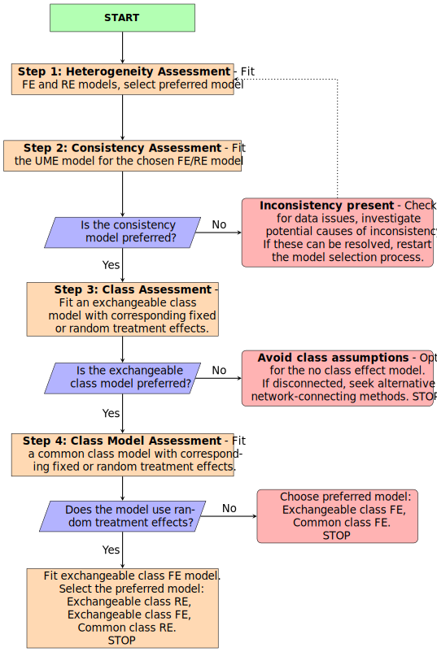

```{r, code=readLines("children/knitr_setup.R"), include=FALSE}
```

```{r include=FALSE, setup}
library(multinma)
library(dplyr)      # dplyr and tidyr for data manipulation
library(tidyr)
library(ggplot2)    # ggplot2 for plotting
```
```{r, include=FALSE}
options(mc.cores = parallel::detectCores())
```
```{r, include=FALSE}
nc <- switch(tolower(Sys.getenv("_R_CHECK_LIMIT_CORES_")), 
             "true" =, "warn" = 2, 
             parallel::detectCores())
options(mc.cores = nc)
```
This vignette describes the analysis of 101 trials comparing 41 first-line treatments in 17 classes for social anxiety disorder in adults [@mayo2014psychological]. The data are available in this package as `social_anxiety`:

```{r}
head(social_anxiety)
```

@mayo2014psychological analysed this dataset using a NMA model with class effects, which we recreate here. When fitting class effects models there are multiple modeling options available. 

We demonstrate the model selection strategy proposed by @Perren2025 to determine the most suitable class effects model. 

# Setting up the network
We follow Mayo-Wilson et al. by analysing results as standardised mean differences (`y`) with standard errors (`se`) therefore we use the function `set_agd_contrast` to set up the network. We set treatment classes with `trt_class = classc` and set `Waitlist` as the network reference treatment.

```{r}
sa_net <- set_agd_contrast(social_anxiety,
                           study = studyc, 
                           trt = trtc,
                           y = y, 
                           sample_size = 1,
                           se = se,
                           trt_class = classc,
                           trt_ref = "Waitlist")

sa_net
```

We create a plot at the class level by setting `level = "class"`.

```{r}
plot(sa_net, level = "class", weight_nodes = TRUE) + 
  theme(legend.position = "bottom", legend.box = "vertical")
```

# Model selection strategy
We follow the model selection strategy proposed by @Perren2025



## STEP 1: Heterogeniety assessement
First, we assess heterogeneity by fitting fixed effects (FE) and random effects (RE) models using `nma()` and stating `trt_effects = "random"` for the RE model and `trt_effects = "fixed"` for the FE model. We use uninformative priors on the treatment effects with `prior_trt = normal(0, 100)` and heterogeneity with `prior_het = half_normal(5)`.

```{r echo=TRUE, results='hide'}
set.seed(951)
sa_fit_FE <- nma(sa_net,
                 trt_effects = "fixed",
                 prior_trt = normal(0, 100),
                 prior_het = half_normal(5),
)

sa_fit_RE <- nma(sa_net,
                 trt_effects = "random",
                 prior_trt = normal(0, 100),
                 prior_het = half_normal(5),
)
```

The model fit under the FE and RE models can be checked using the `dic()` function.

```{r}
(sa_dic_FE <- dic(sa_fit_FE))
(sa_dic_RE <- dic(sa_fit_RE))
```

The DIC for the random effects model (`r sprintf("%.1f", sa_dic_RE$dic)`) is much lower than that of the fixed effects model (`r (sprintf("%.1f", sa_dic_FE$dic))`) due to the large decrease in residual deviance showing a much better fit to the data. Therefore, our preferred model is the RE model, which we use in subsequent steps.

## STEP 2: Consistency assessment
The next step is to assess inconsistency using an unrelated mean effects model (UME), comparing model fit statistics for the UME model and the NMA (consistency) model, both with RE. To fit a UME model we specify `consistency = "ume"`. 

```{r echo=TRUE, results='hide'}
sa_UME_RE <- nma(sa_net,
                 trt_effects = "random",
                 consistency = "ume",
                 prior_trt = normal(0, 100),
                 prior_het = half_normal(5))
```

We compare model fit from the NMA (consistency) RE model and the UME RE model using the `dic()` function and $\tau$.

```{r}
(sa_dic_RE <- dic(sa_fit_RE))
(sa_dic_ume_RE <- dic(sa_UME_RE))

summary(sa_UME_RE, pars = "tau")
summary(sa_fit_RE, pars = "tau")
```

The residual deviance is not meaningfully different between the two models, however, the DIC is lower in the NMA model (`r (sprintf("%.1f", sa_dic_RE$dic))`) compared to the UME model (`r (sprintf("%.1f", sa_dic_ume_RE$dic))`). There is no evidence of inconsistency at the global level. 

To asses local inconsistency, we use the `plot()` function that produces a "dev-dev" plot of the residual deviance contributions for the UME model plotted against the NMA consistency model.

```{r}
plot(sa_dic_RE, sa_dic_ume_RE, show_uncertainty = FALSE) +
  xlab("Residual deviance - No Class model") +
  ylab("Residual deviance - UME model")
```

The dev-dev plot comparing residual deviance contributions for the UME model and no-class model shows that most data points lie close to the line of equality. 

```{r}
as.data.frame(sa_dic_RE) %>%
  arrange(desc(resdev)) %>%
  head(5)
```

We can see from investigating the pointwise contributions to the residual deviance that the two outlier studies are ALDEN2011 and EMMELKAMP2006 with their large `resdev` values in the no class model. 

We can explore the consistency of specific evidence loops using node-splitting by setting `consistency = "nodesplit"`. However, given the size of the network, running node-splitting on all comparisons would be computationally intensive. We instead run the node-splitting analysis specifically for the loops that include the studies identified in the dev-dev plots (ALDEN2011 and EMMELKAMP2006). We first define the specific treatment comparisons of interest by creating two data frames that specify the desired treatment comparisons. These are then passed to the `nodesplit` argument within the `nma()` function. 

```{r echo=TRUE, results='hide', eval=!params$run_tests}
EMMELKAMP2006 <- data.frame(
  Treatment_1 = c("CBT individual", "Waitlist", "Waitlist"),
  Treatment_2 = c("Psychodynamic psychotherapy", "Psychodynamic psychotherapy", "CBT individual")
)

ALDEN2011 <- data.frame(
  Treatment_1 = c("Waitlist"),
  Treatment_2 = c("CBT group")
)

sa_fit_RE_nodesplit_EMMELKAMP <- nma(sa_net,
                           consistency = "nodesplit",
                           nodesplit = EMMELKAMP2006,
                           trt_effects = "random",
                           prior_trt = normal(0, 100),
                           prior_het = half_normal(5),
)

sa_fit_RE_nodesplit_ALDEN <- nma(sa_net,
                             consistency = "nodesplit",
                             nodesplit = ALDEN2011,
                             trt_effects = "random",
                             prior_trt = normal(0, 100),
                             prior_het = half_normal(5),
)
```

```{r, eval=!params$run_tests}
summary(sa_fit_RE_nodesplit_ALDEN)
summary(sa_fit_RE_nodesplit_EMMELKAMP)
```

Our node‐splitting analysis shows that the CBT individual and Waitlist comparison has a p-value of 0.065 and a stronger effect for the indirect estimate compared to the direct estimate, however the CrIs do overlap and both estimates are in the same direction and do not include 0. This indicates no evidence of inconsistency in the network meta‐analysis. However, studies should be reviewed and sensitivity analyses are advised.

## STEP 3: Class effects assessment

In this step, we assess whether a class assumption is suitable for the data by comparing our NMA RE model with an exchangeable class model with a RE treatment model. In this model, we specify `class_effects = "exchangeable"`, meaning that treatments within each class are considered to be from a common distribution. The `prior_class_sd` sets a prior on the standard deviation between treatment effects within each class. Because it is difficult to estimate the class standard deviations with only a small number of treatments in each class, here we specify an informative $\mathrm{N}(0.33,0.1^2)$ prior distribution that is chosen to keep class variability within a clinically-plausible range [@Perren2025]. We also define `class_sd` as a list of character vectors indicating which classes share a common SD, again aiding estimation of these parameters. For the class effects means, `prior_class_mean` is set as $\mathrm{N}(0, 10^2)$.

```{r echo=TRUE, results='hide'}
sa_fit_EXclass_RE <- nma(sa_net,
                         trt_effects = "random",
                         prior_trt = normal(0, 100),
                         prior_het = half_normal(5),
                         class_effects = "exchangeable",
                         prior_class_mean = normal(0, 10),
                         prior_class_sd = normal(0.33,0.1),
                         class_sd = 
                           list(`Exercise and SH no support` = 
                                  c("Exercise promotion", "Self-help no support"),
                                `SSRIs and NSSA` = 
                                  c("SSRI/SNRI", "NSSA"),
                                `Psychodynamic & Other psychological therapies` =
                                  c("Psychodynamic psychotherapy", "Other psychological therapies"))
                         )
```

We compare model fit from the Exchangeable class RE model and the no class RE model using the `dic()` function and $\tau$.

```{r}
(sa_dic_EXclass_RE <- dic(sa_fit_EXclass_RE))
(sa_dic_RE <- dic(sa_fit_RE))

summary(sa_fit_RE, pars = "tau")
summary(sa_fit_EXclass_RE, pars = "tau")
```

We use the `plot()` function that produces a "dev-dev" plot of the residual deviance contributions for the Exchangeable class model plotted against the no class model.

```{r}
plot(sa_dic_EXclass_RE, sa_dic_RE, show_uncertainty = FALSE) +
  xlab("Residual deviance - Exchangeable Class model") +
  ylab("Residual deviance - No Class model")
```

Although both models yield similar residual deviance (`r (sprintf("%.1f", sa_dic_EXclass_RE$resdev))` vs. `r (sprintf("%.1f", sa_dic_RE$resdev))`) and between‐study heterogeneity, the exchangeable class model reduces model complexity—reflected by a lower effective number of parameters (`r (sprintf("%.1f", sa_dic_EXclass_RE$pD))` vs. `r (sprintf("%.1f", sa_dic_RE$pd))`) and a lower DIC (`r (sprintf("%.1f", sa_dic_EXclass_RE$dic))` vs. `r (sprintf("%.1f", sa_dic_RE$dic))`). A deviance–deviance plot confirms that all data points fit equally well. Overall, these findings support using the class model for the social anxiety data.

## STEP 4: Class Model Assessment

After we have determined that a class effects model is appropriate, it is time to finalise which combination of common or exchangeable class effects and fixed or random treatment effects provides the most suitable model fit. As we are using a random effects model, we now fit 2 other models to our data; Exchangeable class FE and Common class RE. This gives us a total of 3 models to compare. Exchangeable class FE, Exchangeable class RE and Common class RE.

```{r echo=TRUE, results='hide'}
sa_fit_COclass_RE <- nma(sa_net,
                         trt_effects = "random",
                         prior_trt = normal(0, 100),
                         prior_het = half_normal(5),
                         class_effects = "common")

sa_fit_EXclass_FE <- nma(sa_net,
                         trt_effects = "fixed",
                         prior_trt = normal(0, 100),
                         prior_het = half_normal(5),
                         class_effects = "exchangeable",
                         prior_class_mean = normal(0, 10),
                         prior_class_sd = normal(0.33,0.1),
                         class_sd = 
                           list(`Exercise and SH no support` = 
                                  c("Exercise promotion", "Self-help no support"),
                                `SSRIs and NSSA` = 
                                  c("SSRI/SNRI", "NSSA"),
                                `Psychodynamic & Other psychological therapies` = 
                                  c("Psychodynamic psychotherapy", "Other psychological therapies"))
                         )
```

We compare model fit from all three models using the `dic()` function and evaluate $\tau$ in the common class RE model and the exchangeable class RE model.

```{r}
(sa_dic_COclass_RE <- dic(sa_fit_COclass_RE))
(sa_dic_EXclass_FE <- dic(sa_fit_EXclass_FE))
(sa_dic_EXclass_RE <- dic(sa_fit_EXclass_RE))

summary(sa_fit_COclass_RE, pars = "tau")
summary(sa_fit_EXclass_RE, pars = "tau")
```

Both random‐effects models showed substantially better fit than the fixed‐effect model (posterior mean residual deviance of `r (sprintf("%.1f", sa_dic_COclass_RE$resdev))` and `r (sprintf("%.1f", sa_dic_EXclass_RE$resdev))` versus `r (sprintf("%.1f", sa_dic_EXclass_FE$resdev))`, and DIC values of `r (sprintf("%.1f", sa_dic_COclass_RE$dic))` and `r (sprintf("%.1f", sa_dic_EXclass_RE$dic))` versus `r (sprintf("%.1f", sa_dic_EXclass_FE$dic))`). Although the common class model achieved a slightly better absolute fit, it had higher between‐study heterogeneity (0.25 vs. 0.20) than the exchangeable class model.
We use the `plot()` function to produce a "dev-dev" plot of the residual deviance contributions for the Exchangeable class model plotted against the no class model.

```{r}
plot(sa_dic_COclass_RE, sa_dic_EXclass_RE, show_uncertainty = FALSE) +
  xlab("Residual deviance - Common Class model") +
  ylab("Residual deviance - Exchangeable Class model")
```

The dev–dev plot indicates that while some data points favor one model over the other, overall the fit is similar. Therefore, given nearly identical DIC scores, the choice between the two random‐effects models should be guided by clinical considerations: use the exchangeable class model if reporting distinct treatment‐level effects is important, or the common class model if the focus is on class-level effects and not concerned with potential variability of treatment effects within classes.

# Results for final chosen model

## Relative treatment effects 
Relative treatment effects are produced with the `relative_effects()` function, and can be plotted using `plot()`.
```{r}
plot(relative_effects(sa_fit_EXclass_RE), ref_line = 0)
```

## Relative class effects
We can produce a plot showing relative class effects against `Waitlist` using `plot()` with `pars = "class_mean"` to select these parameters.

```{r}
plot(sa_fit_EXclass_RE,
     pars = "class_mean",
     ref_line = 0)
```

We can combine the treatment and class effects into a single plot as follows:
```{r fig.height=8}
# Relative treatment effects
trt_eff <- as_tibble(relative_effects(sa_fit_EXclass_RE)) %>% 
  # Add in class details
  mutate(Class = sa_net$classes[as.numeric(.trtb)],
         level = "treatment")

# Class effects
class_eff <- as_tibble(summary(sa_fit_EXclass_RE, pars = "class_mean")) %>% 
  # Extract class details
  mutate(Class = factor(gsub(".*\\[(.+)\\]", "\\1", parameter), levels = levels(sa_net$classes)),
         level = "class",
         .trtb = factor("Class Mean", levels = c(levels(sa_net$classes), "Class Mean")))

# Combine and plot
bind_rows(trt_eff, class_eff) %>% 
  ggplot(aes(y = .trtb, 
             x = mean, xmin = `2.5%`, xmax = `97.5%`,
             colour = level, shape = level)) +
  geom_vline(xintercept = 0, colour = "grey60") +
  geom_pointrange() +
  facet_grid(rows = "Class", scales = "free", space = "free", labeller = label_wrap_gen(22)) +
  scale_shape_manual(values = c(15, 16), guide = guide_none()) +
  scale_colour_manual(values = c("#113259", "#55A480"), guide = guide_none()) +
  xlab("SMD") + ylab("") +
  theme_multinma() +
  theme(strip.text.y = element_text(angle = 0))
```


We aim to visualize the class ranks and rank probabilities by summarizing their distributions. To achieve this, we extract the posterior draws for class means, add a reference treatment, and compute the rank of each treatment at every iteration. We then summarize these ranks by calculating the median and 95% credible intervals to generate a point-range plot and derive the rank probability distributions for each treatment class, which we then plot.
```{r}
# Class means
EXclass_mean <- as.matrix(sa_fit_EXclass_RE, pars = "class_mean")

EXclass_mean <- cbind(`d[Reference]` = 0, EXclass_mean)

# Take ranks at each iteration
EXranks <- t(apply(EXclass_mean, 1, rank))

# Get median rank and 95% credible interval
EXresults <- t(apply(EXranks, 2, quantile, probs = c(0.025, 0.5, 0.975)))

# Convert to data frame
EXresults_df <- as.data.frame(EXresults)
EXresults_df$class <- rownames(EXresults_df)

EXresults_df$class <- factor(EXresults_df$class, 
                             levels = sort(unique(EXresults_df$class), decreasing = TRUE))

ggplot(EXresults_df, aes(x=class, y=`50%`, ymin=`2.5%`, ymax=`97.5%`)) +
geom_pointrange(size = 0.5) +
coord_flip() +
xlab("Class") + ylab("Posterior Ranks") +
theme_multinma()
```

Treatment classes with higher ranks have median values closer to 1, positioned toward the left of the x-axis. The Combined treatment class has the highest median rank, followed by CBT individual. In contrast, Exercise promotion appears to have the lowest rank among the treatment classes, aside from the reference.

We now calculate and plot the class rank probabilities.

```{r}
EXranks_df <- as.data.frame(EXranks)

# Rank probabilities for class
rank_probs_EX <- apply(EXranks_df, 2, function(x) table(factor(x, levels = 1:ncol(EXranks_df))) / nrow(EXranks_df))

# Convert to data frame
rank_probs_df_EX <- as.data.frame(rank_probs_EX)

# Convert the data frame to a long format
rank_probs_long_EX <- rank_probs_df_EX %>%
  mutate(Rank = row_number()) %>%
  pivot_longer(
    cols = -Rank,
    names_to = "Class",
    values_to = "Probability"
  )

# Plot density
ggplot(rank_probs_long_EX, aes(x = Rank, y = Probability)) +
  geom_line() +
  facet_wrap(~ Class) +
  theme_multinma() +
  labs(x = "Rank",
       y = "Probability")
```

Higher-ranked classes have a greater density on the left side of the x-axis, indicating a higher probability of achieving a top rank across posterior samples. The Combined class shows the highest density on the left, suggesting it is most likely to be ranked among the top treatments, followed by CBT individual. In contrast, most other classes have relatively flat distributions, reflecting greater uncertainty in their rankings. Exercise promotion, Other psychological therapies, and the reference class have densities skewed toward the right, indicating a higher probability of lower rankings.

# References
```{r smoking_tests, include=FALSE, eval=params$run_tests}
#--- Test against TSD 4 results ---
library(testthat)
library(dplyr)

tol <- 0.05
tol_dic <- 0.1

# Relative effects
sa_EX_RE_releff <- as.data.frame(relative_effects(sa_fit_EXclass_RE))

# EX RE model parameters
test_ex_re <- tribble(
  ~parameter, ~mean, ~sd, ~`2.5%`, ~`50%`, ~`97.5%`,
  "d[Alprazolam]", -0.8314958, 0.28125207, -1.3755076, -0.8307162, -0.27711275,
  "d[CBT group]", -0.8142867, 0.09621211, -1.0065441, -0.8131570, -0.63148837,
  "d[CBT group + Fluoxetine]", -0.9211830, 0.19446183, -1.3156687, -0.9204697, -0.54765137,
  "d[CBT group + Moclobemide]", -1.2066027, 0.25000952, -1.6962705, -1.213031, -0.70271794,
  "d[CBT group + Phenelzine]", -1.6973883, 0.22347273, -2.1374866, -1.6956205, -1.26489286,
  "d[CBT group Enhanced]", -1.0473793, 0.21208307, -1.4793471, -1.0441864, -0.64037100,
  "d[CBT group Heimberg]", -0.7791976, 0.11644941, -1.0081920, -0.7790447, -0.55037257,
  "d[CBT individual]", -1.1730443, 0.15200737, -1.4664337, -1.1747683, -0.87424063,
  "d[CBT individual Heimberg]", -1.0210418, 0.19936795, -1.4083739, -1.0193569, -0.62629645,
  "d[Citalopram]", -0.8467242, 0.19163580, -1.2173637, -0.8569810, -0.43683285,
  "d[Clonazapam]", -1.0556030, 0.19780158, -1.4377446, -1.0581377, -0.67179776,
  "d[Cognitive therapy]", -1.5262932, 0.15985534, -1.8486260, -1.5249683, -1.21370893,
  "d[Cognitive therapy shortened sessions]", -0.9947664, 0.12715601, -1.2402119, -0.9965832, -0.73904361,
  "d[Escitalopram]", -0.8607573, 0.15488520, -1.1585547, -0.8654861, -0.54829102,
  "d[Exercise promotion]", -0.1805154, 0.40643886, -0.9872490, -0.1819663, 0.60912243,
  "d[Exposure in vivo]", -0.8190751, 0.13069686, -1.0765767, -0.8175697, -0.56103203,
  "d[Fluoxetine]", -0.8576191, 0.14304817, -1.1261241, -0.8605516, -0.57023950,
  "d[Fluvoxamine]", -0.9064442, 0.15317111, -1.2144374, -0.9042166, -0.60930856,
  "d[Gabapentin]", -0.8511784, 0.26831004, -1.3791457, -0.8477352, -0.32055234,
  "d[Interpersonal psychotherapy]", -0.4179080, 0.20660264, -0.8173726, -0.4137257, -0.01862694,
  "d[Levetiracetam]", -0.7959018, 0.32429393, -1.4507038, -0.7888249, -0.16125339,
  "d[Mindfulness]", -0.3321746, 0.21466120, -0.7685138, -0.3299451, 0.09519575,
  "d[Mirtazapine]", -0.7650427, 0.33297935, -1.4222047, -0.7676135, -0.11613886,
  "d[Moclobemide]", -0.7108082, 0.15076437, -1.0025218, -0.7098811, -0.41162089,
  "d[Paroxetine]", -0.9518310, 0.13803974, -1.2327792, -0.9530097, -0.68226256,
  "d[Paroxetine + Clonazapam]", -1.3265332, 0.29791193, -1.9052410, -1.3210094, -0.74984083,
  "d[Phenelzine]", -1.2715405, 0.15435898, -1.5720287, -1.2731792, -0.95776860,
  "d[Pill placebo]", -0.4342747, 0.12462281, -0.6844952, -0.4348165, -0.18907267,
  "d[Pregabalin]", -0.6868730, 0.18355833, -1.0606219, -0.6856703, -0.33094991,
  "d[Psychodynamic + Clonazepam]", -1.2161722, 0.28910209, -1.7912116, -1.2176852, -0.65840233,
  "d[Psychodynamic psychotherapy]", -0.6235235, 0.16406580, -0.9554527, -0.6227220, -0.29926675,
  "d[Psychological placebo]", -0.6467276, 0.15004879, -0.9335005, -0.6508577, -0.35282347,
  "d[Self-help book no support]", -0.7338743, 0.12963766, -0.9942650, -0.7345158, -0.48176798,
  "d[Self-help book with support]", -0.8347549, 0.17192892, -1.1769224, -0.8370861, -0.49302079,
  "d[Self-help internet no support]", -0.6028340, 0.14218310, -0.8756893, -0.6037919, -0.32938047,
  "d[Self-help internet with support]", -0.8435101, 0.08756184, -1.0161868, -0.8422352, -0.67559595,
  "d[Sertraline]", -0.8870449, 0.15228323, -1.1909221, -0.8867806, -0.57684247,
  "d[Social skills training]", -0.8263210, 0.27080686, -1.3600444, -0.8290302, -0.29391996,
  "d[Supportive therapy]", -0.2475428, 0.23241985, -0.6929505, -0.2487845, 0.21323466,
  "d[Venlafaxine]", -0.9027961, 0.14619543, -1.1883951, -0.9010945, -0.61143773)

test_that("FE relative effects", {
  expect_equivalent(sa_EX_RE_releff$mean, test_ex_re$mean, tolerance = tol)
  expect_equivalent(sa_EX_RE_releff$sd, test_ex_re$sd, tolerance = tol)
  expect_equivalent(sa_EX_RE_releff$`2.5%`, test_ex_re$`2.5%`, tolerance = tol)
  expect_equivalent(sa_EX_RE_releff$`50%`, test_ex_re$`50%`, tolerance = tol)
  expect_equivalent(sa_EX_RE_releff$`97.5%`, test_ex_re$`97.5%`, tolerance = tol)
})

# DIC checks
test_that("FE DIC", {
  expect_equivalent(sa_dic_FE$resdev, 288.3, tolerance = tol_dic)
  expect_equivalent(sa_dic_FE$pd, 40.1, tolerance = tol_dic)
  expect_equivalent(sa_dic_FE$dic, 328.4, tolerance = tol_dic)
})

test_that("RE DIC", {
  expect_equivalent(sa_dic_RE$resdev, 162.6, tolerance = tol_dic)
  expect_equivalent(sa_dic_RE$pd, 94.8, tolerance = tol_dic)
  expect_equivalent(sa_dic_RE$dic, 257.4, tolerance = tol_dic)
})

test_that("UME RE DIC", {
  expect_equivalent(sa_dic_ume_RE$resdev, 160.7, tolerance = tol_dic)
  expect_equivalent(sa_dic_ume_RE$pd, 108.3, tolerance = tol_dic)
  expect_equivalent(sa_dic_ume_RE$dic, 269, tolerance = tol_dic)
})

test_that("EX RE DIC", {
  expect_equivalent(sa_dic_EXclass_RE$resdev, 162.5, tolerance = tol_dic)
  expect_equivalent(sa_dic_EXclass_RE$pd, 87.6, tolerance = tol_dic)
  expect_equivalent(sa_dic_EXclass_RE$dic, 250.1, tolerance = tol_dic)
})

test_that("CO RE DIC", {
  expect_equivalent(sa_dic_COclass_RE$resdev, 158.4, tolerance = tol_dic)
  expect_equivalent(sa_dic_COclass_RE$pd, 93.1, tolerance = tol_dic)
  expect_equivalent(sa_dic_COclass_RE$dic, 251.5, tolerance = tol_dic)
})

test_that("EX FE DIC", {
  expect_equivalent(sa_dic_EXclass_FE$resdev, 285, tolerance = tol_dic)
  expect_equivalent(sa_dic_EXclass_FE$pd, 34.5, tolerance = tol_dic)
  expect_equivalent(sa_dic_EXclass_FE$dic, 319.4, tolerance = tol_dic)
})

#--- Tau checks ---
CO_RE_tau <- summary(sa_fit_COclass_RE, pars = "tau")
EX_RE_tau <- summary(sa_fit_EXclass_RE, pars = "tau")
RE_tau <- summary(sa_fit_RE, pars = "tau")
UME_RE_tau <- summary(sa_UME_RE, pars = "tau")

test_that("CO RE Tau", {
  expect_equivalent(CO_RE_tau$summary$mean, 0.252, tolerance = tol)
  expect_equivalent(CO_RE_tau$summary$sd, 0.0291, tolerance = tol)
  expect_equivalent(CO_RE_tau$summary$`2.5%`, 0.198, tolerance = tol)
  expect_equivalent(CO_RE_tau$summary$`50%`, 0.251, tolerance = tol)
  expect_equivalent(CO_RE_tau$summary$`97.5%`, 0.312, tolerance = tol)
})

test_that("EX RE Tau", {
  expect_equivalent(EX_RE_tau$summary$mean, 0.196, tolerance = tol)
  expect_equivalent(EX_RE_tau$summary$sd, 0.0298, tolerance = tol)
  expect_equivalent(EX_RE_tau$summary$`2.5%`, 0.142, tolerance = tol)
  expect_equivalent(EX_RE_tau$summary$`50%`, 0.195, tolerance = tol)
  expect_equivalent(EX_RE_tau$summary$`97.5%`, 0.257, tolerance = tol)
})

test_that("RE Tau", {
  expect_equivalent(RE_tau$summary$mean, 0.207, tolerance = tol)
  expect_equivalent(RE_tau$summary$sd, 0.0308, tolerance = tol)
  expect_equivalent(RE_tau$summary$`2.5%`, 0.149, tolerance = tol)
  expect_equivalent(RE_tau$summary$`50%`, 0.207, tolerance = tol)
  expect_equivalent(RE_tau$summary$`97.5%`, 0.269, tolerance = tol)
})

test_that("UME RE Tau", {
  expect_equivalent(EX_RE_tau$summary$mean, 0.221, tolerance = tol)
  expect_equivalent(EX_RE_tau$summary$sd, 0.0333, tolerance = tol)
  expect_equivalent(EX_RE_tau$summary$`2.5%`, 0.158, tolerance = tol)
  expect_equivalent(EX_RE_tau$summary$`50%`, 0.221, tolerance = tol)
  expect_equivalent(EX_RE_tau$summary$`97.5%`, 0.289, tolerance = tol)
})

# nodesplit_ALDEN <- summary(sa_fit_RE_nodesplit_ALDEN)
# nodesplit_EMMELKAMP <- summary(sa_fit_RE_nodesplit_EMMELKAMP)
# 
# ALDEN_test <- tribble(
#   ~parameter, ~mean, ~sd, ~`2.5%`, ~`50%`, ~`97.5%`,
#   "d_dir[CBT group vs. Waitlist]", -0.90, 0.13, -1.16, -0.90, -0.64,
#   "d_ind[CBT group vs. Waitlist]", -0.73, 0.13, -0.99, -0.73, -0.46,
#   "omega", -0.17, 0.17, -0.51, -0.17, 0.18,
#   "tau", 0.21, 0.03, 0.15, 0.21, 0.27
# )
# 
# 
# EMMELKAMP_test1 <- tribble(
#   ~parameter, ~mean, ~sd, ~`2.5%`, ~`25%`, ~`50%`, ~`75%`, ~`97.5%`, ~Bulk_ESS, ~Tail_ESS, ~Rhat,
#   "d_dir", 0.71, 0.33, 0.06, 0.49, 0.71, 0.94, 1.35, 5354, 2759, 1.00,
#   "d_ind", 0.45, 0.26, -0.07, 0.27, 0.45, 0.63, 0.96, 4159, 3058, 1.00,
#   "omega", 0.26, 0.39, -0.51, 0.00, 0.25, 0.53, 1.02, 4849, 3147, 1.00,
#   "tau", 0.21, 0.03, 0.15, 0.19, 0.21, 0.23, 0.27, 1291, 2516, 1.01
# )
# 
# EMMELKAMP_test2 <- tribble(
#   ~parameter, ~mean, ~sd, ~`2.5%`, ~`25%`, ~`50%`, ~`75%`, ~`97.5%`, ~Bulk_ESS, ~Tail_ESS, ~Rhat,
#   "d_dir", -0.61, 0.19, -0.96, -0.73, -0.61, -0.48, -0.22, 5103, 3262, 1.00,
#   "d_ind", -0.68, 0.42, -1.49, -0.96, -0.68, -0.40, 0.15, 4157, 3138, 1.00,
#   "omega", 0.08, 0.46, -0.84, -0.23, 0.07, 0.39, 0.98, 4293, 2877, 1.00,
#   "tau", 0.21, 0.03, 0.15, 0.19, 0.21, 0.23, 0.27, 959, 1921, 1.00
# )
# 
# EMMELKAMP_test3 <- tribble(
#   ~parameter, ~mean, ~sd, ~`2.5%`, ~`25%`, ~`50%`, ~`75%`, ~`97.5%`, ~Bulk_ESS, ~Tail_ESS, ~Rhat,
#   "d_dir", -0.84, 0.25, -1.32, -1.00, -0.84, -0.67, -0.36, 4676, 3392, 1,
#   "d_ind", -1.46, 0.24, -1.93, -1.62, -1.46, -1.30, -0.99, 1466, 2413, 1,
#   "omega", 0.62, 0.34, -0.04, 0.39, 0.62, 0.85, 1.31, 1999, 2802, 1,
#   "tau", 0.20, 0.03, 0.15, 0.18, 0.20, 0.22, 0.26, 1238, 1834, 1
# )
# 
# test_that("Node-splitting estimates_ALDEN", {
#   expect_equal(ALDEN_test$mean, as.numeric(nodesplit_ALDEN$summary[[1]]$summary$mean), tolerance = tol)
#   expect_equal(ALDEN_test$sd, as.numeric(nodesplit_ALDEN$summary[[1]]$summary$sd), tolerance = tol)
#   expect_equal(ALDEN_test$`2.5%`, as.numeric(nodesplit_ALDEN$summary[[1]]$summary$`2.5%`), tolerance = tol)
#   expect_equal(ALDEN_test$`50%`, as.numeric(nodesplit_ALDEN$summary[[1]]$summary$`50%`), tolerance = tol)
#   expect_equal(ALDEN_test$`97.5%`, as.numeric(nodesplit_ALDEN$summary[[1]]$summary$`97.5%`), tolerance = tol)
# })
# 
# test_that("Node-splitting estimates_EMMEL1", {
#   expect_equal(EMMELKAMP_test1$mean, as.numeric(nodesplit_EMMELKAMP$summary[[1]]$summary$mean), tolerance = tol)
#   expect_equal(EMMELKAMP_test1$sd, as.numeric(nodesplit_EMMELKAMP$summary[[1]]$summary$sd), tolerance = tol)
#   expect_equal(EMMELKAMP_test1$`2.5%`, as.numeric(nodesplit_EMMELKAMP$summary[[1]]$summary$`2.5%`), tolerance = tol)
#   expect_equal(EMMELKAMP_test1$`50%`, as.numeric(nodesplit_EMMELKAMP$summary[[1]]$summary$`50%`), tolerance = tol)
#   expect_equal(EMMELKAMP_test1$`97.5%`, as.numeric(nodesplit_EMMELKAMP$summary[[1]]$summary$`97.5%`), tolerance = tol)
# })
# 
# test_that("Node-splitting estimates_EMMEL2", {
#   expect_equal(EMMELKAMP_test2$mean, as.numeric(nodesplit_EMMELKAMP$summary[[2]]$summary$mean), tolerance = tol)
#   expect_equal(EMMELKAMP_test2$sd, as.numeric(nodesplit_EMMELKAMP$summary[[2]]$summary$sd), tolerance = tol)
#   expect_equal(EMMELKAMP_test2$`2.5%`, as.numeric(nodesplit_EMMELKAMP$summary[[2]]$summary$`2.5%`), tolerance = tol)
#   expect_equal(EMMELKAMP_test2$`50%`, as.numeric(nodesplit_EMMELKAMP$summary[[2]]$summary$`50%`), tolerance = tol)
#   expect_equal(EMMELKAMP_test2$`97.5%`, as.numeric(nodesplit_EMMELKAMP$summary[[2]]$summary$`97.5%`), tolerance = tol)
# })
# 
# test_that("Node-splitting estimates_EMMEL3", {
#   expect_equal(EMMELKAMP_test3$mean, as.numeric(nodesplit_EMMELKAMP$summary[[3]]$summary$mean), tolerance = tol)
#   expect_equal(EMMELKAMP_test3$sd, as.numeric(nodesplit_EMMELKAMP$summary[[3]]$summary$sd), tolerance = tol)
#   expect_equal(EMMELKAMP_test3$`2.5%`, as.numeric(nodesplit_EMMELKAMP$summary[[3]]$summary$`2.5%`), tolerance = tol)
#   expect_equal(EMMELKAMP_test3$`50%`, as.numeric(nodesplit_EMMELKAMP$summary[[3]]$summary$`50%`), tolerance = tol)
#   expect_equal(EMMELKAMP_test3$`97.5%`, as.numeric(nodesplit_EMMELKAMP$summary[[3]]$summary$`97.5%`), tolerance = tol)
# })
```


